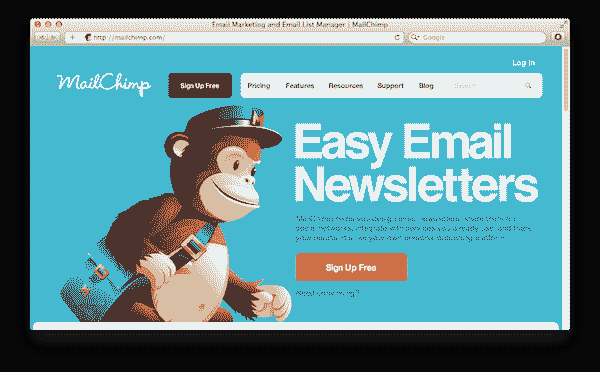
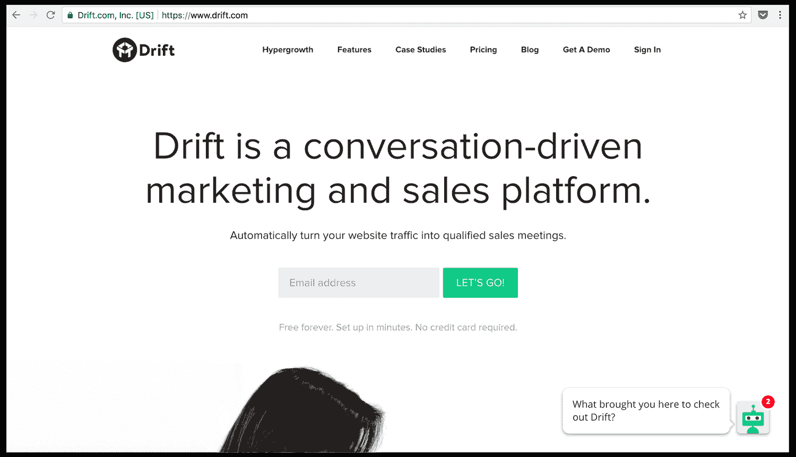
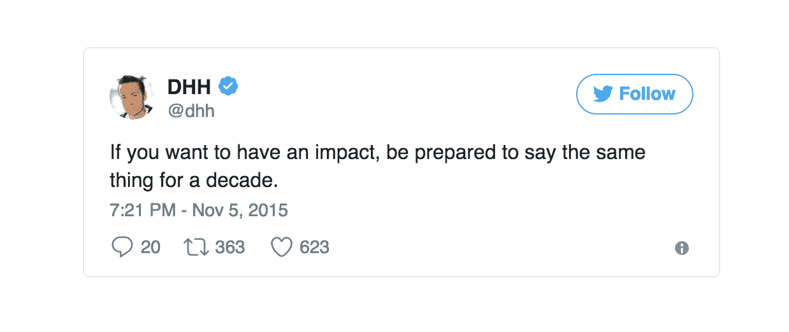

# 如何建立品牌，培养谈论你创业的粉丝

> 原文：<http://growthsupply.com/build-startup-movement/?utm_source=wanqu.co&utm_campaign=Wanqu+Daily&utm_medium=website>

作为一名创业营销人员，我不喜欢在午休时间与开发者争论。

“这是胡说八道，”我们的首席技术官回答。“MailChimp 的产品并不比其他产品更好；这只是另一个发送简讯的工具。当他们的竞争对手以几美元的价格提供同样的东西时，为什么要每月花费 200 美元？”

我想说服他，MailChimp 确保我们的电子邮件活动触及客户的收件箱，而不是他们的垃圾邮件文件夹。

但是他一直用我不能完全理解的技术解释来反驳我。

“看，我们甚至可以建立自己的电子邮件机器人来做同样的事情，”他补充道。“你只是被他们的品牌所吸引。”

嗯，他有一部分是对的。

在过去的几年里，MailChimp 通过以设计为中心的方法和非传统的营销活动建立了一个标志性的品牌。

猴子吉祥物[广告牌](https://blog.mailchimp.com/the-story-behind-the-mailchimp-billboards/)没有提到他们的名字……“MailKimp”和其他取笑名字的活动[影响了 3 . 34 亿人](https://twitter.com/benchestnut/status/871678778782756864) …以设计为中心的[年度报告](https://mailchimp.com/2016/)伴随着时尚而来…

MailChimp 的赠品也是非传统的。给猫免费的猴帽让像我这样的超级粉丝很高兴，他们愿意花更多的钱。

在一个任何人都可以在一夜之间复制你的产品的世界里，MailChimp 很可能会选择加入构建更多功能的军备竞赛，而不是为猫编织猴子帽。

毕竟，该公司甚至收到了来自一些大客户的公开信和 T2 警告，威胁说如果他们不开发更先进的功能，就会转向竞争。

MailChimp 的回答？

> 专注于建立顾客喜爱的品牌。

当我们接近 2017 年底时，这家从未从外部融资中获得过[一分钱的电子邮件初创公司正准备以令人震惊的 1500 万客户来结束这一年。](https://www.nytimes.com/2016/10/06/technology/mailchimp-and-the-un-silicon-valley-way-to-make-it-as-a-start-up.html)

别再胡闹了。

让我们从大的方面来理解这对试图在当今混乱的世界中取得成功的创业公司意味着什么:

1.  你不必颠覆整个行业:尽管许多企业家正忙于打造下一个优步或脸书，但这是一个我们需要打破的神话。MailChimp 没有扰乱任何行业，但它成功地在一个日益拥挤的市场中建立了自己的猴子帝国。
2.  如果你没有破坏或创造一个全新的市场，你仍然可以在一个竞争激烈的空间建立一个帝国:这涉及到越来越多的超级粉丝，他们虔诚地跟踪你的运动，传播关于你的消息，即使你收取高价或拒绝加入建立更多功能的军备竞赛。

然而，秘密是什么呢？

你如何接触大众并发展你的粉丝俱乐部，使你能够按照自己的规则玩游戏，而不用担心竞争？

选择多种多样，但一些世界上最成功的创业公司使用两种强有力的策略:

第一种显然是“MailChimp 方式”，即像推销高质量品牌一样推销你的产品。正如他们的创始人本·切斯特纳特所说:

> “我们使用低价部件为商业客户制作应用，然后像一个高质量、以设计为中心、可爱的 B2C 品牌一样营销这些应用。”

但是，越来越多蓬勃发展的初创公司采用了另一种策略——不一定需要以设计为中心的方法。

相反，它需要影响人们的思维:

## 不要扰乱一个行业，扰乱思维

正如马克·邦切克在他广受欢迎的哈佛论文中所强调的:

> “成功营销和销售创新的公司不仅能够改变人们对产品的看法，还能改变他们对自身、市场和世界的看法。
> 
> 不卖一个产品，卖一种全新的思维方式。"

以当今科技界的一颗冉冉升起的新星为例。

像 Drift **这样的“移动者”不是强迫人们接受他们的产品，而是销售思维的潜在转变，即导致他们创新的原始洞察力。**

在 Drift 的案例中，导致他们产品的最初见解是陈旧的、破碎的营销和销售方式，这种方式仍然依赖于网站形式和烦人的销售跟进。

这就是为什么，他们不硬卖或者在博客上充斥产品信息，而是谈论今天的营销和销售技术[是多么的过时](https://blog.drift.com/introducing-ilya-mirman/)，或者为什么[营销自动化](https://blog.drift.com/why-g-joined-drift/)和[电子邮件营销](https://blog.drift.com/why-email-is-broken/)被打破。

> “这与你的价值主张不同。“这是一种关于世界如何运转的假设(通常是无意识的)，”Bonchek 补充道。

当你把它看作一个模板时，这种逻辑很容易适用于任何初创企业:

> 我们拥护[插入]，并将人们对[插入]的看法转变为[插入]。

例如，漂移倡导新的营销和销售方式，并改变人们对营销和销售的思考方式，使其更加对话驱动、个性化和人性化。

另外两家标志性公司——base camp 和 sales force——也在反思现有心智模式方面走在前列。

*   Basecamp 的创始人通过倡导“非硅谷方式”和改变人们对管理方式的看法来发展他们的超级粉丝。
*   Salesforce 拥护“[无软件](https://hbr.org/2014/07/dont-sell-a-product-sell-a-whole-new-way-of-thinking)”口号，并将思维从打包、安装的软件转移到云计算和软件即服务。

## 建造一个改变人们思维方式的引擎

改变人们目前的思维模式不是一蹴而就的。

相反，你需要一个可持续的引擎，一遍又一遍地向人们展示不同背景和情况下的新心智模型。

例如，尽管 Drift 的博客每月已有超过 10 万人阅读，但他们打开了新的渠道，通过以下方式接触到了他们原本无法接触到的受众:

*   **他们的年度"[超增长](https://hypergrowth.drift.com/)"会议，**完全致力于讨论营销和销售的未来；
*   **他们的“[寻求智慧](https://itunes.apple.com/us/podcast/seeking-wisdom/id1072506427)”播客、**通过音频对话传播信息。

像 Drift 一样，Basecamp 的创始人建立了一个多渠道引擎，通过他们的畅销书，如' [Rework](https://www.amazon.com/Rework-Jason-Fried/dp/0307463745) 、他们的[流行博客](https://m.signalvnoise.com/)和[播客](https://rework.fm/)，帮助他们接触到新的人群。

然而，建立一个引擎来教育人们新的思维方式并不是初创公司的专利。

像通用电气这样的大公司已经认识到了他们所说的“思想份额先于市场份额”的重要性。

通用电气公司的 CMO [贝丝·康斯托克解释了](https://hbr.org/2014/07/innovation-is-marketings-job-too)为什么他们在内容引擎上投入了大量资金:

> “真正好的创新需要在被接受之前得到解释……这意味着成为一个内容工厂——通过各种媒体和方法讲述故事，从数据到视频再到社交媒体。”

## MailChimp 方式，漂移方式，还是你的方式

从博客作者到创业公司创始人，今天的创客们都有一个越来越大的担忧:

> “如此多的噪音，如此多的竞争。”

像 SaaS 这样的地方竞争越来越激烈，公司觉得他们几乎是在卖一种商品，或者他们的产品可以在一夜之间被复制。

这就是为什么在今天这个历史上最混乱的市场中，发起一场运动比以往任何时候都重要。

用 MailChimp 的方式，漂移的方式，或者你的方式来建造它。无论你走哪条路，有一个元素在所有脱颖而出的企业中都是一致的:忠于自己。

对 MailChimp 来说，这意味着发起非常规的营销活动，故意念错他们的名字:

> “我们认为与客户建立关系的最佳方式是做自己。
> 
> 对我们来说，这意味着拿我们的名字开玩笑。"

对于 Drift 来说，这意味着主持一场 CMO 和 CEO 之间的坦诚对话。虽然这个世界充满了假装专业的播客，但 Drift 的非正式播客风格是“[寻求智慧](https://itunes.apple.com/us/podcast/seeking-wisdom/id1072506427?mt=2)”拥有大批忠实粉丝的原因之一。

正如 Basecamp 的创始人[所说](https://www.amazon.com/Rework-Jason-Fried/dp/0307463745)，全身心地投入到你的产品中是脱颖而出的一个强有力的方法:

> “如果你成功了，人们会试图模仿你的做法。但是有一个很好的方法可以保护自己免受模仿者的攻击:
> 
> 让你成为你的产品或服务的一部分。将你独特的思考方式注入到你所销售的产品中。
> 
> 把你自己倾注到你的产品和围绕你的产品的一切:你如何销售它，你如何支持它，你如何解释它，你如何交付它。
> 
> 竞争对手永远无法在你的产品中复制你。"

这对生意有好处。

–

不要建立一个创业公司，而是建立一个运动——从第一天开始。

如果你做得对，像我这样的超级粉丝可能会自愿花他们的午休时间为你的解决方案争论。

加入+71，488 人每月一篇这样的文章。

<small>[No thanks](#)</small>

**更聪明地建造你的东西**

订阅获取我关于如何建立一个运动，而不是一个企业的文章——每月一次发送到你的收件箱。

<small>No spam and one-click unsubscribe.</small>

## 关于阿里·梅斯

阿里是 [Growth Supply](https://growthsupply.com/studio) (一家通过内容发展科技创业公司的讲故事工作室)和[初创公司](https://medium.com/swlh) (Medium 最大的出版物，拥有+747，111 人)的创始人。他也是“学会写作”的讲师，这是一门综合性写作课程，教授如何撰写比拥有众多营销人员的企业更受欢迎的故事。

