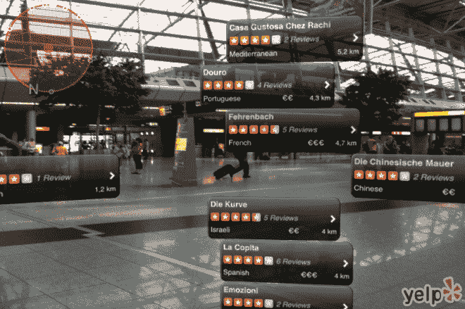

# 我们还没有考虑增强现实在法律和伦理上的破坏

> 原文：<https://shift.newco.co/weve-not-thought-through-the-legal-and-ethical-disruption-of-augmented-reality-e244769c6e9b?utm_source=wanqu.co&utm_campaign=Wanqu+Daily&utm_medium=website>

#### 让我们不要重蹈社交媒体的覆辙

<noscript></noscript>

嗥叫单片眼镜，预示着变化即将到来。([图片](https://talentim.wordpress.com/2012/08/14/yelp-me/) )

随着最近由[苹果](https://venturebeat.com/2017/06/05/apple-unveils-arkit-wants-developers-to-turn-ios-into-the-largest-ar-platform-in-the-world/)和[脸书](https://www.nytimes.com/2017/04/18/technology/mark-zuckerberg-sees-augmented-reality-ecosystem-in-facebook.html)、*T5】发布的产品和 SDK，我们已经正式进入了 2017 年版的增强现实炒作周期。像纽约时报[和石英](https://digiday.com/media/ny-times-launches-first-augmented-reality-project/)[这样的事件新闻网站已经通过他们自己的应用程序*加入了这场游戏。*](https://qz.com/1072252/quartzs-iphone-app-now-includes-news-stories-in-augmented-reality/)*

作为一名未来学家和场景规划者，我帮助组织了解颠覆性技术带来的长期社会、经济和政治影响，我觉得这是该技术中所有类型的利益相关者——政策制定者、技术生产者、消费者，甚至是可能阻碍新兴应用的普通公民——了解和超越 AR 应用将带来的道德、法律和监管问题的最佳时机。

对增强现实最简单的描述是，它是在你通常使用智能手机或眼镜显示器观看的物理场所和事物之上叠加数字信息和图像。(关于它是什么以及它在技术上如何工作的更多细节可以在很多网站上找到，比如[维基百科](https://en.wikipedia.org/wiki/Augmented_reality))。与其他新技术一样，AR 将改变人们相互之间以及与周围环境的互动方式，给现状带来好处和挑战。然而，鉴于“在线”和“现实世界”体验之间的紧密结合，AR 将对人们的行为和对周围世界的感知产生更直接的影响，从而带来更大的上行价值和更具争议性和破坏性的影响。

社会如何解决这些新应用的优势和劣势之间的紧张关系(通过法律，监管或其他社会规范化手段)将影响 AR 的采用率，AR 市场的结构，以及最重要的是，AR 对日常生活的影响程度。对于寻求提供产品和服务的新公司来说，这可能意味着一个开放竞争的市场——拥有平等的基础设施和表达形式——或几个看门人之间的差异。对于用户来说，这可能意味着真正有用的工具(通过日常任务提供节省时间的指导)和新的艺术形式与高度分散和混乱的体验(在社区内造成更大的紧张和障碍)之间的差异。

这里有三个具体的例子，展示了必然会出现的从实际问题到更现实的问题的范围。

**混合现实中存在什么样的产权？**

一批新的应用程序允许用户使用 AR 创建[隐藏涂鸦，这提出了一个重要问题，即谁被合法允许“标记”一个地方。未经产权人许可，实体涂鸦本身是违法的，但虚拟涂鸦呢？如果公众不能立即看到，这是多大的犯罪？如果只是为了一群朋友，或者赞助人，或者其他群体，是不是对物业的侵扰？在某种程度上，答案可能是肯定的。一个空间何时成为“公共”实际上是由法律定义的。然而，到目前为止，Yelp 对某个特定“地方”的评论是完全可以接受的，这表明社会普遍对公开评论私人场所持宽容态度。](https://www.fastcodesign.com/3068638/ghostpaint-a-vr-graffiti-app-that-lets-you-play-banksy)

实际上，考虑到可能存在的各种可见性，跨越非法或不当界限的点总是模糊的。这条线将在一定程度上从纯粹的道德角度来划分:例如，有人可能会说，只与少数几个朋友分享的作品是无害的，但一个普遍可用并在人们路过时提示的作品更像是一种公开声明。但是它也将由更实际的考虑来决定，例如某人(所有者、法律实施者等)如何。)甚至会知道有一个标签。当然，这很可能会影响到声明的类型以及所有者可能受到的影响程度。后者把我们带入了言论自由权和诽谤法的泥潭，超越了纯粹的“谁拥有虚拟空间”的问题。围绕这一点的争论甚至可能导致这样的争论，即所有虚拟空间本质上都是公共的，不能由私人所有者控制。从许多方面来说，这是一个需要重温的古老辩论。

当然，涂鸦只是将虚拟信息或图像与特定地理位置相结合的一个例子。大型数据公司已经创建了数据丰富的城市地图，不可避免的是，越来越多类型的数字内容将填充这些数据库——例如，来自维基百科、LinkedIn 或脸书的关于居住在特定地址的人或总部位于该地址的组织的信息。房产所有者能够决定哪些信息可以在他们房产周围的 AR 中显示，哪些不可以吗？

这可能会引发更广泛的关于什么是公共信息，什么是私人信息的争论。例如，在美国，我们有关于公布性犯罪者个人信息的标准和规范，比如他们的姓名和地址。但是某人度假时的照片或者家庭简介信息呢？在许多方面，AR 和地理标记的自动化和即时性体现了一种更为内在的形式，即关于搜索的“遗忘权”监管问题开始引起争论。

这在很大程度上将取决于谁首先提供 AR 系统，以及谁已经获准访问其他数据集(例如，如果你这样设置，只有脸书的朋友才能看到你的某些类型的信息)，但正如他们通过网站以不太容易访问的方式在线所做的那样，数据公司将试图收集尽可能多的人的信息，并寻求赚钱。将它放在物理上拥有的空间之上，通过使内容更易访问和物理上可操作，改变了道德基础或法律权利的本质。对于大多数人来说，这将被视为一种更具威胁性的用途，尤其是在 doxxing 和有针对性的骚扰活动很常见的环境中。

*公共空间的使用权*

 *到目前为止，我主要谈论了私有标记。但是当谈论公共空间时，更多的问题也出现了。同样，我们有一些关于公共标识的现有法律和规范，对于在有限的物理空间内可以放置多少代表物(壁画、雕像、牌匾)有自然的限制。通常，有审查机制来决定这一点，通过市议会或公众投票。但是，在一个世界里，我们可以有无限的虚拟表现，那会怎么样呢？对于与公共场所相关的内容，城市会要求类似的许可或批准的标签流程吗？什么样的历史或文化观点将被优先考虑或否定，如果有的话？计算出正确的数字并为所有参与者提供平等的机会将是一项具有挑战性的政治任务，与最近关于邦联雕像的辩论一样，甚至更难达成共识。Snapchat 促成的虚拟公共昆斯展的[“破坏”](https://www.nytimes.com/2017/10/10/arts/design/augmented-reality-jeff-koons.html)为即将到来的争论的复杂性提供了早期迹象。

谁来审核这些数据？

解决了上面的问题，必然会引出下一个大问题。类似于假新闻管理问题，谁来决定关于一个地方什么是适当的和/或真实的信息？前面提到的 Yelp 评论已经在用其[单片功能](https://www.wired.com/2009/08/yelp-ar/)测试这些边界，该功能将评论层叠在地图和指向物理位置的指针之上。在某种程度上，需要有明确的定义来决定在这些评论中什么是真的，什么是假的。至少，我们需要一些法律指导，来决定什么是或者不是第一修正案的权利，以及这种决定权何时需要存在。

AR 为每个位置提供了一个新的、无限的描述空间。与搜索引擎和社交媒体平台等在线空间类似，ar 的道德和法律边界尚未完全界定。我们刚刚看到像脸书这样的网络巨头开始重新思考“开放”在他们的平台上意味着什么。我们将需要为 ar 做一些非常类似的事情，在 AR 中，特定的情感即时性和与物理概念的联系不会以相同的方式存在于移动或在线内容中。

什么算是排斥/歧视？

最后，AR 承诺的许多功能可以很容易地被用来进行许多人认为在最好的情况下是可疑的，在最坏的情况下是不道德的行为。随着机器视觉的进步，AR 有望识别你视野中的人和物。这将从本质上使在人群中匿名的想法变得过时——包括像公共抗议中的那些社会弱势参与者。

然而，通过叠加技术，AR 还可以采取下一步措施，根据一组给定的规则，重新渲染甚至从视图中删除人和物。一个例子可能是当你走在街上的时候，抹去城市衰败的迹象。或者也许彻底消灭穷人。更一般地说，AR 已经成熟，可以进一步实现现在在基于人工智能的系统中发现的那种[种族隔离应用](https://www.nytimes.com/2016/06/26/opinion/sunday/artificial-intelligences-white-guy-problem.html)。

对一些人来说，这可能只是代表了一种新的现实，一种“更好”的方式来做许多人无论如何都会做的事情——忽略他们不想面对的事情或忽略他们不关心的人——以及从最后一波颠覆性技术的自然演变。然而，对其他人来说，这是一种更极端的红线和歧视，需要比以前的技术更大的监督。与其他信息系统一样，我们会看到关于谁负责对此进行监控的不同意见——用户、技术提供商，还是第三方或政府。

一旦我们搞清楚了这一点，解决执行问题将是一个巨大的设计挑战。考虑到解决这些问题需要大量的时间，即使在第一次体验推出的时候，开始谈论他们今天希望从这项技术中看到什么将会使所有参与者受益。

就像如此多的新技术一样——社交、人工智能、无人机、传感和成像——每一项有望让世界变得更美好的应用，也有同样多的用途，在最好的情况下，提出了关于我们作为一个社会想要什么的“灰色区域”类型的问题。在最坏的情况下，它们可能以不公平的方式伤害社会的某些部分。解决我们希望如何管理和监管 AR 将是这场更大规模、持续辩论的另一个重要切入点。最好现在就开始对话，以帮助形成采用，而不是在未来对一些不可想象的事件做出反应。

* * *

*感谢托尼·廖，他的关于* [*辩论增强未来*](https://www.computer.org/csdl/proceedings/ismar-amh/2012/4663/00/06483982.pdf) *的论文为思考与增强现实的可能竞争领域提供了一个广阔的框架；还有亚当·弗林，他是这个话题上一个无价的思想伙伴。*

Matt Ranen 是一名情景规划和战略顾问，帮助组织应对未来的变化和不确定性。更多关于未来和场景规划的信息，请访问 www.ranenconsulting.com**，或在推特上关注马特·兰恩(Matt Ranen)的@MattRanen。***