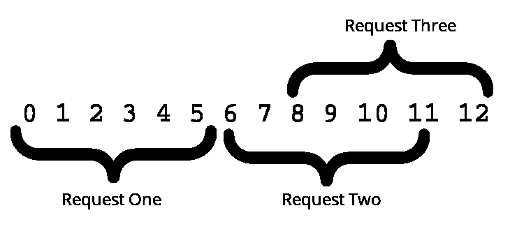

# 信号>>博客>>扩展信号 GIF 搜索

> 原文：<https://signal.org/blog/signal-and-giphy-update/?utm_source=wanqu.co&utm_campaign=Wanqu+Daily&utm_medium=website>


今天 iOS 的 Signal beta 包含了对动画 GIF 搜索的支持。Signal iOS 长期以来一直支持发送和接收 gif，但今天的测试版增加了对从 Signal 内部浏览和搜索流行 gif 的支持。

我们[之前宣布了](/blog/giphy-experiment)在 Signal Android 中对动画 GIF 搜索的实验性支持，我们现在将这一支持带到 iOS 中，同时对这一过程进行了一些隐私更新。

## 关于 gif 和隐私的简单回放

GIPHY 等 GIF 搜索引擎提供网络 API，允许应用程序轻松展示 GIF 的趋势和搜索功能。例如，如果有人给你发信息邀请你，你可能想回复一条信息说“我很兴奋”有了集成的 GIF 搜索，你可以用 GIF 搜索“我很兴奋”,然后发送一个结果。


当然，当你输入搜索结果时，它会通过网络传输到 GIF 搜索引擎:

```
http://api.giphy.com/v1/gifs/search?q=I&api_key=dc6zaTOxFJmzC
http://api.giphy.com/v1/gifs/search?q=Im&api_key=dc6zaTOxFJmzC
http://api.giphy.com/v1/gifs/search?q=Im+&api_key=dc6zaTOxFJmzC
http://api.giphy.com/v1/gifs/search?q=Im+e&api_key=dc6zaTOxFJmzC
http://api.giphy.com/v1/gifs/search?q=Im+ex&api_key=dc6zaTOxFJmzC
http://api.giphy.com/v1/gifs/search?q=Im+exc&api_key=dc6zaTOxFJmzC
http://api.giphy.com/v1/gifs/search?q=Im+exci&api_key=dc6zaTOxFJmzC
http://api.giphy.com/v1/gifs/search?q=Im+excit&api_key=dc6zaTOxFJmzC
http://api.giphy.com/v1/gifs/search?q=Im+excite&api_key=dc6zaTOxFJmzC
http://api.giphy.com/v1/gifs/search?q=Im+excited&api_key=dc6zaTOxFJmzC 
```

为了对 GIPHY 隐藏您的搜索词，Signal service 充当了一个隐私保护代理。

查询 GIPHY 时:

1.  信号应用程序打开一个到信号服务的 TCP 连接。
2.  信号服务打开到 GIPHY HTTPS API 端点的 TCP 连接，并在 app 和 GIPHY 之间中继字节。
3.  Signal app 通过代理 TCP 连接一路协商 TLS 到 GIPHY HTTPS API 端点。

由于通信是通过 TLS 一直到 GIPHY 完成的，所以信号服务永远看不到发送或接收的明文内容。因为 TCP 连接是通过信号服务代理的，所以 GIPHY 不知道是谁发出了请求。

信号服务本质上充当 GIPHY 流量的 VPN:信号服务知道你是谁，但不知道你在搜索或选择什么。GIPHY API 服务可以看到搜索词，但看不到你是谁。

## 循环返回

这种方法效果很好，但我们也一直在思考如何提高对流量分析的抵抗力。如果信号服务是恶意的，它可以测量传输的数据量，以便辨别从 GIPHY 检索的 gif。

减轻这种攻击最常见的方法是引入明文填充。在每个 GIF 的末尾包含随机数量的填充会使信号服务更难将它看到的正在传输的数据量与已知的 GIF 相关联。

然而，问题是我们并不控制内容。你怎么能填充你不控制的明文内容呢？

## 在溶液的范围内

RFC 7233 规范允许 HTTP 客户端指出他们希望从远程服务器接收文件的哪些部分。客户端在其请求中传递一个`Range`头，服务器在该字节范围内传递部分内容。此外，该功能允许您的浏览器恢复中断的下载，立即开始显示大文档，并快速查找长视频中的给定位置。

我们还可以*滥用范围请求来模拟我们无法控制的内容上的填充。*



在上图中，一个客户端希望下载一个 13 字节的文件。然而，客户端不希望向网络透露它已经准确地检索了 13 个字节。

它不是发出一个普通的请求，而是选择一个块大小(在本例中是 6 个字节)，并发出相应数量的连续范围请求。对于第三个也是最后一个请求，只剩下 1 个字节需要检索，但它会对最后 6 个字节发出一个*重叠*请求，并丢弃最后一个请求的前 5 个字节。

客户端刚刚成功地将这段 13 字节的内容“填充”了 5 字节，这使得任何网络观察者都更难确定所检索内容的真实长度。

## 给它一个旋转

当我们在下面的 GIF 上尝试这个策略时，请随意跟随您终端中的操作:


首先，我们将确定目标文件的大小，并验证服务器是否支持范围请求:

```
$ curl -s -I 'https://media.giphy.com/media/k9gFJo5DMijbW/giphy.gif' | egrep 'Content-Length|Accept-Ranges'
Content-Length: 1965425
Accept-Ranges: bytes 
```

我们使用 1MB 的范围大小(以字节为单位)下载文件的第一段:

```
$ curl -o giphy.gif.part01 --range 0-1048575 'https://media.giphy.com/media/k9gFJo5DMijbW/giphy.gif' 
```

接下来，我们将下载文件的第二段(也使用 1MB 的范围大小),它将与第一段部分重叠。

```
$ curl -o giphy.gif.part02 --range -1048576 'https://media.giphy.com/media/k9gFJo5DMijbW/giphy.gif' 
```

我们需要丢弃第二段中重叠的字节。我们取两个数据段的总字节大小，然后减去原始文件的字节大小。这给我们留下了需要从第二段中删除的`131727`字节:

```
$ dd bs=131727 skip=1 if=giphy.gif.part02 of=giphy.gif.part02-trimmed 
```

现在，我们准备将两个文件段合并在一起:

```
$ cat giphy.gif.part01 giphy.gif.part02-trimmed > giphy-combined.gif 
```

最后，我们可以验证合并后的文件是否与原始文件相同:

```
$ curl -s -o giphy-original.gif https://media.giphy.com/media/k9gFJo5DMijbW/giphy.gif
$ shasum -a 256 giphy-original.gif giphy-combined.gif 
```


当使用这种策略通过隧道信号服务发送 TLS 加密的请求时，我们用两个大小相同的 1MB 数据块传输来代替一次`1965425`字节的传输。

因此，在路由流量时，信号代理服务只能看到块大小的重复请求，这使得识别该流量的内容变得更加困难。我们正在继续寻找额外的措施，比如随机排列结果的顺序，以及随机分配多次下载的请求。

## 用一点点过度来对抗紧缩

我们不认为隐私与简朴有关。交流要有表现力，要有乐趣。我们希望你避免发送明文，但这并不意味着你的文本应该总是这么简单。今天发一个动画 GIF，让我们知道你的想法。

如果你准备好了冒险的生活(和偶尔的悲伤)，你可以通过给 support@whispersystems.org 发电子邮件来注册信号 iOS 测试频道。请在主题行中包含“Signal iOS Beta”。如果您需要稳定可靠的消息传递体验，我们建议您等待几天，等待产品发布。