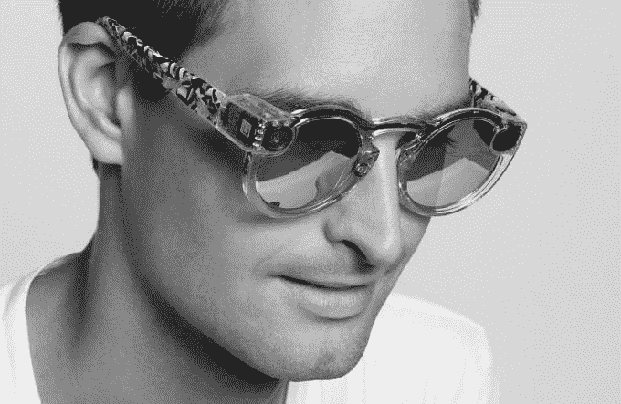
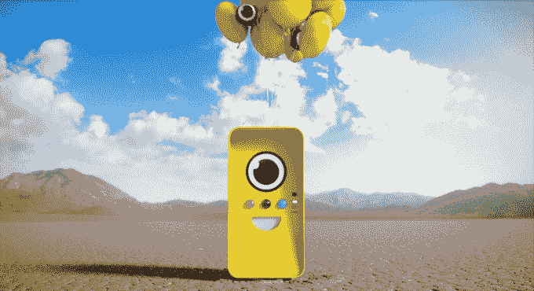
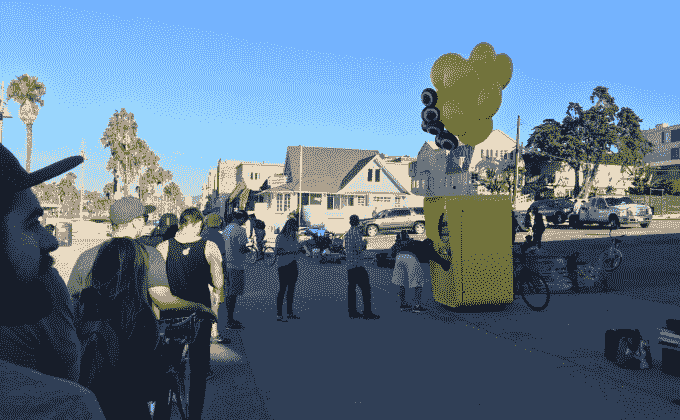
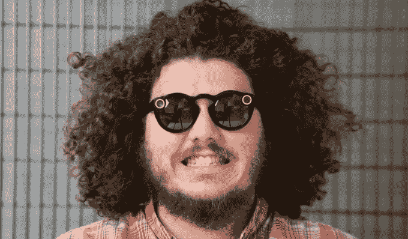
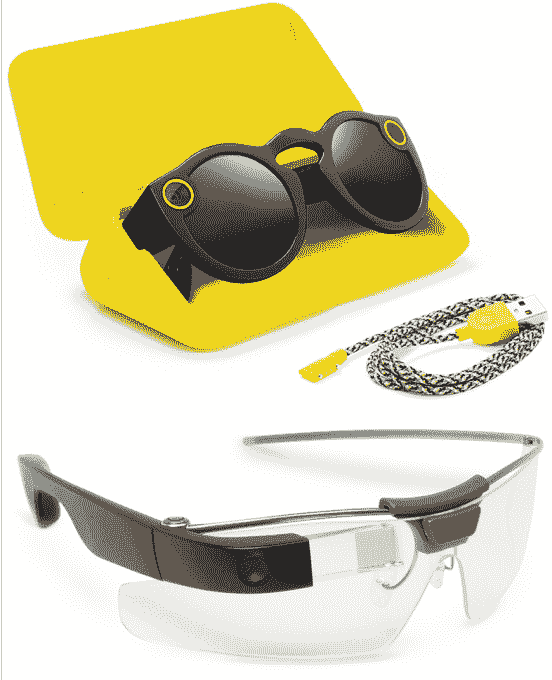
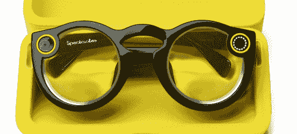
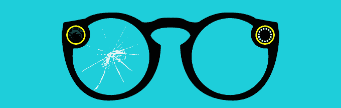

# 为什么 Snapchat Spectacles 失败了 TechCrunch

> 原文：<https://techcrunch.com/2017/10/28/why-snapchat-spectacles-failed/?utm_source=wanqu.co&utm_campaign=Wanqu+Daily&utm_medium=website>

为什么只有 0.08%的 Snapchat 用户购买了它的相机太阳镜？该公司搞砸了发布会后，成千上万副眼镜在仓库里腐烂。最初的宣传和限时出售的 Snapbot 自动售货机导致 Snap 高估了需求，但在质量和内容上表现不佳。

信息显示，大量组装和未组装的视频记录太阳镜闲置未售，导致 Snap 的巨大成本和损失。据 Business Insider 的 Alex Heath [报道，内部 Snap 数据显示，不到 50%的购买者在购买一个月后继续使用眼镜。](http://www.businessinsider.com/less-than-half-of-snapchat-spectacles-owners-used-glasses-after-1-month-2017-10)一个“相当大”的百分比在仅仅一周之后就停止了，有消息称保留率“低得令人震惊”。

出了什么问题？Snap 为 Spectacles 制造了巨大的宣传，但是等了 5 个月才公开销售。一旦人们真正尝试了眼镜，很少有人继续戴着它们，关于它们不再使用的口口相传就传开了。Snap 从未在船上安装过有远见的视频标记。随着 Snapchat 在竞争对手面前的受欢迎程度下降，Spectacles 只与它的应用程序而不是手机的相机胶卷相连接成为了一个负担。

Snap 戴着眼镜做了一些正确的事情。尽管有线索和 CEO 埃文·斯皮格尔的照片在前面慢慢流出，时尚照片的发布还是让人感到优雅和惊讶。最初的推出是一场营销盛宴，酷孩子排了几个小时的队在威尼斯海滩木板路上等待购买。随机投放的快照机器人令人兴奋，如果人们拿到它们，会觉得自己很特别。但是一旦人们把它们放在脸上，兴奋感就消失了。

卡尔·拉格费尔德为 2016 年 9 月发布的 Snap 首席执行官埃文·斯皮格尔戴眼镜的照片透露

以下是 Spectacles 自首次亮相以来一年中出现的主要缺陷，重点是生硬的发布策略:

## 拙劣的推出

2016 年 9 月 24 日，Snap 首次公布了斯皮格尔戴眼镜的一些卡尔·拉格费尔德照片。尽管海滩色的选择让一些人望而却步，但宣传力度还是很大。直到 11 月 10 日，第一批 Snapbot 自动售货机才推出。虽然炒作略有降温，但需求巨大，因为人们想成为第一个戴眼镜的人，队伍一直排到街上。

但是 Snap 不管是因为 Snap 想从 Snapbot 的推广中获利，还是因为它不知道眼镜应该是独家的还是广泛提供的，或者它有供应链问题，直到 2 月 20 日 Snap 才开始公开在网上出售眼镜。

在快速发展的青少年时尚周期中，等待最初的声明五个月是一种永恒。它们在可以购买的时候并不酷。大家早就看到了网上到处都是墨镜和循环视频，大部分车主早就不用了，假期已经过了，这么晚了也没几个人想买。直到 6 月，眼镜首次亮相 8 个月后，才在欧洲上市。

如果 Snap 发布公告，迅速为一些幸运的普通用户和名人配备眼镜，然后在宣传高潮时推出黑色星期五大甩卖，所有对这个小玩意着迷的人可能会立刻购买。在人们不再戴那么多照相眼镜的消息传出之前，每个人都会付钱的。

或者，Snap 可能会走上其专注于时尚的首次亮相所点燃的排他性道路。它本可以在坚持使用限量版 Snapbots 的同时，让它们出现在时装秀和杂志上，而不是公开出售规格。然后几个月后，它可能会停止所有销售，将现有的双鞋变成争夺收藏家的物品，并为最终的 v2 发布保留主流展示。不幸的是，Snap 似乎陷入了这些独家和大众零售战略之间。

眼镜的影响者在哪里？–为了推动需求，Snap 需要展示所有你可以用眼镜做的创意，以及戴眼镜的酷人们。然而在那个时候，它仍然有一个非常不干涉的方法来处理传统的名人和网络影响者。Snap 并没有优先考虑为创作者配备眼镜，并培训他们使用相机眼镜。Snap 没有不断发布循环视频并鼓励粉丝这样做，而是有效地将这个小工具晾在一边。Snap 让随机的眼镜购买者(通常是过于热情的社交媒体业余爱好者)定义产品的形象，类似于谷歌的核心错误是让极客开发者成为眼镜的代言人。

TechCrunch 的视频主持人蒂托·哈姆泽成了眼镜事实上的代言人，因为使用眼镜的影响者很少

**几个伟大内容的例子**——源于 Snap 未能培养出 Spectacles creator 场景，它在展示 Spectacles 如何超越最初的商业用途方面做得很糟糕。Snap 的内部团队和独立社交明星都没有被招募来制作视频，展示该设备的创意机会。它几乎没有通过事件营销或应用内推广来鼓励奇观内容的创作。Karen X. Cheng 可能是唯一一个照亮道路的眼镜影响者，她帮助 Brawny 制作了第一人称镜舞视频和婴儿眼镜广告。但 Snap 应该确保互联网上充斥着这些视频，证明你不能用手机摄像头做什么，以及为什么你应该购买眼镜。

<iframe title="Once a Mother, Always a Giant | Brawny Paper Towels" src="https://www.youtube.com/embed/RkB_3E7nzro?feature=oembed" frameborder="0" allow="accelerometer; autoplay; clipboard-write; encrypted-media; gyroscope; picture-in-picture" allowfullscreen="">视频</iframe>

人们仍然被相机眼镜吓坏了——谷歌眼镜以其“不确定你是否在记录我”的设计玷污了市场。即使 Snap 在眼镜上安装了更明显的录音信号灯，人们仍然会问你它们是否在摄像头上。这不仅让戴眼镜的人感到不舒服，而且让你觉得即使你从来没有按过快门，戴着眼镜也有点讨厌。他们的吸引力进一步受到两极分化的“时尚前沿”设计的限制(有些人会称之为丑陋)，而唯一的非黑色颜色是激进的亮青色和珊瑚色。

**有限的内容可移植性**——Spectacles 推出时，Snapchat 克隆版 Instagram Stories 才刚刚推出。但 Instagram Stories 的日用户数很快就超过了 2.5 亿，超过了 Snapchat 目前拥有 1.73 亿用户的整个应用。Snap 并不是镇上唯一的故事，许多人开始在两个应用程序之间交叉发布。但是眼镜让这变得困难。规格以专有的圆形视频格式拍摄。在 Snapchat 上，无论你将手机放在哪个方向，你都可以全屏观看内容。但当导出时，这些圆形视频会以锁定的方向嵌入白色方块中。这使得它们看起来明显是从 Snapchat 移植来的，而不是为这些其他频道制作的，尤其是在一个矩形的 Instagram 故事中。Spectacles 不会连接到你手机的相机胶卷，只会连接到 Snapchat，这使得导出成为一件苦差事。而且他们没有拍照，只有视频。

<iframe title="Dancing with Snapchat Spectacles" src="https://www.youtube.com/embed/wC8H0iFXu7Q?feature=oembed" frameborder="0" allow="accelerometer; autoplay; clipboard-write; encrypted-media; gyroscope; picture-in-picture" allowfullscreen="">视频</iframe>

**被困在模糊的阳光下**——眼镜上的遮光镜片使得它们很难在室内或夜晚佩戴。这使得很多人们喜欢抓拍的聚会、音乐会、聚餐和闲逛都失去了资格。除了音乐节、海滩、后院和公园，使用它们的机会比买家预期的要少。我看到一个家伙把镜片取出来，这样他就可以戴在任何地方，但这让他们看起来更加突出。Snap 从未与提供非遮光镜片或处方镜片的公司达成任何官方合作关系，尽管一些[的镜片替换供应商](https://beta.techcrunch.com/2016/12/01/you-can-now-wear-spectacles-indoors-with-rochester-opticals-lenses/)突然出现。这导致一些视力有问题或远离阳光的人完全放弃了这种产品。

只有非官方的第三方明确表示或处方更换眼镜镜片。Snap 没有。

**可用性问题很多**——不得不将眼镜与 Snapchat 配对，而不是标准的蓝牙菜单，这很烦人。从眼镜到手机的数据传输需要很长时间，而且很容易中断。他们只录制了 720p 的视频，而不是 1080 的。视频起初以低分辨率笨拙地传送，直到可以传送更高分辨率的版本。眼镜会超快耗尽你的手机电池。笨重且形状怪异的三棱柱外壳很难装进包里，也不可能放进口袋里。电池和录音灯令人困惑。有时眼镜需要“按住快门按钮 55 秒”重置，这在 Snap 的任何支持页面上都没有明确解释。最后，对于相机来说，我们的手已经是一个非常灵活、自动稳定、可以自拍的载体。

对于 v1 产品来说，Spectacles 是一次勇敢的尝试。但这是结结巴巴的推出，缺乏推广支持，竞争加剧，加上他们的硬件问题注定眼镜。希望 v2 将纠正这些失误。Snap 已经拥有一项增强现实版本的专利，并且搁置了无人机等其他产品创意。

如果 Snap 想要真正名副其实地成为一家相机公司，它要么需要找到一个你想每周多次使用的小工具，要么发布一系列短暂但有趣的相机玩具。无论哪种方式，它必须抓住它创造的炒作，而不是让它褪色，并把工作投入到培养创作者的生态系统中，以开创其他人都可以尝试的视频风格。制造一台引领潮流的相机不仅仅是关于你投入的技术，而是鼓励产生的内容。