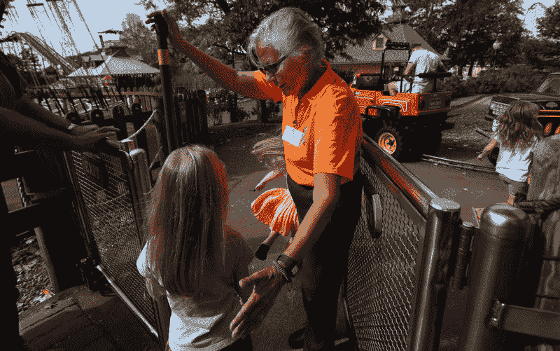
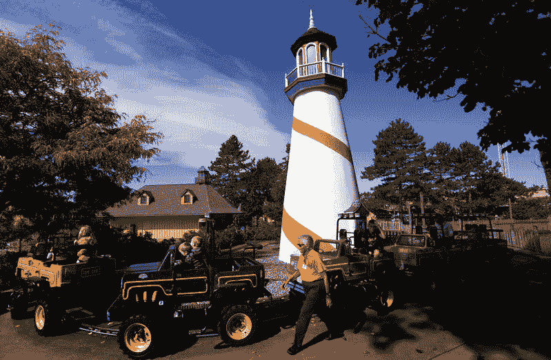
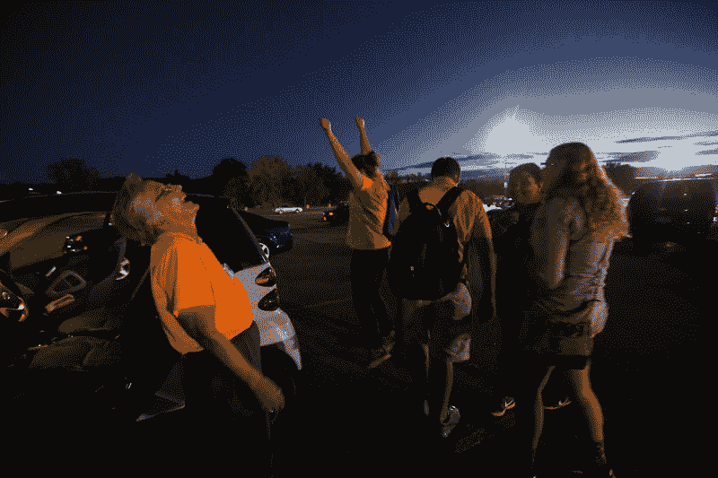
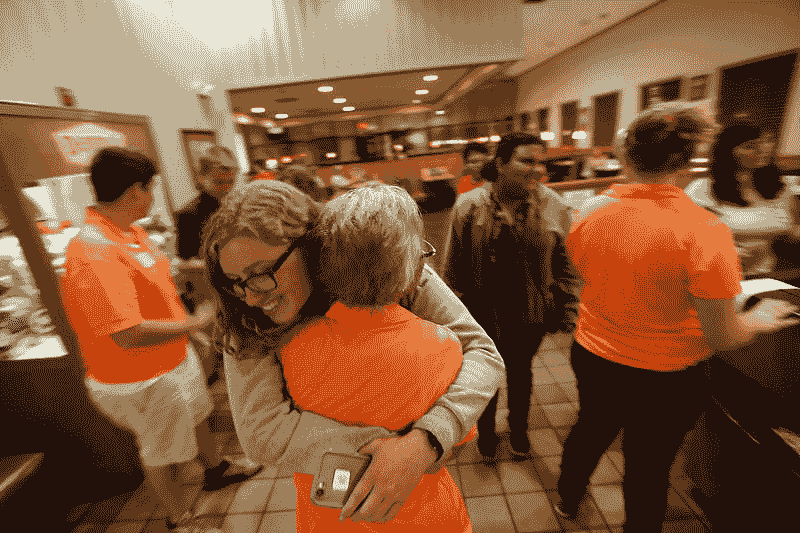
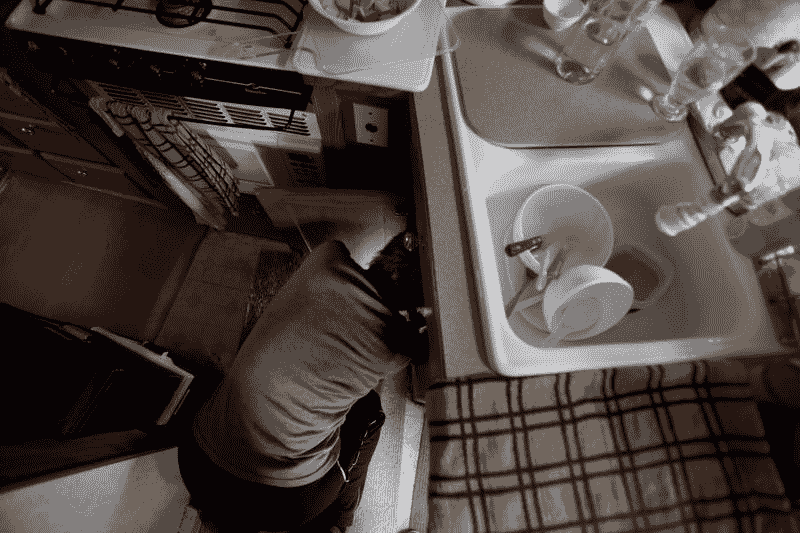
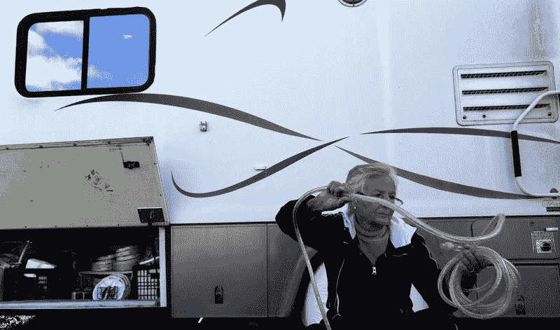

# 太穷而不能退休，太年轻而不能死亡——洛杉矶时报

> 原文：<http://graphics.latimes.com/retirement-nomads/?utm_source=wanqu.co&utm_campaign=Wanqu+Daily&utm_medium=website>

韦斯特福尔早就习惯了独来独往。年轻时，她独自驾车去沙漠和山区旅行，还上过飞行课。但是旅途中的生活教会了她更加足智多谋，更加勇敢。

她有一次为了躲避飓风，从德克萨斯州向北跑去，在阿肯色州小石城的一个卡车停靠点，安然度过了风暴的余波。在佛罗里达的一个圣诞节，她吓退了一个潜在的武装抢劫犯，这个人在自动取款机前跟她搭讪，大喊，“我没钱了，傻瓜。”

去年夏天，在收到超速罚单的几个星期后，韦斯特福尔站在交通法庭上与 300 美元的罚款抗争。她说服法官将其减至 75 美元——但她错过了一天的工资来为自己辩护。

两个月后，也就是 8 月，她仍然不知道离开达连湖后会在哪里工作，并且面临着另一个在需要和想要之间的艰难选择。

“I’m beginning to feel ineffectual,” Westfall says. “And I’ve never felt that before. I don’t feel desperate, but I’m getting close.”

她应该去看牙医，还是在导游的带领下参观她最喜欢的建筑师弗兰克·劳埃德·赖特设计的建筑？每个售价 100 美元。

她选择了弗兰克·劳埃德·赖特。她的牙齿可以等等。

“我相信做一些有趣的事情，不管看起来多么无聊，都是精神食粮，”她说。“你需要偶尔给自己一些快乐来保持活力。否则就只是苦差事。”

但是几乎没有钱去看风景。她挣得太多了，以至于不能领取食品券，而且大部分都花在了食品杂货上。她尝试吃有机食物，因为她血糖低。这就排除了便宜但能填饱肚子的巨无霸——以及食品厨房，她认为食品厨房大规模生产的食物是不健康的。

她不能批量购买，因为大脚的储物空间很小。她经常被迫以便利店的价格购买适合小型房车冰箱的小尺寸产品。在自助洗衣店，她试图将洗衣费控制在 10 美元以下，总是寻找更热的省钱烘干机。

她的钥匙圈上贴满了超市和其他地方的塑料折扣标签，比如订书钉和百万本书。

但韦斯特福尔发现，她现在比上路时负债更多。自从她出发后，她一直没能去加利福尼亚看望她的妹妹玛丽·安；她只能走最短的路去找下一份工作，而工作并没有带她走这条路。最大的打击发生在 2013 年，当时她面临 8000 美元的紧急牙科手术和钻机维修费用。这是一个打击，她还没有恢复过来。

她尽可能自己动手修理。一天在 Darien Lake，她爬上梯子靠在房车的车顶上，寻找漏水的源头，漏水的地方是她的笔记本电脑。以前，她会一路爬到屋顶上照看东西。但现在不是了。

“我开始感到无能了，”她说。“我以前从未有过这种感觉。我没有感到绝望，但我正在接近。”

::

Wearing an electric orange work shirt, Westfall is known among youngsters at the Darien Lake Theme Park as “the Ride Lady.” On her last day, an hour before the park began shutting down for the year, Westfall has to deal with an irate mother. Later, the six teenagers she’d worked with that summer invite her to Denny’s for a going-away dinner.

九月下旬一个温暖的周日下午，韦斯特福尔正在主题公园值最后一班。当一些同事无精打采地坐在控制台上时，她却是一团乱麻。她用一根棍子测量每一辆车，以确保它们足够高可以骑；她把最小的孩子紧紧地绑了起来。

戴着她在一个卡车停靠站买的豹纹眼镜，她弯下腰与小家伙面对面交谈，从不屈尊俯就。一些人自发地拥抱了她。

他们会问，“你在塔吉特百货公司戴眼镜了吗？”或者“你人好吗？”

她最喜欢的:“你怎么变得这么老了。”

她回答说，“通过长时间的闲逛。”

由于一周工作六天，连续站立 12 个小时，加上加班加点，她的脚一直在疼。在她最后一天，也就是公园今年开始关闭的前一个小时，韦斯特福尔温柔地纠正了一位母亲，她在安全门关闭后闯入游乐区查看她的孩子。韦斯特福尔解释说，这是她的工作。

母亲爆炸了。她在离韦斯特福尔的脸几英寸的地方大叫，唾沫横飞。

“就因为你是一个可怜的老太太，拿着你那该死的 7 美元一小时的工作，”她嘶嘶地说道。“你没有生活。”

当愤怒的女人最终被安全人员带走时，一个旁观者让她的女儿拿着一张 10 美元的钞票过来。她说韦斯特福尔值得一顿丰盛的晚餐。

一个小时后，韦斯特福尔走向她的车，筋疲力尽，心事重重:她还没有找到下一份工作。突然，一小群人冲向汽车，韦斯特福尔紧张起来:又是那个愤怒的母亲？

那个夏天和她一起工作的是六个青少年。他们来回摇晃着她的车，喊着，“我们爱多洛雷斯！我们爱多洛雷斯。”

年轻人拉着韦斯特福尔出去拥抱了一下，并邀请她去丹尼餐厅吃告别晚餐。面对这份恩惠，她的脸涨得通红。在餐馆里，她和高中生们一起笑着说，在另一种生活中，这可能是她的孙子。

一名女服务员放下账单后，一名经理走过来，把手放在韦斯特福尔的肩膀上。"所以，你要支付全体船员的费用."

这群人不理睬他，把账单分了。韦斯特福尔的那份一共是 10 美元；她的美国退休人员协会的卡把损失减少到了 8 美元。

她走进夜色中，感觉不那么孤单了。后来，她坐在她的装备旁边的野餐桌旁，那是她用红白相间的塑料桌布铺成的。

::

大多数属于其他季节工人的房车已经离开。十月的一个灰蒙蒙的早晨，一群大雁在头顶列队飞行，威斯特福尔知道她也必须逃离。大脚怪永远不能在冬天给她保暖，但是她不能去南方太远的地方；根据经验，她知道南佛罗里达太贵了。

但是去哪里呢？尽管打了几个小时的电话，韦斯特福尔仍然不知道她是去马里兰州挨家挨户推销，还是去佐治亚州一家商场的售货亭工作。

大脚是另一个问题。屋顶仍然漏水，水管也出了问题。多亏了一张信用卡 1000 美元限额的意外增长，她有了一点空间，但其中的 400 美元已经花掉了。

离开达连湖的最后期限是第二天。她打开了厨房的水龙头。水槽里积满了水。

她脸上闪过一丝疲倦。“我不喜欢这样，”她说。

Big Foot’s roof still leaks and now the plumbing is acting up. “You’re getting damned uninhabitable,” Westfall scolds.

穿着棕色长袍的韦斯特福尔又开始为下一步行动储存她的生命。司机和乘客的座位和地板上堆满了标有“书写”、“收据”、“信用卡”和“保险”的盒子。

她从浴室出来，看起来闷闷不乐:脚踏马桶冲洗器刚刚坏了。

很快一名保安敲门。

“嗨，”他说。"我只是想知道你打算什么时候离开。"

“哦，大约一年后，”韦斯特福尔笑着说。"你知道，打包这些就像给你的房子装上轮子."

下午快结束的时候，她整理好东西，走到外面。缠绕几根软管时，她的手指冻得疼痛。然后钻井平台楼梯间的一个支架断裂了。在沮丧和绝望中，她重重地敲着大脚的一边。

“你变得不适合居住了，”她责备道。

夕阳西下，韦斯特福尔开车去了一家修理店。

机修工确认了破裂的水泵。没有它，她就不能通过在卡车停靠站停车来省钱，还得花钱住在有水管连接的露营地。

但是修理工想要几千块来修理。所以韦斯特福尔没有带它，她在去南卡罗莱纳州的路上寻找半价的露营地，在那里她花了 200 美元找到了一个修理水泵的技工。

十月底，她停在佐治亚州萨凡纳的一个露营地。她的圣诞季节工作场地。她在这条路上已经走了八年，准备重新开始整个过程。

晚餐又回到了糙米和牛奶。大脚厨房的水槽仍然在慢慢排水。