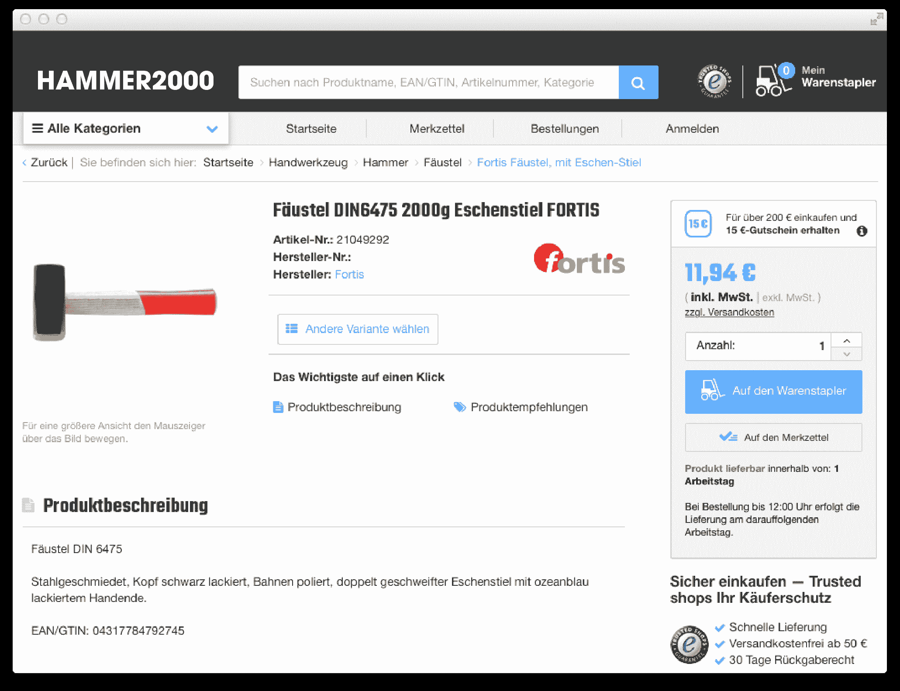
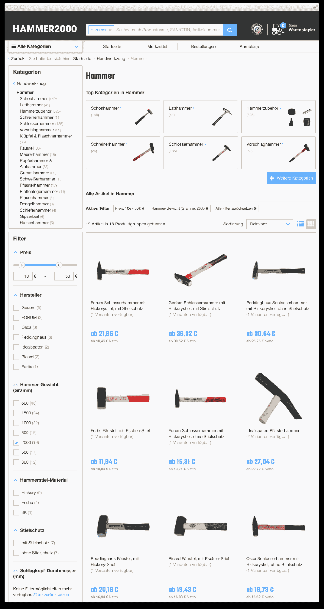
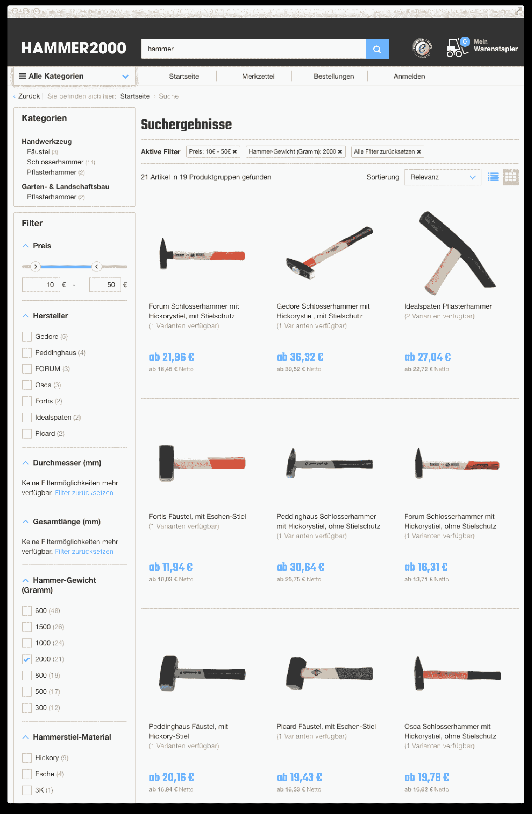
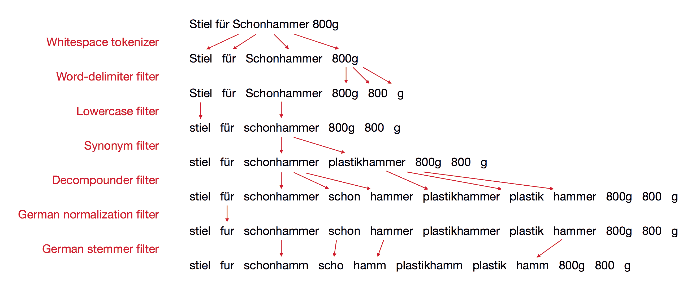
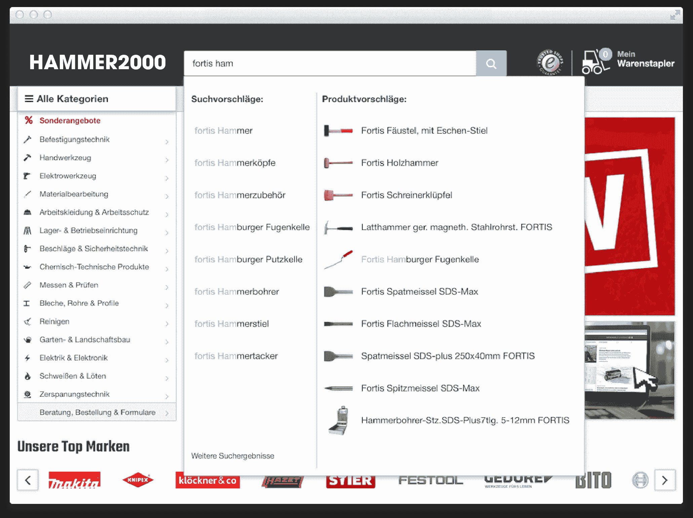
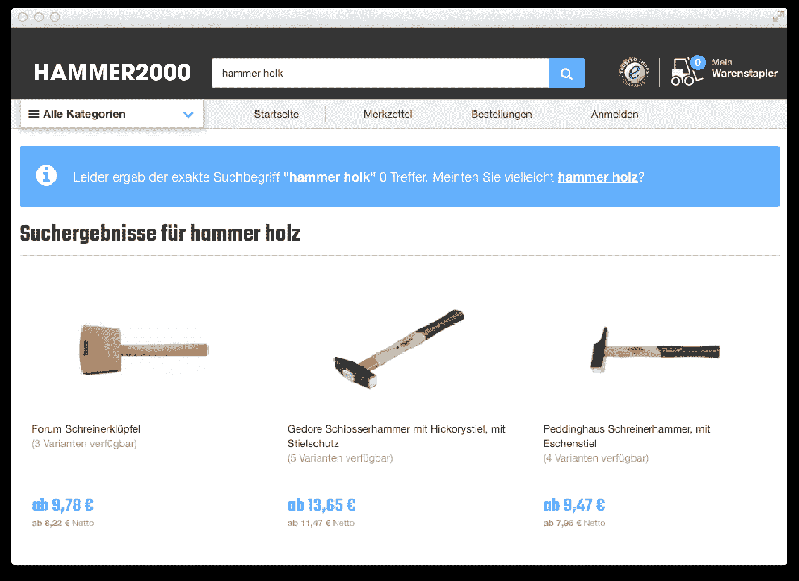
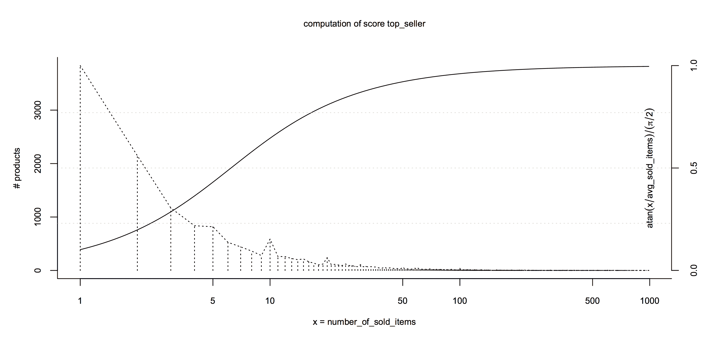
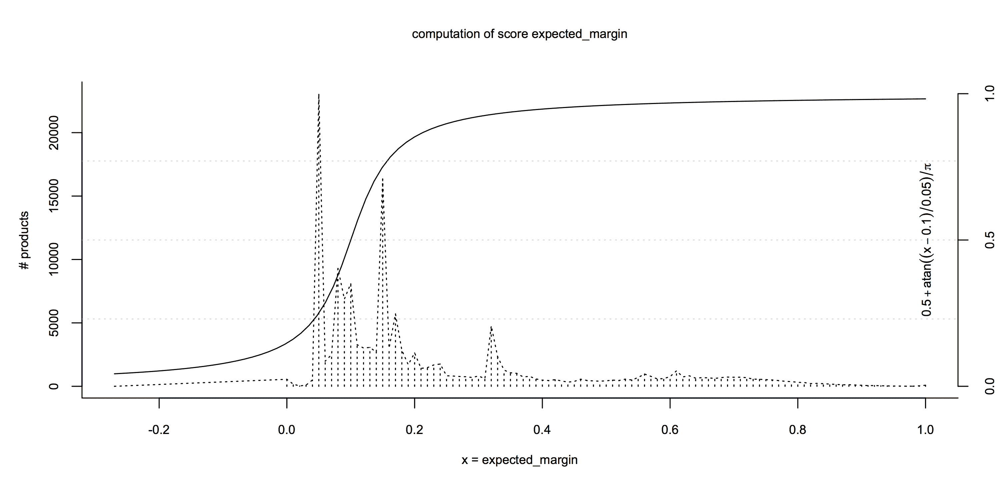
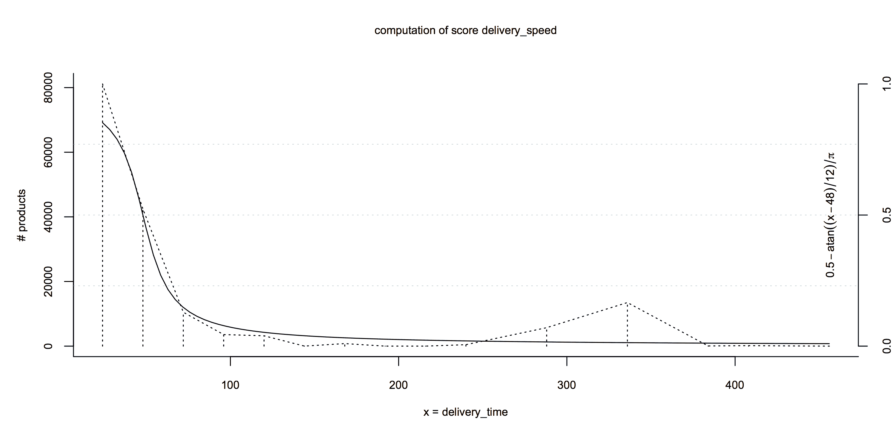
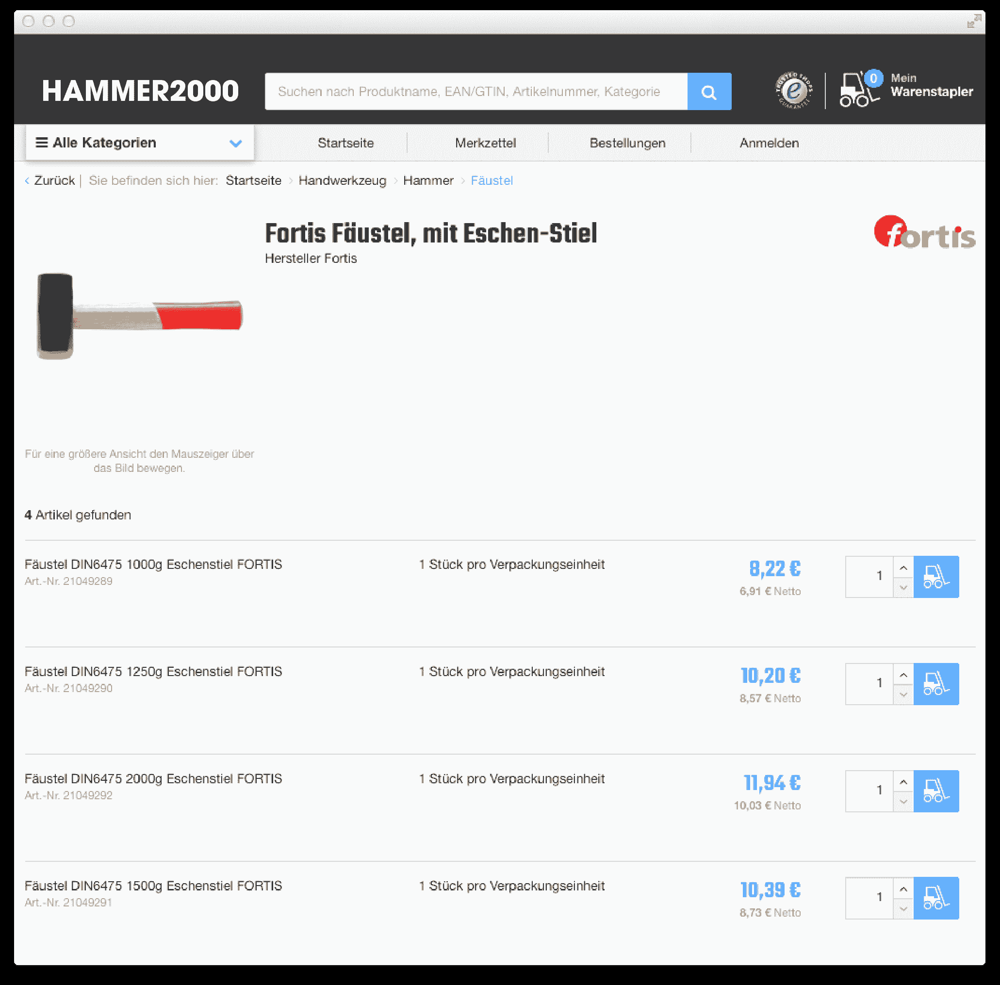

# 电子商务的现场搜索设计模式:模式结构、数据驱动排序等等

> 原文：<https://project-a.github.io/on-site-search-design-patterns-for-e-commerce/?utm_source=wanqu.co&utm_campaign=Wanqu+Daily&utm_medium=website>

[](https://project-a.com) [](https://spryker.com)

# 电子商务的现场搜索设计模式:模式结构、数据驱动排序等等

马丁·洛奇博士和克雷西米尔·斯拉格恩

为用户提供适当的现场搜索用户体验通常是构建电子商务网站的主要技术挑战之一。尽管 Elasticsearch 是一个非常棒的工作搜索引擎，但是要使它适应特定的业务还需要做很多工作。

在本文中，我们将围绕我们的**使用驱动模式**的概念介绍一些弹性搜索设计模式，这将帮助您构建一个搜索，以便:

*   客户可以通过点击分类树并应用过滤器( **[分面导航](https://en.wikipedia.org/wiki/Faceted_search)** )来轻松找到他想要的东西
*   通过 **[全文搜索](https://en.wikipedia.org/wiki/Full_text_search)** 可以找到相关产品(应用了更多可选过滤器来缩小结果范围)
*   当在搜索框中输入文本时，正确的搜索结果显示为建议()
*   当一个词拼错时，会显示另一个搜索结果(**拼写检查**)

此外，我们将介绍一种对搜索结果进行排序的技术，该技术将产品的排名提高到:

*   与搜索最相关
*   表现出更好的过往业绩(收入、点击数、点击率等)。)
*   展示更好的预期客户体验(交付速度、产品质量)

最后，我们将使用动态定价的例子来说明如何个性化搜索体验，并讨论一些其他的最佳实践。这些例子将来自一家在线工业和贸易供应商店，该商店认为在线搜索是其业务的主要驱动力。请注意，所有示例均来自 2015 年初，并已证明在 Elasticsearch 1.x 中有效。在 Elasticsearch 2.x 中，一些查询看起来会有所不同，但主要概念仍然适用。

## 天真的以产品为中心的方法

在电子商务网站上寻找产品可能会很棘手，即使你很清楚自己在找什么。在整个文档中，我们将假设客户想要购买一个重 2 千克的锤子。符合他需求的产品可能是 Fortis 的“Fä ustel ”:



这是 Hammer2000 后端已知的关于上述产品的(大部分)搜索相关信息:

```
{  "name":  "Fäustel DIN6475 2000g Eschenstiel FORTIS",  "staple-name":  "Fortis Fäustel, mit Eschen-Stiel",  "description":  "Fäustel DIN 6475<br><br>Stahlgeschmiedet, Kopf schwarz lackiert, Bahnen poliert, doppelt geschweifter Eschenstiel mit ozeanblau lackiertem Handende. SP11968 SP11968",  "preview_image":  "faeustel-din6475-2000g-eschenstiel-fortis-21049292-0-JlHR5nOi-l.jpg",  "categories":  [  "Fäustel",  "Handwerkzeug",  "Hammer",  "Fäustel"  ],  "final_gross_price":  1149,  "final_net_price":  1003,  "url":  "/handwerkzeug/fortis-faeustel-mit-eschen-stiel-SP11968",  "manufacturer":  "Fortis",  "hammer_weight":  2000  } 
```

许多教程推荐将这样的文档“按原样”存储到 Elasticsearch 中，这样做的方便性确实是该平台的核心优势之一。然而，这种方法至少有三个相当严重的缺点:

1.  Elasticsearch 查询需要“知道”并明确列出它们想要使用的所有属性。例如，全文搜索查询需要列出所有相关的文本字段，分面搜索需要列出所有可能的过滤器。

2.  相同属性的不同用法需要不同的处理，例如，类别名称“Hammer”需要不加改变地进行索引，以便过滤和完成，但是为了全文搜索的目的，需要进行完全分析。

3.  像`hammer_weight`这样的“语义”字段的存在使得扩展产品目录变得很困难:无论何时创建新的产品属性，都需要扩展 Elasticsearch 映射。

结果是查询生成和模式管理变得非常复杂，这通常会导致无法充分利用可用数据的情况:全文搜索只能在某些字段上运行，而分面导航只能在其他字段上运行，等等。

## 使用驱动的模式和文档结构

模式和查询生成器都不需要知道锤子的重量。我们将讨论一种文档结构和模式设计，它不是围绕原始数据构建的，而是围绕搜索操作中属性的使用。

在 Hammer2000 中，我们是这样把与上面例子中相同的产品发送给 Elasticsearch 的(不要担心，我们稍后会解释细节):

```
{  "type":  "staple",  "search_result_data":  {  "sku":  "SP11968",  "name":  "Fortis Fäustel, mit Eschen-Stiel",  "preview_image":  "faeustel-din6475-2000g-eschenstiel-fortis-21049292-0-JlHR5nOi-l.jpg",  "number_of_products":  "4",  "final_gross_price":  "822",  "final_net_price":  "691",  "base_gross_price":  null,  "base_price_unit":  null,  "url":  "/handwerkzeug/fortis-faeustel-mit-eschen-stiel-SP11968"  },  "search_data":  [  {  "full_text":  " 21049289  4317784792714 04317784792714 Fäustel DIN 6475<br><br>Stahlgeschmiedet, Kopf schwarz lackiert, Bahnen poliert, doppelt geschweifter Eschenstiel mit ozeanblau lackiertem Handende. SP11968 SP11968",  "full_text_boosted":  " Fortis Fäustel DIN6475 1000g Eschenstiel FORTIS 1000 Fäustel Handwerkzeug Hammer Fäustel Fortis Fäustel, mit Eschen-Stiel Fortis Fäustel, mit Eschen-Stiel",  "string_facet":  [  {  "facet-name":  "manufacturer",  "facet-value":  "Fortis"  },  {  "facet-name":  "hammer_weight",  "facet-value":  "1000"  }  ],  "number_facet":  [  {  "facet-name":  "final_gross_price",  "facet-value":  822  }  ]  },  {  "full_text":  " 21049290  4317784792721 04317784792721 Fäustel DIN 6475<br><br>Stahlgeschmiedet, Kopf schwarz lackiert, Bahnen poliert, doppelt geschweifter Eschenstiel mit ozeanblau lackiertem Handende. SP11968 SP11968",  "full_text_boosted":  " Fortis Fäustel DIN6475 1250g Eschenstiel FORTIS 1250 Fäustel Handwerkzeug Hammer Fäustel Fortis Fäustel, mit Eschen-Stiel Fortis Fäustel, mit Eschen-Stiel",  "string_facet":  [  {  "facet-name":  "manufacturer",  "facet-value":  "Fortis"  },  {  "facet-name":  "hammer_weight",  "facet-value":  "1250"  }  ],  "number_facet":  [  {  "facet-name":  "final_gross_price",  "facet-value":  1020  }  ]  },  {  "full_text":  " 21049291  4317784792738 04317784792738 Fäustel DIN 6475<br><br>Stahlgeschmiedet, Kopf schwarz lackiert, Bahnen poliert, doppelt geschweifter Eschenstiel mit ozeanblau lackiertem Handende. SP11968 SP11968",  "full_text_boosted":  " Fortis Fäustel DIN6475 1500g Eschenstiel FORTIS 1500 Fäustel Handwerkzeug Hammer Fäustel Fortis Fäustel, mit Eschen-Stiel Fortis Fäustel, mit Eschen-Stiel",  "string_facet":  [  {  "facet-name":  "manufacturer",  "facet-value":  "Fortis"  },  {  "facet-name":  "hammer_weight",  "facet-value":  "1500"  }  ],  "number_facet":  [  {  "facet-name":  "final_gross_price",  "facet-value":  1039  }  ]  },  {  "full_text":  " 21049292  4317784792745 04317784792745 Fäustel DIN 6475<br><br>Stahlgeschmiedet, Kopf schwarz lackiert, Bahnen poliert, doppelt geschweifter Eschenstiel mit ozeanblau lackiertem Handende. SP11968 SP11968",  "full_text_boosted":  " Fortis Fäustel DIN6475 2000g Eschenstiel FORTIS 2000 Fäustel Handwerkzeug Hammer Fäustel Fortis Fäustel, mit Eschen-Stiel Fortis Fäustel, mit Eschen-Stiel",  "string_facet":  [  {  "facet-name":  "manufacturer",  "facet-value":  "Fortis"  },  {  "facet-name":  "hammer_weight",  "facet-value":  "2000"  }  ],  "number_facet":  [  {  "facet-name":  "final_gross_price",  "facet-value":  1194  }  ]  }  ],  "completion_terms":  [  "Fortis",  "1000",  "1250",  "1500",  "2000",  "Fäustel",  "Handwerkzeug",  "Hammer",  "Fäustel"  ],  "suggestion_terms":  [  "Fortis Fäustel, mit Eschen-Stiel"  ],  "number_sort":  {  "final_gross_price":  822  },  "string_sort":  {  "name":  "Fortis Fäustel, mit Eschen-Stiel"  },  "scores":  {  "top_seller":  0.91,  "pdp_impressions":  0.38,  "sale_impressions_rate":  0.8,  "data_quality":  0.87,  "delivery_speed":  0.85,  "random":  0.75,  "stock":  1  },  "category":  {  "direct_parents":  [  "bpka"  ],  "all_parents":  [  "bost",  "boum",  "boun",  "bpka"  ],  "paths":  [  "boum-boun-bpka"  ]  },  "category_scores":  {  "number_of_impressions":  265,  "number_of_orders":  23  }  } 
```

那可是一大堆冗余信息啊！例如，`manufacturer`、`hammer_weight`和`name`属性在五个顶级字段中重复出现。但是这些属性在各种搜索操作中的使用非常不同，这些搜索操作需要不同的分析器和查询策略:

*   **搜索结果呈现**:字段`search_result_data`包含作为呈现搜索结果页面或完成弹出窗口的查询结果而返回的所有信息

*   **全文搜索**:字段`search_data/full_text`和`search_data/full_text_boosted`包含在全文搜索中可以找到产品的所有文本内容

*   **分面导航** : `search_data/string_facet`和`search_data/number_facet`包含应该对搜索结果进行分组和过滤的所有属性

*   **完成** : `completion_terms`包含当用户键入查询时应该显示为完成的术语

*   **拼写检查** : `suggestion_terms`包含当用户打错字时可能被建议作为替代拼写的术语

*   **静态排序** : `number_sort`和`string_sort`用于按名称或价格排序

*   **动态结果排名** : `scores`包含用户相关性、过去表现和产品质量的数字指标

*   **类别导航** : `category`包含产品在类别树/图中的位置信息

### 完整模式

作为参考，这是我们目前在 hammer2000 中用来索引页面的完整模式(映射)(同样，我们将在后面解释大部分细节):

```
{  "page":  {  "dynamic_templates":  [  {  "search_result_data":  {  "mapping":  {  "type":  "string",  "index":  "no"  },  "path_match":  "search_result_data.*"  }  },  {  "scores":  {  "mapping":  {  "type":  "double"  },  "path_match":  "scores.*"  }  },  {  "category_scores":  {  "mapping":  {  "type":  "integer"  },  "path_match":  "category_scores.*"  }  },  {  "category":  {  "mapping":  {  "type":  "string",  "index":  "not_analyzed"  },  "path_match":  "category.*"  }  },  {  "string_sort":  {  "mapping":  {  "analyzer":  "lowercase_keyword_analyzer",  "type":  "string"  },  "path_match":  "string_sort.*"  }  },  {  "number_sort":  {  "mapping":  {  "index":  "not_analyzed",  "type":  "double"  },  "path_match":  "number_sort.*"  }  }  ],  "properties":  {  "search_data":  {  "type":  "nested",  "include_in_parent":  false,  "properties":  {  "full_text":  {  "type":  "string",  "index_analyzer":  "full_text_index_analyzer",  "search_analyzer":  "full_text_search_analyzer",  "fields":  {  "no-decompound":  {  "type":  "string",  "index_analyzer":  "full_text_index_analyzer_no_decompound",  "search_analyzer":  "full_text_search_analyzer_no_decompound"  },  "no-stem":  {  "type":  "string",  "index_analyzer":  "full_text_index_analyzer_no_stem",  "search_analyzer":  "full_text_search_analyzer_no_stem"  }  }  },  "full_text_boosted":  {  "type":  "string",  "index_analyzer":  "full_text_index_analyzer",  "search_analyzer":  "full_text_search_analyzer",  "fields":  {  "edge":  {  "type":  "string",  "index_analyzer":  "full_text_edge_index_analyzer",  "search_analyzer":  "full_text_search_analyzer"  },  "no-decompound":  {  "type":  "string",  "index_analyzer":  "full_text_index_analyzer_no_decompound",  "search_analyzer":  "full_text_search_analyzer_no_decompound"  },  "no-stem":  {  "type":  "string",  "index_analyzer":  "full_text_index_analyzer_no_stem",  "search_analyzer":  "full_text_search_analyzer_no_stem"  }  }  },  "string_facet":  {  "type":  "nested",  "properties":  {  "facet-name":  {  "type":  "string",  "index":  "not_analyzed"  },  "facet-value":  {  "type":  "string",  "index":  "not_analyzed"  }  }  },  "number_facet":  {  "type":  "nested",  "properties":  {  "facet-name":  {  "type":  "string",  "index":  "not_analyzed"  },  "facet-value":  {  "type":  "double"  }  }  }  }  },  "completion_terms":  {  "type":  "string",  "analyzer":  "completion_analyzer"  },  "suggestion_terms":  {  "type":  "string",  "index_analyzer":  "term_suggestion_analyzer",  "search_analyzer":  "lowercase_analyzer"  },  "type":  {  "type":  "string",  "index":  "not_analyzed"  }  }  }  } 
```

## 通用分面搜索

分面搜索(有时也称为分面导航)允许用户通过应用类别、属性、价格范围等过滤器来浏览网站。这可能是搜索引擎最基本的功能，用户希望它能发挥作用。不幸的是，我们发现这也是开发人员最头疼的特性之一。

分面搜索背后的主要思想是将先前搜索结果的文档的属性作为过滤器来呈现，用户可以使用这些过滤器来缩小搜索结果的范围。在下面的例子中，用户通过类别树点击“锤子”类别，然后进一步过滤锤子重量为 2000 克、价格范围为 10 欧元到 50 欧元的文档的结果。找到了 19 个文档，左侧的过滤栏列出了搜索结果中包含的属性，以及具有该属性的文档数(方面数):



为了支持分面搜索，Elasticsearch 提供了简单而强大的概念[聚合](https://www.elastic.co/guide/en/elasticsearch/reference/2.3/search-aggregations.html)。聚合的一个很好的特性是它们可以嵌套——换句话说，可以定义创建文档“桶”的顶级聚合，以及在这些桶内对文档子集执行的其他聚合。聚合的概念通常类似于 SQL `GROUP_BY`命令(但功能更强大)。嵌套聚合类似于 SQL 分组，但是在查询的`GROUP BY`部分有多个列名。

### 索引方面值

在构建聚合之前，需要在 Elasticsearch 中索引可以作为方面的文档属性。索引它们的一种方法是在同一个字段中列出所有属性及其值，如下例所示:

```
"string_facets":  {  "manufacturer":  "Fortis",  "hammer_weight":  "2000",  "hammer_color":  "Red"  } 
```

虽然这种方法对于过滤来说可能是可以的，但是对于分面来说就不太好了，因为查询需要显式地列出我们想要为其创建聚合的所有字段名称。有两种方法可以做到:

*   总是将所有可能的字段名作为分面查询的一部分发送。当有 1000 个不同的面时，这是不太实际的。查询会变得很大(可能很慢)，而所有可能的字段名列表需要在 Elasticsearch 之外维护。

*   运行第一个查询，获取特定搜索请求最常见的字段名/属性，然后使用这些结果构建第二个查询，进行分面(和获取文档)。在这种情况下，第二个查询如下所示:

```
"aggregations":  {  "facet_manufacturer":  {  "terms":  {  "field":  "string_facets.manufacturer"  }  },  "facet_hammer_weight":  {  "terms":  {  "field":  "string_facets.hammer_weight"  }  },  "facet_hammer_color":  {  "terms":  {  "field":  "string_facets.hammer_color"  }  }  } 
```

这显然在速度方面效率不高(两个查询)，并且会增加查询构建和处理的复杂性。

相反，我们建议在发送到 Elasticsearch 的文档中分离方面的名称和值，如下所示:

```
"string_facets":  [  {  "facet-name":  "manufacturer",  "facet-value":  "Fortis"  },  {  "facet-name":  "hammer_weight",  "facet-value":  "2000"  },  {  "facet-name":  "hammer_color",  "facet-value":  "Red"  }  ] 
```

这需要在映射中进行特殊处理，因为否则 Elasticsearch 将在内部展平并保存它们，如下所示:

```
"string_facets":  {  "facet-name":  ["manufacturer",  "hammer_weight",  "hammer_color"],  "facet-value":  ["Fortis",  "2000",  "Red"]  } 
```

在这种情况下，聚合将提供不正确的结果，因为特定属性名称与其值之间的关系丢失了。因此，facet 字段需要在 Elasticsearch 映射中标记为 ["type": "nested"](https://www.elastic.co/guide/en/elasticsearch/reference/2.0/nested.html) :

```
"string_facets":  {  "type":  "nested",  "properties":  {  "facet-name":  {  "type":  "string",  "index":  "not_analyzed"  },  "facet-value":  {  "type":  "string",  "index":  "not_analyzed"  }  }  } 
```

### 方面查询

像这样筛选和聚合结构需要在查询中使用嵌套筛选器和嵌套聚合。

聚合:

```
"aggregations":  {  "agg_string_facet":  {  "nested":  {  "path":  "string_facets"  },  "aggregations":  {  "facet_name":  {  "terms":  {  "field":  "string_facets.facet-name"  },  "aggregations":  {  "facet_value":  {  "terms":  {  "field":  "string_facets.facet-value"  }  }  }  }  }  }  } 
```

过滤器:

```
"filter":  {  "nested":  {  "path":  "string_facets",  "filter":  {  "bool":  {  "must":  [  {  "term":  {  "string_facets.facet-name":  "hammer_weight"  }  },  {  "terms":  {  "string_facets.facet-value":  [  "2000"  ]  }  }  ]  }  }  }  } 
```

在聚合中，数字属性需要以不同的方式处理，它们必须单独存储和分析。这是因为数字方面有时有大量不同的值。不需要列出所有可能的值，只需要获得最小值和最大值，并在前端以范围选择器或滑块的形式显示它们就足够了。只有当值存储为数字时，这才是可能的。

任何电子商务网站上最重要的数字方面可能是价格方面。

文档:

```
"number_facet":  [  {  "facet-name":  "final_gross_price",  "facet-value":  1194  }  ] 
```

映射:

```
"number_facet"  :  {  "type":  "nested",  "properties":  {  "facet-name":  {  "type":  "string",  "index":  "not_analyzed"  },  "facet-value":  {  "type":  "double"  }  }  } 
```

数字方面的聚合在查询中使用关键字`"stats"`而不是`"terms"`。与仅返回术语出现次数的`"terms"`聚合不同，`"stats"`返回统计值，如最小值、最大值和平均值:

```
"agg_number_facet":  {  "nested":  {  "path":  "number_facet"  },  "aggs":  {  "facet_name":  {  "terms":  {  "field":  "number_facet.facet-name"  },  "aggs":  {  "facet_value":  {  "stats":  {  "field":  "number_facet.facet-value"  }  }  }  }  }  } 
```

使用这种分面导航方法，可以用单个 Elasticsearch 查询呈现搜索结果页面，而不必在查询时知道可用分面的列表。文档准备和查询构建方面的额外工作立即得到了回报，因为该解决方案可以自动扩展到数千个方面。

有时电子商务网站支持特定的方面行为，让用户在前端选择同一方面的多个值(例如使用复选框)。查看这个 [stackoverflow 讨论](http://stackoverflow.com/questions/41369749),看看如何在这里讨论的方法中实现支持这个特性的查询。

此外，您可以看看从这里开始的一系列文章，以获得对本节中讨论的方法的更详细的解释。

## 全文搜索

全文搜索是一项功能，用户可以在搜索字段中输入任意文本，然后获取与该查询相关的文档。它通常与分面导航相结合。在下面的示例中，用户搜索“锤子”，然后进一步过滤重量为 2000 克、价格在 10 欧元到 50 欧元之间的锤子:



尽管一些调整是必要的，但 Elasticsearch 在快速运行全文查询方面做得很好(这是底层 Lucene 引擎最重要的特性之一)。另一方面，需要做更多的工作来获得正确的文本相关性，并确保首先返回的查询结果是与用户最相关的结果。

### 文本分析

Elasticsearch 的默认设置适用于基本的全文搜索用例，但是需要执行与语言和业务相关的文本处理，以获得出色的搜索体验。这被称为文本分析，指的是将源文本分割成标记流的过程。 [Elasticsearch 分析模块](https://www.elastic.co/guide/en/elasticsearch/reference/2.0/analysis.html)提供了一组预构建的默认分析器，但也可以构建自定义分析器。

分析器由单个*令牌化器*和零个或多个*令牌过滤器*组成。记号赋予器将源文本分割成记号流(例如，通过空白字符分割),然后将记号流传递给记号过滤器。逐个应用过滤器，每个过滤器通过删除/拆分/更改令牌来修改其输入流，并将流传递给下一个过滤器。生成的令牌列表被保存到[弹性搜索倒排索引](https://www.elastic.co/guide/en/elasticsearch/guide/current/inverted-index.html)中，并以一种非常高效的方式进行搜索。

下图显示了适用于德语工具相关文本的文本分析过程:



对于不同的业务模型和应用程序，确切的步骤及其顺序会有所不同(这里没有“免费的午餐”)，因此在得到正确的结果之前，这将需要一些实验。

对索引到 Elasticsearch 的文档和用户输入的搜索词都执行文本分析。索引时间和搜索时间分析器通常非常相似，但不一定相同。上面的分析器是索引时间分析器的一个例子，相应的搜索时间分析器具有相同的记号赋予器和过滤器，除了同义词和分解器过滤器。

### 索引文本

使用[，一个天真的以产品为中心的方法](#a-naive-product-centric-approach)文本分析器将不得不被添加到所有包含文本材料的字段中(例如`name`、`description`、`category-names`、`manufacturer`等)。).此外，所有这些属性都需要在查询中单独处理。这导致不必要的复杂查询，更重要的是，当需要向文档中添加新数据时，需要额外的工作。每个文档中更多的文本材料通常意味着更好的搜索结果，因此向索引中添加新数据的过程应该简单明了。

我们建议将文档的所有可搜索文本数据放入仅有的两个全文文档字段`full-text`和`full-text-boosted`中的一个，在后者中放入更重要的属性，如产品名称、品牌和所选方面:

```
"full_text":  "21049291 4317784792738 Fäustel DIN 6475<br><br>Stahlgeschmiedet, Kopf schwarz lackiert, Bahnen poliert, doppelt geschweifter Eschenstiel mit ozeanblau lackiertem Handende SP11968",  "full_text_boosted":  "Fortis Fäustel DIN6475 2000g Eschenstiel FORTIS 2000 Fäustel Handwerkzeug Hammer Fäustel Fortis Fäustel, mit Eschen-Stiel Fortis Fäustel, mit Eschen-Stiel" 
```

第二字段的提升发生在查询时，例如通过将基本相关性对于`full_text_boosted`乘以 7，对于`full_text`乘以 2:

```
"multi_match":  {  "fields":  [  "search_data.full_text_boosted^7",  "search_data.full_text^2"  ],  "type":  "cross_fields",  "analyzer":  "full_text_search_analyzer",  "query":  "hammer"  } 
```

### 提高文本相关性

通过为全文域添加不同的分析器，可以进一步提高文本相关性。这在 Elasticsearch 中很简单，只需要对文档映射进行一些小的更改:

```
"properties":  {  "full_text":  {  "type":  "string",  "index_analyzer":  "full_text_index_analyzer",  "search_analyzer":  "full_text_search_analyzer",  "fields":  {  "no-decompound":  {  "type":  "string",  "index_analyzer":  "full_text_index_analyzer_no_decompound",  "search_analyzer":  "full_text_search_analyzer_no_decompound"  },  "no-stem":  {  "type":  "string",  "index_analyzer":  "full_text_index_analyzer_no_stem",  "search_analyzer":  "full_text_search_analyzer_no_stem"  }  }  }  } 
```

注:`full_text_index_analyzer`、`full_text_search_analyzer`等。都是定制分析器的例子，需要与映射分开配置。

Elasticsearch 现在将获取一个文本字段(在本例中为 full_text ),并使用三种不同的分析器对其进行分析:一种是使用普通的`full_text_search_analyzer`,另两种是使用跳过分解和词干分析步骤的`analyzers`。其原因是文本在分析过程中丢失了一些信息(例如，单词的小写会删除原始单词的大小写信息)。通过用不同的分析器索引相同的文本，我们有机会通过给那些匹配更多分析器的搜索词更高的分数来区分好的匹配和坏的匹配。

下面是一个查询示例，它将

*   首先使用一个分析器匹配大量的产品，该分析器从文本中提取大部分信息(*must*bool 查询的一部分)

*   给也匹配其他分析器的产品(那些匹配搜索词但不进行词干提取和分解的分析器)打高分(*应该是*布尔查询的一部分)

```
{  "query":  {  "bool":  {  "must":  [  {  "multi_match":  {  "fields":  [  "search_data.full_text_boosted^7",  "search_data.full_text^2"  ],  "operator":  "AND",  "type":  "cross_fields",  "analyzer":  "full_text_search_analyzer",  "query":  "hammer"  }  }  ],  "should":  [  {  "multi_match":  {  "fields":  [  "search_data.full_text_boosted.no-stem^7",  "search_data.full_text.no-stem^2"  ],  "operator":  "OR",  "type":  "cross_fields",  "analyzer":  "full_text_search_analyzer_no_stem",  "query":  "hammer"  }  },  {  "multi_match":  {  "fields":  [  "search_data.full_text_boosted.no-decompound^7",  "search_data.full_text.no-decompound^2"  ],  "operator":  "OR",  "type":  "cross_fields",  "analyzer":  "full_text_search_analyzer_no_decompound",  "query":  "hammer"  }  }  ]  }  }  } 
```

## 多项自动完成

术语完成是一种功能，用户在键入查询时可以获得对搜索术语和匹配搜索结果的建议。当它能够以一种开放的方式组合来自不同属性的术语时，我们称之为完成`multi-term`。在下面的例子中，用户输入“fortis”(一个品牌)，并开始键入“hammer”(一个类别):



在完成“hammer”之后，搜索将建议在包含“fortis”和“hammer”的文档中找到更多的术语。

Elasticsearch API 提供了 [completion suggester](https://www.elastic.co/guide/en/elasticsearch/reference/current/search-suggesters-completion.html) ，它在很多情况下都很好用，但是有一个主要缺点，那就是它只能建议在索引时间保存到 Elasticsearch 的固定术语。所以在上面的例子中，术语“fortis”和“hammer”以及两个复合变体，即“fortis hammer”和“hammer fortis”，都必须被索引。

因此，我们建议在一个名为`completion_terms`的字段中索引您想要提供自动完成的所有术语(类别名称、方面值、品牌和其他类别术语):

```
"completion_terms":  [  "Fortis",  "1000",  "1250",  "1500",  "2000",  "Fäustel",  "Handwerkzeug",  "Hammer"  ] 
```

使用一个非常简单的分析器对该字段进行分析，该分析器基于 Elasticsearch `keyword` tokenizer(该分析器仅用于删除一些停用词)。

```
"completion_terms":  {  "type":  "string",  "analyzer":  "completion_analyzer"  } 
```

为了让产品匹配部分搜索词(如“fortis ham”)，我们将一个 [edge_ngram](https://www.elastic.co/guide/en/elasticsearch/guide/master/_index_time_search_as_you_type.html#_edge_n_grams_and_postcodes) 过滤器应用于包含与`completion_terms`相同数据的字段。构建自动完成术语时，只考虑与当前搜索查询匹配的文档。通过在 completion_terms 字段上聚合并显示出现次数最多的术语来获取自动完成术语。所有这些都发生在一个查询中。该查询的聚合部分(用于自动完成的部分)如下所示:

```
"aggs":  {  "autocomplete":  {  "terms":  {  "field":  "completion_terms",  "size":  100  }  }  } 
```

这种方法的主要好处是可以在用户输入时不断建议新的术语。主要的缺点是速度——开箱即用的完成建议器在速度方面更加优化。

## 简单的拼写建议

当搜索查询没有返回任何结果时，拼写建议为用户提供了替换的搜索词:



翻译:*不幸的是，您的精确搜索词**“哈默·霍尔克”**有 0 个结果。你可能是指**哈默霍尔茨**？*

这是你可以用 Elasticsearch 构建的最简单的功能之一，也是你的用户希望看到的。Elasticsearch 有一个高度可配置的[术语建议器](https://www.elastic.co/guide/en/elasticsearch/reference/current/search-suggesters-term.html)，它可以根据索引术语和搜索术语之间的编辑距离来提供建议。

我们建议将所有适用于拼写建议的属性(即短字符串，如产品和类别名称，您可以确定它们拼写正确)放入单个文档字段:

```
"suggestion_terms":  [  "Fortis Fäustel, mit Eschen-Stiel"  ] 
```

然后，建议项通过空格和小写字母来进行索引。这同样适用于将与索引项进行比较的搜索项。

```
"suggestion_terms"  :  {  "type"  :  "string",  "analyzer"  :  "term_suggestion_analyzer",  } 
```

在查询时，一个`suggest`部分被添加到每个查询中。它将尝试为查询中不匹配的所有术语返回最近的标记(基于编辑距离)。对于匹配至少一个文档的标记，将不计算任何建议。如果你对`suggestion_terms`的质量有疑问，可以从 Elasticsearch 中为每个词获取几个建议，然后在后端使用一些试探法来选择一个展示距离得分和词频率良好组合的建议。

```
"suggest":  {  "spelling-suggestion":  {  "text":  "hammmer",  "term":  {  "field":  "suggestion_terms",  "size":  1  }  }  } 
```

## 数据驱动排名

当一个查询返回数百或数千个结果时，搜索结果页面顶部的产品是与用户最相关的产品是绝对重要的。做好这一点将会带来更高的转化概率，并提高客户满意度。然而，实现适当的数据驱动排名通常非常棘手，因为可能有大量的试探法，这些试探法定义了某个查询的良好搜索结果。

一个常见的解决方案是手动给产品分配等级(有时甚至在类别内)。但是，这种方法对于大型目录并不实用，并且可能会导致糟糕的搜索体验(例如，当缺货的产品由于手动分配的等级而被列在顶部时)。

### 根据分数按公式排序

我们推荐一种方法，在导入时预先计算每个产品的标准化分数列表，并将它们包含在发送给 Elasticsearch 的文档中。这些是来自我们上面的锤子例子的分数(由于该信息的敏感性，我们省略了有趣的分数):

```
"scores":  {  "top_seller":  0.91,  "pdp_impressions":  0.38,  "sale_impressions_rate":  0.8,  "data_quality":  0.87,  "delivery_speed":  0.85,  "random":  0.75,  "stock":  1  } 
```

这些分数中的每一个都包含了一个特定的启发，用来定义什么是“好”的产品；较高的值意味着“更好”:

| 得分 | 计算基础 |
| --- | --- |
| `top_seller` | 过去三个月售出的产品数量 |
| `pdp_impressions` | 过去三个月中产品详细信息页面的展示次数 |
| `sale_impressions_rate` | 产品在最近三个月的转化率 |
| `data_quality` | 产品数据(描述、图像等)的质量。) |
| `delivery_speed` | 我们期望产品交付的速度有多快 |
| `random` | 一个随机数，包含在排名中以避免过度优化 |
| `stock` | 1 如果有货，0.001 如果没有，用于将脱销的产品推到搜索结果的末尾 |

显然，这些分数中有许多只对 Hammer2000 的商业模型有意义(我们忽略了有趣的分数)。对于好的排名来说，找到有意义的分数是一个更大的挑战。

在映射中，分数通过以下动态模板被索引为未分析的数字:

```
"dynamic_templates":  [  {  "scores":  {  "mapping":  {  "index":  "not_analyzed",  "type":  "double"  },  "path_match":  "scores.*"  }  }  ] 
```

在查询中，使用组合这些分数的代数表达式对搜索结果进行排序(我们用随机值替换了实际权重):

```
{  "query":  {  "filtered":  {  "query":  {  "function_score":  {  "score_mode":  "first",  "boost_mode":  "replace",  "query":  {},  "functions":  [  {  "script_score":  {  "script":  "
                (1 + _score ** 0.5)
                * doc['scores.stock'].value
                * (0.1 * doc['scores.random'].value
                   + 0.3 * doc['scores.top_seller'].value
                   + 0.1 * doc['scores.pdp_impressions'].value
                   + 0.2 * doc['scores.sale_impressions_rate'].value
                   + 0.1 * doc['scores.data_quality'].value
                   + 0.3 * doc['scores.delivery_speed'].value)
               "  }  ]  }  }  }  }  } 
```

这个公式

*   非常强调高*相关性*(`_score`术语，Elasticsearch 提供的一种衡量标准，用于确定文档与查询的匹配程度)，

*   要求产品有库存(通过将其他所有东西乘以`scores.stock`分数)，

*   最后计算其余分数的加权和。

不同种类的评分函数是很方便的，在查询时合并评分的优势是双重的:我们的利益相关者(类别和产品经理)可以通过测试不同表达式对运行时实际查询排序的影响来帮助我们找到好的公式。第二，可以在网站的不同部分使用不同的排名策略。

### 计算标准化分数

为了能够在这样的表达式中组合分数，我们将它们归一化到 0 到 1 之间，并试图确保它们或多或少地平均分布在所有文档中。例如，如果排名公式是`0.3 * score_1 + 0.7 * score_2`并且分数在相同的范围内，那么你可以说`score_1`对排序的结果有 30%的影响，而`score_2`有 70%的影响。平均分布是重要的，因为例如，如果大多数文档具有非常高的`score_2`，那么具有高的`score_2`比具有高的`score_1`(可以有意识地使用这种效果)对于出现在排名的顶部变得更加重要。

因此，为了找到好的标准化函数，查看一些度量在所有产品中的分布很重要。这是 Hammer2000 每件产品售出商品数量的分布情况(由于数据敏感性，这些数字仅截止到 2014 年底):



在所有售出的产品中，大多数只售出一两次，只有极少数产品售出 10 次以上。为了使`top_seller`分数有意义，产品是卖了 500 次还是 50 次并不重要，重要的是它是卖了 10 次还是 1 次。`atan(x - avg(X)) / (π / 2)`得分公式反映了这一点:它返回所有产品的平均销售数量为 0.5，并且其大部分动态都围绕该平均值。

第二个例子是各产品的预期利润分布(同样是截至 2014 年底的数据):



对于这种“看起来像高斯”的分布，我们也使用平均值为 0.5 的函数，这些函数的大部分动态都在分布的标准偏差范围内:`0.5 + atan((x - avg(X)) / stdev(X)) / π`。

最后一个例子是以小时为单位的预期交货时间:



在这里，我们的利益相关者做出了一个有意识的决定，将 48 小时定义为中性情况(0.5 分)，将 60 小时之后的所有情况定义为“糟糕”:`0.5 - atan((x - 48) / 12) / π`。

最后，谈谈数据处理:我们计算这些分数，作为数据仓库的 ETL /数据集成过程的一部分。给定一个包含每个产品的性能指标列表的表`search_tmp.product_search_score_kpi`，计算标准化分数可以像这样简单(由于其敏感性，大多数计算都被忽略):

```
CREATE TABLE search_next.product_search_score AS
  SELECT
    merchant_product_id,

    round((atan(number_of_sold_items
                / (SELECT avg(number_of_sold_items)
                   FROM search_tmp.product_search_score_kpi
                   WHERE number_of_sold_items > 0))
           / (0.5 * pi())) :: NUMERIC,
          2)                                                               AS top_seller,

    CASE WHEN number_of_impressions = 0 THEN 0
    ELSE
      round((atan(power((number_of_impressions :: NUMERIC + 20) / 2.5, 0.7)
                  / (SELECT min(number_of_impressions)
                     FROM search_tmp.product_impression
                     WHERE pct_rank > 0.90))
             / (0.5 * pi())) :: NUMERIC,
            2) END                                                         AS pdp_impressions,

    round((0.5 - atan((delivery_time - 48.) / 12.)
                 / pi()) :: NUMERIC,
          2)                                                               AS delivery_speed,

    round(random() :: NUMERIC, 2)                                          AS random

  FROM search_tmp.product_search_score_kpi; 
```

但是，即使没有数据集成基础设施，收集相关指标并将其转化为分数也应该很容易。因为这些数字(除了随机分数)没有一个变化很快，所以如果每晚计算一次就足够了。

## 个性化:动态定价

特别是在以 B2B 为重点的企业中，客户希望在使用服务/网站较长时间后获得折扣。搜索基础设施应该能够处理这样的用例，客户应该能够在浏览目录时看到自己的折扣价格。幸运的是，Elasticsearch 使我们能够用脚本扩展基本的过滤、聚合和获取功能，这些脚本在文档上下文中执行，可以用来代替固定的文档值。

在这个例子中，我们有一个带有两个基于客户的参数的脚本:固定价格(每个产品 ID 一个)和类别折扣级别。这些参数被传递给 Elasticsearch 查询，仅用于已登录的享受折扣的客户。

```
{  "query":  {  "script_fields":  {  "final_gross_price_discount":  {  "script":  "if (fixed_prices && fixed_prices[doc['sku'].value]) {return fixed_prices[doc['sku'].value]}; if(!discounts) {return}; def discount = 0; for (String i : doc['discount_categories']) {if(discounts[i] && discounts[i].value > discount) {discount = discounts[i].value}}; if (discount > 0 && doc['prices.discount_gross_price_level_' + discount].value) {return doc['prices.discount_gross_price_level_' + discount].value}",  "params":  {  "discounts":  {  "47":  5,  "453":  2,  "305":  7  },  "fixed_prices":  {  "210417044":  9999,  "128553":  100  }  }  }  }  }  } 
```

因此，客户会看到个性化的价格。同样，可以根据动态计算的价格构建过滤器和价格方面。

## 其他最佳实践

最后，我们想给你提供一些额外的和潜在有用的关于建立现场搜索体验的原则。

### 索引页，而不是产品

我们放在 Elasticsearch 中的每个文档都对应一个 URL(注意我们模式中的映射类型叫做`page`，而不是`product`或者别的什么)。我们这样做是因为我们认为不同的页面类型(例如品牌页面、分类页面、CMS 页面)可能与同一搜索相关。对[运输价格](https://www.hammer2000.de/versandkosten)感兴趣的人没有理由不能使用网站的搜索栏找到相应的信息(不幸的是这种情况很少发生)——所以我们使用相同的文档结构，将它放在与产品相同的索引中:

```
{  "type":  "cms-page",  "search_result_data":  {  "id":  "7",  "title":  "Versandkosten | hammer2000.de",  "name":  "Versandinformationen",  "url":  "/versandkosten"  },  "search_data":  {  "full_text_boosted":  [  "Versandinformationen"  ],  "full_text":  [  "<p>Die Versandkosten innerhalb Deutschlands betragen 5,95€ pro Bestellung. Ab einem Warenwert von %freeShippingPrice% liefert Hammer2000 versandkostenfrei.</p><p>Hammer2000.de liefert im Moment nur nach Deutschland.</p> <p>Die Versandkosten innerhalb Deutschlands betragen 5,95€ pro Bestellung. Ab einem Warenwert von %freeShippingPrice% liefert Hammer2000 versandkostenfrei.</p><p>Hammer2000.de liefert im Moment nur nach Deutschland.</p>"  ]  }  } 
```

此外，我们通用的基于页面的模式允许其他搜索操作，例如呈现“钉书钉页面”(产品不同变体的概述；通常具有它们自己的方面导航，例如前面提到的 [Senkkopf-Holzbauschraube](https://www.hammer2000.de/befestigungstechnik/spax-universal-senkkopf-holzbauschraube-vg-SP84167377) ):



该查询看起来非常类似于普通的分面导航，只是它只在特定的订书钉中进行搜索。

### 显式属性管理

使用驱动的搜索模式和文档结构增加了导入者的负担，因为文档属性必须以不同的格式在多个字段中重复。为了处理这种额外的复杂性(并保持导入代码的可维护性)，我们建议明确决定将哪些属性放在哪个字段中；理想情况下作为数据(例如在数据库表中，理想情况下作为现有属性管理系统的一部分):

| 属性 | 全面测试 | 全文增强 | 字符串刻面 | 数字方面 | 完成条款 | 建议条款 | 搜索结果数据 |
| --- | --- | --- | --- | --- | --- | --- | --- |
| `description` | -好的 |   |   |   |   |   |   |
| `manufacturer` |   | -好的 | -好的 |   | -好的 | -好的 | -好的 |
| `name` |   | -好的 |   |   | -好的 | -好的 | -好的 |
| `sku` |   | -好的 |   |   |   |   | -好的 |
| `hammer_weight` | -好的 |   | -好的 |   | -好的 |   |   |
| `hammer_handle_length` | -好的 |   |   | -好的 |   |   |   |
| `hammer_handle_material` | -好的 |   | -好的 |   | -好的 |   |   |
| `preview_image` |   |   |   |   |   |   | -好的 |
| `url` |   |   |   |   |   |   | -好的 |

为此目的提供用户界面的加分。它将允许类别或产品经理就如何在搜索中使用某些属性做出精细的有意识的决定。例如，数字属性`hammer_weight`可以用作字符串方面和完成术语，而另一个数字属性`hammer_handle_length`只能用作数字方面。

### 搜索产品管理

每个人对搜索应该如何工作都有自己的看法，成为搜索的产品负责人/产品经理绝对不是一件容易的事情。

什么是好的搜索产品管理？肯定不是技术性质的(*“请用技术 X”*，这些建议通常很烂)。从用户的角度来看，期望行为和实际行为的具体例子是很有帮助的(T2，“如果我搜索一个锤子，我想找到一个锤子”)。

这是我们在 Hammer2000 上从各种利益相关者那里获得的实际投入的摘录:

| 搜索术语 | 问题/预期结果 | 开发注释 |
| --- | --- | --- |
| 牧田 | 我希望标准的电动工具放在上面(例如钻孔机)，而不是夹克和激光 | 增强 WHF |
| akkuschrauber | 我期待更多的搜索词建议，而不仅仅是 Akkuschrauber-Set | PM:符合规范 |
| 施莱伊贝 | 上面没有畅销商品 | 添加所有类别，将人气评分添加到类别排名中 |
| latt hammer | 分解器(我相信)工作不正常——应该先返回 Latthammers | “分解器”工作得很好，但是我们可能需要稍微重新校准一下搜索 |
| blindnietwerkzeug | 仅返回名为“Blindnietwerkzeug”的产品，但不返回 Blindnietzange 或 blindenietmutter-handgert 等产品 | 请向列表中添加令牌 |
| 博什钻机 | 顶级类别应该是那些实际上以“Bohrmaschine”为名称的类别，而不是 bohrstander 之类的类别 | 固定的；不变的 |
| 蒂芬梅斯·希伯 | 对于 TiefenmesSschieber，缺少“s”的客户不会得到任何结果 | 很难修复 |
| 布格梅斯·施鲁贝 | 找不到正确的产品，因为产品缩写为“Bügelmessschr” | 产品数据问题 |
| 克洛帕皮耶 | “厕所纸”的同义词 | 请自己设置同义词 |
| 杜贝尔 | 当“δ”是“ae”时不查找产品-这应该适用于所有元音变音 | 固定的；不变的 |
| 费恩 | 费恩电子，因为他们是 A 品牌 | 积压订单中有一张推动制造商发展的入场券 |
| 手糊 | 找不到类别 | 病菌 |

最后一点:搜索问题通常是数据质量问题。搜索无法解决属性缺失、产品描述错误或分类错误的问题。一般来说:基础文档材料越好，搜索体验就越好。

这份文件包含了相当多的东西，我们认为对那些试图建立站内搜索的人是有用的。如果你必须从这里带回家一样东西，那么它的重要性就在于做一些像我们的[使用驱动模式&文档结构](#usage-driven-schema--document-structure)这样的事情。

如果你有意见、建议或更正，请在下面留下。