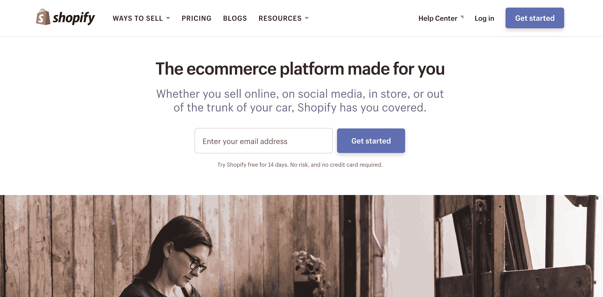
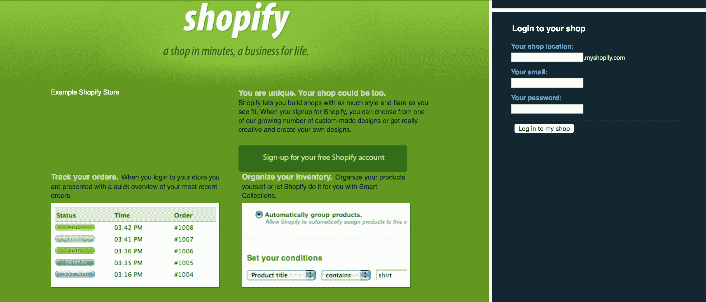
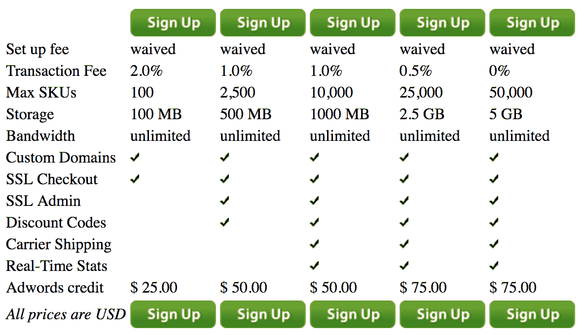
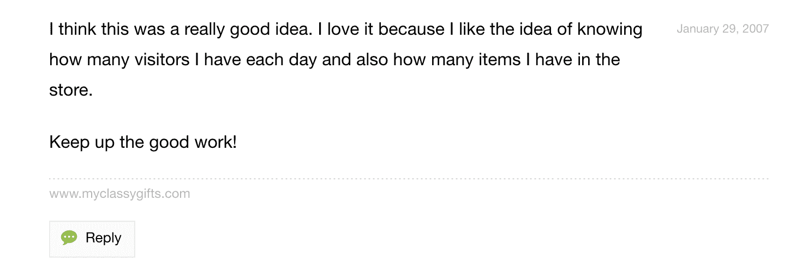
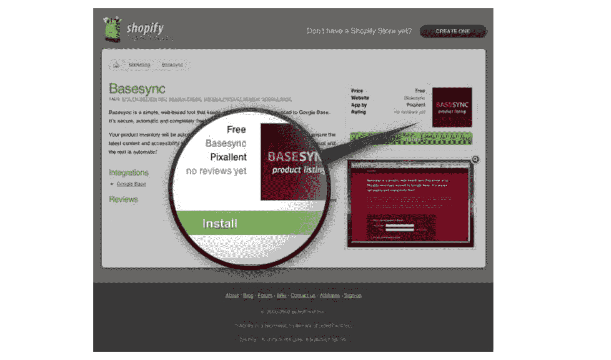
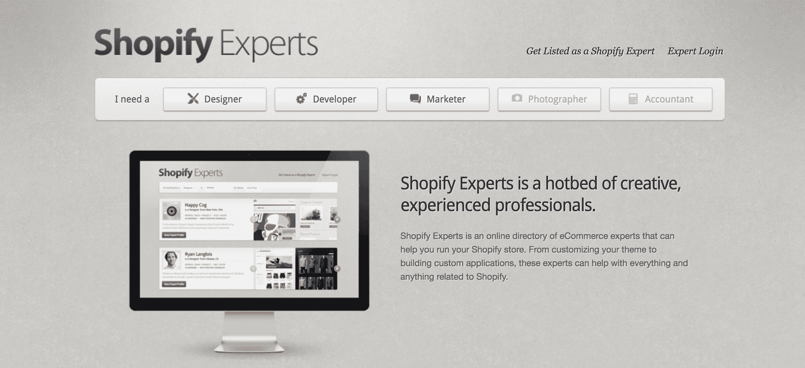
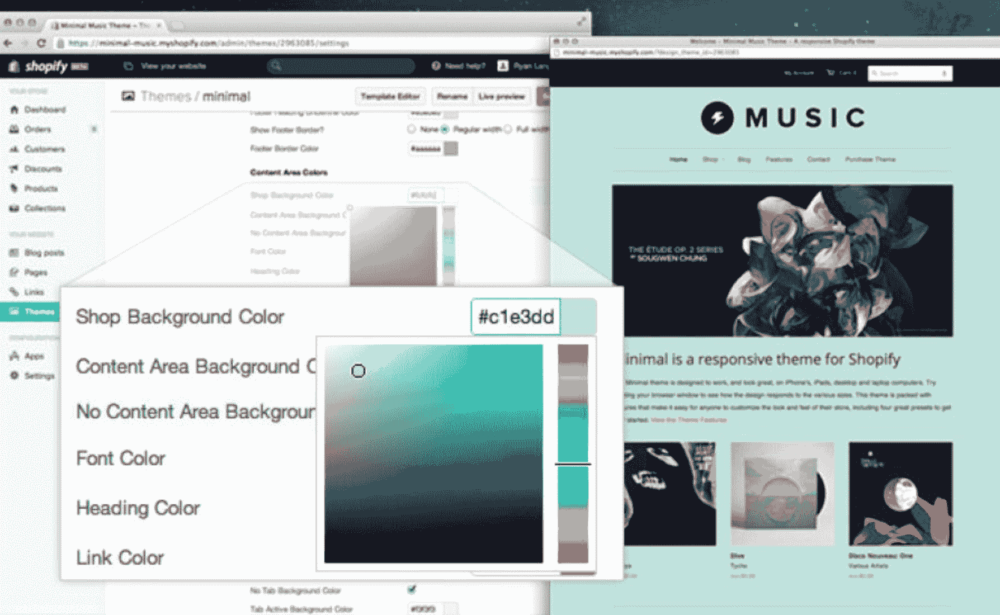
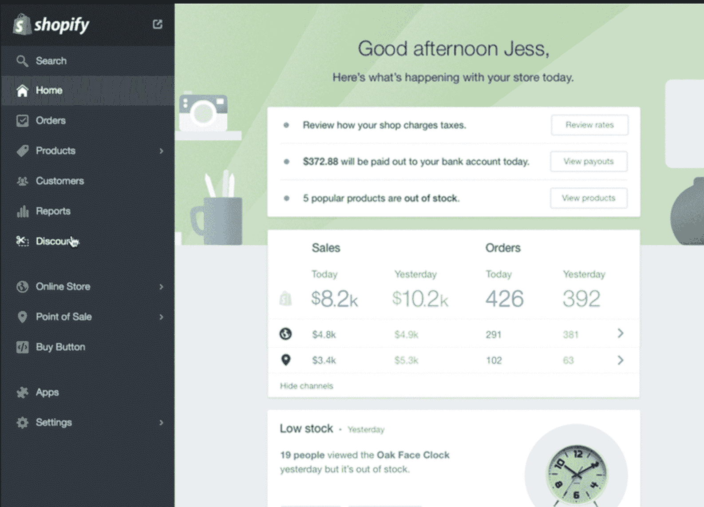
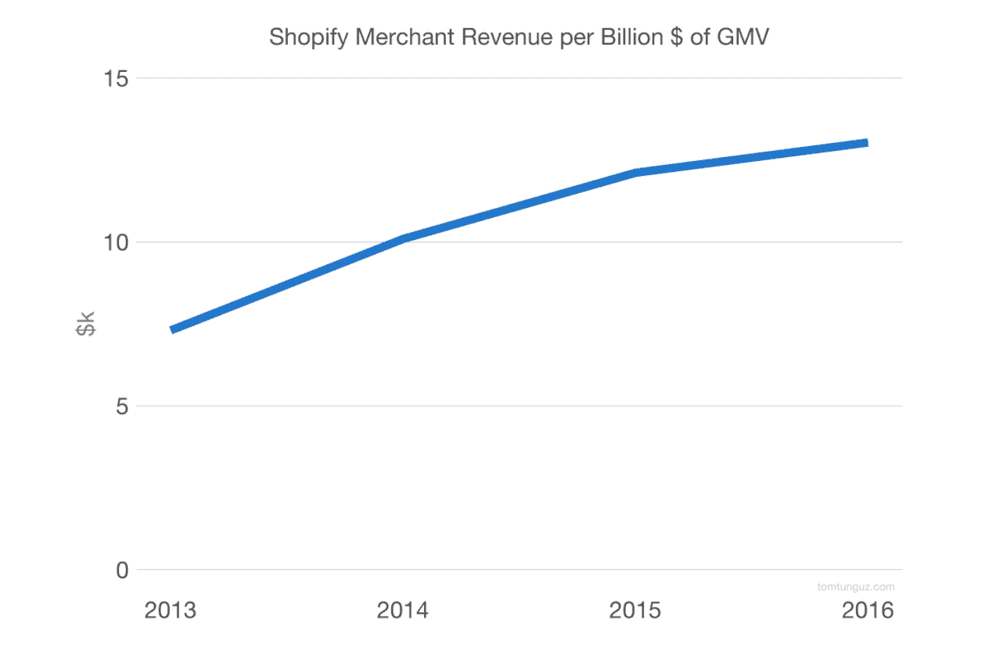

# Shopify 如何从一家滑雪板商店成长为价值 100 亿美元的商业生态系统|产品习惯

> 原文：<https://producthabits.com/shopify-grew-snowboard-shop-10b-commerce-ecosystem/?utm_source=wanqu.co&utm_campaign=Wanqu+Daily&utm_medium=website>

# Shopify 如何从一家滑雪板商店成长为一个价值 100 亿美元的商业生态系统

当 Tobias Lütke 和 Scott Lake 在 2004 年决定建立一个在线商店时，他们并不知道他们最终会创建世界上最大的电子商务平台。他们计划做的只是建立一个网站，在那里他们可以销售滑雪板装备。

如今，他们的平台 Shopify 为个人卖家和谷歌、特斯拉等互联网巨头托管了超过 325，000 家店铺。该公司每月收入超过 2000 万美元。

与许多公司不同，Shopify 不仅被激励向客户销售产品，还被激励帮助客户在平台上更加成功。顾客赚的钱越多，Shopify 赚的钱也越多。这促使 Shopify 帮助他们的用户成为更好的商家，这是他们发展到今天的最大原因。

让我们深入了解 Shopify 是如何建立起 100 亿美元的业务的，以及他们可以从这里走向何方。

## 从工具到平台再到生态系统

像许多初创公司一样，Shopify 最初是为创始人亲身经历的一个问题提供解决方案。

Lütke 和 Lake 想开一家网上滑雪板商店，但是他们找不到适合他们的软件。吕特克[这样描述](https://signalvnoise.com/posts/2378-qa-with-tobias-ltke-of-shopify):

“我建立了基于各种不同系统的网上商店，如 Miva、OsCommerce 和 Yahoo stores。说实话，所有这些系统都让我起鸡皮疙瘩，因为它们太糟糕了。最后一根稻草是当我得到一个为我的滑雪板商店定制的设计时，我不能让它在雅虎商店工作。我们用所有这些新的“网络标准”完成了这个基于 CSS 的伟大布局，雅虎商店的可定制性几乎不允许我改变顶部框架的背景颜色。”

他们决定构建他们想要的解决方案，该产品成为 Shopify。但他们并没有就此止步。Shopify 通过从工具到平台到线下生态系统的扩张，建立了一个十亿美元的业务。

为了找出 Shopify 是如何成长为如此成功的企业的，让我们来看看:

*   Shopify 如何将他们最初的产品打造得比当时的其他电子商务网站更简单、更快捷、视觉效果更好
*   Shopify 如何将他们的产品从仅仅服务于卖家扩展到帮助开发者和更大的电子商务社区
*   Shopify 计划如何在日益复杂的电子商务领域继续提供更简单的销售解决方案

让我们仔细看看 Shopify 是如何通过将一切重新驱动到帮助用户成为更成功的商家来实现增长的。

## 2004-2008 年:为小商户提供电子商务工具

*“刚开始的时候，没有什么宏大的计划。”托拜厄斯·吕特克*

Lütke 的职业是软件工程师，但到了 2004 年，他不想再做程序员了——他筋疲力尽了。他决定追求一种激情，并开了一家名为 Snowdevil 的网店，在那里出售第三方的滑雪板。

很快，他遇到了一个大问题。Lütke 试图用来建造 Snowdevil 的每一个工具都让他感到沮丧。他真正想要的是一个简单、用户友好的工具——一个当时还不存在的工具。

Lütke 决定不使用像 Yahoo！商店，他会从头开始为斯诺登建立网上商店的基础设施。

为了做到这一点，他使用了一个名为 Rails 的新编程框架，该框架由 David Heinemeier Hansson 在 37signals ( [现为 Basecamp](https://37signals.com/) )创建。这在两个方面对 Shopify 的发展非常重要:

*   Rails 的“基本”设计原则贯穿了 Shopify 产品的最早版本。早期的产品有一个轻量级的界面，对于第一次从事电子商务的商家来说非常简单，很容易理解。
*   Rails 精神影响了 Shopify 成功和帮助客户的长期战略。Hansson 开发了 Rails，这样他就可以构建一个项目管理工具。然后，他将 Rails 框架和项目管理工具作为产品提供给其他人。Shopify 为商家做了同样的事情——lütke 建立了一个电子商务工具，这样他就可以自己建立 Snowdevil。然后，他让其他人也可以使用这个工具。

Lütke 和他的早期团队在没有产品的地方开发了一种易于使用的产品，并为小商家提供了解决他们自己问题的工具。这创造了一个新的市场，人们以前从未能够成功地在网上销售，但现在他们需要的一切都有了。

**2004-2005:** 大约在 Lütke 和 Lake 试图用现成的电子商务工具构建 Snowdevil 的时候，一个朋友告诉他关于 Ruby on Rails 的事情。吕特克爱上了它——以及它背后的设计哲学。它强调工具应该易于使用并且有趣。这正是 Lütke 在尝试使用当时可用的复杂而笨重的电子商务工具时所想的。经过两个月在 Rails 上的构建，bones Snowdevil 网站已经上线并运行。

来源:来自斯诺登邪恶网站的早期版本。

他们在 2004 年有一个滑雪装备销售的盈利季节，但是对 Shopify 的最初反应比他们的商店更加突出。他们开始向 Rails 社区的一些同事传递他们的电子商务平台，并收到了大量关于他们如何建立网站的询问。

Lütke 和 Lake 看到了帮助其他人在线销售的机会。他们意识到，比起经营网上滑雪板商店，他们更有兴趣帮助其他商家。他们搁置了 Snowdevil，重新专注于创造一种产品，帮助人们建立自己的在线商店。

2005 年，Lütke 认识的一位程序员 Daniel Weinand 加入了这个团队。他对设计非常感兴趣，吕特克和莱克希望他能帮助他们将想法转化为吸引人的产品。他们一起开始为商人建立一套工具。

2006 年: Lütke、Lake 和 Weinand 正式推出了 Shopify，作为一套商家可以用来建立自己网站的工具。最初的产品帮助商家建立了可定制的商店模板，在 RSS 提要中跟踪订单，以及自动化的库存组织。它们还包括一些基本的功能，比如上传图片、添加标签和对物品进行分组。支付可以通过贝宝或信用卡处理器集成来处理。

所有这些功能都是基本的，但对经营一个电子商务商店是必不可少的。有了 Shopify，以前从未在网上销售过任何东西的个人第一次拥有了建立一个成功的电子商务商店所需的基本工具。

*

Shopify 平台发布后的网站。

**2007:** 一开始增长缓慢。该公司的月收入约为[8000 美元](http://fortune.com/2017/03/15/shopify-ecommerce-revolution/)，客户群非常小，只有一些 Rails 社区成员和来自韦南圈子的有设计头脑的个人。但最重要的是*他们有付费客户*。

在一次采访中，Lütke 称今年是一个转折点，因为公司改变了向客户收费的方式。此前，他们按销售额的百分比收取交易费，这实际上阻碍了那些从他们的 Shopify 商店赚更多钱的商家。他们转向了基于订阅的计划，并收取少量交易费，交易费随着计划规模的增加而减少。通过这种方式，Shopify 仍然看到了他们工具的所有销售收入的减少，但他们也为客户激励了更大的销售收入。

[来源:](http://web.archive.org/web/20100104211912/https://app.shopify.com/services/signup)来自 Shopify 定价页面的早期版本。

这时，商业模式和客户成功之间的结合就到位了。Shopify 现在将产品开发的重点放在构建有助于客户销售的功能上，因为客户的每一笔销售都意味着 Shopify 的交易费收入增加。例如，他们在产品中内置了分析功能，帮助商家跟踪他们的库存和销售，这是早期用户喜欢的。

[来源:](https://ecommerce.shopify.com/c/shopify-discussion/t/shopify-dashboard-5944#comment-6003)2007 年推出后，一个论坛上对新电子商务分析的评论。

同年，多伦多的天使投资人约翰·菲利普斯给 Shopify 开了一张 25 万美元的支票。他估计它们值 300 万美元。

2008 年: Shopify 在一个易于使用的产品和初学者友好的品牌之间找到了平衡点。该公司的网站和内容强调易用性，并提供有用的提示。Shopify 在自己的底线上看到了客户的成功——该公司现在在 MRR 的收入是 6 万美元。

在这一点上，Shopify 专注于为首次卖家提供他们在网上销售商品所需的基本构件。跟踪订单、管理库存和拥有基本的分析能力是首次卖家最重要的核心功能，也是 Shopify 最先创造的功能。

但即使是规模更大、经验更丰富的商家，比如特斯拉汽车，也有理由去看看 Shopify。他们的软件比微软商务和雅虎商店等其他软件更便宜，也更容易使用。考虑到这一点，Shopify 展示了他们如何迎合各种需求和规模的卖家。

在这段时间里，Shopify 微妙的品牌特征之一是可访问性。除了使产品尽可能直观，该公司还创建了简单的指南和广泛的常见问题页面，以帮助用户在线销售。这有助于新商家销售更多商品，并让几乎所有人都有能力成为 Shopify 用户。

但是 Lütke 和 Weinand 看到了更大市场的潜力。他们从自己的开发者背景以及与开发者社区的朋友交谈中了解到，人们可能有兴趣为 Shopify 商店构建自己的定制和应用程序。如果 Shopify 团队能够为人们创建一个分享和销售这些应用的平台，他们就可以从这些交易中提成。

## 2009-2013 年:打造在线销售工具包

Lütke 和 Weinand 的开发背景——以及他们对帮助更广泛的用户基础的关注——使他们能够通过建立 API 和应用商店来实现从工具到平台的关键转变。

当时，他们只是将此视为志同道合的开发者销售其应用的机会。这也是给 Shopify 商家更多定制选择的机会。但这一举措对 Shopify 的增长至关重要，因为它帮助他们在其他网络业务萎缩时扩张。

许多当代网络企业未能像 Shopify 一样从工具过渡到平台。2004-2008 年的软件工具浪潮通过创造简单的工具，把一件事情做得非常好，使网络成为一个更友好的地方。起初，这些工具是有价值的*,因为*它们简单而流畅。他们用臃肿的功能集取代了拥有复杂用户界面的旧工具。

但是，当这些公司无法扩展到简单、令人愉快的工具之外时，它们就被收购并并入更大的公司。以下是几个例子:

*   照片和视频分享网站 Flickr(成立于 2004 年)被雅虎收购。2005 年为[3500 万美元](https://techcrunch.com/2014/08/23/flickrs-acquisition-9-years-later/)
*   新闻聚合网站 Digg(成立于 2004 年)在 2012 年以大约 1600 万美元的价格分三部分出售
*   Feedburner(成立于 2004 年)，网络订阅管理提供商，在 2007 年被谷歌以 1 亿美元收购
*   社交书签服务公司 Delicious(成立于 2003 年)被雅虎收购。2005 年为 1500 万到 3000 万美元。

这些公司没有完成从工具到平台的关键转变。但是，Shopify 做到了。它始于他们 API 平台的发布。

2009 年:在公司的第三个生日，Shopify 发布了一个 API 平台和应用商店。两者都是为了帮助现有的 Shopify 商家和新的开发者。在[的新闻稿](https://www.shopify.com/press/releases/17847928-shopify-launches-api-platform-and-app-store)中，吕特克说:

“电子商务是一种高度个性化的业务。每个商店都想提供独特的购买体验，但提供太多的功能会使软件变得笨重和难以使用。Shopify API 解决了这一问题，它允许商家安装他们需要的功能，以充分利用他们的商店……我们的合作伙伴可以通过为这些商店开发优秀的应用程序来获得经常性收入来源。”

这意味着更多的人和企业开始投资电子商务平台。

在应用商店中，开发者可以销售他们的应用，商家可以浏览、购买和直接安装应用。现在，商家有办法快速定制和改进他们的网上商店。

[来源:](https://www.shopify.com/blog/3031572-shopify-app-store-and-api-officially-launched)如何从 App Store 安装应用，见 2009 年关于发布的博文。

商家可以选择最有用的附加服务，这有助于 Shopify 忠于产品的初衷:让每个人都能更方便地进行电子商务。

2010 年: Shopify 发布了一款免费应用程序，为商家提供了另一种管理在线销售的方式。Shopify Mobile 是一个游戏改变者，因为它允许卖家监控他们的在线商店，查找客户信息，并通过手机完成订单——正如“移动商务”正在兴起一样。从 2009 年到 2010 年，全球智能手机出货量[增长了 74%](http://www.bgr.com/2011/03/10/berg-smartphone-shipments-grew-74-in-2010/) 。越来越多的人开始使用智能手机，在网上进行交易。这是一个掌控新频道的巨大机会，而 Shopify 就在其中。

Shopify 还通过发起“建立业务”比赛来加强他们促进电子商务的努力。这场比赛要求店主们在八个月的时间里开办一家商店。他们创造了高额赌注来激发热情:最成功的公司将赢得 10 万美元的奖金，并得到名人企业家的指导。

这场比赛激发了超过 1000 家新的在线商店，这些新商店创造了超过 300 万美元的收入，并成为《纽约时报》的报道素材。

**2011:** Shopify 现在在[支持 11，300 多家商店](https://www.shopify.com/blog/5254142-shopify-year-in-review-2011)，这些商店创造了超过 1.25 亿美元的收入。Shopify 拥有众多不同层次的用户，因此希望扩大获得专业支持的渠道。他们发布了 Shopify 专家，这是一个“有经验的 Shopify 专业人士的在线目录”，拥有丰富的 Shopify 知识，可以向经验不足的卖家提供建议。

[来源:](http://web.archive.org/web/20111230093115/https://experts.shopify.com/)Shopify 专家的发布。

**2012 年:**从 2011 年到 2012 年，Shopify 在[的新店增长了 61%](https://www.shopify.com/blog/5254142-shopify-year-in-review-2011)(达到 18，200 家)，收入增长超过 2.2 倍(所有商店的销售额达到 2.75 亿美元)。

2013 年: Shopify 发布了一个重大的平台重新设计——Shopify 2，包括 60 多项新功能。他们[从他们的客户群](https://techcrunch.com/2013/04/11/after-7-years-50k-storefronts-launched-shopify-launches-major-redesign-to-simplify-online-store-building/)——现在超过 50，000 个商家——获得反馈，并增加了退款管理、更好的搜索功能、更易于使用的管理功能和实时主题编辑器等更新。重新设计的所有这些方面都专注于让商家更容易管理 Shopify 平台上的商店。

Lütke 在一份新闻稿中说，这次重新设计有助于 Shopify“重新定义电子商务的运作方式”，并且 Shopify 正在“转变为一种不那么传统的关于如何构建网页的思维方式。”Shopify 2 帮助设计师快速原型化并发布新的商店和应用程序。

当他们在 2013 年筹集到 1 亿美元的 C 轮融资时，Shopify 已经不仅仅是一个零售商可能在众多在线销售工具中选择的工具。Shopify 创建了一个应用生态系统和一个开发者社区，并把自己变成了一个在电子商务领域取得成功的平易近人的权威。该公司已经融入了网上交易的结构中。

2013 年对 Shopify 来说也是关键的一年，因为他们开始关注他们的商家如何在线下销售*。他们[发布了 Shopify POS](https://www.shopify.com/blog/8814755-introducing-shopify-pos)——提供店内和网上库存同步，开箱即用的信用卡处理，以及为实体店销售的商家提供报告。新的 Shopify 支付功能也捆绑在一起，因此商家可以在线和离线同步支付。*

 *在此期间，Shopify 采取了所有必要的措施，加倍努力让商家更加成功，并增加在线交易的数量。但他们也开始寻找一个完全不同的增长空间:线下商务。

## 2014 年至今:扩展到网上店面之外

当 Shopify 在 2013 年建立 POS 时，它为商家提供了更多管理销售的工具，并提供了另一种方式来推动整个 Shopify 平台的更多收入。

但是 POS 不仅仅是另一个有用的功能。对于 Shopify 来说，这是一个重要的时刻，有助于再次扩大他们的业务范围。这一次，他们没有在互联网上扩张，而是想抓住仍然在线下进行的商务。

这意味着重新定义公司的重点，从产品到使命。起初，Shopify 的愿景非常以产品为中心。[他们的目标是](https://www.shopify.com/press/releases/17847200-shopify-announces-100-million-funding)、*让任何人都能轻松创建一个漂亮而强大的在线商店。*“最早的客户欣赏这些工具和平台。但为了继续发展，Shopify 将他们的视野扩大到了更广泛的受众。[不再只关注让在线卖家受益的电子商务软件，而是致力于](https://www.sec.gov/Archives/edgar/data/1594805/000119312515129273/d863202df1.htm)“*让电子商务对每个人都更好*

这适用于在任何地方销售任何东西的人，而不仅仅是建立在线商店的人。当他们宣布他们的 C 系列时，创始人说:

Shopify 最初是一种简单的在线销售产品的方式。我们利用之前的融资扩展到新的领域，丰富了我们的产品并帮助了我们的商户，如支付和移动……新一轮融资将帮助我们通过 [POS](http://www.shopify.com/pos) 进一步扩展到实体零售，因此我们的商户可以随时随地轻松销售他们的产品。”

Shopify 通过从电子商务工具重新聚焦到帮助每个人在线上和线下销售的更广泛的使命，从[产品第一扩展到移动第二](http://producthabits.com/next-companies/)。现在，他们进入了更多的分销渠道，撒下了更大的网。只要他们能从每笔交易中分得一杯羹，该公司就有信心让所有形式的商务变得更容易将继续推动公司的增长。

2014 年: Shopify 彻底改造了他们的应用程序，以适应线下销售。新的 Shopify 手机与 Shopify POS 同步。该应用程序允许商家在零售店接受手机支付，作为第二个注册，添加和编辑库存清单，并自动更新物理零售位置的变化。

Lütke [称 Shopify 对移动电子商务的新关注](https://www.shopify.com/blog/15206517-mobile-now-accounts-for-50-3-of-all-ecommerce-traffic)是成为移动优先公司的关键。他们在最恰当的时间做到了这一点，从市场中获取了最大的价值。2014 年，当该公司将 POS 引入 Shopify Mobile 时，有史以来第一次[超过一半的电子商务流量](https://www.shopify.com/blog/15206517-mobile-now-accounts-for-50-3-of-all-ecommerce-traffic)来自移动设备。

Shopify 也开始加倍为大型商家提供服务。同年，他们推出了 Shopify Plus，这是一种为销售大量库存的商家提供的白手套电子商务服务。它提供了无限的带宽、更多的存储、更多的定制选项和优先帐户管理。他们把它框定为帮助与平台一起成长的客户的一种方式，而不是向高端市场发展的一种方式。这很重要，因为公司想扩大他们的客户群，但不想疏远对他们的品牌如此重要的小用户。

2015 年: Shopify 推出了购买按钮，作为从任何网站销售商品的一种方式——不仅仅是电子商务店面。用户可以在他们用 WordPress、Squarespace 和 Tumblr 制作的网站上添加购买按钮。

由于 Shopify 有如此多的销售方式，包括电子商务店面、POS 和购买按钮，商家需要一个集中的地方来管理他们的销售。因此在同一年，他们在平台上添加了多渠道 Shopify，其中包括一个供商家管理多渠道销售的仪表板。

[来源:](https://www.shopify.com/plus/solutions/multi-channel-ecommerce)2015 年 Shopify 多通道仪表盘。

**2016:** 为了融合线下商务的个性化和电子商务的便利性，Shopify 引入了与 Facebook Messenger 的集成。商家可以与客户就订单进行沟通，并通过更加个性化的渠道为他们提供实时服务。

**2017:** Shopify 用 Shopify 二维码进一步拉近了线上线下购物的距离。这使得购物者可以用手机摄像头扫描实物上的代码，并直接在商家的在线商店中访问该商品。

今年早些时候，Shopify 还迈出了一大步，向所有用户免费提供一些最先进的电子商务软件功能。Shopify 在 2016 年集成了虚拟助手套件，但该功能仅适用于某些订阅计划的用户。现在，Kit 免费提供给每个人，这将帮助更多的商家以更少的努力和更少的店铺维护支出卖出更多的商品。

在过去几年中，Shopify 的产品扩张一直围绕着让线下和在线商务更容易同步和管理。但是，尽管新产品功能正在扩大商家的覆盖范围，Shopify 仍小心翼翼地保持小企业销售带来的个性化特色。

他们通过整合 Messenger 开创了“对话式商务”的理念。该功能不是机器人或人工智能——从设计上来说。它没有将商家与客户的体验分离，而是将他们更紧密地带入了体验。这对习惯于线下销售的小企业主来说非常重要，有助于减少在线和线下商务之间的摩擦。

适应线下商务是内部增长的巨大驱动因素。它让以前只在网上销售的商家也可以在网下销售。因此，Shopify 可以通过更高的交易费用更好地利用现有客户。

从 2013 年到 2016 年，来自商户服务的收入从 20%增长到 50%。每个商家的平均订阅费用没有太大变化——每个商家都没有升级他们的计划或支付更多费用。但平均合同价值增加了，因为 Shopify 每 10 亿美元 GMV 收取了更多的服务费。

*

[来源:](http://tomtunguz.com/shopify-s-1/)2013 年至 2016 年，Shopify 每 10 亿美元商品总值产生的商户服务收入有所增加。

从战略上来说，通过 Shopify Plus，Shopify 确保了即使商家增加了销量，也不会超出他们的平台。无论商家的规模或销售活动如何，Shopify 都可以提供一个有用的工具，让他们更容易卖出更多。

## Shopify 将何去何从

Shopify 已经与在线商家合作了 13 年，但他们才刚刚开始进入线下市场。

商业工具领域竞争激烈，但 Lütke 表示，拥抱外部变化是公司的核心价值，并推动他们不断创新。在今年的一次采访中，吕特克指出，“我们看重的不是可预测性和所有这些东西。我们看重的是我们适应新现实的速度。”

以下是 Shopify 面临的新现实，以及他们未来可以扩展的几种方式:

*   **扩展到商店之外的个人界面:** Shopify 已经在早期投资了会话式商务。2016 年收购 Kit CRM 是一个巨大的举动。他们在 Facebook Messenger 中推出的商业交流频道也是如此。Shopify 押注于这样一个未来:人们通过个人和基于文本的界面，如 Messenger 和 WhatsApp，买卖更多的东西。虽然这在美国起步较慢，但在中国，微信等通讯平台是虚拟钱包和商业中心。消息传递是一种高流量、高交易量的球类运动，非常适合 Shopify 的商业模式。如果成功，Shopify 将拥有先发优势，推动即时通讯平台的商业发展。
*   **向高端市场转移:**尽管 Shopify 最初是为小型企业提供支持，但其未来最大的增长机会之一是向高端市场转移，通过向企业销售来实现复合年度合同价值。2016 年，Shopify 收购了产品开发店 Boltmade，以加速 Shopify Plus 的开发。自那以后，他们加大了企业友好功能的开发，如营销自动化和多渠道销售。他们甚至创建了一个可定制的后端来跟踪库存，并将其与预先存在的系统集成。Shopify 可以通过添加更多营销自动化功能来增加企业合同的订阅价值，商家可以在与库存管理和多渠道分析相同的工具套件中查看这些功能。他们还可以继续创建一个更加可定制的后端，为最大和最细微的公司提供在 Shopify 平台上构建的灵活性。
*   **面向用户的机器学习和人工智能:**2016 年，Shopify 推出了名为 Shopify Capital 的商户现金预付计划，为商户提供了一种快速、简单、便捷的方式来为他们的商店获得融资，并转向实际销售。该工具使用机器学习来评估美国商家的风险，并生成关于其资格的定制报告。对于他们来说，这是一种非常有用的方法，他们可以利用自己收集的数据来评估商家的贷款资格，从而为他们提供更多帮助。正如一位分析师所报告的那样，“Shopify 一直在以很高的速度生成各种数据类型的大量数据，该公司在 Q1/17 年的平台上看到了+12 亿次交互，而 2016 年为+35 亿次。”他们有潜力开始将机器学习和人工智能直接引入商家可以在前端使用的附加功能。一些潜在的应用可以是对客户的产品推荐以及在线营销的细分和定位。

在 2017 年 Q2 结束时，Shopify 报告收入同比增长[75%](https://investors.shopify.com/Investor-News-Details/2017/Shopify-Announces-Second-Quarter-Financial-Results/default.aspx)。该公司认为他们的成功与他们适应不断变化的市场需求的能力密切相关。首席财务官罗斯·琼斯(Russ Jones)表示，“零售业向多渠道和移动的根本转变，大型品牌对 Shopify 的持续采用，以及我们对为卖家打造市场领先平台的持续关注，都为我们的业绩做出了贡献。”

如果他们能够跟上这些转变，帮助大客户和小客户销售更多库存，Shopify 将处于继续增长的有利地位。

## 从 Shopify 吸取的教训

Shopify 在 SaaS 建立了一项业务，依靠订阅费和交易量的增长来维持。但他们也取得了成功，因为他们有能力预测市场的需求，并以有益的产品迅速做出反应。

如果你现在正在创业，下面是一些你可以从 Shopify 的旅程中学到的重要经验:

### 1.将你的产品、商业模式和公司目标结合起来

Shopify 的最大优势之一是，其商业模式与帮助客户获得成功相一致。Shopify 客户的销售额越多，Shopify 带来的收入就越多。这是团结公司所有人的好方法，从产品团队到客户支持，专注于帮助客户成功。每个人都从中受益，因此每个人都投入到持续改进中。

当你在创建一家公司时，推动一致性的最重要的方法之一是[选择一个单一的指南针指标](https://blog.profitwell.com/compass-saas-metric-for-hyper-saas-growth)，或用于衡量增长的主要公司范围指标。Lütke 称这一指标为“快速增长的数百万美元风险投资支持业务的发动机。”Shopify 的指南针指标是承诺的每月经常性收入；他们有许多收入来源，但他们的底线是直接联系到保持快乐和成功的商人的基础。Lütke 认为 CMRR 是快乐和忠诚的客户群的良好标志，因此他使用这一指标来激励他的团队，并优先考虑客户的最佳结果。

为了围绕您的指南针指标创建校准，Lütke 首先推荐以下高级步骤:

1.  根据你公司所处的阶段和你想要完成的目标，选择关注[的指标](https://blog.profitwell.com/choosing-the-right-saas-metrics-for-different-stages-of-your-company)
2.  选择一个允许紧密反馈循环的时间框架
3.  设计一个用户界面，你可以用它来通知你的团队

许多其他公司已经将此付诸实践。Price 的 Patrick Campbell 聪明地将 Lütke 关于 compass metrics 的想法传播给了 SaaS 的其他企业。在 Price Intelligently，他们实施了两种方法来[围绕他们推荐给公司的指南针指标](https://blog.profitwell.com/compass-saas-metric-for-hyper-saas-growth)建立问责制:

1.  每天发送电子邮件，跟踪指南针指标的进展
2.  为团队成员召开周会，分享他们在那一周学到的东西，以及他们计划如何在下一周改进指标

### 2.坚持不懈地确定产品的优先顺序

尽管 Shopify 的许多产品创新在事后看起来很明显——比如创建一个拖放主题生成器，或者开发消息产品——但该公司的成功很大一部分是因为他们专注于以正确的顺序做正确的事情。

他们建立了一个真正有用的工具，这给了他们一个进入在线商业市场的楔子。然后，他们建立了一个平台，这使得他们能够创建一个网络。最后，他们建立了一个生态系统——包括线上和线下。顺序很重要，因为每一步都建立在前一步成功的基础上。

优先顺序是至关重要的，即使你仍然专注于构建你的产品，还没有达到一个更大的平台或网络阶段。如果你现在正在开发一款产品，Shopify 产品总监 Brandon Chu 建议使用一个基于两个数据点的[量化框架](https://blackboxofpm.com/ruthless-prioritization-e4256e3520a9)来确定产品优先级:

1.  客户价值金额
2.  完成一个项目所需的时间

确定每个项目的这两个因素将帮助您确定客户对您的时间投资的回报。

像顾客价值这样的东西必须根据你的具体产品来量化。客户价值可能是节省的金钱，也可能是节省的时间。无论哪种方式，当你将价值除以你的团队构建该特性所花费的时间时，你就会明白你每小时的工作时间能为你的客户节省多少时间或金钱。这是一个有用的方法，可以比较和最大化你为用户创造的价值，并确保你为下一步的最佳行动做好准备。

### 3.拥抱长期主义

打造一个产品和一个公司，总是需要在长期和短期价值之间做一些权衡。Shopify 坚持长期优先。按照 Lütke 的说法，“优秀的产品人员了解世界工作方式的变化将如何影响日志文件。他们可以实时感知这种影响。”

Shopify 的 100 亿美元之旅来之不易。他们用了四年多的时间达到 100 万美元，用了八年时间达到 1 亿美元。但一路走来，他们总是优先考虑有利于与卖家长期关系的决策，而不是那些可以获得短期利润的决策。

例如，Shopify 从一开始就决定所有的店面都将托管在他们自己的服务器上，这使得他们都支持快速 CDN。其他公司，如 WordPress，给用户提供自主托管的选择，这可能会降低 Shopify 的管理费用。但是提供主机服务为他们的新手商家消除了一层复杂性，因为他们不想自己解决主机问题。它为与非常新的卖家建立关系奠定了基础。

我发现以下框架有助于创业者思考下个月的 MRR 之后的事情:

*   你的产品的价值主张是什么，它的价值实现时间是什么？
*   该领域的竞争情况如何？
*   每个目标客户的价值是多少？潜在的市场价值是什么？
*   你能帮助你的客户取得成功的最快方法是什么？

## Shopify 的未来

多亏了 Shopify，任何人都可以在自己的电脑上开一个网上商店。商家有更多的方式与顾客接触，了解他们想要什么，并在网上或实体店向他们出售商品。

Shopify 还改变了消费者的商业潜力。由于网上商店易于设置和维护，电子商务商店的数量呈爆炸式增长。这意味着消费者有了更多的选择，更多的竞争提高了质量，在许多情况下，与店主和品牌的关系也更好了。

Shopify 让成千上万的人以前所未有的方式成为了商家和消费者。通过围绕客户成功建立商业模式，他们获得了自己的增长机器。接下来会发生什么，取决于该公司能在多大程度上预测市场变化并随机应变。如果历史可以作为参考，他们会准备好的。***