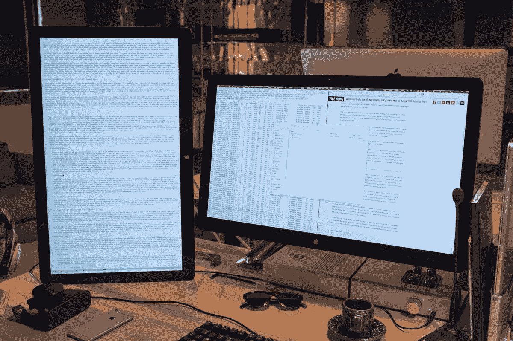

# 首席执行官 Emacs 指南

> 原文：<https://blog.fugue.co/2015-11-11-guide-to-emacs.html?utm_source=wanqu.co&utm_campaign=Wanqu+Daily&utm_medium=website>

几年前，不，几十年前，我住在 Emacs。我编写代码和文档，管理电子邮件和日历，并在编辑器/OS 中完成所有工作。我很开心。几年过去了，我搬到了更新更亮的地方。结果，我忘记了如何在没有鼠标的情况下有效地浏览文件等基本任务。大约三个月前，我注意到自己花了很多时间在应用程序和电脑之间切换，于是决定再试一次 Emacs。这是一个好的决定，有几个原因将在这篇文章中讨论。还包括 `.emacs` 和 Dropbox 提示，以便您可以建立一个良好的、可移动的环境。

对于那些没有使用过 Emacs 的人来说，你可能会讨厌它，但可能会喜欢它。这有点像一个房子大小的鲁布·戈德堡机器，乍一看，它具有烤面包机的所有功能。这听起来不像是一种认可，但关键词是“乍一看”。一旦你找到了 Emacs，你就会意识到它是一个热核烤面包机，还可以作为...嗯，你想对文本做什么都可以。当你想到你的计算生活有多少是围绕文本的，这是一个相当大胆的说法。大胆，但真实。

也许对我来说更重要的是，这是我使用过的唯一一个应用程序，它让我觉得我真的拥有它，而不是把我塑造成一个匿名的“用户”,他的钱包被位于 Soma 或 Redmond 附近的豪华办公室中的产品营销部门巧妙地盯上了。现代生产力和创作应用程序(例如，页面或 ide)就像碳纤维赛车。他们来时装备得很好，装配得很齐全。Emacs 就像是一盒经典的[孔帕尼奥洛](http://www.campagnolo.com/US/en)零件和一个漂亮的拖式钢架，缺少一个曲柄臂和一个刹车杆，你必须在互联网上的一些小亚文化中找到。第一个更快更完整。第二个是无尽快乐或烦恼的来源，这取决于你的个性——并将持续到你生命的最后一天。我是那种对找到一个旧仓库或者用 eLisp 调整我的编辑器感到同样快乐的人。YMMV。


*A 1933 steel bicycle that I still ride. Check out this comparison of frame tubes: [https://www.youtube.com/watch?v=khJQgRLKMU0](https://www.youtube.com/watch?v=khJQgRLKMU0).*


这可能会给人留下 Emacs 不合时宜或过时的印象。不是的。它强大而永恒，但需要你耐心地理解它的条款。这些术语很不寻常，看起来很奇怪，但其中有一种逻辑，既有说服力又有魅力。对我来说，Emacs 更像是未来，而不是过去。正如笨重的钢架在未来几十年将变得有用和舒适，碳纤维神童自行车将被扔进垃圾填埋场，在撞击中粉碎，当最新的流行应用程序被遗忘很久时，Emacs 将继续作为一个有用的工具。

如果通过编辑 Lisp 代码来构建自己的个人工作环境，并让这个完美的环境跟随你到任何一台计算机的想法对你有吸引力，你可能真的会喜欢 Emacs。如果你喜欢新鲜闪亮的东西，想直接投入工作而不需要太多的时间和精神周期，这可能不适合你。我不再写代码了(除了 Ludwig 和 Emacs Lisp)，但是 Fugue 的许多工程师都很好地使用了 Emacs。我认为我们的工程师大约 30%是 Emacs，40%是 ide，30%是 Vim 用户。但是，这篇文章是关于首席执行官和其他[头发尖尖的老板](http://www.businessinsider.com/best-pointy-haired-boss-moments-from-dilbert-2013-10)【PHB】<sup id="phbOrigin">[1](#phb)</sup>(以及，嘿，任何好奇的人)，所以我将解释和/或合理化我为什么喜欢它以及我如何使用它。我也希望为你提供足够的细节，让你可以有一个成功的体验，而不用花几个小时去搜索。

## 持久的优势

使用 Emacs 带来的长期优势只是让生活变得更加轻松。净收益使得最初的提升完全值得。考虑这些:

### 不再有上下文切换

仅 Org Mode 一项就值得投入大量时间，但如果你像我一样，你通常会处理十几份文档——从博客帖子到会议需要做的事情列表，再到员工评估。在现代计算世界中，这通常意味着使用几个应用程序，所有这些应用程序都有令人分心的用户界面和不同的存储、排序和搜索方式。结果是你需要不断地转换思维环境，记住细节。我讨厌上下文切换，因为它是由于一个坏的界面模型 <sup id="tufteOrigin">[2](#tufte)</sup> 强加给我的，我讨厌必须记住我的计算机在任何理性世界中应该为我记住的东西。在提供单一环境方面，Emacs 对于 PHB 来说甚至比程序员更强大，因为程序员倾向于在一个应用程序上花费更多的时间。转换心理环境的成本比通常看起来的要高。操作系统和应用程序供应商已经开始设计界面来转移我们对这一现实的注意力。如果你是技术人员，在一个键盘快捷键(`M-:`)中使用强大的[语言解释器](http://www.webopedia.com/TERM/I/interpreter.html)尤其有用。 <sup id="interpreterOrigin">[3](#interpreter)</sup>

许多应用程序可以全天全屏显示，并用于编辑文本。Emacs 是单数，因为它既是编辑器又是 Lisp 解释器。本质上，你有一个图灵完整的机器，当你在忙你的事情的时候，一两次击键就够了。如果你对编程有所了解，你会意识到这意味着你可以在 Emacs 中做任何事情。一旦将命令存储在内存中，您就可以在工作时几乎实时地使用计算机的全部功能。您不希望在 eLisp 中重新创建 Excel，但是您可能在 Excel 中做的大多数事情范围较小，很容易在一两行代码中完成。如果我需要处理数字，我更可能跳到暂存缓冲区写一点代码，而不是打开一个电子表格。即使我有一封不是一行的邮件要写，我通常也只是用 Emacs 写然后粘贴到我的邮件客户端。当你可以心流的时候，为什么要切换上下文呢？您可能从一两个简单的计算开始，但是，随着时间的推移，您需要计算的任何东西都可以相对容易地添加到 Emacs 中。这在为其他人创造事物提供丰富特性的应用程序中可能是独一无二的。还记得艾萨克·阿西莫夫书中那些神奇的终端吗？Emacs 是我遇到的最接近他们的东西。 <sup id="ewwOrigin">[4](#eww)</sup> 我不再决定用什么 app 来做这个或那个事情。相反，我只是工作。拥有一个伟大的工具并致力于它，是真正的力量和效率。

### 在平静中创造事物

拥有我所发现的最好的文本编辑功能的最终结果是什么？让一群人做各种有用的补充？拥有 Lisp 的全部能力？除了制作音乐或图像，我还用 Emacs 做所有的创造性工作。

我在办公桌上安装了一台双显示器。其中一个是肖像模式，Emacs 全天全屏。另一个有用于研究和阅读的网络浏览器；它通常也有一个终端打开。我保留我的日历、电子邮件等。，在 OS X 的另一个桌面上，当我在 Emacs 的时候它是隐藏的，我把所有的通知都关掉了。这让我能够真正专注于我正在做的事情。我发现在更现代的 UI 应用程序中消除干扰几乎是不可能的，因为它们努力做到有用和易用。我不需要不断地被提醒如何做我已经做了成千上万次的手术，但我确实需要一张漂亮、干净的白纸来思考。也许由于年龄和虐待，我不擅长在嘈杂的环境中生活，但我建议这对任何人来说都值得一试。看看在您的计算环境中拥有真正的宁静是什么感觉。当然，现在许多应用程序都有隐藏界面的模式，谢天谢地，苹果和微软现在都有有意义的全屏模式。但是，没有其他应用程序强大到足以“适应”大多数事情。除非你整天都在写代码，或者处理一个很长的文档，比如一本书，否则你仍然会面临其他应用程序的干扰。此外，大多数现代应用程序似乎都同时缺乏功能性和可用性。比起 office 应用程序，我更不喜欢的应用程序只有在线版本。




*My desktop arrangement. Emacs on the left.*


但是沟通呢？创造和交流之间的区别是巨大的。当我为每件事留出不同的时间时，我在这两件事上都更有效率。我们在赋格中使用 Slack，既美妙又地狱。我把它放在一个信息桌面上，和我的日历和电子邮件放在一起，这样，当我真的在做东西的时候，我就不会被世界上所有的闲聊所影响。只需要一个 Slackstorm 或者风投或董事会董事的一封电子邮件就能让我立刻丢掉工作。但是，大多数事情通常可以等一两个小时。

### 把一切都带走，永远保存

我发现 Emacs 比其他环境更有优势的第三个原因是，它很容易把你所有的东西都带走。我的意思是，你所需要的是通过 Dropbox 之类的东西同步一两个目录，而不是有太多的应用程序以自己的方式交互和同步。然后，您可以让您的所有工作在您精心设计的适合您的目的的环境中跟随您。我在 OS X、Windows，有时在 Linux 上这样做。非常简单可靠。我发现这种能力非常有用，以至于我害怕处理 Pages、GDocs、Office 或其他类型的文件和应用程序，这些文件和应用程序迫使我回到文件系统或云中的某个地方去查找东西。

将东西永久保存在计算机上的限制因素是文件格式。假设人类现在已经永远解决了存储问题 <sup id="s3Origin">[6](#s3)</sup> ，那么随着时间的推移，我们面临的问题是我们是否能够继续访问我们创造的信息。文本文件是计算中最长久的格式。你可以很容易地在 Emacs 中打开 1970 年的文本文件。对于 Office 应用程序来说，情况并非如此。文本文件也很小，比 Office 应用程序数据文件小得多。作为一个数字迷，一想到什么就做很多小笔记，拥有一个简单、轻便、永久的收藏对我来说很重要。

如果您准备好尝试 Emacs，请继续阅读！接下来的部分不会取代完整的教程，但是会让你在读完之后开始操作。

## 学习骑 Emacs -技术设置

所有这些力量和精神平静的代价是，你有一个陡峭的 Emacs 学习曲线，它做的一切都与你习惯的不同。首先，这会让你觉得你是在浪费时间在一个现代世界已经过时的古老而奇怪的应用程序上。如果你只开过车，这有点像学骑自行车 <sup id="bicyclesOrigin">[7](#bicycles)</sup> 。

### 哪个 Emacs？

我在 OS X 和 Windows 上使用 GNU 的普通 Emacs。在 http://emacsformacosx.com/的 [可以拿到 OS X 版，在 http://www.gnu.org/software/emacs/](http://emacsformacosx.com/)可以拿到 Windows 版。有很多其他版本，特别是针对 Mac 的，但是我发现在真正的交易中，做强大的事情(包括 Lisp 和许多模式)的学习曲线要低得多。所以下载它，我们就可以开始了！ <sup id="nottutorialOrigin">[8](#nottutorial)</sup>

### 首先，你需要学习如何导航

在本文档中，我对键和组合使用 Emacs 约定。它们是“C”代表 control，“M”代表 meta(通常映射为 Alt 或 Option)，连字符代表按住组合键。所以`C-h t`的意思是按住 control 键并键入 h，然后松开 control 键并键入 t。这是调出教程的命令，您应该继续执行。

不要使用箭头键或鼠标。它们可以工作，但是您应该给自己一周的时间来使用 Emacs 中的本地导航命令。一旦你把它们投入到肌肉记忆中，你可能会喜欢它们，无论你去哪里都会非常想念它们。Emacs 教程很好地完成了引导您完成它们的工作，但是我将进行总结，所以您不需要阅读全部内容。令人厌烦的是，你不用箭头，而是用`C-b`表示后退，`C-f`表示前进，`C-p`表示上一个(上)，而`C-n`表示下一个(下)。你可能会想“当我有非常好的箭头键时，我为什么要这样做？”有几个原因。首先，你不必将手从打字位置移开，与 Alt(或 Emacspeak 中的 Meta)一起使用的前进和后退键一次导航一个单词。这比显而易见的更方便。第三个理由是，如果你想重复一个命令，你可以在它前面加一个数字。我经常在编辑文档时使用这种方法，通过估计我需要返回或上下排列多少单词，并做一些类似于`C-9 C-p`或`M-5 M-b`的事情。其他真正重要的导航命令基于`a`表示事情的开始，基于`e`表示事情的结束。使用`C-a|e`是在线上，使用`M-a|e`是在句子上。为了让句子命令正常工作，你需要在句号后加一倍的空格，这同时提供了一个有用的特性，并从思维表中去掉了[意见](http://www.huffingtonpost.com/2015/05/29/two-spaces-after-period-debate_n_7455660.html)的陈词滥调。如果您需要将文档导出到单空间[发布环境](http://practicaltypography.com/one-space-between-sentences.html)，您可以立即编写一个宏来完成。

阅读 Emacs 附带的教程确实很有价值。我将为真正没有耐心的人介绍几个重要的命令，但本教程是黄金。提醒:`C-h t`为教程。

### 学会复制和粘贴

您可以将 Emacs 置于`CUA`模式，这将以熟悉的方式工作，但是一旦您学会了，原生的 Emacs 方式是非常好和非常容易的。您可以通过使用 Shift 和导航命令来标记区域(如选择)。所以`C-F`从光标处向前选择一个字符，等等。你用`M-w`复制，你用`C-w`剪切，你用`C-y`粘贴。这些其实都叫杀和拉，但是和剪切粘贴很像。在杀戮圈的引擎盖下有魔法，但是现在，只需要担心剪切、复制和粘贴。如果你在这一点上开始摸索，`C-x u`是撤销...

### 接下来，学习 Ido 模式

相信我。Ido 使处理文件变得更加容易。在 Emacs 中，通常不使用单独的 Finder|Explorer 窗口来处理文件。相反，您使用编辑器的命令来创建、打开和保存文件。没有 Ido 这个有点痛苦，所以我建议在学习其他方法之前安装它。从版本 22 开始，Ido 附带了 Emacs，但是您可能希望对您的`.emacs`文件做一些调整，以便它总是被使用。这是设置您的环境的好借口。

Emacs 中的大多数特性都是以模式的形式出现的。要安装任何给定的模式，您需要做两件事。嗯，首先你需要做一些额外的事情，但是这些事情只需要做一次，之后只需要做两件事情。所以额外的事情是你需要一个地方来存放你所有的 eLisp 文件，并且你需要告诉 Emacs 那个地方在哪里。我建议你在 Dropbox 中创建一个目录，作为你的 Emacs 主页。在其中，您会想要创建一个`.emacs`文件和一个`.emacs.d`目录。在`.emacs.d`里面，做一个名为`lisp`的目录。所以你应该有:

```
home|+.emacs|-.emacs.d | -lisp
```

你将把模式之类的`.el`文件放到`home/.emacs.d/lisp`目录中，然后在你的`.emacs`中指向它，就像这样:

`(add-to-list 'load-path "~/.emacs.d/lisp/")`

Ido 模式带有 Emacs，因此您不需要为此在 Lisp 目录中放入一个`.el`文件，但是您将很快添加其他内容。

### 符号链接是你的朋友

但是等等，上面说`.emacs`和`.emacs.d`在你的主目录下，我们把它们放在 Dropbox 的某个愚蠢的文件夹里！正确。这就是你如何让你的环境变得简单的方法。保存 Dropbox 中的所有内容，并在`~`中制作指向`.emacs`、`.emacs.d`和你的主要文档目录的符号链接。在 OS X 上，使用`ln -s`命令非常容易，但是在 Windows 上这是一件痛苦的事情。幸运的是，Emacs 为 Windows 上的符号链接提供了一个简单的替代方法，即 HOME 环境变量。进入 Windows 中的环境变量(从 Windows 10 开始，你只需点击 Windows 键并键入“环境变量”即可通过搜索找到它，这是 Windows 10 最棒的部分)，并在你的帐户中创建一个 HOME 环境变量，指向你为 Emacs 创建的 Dropbox 文件夹。如果你想更容易地导航到不在 Dropbox 中的本地文件，你可能需要在你实际的主目录中创建一个到 Dropbox Emacs 主目录的符号链接。

现在，您已经完成了让任何机器指向您的 Emacs 设置和文件所需的所有繁琐工作。如果你买了一台新电脑，或者用别人的电脑一小时或一天，你就拥有了整个工作环境。这在你第一次做时似乎有点困难，但是一旦你知道你在做什么，它是大约十分钟(最多)的操作。

但是我们正在配置 Ido...

`C-x` `C-f`并输入`~/.emacs RET RET`来创建你的`.emacs`文件。添加以下几行:

```
set up ido mode(require `ido)(setq ido-enable-flex-matching t)(setq ido-everywhere t)(ido-mode 1)
```

在`.emacs`缓冲区打开的情况下，执行一个`M-x evaluate-buffer`命令，你要么得到一个错误，要么得到 Ido。Ido 改变了 minibuffer 在做文件操作时的工作方式。有很多关于它的文档，但是我将指出一些提示。有效地使用`~/`；你可以在迷你缓冲区的任何地方输入`~/`,它就会跳转回首页。这意味着你应该把大部分东西放在离家不远的地方。我用`~/org`处理所有非代码的东西，用`~/code`处理代码。一旦你在正确的目录中，你通常会有一个不同扩展名的文件集合，特别是如果你使用 Org 模式并从它发布。您可以键入句点和您想要的扩展名，无论您在文件名的哪个位置，Ido 都会将选择限制在具有该扩展名的文件中。例如，我在 Org 模式下写这篇博文，所以主文件是:

`~/org/blog/emacs.org`

我也偶尔使用 Org 模式发布它到 HTML，所以我在同一个目录中有一个`emacs.html`文件。当我想打开 Org 文件时，我会键入:

`C-x C-f ~/o[RET]/bl[RET].or[RET]`

我在 Ido 模式下按回车键自动完成。所以，这是 12 个字符的输入，如果你习惯的话，比打开 Finder|Explorer 并点击要少很多时间。Ido 模式非常有用，但实际上是操作 Emacs 的实用模式。让我们探索一些有助于完成工作的模式。

### 字体和样式

我推荐在 Emacs 中使用优秀的输入字体系列。它们可以用不同的大括号、零和其他字符自定义。你可以在字体文件中增加额外的行距。我推荐 1.5 倍的行距，并使用他们优秀的代码和数据比例字体。我用输入衬线来写作，它有一种时髦但现代的感觉。你可以在 http://input.fontbureau.com/的[找到它们，在那里你可以根据自己的喜好定制。您可以使用 Emacs 中的菜单手动设置字体，但这会将代码放入您的`.emacs`文件中，如果您使用多个设备，您可能会发现您需要一些不同的设置。我已经设置了我的`.emacs`来通过名称查找我正在使用的机器，并适当地配置屏幕。这方面的代码是:](http://input.fontbureau.com/)

```
set up fonts for different OSes. OSX toggles to full screen.(setq myfont "InputSerif")(cond ((string-equal system-name "Sampo.local") (set-face-attribute 'default nil :
font myfont :
height 144) (toggle-frame-fullscreen)) ((string-equal system-name "Morpheus.local") (set-face-attribute 'default nil :
font myfont :
height 144)) ((string-equal system-name "ILMARINEN") (set-face-attribute 'default nil :
font myfont :
height 106)) ((string-equal system-name "UKKO") (set-face-attribute 'default nil :
font myfont :
height 104)))
```

您应该用您在 Emacs 副本中评估`(system-name)`时得到的值替换`system-name`值。注意，在 Sampo(我的 MacBook)上，我还把 Emacs 设置成了全屏。我也想在 Windows 上这样做，但 Windows 和 Emacs 并不真正喜欢对方，当我尝试这样做时，它总是以某种不稳定的状态结束。相反，我只是在启动后手动全屏。

我还建议去掉 Emacs 在 90 年代得到的糟糕的工具栏，当时最酷的事情就是在你的应用程序中加入工具栏。我还去掉了一些其他的“chrome ”,这样我就有了一个简单、高效的界面。将这些添加到你的`.emacs`文件中，去掉工具栏和滚动条，但保持你的菜单可用(在 OS X 上，它会被隐藏，除非你将鼠标移到屏幕的顶部):

```
(if (fboundp 'scroll-bar-mode) (scroll-bar-mode -1))(if (fboundp 'tool-bar-mode) (tool-bar-mode -1))(if (fboundp 'menu-bar-mode) (menu-bar-mode 1))
```

### 组织模式

我基本上生活在组织模式中。它是我创作文档、记笔记、制作待办事项列表和 90%我做的其他事情的首选环境。Org 最初是由一个在会议中使用笔记本电脑的人构想出来的，是一个结合了笔记记录和待办事项的工具。我反对在会议中使用笔记本电脑，我自己也不这么做，所以我的使用案例与他的略有不同。对我来说，Org 主要是一种处理结构中各种内容的方式。有标题和副标题等。，在组织模式下，它们的功能就像一个大纲。Org 允许您扩展或隐藏树的内容，也可以重新排列树。这非常符合我的想法，我发现以这种方式使用它是一种享受。

Org Mode 也有很多让生活愉悦的小东西。例如，脚注处理非常出色，LaTeX/PDF 输出也很棒。Org 能够根据你所有文档中的待办事项生成议程，并能很好地将它们与日期/时间联系起来。我不会用它来做任何外部承诺，这些都是在一个共享的日程表上处理的，但是对于创造东西和跟踪我未来需要创造的东西，它是非常宝贵的。如果您希望它根据树的位置缩进并打开完全展开的文档，安装它就像将`org-mode.el`添加到您的 Lisp 目录并将这些行添加到您的`.emacs`一样简单:

```
set up org mode(setq org-startup-indented t)(setq org-startup-folded "showall")(setq org-directory "~/org")
```

最后一行是为了让 Org 知道在哪里可以找到包含在议程和其他内容中的文件。如前所述，我将 Org 放在我的主目录中，即指向 Dropbox 中目录的符号链接。

我有一个`stuff.org`文件，它总是在缓冲区中打开。我把它当记事本用。Org 使得提取诸如待办事项和有截止日期的东西变得容易。当您可以内联 Lisp 代码并在需要时对其进行评估时，这尤其有用。拥有包含内容的代码非常方便。同样，您可以使用 Emacs 访问实际的计算机，这是一种解放。

#### 以组织模式发布

我关心文档的外观和格式。我的职业生涯是从设计师开始的，我认为信息可以也应该清晰漂亮地呈现出来。Org 非常支持通过 LaTeX 生成 pdf，LaTeX 有一点自己的学习曲线，但是做简单的事情是相当容易的。

如果你想使用不同于典型 LaTeX 的字体和样式，你需要做一些事情。首先，你需要 XeLaTeX，这样你就可以使用普通的系统字体，而不是 LaTeX 特有的字体。接下来，您需要将它添加到`.emacs`:

```
(setq org-latex-pdf-process '("xelatex -interaction nonstopmode %f" "xelatex -interaction nonstopmode %f"))
```

为了保持整洁，我把它放在了我的 Org 部分的末尾。这将允许您在从 Org 发布时使用更多格式选项。例如，我经常使用:

```
#+LaTeX_HEADER: 
  usepackage{fontspec}

  #+LATEX_HEADER: 
  setmonofont[Scale=0.9]
  {Input Mono}

  #+LATEX_HEADER: 
  setromanfont{Maison Neue}

  #+LATEX_HEADER: 
  linespread{1.5}

  #+LATEX_HEADER: 
  usepackage[margin=1.25in]
  {geometry}

  #+TITLE: 
  Document Title Here
```

这些只是放在你的`.org`文件中的某个地方。我们正文的公司字体是 Maison Neue，但是您可以在这里放置任何合适的字体。我强烈反对使用新房子。这是一种糟糕的字体，没有人应该使用它。

此文件是使用这些设置的 PDF 输出示例。这就是开箱即用的乳胶通常的样子。我想还不错，但是字体很无聊，有点奇怪。此外，如果你使用标准格式，人们会认为他们阅读的是或假装是学术论文。已经警告过你了。

### Ace 跳转模式

这与其说是一个主要特性，不如说是一个瑰宝，但是你想要它。它的工作原理有点像 Jef Raskin 的《往昔时光》中的 Leap 功能。 <sup id="canoncatOrigin">[9](#canoncat)</sup> 它的工作方式是你键入`C-c` `C-SPC`，然后键入你想跳转到的单词的第一个字母。它突出显示所有出现的带有该首字母的单词，用字母表中的一个字母替换它。你只需输入你想要的位置的字母表中的字母，你的光标就会跳到它上面。我发现自己使用这个和更典型的导航键或搜索一样频繁。将`.el`下载到您的 Lisp 目录，并将其放入您的`.emacs`:

```
set up ace-jump-mode(add-to-list 'load-path "which-folder-ace-jump-mode-file-in/")(require 'ace-jump-mode)(define-key global-map (kbd "C-c C-SPC" ) 'ace-jump-mode)
```

## 稍后更多

这对于一篇文章来说已经足够了——这可能会让你到达你想去的地方。除了编程之外，我很想听听你对 Emacs 的使用(或者编程！)以及这是否有用。在我使用 Emacs 的过程中可能会有一些愚蠢的问题，如果你想指出来，我会很感激。随着时间的推移，我可能会写一些更新来引入额外的功能或模式。我将向您展示如何在 Emacs 和 Ludwig-mode 中使用 Fugue，因为我们将它发展成比代码突出显示更有用的东西。把你的想法发送到 Twitter 上的[@ fugehq](https://twitter.com/fugueHQ)。

* * *

<aside class="supplement-blog text-longform__interrupt-item"></aside>