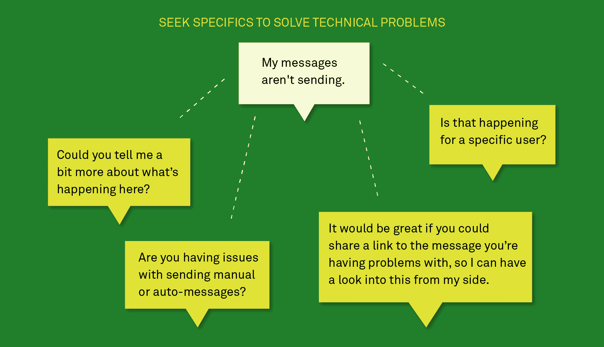

# 响应功能请求的正确方式-内部对讲机

> 原文：<https://blog.intercom.com/the-right-way-to-respond-to-feature-requests/?utm_source=wanqu.co&utm_campaign=Wanqu+Daily&utm_medium=website>

如果你在[客户支持](https://www.intercom.com/blog/defining-customer-support/)工作，你可能会遇到类似的情况:用户会询问你的产品不支持的特性。

即使拥有最热情用户的最好产品也会有这些“[成功差距](http://sixteenventures.com/success-gap)”——你的产品和用户期望的结果之间的差距。

很容易用一个通用的“关注 Twitter 更新”或一个预先录制的“我们会将您的反馈传递给产品团队”消息来回应这些功能请求，但我们发现挖掘这些功能请求以获得更深入的信息是有价值的，这样您就可以完全理解客户想要实现的目标。这样，你就能在让客户满意和收集有价值的信息之间取得平衡，从而提高你的产品的核心价值。

"承认一个给定的特性不被支持是完全没问题的."

这是我们在客户支持中处理功能请求的最佳实践指南。

## 如何管理不同类型的功能请求

首先，值得强调的是，并非所有的特性请求都是相同的。它们可以分为三种不同的类型:

1.  **现有功能的未解决问题**例如，客户遇到了技术问题，不确定如何取得进展。
2.  **功能改进**例如，客户不确定如何用你的产品达到某种效果。
3.  **全新功能请求**例如，客户请求您的产品尚不支持的功能。

让我们更详细地探讨这些。

## 1.现有功能的未解决问题

如果你有一个软件产品或网络应用程序，几乎可以肯定你的产品的某些部分并不总是像它们应该的那样工作。你可能会有客户写信来说，“嘿，我所依赖(并为之付费)的这个功能不起作用了。我需要尽快得到帮助。”当然，你可以在 Github 中记录问题，然后进入下一个对话，但是一个好的支持团队应该能够教育客户如何获得正确的结果，不管技术限制如何。

在这种情况下，把这个要求作为一个起点，就他们到底想达到什么目的展开更深入的对话。询问他们遇到的问题的具体例子和细节，并作为顾问帮助他们在你的产品中实现给定的结果。(我已经在另一篇博文中分享了一些问这些问题的技巧。)

避免承诺解决问题的具体时间和日期。最好是超额完成，而不是承诺一个具体的日期却无法实现。相反，分享任何已知的短期解决问题的方法。通常，客户并不在乎特定的特性或功能是否不起作用，只要他们仍然能够完成工作。[多做一点](https://www.getcloudapp.com/blog/create-better-customer-experience)，让客户达到他们想要的结果，这将真正帮助你建立客户对你公司的信任和忠诚。

## 2.对现有功能的改进

另一个常见的场景是当客户要求在您的服务中添加新的功能时。您的客户支持代表是您的第一线，因此他们可能是第一个听说让客户失望的缺失功能的人。

任何初创企业的资源都是有限的，让你的产品团队去构建每一个功能改进请求是不现实的。相反，你应该后退一步，想一想你是否能在根本不构建任何产品的情况下解决客户的问题。通常情况下，看起来像是功能差距的东西实际上可能是你的产品团队已经解决的，只是方式不同于你的客户想要的。

例如，Intercom 的客户经常要求的一个功能是能够在工作时间之外关闭 Intercom messenger。这不是目前产品路线图上的一项功能，但我们可以通过设置客户的办公时间和预期响应时间来帮助他们设定客户的期望，从而让客户获得相同的结果。

这些答案可能不完全是客户想要听到的，但诚实的解释和解决方法通常足以满足他们最初的要求。在许多情况下，客户只是没有意识到一个现有的特性可以同样成功地用在你的产品中。

## 3.全新功能请求

最棘手的对话是当你的产品不支持某些东西的时候。在你回应之前，问问你自己:这个要求符合你的路线图和你想如何开发你的产品的策略吗？

与其对永远不会出现在生活中的事情做出承诺，不如诚实地对它说不(只要你提出可行的解决方法)。

对你的客户诚实总是很重要的，只要你分享这个决定的背景。

如果客户要求一些不在您的路线图上的非常具体的东西，请尝试推荐适合该用例的第三方解决方案或集成。例如，如果客户希望管理他们的日历，YouCanBookMe 已经有了一个解决方案，而 Zapier 允许您与许多其他类型的软件集成。不要在与你的路线图不一致的事情上做出空洞的承诺，而要考虑你自己产品之外的可能的解决方案。

如何谈论软件中的差距也很重要。不要试图寻找借口或歪曲事实，而是与你的用户分享一些背景。承认给定的功能尚未得到支持(同时解释您的工程团队目前正在构建的很酷的功能)是完全可以的，但您目前正在寻找围绕客户的具体痛点改善体验的方法。

分享你如何做出这些艰难决定的细节，并解释你正在处理有限的工程资源，这将展示你人性化的一面，并帮助客户了解你的观点。毕竟，永远没有足够的时间来处理你想要的所有想法，同时又要掌握错误和问题，并确保你与公司的使命和长期战略保持一致。

## 如何确定功能请求的优先级

一旦您从客户那里收集了特性请求数据，以及它们的相对重要性，您需要找到一种方法来对建议进行优先级排序。

您希望包括的潜在因素有:

1.  **客户生命周期**。你可能想回复那些在注册后的第一天联系你的客户，因为他们面临的风险最高。
2.  **高价值用户**。因为他们是给你付最多钱的客户，所以你要特别注意他们的反馈。尤其是如果这个群体在你的长期成长中起着至关重要的作用。
3.  **实施改进建议的难度**。一些功能改进可能相对容易实现，并为客户提供 10 倍的价值。另一方面，一些改进看起来很简单，但需要数月的复杂工程。
4.  **反馈量**。记录每个个体[产品改进](https://www.intercom.com/blog/ways-to-improve-a-product/)被建议的次数可以帮助你向产品团队提出特定的功能请求。

## 结束循环

一旦你从你的客户那里收集了这些反馈，并对其进行了优先排序，你就应该想办法把这些反馈给你的产品团队。毕竟，如果每周有 50 个用户找不到给定的按钮，这肯定是界面中需要修复的信号。

我们内部管理的方式是[标记我们收到的每一个问题](https://docs.intercom.com/responding-to-users-and-visitors/work-as-a-team/keep-track-of-support-requests-and-bugs)(当然是在对讲机中)。这确实需要一些努力，但是一旦你将它嵌入到你的团队的工作流程中，你将会得到关于你的团队正在进行的对话类型的大量数据。除此之外，我们的研究团队每月都会创建客户意见报告，展示客户提出的主要难题。这将与相关产品经理共享，以便他们可以优先考虑特定功能，并决定哪些功能应该纳入我们的路线图。如果你想有一些更强大的方法来组织这种反馈，你可以看看第三方集成，如 [Productboard](https://www.productboard.com/intercom/) 、 [NomNom](https://getenjoyhq.com/integrations/intercom/) 或 [Trello PowerUp](https://docs.intercom.com/integrations/trello-integration) 。

但是不管你使用什么工具，最重要的事情不仅仅是收集特性请求，而且还要对它们采取行动。无论是礼貌的个人回应，还是传递给产品或工程部门的可行想法，当客户努力提出功能要求或建议时，我们都应该确保以建立长期客户成功的方式做出回应。

[T2】](https://www.intercom.com/books/b2b-sales?utm_medium=internal&utm_source=ii-blog&utm_campaign=201908_wc_intercom_on_sales_book&utm_content=horizontal-ad)