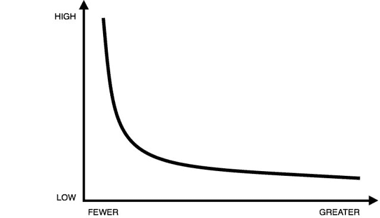

# 对于风险投资家来说，“什么会好”比“什么会坏”更重要

> 原文：<https://hunterwalk.com/2017/11/29/for-vcs-what-could-go-right-is-more-important-than-what-could-go-wrong/?utm_source=wanqu.co&utm_campaign=Wanqu+Daily&utm_medium=website>

你有没有注意到当有人开始说，“现在，我不是想过度概括，但是……”他们几乎总是过度概括？现在，我不想过度概括，但我想告诉你一些记者和专家在评估一个失败的创业公司的风险价值时经常犯的错误。他们关注的是“这里所有可能出错的地方是什么”与“如果事情进展顺利，这家公司会有多大价值？”这一问题的答案

风投的业务是支持那些很有可能失败的公司，你越早投资，就越有可能看到你的资本零回报。抵消这一点的是，成功往往是超大的，回报 20 倍，50 倍，甚至 100 倍以上。极少数初创公司创造了巨大的价值，而这些企业背后的金融家指望这些公司来弥补所有的不良投资，这种观念被称为[幂律分布](https://en.wikipedia.org/wiki/Power_law)。见鬼，萨提亚和我可以在种子阶段说服对方放弃任何投资——一个机会总是有“错误”的地方——但我们的工作是投资，而不是不投资。

<noscript>T3】</noscript>

这意味着，当风险投资家评估一个创业机会时，他们当然会试图理解这个脆弱的小公司可能失败的所有原因，但他们实际上更关心的是“如果一切顺利，这个机会会有多大？”或者“团队的目标是什么——他们如何定义成功？”有很多非常好、非常有价值的企业仍然没有达到风险投资的规模。这很好——这篇文章不是关于风险投资是否因为依赖过大的结果或创始人在决定走风险投资道路时做出的权衡而失败。不，我想说的是，当一家风投支持的公司失败时，很可能不是他们的投资者没有意识到前期的风险，而是他们感兴趣的是好的方面，而不是坏的方面。

相应地，权威人士只说“天哪，我真不敢相信这项业务得到了资助，而名义上还有这么多其他想法”或“咄，风投们不知道这里有 XYZ 风险吗？”有点平淡无奇。更丰富的解释将围绕牛市案例是否真的保证了资本——这是一个合理的风险，而不是有没有风险。

当然，发挥到极致，这将表明任何投资者的决定都是无可指责的，因为有了足够模糊的数学和令人兴奋的假设，你总是可以让数字在纸上工作。这也将是一个愚蠢的立场，如果我们诅咒记者分析我们的失败，我们作为一个行业将失去自我反思和记录的机会。但我会列出一个框架来理解投资中的风险/回报分析，并相信如果包括这些因素，报告将会有所改善:

对于一个失败的创业…

1.  导致失败的原因是可预测的还是新颖的——即风险是一个理性的人可以事先正确评估的，还是来自技术、市场、监管等方面的变化。
2.  “风险规模结果”取决于哪些假设或情景，以及在给定执行难度的情况下，其可信度/可实现性如何。
3.  投资的公司——他们是否通常投资于具有类似风险特征的企业，他们是否取得了显著的成功，或者该公司是否延伸到一个新的领域和/或尚未证明是风险/回报的精明评估者。

当然，对于记者来说，这是很难收集和评估的信息，尤其是在一个“必须现在发表”的文化中。所以我要提出一个可能有点非典型的建议:如果一个值得信赖的记者做了好的、公正的分析，投资者应该愿意谈论他们决策的背景。永远不要背叛创始人的信心——我们谈论的是事后反思，而不是运转中的公司——也不是具体地将执行责任归咎于任何人，而是“这是我们当时的想法，这是对的或不对的。”我敢肯定，许多公司在内部都做了类似的工作，对比交易的投资备忘录，更新他们的垂直框架。

现在，我不想过度概括，但我认为这可能对创始人、对社区、对媒体与投资者进行这种程度的对话有好处。

### 像这样:

像 装...