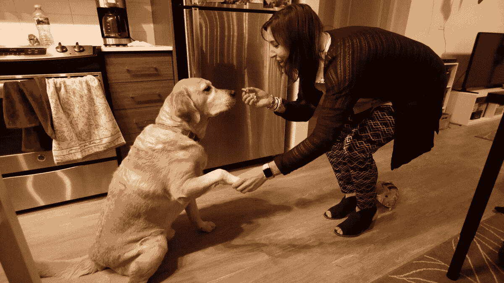

# 专栏:他们正离开加利福尼亚前往拉斯维加斯，寻找与他们无缘的中产阶级生活——洛杉矶时报

> 原文：<http://www.latimes.com/local/california/la-me-lopez-vegas-transplants-20171203-story.html?utm_source=wanqu.co&utm_campaign=Wanqu+Daily&utm_medium=website>

Reporting from LAS VEGAS — 

房租偷走了你大部分的薪水，你可能不得不搬回去和你的父母一起住，而你的半辈子都在盯着你前面的汽车的尾部。

你愿意认为情况会好转，但什么时候会好转呢？在你周围，年轻人和老年人都在向加利福尼亚告别。

“这是我能做的最好的事情，”退休人员迈克尔·j·范·埃森(Michael J. Van Essen)说，直到一年半前，他还在银湖(Silver Lake)花 1160 美元买了一套一居室公寓。然后，他在爱荷华州梅森市花 165，000 美元买了一栋后面有一条小溪的房子，现在他每月支付的抵押贷款比他在洛杉矶支付的租金少 500 美元。

10 月份，当我联系那些厌倦了加州高昂生活成本的人时，范·埃森是众多回复我的读者之一。我从爱达荷州和其他搬到亚利桑那州和内华达州的人那里听说。

很难获得可靠的近期数据，但 2016 年的人口普查数据显示，逃离洛杉矶和奥兰治县前往成本较低的加州地区的人数有所上升，或者他们完全离开了该州。

“如果住房成本继续上涨，我们应该会看到更多的人离开高成本地区，”加州大学伯克利分校特尔纳住房创新中心的经济学家杰德·科尔科说。

对于离开加州的人来说，拉斯维加斯是最受欢迎的地方之一。它很近，是一个就业中心，生活成本要便宜得多，许多全新的房子售价在 20 万美元至 30 万美元之间。

所以我去了罪恶之城，想看看当你把所有的优点和缺点加在一起的时候，加利福尼亚之后还有生活吗。

在丰塔纳长大的 30 岁南加州大学毕业生辛迪·埃尔南德斯说，答案是肯定的。

“在这里生活更容易，生活方式也更舒适，”内华达 NARAL Pro-Choice 的社区组织者埃尔南德斯说。

在丰塔纳长大的 30 岁南加州大学毕业生辛迪·埃尔南德斯(Cyndy Hernandez)搬到了拉斯维加斯，因为那里的住房成本更低。

我拜访了埃尔南德斯，住在她和一个室友合住的两居室山景“公寓-住宅”里。每个人每月支付 650 美元，在一个封闭的开发项目中，有免费 Wi-Fi、游泳池和小屋遮阳甲板、健身中心、媒体室和免费饮料。就像住在度假村一样。

和我在内华达州采访的其他移民一样，Herndandez 不想离开加州。是家。这是她上学的地方，她的父母仍然住在她长大的房子里。但是，除非你选择一份能给你带来一笔小钱的职业，来管理因新住房严重短缺而推高的成本，否则加州不是梦，而是海市蜃楼。

为了得到一份更好的工作或者在职场中往上爬并不是什么新鲜事。但这里的情况似乎有所不同——人们离开并不是为了更好的工作或更高的薪水，而是因为其他地方的住房便宜得多，他们可以过上加州没有的中产阶级生活。

大学毕业后，埃尔南德斯在华盛顿特区担任国会工作人员，然后去了芝加哥几年。但是西方把她拉了回来。不是加州，而是内华达州，她在拉斯维加斯为希拉里·克林顿的总统竞选工作，然后加入了该州首府的一名州议员的工作人员。

赫尔南德斯说:“我开始着眼于卡森市的大局，在那里，我有能力支付租金，有一辆车和舒适的生活，并向 401(k)计划投入一些钱。”“我能在加州做到吗？大概不会。”

她在 6 月份搬到了拉斯维加斯，喜欢探索拉斯维加斯大道以外的城市，结交了新朋友，她的财务压力在沙漠的阳光下消失了。现在她正在攒钱买房子，她认为在加利福尼亚她永远也不可能买得起房子。

埃尔南德斯给我介绍了 23 岁的阿琳·安古洛，她在河滨长大，在迪士尼乐园工作，热爱洛杉矶文化，并在加州大学河滨分校获得了教师资格。她在两个教学工作中选了一个——一个在洛杉矶地区，一个在拉斯维加斯。

“洛杉矶是我的第一选择，我不想离开加州，”安古洛说，他是一名英语教师，懂基本数学。她知道，以一名教师的薪水，“我无法继续呆在那里。”

在拉斯维加斯的郊区萨姆林，安古洛和一个室友每人花 600 美元买了一套大的三居室公寓。安古洛白天在内华达大学拉斯维加斯分校的研究生院教书，她说她打算开始攒钱在这个地区买栋房子。

乔纳斯·彼得森和他的妻子、一名护士以及他们的两个年幼的孩子住在瓦伦西亚时，喜欢加利福尼亚的生活方式和海滩之旅。但在 2013 年，他响应号召，成为拉斯维加斯全球经济联盟(Las Vegas Global Economic Alliance)的负责人，全家搬到了内华达州的亨德森。

<picture><source type="image/webp" srcset="https://ca-times.brightspotcdn.com/dims4/default/87a3b2e/2147483647/strip/true/crop/1999x1124+0+0/resize/320x180!/format/webp/quality/80/?url=https%3A%2F%2Fcalifornia-times-brightspot.s3.amazonaws.com%2F9d%2F07%2F863eca064c99dca27fe094194183%2Fla-1512253597-frww5h37fw-snap-image 320w,https://ca-times.brightspotcdn.com/dims4/default/a46b827/2147483647/strip/true/crop/1999x1124+0+0/resize/568x320!/format/webp/quality/80/?url=https%3A%2F%2Fcalifornia-times-brightspot.s3.amazonaws.com%2F9d%2F07%2F863eca064c99dca27fe094194183%2Fla-1512253597-frww5h37fw-snap-image 568w,https://ca-times.brightspotcdn.com/dims4/default/1bfab15/2147483647/strip/true/crop/1999x1124+0+0/resize/768x432!/format/webp/quality/80/?url=https%3A%2F%2Fcalifornia-times-brightspot.s3.amazonaws.com%2F9d%2F07%2F863eca064c99dca27fe094194183%2Fla-1512253597-frww5h37fw-snap-image 768w,https://ca-times.brightspotcdn.com/dims4/default/6143913/2147483647/strip/true/crop/1999x1124+0+0/resize/1024x576!/format/webp/quality/80/?url=https%3A%2F%2Fcalifornia-times-brightspot.s3.amazonaws.com%2F9d%2F07%2F863eca064c99dca27fe094194183%2Fla-1512253597-frww5h37fw-snap-image 1024w,https://ca-times.brightspotcdn.com/dims4/default/32bc13a/2147483647/strip/true/crop/1999x1124+0+0/resize/1200x675!/format/webp/quality/80/?url=https%3A%2F%2Fcalifornia-times-brightspot.s3.amazonaws.com%2F9d%2F07%2F863eca064c99dca27fe094194183%2Fla-1512253597-frww5h37fw-snap-image 1200w" sizes="100vw"> </picture> 

乔纳斯·彼得森站在宣传拉斯维加斯的广告牌前，和家人从巴伦西亚搬到了内华达州的亨德森。

(吉纳罗·莫利纳/洛杉矶时报)

“我们把房子的面积扩大了一倍，并降低了我们的抵押贷款支付额，”彼得森说，他的妻子现在专注于孩子，而不是她的事业。

彼得森的部分工作是将公司吸引到内华达州，这个州靠的是博彩收入而不是税收。

“没有公司所得税，也没有个人所得税...而且监管环境也更容易配合，”彼得森说。

一些公司已经从加利福尼亚搬到了这里，还有一些公司已经在内华达州建立了卫星。加州，一个世界经济强国，将从袭击中幸存下来，它将继续吸引来自其他州和世界各地的人们。它的资产包括尖端科技和娱乐产业、主要港口、宜人的气候和数十所一流大学。

但是，这个黄金之州被一场看不到尽头的危机玷污了，而且越来越分裂，今年为劳动人民创造更多住房的立法努力缺乏紧迫性和规模。慢慢地，稳步地，又有些淡然地，我们正在负担，打破，甚至输出我们的中产阶级。

26 岁的 Breanna Rawding 感受到了压力。她在西米谷(Simi Valley)长大，直到最近还在阿纳海姆(Anaheim)担任营销协调员，但她住在伯班克，因为家人的朋友让她住在后院的小别墅里，每月租金仅为 400 美元。

<picture><source type="image/webp" srcset="https://ca-times.brightspotcdn.com/dims4/default/121fd24/2147483647/strip/true/crop/1999x1124+0+0/resize/320x180!/format/webp/quality/80/?url=https%3A%2F%2Fcalifornia-times-brightspot.s3.amazonaws.com%2F1c%2F7e%2Fb9f463c93ea9503323ad461e6cf6%2Fla-1512253779-je4rdccebr-snap-image 320w,https://ca-times.brightspotcdn.com/dims4/default/6173158/2147483647/strip/true/crop/1999x1124+0+0/resize/568x320!/format/webp/quality/80/?url=https%3A%2F%2Fcalifornia-times-brightspot.s3.amazonaws.com%2F1c%2F7e%2Fb9f463c93ea9503323ad461e6cf6%2Fla-1512253779-je4rdccebr-snap-image 568w,https://ca-times.brightspotcdn.com/dims4/default/cc0523e/2147483647/strip/true/crop/1999x1124+0+0/resize/768x432!/format/webp/quality/80/?url=https%3A%2F%2Fcalifornia-times-brightspot.s3.amazonaws.com%2F1c%2F7e%2Fb9f463c93ea9503323ad461e6cf6%2Fla-1512253779-je4rdccebr-snap-image 768w,https://ca-times.brightspotcdn.com/dims4/default/64a7cd8/2147483647/strip/true/crop/1999x1124+0+0/resize/1024x576!/format/webp/quality/80/?url=https%3A%2F%2Fcalifornia-times-brightspot.s3.amazonaws.com%2F1c%2F7e%2Fb9f463c93ea9503323ad461e6cf6%2Fla-1512253779-je4rdccebr-snap-image 1024w,https://ca-times.brightspotcdn.com/dims4/default/e31df57/2147483647/strip/true/crop/1999x1124+0+0/resize/1200x675!/format/webp/quality/80/?url=https%3A%2F%2Fcalifornia-times-brightspot.s3.amazonaws.com%2F1c%2F7e%2Fb9f463c93ea9503323ad461e6cf6%2Fla-1512253779-je4rdccebr-snap-image 1200w" sizes="100vw"> </picture> 

26 岁的 Breanna Rawding 是拉斯维加斯全球经济联盟的营销传播经理，她在拉斯维加斯的公寓里和她的狗 Bodie 呆在一起。她从伯班克搬了出来，以逃避长途通勤。

(吉纳罗·莫利纳/洛杉矶时报)

她乘汽车和火车上下班，单程需要 90 分钟到两个小时。她想搬到工作附近的白金三角区，但当她看到一室公寓的价格高达 1700 美元时，就打消了这个念头。

Rawding 忍受了通勤，以及与一个在托兰斯长大的男朋友的异地恋，他去了加州大学洛杉矶分校，但住在拉斯维加斯。在那里，他可以用教师的工资买一套不错的公寓，最近他签署了在一个新开发项目中买房子的文件。

“我不想离开加利福尼亚。查普曼大学毕业生罗丁说:“我喜欢这里的天气，我喜欢户外活动，我爱我的家人和朋友。

但在加州，她看到了自己将被无限期地困在高房租、荒谬的通勤或者两者兼而有之的未来。

“我看到一些关于千禧一代离开加州的文章，因为他们永远也买不起房子，”她说。

六月，一切都改变了。

她在拉斯维加斯的全球经济联盟(Global Economic Alliance)找到了一份营销沟通的工作，并以每月 900 美元的价格租了一套可爱的公寓，离工作单位很近，她午饭时回家让她的狗博迪(Bodie)出去。而且是在她男朋友家附近。

内华达的收获，我们的损失。

加利福尼亚，这个一切皆有可能的地方，已经变成了一个什么都买不起的地方。

**了解更多[史蒂夫·洛佩兹](https://www.latimes.com/local/lanews-steve-lopez-20130507-staff.html)的作品，并在 Twitter 上关注他 [@LATstevelopez](https://twitter.com/intent/user?screen_name=@latstevelopez)**

****亦作****

**[新加州房主的淘金热，租房者的济贫院](https://www.latimes.com/local/california/la-me-lopez-equity-wealth-20171126-story.html)T3】**

**[高出要价近 80 万美元的房子说明了加州](https://www.latimes.com/local/california/la-me-lopez-silicon-equity-20171118-story.html)** 的不公平

**[房产危机可能是好消息，如果你是房东](https://www.latimes.com/local/california/la-me-lopez-landlords-20171115-story.html)**