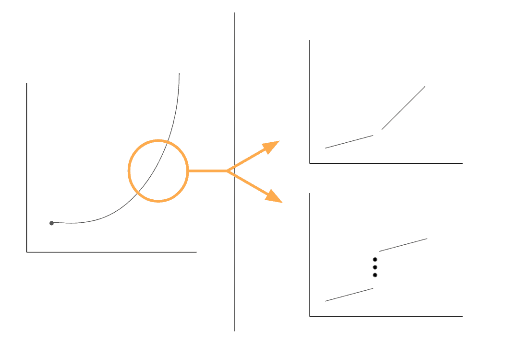

# 创业公司实际上是如何成长的

> 原文：<https://www.sethlevine.com/archives/2017/12/how-startups-actually-grow.html?utm_source=wanqu.co&utm_campaign=Wanqu+Daily&utm_medium=website>

 我们都见过左边的增长曲线——所有成功的创业公司都努力追求一个版本的增长。但事实上，平滑增长曲线的概念实际上掩盖了大多数成功公司的真实增长方式。

我们在 Foundry 的经验表明，如果你放大增长曲线，你会发现公司是线性增长的，而创造对数曲线的是一系列微小的变化，这些变化要么改变增长的斜率(仍然是线性的，但现在增长更快)，要么“跳跃”增长曲线(以相同的速度增长，但现在从一个高基数开始)。属于第一类的例子有销售效率的改变、成功地增加销售组织、建立增加可预测收入的渠道关系等。通常这些都很小，一次只能改变一点点增长的斜率。但随着时间的推移，它们会越积越多。第二类的例子通常是全面提高价格的产品变化或获得一个异常的大客户。这些往往更大、更明显、更不频繁。

多年来，我们发现思考这些类别的增长是有帮助的——经常大声问:“这是改变了我们增长轨迹的斜率还是越线了？”因此，我们在计划的预期效果上是一致的。这也有助于从几年的增长计划中退一步，真正考虑改变直线斜率的杠杆。毫无疑问，发展一家初创公司是一项艰苦的工作。有时候，退一步来真正理解小的变化是如何累积成我们都在追逐的神奇增长曲线是有帮助的。