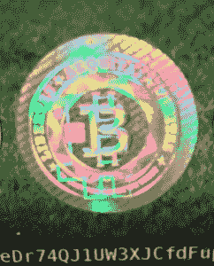

# 比特币|美味的 stacos

> 原文：<https://delicioustacos.com/2017/12/13/the-bitcoin/?utm_source=wanqu.co&utm_campaign=Wanqu+Daily&utm_medium=website>

星期五，他从咖啡店下班很晚。不得不在黑暗中走上艾伯特·金内附近的流浪汉之路，来到他停放他的水星黄玉的住宅区街道。仅供客户使用的工作批次。艰难的一天，但他们都是。歌特收银员格洛丽亚打电话来请病假。他必须掩护。他暗恋她，但她在和一个乐队的人约会。南卡罗来纳州的一名政府工作人员打来电话，威胁要罚款。洗碗工在那里生了几个孩子，他忘了申请工资扣发。在他的手里，在一个干净的加仑冷冻袋里，放着今天的纯素食杏仁粉蓝莓松饼。没有时间做饭，但它的东西。

突然，垃圾堆后面有什么东西动了。他觉得他的手举起来了，虽然他不会拳击。老鼠四散开来，一个可乐瓶子半歪在水泥地上，发出像门环一样的声音。一个奇怪的声音格格作响的垃圾箱。你能帮我吗，它说。

抱歉，伙计。他继续走。

先生，我看你的食物比你需要的多。

是的，我要吃了它。

但是我饿了，先生。今天是圣诞节，先生。

去你妈的，他说。

现在他身后的声音说——如果我给你一些东西作为回报呢？

他转过身去。在一张沾满尿渍的双人床床垫上，一个老人以印度风格坐着，床虱喷在他的头骨和交叉骨下面。他穿着黑破布，黑靴子；白色的头发，棕色的牙齿，手里拿着一根竹竿，竹竿上有一个铜制的蛇头，蛇头的眼睛恶毒地捕捉着月光。他的皮肤像煤矿工人的银版照相术。但他的目光中有一种年轻的东西。

我看你不是一个不讲道理的 T2 年轻人。

你要给我什么，该死的罐头？来，我给你一块松饼。抱歉，我是个混蛋，艰难的一天-

哦，不！我不能接受*施舍*。这有什么荣誉可言？我会用*交易*你。礼物换礼物。你的包，这个。他把手伸进背心口袋，手指长得不可思议，全是乌黑的肌腱，挥着手，好像是一张好市多的卡片。

你偷了别人的信用卡吗？

那人做出受伤的表情。哦不，先生。我不是小偷。这是一份礼物，来自一个有远见的人。现在也许它会是你的。

什么事？

我的孩子，这是一枚比特币。T3】

什么硬币？

一个比特币！这张卡上有一个最不可思议的金融工具的密码，先生——一种加密货币！T3】

值多少钱？

先生，奇迹的价格是多少？这种比特币和其他类似的比特币将彻底改变世界！不再有银行！寺庙里不再有小偷和货币兑换商。这张卡上的奇迹将在任何时间、任何地点实现无缝、私人点对点财政交易，建立在*区块链技术-*T3 之上

好吧，去他妈的，拿去吧。我得走了。

他脱下包，伸出手，抓起卡片。月亮透过烟雾怒目而视，老人满嘴松饼，在越来越远的距离里野蛮地笑着，大步走向黄玉。在家里，他在炉子上放了一口锅做拉面。把卡片扔进了抽屉。

**********

一年过去了。他在机场，从葬礼回来。美国消费者新闻与商业频道的电影在一家爱尔兰酒吧上映。一个脸像提线木偶的秃顶男人兴奋地做着手势。他听不到广播里残疾人乘客请登机的声音，但是 chyron 说:

*比特币 1000 美元:危险的泡沫？*T3】

哦，该死，他想。那东西值一千美元吗？

他从不扔掉任何东西。在抽屉里翻找着，地毯上现在覆盖着旧的保险账单，早已去世的人寄来的圣诞卡，一些律师事务所的来信告诉他，他参与了针对一家安全气囊公司的集体诉讼。几个黄玉司机的脸被弹片蒸发了。他的猫的旧照片，几乎让他哭了。就在那里。比特币。

卡片是深绿色到黑色的，奇怪的数字和符号现在已经磨掉一半了。正面是一张全息图和一个网址。下面是一长串字母和数字。他输入了网址。该网站要求提供代码。他输入:

*1 F9 gj 6 qurkbzyp 8 nazk 8 cqgqxumtywdjcs*T3】

弹出了新的一页。*你的投资组合*，上面说: *1 比特币*。

上面是一张价格图，比特币对美元。暖橙色。它实时移动。起伏不定，像火焰一样闪烁。他的比特币确实是 1000 美元。实际上是 1007 美元。现在 1009.23 美元！谢谢老大爷！然后它摇摇晃晃地掉了下来，他的心怦怦直跳——998.64 美元。不要！卖！等等——999.17 美元，1001.26 美元——这才是我的女孩。$1017!

火焰升起，温暖的橙色灯光在白色屏幕上放大，舞动起来。更高，永远更高。他可以发誓火在他脸上感到温暖。他靠得更近了。这是真的-热！还有灯光，暖色，海面上的夕阳，海鸥的叫声。他赤脚下温暖柔软的沙子，海浪爬上来时，海水泡沫亲吻着他的脚趾……像子宫一样温暖。某个海滩，也许是东南亚。他转过身，一个穿着白色纱笼的金色女孩在远处的雾中向他走来。煤黑色的头发在海风中鞭打，因为他几乎可以，几乎看到她的脸在微笑，火焰跳下来，白色的眩光伤害了他的眼睛，他回到了自己的房间。$980.75.上帝啊，他想——我最好去睡觉了。

**********

他拿着他的硬币。六个月没找。直到有一天他想起了海滩。那个女孩。

现在是 3286 美元。他想，下一笔一定是五千英镑。他眯着眼睛看价格图表上的火焰形状。温暖的橙子蘸了蘸，然后掺了进去。他等待着。$3272.$3276.什么都没发生。他一定很累了

等等。

$3296。$3304.3308 美元，上升，上升，火焰在跳舞。那种感觉又来了，就像冬天过后春天的阳光照在他的脸上。他靠得更近了。让颜色充满他的眼睛。一秒钟都没有。

然后就有了。地中海的夕阳透过宽大的挡风玻璃，绿色的山丘在四周掠过。黄线不可能像曳光弹一样划过。像公牛吼叫的声音，像上帝的割草机。方向盘在他手里。他几乎看不到引擎盖，但它是红色的——是一辆兰博基尼。就像他小时候画在海报上的 Countache，歪歪斜斜地停在米兰某处的鹅卵石小巷里。安装在灰骷髅城堡上方。速度让他的手出汗，但方向盘被柔软的小牛皮包裹着，他的手腕像他们熟悉的舞蹈一样转动着。时速两百英里。他的右边传来一声尖叫。他看了看，她就在那里。那个女孩。她的脸就像中国的护手霜广告。尖叫着抓住门把手，眼睛睁得大大的，但面带微笑。我的天啊，我的天啊，她说。这太疯狂了。别停下来。

我告诉过你你会喜欢的。

我不相信你！啊啊！！！！！

珍妮认为这辆车不实用。它和一栋房子一样贵。但是她现在没有问题了。

想试一试吗？

我告诉过你我不会开手动档的车！

我来教你，这里——

他放慢速度，把车停在路边。感觉到刹车失灵，听到路边的砾石撞击底盘的声音。就连那声音，也像交响乐一样。

如果我打破了呢？

我们会再买一个。

你不会生我的气吧？

宝贝，我永远不会生你的气，他说。

她斜靠在装有骆驼色工具的中控台上亲吻他，当白云靠近时，头发挠着他的锁骨，一阵嘶嘶声把他吵醒了。$2998.

**********

当他数着要关上的抽屉时，哥特女孩格洛丽亚走进了后面的办公室。嘿，我能问你一件事吗，她说。

快到发薪日了。他现在把钱都投进了比特币。它越长越大。在 5000 美元，火焰显示他的豪宅。随着火焰的舞动，新的房间从虚空中折叠出来。车道上的红色蓝宝。女孩们来了又走。像他这样精明的金融奇才很少缺少伙伴。但是他总是想着珍妮。

当然，他说。

你知道我和詹姆斯分手了。

他抬起头。她穿着一条百褶裙，下面有一个纹身。可能是撒旦。两年来他一直在研究她的大腿，但没有注意到这一点。在播放美国消费者新闻与商业频道的办公室电视蓝光下，它看起来很恐怖。她现在喜欢上他了。他看得出来。街上的女孩回头看着他，自*起。*自*她*。

对不起，他说。

不，这很好。不管怎样，听着——我们一群人这个周末要去卡特琳娜岛露营。你想一起来吗？

我没有帐篷。

我们可以一起分享。

他再次看着她。贵吗？

是吗——不，这条船要 100 美元。

我不能，他说。我需要存钱。为了我的*投资。*T3】

什么？

这可能会影响一万、十万、一百万个杰夫。没有限制——古怪的百万富翁约翰·迈克菲突然从美国消费者新闻与商业频道发出低沉的声音。他的皮肤像 120 岁的负鼠，但在他的目光年轻的东西。

*比特币泡沫？加密货币可破解 1 万美元*T3】

我得走了，他说。

**********

在他登录之前，他系好长袍，倒上香槟。瞥一眼 4chan/biz。低声向财神祈祷。按回车键。

11121 美元。$12,364.火焰充满了屏幕，感觉就像是一双手把他拉了进来。现在他要回家了。珍妮听到石阶上有他的便鞋声，就推开了大双扇门。在她的 MC 埃舍尔楼梯的上面和后面，扭曲成天花板，上面有米开朗基罗的天使，有他的脸。你去哪儿了，她说。我想你了。

我必须工作，宝贝。我出来晚了。这个女孩说，想让我去露营。

什么女孩？

下班。

*谁？*T3】

没有人。别担心。

她比我漂亮吗？

他看着她。她快要哭了。像小农牧神一样的眼睛。当然不是，他说。

你答应了？

没有女孩比你更漂亮。

好的。

他说:我有事要问你。开始往口袋里摸。

我的天啊—

宝贝，你愿意嫁给我吗，他说。

她说是的，哦是的。抱着他。答应我，你永远不会离开我，她说。

我保证，他说。我保证。我爱你。她吻了他。火颤抖时，他背上的手指发烫。圣诞节那天，他们发现了一具尸体，弓着身子坐在桌子旁，手里拿着鸡巴。

### 像这样:

像 装...

### *相关*

标签:[比特币](https://delicioustacos.com/tag/bitcoin/)