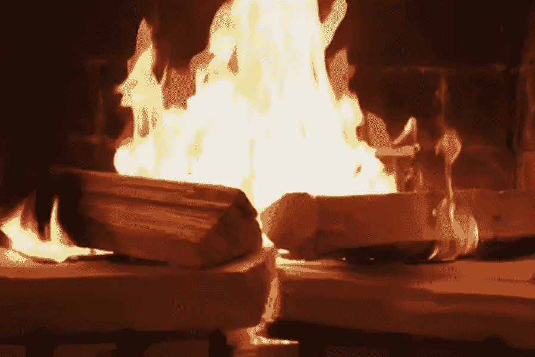
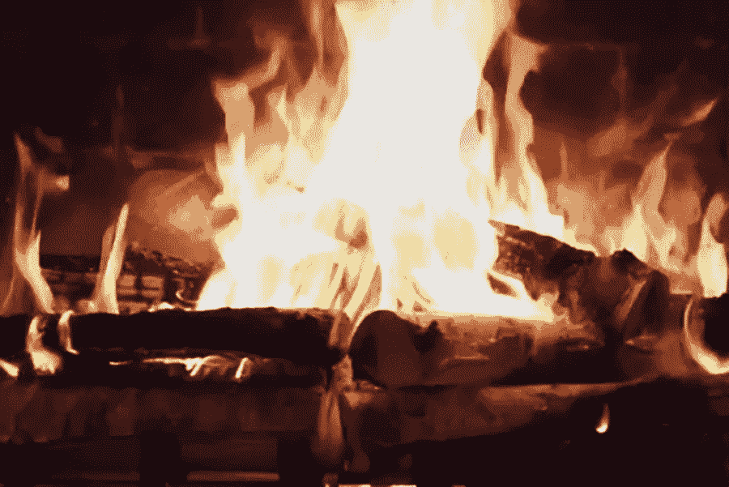
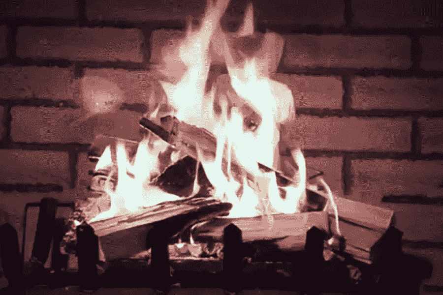
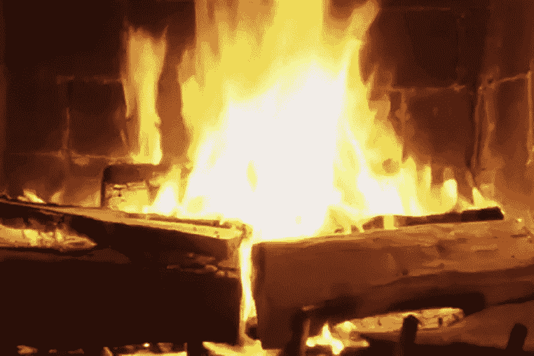

# 哪个网飞壁炉视频适合你？

> 原文：<https://melmagazine.com/which-netflix-fireplace-video-is-right-for-you-26a60a94787e?utm_source=wanqu.co&utm_campaign=Wanqu+Daily&utm_medium=website>

这是假日季节的标志性图像之一:舒适的壁炉中燃烧着噼啪作响的火焰。人们在圣诞歌曲中歌唱它，但是根据美国人口普查局发布的 2011 年房屋简介，只有大约 46%的“业主自用住房单元”有可用的壁炉。那么，我们其他人如何享受圣诞快乐，看着随机的原木被明亮的火焰吞噬呢？

有线电视提供商长期以来一直提供点播频道，消费者可以选择他们自己的虚拟壁炉——基本上，这是一个提供火的近距离图像的程序，可以将你的电视变成壁炉。(甚至格里·克鲁斯和老辣妹也加入了进来，[在 YouTube 上提供了一段视频，视频中船员的头在一个爆炸的壁炉里](https://twitter.com/terrycrews/status/932654602641588224)。)但现在，网飞已经开始提供一些流媒体选择。哪个适合你？

我们决定做一些数据处理，分解每个视频的核心数据。但是我们也需要一个专业人士来提供他们的专业知识。所以我们打电话给查德·威曼，他在加州维克托维尔 312 消防站的圣贝纳迪诺县消防局工作。“这比我想象的要难，因为我以前从未描述过火灾，”威曼告诉我们。"我通常只是把湿的东西放在红色的东西上."

### **“壁炉 4K:你家壁炉的经典爆裂声壁炉”**

网飞描述:“除了噼啪作响的炉火的声音和样子，什么也没有。所有的美丽，没有灰烬。”

多长时间？ 60 分钟

有圣诞音乐吗？没有。这是壁炉视频的 *cinéma vérité* ，只是让观众挖掘一堆周围的噼啪声，并在一个连续不断的镜头上弹出。

**叙事弧线是什么？**创作者乔治·福特，你家系列的整个 [*壁炉背后的人，淡入一堆原木，一个小火已经开始。很快，火焰变得越来越强大，砰，很快我们就得到了一个撕裂咆哮的火。在一个小时的大部分时间里，这个吸管只是保持平稳燃烧，随着时间的推移，木头慢慢分解。*](https://www.fireplaceforyourhome.com/)

**视频如何结束？**当壁炉还在工作时，我们就淡出了。

我们的专家怎么看？“这团火是有生命的，会呼吸的东西，”威曼说，“试图发展到它的全部潜力。它知道自己还有增长的空间，而且会一直增长下去，直到耗尽所有的燃料。”

### **“壁炉 4K:你家壁炉里劈啪作响的桦木”**

**网飞描述:**“从火柴到灰烬，这是最完美的节日款待。非常适合聚会、在家度过浪漫之夜或家庭聚会。”

多长时间？ 60 分钟

有圣诞音乐吗？和*经典的爆裂声壁炉*一样，这个壁炉视频没有时间放音乐。闭上嘴享受爆裂声吧，孩子们。

**叙事弧线是什么？**福特更新了他的经典视频，这次他用桦木生火。除此之外，两者没有太大区别。我们不得不说，虽然，我们更喜欢桦木的外观，而不是他在早期的视频中使用的木材。

**视频如何结束？**我们淡出，壁炉仍在做它的事。(福特知道不要乱用好配方。)

我们的专家怎么看？“这场大火似乎处于完全发展或‘完全卷入’阶段，”威曼告诉我们。“我的意思是，大火正在燃烧所有可用的燃料，正处于高峰期，并将继续这样燃烧一段时间。”

### **“节日的壁炉和旋律”**

**网飞描述:**“无论外面天气如何，享受一个欢快的虚拟火伴随着最喜欢的节日音乐，如‘装饰大厅’和‘平安夜’"

多长时间？ 120 分钟

有圣诞音乐吗？你不仅可以看到《装饰大厅》和《平安夜》，还可以看到《铃儿响叮当》、《哦，圣诞树》、《哦，伯利恒小镇》等等。它们都是在钢琴上演奏的，带有你可能从 hold 音乐中期待的那种明亮、普通的光泽。这持续了两个小时。

**叙事弧线是什么？导演迈克尔·j·西尔弗从已经噼啪作响的壁炉开始。随着不同的歌曲在配乐上播放，我们有时会在最终淡入主镜头之前淡入原木中的特写镜头。*壁炉和旋律*真的想让你明白，每根木头都是它自己的一块木头，慢慢地为了你的利益而死去。这个壁炉视频无疑是所有壁炉视频中最有结构性和艺术性的。西尔弗似乎认为，人们实际上是在关注屏幕上发生的事情，而不仅仅是在客人在房间里转来转去的时候把它放在背景中。**

**视频如何结束？**我们以一首《欢乐世界》作为结束，这首圣诞歌曲通常是你的压轴歌曲。

我们的专家怎么看？“看着这团火让人放松，因为它有一种平静的风度，”Wiemann 说。"它邀请你出去逛逛，喝杯热棕榈酒，给它讲些故事."

### ***【你家的壁炉】*(三部曲系列)**

**网飞描述:**“这个版本包括噼噼啪啪的圣诞日志，设定为节日最爱，如‘世界快乐’和‘我们祝你圣诞快乐’”(第一集)“这一期包括一个老式燃木壁炉。享受明亮欢快的火焰和真正的火焰的噼啪声！”(第 2 集)“这个节目提供了一个愉快的，噼啪作响的火，增强了有品味的音乐伴奏，以设置正确的氛围。”(第三集)

多长时间？每集 60 分钟

有圣诞音乐吗？在第一集中，福特(是的，同一家)提供了你所有圣诞最爱的合成器版本。感觉就像你在一个新时代的教堂里，或者被困在有史以来最怪异的科幻版本的圣诞节里。第二集恢复了他的无音乐套路，但第三集却充满了音乐，用各种乐器轰炸观众，从爵士乐到易于聆听的原声吉他，再到催人泪下的钢琴和小提琴安排。

**叙事弧线是什么？**你知道该怎么做:壁炉做着自己的事情，但伴随着节日的曲调和令人心烦意乱的爆裂声，彼此进行着意想不到的二重奏。

**视频如何结束？**我们意识到我们已经花了一整天看壁炉视频，现在我们想做除此之外的任何事情。换句话说，我们不知道。

我们的专家怎么看？威曼真的很喜欢第一集。“现在我们做饭了！这团火正试图跳出壁炉，向你扑来。”但他总是用消防员的那一面思考。“最好清理一下烟囱，”他警告说。"否则，你手上可能会有一个工作结构着火."

* * *

蒂姆·格里尔森是梅尔杂志的特约编辑。他为 Screen International、Rolling Stone 和 Vulture 撰写关于电影和流行文化的文章。