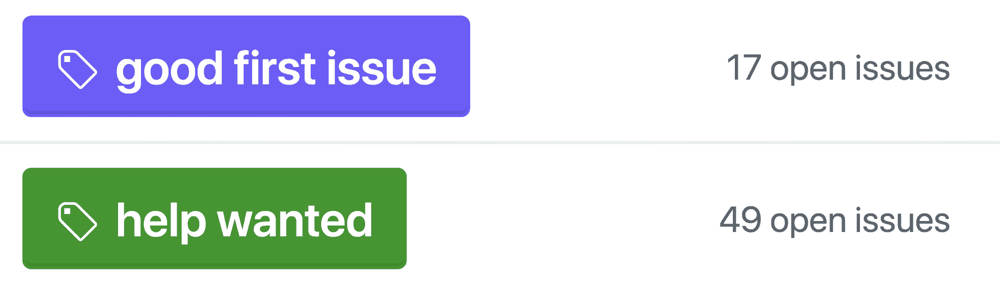
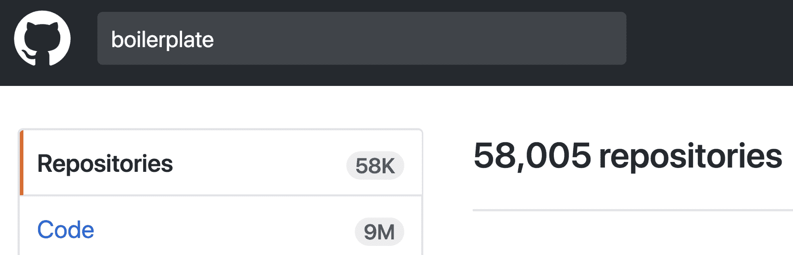
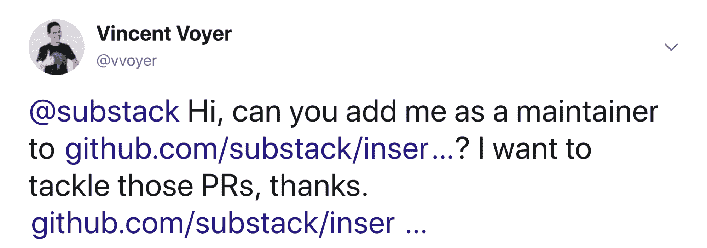
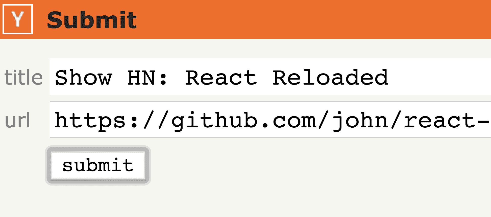
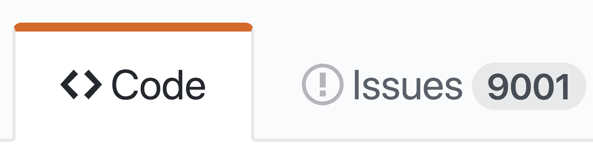

# 开始你的开源事业- Algolia 博客| Algolia 博客

> 原文：<https://blog.algolia.com/start-your-open-source-career/?utm_source=wanqu.co&utm_campaign=Wanqu+Daily&utm_medium=website>

今年，我做了一个关于如何通过确保一切就绪以吸引各种贡献来使开源项目成功的演讲:问题、文档或代码更新。演讲结束后，我得到的反馈是“很好，你展示了如何使项目成功，但是**我如何开始** **做开源呢？**”。这篇博文是对这个问题的回答；它解释了如何以及从哪里开始为项目做贡献，以及如何创建自己的项目。

这里分享的知识是基于我们的经验:在 Algolia，[我们发布了](https://github.com/algolia)并维护了多个开源项目，随着时间的推移，这些项目被证明是成功的，我也花了大量的时间练习和创建[开源项目](https://github.com/vvo)。

# 把脚弄湿

我职业生涯的一个关键时刻是六年前在 [Fasterize](https://www.fasterize.com/en/) (一个网站性能加速器)。我们在我们的 [Node.js](https://nodejs.org/en/) 工人上面临一个重要的[内存泄漏](https://en.wikipedia.org/wiki/Memory_leak)。在搜索了除实际 Node.js 代码库之外的所有地方之后，我们没有发现任何可能导致它的原因。我们的解决方法是每天重新启动工作线程(这将内存使用重置为零)并忍受它，但我们知道这不是一个非常优雅的解决方案，所以**我想从整体上理解问题****。**

 **当我的联合创始人 Stéphane 建议我看看 Node.js 代码库时，我差点笑了。我心想:“如果有 bug，那很可能是我们的代码，而不是创建了革命性服务器端框架的开发人员的代码。不过，好吧，我看看”。两天后[我对 Node.js 的 http 层的两个字符修复](https://github.com/nodejs/node-v0.x-archive/pull/3181#issue-4313777)被合并，解决了我们自己的内存泄漏问题。

这样做极大地增强了我的信心。在为 http.js 文件做出贡献的其他 30 个人中，有一些我很钦佩的人，比如 [isaacs](https://github.com/isaacs/) (npm 创建者)——让我意识到代码就是代码，不管是谁写的。

你在开源项目中遇到过 bug 吗？深入研究，不要停留在您当地的解决方案上。您的解决方案可以让其他人受益，并引导您做出更多开源贡献。**看别人的代码**。你可能不会马上解决你的问题，理解代码库可能需要一些时间，但是你会学到新的模块，新的语法和不同的编码方式，这将使你成长为一名开发人员。

## 投机取巧

 *首先在 [Node.js 知识库上标注](https://github.com/nodejs/node/labels/good%20first%20issue)*

“我没有想法”是那些想为开源做出贡献，但又认为自己没有任何好想法或好项目可以分享的开发人员的常见抱怨。嗯，对此我说:没关系。有**种机会主义的方式为开源做出贡献**。许多项目已经开始通过标签或标记为首次参与的人列出好的贡献。

你可以通过这些网站找到投稿思路:[开源星期五](https://opensourcefriday.com/)、[仅限首次](https://www.firsttimersonly.com/)、[你的首次 PR](https://yourfirstpr.github.io/) 、 [CodeTriage](https://www.codetriage.com/) 、 [24 拉请求](https://24pullrequests.com/)、[待价而沽](https://up-for-grabs.net/)、[投稿人-忍者](https://contributor.ninja/)和[首次投稿](https://github.com/Roshanjossey/first-contributions/)。

## 打造一些明面上的东西

工具是发布对他人有用的东西的好方法，而不必考虑太多复杂的问题或 API 设计。您可以为您最喜欢的框架或平台发布一个样板文件，将许多博客文章和工具的知识收集到一个解释清楚的项目中，并准备好实时重新加载和发布功能。create-react-app 就是这种工具的一个很好的例子。

*GitHub 上有 [58K 样板文件](https://github.com/search?utf8=%E2%9C%93&q=boilerplate&type=)库，发布一个*很容易，也很有收获

今天，你也可以为 [Atom](https://github.com/blog/2231-building-your-first-atom-plugin) 和 [Visual Studio 代码](https://code.visualstudio.com/docs/extensions/overview)构建纯 JavaScript 插件，就像我们对[Atom 自动完成模块导入插件](https://www.algolia.com/blog/atom-plugin-install-npm-module/)所做的那样。有没有一个非常好的 Atom 或 Sublime Text 插件在你最喜欢的编辑器中还不存在？去建造它吧。

最后，你也可以为 [webpack](https://webpack.js.org/contribute/writing-a-plugin/) 或 [babel](https://github.com/thejameskyle/babel-handbook) 创建插件，解决你的 JavaScript 栈的一个特定用例。

好的一面是，大多数平台会解释**如何创建和发布插件**，这样你就不用考虑太多如何做了。

## 成为新维护者

当浏览 GitHub 上的项目时，您有时可能会找到并使用被其创建者放弃的**项目。它们仍然是有价值的，但是许多问题和拉请求都在存储库中，没有来自维护者的任何回答。**你有什么选择？****

*   以新名称发布分叉
*   成为新的维护者

我建议你两者同时进行。前者将帮助你推进你的项目，而后者将使你和社区受益。

你会问，如何成为新的维护者？给维护者发一封邮件或一条推文，说“嘿，我想维护这个项目，你觉得怎么样？”.这通常很有效，并且是从一个已经为人所知并且对他人有用的项目开始您的开源事业的好方法。

[T2】](https://blog-api.algolia.com/wp-content/uploads/2017/12/image2-2.png)

*[例子推文](https://twitter.com/vvoyer/status/744986995630424064)被派去复兴一个被放弃的项目*

# 创建自己的项目

找到你自己的项目的最好方法是**看看今天没有好的解决方案的问题**。如果你在网上浏览某个特定的库来解决你的某个问题，却没有找到，那么这就是创建开源库的好时机。

这是我职业生涯的又一个关键时刻。在 Fasterize，我们需要一个快速、轻量级的图像惰性加载器用于我们的网站性能加速器——不是一个 jQuery 插件，而是一个独立的项目，可以被注入，并且必须在任何网站、任何浏览器上工作。我花了几个小时在整个网络上寻找完美的现有图书馆，但我失败了。所以我说:“我们完了。我找不到好的项目，我们无法创业”。

对此，斯特凡回答说:“好吧，就创造吧”。嗯（表示踌躇等）..那好吧！我开始在一个 JavaScript 文件中复制粘贴 [StackOverflow 答案](https://stackoverflow.com/questions/3228521/stand-alone-lazy-loading-images-no-framework-based)，最终[构建了一个图像惰性加载器](https://github.com/vvo/lazyload)，最终被用于像【Flipkart.com】T4 这样的网站(每月约 2 亿次访问，在印度排名第九)。这次成功之后，我的心灵被连接到了开源上。我突然明白，开源可能只是我开发生涯的另一部分，而不是一个只有传奇人物和神话般的 10x 程序员才适合的领域。

[T2】](https://blog-api.algolia.com/wp-content/uploads/2017/12/image1-3.png)

没有任何好的解决方案的问题:用可重用的方式解决它！

**时机很重要**。如果您决定不构建一个可重用的库，而是在您自己的应用程序中嵌入一些变通代码，那么这就错过了一个机会。在某些时候，有人会创建您可能已经创建的项目。相反，应该尽快从应用程序中提取并发布可重用模块。

## 发布它，营销它，分享它

为了确保任何愿意找到您的模块的人都能找到它，您必须:

*   用[徽章](https://shields.io/)和虚荣指标创建一个好的[自述](https://opensource.guide/starting-a-project/#writing-a-readme)
*   创建一个具有漂亮的设计和在线游乐场的专用网站。想要点灵感吗？看看[更漂亮的](https://github.com/prettier/prettier)。
*   发布您的项目，作为与您正在解决的问题相关的 StackOverflow 和 GitHub 问题的答案
*   将你的项目发布在 [HackerNews](https://news.ycombinator.com/submit) 、 [reddit](https://www.reddit.com/r/programming/) 、 [ProductHunt](https://www.producthunt.com/posts/new) 、 [Hashnode](https://hashnode.com/) 以及任何其他特定于社区的聚合网站上
*   向关于你的平台的时事通讯提出你的新项目
*   参加聚会，或者就你的项目发表演讲

[T2】](https://blog-api.algolia.com/wp-content/uploads/2017/12/image4-2.png)

*向世界展示你的新项目*

**不要害怕发帖到很多网站**；只要你真的相信你做的东西会有价值，就没有太多的信息。总的来说，社区真的很乐意分享一些东西！

## 耐心迭代

根据“虚荣指标”(星级或下载数量)，一些项目会在第一天暴涨，但随后很早就停止了增长。其他人要等一年才能准备好使用 HN 的 frontpage。相信你的项目会在某个时候被其他用户注意到，如果从来没有，那么你已经学到了一些东西:它可能对任何人都没有用，除了你自己——这是你下一个项目的又一个学习。

我有很多 0 星的项目(像[摩卡-浏览](https://github.com/vvo/mocha-browse))，但我从不失望，因为我没有很高的期望。这就是我在项目开始时的想法:我发现了一个好问题，我尽我所能解决了它，也许有人会用，也许不会。没什么大不了的。

## 两个项目为单一方案

这是我做开源最喜欢的部分。在 2015 年的 Algolia，我们正在寻找单元测试的解决方案，并冻结我们的 React UI 库 [InstantSearch.js](https://community.algolia.com/instantsearch.js/) 的 [JSX](https://reactjs.org/docs/jsx-in-depth.html) 编写的 React 组件的 html 输出。

由于 JSX 翻译成函数调用，我们当时的解决方案是写 expect( <component>)。toDeepEqual(</component>

为了解决这个问题，我们创建了 [algolia/expect-jsx](https://github.com/algolia/expect-jsx) ，允许我们在单元测试输出中使用 jsx 字符串差异，而不是不可读的对象树。测试的输入和输出将使用相同的语义。我们没有就此止步。我们没有发布一个库，而是从中提取了另一个库，并发布了两个库:

通过发布两个共同解决一个问题的模块，您可以让社区从您的底层解决方案中受益，这些解决方案可以在许多不同的项目中重用，甚至以您从未想过的方式使用您的模块。

例如，react-element-to-jsx-string 被用在许多其他的[测试期望框架](https://www.npmjs.com/browse/depended/react-element-to-jsx-string)中，同时也被用在像 [storybooks/addon-jsx](https://github.com/storybooks/addon-jsx) 这样的文档插件上。今天，为了测试 React 组件的输出，使用 [Jest 和快照测试](https://facebook.github.io/jest/docs/en/snapshot-testing.html#snapshot-testing-with-jest)，在那些情况下不再需要 expect-jsx。

## 反馈和投稿

[T2】](https://blog-api.algolia.com/wp-content/uploads/2017/12/image3-2.png)

这是一大堆问题。还有，就是为了有好看的照片才造假的🙂

一旦你开始得到反馈和贡献，就要做好思想开放和乐观的准备。你会得到热情的反馈，但也有负面的评论。请记住，任何与用户的互动都是一种贡献，即使看起来只是抱怨。

首先，在书面对话中传达意图/语气从来都不容易。你可以把“这很奇怪……”解释为:太棒了/真的很糟糕/我不明白/我很高兴/我很难过。询问更多细节，尝试重新表述问题，以便更好地理解问题的来源。

避免真正抱怨的一些建议:

*   为了更好地指导用户提供反馈，为他们提供一个 [ISSUE_TEMPLATE](https://github.com/blog/2111-issue-and-pull-request-templates) ，当他们创建新问题时会显示该模板。
*   尽量把新贡献者的摩擦降到最低。请记住，他们可能还没有进入测试，并乐意向你学习。不要因为缺少分号而保留对新贡献者的拉请求；，帮助他们感到安全。您可以温和地要求他们添加它们，如果这不起作用，您也可以按原样合并，然后自己编写测试和文档。
*   在自动化测试、[林挺](https://stackoverflow.com/questions/8503559/what-is-linting)和格式化代码或 livereload 示例方面，提供一个良好的开发者体验环境。

## 就是这样

感谢您的阅读，我希望您喜欢这篇文章到了想要帮助或构建项目的程度。为开源做贡献是扩展你技能的一个很好的方式，这不是每个开发人员都必须经历的，而是一个走出舒适区的好机会。

我现在很期待你的第一个或下一个开源项目，发推特给我 [@vvoyer](https://twitter.com/vvoyer) ，我很乐意给你建议。

如果你热爱开源，并且想在公司实践它，而不是在你的空闲时间，Algolia 为开源 JavaScript 开发者提供了空缺职位。

您可能喜欢的其他资源:

*   [opensource.guide](https://opensource.guide/) ，学习如何启动和发展你的项目。
*   [Octobox](https://octobox.io/) ，你的 GitHub 通知邮件。专注于重要的事情，这是避免“太多问题”影响的好方法
*   GitHub 应用程序自动化并改善您的工作流程，就像解决非常老的问题一样
*   改进的 GitHub 在许多层面上为 GitHub UI 提供了令人敬畏的维护体验
*   [OctoLinker](https://octolinker.github.io/) 让在 GitHub 上浏览别人的代码成为一种很棒的体验

感谢[伊万娜](https://twitter.com/voiceofivana)、[蒂普海恩](https://www.linkedin.com/in/tiphaine-gillet-01a3735b/)、[阿德里安](https://twitter.com/adrienjoly)、[乔希](https://twitter.com/dzello)、[彼得](https://twitter.com/codeharmonics)和[雷蒙德](https://twitter.com/rayrutjes)对这篇博文的帮助、评论和贡献。

【2018 年 1 月更新:

查看[黑客新闻](https://news.ycombinator.com/item?id=15980239)和 [Reddit 上关于这篇文章的讨论。](https://www.reddit.com/r/programming/comments/7lfwhl/starting_your_open_source_career/)**