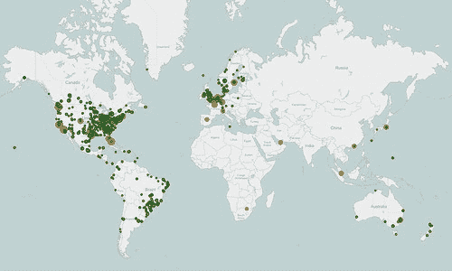
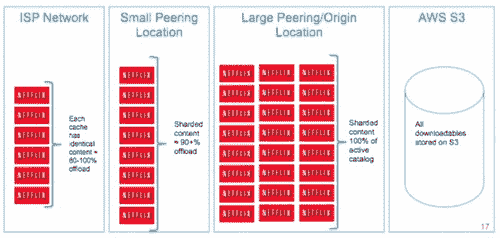
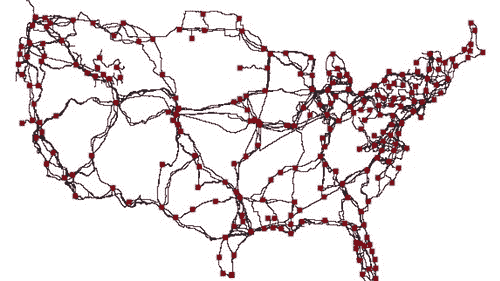
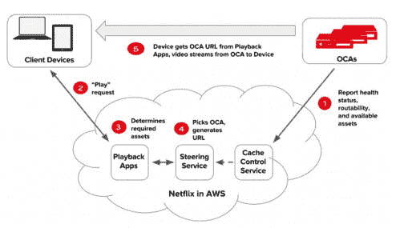

# 网飞:当你按播放键时会发生什么？-高可扩展性-

> 原文：<http://highscalability.com/blog/2017/12/11/netflix-what-happens-when-you-press-play.html?utm_source=wanqu.co&utm_campaign=Wanqu+Daily&utm_medium=website>

这篇文章是我的新书[中的一章，像我 10](https://smile.amazon.com/Explain-Cloud-Like-Im-10-ebook/dp/B0765C4SNR) 一样解释云。第一个版本是专门为云新手编写的。我做了一些更新，增加了几章— *网飞:当你按下播放键时会发生什么？*和*什么是云计算？—* 这使它比初学者高了几个百分点。我认为即使是相当有经验的人也可能从中有所收获。

我还在独立的 Kindle 电子书中创建了这篇文章的扩展版。你可以在[网飞:当你按下播放键时会发生什么？](https://www.amazon.com/Netflix-What-Happens-When-Press-ebook/dp/B079ZKT9G8/)

因此，如果你正在寻找一个关于云的好的介绍，或者知道谁是，请看看。我想你会喜欢的。我对结果很自豪。

我从几十个有时有些矛盾的来源中收集了这一章。事实会随着时间的推移而改变，这取决于谁在讲述这个故事，以及他们面对的是什么样的受众。我试图尽可能地创造一个连贯的叙述。如果有任何错误，我很乐意修复它们。请记住，这篇文章不是一个技术的深入探讨。是大图类型的文章。比如我一次都没提*微服务*这个词:-)

网飞看起来很简单。按播放，视频神奇地出现了。很简单，对吧？没有那么多。

根据我们在*中的讨论，什么是云计算？第一章，你可能希望网飞使用自动气象站提供视频服务。在网飞应用程序中按 play，存储在 S3 的视频就会从 S3 通过互联网直接传输到你的设备上。*

一个完全明智的方法…对于一个小得多的服务。

但这根本不是网飞的工作方式。它比你想象的要复杂和有趣得多。

要了解原因，让我们看看 2017 年一些令人印象深刻的网飞统计数据。

*   网飞有超过 1.1 亿用户。
*   网飞在 200 多个国家开展业务。
*   网飞每个季度有近 30 亿美元的收入。
*   网飞每季度新增用户超过 500 万。
*   网飞每周播放超过 10 亿小时的视频。相比之下，YouTube 每天播放 10 亿小时的视频，而脸书每天播放 1.1 亿小时的视频。
*   2017 年，网飞单日播放了 2.5 亿小时的视频。
*   网飞占美国互联网流量峰值的 37%以上。
*   网飞计划在 2018 年花费 70 亿美元在新内容上。

我们学到了什么？

网飞很大。他们是全球性的，他们有很多成员，他们播放很多视频，他们有很多钱。

另一个相关的事实是网飞是基于订阅的。会员按月向网飞付费，可以随时取消。当你按下播放键来打击网飞时，它最好能起作用。不开心的会员退订。

**我们正在深入**

网飞是我们讨论过的所有想法的一个极好的例子，这就是为什么本章比我们讨论过的其他云服务更详细。

深入网飞的一个重要原因是他们比其他公司提供更多的信息。

网飞把*交流*作为一种中心[文化价值](https://www.slideshare.net/BarbaraGill3/netflix-culture-deck)。网飞远远没有辜负它的标准。

事实上，我要感谢网飞对他们的建筑如此开放。这些年来，网飞已经就他们如何运作的内部运作进行了数百次演讲，写了数百篇文章。整个行业都因此变得更好。

深入研究网飞的另一个原因是网飞实在太迷人了。我们大多数人都曾用过网飞。谁不喜欢躲在窗帘后面看看是什么让网飞成功了呢？

网飞在两种云中运行:AWS 和 Open Connect。

网飞是如何让他们的成员开心的？当然是用云。实际上，网飞使用了两种不同的云:AWS 和 Open Connect。

两种云必须无缝协作，才能提供长时间让客户满意的视频。

**网飞的三个部分:客户端、后端、内容交付网络(CDN)。**

你可以把网飞分成三个部分:客户端、后端和内容交付网络(CDN)。

*客户端*是用于浏览和播放网飞视频的任何设备上的用户界面。它可能是你 iPhone 上的一个应用程序，你桌面电脑上的一个网站，甚至是你智能电视上的一个应用程序。网飞控制着每一台设备的每一个客户端。

在你点击 *play* 之前发生的一切都发生在运行在 AWS 中的*后端*中。这包括准备所有新的视频和处理来自所有应用程序、网站、电视和其他设备的请求。

在你点击 *play* 之后发生的一切都由 Open Connect 处理。Open Connect 是网飞定制的全球内容交付网络(CDN)。Open Connect 在全球不同地点存储网飞视频。当您按 play 时，视频流从 Open Connect 进入您的设备，并由客户端显示。不用担心；稍后我们会详细讨论什么是 CDN。

有趣的是，在网飞，他们实际上不会说*点击视频*，他们会说*点击标题*开始。每个行业都有自己的行话。

通过控制所有三个领域——客户端、后端、CDN——网飞实现了完全的垂直整合。

网飞从头到尾控制着你的视频观看体验。这就是为什么在世界任何地方点击“播放”都能正常工作的原因。当你想看的时候，你能可靠地得到你想看的内容。

让我们看看网飞是如何做到这一点的。

## **2008 年，网飞开始转向 AWS**

网飞于 1998 年启动。起初，他们通过美国邮政服务租用 DVD。但是网飞看到了点播流媒体视频的未来。

2007 年，网飞推出了他们的流媒体视频点播服务，允许用户通过个人电脑上的网飞网站或各种支持平台上的网飞软件(包括智能手机和平板电脑、数字媒体播放器、视频游戏机和智能电视)观看电视连续剧和电影。

就个人而言，流媒体点播是未来的趋势似乎是显而易见的。的确如此。我曾在几家尝试制作视频点播产品的初创公司工作过。他们失败了。

网飞成功了。网飞当然执行得很好，但他们在比赛中迟到了，这帮助了他们。到 2007 年，互联网足够快，足够便宜，可以支持流媒体视频服务。以前从未有过这种情况。快速、低成本移动带宽的增加以及智能手机和平板电脑等功能强大的移动设备的引入，使得任何人在任何时间、任何地点播放视频都变得更加容易和便宜。时机就是一切。

## **网飞开始运营他们自己的数据中心**

EC2 在 2007 年刚刚起步，大约与网飞的流媒体服务同时开始。网飞不可能用 EC2 发射。

网飞建造了两个相邻的数据中心。他们经历了我们在前面章节中谈到的所有问题。

构建数据中心是一项繁重的工作。订购设备需要很长时间。安装所有设备并使其工作需要很长时间。一旦一切正常，他们的能力就会耗尽，整个过程不得不重新开始。

漫长的设备交付周期迫使网飞采取了所谓的*垂直扩展*策略。网飞制作了在大型计算机上运行的大型程序。这种方法被称为建造一块*巨石*。一个程序做了所有的事情。

问题是当你像网飞一样快速发展的时候；很难让一块巨石变得可靠。但事实并非如此。

## **服务中断导致网飞转向 AWS**

2008 年 8 月，由于数据库损坏，网飞有三天无法运送 DVD。这是不可接受的。网飞必须做点什么。

建设数据中心的经历给网飞上了重要的一课——他们不擅长建设数据中心。

网飞擅长的是给他们的成员传送视频。网飞宁愿专注于更好地提供视频，而不是更好地建设数据中心。建设数据中心不是网飞的竞争优势，提供视频才是。

当时，网飞决定转向 AWS。AWS 刚刚成立，所以选择 AWS 是一个大胆的举动。

网飞转向 AWS 是因为它想要一个更可靠的基础设施。网飞希望消除系统中的任何单点故障。AWS 提供高度可靠的数据库、存储和冗余数据中心。网飞想要云计算，这样它就不用再建造不可靠的巨型独石了。网飞希望成为一家全球性服务公司，而不需要建立自己的数据中心。这些功能在旧数据中心都不可用，将来也不会。

网飞给出的选择 AWS 的原因是它不想做任何无差别的繁重工作。无差别的繁重工作是那些必须要做的事情，但不会给提供优质视频观看体验的核心业务带来任何优势。AWS 为网飞做了所有无差别的重活。这让 Netflixians 专注于提供商业价值。

网飞用了八年多的时间完成了从他们自己的数据中心到 AWS 的迁移过程。在此期间，网飞的流媒体用户数量增长了 8 倍。网飞现在运行在几十万个 EC2 实例上。

## **网飞在 AWS 更靠谱**

网飞并不是没有经历过 AWS 的宕机，但总的来说，它的服务比以前可靠得多。

你再也不会经常看到这样的抱怨了:

T4】

或者这个:

T4】

网飞现在如此可靠，是因为他们采取了非常措施来提高服务的可靠性。

网飞在三个 AWS 区域运营:一个在北弗吉尼亚州，一个在俄勒冈州波特兰市，一个在爱尔兰都柏林。在每个区域内，网飞在三个不同的可用性区域中运行。

网飞表示，没有在更多地区开展业务的计划。增加新的区域是非常昂贵和复杂的。大多数公司只在一个地区运营，更不用说两三个地区了。

拥有三个区域的好处是，任何一个区域都可能失败，其他区域将介入处理失败区域中的所有成员。当一个地区失败时，网飞称这个*疏散*为一个地区。

我们来举个例子。假设你正在英国伦敦观看一部新的《纸牌屋》剧集。因为它离伦敦最近，所以你的网飞设备有可能连接到都柏林地区。

如果整个都柏林地区都失败了，会发生什么？这是否意味着网飞应该停止为你工作？当然不是！

网飞检测到故障后，将您重定向到弗吉尼亚州。您的设备现在可以与弗吉尼亚地区通话，而不是都柏林。你可能甚至没有注意到有一个失败。

AWS 区域出现故障的频率是多少？每月一次。好吧，一个地区实际上不会每个月都失败。网飞每月进行测试。每个月，网飞都会故意让一个地区出现故障，以确保其系统能够处理地区级故障。一个地区可以在六分钟内被疏散。

网飞称之为他们的全球服务模式。任何地区的任何顾客都可以得到服务。这太神奇了。它不会自动发生。AWS 没有处理区域故障或为多个区域的客户提供服务的灵丹妙药。网飞独立完成了所有这些工作。网飞是解决如何利用多个地区创建可靠系统的先驱。我不知道还有哪家公司竭尽全力让他们的服务如此可靠。

在这三个地区的另一个优势是，它使网飞覆盖全球。网飞进行了一些测试，发现如果你在世界任何地方使用网飞的应用程序，你将从这三个地区之一获得快速服务。

## **网飞在 AWS 省钱**

这可能会让很多人感到惊讶，但 AWS 对网飞来说更便宜。每个流视图的云成本最终只是其旧数据中心成本的一小部分。

为什么？云的弹性。

网飞可以在需要的时候增加服务器，不需要的时候退回去。网飞只需在需要的时候为需要的东西付费，而不是让大量额外的计算机无所事事地处理高峰负载。

我们在*中谈到的所有东西什么是云计算*？章。

## **在你按下播放键之前，AWS 中会发生什么？**

任何不涉及提供视频的事情都在 AWS 中处理。

这包括可扩展计算、可扩展存储、业务逻辑、可扩展分布式数据库、大数据处理和分析、推荐、代码转换以及数百种其他功能。

别担心，你不需要了解所有那些东西是什么，但是既然你可能会觉得有趣，我就简单解释一下。

**可扩展计算和可扩展存储。**

*可扩展计算*是 EC2，*可扩展存储*是 S3。对我们来说没什么新鲜的。

您的网飞设备——iPhone、电视、Xbox、Android 手机、平板电脑等。—与运行在 EC2 中的网飞服务对话。

查看可能要观看的视频列表？这是您的网飞设备联系 EC2 中的计算机来获取列表。

询问关于视频的更多细节？这是您的网飞设备联系 EC2 中的计算机以获取详细信息。

这就像我们在书中谈到的所有其他云服务一样。

**可扩展的分布式数据库。**

网飞使用 DynamoDB 和 Cassandra 作为他们的分布式数据库。并不是说这些名字对你有什么意义，它们只是高质量的数据库产品。

*数据库*。数据库存储数据。你的个人资料信息，你的账单信息，你看过的所有电影，所有这些信息都存储在一个数据库里。

*分布式。*分布式是指数据库不是在一台大型计算机上运行，而是在多台计算机上运行。您的数据被复制到多台计算机，因此，如果一台甚至两台保存数据的计算机出现故障，您的数据将是安全的。事实上，您的数据被复制到所有三个区域。这样，如果一个区域出现故障，当新区域准备好开始使用它时，您的数据将会在那里。

*可扩展*。可伸缩意味着数据库可以处理您想要放入的任意多的数据。这是分布式数据库的一个主要优势。可以根据需要添加更多的计算机来处理更多的数据。

**大数据处理和分析。**

*大数据*简单来说就是有大量的数据。网飞收集了很多信息。网飞知道每个人观看时都在看什么，以及他们观看时在哪里。网飞知道会员看过哪些视频，但决定不看。网飞知道每个视频被观看了多少次……甚至更多。

把所有的数据都放在一个标准的格式里叫做*处理*。

理解所有这些数据被称为*分析*。分析数据以回答特定的问题。

网飞为你量身定制艺术品。

这是一个很好的例子，说明网飞如何利用其数据分析能力诱使你观看更多视频。

当你在网飞网上浏览寻找可看的东西时，你有没有注意到每个视频都有一张图片？这被称为*标题图像*。

标题图像是为了吸引你，吸引你选择一个视频。这个想法是，标题图像越引人注目，你就越有可能观看视频。你看的视频越多，你退订网飞的可能性就越小。

以下是*陌生事物*的不同标题图像示例:

T4】

您可能会惊讶地发现，每个视频中显示的图像都是专门为您选择的。不是每个人看到的图像都一样。

每个人过去都看到相同的标题图像。它是这样工作的。从一组选项中随机向成员展示一张图片，就像上面的*陌生事物*拼贴画中的图片。每次观看视频时，网飞都会进行计数，记录下选择视频时显示的是哪张图片。

对于我们的*陌生事物*的例子，让我们说当显示中间的组图片时，*陌生事物*被观看了 1000 次。对于其他所有的图片，每张图片只看一次。

因为团体照最能让成员们观看，网飞会把它永远作为《陌生事物》的标题图片。

这就叫做被*数据驱动*。众所周知，网飞是一家数据驱动型公司。收集数据—在这种情况下，是与每张图片相关的视图数量—并用于做出可能的最佳决策—在这种情况下，是选择哪个标题图像。

聪明，但是你能想象做得更好吗？是的，通过使用更多的数据。这是未来的主题——通过从数据中学习来解决问题。

你和我可能是非常不同的人。你认为我们的动机是同一种标题图像吗？大概不会。我们有不同的口味。我们有不同的偏好。

网飞也知道这一点。这就是为什么网飞现在个性化他们展示给你的所有图像。网飞试图选择与你最相关的视频作品。他们是怎么做到的？

记住，网飞会记录和统计你在他们网站上做的每一件事。他们知道你最喜欢哪种电影，最喜欢哪些演员等等。

假设你推荐的一部电影是《心灵捕手》。网飞必须选择一个标题图像给你看。目标是展示一个图像，让你了解一部你可能会感兴趣的电影。网飞应该向你展示哪个形象？

如果你喜欢喜剧，网飞会给你看一张罗宾·威廉姆斯的照片。如果你喜欢浪漫的电影，网飞会给你看一张马特·达蒙和明妮·德瑞弗准备接吻的照片。

T4】

通过展示罗宾·威廉姆斯，网飞让你知道电影中可能会有幽默，因为网飞知道你喜欢喜剧，这个视频是一个很好的匹配。

马特·达蒙和明妮·德瑞弗的形象传达了完全不同的信息。如果你是一个喜剧迷，看到这张图片，你可能会跳过。

这就是为什么选择正确的标题图像如此重要。它发出强烈的个性化信号，表明电影是关于什么的。

再举个例子，*低俗小说*。

T4】

如果你看过很多乌玛·瑟曼主演的电影，那么你很可能会看到乌玛的头像。如果你看过很多约翰·特拉沃尔塔主演的电影，那么你很可能会看到约翰的头像。

你能看出选择最好的个性化艺术品是如何让你更有可能观看某个视频的吗？

网飞在选择艺术品时会迎合你的兴趣，但网飞也不想对你撒谎。他们不想仅仅为了让你看一个你可能不喜欢的视频而展示一个 clickbait 图片。这没有什么激励。网飞不按观看的视频付费。网飞试图将遗憾最小化。网飞希望你对观看的视频感到满意，所以他们尽可能为你挑选最好的标题图像。

这只是网飞使用数据分析的一个小例子。网飞在任何地方都使用这种策略。

**建议。**

通常网飞只会给你 40 到 50 个视频选项，然而他们有成千上万的视频可供选择。

网飞如何决定？使用机器学习。

这是我们刚刚谈到的*大数据处理和分析*的一部分。网飞看着它的数据，预测你会喜欢什么。事实上，你在网飞屏幕上看到的一切都是使用机器学习专门为你选择的。

## **从源媒体转码为您观看的内容**

这是我们开始过渡到网飞如何处理视频的地方。

在您选择的最喜爱的设备上观看视频之前，网飞必须将视频转换为最适合您的设备的格式。这个过程叫做*转码*或者*编码*。

转码是将视频文件从一种格式转换为另一种格式的过程，以使视频可以在不同的平台和设备上观看。

网飞同时在多达 30 万个 CPU 上对 AWS 中的所有视频进行编码。这比大多数超级计算机都大！

**源媒体的来源。**

谁给网飞发视频？制片厂和工作室。网飞称这个视频为源媒体。新视频交给*内容运营团队*处理。

该视频采用高清格式，大小为数兆兆字节。一兆字节很大。想象一下 60 叠纸和埃菲尔铁塔一样高。那是一万亿字节。

在观看视频之前，网飞会对其进行严格的多步骤处理。

T4】

**验证视频。**

网飞做的第一件事是花大量时间验证视频。它会查找可能由之前的转码尝试或数据传输问题导致的数码瑕疵、颜色变化或丢失帧。

如果发现任何问题，该视频将被拒绝。

**进入媒体管道。**

视频通过验证后，被送入网飞所说的媒体管道。

一个*管道*就是一系列的步骤，数据通过这些步骤准备投入使用，就像工厂里的装配线一样。70 多种不同的软件参与了每一个视频的制作。

处理单个数 TB 大小的文件是不实际的，所以流水线的第一步是将视频分成许多更小的块。

然后视频块通过管道，这样它们可以被并行编码。并行仅仅意味着块在同一时间被处理。

让我们用一个例子来说明并行。

 

假设你有一百只脏狗需要洗。一个人一个人洗狗，哪个会更快？或者雇 100 个狗清洁工同时给它们洗澡会更快吗？

显然，让一百个洗狗机同时工作会更快。这就是平行。这就是网飞在 EC2 中使用如此多服务器的原因。他们需要大量的服务器来并行处理这些巨大的视频文件。它也能工作。网飞说，一个源媒体文件可以在短短 30 分钟内被编码并推送到他们的 CDN。

一旦块被编码，它们被验证以确保没有新的问题被引入。

然后，这些块被组装回一个文件，并再次进行验证。

**结果是一堆文件。**

编码过程会创建大量文件。为什么？网飞的最终目标是支持每一台联网设备。

网飞从 2007 年开始在微软视窗系统上播放流媒体视频。随着时间的推移，越来越多的设备被添加进来——Roku、LG、三星蓝光、苹果 Mac、Xbox 360、LG DTV、索尼 PS3、任天堂 Wii、苹果 iPad、苹果 iPhone、苹果电视、Android、Kindle Fire 和 Comcast X1。

网飞总共支持 2200 种不同的设备。每个设备都有一种在该设备上看起来最好的视频格式。如果你在 iPhone 上看《网飞》，你会看到一个视频，它会给你带来最好的观看体验。

网飞称一个视频的所有不同格式为其*编码模式*。

网飞还创建针对不同网络速度优化的文件。如果你在高速网络上观看，你会看到比在低速网络上观看更高质量的视频。

还有不同音频格式的文件。音频被编码成不同的质量等级和不同的语言。

还有字幕文件。视频可能有多种不同语言的字幕。

每个视频都有很多不同的观看选项。您看到的内容取决于您的设备、网络质量、网飞计划和语言选择。

我们到底在谈论多少个文件？

为了皇冠，网飞存储了大约 1200 个文件！

*更奇怪的事情*第二季有更多的文件。它是 8K 拍摄的，有九集。源视频文件有很多很多太字节的数据。仅仅一季的编码就花了 19 万个 CPU 小时。

结果呢？9，570 个不同的视频、音频和文本文件！

让我们看看网飞是如何播放这些视频的。

## **流式视频的三种不同策略**

网飞已经尝试了三种不同的视频流策略:自己的小型 CDN 第三方 CDNs 并打开连接。

我们先从定义 CDN 开始。CDN 是一个*内容分发网络*。

*内容*对于网飞来说，当然是我们在上一节中讨论过的视频文件。

*分发*意味着视频文件通过*网络*从一个中心位置复制，并存储在分布在世界各地的计算机上。

对网飞来说，存储视频的中心地点是 S3。

## **为什么要建 CDN？**

CDN 背后的想法很简单:通过将计算机分布在世界各地，让视频尽可能靠近用户。当用户想要观看视频时，找到最近的装有视频的计算机，并从那里传输到设备。

CDN 最大的好处是速度和可靠性。

想象一下，你正在伦敦观看一个视频，而这个视频是从俄勒冈州的波特兰传输过来的。视频流必须通过许多网络，包括海底电缆，因此连接速度慢且不可靠。

通过将视频内容移动到尽可能靠近观看它的人，观看体验将尽可能地快速和可靠。

计算机存储视频内容的每个位置被称为 PoP 或*存在点*。每个 PoP 都是一个提供互联网接入的物理位置。它包含服务器、路由器和其他电信设备。稍后我们将更多地讨论 PoPs。

## **第一个 CDN 太小**

2007 年，当网飞推出其新的流媒体服务时，它在 50 个国家拥有 3600 万会员，每月观看超过 10 亿小时的视频，每秒钟播放数万亿比特的内容。

为了支持流媒体服务，网飞在美国五个不同的地方建立了自己的简单 CDN。

网飞视频目录在当时非常小，每个位置都包含了它的所有内容。

## **第二个 cdn 太大**

2009 年，网飞决定使用第三方 cdn。大约在这个时候，第三方 cdn 的价格开始下降。

使用第三方 cdn 对网飞来说非常有意义。当您可以使用现有的 CDN 服务立即到达全球时，为什么要花费所有的时间和精力来建立自己的 CDN 呢？

网飞与 Akamai、Limelight 和 Level 3 等公司签订了提供 CDN 服务的合同。用第三方 cdn 没有错。事实上，几乎每个公司都这样做。例如，NFL 已经使用 Akamai 来直播足球比赛。

由于没有建设自己的 CDN，网飞有更多的时间来从事其他更高优先级的项目。

网飞投入了大量的时间和精力来开发更聪明的客户。网飞创造了算法来适应不断变化的网络条件。即使面对错误、超负荷的网络和超负荷的服务器，网飞也希望会员们总是能看到尽可能好的画面。网飞开发的一项技术是切换到不同的视频源，比如另一个 CDN 或不同的服务器，以获得更好的效果。

与此同时，网飞也在我们之前谈到的所有 AWS 服务上投入了大量精力。网飞称 AWS 中的服务为其*控制平面*。控制平面是一个电信术语，表示控制其他一切的系统部分。在你的身体里，你的大脑是控制平面；它控制着其他一切。

后来，网飞认为开发自己的 CDN 可以做得更好。

## **开放连接刚刚好**

2011 年，网飞意识到它需要一个专用的 CDN 解决方案来最大限度地提高网络效率。视频分发是网飞的核心竞争力，也可能是巨大的竞争优势。

因此，网飞开始开发自己专门打造的 Open Connect。Open Connect 于 2012 年推出。

开放连接对网飞来说有很多优势:

*   更便宜。第三方 cdn 价格昂贵。自己做这件事会节省很多钱。
*   质量更好。通过控制整个视频路径——转码、CDN、设备上的客户端——网飞认为它可以提供卓越的视频观看体验。
*   更具可扩展性。网飞的目标是向世界各地提供服务。快速支持所有这些人，同时提供优质的视频观看体验需要建立自己的系统。

第三方 cdn 必须支持用户从世界任何地方访问任何类型的内容。网飞的工作简单得多。

网飞很清楚谁是它的用户，因为他们必须订阅网飞。网飞确切地知道它需要提供哪些视频。只要知道它只需要服务大型视频流，网飞就可以做出许多其他 cdn 无法做出的智能优化选择。网飞也很了解它的成员。公司知道他们喜欢看哪些视频，喜欢什么时候看。

凭借这些知识，网飞构建了一个真正高性能的 CDN。让我们更详细地了解一下 Open Connect 是如何工作的。

## **打开连接电器**

还记得我们说过 CDN 的计算机分布在世界各地吗？

网飞开发了自己的视频存储计算机系统。网飞称之为开放连接设备或 OCA。

以下是站点中早期 OCA 安装的样子:

T4】

上图有很多 OCA。OCA 被分组到多个服务器的集群中。

每个 OCA 都是一个快速服务器，为传输大文件进行了高度优化，有很多很多硬盘或闪存驱动器用于存储视频。

这是其中一个 OCA 服务器的样子:

T4】

有几种不同类型的 OCA 用于不同的目的。有大型 OCA 可以存储网飞的全部视频目录。有一些较小的 OCA 只能存储网飞视频目录的一部分。较小的 OCA 每天在非高峰时段都充满视频，使用网飞称之为 *proactive cachin* g 的过程。我们稍后将详细讨论主动缓存的工作原理。

从硬件的角度来看，OCA 没有什么特别的。它们基于商用 PC 组件，由不同的供应商组装在定制的外壳中。如果你想的话，你可以买同样的电脑。

注意到网飞所有的电脑都是红色的吗？网飞让他们的电脑特别制作，以配合他们的标志颜色。

从软件的角度来看，OCA 使用 FreeBSD 操作系统和 NGINX 作为 web 服务器。是的，每个亚奥理事会都有网络服务器。使用 NGINX 的视频流。如果这些名字没有任何意义，不要担心，我只是为了完整起见才包括它们。

一个站点上 OCA 的数量取决于网飞希望该站点有多可靠、从该站点传送的网飞流量(带宽)以及一个站点允许传输的流量百分比。

当您按下 play 时，您正在观看来自特定 OCA 的视频流，如上图所示，就在您附近的位置。

为了获得最佳的视频观看体验，网飞真正想做的是在你的房子里缓存视频。但这还不现实。下一个最好的事情是把一个迷你网飞尽可能靠近你的房子。他们是怎么做到的？

## 网飞把开放连接设备(OCA)放在哪里？

网飞从全球 1000 多个地点的数千台服务器上传输大量视频流量。看看这张视频服务地点地图:

T4】

其他视频服务，如 YouTube 和亚马逊，在他们自己的主干网上提供视频。这些公司实际上建立了自己的全球网络，向用户提供视频。这非常复杂，也非常昂贵。

网飞采取了一种完全不同的方式来构建 CDN。

网飞没有自己的网络；它也不再运营自己的数据中心。相反，互联网服务提供商(ISP)同意将 OCA 放在他们的数据中心。OCA 免费提供给 ISP 嵌入到他们的网络中。网飞还将 OCA 放在互联网交换位置(ixp)内或附近。

使用这种策略，网飞不需要运营自己的数据中心，但它获得了常规数据中心的所有优势——它只是别人的数据中心。天才！

最后两段相当密集，让我们把它分解一下。

**利用 ISP 构建 CDN。**

ISP 是你的互联网提供商。它是你从谁那里获得互联网服务的。它可能是威瑞森，康卡斯特，或数以千计的其他服务。

这里的要点是 ISP 分布在世界各地，它们离客户很近。通过将 OCA 放置在 ISP 数据中心，网飞也遍布世界各地，并接近其客户。

**使用 ixp 构建 CDN。**

互联网交换位置是 ISP 和 cdn 在其网络之间交换互联网流量的数据中心。这就像去一个派对和你的朋友交换圣诞礼物一样。如果每个人都在一个地方，交换礼物会更容易。如果大家都在一个地方，交换网络流量更容易。

ixp 遍布世界各地:

T4】

*TeleGeography 的互联网交换地图*

这是伦敦互联网交易所的样子:

T4】

*伦敦互联网交易所(LINX)*

深入研究这些黄色的光纤电缆，您将看到来自荷兰阿姆斯特丹的 AMS-IX 互联网交换点的类似内容:

T4】

*维基媒体公社*

上图中的每根电线将一个网络连接到另一个网络。这就是不同网络之间交换流量的方式。

IXP 就像一个高速公路立交桥，只是使用电线:

T4】

*维基媒体公社*

对网飞来说，这是又一次胜利。ixp 遍布全球。因此，通过将 OCA 放在 ixp 中，网飞不必运行自己的数据中心。

## **视频每天主动缓存到 OCAs】**

网飞把所有的视频都放在 S3。他们有遍布世界各地的视频服务计算机。只差一样东西:视频！

网飞使用一种称为*主动缓存*的过程来高效地将视频复制到 OCA。

**什么是缓存？**

贮藏处是一个隐藏的地方，尤其是在地下，用来存放弹药、食物和财宝。

你知道松鼠是怎么埋坚果过冬的吗？

T4】

他们埋坚果的每个地方都是一个*贮藏处*。在冬天，任何松鼠都可以找到一个坚果贮藏处大吃一顿。

北极探险者派出小分队在他们前进的路线上储藏食物、燃料和其他补给。跟在后面的更大的队伍会在每个藏匿地点停下来补给。

松鼠和北极探险家都很主动。他们提前做了一些事情，为以后做准备。

每个 OCA 都是你最想看的视频的缓存。

网飞通过预测你想看什么来缓存视频。

在世界各地，网飞非常准确地知道它的成员喜欢看什么以及他们喜欢什么时候看。还记得我们说过网飞是一家数据驱动的公司吗？

网飞利用它的人气数据来预测用户明天在每个地点可能想看的视频。这里，*位置*是指位于 ISP 或 IXP 内的 OCA 集群。

网飞将预测的视频复制到每个位置的一个或多个 OCA。这叫做*前置*。甚至在有人问之前，视频就被放在 OCAs 上了。

这为会员提供了很好的服务。他们想看的视频已经离他们很近，随时可以观看。

网飞运行的是所谓的*分层缓存系统。*

我们前面谈到的较小的 OCA 放在 ISP 和 ixp 中。这些太小了，无法包含整个网飞的视频目录。其他地方有 OCA，包含网飞的大部分视频目录。然而，其他地方有包含整个网飞目录的大 OCA。他们从 S3 获得视频。

每天晚上，每个 OCA 醒来后都会询问 AWS 中的服务它应该有哪些视频。AWS 中的服务发送给 OCA 一个基于我们之前讨论的预测的视频列表。

每个亚奥理事会负责确保它的清单上有所有的视频。如果同一个位置的 OCA 有一个它应该有的视频，那么它将从本地 OCA 复制该视频。否则，附近的一个 OCA 与视频将被发现和复制。

因为网飞预测明天什么会流行，所以在视频被要求上传到亚奥理事会之前，总会有一天的准备时间。这意味着视频可以在安静的非高峰时段复制，大大减少了 ISP 的带宽使用。

在 Open Connect 中从来没有*缓存未命中*。缓存未命中将会向 OCA 请求特定的视频，而 OCA 说它没有该视频。缓存缺失在其他 cdn 上一直都在发生，因为你负担不起到处复制内容。因为网飞知道它必须缓存的所有视频，所以它随时都知道每个视频的确切位置。如果一个较小的 OCA 没有视频，那么一个较大的 OCA 一定会有。

为什么网飞不把他们所有的视频复制到世界上每一个亚奥理事会？它的视频目录太大，无法存储所有位置的所有内容。2013 年，网飞的视频目录超过 3pb；我不知道它今天有多大，但我只能假设它要大得多。

这就是为什么网飞开发了选择在每个 OCA 上存储哪些视频的方法，使用数据来*预测*他们的成员想看什么。

我们举个例子。《纸牌屋》是一部非常受欢迎的电视剧。应该复制到哪个 OCA？可能每个地方都有，因为全世界的会员都想看《纸牌屋》。

如果一个视频没有《纸牌屋》受欢迎怎么办？网飞决定它应该被复制到哪些位置，以便最好地服务于附近的成员请求。

在一个位置，一个流行的视频，如纸牌屋，被复制到许多不同的 OCA。视频越受欢迎，就会有越多的视频被复制到服务器上。为什么？如果一个非常受欢迎的视频只有一份拷贝，那么将视频流式传输给会员会使服务器不堪重负。  俗话说，人多力量大。

当一个视频只被拷贝到一个 OCA 时，它就不被认为是实时的。网飞希望能够在世界各地同时播放相同的内容。只有当有足够数量的 OCA 具有足够的视频副本来适当地提供服务时，该视频才会被认为是实况的并且准备好供成员观看。

例如，2016 年的《超胆侠》第二季是网飞第一次在所有国家的所有设备上同时发布一部剧的所有剧集。

## 托管 OCA:对 ISP 有什么好处？

为什么 ISP 会同意在其网络中部署 OCA 集群？乍一看，这似乎太慷慨了，但你会很高兴地知道这是坚定地植根于自身利益。

为了理解为什么，我们需要谈谈网络是如何工作的。我知道在这本书里，我们说过云服务是通过互联网访问的。网飞就不是这样，至少在看视频的时候是这样。当使用网飞应用程序时，它通过互联网与自动气象站对话。

互联网是网络的互联。您有一个提供互联网服务的 ISP。我从康卡斯特获得互联网服务。这意味着我的房子通过光缆连接到康卡斯特的网络。康卡斯特的网络就是他们的网络；不是互联网，互联网是别的东西。

假设我想进行谷歌搜索，我在浏览器中输入一个查询，然后按回车键。

我对谷歌的请求首先通过康卡斯特的网络。谷歌不在康卡斯特的网络上。在某些时候，我的请求必须转到谷歌的网络。这就是互联网的作用。

互联网将康卡斯特的网络与谷歌的网络连接起来。有一些叫做*的路由协议*就像一个交通警察，指引着网络流量的去向。

当我的谷歌查询被路由到互联网上时，它不再在康卡斯特的网络上，也不在谷歌的网络上。它位于所谓的互联网主干网 T1 上。

互联网是由许多选择相互协作的私有网络编织而成的。我们前面看到的 ixp 是网络相互连接的一种方式。

在美国，这是一张长距离光纤网络的地图:

T4】

美国长距离光纤基础设施研究

网飞在 Open Connect 中所做的是将其 OCA 集群置于 ISPs 网络中。这意味着，如果我观看网飞的视频，我将在康卡斯特的网络中与 OCA 对话。我所有的视频流量都在康卡斯特的网络上；它从不上网。

扩展视频交付的关键是尽可能靠近用户。当你这样做的时候，你没有使用互联网主干网。请求在网络的本地部分得到满足。

为什么这是一件好事？回想一下，我们说过网飞已经消耗了美国超过 37%的互联网流量。如果 ISP 不合作，网飞将会使用更多的互联网。互联网无法处理所有的视频流量。互联网服务提供商将不得不增加更多的网络容量，而且建设成本很高。

目前，多达 100%的网飞内容都是由 ISP 网络提供的。这减轻了互联网服务提供商的网络拥塞，从而降低了成本。与此同时，网飞会员体验高品质的观看体验。每个人的网络性能都会提高。

这是双赢。

## **开放式连接可靠且有弹性**

前面我们讨论了网飞如何通过运行三个不同的 AWS 区域来提高其系统的可靠性。Open Connect 的架构实现了同样的目标。

可能不太明显的是 OCA 是相互独立的。OCA 充当自给自足的视频服务群岛。当其他 OCA 失败时，来自一个 OCA 的成员流不受影响。

当 OCA 出现故障时会发生什么？您正在使用的网飞客户端会立即切换到另一个 OCA 并继续播放。

如果一个地方有太多人使用 OCA 会发生什么？网飞的客户将会找到一个负载更轻的 OCA 来使用。

如果会员用来传输视频的网络过载，会发生什么情况？同样的事情。网飞客户将在性能更好的网络上找到另一个 OCA。

Open Connect 是一个非常可靠和有弹性的系统。

## **网飞控制客户端**

网飞可以优雅地处理故障，因为它控制每台运行网飞的设备上的客户端。

网飞自己开发其 Android 和 iOS 应用程序，所以你可能会期望他们控制这些。但是，即使在智能电视这样的平台上，网飞并不构建客户端，网飞仍然拥有控制权，因为它控制着软件开发工具包。

SDK 是一套允许创建应用程序的软件开发工具。每个网飞应用程序都向 AWS 发出请求，并使用 SDK 播放视频。

通过控制 SDK，网飞可以一致和透明地适应缓慢的网络、失败的 OCA 和任何其他可能出现的问题。

## **最后:当你按下播放键**时会发生什么

来到这里是一条漫长的路。我们学到了很多。以下是我们目前了解到的情况:

*   网飞可以分为三个部分:后端、客户端和 CDN。
*   来自网飞客户端的所有请求都在 AWS 中处理。
*   所有视频都从 Open Connect CDN 中附近的 Open Connect 设备(OCA)流出。
*   网飞在三个 AWS 区域运行，通常可以在任何区域处理故障，而成员甚至不会注意到。
*   网飞将新的视频内容转换成许多不同的格式，因此可以根据设备类型、网络质量、地理位置和会员的订阅计划选择最佳格式进行观看。
*   每天，网飞都会通过 Open Connect 向全世界发布视频，这些视频是基于他们对每个地方的会员想要观看的内容的预测。

以下是网飞描述玩耍过程的图片:

T4】

现在，让我们来完成这幅画:

*   您可以使用运行在某个设备上的客户端来选择要观看的视频。客户端向运行在 AWS 中的网飞*播放应用*服务发送*播放*请求，表明你想播放哪个视频。
*   我们以前没有讨论过这个问题，但是在你点击 play 之后发生的很大一部分事情都与许可有关。不是世界上每个地方都有观看每个视频的许可。网飞必须确定您是否拥有观看特定视频的有效许可证。我们不会谈论这是如何工作的——这真的很无聊——但请记住它总是在发生。网飞开始开发自己的内容的一个原因是为了避免许可问题。网飞想同时向世界上的每个人发布一个节目。创建自己的内容是网飞避免担心许可问题的最简单的方法。
*   考虑到所有相关信息，Playback Apps 服务返回多达十个不同 OCA 服务器的 URL。这些都是你在网络浏览器中一直使用的 URL。网飞使用您的 IP 地址和来自 ISP 的信息来确定哪个 OCA 集群最适合您使用。
*   客户端智能地选择使用哪个 OCA。它通过测试到每个 OCA 的网络连接的质量来做到这一点。它将首先连接到最快、最可靠的 OCA。客户端在整个视频流过程中不断运行这些测试。
*   客户端探查以找出从 OCA 接收内容的最佳方式。
*   客户端连接到 OCA 并开始向您的设备传输视频。
*   您是否注意到在观看视频时，图像质量会有所不同？有时它会看起来像素化，过一会儿图像会恢复到高清质量？这是因为客户端正在适应网络的质量。如果网络质量下降，客户端会降低视频质量以与之匹配。当质量下降太多时，客户将切换到另一个 OCA。

当你在网飞上按下播放键时就会这样。谁会想到看视频这么简单的事情会如此复杂？

## 相关文章