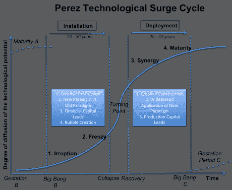
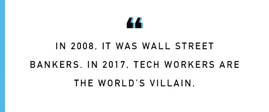

# 2017 年发生了什么- AVC

> 原文：<http://avc.com/2017/12/what-happened-in-2017/?utm_source=wanqu.co&utm_campaign=Wanqu+Daily&utm_medium=website>

这已经成为我的习惯，我在 AVC 这里庆祝一年的结束和新的一年的开始，连续发帖关注发生了什么，然后思考可能会发生什么。

今天，我们聚焦 2017 年发生了什么。

**加密:**

我回头看了看[我对 2017 年](https://avc.com/2017/01/what-is-going-to-happen-in-2017/)的预测，我完全嗅到了 crypto 的突破之年。我甚至没有在【2017 年元旦我的帖子里提到这件事。

也许我已经厌倦了预测 crypto 的突破之年，正如我在 2015 年[和 2016 年](https://avc.com/2015/01/what-is-going-to-happen/)[的预测中提到的那样，但不管是什么原因，我完全错过了今年科技领域最大的故事。](https://avc.com/2016/01/what-is-going-to-happen-in-2016/)

如果你看看 Carlota Perez 技术激增周期图，这是我在思考新技术时喜欢使用的一个框架，你会看到当一项新技术进入安装期的物质阶段时，就会出现狂热。这种狂热资助了这项技术的安装。

2017 年是 crypto/区块链进入狂热阶段的一年。[各种加密团队/项目筹集了超过 37 亿美元来构建互联网 3.0(去中心化互联网)的基础设施。从背景来看，这个数字大约等于 2017 年](https://www.coinschedule.com/stats.html)[在美国的种子/天使投资总额](https://techcrunch.com/2017/10/07/q3-2017-us-vc-report-exit-options-dwindle-while-late-stage-dealmaking-reaches-new-heights/)。很明显，并不是所有的钱都会被很好地使用，可能只有很少一部分会被很好地使用。但是，就像 90 年代末互联网 1.0(拨号互联网)的狂热提供了建设互联网 2.0(宽带/移动互联网)所必需的宽带基础设施的资本一样，加密/区块链领域的狂热将提供建设去中心化互联网基础设施的资本。

我们非常需要这些基础设施。公开、开放、规模化的区块链(例如 BTC 和瑞士联邦理工学院)的交易清算时间让我想起了互联网的 14.4 拨号上网时期。你可以体验一下事情将会是什么样子，但是你还不能真正使用这项技术。只是在规模上不可行。但它会的，通过我们现在的狂热投资的资金将会让这一切发生。

这是 2017 年科技领域最大的故事，因为从互联网 1.0 到互联网 2.0 再到互联网 3.0 的过渡带来了巨大的机遇和巨大的破坏。并非所有拨号上网阶段的大公司(雅虎、美国在线、亚马逊、易贝)都健康地过渡到了移动/宽带阶段。并非所有宽带/移动阶段的大公司(苹果、谷歌、脸书、亚马逊)都会健康地过渡到去中心化阶段。有些会，有些不会。

在风险企业中，你等待这些时刻的到来，因为它们是巨大机会的所在。下一个大的就要来了。这是令人难以置信的令人兴奋的，也是为什么我们对几乎/不工作的技术有这些荒谬的估价。

**白人男性统治结束的开始:**

2017 年美国的大事件是白人男性统治结束的开始。这本身不是一个科技故事，但科技行业受到了影响。我们看到许多顶级风投和科技公司的首席执行官离开了他们的公司，因为他们的行为最终被曝光，并被认为是不可接受的。

我认为这一事件的导火索是唐纳德·特朗普在 2016 年底当选美国总统。他是白人男性统治的典型。一个毫无歉意的(实际上是吹牛的)首席探子。我认为，像选举这样一个可怕的人这样可怕的事情震惊了美国，使其决定我们不能再允许这种行为了。勇敢的女性如苏珊·福勒、艾伦·鲍和许多其他人站出来公开谈论她们与我们现在认为不可接受的行为的斗争。我并不是说特朗普的当选导致福勒、鲍康如或任何其他女性站出来，她们这样做是出于自己的勇气和愤怒。但我认为特朗普的当选是这个问题上的转折点，已经没有回头路可走了。尼克松去了中国，特朗普结束了白人男性的主导地位。

美国的巨大变化是，女性现在感到被赋予了权利，甚至有义务站出来讲述她们的故事。他们告诉他们。不良行为正在被揭露，期待已久的改变正在发生。

妇女和少数民族也成群结队地报名参加公共服务，竞选公职，开办公司，创办风险投资公司，领导我们的社会。他们会的。

就像对加密的狂热一样，这种揭露不良行为的狂热正在给我们的社会带来根本性的变化。我确信，在未来几年里，我们将会看到所有妇女和少数族裔在权力位置上更加平等。

**技术反弹:**

虽然我在 2017 年的预测中没有得到太多的正确答案，但这一次我做对了。这很容易。你可以从几英里外看到它。科技股是新的华尔街，充满了超级富有的不食人间烟火的人，他们拥有太多的权力，却没有足够的同情心。艾琳·格里菲斯几周前在[她的连线文章](https://www.wired.com/story/the-other-tech-bubble/)中写道。

在这种背景下，脸书、谷歌和 Twitter 等大型科技平台被用来入侵 2016 年大选，你会得到强烈反对。我认为我们正在看到一个有很多腿的东西的开始。人类不想被机器控制。我们越来越多地被机器控制。我们沉迷于手机，被我们不懂的算法输入信息，冒着被机器人夺走工作的风险。这很可能是未来三十年的叙事。

我们该如何应对？我的平台是:

1.  [人人都懂电脑](http://www.csforall.org/)。这意味着确保每个人都能够进入 GitHub，阅读越来越多地控制我们生活的代码，并理解它做什么和如何工作。
2.  开源软件与闭源软件的对比，这样我们就可以看到控制我们生活的算法是如何工作的。
3.  个人数据主权，以便我们控制我们的数据，并通过 API 密钥等提供给我们使用的数字服务。
4.  一个社会安全网，包括为每个人提供医疗保健，允许对 21 世纪的工作进行和平彻底的转变。

2017 年给我们带来了许多其他有趣的事情，但这三个故事主导了今年科技领域的宏观环境。从某种意义上说，它们是相互关联的，每一个都是对日益不可持续的权力结构的反应。

明天我将谈论未来，一个同样充满恐惧和希望的未来。我们正处于巨大的社会变革之中，我们如何应对这一变革将决定我们能否轻松安全地过渡到信息驱动的时代。