# Atlassian 如何打造 100 亿美元的增长引擎

> 原文：<https://producthabits.com/atlassian-built-10-billion-growth-engine/?utm_source=wanqu.co&utm_campaign=Wanqu+Daily&utm_medium=website>

> “我们有很多聪明人，他们不愿加入公司，不给我们钱，也不给我们建议，因为(我们的业务)对他们来说毫无意义。”— **迈克·坎农-布鲁克斯，Atlassian 联合创始人**

当 Atlassian 于 2002 年成立时，创始人需要做出选择。

他们可以跳过标准的关卡，做大多数 SaaS 公司正在做的事情——组建一支销售团队，敲开投资者的大门，并试图将一个想法转化为数百万美元的资金。

但是，Atlassian 没有跳过标准(和预期的)圈。相反，他们选择了一条非传统的道路，最终帮助他们建立了一个 100 亿美元的企业。

Atlassian 在公司成立 15 年后仍然没有企业销售团队。但是他们最大的——也是最不寻常的——增长杠杆是在公司历史上不断收购其他产品，并将它们整合到现有的产品套件中。这帮助 Atlassian 成长为一个可以通过企业组织有机传播的产品家族。

Atlassian 究竟是如何围绕收购和整合创造出一个增长引擎来打造他们庞大的全球业务的？让我们更深入地了解该公司如何:

*   通过为工程团队构建一流的项目管理工具，开发了忠实的市场
*   通过收购战略性地扩展他们的产品，将他们的客户群扩大到围绕开发团队的团队
*   在他们最近的收购中，加倍重视免费增值分发和横向用例，以使他们的漏斗顶端在团队中更宽

Atlassian 的许多战略在当时都是独一无二的，但后来却成了 SaaS 公司的普遍做法。让我们来看看这些实践中的几个是如何在公司的整个生命周期中根据 Atlassian 的特定需求发展起来的，以及每一个是如何帮助塑造公司的成功的。

## 2002-2010 年:自筹资金和免费增值

在 2002 年——科技行业核冬天的末期——作为一名硅谷企业家是艰难的。但是在澳大利亚悉尼做一名企业家要困难得多。没有一个大型的技术社区，也没有创始人可以去投资的本地风投。Atlassian 的联合创始人 Mike Cannon-Brookes 和 Scott Farquhar 是这样说的:没有像硅谷那样的 IPO 幼儿园。

因此，有了一个新的开发工具的想法，没有钱，他们意识到建立一个成功的公司意味着两件事:

*   他们必须迅速创造出真正有用的工具，这样才能赢得市场
*   他们必须找到一种不花钱雇佣销售团队就能卖出去的方法

由于他们自己也是开发人员，联合创始人认为需要开发人员专用的工具来跟踪问题和相互协作。他们在最初的两个工具中内置了这些功能——吉拉和合流。

还没有人为开发人员建立项目管理或协作工具，联合创始人从他们自己的工作中知道其他开发人员会想要这些工具。他们所要做的就是让他们去尝试。他们决定使用免费增值计划，让人们在没有风险的情况下测试这些工具，并自己意识到它们有多有用。

这种模式让很多人能够很快开始使用这些工具——随着他们拥有更多客户并在没有销售开销的情况下增加收入，他们能够在公司生命周期的早期收购其他公司并增加他们的开发人员产品。

让我们更仔细地看看他们是如何在最初几年构建并收购这些初始产品来赢得开发者市场的。

2002 年:坎农-布鲁克斯和法夸尔都学习计算机科学，并在大学相识。他们知道他们想创办自己的公司，于是他们开始创建第三方支持服务。另外，他们建立了自己的问题跟踪器，因为他们厌倦了使用电子邮件或个人生产力工具来跟踪他们的开发工作。做开发人员的工作很麻烦，他们需要一个具体的地方来记录问题和协作。很快，他们意识到他们构建的东西有可能对其他开发人员真正有用——他们决定从服务公司转向产品公司。他们用信用卡借了 10，000 美元创立了 Atlassian，并推出了第一款旗舰产品吉拉。

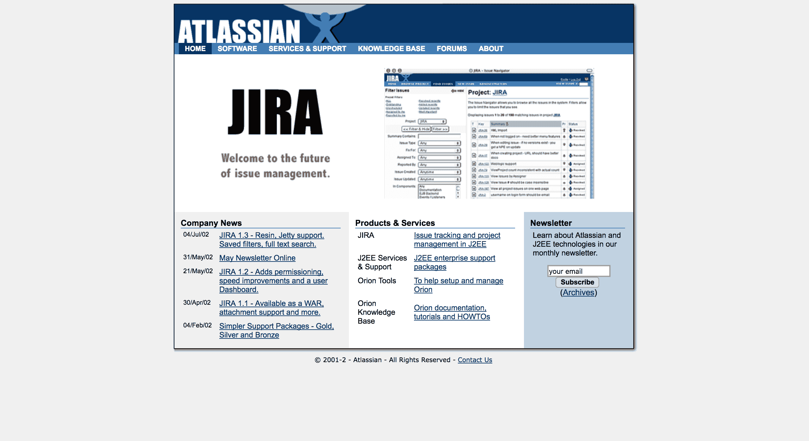

吉拉有一个简单的界面，为开发人员提供了一个单一的地方来管理错误，规划功能和跟踪任务。吉拉还提供了版本历史、文件附件和问题搜索功能——开发者在一个地方管理软件项目所需的一切。这在以前用其他工具是不可能的。

由于吉拉的全面性和复杂性，该产品的学习曲线非常陡峭。但这实际上是 Atlassian 特定市场的福音。让该产品具有挑战性的是开发人员最喜欢它的地方——它做了问题跟踪所需的一切事情，并且他们可以对它进行定制，以精确地按照他们特定团队和项目所需的方式工作。

2004 年:吉拉带来了收入，但即使在最初几年，Atlassian 也在寻找其他潜在的收入来源。Wiki 技术正在开发人员市场中获得牵引力 Atlassian 的联合创始人将此视为向具有企业知识管理系统需求的团队提供简单 wiki 功能的机会。[他们称这个新的开发团队协作平台为融合](http://www.theserverside.com/discussions/thread/24701.html)。它是为那些也会使用吉拉的团队设计的，旨在通过使维基易于创建、编辑、链接、搜索和组织来提供更多的价值。

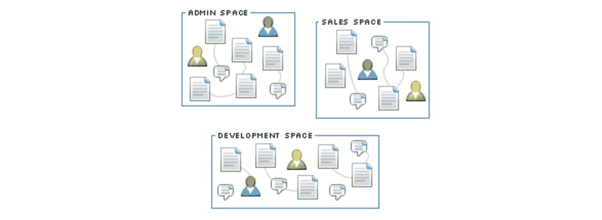

Confluence 还与吉拉集成得非常好，开发团队已经开始喜欢它了。它与另一个真正具体、有用的产品无缝合作，这促使团队尝试 Confluence。

在吉拉取得初步成功后，开发第二个产品的决定是有风险的，因为许多早期公司将所有注意力都集中在单一产品上。划分资源可能意味着两种产品都会失败。但是这个团队相信用户有多喜欢使用吉拉，并且认识到 Atlassian 还可以提供其他有用的工具。多产品战略获得了回报。正如卡农-布鲁克斯所说:“我们有两个火箭发动机驱动着我们前进，而不只是一个。”

2005 年:成立仅三年，Atlassian 就在没有任何风险投资的情况下实现了盈利。这是因为他们收取企业价格，而不必花钱支付销售人员:他们通过在其网站上提供 30 天免费试用的选项来销售产品，然后让试用用户选择获得付费计划。这允许开发人员试用他们的产品，意识到它们是多么有用，然后将产品推荐给他们的团队成员和开发人员朋友。

2007 年:当时，吉拉和 Confluence 的销售额都在增长，这证明了开发商市场是一个充满机遇的空间。但在这里，Atlassian 做出了一个非常有趣、独特的举动。企业开发者工具公司扩张的典型方式是打造更多的产品。由于 Atlassian 有资金，他们决定不花时间去制造更多自己的工具，而是购买已经成功的工具。

这让他们把目光投向了 Cenqua 公司，该公司开发了三款开发工具——鱼眼、坩埚和三叶草。这些工具填补了 Atlassian 产品的空白。Cannon-Brookes 指出[这些工具](https://www.infoq.com/news/2007/08/atlassiancenqua)的一些功能，比如 Crucible 的代码审查，对开发者来说非常有价值。[他说](https://radiowalker.wordpress.com/2007/08/02/why-atlassian-acquired-cenqua/)“在 1 到 10 的范围内，[森卡工具]的战略契合度是 10。”

他们通过允许服务不间断地继续，将这些产品集成到他们的产品中，但是将所有产品的信息和文档转移到 Atlassian 站点。Cenqua 的所有开发和执行人员都加入了 Atlassian。到 2008 年，Crucible 工具与 Atlassian 的其他产品一起被列在 Atlassian 的网站上，作为一个有凝聚力的产品套件的一部分。

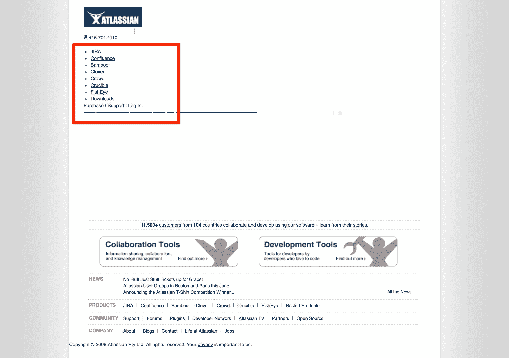

这么早就进行收购是不寻常的，尤其是考虑到该公司缺乏风险资金。但 Atlassian 的免费增值销售模式帮助他们迅速创造了大量收入。当他们权衡构建他们自己版本的工具所需的时间和金钱的利弊时，该公司认为收购 Cenqua 是当时对他们资源的最佳利用。

免费增值销售和分销模式，以及早期的收购，创造了许多收入流，导致 ARR 在 2010 年超过 5000 万美元。此时，该公司已经成立八年，并且已经盈利五年。

很明显，Atlassian 不需要风险投资来生存——他们已经建造了一个可以独立生存的引擎。但在他们对公司的长期规划中，他们有自己独特的理由希望在下一个增长阶段与投资者合作。

## 2010-2015:整合收购并扩展到其他团队

> “我们想建立一个 50 年的公司。上市是这一旅程中的一步。很少有长期公司是私有的。”**——斯科特·法夸尔**T3】

与许多公司不同，Atlassian 没有筹集资金，因为他们需要现金——他们已经通过用有用的工具赢得开发者市场，建立了一个健康业务的模型。

吉拉、Confluence 和 Cenqua 产品的早期成功鼓舞了这个团队，并证明了他们的免费增值分销模式是可行的。他们意识到，通过构建一套开发人员需要的产品，他们可以成为客户不可或缺的一部分，并长期留住他们。鉴于第一次收购的成功，该公司决定最好的前进道路是成为收购的佼佼者，并将有用的现有产品整合到 Atlassian 套件中。

以下是 Atlassian 在这段时间内所做的事情，以获得正确的产品，将它们很好地集成，并继续将他们的用户群扩展到与开发团队无关的用户。

2010 年: Atlassian 在创办公司八年后，从 Accel Partners 获得了 6000 万美元的二次融资。他们计划用这笔投资的钱来增加他们的收购和增长资金。该团队表示，资本将通过其他企业工具流向[M&A。这些额外的工具将帮助他们为企业开发团队提供更多的功能，并开始扩展到其他垂直领域。](https://techcrunch.com/2010/09/29/atlassian-buys-mercurial-project-hosting-site-bitbucket/)

此时，Atlassian 在全球拥有超过 20，000 名客户，包括脸书和 Adobe，他们觉得有必要提供一套更加强大和全面的开发工具。因此，在[开始做【Adobe 为设计师所做的事情，除了技术团队，”Atlassian 研究了他们如何帮助开发人员在其他阶段管理他们的项目。](https://techcrunch.com/2010/09/29/atlassian-buys-mercurial-project-hosting-site-bitbucket/)

这导致他们收购了 Bitbucket，这是一种代码协作托管服务，金额未披露。Bitbucket 帮助开发人员在一个分散的软件仓库上共享和协作。[正如一份报告指出的](https://techcrunch.com/2010/09/29/atlassian-buys-mercurial-project-hosting-site-bitbucket/)，由于收购了 Bitbucket，开发人员现在有了“一个转储和托管代码的地方，以及一个在 Atlassian 中跟踪项目问题和 bug 的地方。”这是填补 Atlassian 产品空白的完美产品。Atlassian 将该产品与所有其他产品一起提供，并创建了新的定价等级，包括免费增值计划，以无缝融入 Atlassian 现有的免费增值分销模式。

**2012:** Atlassian 收购了托管私人聊天服务 Hipchat，并宣布计划将聊天功能集成到其产品套件中。这是一个聪明的举动，表明 Atlassian 走在了时代的前面——Slack 还没有倒闭，实时通信工具也不是显而易见的收购。然而，Atlassian 在他们自己的团队中使用 Hipchat，并且知道它有多有用，所以他们也想为他们的用户提供相同的集成功能。

HipChat 当时发展迅速，拥有超过 1200 名自己的客户，包括 Groupon 和 HubSpot。该产品有助于整个组织的沟通。Hipchat 的首席执行官兼创始人皮特·柯利(Pete Curley)说，Atlassian 是继续快速扩展 Hipchat 服务的完美环境，[指出](https://www.atlassian.com/blog/archives/press-release-atlassian-acquires-hipcha)“无摩擦的商业模式。”收购 Hipchat 是 Atlassian 填补其产品供应漏洞的完美方式*和*让更多的非开发团队开始使用 Atlassian 的产品。[正如卡农-布鲁克斯所说](https://www.atlassian.com/blog/archives/press-release-atlassian-acquires-hipcha)，Hipchat“对产品团队来说是完美的，但对任何*团队来说都是极好的。”*

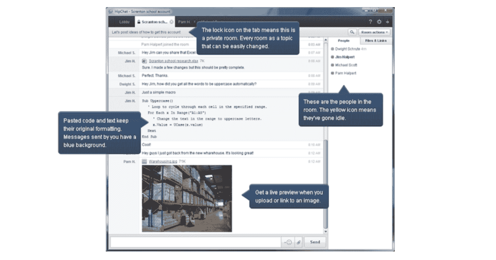

[Source: The Next Web](https://thenextweb.com/insider/2012/03/07/collaboration-software-maker-atlassian-buys-chat-service-hipchat-to-enhance-its-products/)

**2013:** Atlassian 在吉拉的基础上发布了一款面向 IT 市场的服务台产品。新功能[包括](https://www.atlassian.com/blog/archives/introducing-jira-service-desk)以客户为中心的界面、SLA 引擎、可定制的团队队列以及实时报告和分析。

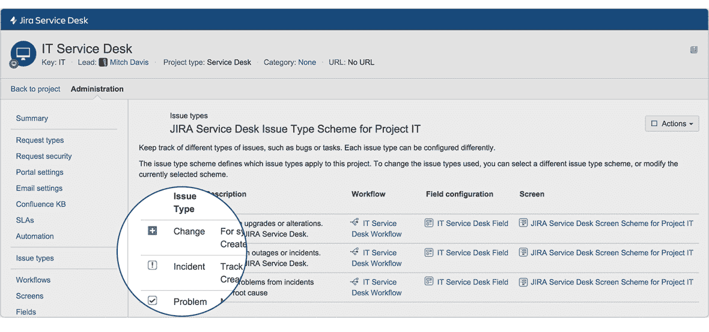

当时，Atlassian 总裁 Jay Simmons 表示，这一增加是基于吉拉客户需求的有机扩展。大约 40%的吉拉用户已经将吉拉扩展到服务台和帮助台用例，并要求 Atlassian 构建这项服务。服务台帮助将 Atlassian 的服务扩展到 IT 部门，并继续增加预订量，当时的[年预订量超过 1 亿美元](https://gigaom.com/2013/10/02/atlassian-parlays-jira-into-service-desk-world/)。

**2015:** Atlassian 的 Git 服务正在快速增长——Atlassian 开发工具总经理 Eric Wittman，[指出](https://techcrunch.com/2015/09/22/atlassian-updates-its-git-services-combines-them-under-the-bitbucket-brand/)前一年 Bitbucket 的客户增长率约为 80%,三分之一的财富 500 强公司使用 Bitbucket。为了适应这种增长并呈现一个有凝聚力的品牌，Atlassian 将他们所有基于 Git 的服务合并到 Bitbucket 品牌下，并添加了支持更大的分布式团队和项目的功能。

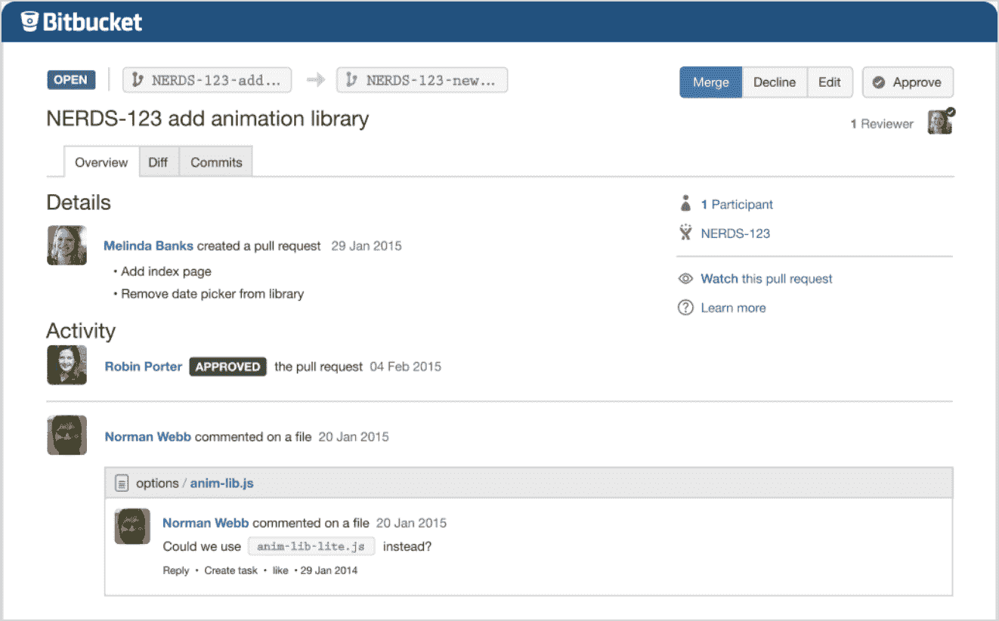

这些年来，Atlassian 为团队如何协作提供了广阔的视野，从而填补了 SaaS 团队工具的空白。虽然许多公司进行收购，但大多数公司在整合方面执行得不好。合并两家独立的公司可能是一场噩梦，因为它们的品牌、个性甚至代码都有冲突。Atlassian 不仅开发了进行明智收购的技能，他们还掌握了从人员到代码的复杂集成过程。

这个策略完全是关于锁定。对于这种紧密集成的解决方案，一种工具的产品优势不一定是卖点。相反，它是整套产品的综合功能。如果一家公司更喜欢 Github 的功能而不是 Bitbucket 的功能，这并不重要——如果一个团队已经连接到吉拉和 Confluence，他们会使用 Bitbucket，因为它使他们的工作流程更加方便和高效。

这一战略直接融入了 Atlassian 的低成本分销模式。他们对最初的产品收费很低，出售的座位数量也很少。每个产品都有自己的定价模型，因此团队可以按菜单添加产品。大多数都是从免费试用开始的。

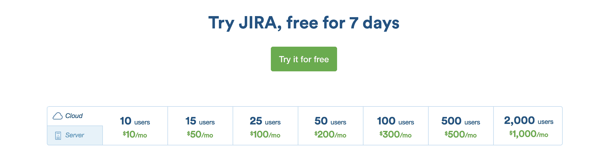

[Jira pricing in 2015.](https://web.archive.org/web/20150821011848/https://www.atlassian.com/software/jira)

很快，随着更多的团队成员加入，更多的团队和用户被拉进来，他们的飞轮将开始发挥作用，团队意识到试图在没有 Atlassian 工具的情况下工作会很困难。

我们的目标是让这些部分的总和创造出一个有粘性的、无所不包的整体。就收购效率而言，这很有效。从 2012 年到 2015 年，Atlassian 将其年收入的 12%到 21%花费在 CAC 上，而 SaaS 行业的中位数为 50%到 100%。

增加产品有助于 Atlassian 找到新的方法将用户吸引到吉拉套件中——比如为开发者提供 Bitbucket，为非开发者团队提供 Hipchat。这导致了用户和收入的急剧增长。

[Source: SEC](https://www.sec.gov/Archives/edgar/data/1650372/000155837015001685/c372-20150821x20fg002.jpg)

最初的几款 Atlassian 产品，如吉拉和 Confluence，带来了稳定的收入。收购使得 Atlassian 能够通过每种额外的产品实现复合增长。就在 Atlassian 首次公开募股之前，他们宣布年销售额为 3.2 亿美元，比前一年增长了 60%。

Atlassian 钉钉他们的分配飞轮和收购/整合机。他们准备扩大自己的漏斗顶端，并试图赢得企业组织中更多的团队。

## 2015 年至今:向竞争激烈、利润丰厚的市场扩张

对许多 SaaS 公司来说，Atlassian 看起来像是“终极目标”他们已经成长为一家庞大的上市全球性公司，为许多不同的垂直行业提供一套复杂的集成产品。

但是 Atlassian 明白成功是一个连续体。它们燃烧得很亮，但除非它们能够保持增长，并保持对市场的控制，否则它们会燃烧起来。目标不再仅仅是为开发团队构建一套一流的工具。相反，它让整个公司——以及其中的所有团队——使用 Atlassian 套件中的相关产品。

虽然 Atlassian 致力于为组织内的许多不同团队提供产品，但该公司仍然需要找到一种方法来与小团队保持联系。他们的许多赚钱产品对小团队来说变得不必要的复杂。他们没有浪费时间构建轻量级版本，而是使用成功的收购和整合策略将轻量级产品添加到 Atlassian 套件中。

让我们仔细看看他们在过去几年中的收购和整合是如何帮助他们拓宽渠道，进入利润更高、竞争更激烈的市场的。

**2015:** Atlassian 于 12 月举行首次公开募股，并开始交易股票，市值[近 58 亿美元](http://fortune.com/2015/12/10/atlassian-ipo-leap/)。

该公司在首次公开募股后的计划是通过投资研发继续积极扩大销售。当时，他们将超过 40%的收入投入到研发中，并希望保持其在 T2 30%的年增长率。这反过来推动了更多的收入，他们可以将这些收入投入到研发和收购中，继续推动他们的飞轮。

**2016:** 为了将自己打造成一个更加无处不在的工具提供商，并帮助公司维护他们的软件，Atlassian [收购了 Statuspage](https://techcrunch.com/2016/07/14/atlassian-acquires-statuspage/) ，这使得企业能够让用户了解他们在线服务的最新状态。Atlassian 已经与 Statuspage 建立了关系，因为他们是 Hipchat 的早期用户，也因为他们已经用 Statuspage 托管了自己的状态。

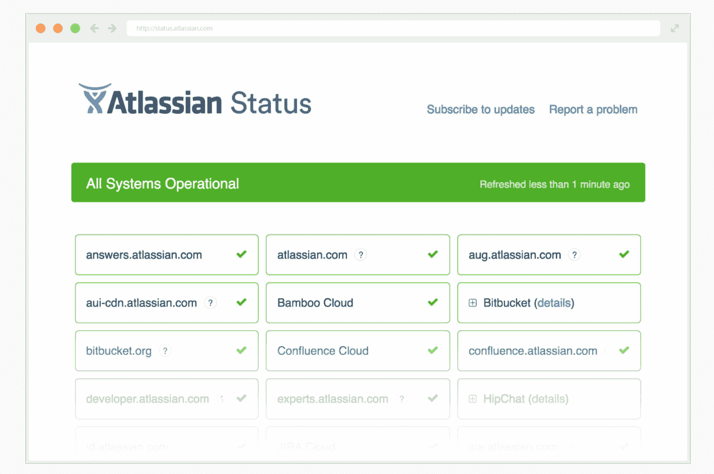

Atlassian 的总裁杰伊·西蒙斯(Jay Simons)说，他认为该产品满足了 Atlassian 产品的自然需求，尤其是与吉拉的问题跟踪服务一起。对于已经在使用吉拉和套件中其他产品的用户来说，这是一个补充产品——但这也是一种通过更广泛的使用案例吸引不同用户的方式。

**2017:** 最近，Atlassian 通过收购轻量级项目管理工具 Trello，向更小的团队迈出了一大步。我已经[从特雷罗的潜力的角度谈到了 Atlassian 对 Trello](http://producthabits.com/why-trello-failed-to-build-a-1-billion-business/) 的收购——但这次收购也是 Atlassian 旅程中非常重要的一步。Trello 是一个比吉拉简单得多的项目管理工具，简单的看板覆盖了更广泛的用例。

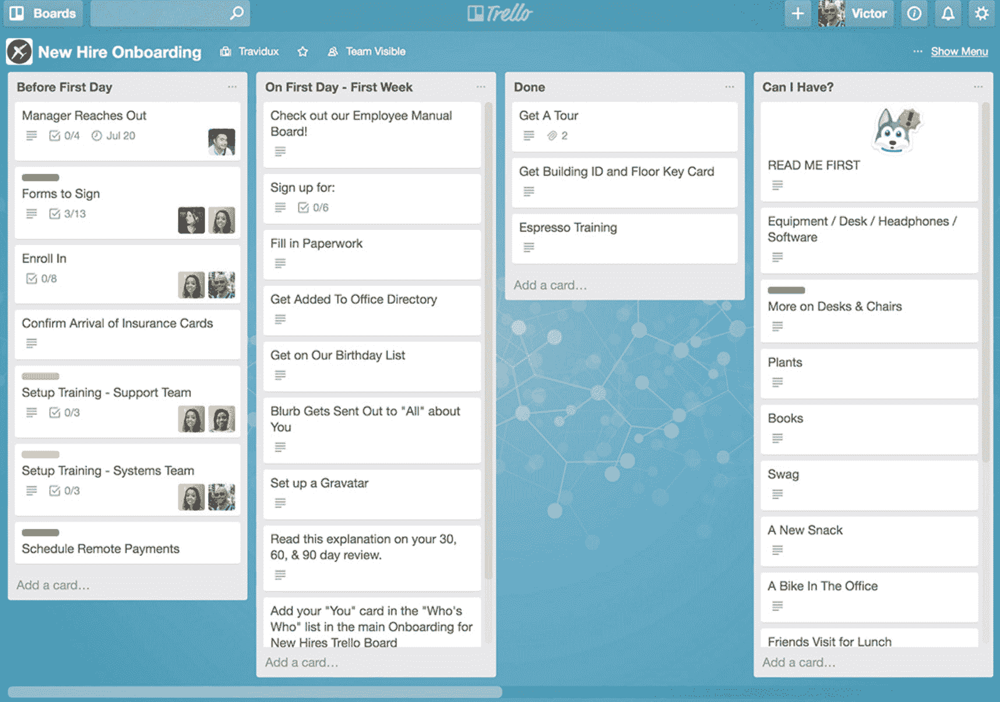

[Source: Trello](https://trello.com/)

Atlassian 需要一种简单的产品来填补小公司在分销战略中的空白，因为吉拉转向了高端市场，变得更加复杂。

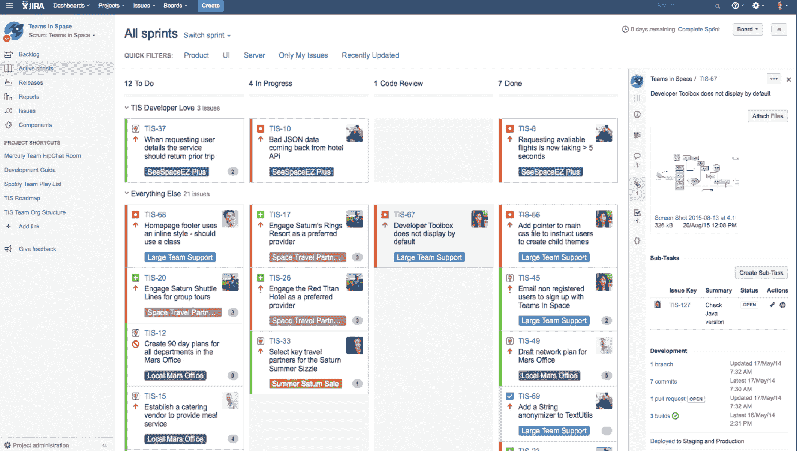

Trello 是用例不可知的，是开发人员专用吉拉的一个很好的简单替代方案。Trello 的加入直接拓宽了渠道，Atlassian 可以通过它将新的、更广泛的用户基础纳入他们的套件，然后根据他们的需求增长交叉销售和追加销售不同的产品。

今年晚些时候，Atlassian 通过将 Hipchat 的服务转变为名为 Stride 的 Atlassian 品牌产品，进行了另一项重大的产品转移。对于团队范围的消息传递来说，它是一个疲软的竞争对手，这意味着它有一些可预测的功能，如基于文本的消息传递和视频音频会议。它还增加了一些独特的功能，如聚焦模式，当你在工作时的“离开”设置，以及*动作*和*决定*，这些都显示了你离开时发生的谈话的亮点。根据 Atlassian 的说法，目标是以竞争产品无法做到的方式让团队更有生产力。

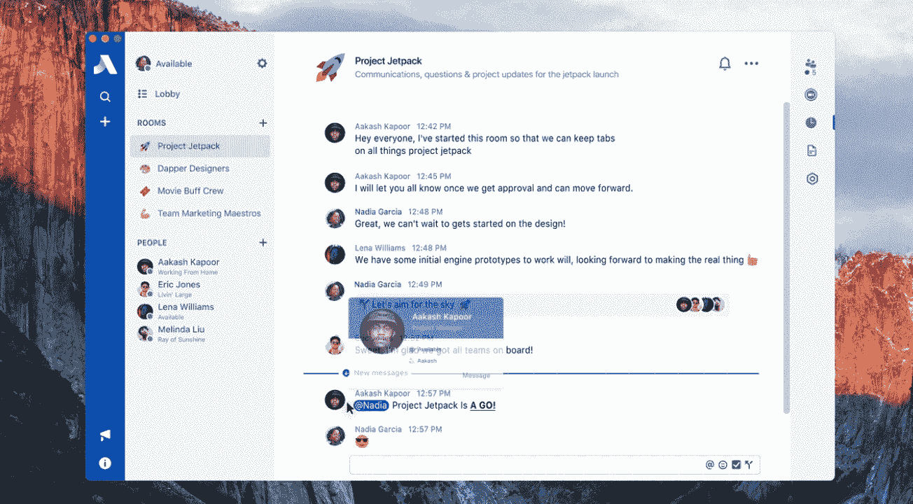

[Source: TechCrunch](https://techcrunch.com/2017/09/07/atlassian-launches-stride-its-slack-competitor/)

Atlassian 最近的产品决策，特别是围绕 Trello 和 Stride 的决策，表明他们仍在寻找新的方法来瞄准各种规模公司内的不同团队。Trello 和 Stride 都是免费增值产品— [这是 Trello 的致命弱点](http://producthabits.com/why-trello-failed-to-build-a-1-billion-business/),但免费计划将是收购无力支付企业产品和企业功能的较小团队的关键。

Atlassian 最近收购的产品——Trello、Stride 或 status page——都没有特定市场的使用案例。他们都是任何规模的组织中几乎任何团队的跳板。一旦有一个团队接受，他们都有可能在团队间横向采用。

这些最近的举措表明，Atlassian 非常聪明地在竞争更激烈、利润更丰厚的市场中为更广泛的使用案例增加产品供应。他们将收购转化为额外的产品供应，但与此同时，他们也在清除潜在的破坏者，保护他们已经建立的锁定。

## Atlassian 将何去何从

Atlassian 的收购模式——以及他们在产品添加方面的成功——非常不典型。展望未来，他们已经具备了继续通过收购挤入更多市场的所有条件。

随着收购/整合机器的到位，Atlassian 可以扩展的一些具体方式如下:

*   **利用 Trello 登陆新公司:**收购 Trello 完全是为了在组织内部寻找一种登陆新领域的方式。对于 Atlassian 和 Trello 来说，最大的机会之一是获得那些还没有使用吉拉或其他 Atlassian 工具的团队的产品经理的支持。因为 Trello 非常简单，所以摩擦少得多，使得团队更容易采用该产品。但是它有许多与 Atlassian 工具的[强大集成，简化了跨团队的工作流程。这为团队进入 Atlassian 套件增加了另一个入口。如果 Atlassian 可以将 PMs 安装到 Trello 上，他们也许可以让那些与他们合作的人，比如开发团队，也使用 Trello。接触 Trello 将使这些开发团队意识到像吉拉这样的集成产品，并且如果他们还没有的话，可能会激励他们使用更多的开发人员专用工具。](https://www.atlassian.com/blog/announcements/trello-power-ups-for-atlassian-suite)
*   **使用 Stride 连接团队协作的所有元素:** Messenger 工具是任何公司协作能力的重要层面，它们有可能影响到公司的每个团队。Atlassian 知道它不能将这一宝贵而深远的潜力交给 Slack，Slack 具有允许用户插入工作场所工具的集成。Stride 是一个防御性的举措，但它有可能对 Atlassian 用户真正有用，并将整个公司的更多用户拉入 Atlassian 套件。更少的来回和手动信息传输将使工作更加高效和轻松，因此 Atlassian 必须确保他们围绕 Stride 的集成和营销利用这一点。
*   **构建出设计师工具:** Atlassian 为用户提供 [Atlaskit](https://atlaskit.atlassian.com/) ，这是公司的官方 UI 库。它包含了构建 Atlassian 设计风格所需的所有工具。但是 Atlassian 可以扩展构建更多不可知的前端开发工具，用于 UI 设计和 UX 测试。它们有潜力与 Invision 竞争，并为设计者构建一个更好的集成工具。他们可以通过购买像 UXPin 这样的全栈 UX 设计平台来启动这项工作。

Atlassian 团队为自己赢得了大量时间来做出谨慎的决定，建立了一个健康的业务，可以自立，盈利，并上市。展望未来，如果他们继续做出深思熟虑的决定，他们可能会成为各种规模的 SaaS 公司最有用的工作场所工具的主要提供者。

## Atlassian 发展的 3 个关键经验

联合创始人知道 Atlassian 与其他 SaaS 公司不同。他们的很多决定都是非传统的，并且确实是针对他们的限制的。他们对其他公司说， *[不要试图抄袭我们](https://www.recode.net/2016/9/8/12854474/atlassian-mike-cannon-brookes-australia-recode-decode-podcast-transcript)* 。

对于那些自己创业的人来说，更重要的一点是，你不应该也不能照搬 Atlassian 的任何决策，因为每个公司都必须根据自己的具体目标和挑战找到成功的方法。但是你可以从 Atlassian 解决问题的方式和他们寻找机会的方式中学习。这些技能对成功和成长至关重要——没有它们，你就死定了。

这些是任何创建公司的人都应该从 Atlassian 那里学到的关键经验:

### 1.尽早关注资本效率

许多 SaaS 公司试图通过自力更生实现盈利。让 Atlassian 的旅程如此独特——如此成功——的是他们开创了许多前所未有的方式。

首先，Atlassian 从 2002 年开始使用免费增值分销模式，因为他们负担不起销售团队。当时没有很多企业软件公司这么做。但这使得销售和营销支出从一开始就非常低。

提高资本效率的另一个重要步骤是在早期积极增加更多产品。这是有风险的，因为许多公司通过专注于单一产品来获得立足点。Atlassian 很早就开始扩建套房，这增加了收入。

有两个主要机制有助于提高资本效率:**较低的 CAC** 和**较高的收入**。Atlassian 找到了降低 CAC 和增加收入的具体方法，您可以通过查看您的独特限制并考虑以下因素来实现这一点:

*   你可以通过瞄准更有效的营销渠道，更有效地将免费增值用户纳入付费账户，以及通过内容和免费试用专注于集客营销来降低 CAC。
*   您可以通过提高价格、增加新产品的额外收入流以及向其他产品和附加产品交叉销售用户来增加收入。

资本效率对 Atlassian 的早期发展和成功至关重要，这是任何 SaaS 公司的良好心态和实践。

### 2.拥有特定的客户群

Atlassian 扎根于开发团队。从那里，它有了一个在企业组织内扩展到其他团队的切入点。对于那些喜欢使用吉拉并且不想转换的开发团队来说，拥有一个据点是让其他团队使用 Atlassian 辅助工具的关键。

[Salesforce 在销售市场也做了同样的事情](http://producthabits.com/salesforce-built-10-billion-empire-crm/)。尽管他们现在已经扩展到企业业务的几乎每一个市场，但他们从 CRM 开始，并局限在销售团队中。赢得一个部门是打持久战的关键。

当您刚刚起步时，很难赢得广泛的用例，因为很难专注于一个特定的价值主张并引起任何人的注意。相反，**专注于一个组织内的一个部门**,向那个特定的人群宣传你的产品。你可以采取一些具体的步骤来发展这种福音精神:

*   为特定市场的早期用户群体提供研讨会和网络会议
*   与目标市场的早期客户讨论你的产品能解决哪些具体问题，并确保你的营销能反映这些棘手问题和解决方案
*   当你开始构建附加产品和新功能时，在扩展到其他细分市场之前，确保它们与你的目标市场特别相关。

### 3.选择你想掌握的商业风格

有很多方法可以建立一个伟大的公司。一些公司选择更加注重产品创新。其他公司，如 Atlassian，更强调战略性收购。像 Salesforce 这样的公司选择关注交付方式和行业颠覆。有些，像 Basecamp，专注于单一产品的简单性。

没有放之四海而皆准的方法，但是所有这些成功的公司都有一个共同的主题。他们都很早就形成了一个需要掌握的概念，他们坚持这个概念，并在他们的所有决定中贯彻执行。

尽早决定什么对你的公司来说更重要是具有挑战性的，但是它给你一个清晰的焦点。两个重要因素将影响这一早期决策:

*   你对自己公司和产品的最初愿景是什么？
*   你希望你的公司在 5 年、10 年和 20 年后实现什么目标？

## 打破常规，打造自己的增长引擎

建立一个长期的公司是具有挑战性的，因为你将在业务的不同阶段面临如此多不同的限制。同样的因素不一定会在每个阶段推动你的成长。但是，如果你知道你想要如何成长，并且有一个关于你将采取什么步骤来实现它的策略，你就可以在许多不同的情况下制定一个决策框架。

Atlassian 的战略——收购、整合和有机分销——特别特别，因为没有多少其他公司这样做过(而且做得很好)。你的公司可能看起来也与其他公司不同。目标是建立一个框架，帮助你用手中的牌取胜。