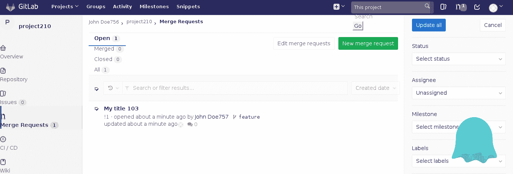
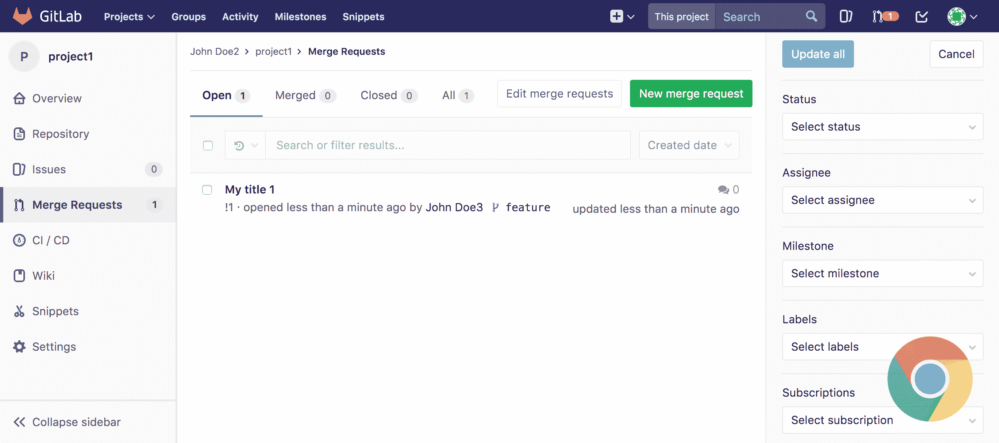
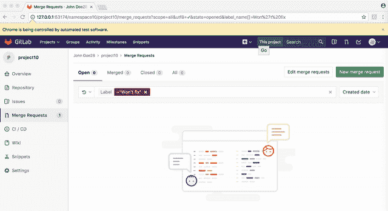
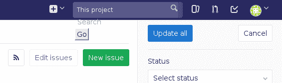

# GitLab 如何切换到 Headless Chrome 进行测试| GitLab

> 原文：<https://about.gitlab.com/2017/12/19/moving-to-headless-chrome/?utm_source=wanqu.co&utm_campaign=Wanqu+Daily&utm_medium=website>


GitLab 最近从 PhantomJS 切换到 headless Chrome 进行前端测试和 RSpec 特性测试。在本帖中，我们将详细介绍我们进行这一转变的原因、我们面临的挑战以及我们开发的解决方案。我们希望这将有利于其他人做出改变。

我们现在有了一个真正准确的方法来在一个真正的现代浏览器中测试 GitLab。该开关提高了我们在 Chrome 中直接运行测试时编写和调试测试的能力。此外，这一变化迫使我们面对并清理了一些我们在测试中使用的黑客手段。

## 背景

近五年来，PhantomJS 一直是 GitLab 测试框架[的一部分](https://gitlab.com/gitlab-org/gitlab-ce/commit/ba25b2dc84cc25e66d6fa1450fee39c9bac002c5)。在当时几乎没有可用选项的情况下，它是在一个无头环境中运行浏览器集成测试的非常有用的工具。然而，它有一些缺点:

PhantomJS 的最新版本(v2.1.1)是用三年前的版本 [QtWebKit](https://trac.webkit.org/wiki/QtWebKit) (根据用户代理字符串是 WebKit v538.1 的一个分支)编译的。这使它与 macOS 10.9 上的 Safari 7 不相上下。它类似于一个真正的现代浏览器，但它并不完全在那里。它有一个不同的 JavaScript 引擎，一个旧的渲染引擎，以及许多缺失的特性和怪癖。

目前，GitLab 支持 Firefox、Chrome、Safari 和 Microsoft Edge/IE 的当前和以前的主要版本。这使得幻像及其能力接近或低于我们的最小公分母。许多现代浏览器功能要么[不工作](http://phantomjs.org/supported-web-standards.html)，要么[需要厂商前缀](http://phantomjs.org/tips-and-tricks.html)和聚合填充，而我们支持的浏览器都不需要。我们可以在我们的测试环境中有选择地添加这些聚合填充、前缀和其他变通方法，但是这样做会增加技术负担，引起混乱，并使测试不能代表真实的生产环境。在大多数情况下，我们选择简单地省略它们或者绕开它们(稍后[会有更多的介绍](#trigger-method))。

下面是 PhantomJS 从 GitLab 渲染页面的方式截图，随后是在 Google Chrome 中渲染的相同页面:





你可以在 PhantomJS 中看到过滤器标签是水平显示的，侧边栏中的图标显示在它们自己的行上，全局搜索栏溢出了导航栏，等等。

虽然它看起来很丑，但在大多数情况下，只要页面的元素保持可见和可点击，我们仍然可以使用它来运行功能测试，但这种与 GitLab 在真实浏览器中呈现的方式的差异确实引入了一些边缘情况。

## 什么是无头浏览器

今年四月，[有消息传出](https://news.ycombinator.com/item?id=14101233)Chrome 59 将支持一个[原生的、跨平台的无头模式](https://www.chromestatus.com/features/5678767817097216)。以前可以使用虚拟帧缓冲区在 CI/CD [中模拟无头 Chrome 浏览器，但这需要大量内存和额外的复杂性。原生无头模式是一个游戏改变者。现在有可能在一个无头环境中，在我们的用户实际使用的一个真实的、现代的 web 浏览器上运行集成测试！](https://gist.github.com/addyosmani/5336747)

这一消息披露后不久，PhantomJS 的首席开发者 Vitaly Slobodin 宣布，该项目[将不再保留](https://github.com/ariya/phantomjs/issues/15105#issuecomment-322850178):

很明显，我们需要在某个时候摆脱幻想曲，所以我们[开了一个问题](https://gitlab.com/gitlab-org/gitlab-ce/issues/30876)，下载了 Chrome 59 测试版，并开始寻找选项。

### 前端测试(因果报应)

我们的前端测试套件利用了 [Karma](http://karma-runner.github.io/) 测试运行器，并且更新它以与 Google Chrome 一起工作非常简单([这里是合并请求](https://gitlab.com/gitlab-org/gitlab-ce/merge_requests/12036))。从[版本 2.1.0](https://github.com/karma-runner/karma-chrome-launcher/releases/tag/v2.1.0) 开始，[的 karma-chrome-launcher](https://github.com/karma-runner/karma-chrome-launcher) 插件被快速更新以支持无头模式，它本质上是 PhantomJS launcher 的替代物。一旦我们[重新构建了 CI/CD 构建映像](https://gitlab.com/gitlab-org/gitlab-build-images/merge_requests/41)以包含 Google Chrome 59(并修改了一些讨厌的超时设置)，它就工作了！我们还能够删除一些相当难看的 PhantomJS 特有的黑客攻击，Jasmine 需要这些攻击来监视一些内置的浏览器功能。

### 后端功能测试(RSpec +水豚)

我们的功能测试使用 RSpec 和 [Capybara](https://github.com/teamcapybara/capybara) 来执行数据库、后端和前端交互的完整端到端集成测试。在切换到无头 Chrome 之前，我们使用了[的恶作剧精灵](https://github.com/teampoltergeist/poltergeist)，它是水豚的一个幻想曲驱动程序。它将启动一个 PhantomJS 浏览器实例，并指导它浏览、填写表单和点击页面，以验证一切正常。

从 PhantomJS 切换到 Google Chrome 需要将驱动程序从 Poltergeist 改为 Selenium 和 [ChromeDriver](https://sites.google.com/a/chromium.org/chromedriver/) 。设置这个非常简单。你可以用`brew install chromedriver`在 macOS 上安装 ChromeDriver，这个过程在 Linux 的任何给定的包管理器上都是相似的。之后，我们将`selenium-webdriver` gem 添加到我们的测试依赖项中，并像这样配置水豚:

```
require 'selenium-webdriver'

Capybara.register_driver :chrome do |app|
  options = Selenium::WebDriver::Chrome::Options.new(
    args: %w[headless disable-gpu no-sandbox]
  )
  Capybara::Selenium::Driver.new(app, browser: :chrome, options: options)
end

Capybara.javascript_driver = :chrome 
```

谷歌表示，在一些问题得到解决之前， [`disable-gpu`选项暂时是必要的。对于](https://developers.google.com/web/updates/2017/04/headless-chrome#cli) [GitLab 的 CI/CD 环境](/topics/ci-cd/)，让 Chrome 在 Docker 容器中运行似乎也是必要的。谷歌为使用无头 Chrome 和 Selenium 提供了一个有用的指南。

在我们的最终实现中，我们对此进行了更改，以有条件地添加`headless`选项，除非您的环境中有`CHROME_HEADLESS=false`。这使得在调试或编写测试时很容易禁用无头模式。在浏览器窗口上实时观察测试的执行也非常有趣:

```
export CHROME_HEADLESS=false bundle exec rspec spec/features/merge_requests/filter_merge_requests_spec.rb 
```



### 闹鬼和硒的区别

这里切换驱动程序的过程不像前端测试套件那样简单。当我们改变我们的 Capybara 配置时，许多测试开始失败，这是由于 Selenium/ChromeDriver 实现 Capybara 的驱动程序 API 的方式与 Poltergeist/PhantomJS 相比有一些重大差异。以下是我们遇到的一些挑战:

1.  **不再自动接受 JavaScript 模态**

    我们经常在执行破坏性操作时使用 JavaScript `confirm("Are you sure you want to do X?");` click 事件，比如删除一个分支或者从一个组中删除一个用户。在 Poltergeist 下，`.click`动作会自动接受像`alert()`和`confirm()`这样的模态，但是在 Selenium 下，你现在需要用`accept_alert`、`accept_confirm`或`dismiss_confirm`中的一个来包装它们。例如:

    ```
    # Before
    page.within('.some-selector') do
      click_link 'Delete'
    end

    # After
    page.within('.some-selector') do
      accept_confirm { click_link 'Delete' }
    end 
    ```

2.  **硒`Element.visible?`为空元素**返回假

    如果您想在测试中访问一个空的`div`或`span`，Selenium 不认为这些是“可见的”这不是一个大问题，除非你像我们在特性测试中那样设置`Capybara.ignore_hidden_elements = true`。在“吵闹鬼”中`find('.empty-div')`可以正常工作的地方，我们现在需要使用`visible: :any`来选择这样的元素。

    ```
    # Before
    find('.empty-div')

    # After
    find('.empty-div', visible: :any)
    # or
    find('.empty-div', visible: false) 
    ```

    更多关于[水豚和隐藏元素](https://makandracards.com/makandra/7617-change-how-capybara-sees-or-ignores-hidden-elements)的信息。

3.  **恶作剧的`Element.trigger('click')`方法在硒**中不存在

    在 Capybara 中，当你使用`find('.some-selector').click`时，你点击的元素必须是可见的，并且不被任何重叠的元素遮挡。Poltergeist/PhantomJS 有时会出现无法点击链接的情况，因为它对无前缀的 CSS 支持很差。这里有一个例子:

    

    这里的搜索表单的不完整布局实际上是在“全部更新”按钮的顶部放置了一个不可见的元素，使其不可点击。Poltergeist 提供了一个`.trigger('click')`方法来解决这个问题。该方法不是实际单击元素，而是触发一个 DOM 事件来模拟单击。使用这种方法是一种不好的实践，但是我们经常遇到类似的问题，以至于许多开发人员养成了在任何地方都使用它的习惯。这开始导致一些懒惰和草率的测试写作。例如，有人可能使用`.trigger`作为快捷方式来点击隐藏在打开的下拉菜单后面的链接，而一个正确编写的测试应该在某个地方`.click`关闭下拉菜单，然后*再* `.click`点击它后面的项目。

    Selenium 不支持`.trigger`方法。既然我们使用了更精确的渲染引擎，不会破坏我们的布局，许多这样的情况可以通过简单地用`.click`替换`.trigger('click')`来解决，但是由于上面提到的一些不好的实践使用，这并不总是有效。

    当然有一些方法可以黑掉一个`.trigger`替代品。您可以通过聚焦在一个元素上并点击“return”键来模拟点击，或者使用 JavaScript 来触发点击事件，但是在大多数情况下，我们决定花时间来实际纠正这些实现不佳的测试，以便可以再次使用普通的`.click`。毕竟，如果我们的测试是为了模拟真实用户与页面的交互，我们应该把自己限制在真实用户应该使用的动作上。

    ```
    # Before
    find('.obscured-link').trigger('click')

    # After

    # bad
    find('.obscured-link').send_keys(:return)

    # bad
    execute_script("document.querySelector('.obscured-link').click();")

    # good
    # do something to make link accessible, then
    find('.link').click 
    ```

4.  **`Element.send_keys`只作用于可聚焦元素**

    我们在代码中有几个地方使用类似`find('.boards-list').native.send_keys('i')`的东西来测试键盘快捷键。原来 Chrome 不允许你`send_keys`到任何不能被“聚焦”的元素，比如链接、表单元素、文档主体，或者任何可能带有标签索引的东西。

    在我们这样做的所有情况下，在 body 元素上触发`send_keys`都是可行的，因为这是我们的事件处理程序最终监听的地方:

    ```
    # Before
    find('.some-div').native.send_keys('i')

    # After
    find('body').native.send_keys('i') 
    ```

5.  **`Element.send_keys`不支持非 BMP 字符(如表情符号)**

    在一些测试中，我们需要填写带有表情符号的表格。对于恶作剧鬼，我们会这样做:

    ```
    # Before
    find('#note-body').native.send_keys('@💃username💃') 
    ```

    在 Selenium 中，我们会得到以下错误消息:

    ```
    Selenium::WebDriver::Error::UnknownError:
        unknown error: ChromeDriver only supports characters in the BMP 
    ```

    为了解决这个问题，我们在测试包中添加了一个 JavaScript 方法[,它将模拟输入并触发与实际键盘输入在每次击键时产生的相同的 DOM 事件](https://gitlab.com/gitlab-org/gitlab-ce/blob/a8b9852837/app/assets/javascripts/test_utils/simulate_input.js),然后用一个可以这样调用的 [ruby helper](https://gitlab.com/gitlab-org/gitlab-ce/blob/a8b9852837/spec/support/input_helper.rb) 方法包装它:

    ```
    # After
    include InputHelper

    simulate_input('#note-body', "@💃username💃") 
    ```

6.  **设置 cookies 要复杂得多**

    无论是模拟用户会话还是切换设置，在测试页面之前设置一些 cookies 都是很常见的。有了 Poltergeist，这个过程真的很简单。您可以使用`page.driver.set_cookie`，提供一个简单的键/值对，它将按预期工作，用正确的域和范围设置 cookie。

    硒是相当严格的一点。这个方法现在叫做`page.driver.browser.manage.add_cookie`，它有两个警告:

    *   您不能设置 cookies，除非您在您打算设置 cookies 的域中设置了一个页面。
    *   令人恼火的是，您不能更改`path`参数(或者至少我们永远无法让它工作)，所以最好在根路径设置 cookies。

    在你进入你的页面之前，Chrome 的 url 技术上是位于类似于 T1 的位置。当您试图在那里设置 cookie 时，它会拒绝，因为没有主机名，并且您不能通过提供一个域作为参数来强制设置。 [Selenium 文档](http://docs.seleniumhq.org/docs/03_webdriver.jsp#cookies)建议您做以下事情:

    > 如果您试图在开始与网站互动之前预设 cookies，并且您的主页很大/需要一段时间才能加载，另一种方法是在网站上找到一个较小的页面(通常 404 页面很小，例如`http://example.com/some404page`)。

    ```
    # Before
    before do
      page.driver.set_cookie('name', 'value')
    end

    # After
    before do
      visit '/some-root-path'
      page.driver.browser.manage.add_cookie(name: 'name', value: 'value')
    end 
    ```

7.  **页面请求/响应检查方法缺失**

    Poltergeist 非常方便地实现了像`page.status_code`和`page.response_headers`这样的方法，这些方法也出现在 Capybara 的默认`RackTest`驱动程序中，除了浏览器呈现响应的方式之外，还可以很容易地检查来自服务器的原始响应。它还允许您将标题插入到向服务器发出的请求中，例如:

    ```
    # Before
    before do
      page.driver.add_header('Accept', '*/*')
    end

    it 'returns a 404 page'
      visit some_path

      expect(page.status_code).to eq(404)
      expect(page).to have_css('.some-selector')
    end 
    ```

    Selenium 没有实现这些方法，[作者不打算添加对它们的支持](https://github.com/seleniumhq/selenium-google-code-issue-archive/issues/141#issuecomment-191404986)，所以我们需要开发一个变通方法。一些人建议在 ChromeDriver 旁边运行一个代理，拦截所有进出服务器的流量，但这对我们来说似乎有些过头了。相反，我们选择创建一个[轻量级机架中间件](https://gitlab.com/gitlab-org/gitlab-ce/blob/a8b9852837/lib/gitlab/testing/request_inspector_middleware.rb)和一个相应的[助手类](https://gitlab.com/gitlab-org/gitlab-ce/blob/a8b9852837/spec/support/inspect_requests.rb)来拦截流量进行检查。这类似于我们的 [RequestBlockerMiddleware](https://gitlab.com/gitlab-org/gitlab-ce/blob/master/lib/gitlab/testing/request_blocker_middleware.rb) ，我们已经使用它来智能地`wait_for_requests`完成我们的测试。它是这样工作的:

    ```
    # After
    it 'returns a 404 page'
      requests = inspect_requests do
        visit some_path
      end

      expect(requests.first.status_code).to eq(404)
      expect(page).to have_css('.some-selector')
    end 
    ```

    在`inspect_requests`块中，Rack 中间件将记录所有请求和响应，并将它们作为一个数组返回以供检查。这将包括被`visit`处理的页面以及后续的 XHR 和资产请求，但是初始路径请求将是数组中的第一个。

    您还可以使用相同的帮助器注入头，如下所示:

    ```
    # After
    inspect_requests(inject_headers: { 'Accept' => '*/*' }) do
      visit some_path
    end 
    ```

    这个中间件应该在栈的早期注入，以确保任何其他可能拦截或修改请求/响应的中间件将被我们的测试发现。我们将这一行包含在我们的测试环境配置中:

    ```
    config.middleware.insert_before('ActionDispatch::Static', 'Gitlab::Testing::RequestInspectorMiddleware') 
    ```

8.  **浏览器控制台输出不再输出到终端**

    在测试运行时，Poltergeist 会实时自动将任何`console`消息直接输出到终端。如果您在前端代码中有一个导致测试失败的错误，这个特性将使调试变得更加容易，因为您可以检查测试的终端输出中的错误消息或堆栈跟踪，或者将您自己的`console.log()`注入到 JavaScript 中以查看发生了什么。遗憾的是，有了硒，情况就不一样了。

    但是，您可以通过如下方式配置 Capybara 来收集浏览器日志:

    ```
    capabilities = Selenium::WebDriver::Remote::Capabilities.chrome(
      loggingPrefs: {
        browser: "ALL",
        client: "ALL",
        driver: "ALL",
        server: "ALL"
      }
    )

    # ...

    Capybara::Selenium::Driver.new(
      app,
      browser: :chrome,
      desired_capabilities: capabilities,
      options: options
    ) 
    ```

    这将允许您访问以下日志，即在测试失败的情况下:

    ```
    page.driver.manage.get_log(:browser) 
    ```

    这比在吵闹鬼里要麻烦得多，但这是目前为止我们找到的最好的方法。感谢[拉里·里德的博客文章](http://technopragmatica.blogspot.com/2017/10/switching-to-headless-chrome-for-rails_31.html)提供的提示！

## 结果

关于性能，我们试图通过对此次变更前的 10 次全套件 RSpec 测试运行*和此次变更后*的*的 10 次运行的非科学分析来量化变更，排除这些管道之间添加或删除的任何测试。最终结果是:*

**之前:** 5h 18m 52s **之后:** 5h 12m 34s

大约 6 分钟的节省，或者大约 2%的总计算时间，在统计上是微不足道的，所以我不会说我们通过这种改变提高了测试速度。

我们确实提高了测试的准确性，并且极大地改进了我们可以用来编写和调试测试的工具。现在，当 CI/CD 作业失败时生成的所有 Capybara 屏幕截图看起来就像在您自己的浏览器上一样，而不像上面破碎的 PhantomJS 屏幕截图。现在，通过关闭 headless 模式，在 spec 文件中放入一个`byebug`行，并在提示符下输入命令时观察浏览器窗口，可以交互式地在本地检查失败的测试。这项技术被证明在这个项目中非常有用。

您可以在 GitLab.com 的[原始合并请求页面中找到我们所做的所有更改。](https://gitlab.com/gitlab-org/gitlab-ce/merge_requests/12244)

## 无头 Chrome 的其他用途

我们还利用 headless Chrome 来分析前端性能，并发现它在检测问题方面非常有用。

我们也想让其他公司更容易接受，因此作为 GitLab 即将发布的 10.3 版本的一部分，我们将发布[浏览器性能测试](https://docs.gitlab.com/ee/user/project/merge_requests/browser_performance_testing.html)。利用 [GitLab CI/CD](/stages-devops-lifecycle/continuous-integration/) ，针对一组页面启动 headless Chrome，并计算总体性能得分。然后，对于每个合并请求，在源分支和目标分支之间比较分数，使得在合并之前更容易检测性能退化。

## 承认

我真诚地希望这些信息能够对那些希望将自己的 Rails 应用程序从 PhantomJS 转换到 headless Chrome 的人有用。

感谢 Google 团队提供了非常有用的文档，感谢许多博客作者在 headless Chrome 上市初期分享了他们自己的经验，特别感谢 Vitaly Slobodin 和 PhantomJS 的其他贡献者，他们为我们提供了一个非常有用的工具，为我们服务了多年。🙇‍

