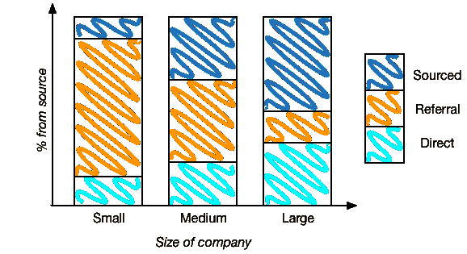

# 找一个你不认识的人。非理性繁荣

> 原文：<https://lethain.com/cold-sourcing/?utm_source=wanqu.co&utm_campaign=Wanqu+Daily&utm_medium=website>

三个最大的候选人来源是来自你现有团队的*推荐*、在你的工作页面上申请的*入境*申请人，以及你主动带入你的漏斗的*来源*候选人。

小公司倾向于依靠推荐，大公司倾向于依靠寻找候选人，使用专门的招聘源，这是他们的全职工作(通常是招聘人员职业生涯的第一步)，中型公司介于这两个极端之间。(Slack 尤其做了一些有趣的工作来鼓励内向申请者，虽然他们现在已经达到了大多数公司更依赖外包和直接申请者的规模，但我怀疑内向申请者不是他们最大的候选人来源。)



雇佣和招聘团队倾向于推荐人，因为他们通常有更高的通过率和接受率，大多数早期公司，尤其是那些没有专门招聘职能的公司，最终主要由推荐人组成。(一个有趣的警告:最近我越来越多地看到第二类推荐候选人，他们正在进行自己极其系统的面试，目的是获得三家或更多公司的聘用，因此接受率往往要低得多。)


推荐有两个主要缺点。

首先，你的个人关系网总是很小，尤其是当你考虑到候选人总数的时候。这在你职业生涯的早期尤其如此，但如果你在一个较小的市场或一系列小公司工作，很容易工作很长时间而没有建立起一个大的个人网络(职业生涯早期在大公司工作的一个附带好处是，除了知名度之外，还可以启动你的个人网络)。

另一个问题是，人们往往有相对统一的网络，这些网络由他们一起上学或一起工作的人组成。通过在这些圈子里招聘，很容易找到一家想法、信念甚至有时看起来都相似的公司。

## 超越你的个人网络

当他们的推荐网络开始枯竭时，或者当他们希望给自己的团队带来更广泛的背景时，许多招聘经理都冻结了，但好消息是有一个简单的答案:冷源。冷源是一种在某些销售中也很常见的技巧，它直接接触到你不认识的人。

如果你性格内向，一开始这可能会是一次非常令人不安的经历，比如“如果他们被我的邮件惹恼了怎么办？如果我在浪费他们的时间呢？”在你脑海中回响。这些都是重要的问题，我们有义务思考如何将自己融入他人的生活。起初，我个人被这种担忧弄得不知所措，但最终我认为这是没有根据的:一个简洁、深思熟虑的讨论工作机会的邀请是一个机会，而不是侵权，尤其是对那些在 LinkedIn 这样的职业社交网站上的人来说。大多数人会忽视你(这很好)，其他人会礼貌地提出异议(也很好)，少数人会真正做出回应(甚至更多)，令人惊讶的是，很多人会忽视你六个月，然后突然提到他们正在开始新的求职:我从未见过有人不友好地回应。

冷源的另一个优点是它非常简单，我将分享我使用的方法，但我认为有大量不同的方法可能更有效。以此为好的起点，跟踪你的结果，然后实验！

## 你的第一份冷源食谱


我对冷源的标准做法是:

1.  *加入 LinkedIn* 。我怀疑这种技术的变体在其他网络(例如 Github)上也能工作，但是挑战在于其他网络上的人通常不会考虑就业机会，而意向会显著提高回复率！(这里一个很好的类比是搜索广告和展示广告，搜索广告的点击率高一个数量级，因为人们实际上是在搜索他们正在广告的东西。)

2.  通过*追随你确实认识的人*来建立你的关系网。添加所有和你一起上学、一起工作、在 Twitter 上交流过的人，等等。在你的社交网络中播种一些你认识的人是很重要的，因为这将增加你的二级社交网络的覆盖范围，也将降低人们将你标记为他们不认识的人的比率(这是作为垃圾邮件发送者受到惩罚的一个因素)。

3.  *耐心点*。如果你最初的网络很小，很可能你会经常被限制。一旦你被限制了(你会得到一条类似“你已经超过了这个月的搜索能力”的消息)，你将不得不等待几天，可能直到下个月，才能取消限制。(或者，你可以注册购买他们的优质产品，这将大大加快这个过程。)你可能需要几周或几个月的努力(每周安排一个小时)才能让你的网络足够大，让你能够不受速度限制地进行多次搜索。有趣的是，事情似乎变得更容易的连接数量大约是 600 个左右。

4.  使用搜索功能识别要与连接的*二级连接。开始时，在你的二级人际网络中按职位、`software engineer`或`engineering manager`搜索，随着你的人际网络扩大，考虑从职位转换到公司。(考虑一下各种[的大公司列表](https://www.comparably.com/blog/best-places-to-work-competition/)来寻找公司进行搜索。)建立广泛的联系！即使是你现在没有联系的人，也可能是以后会联系你的人，或者是几个月后你招聘重点改变时会联系的人。如果你不确定，就去做吧。*

5.  当有人接受你的联系请求时，从他们的个人资料中获取他们的电子邮件地址，然后*给他们发一封简短礼貌的短信*邀请他们喝咖啡或打电话，并与他们分享你的工作描述链接。尝试不同程度的定制。(如果你找不到他们的电子邮件，请确保在他们的“联系人和个人信息”部分点击“显示更多”，并且他们是一级联系人。有些人根本不分享他们的电子邮件，我建议继续前进，或者你可以直接给他们发一条 LinkedIn 信息。)我个人发现，定制没有我想象的那么重要，因为人们大多选择根据他们的情况做出回应，而不是你笔记的质量。(提醒一句，可能会写一些糟糕的笔记，让人们不愿回复。重复你的联络笔记，让其他几个有不同观点的人来审阅你的笔记是一件快速高效的事情。)

    你的外联笔记可以非常简单明了:

    ```
     Hi $THEIR_NAME,

     I'm an engineering manager at $COMPANY, and think you would be a great fit for $ROLE (link to your job description). Would you be willing to grab a coffee or do a phone call to discuss sometime in the next week?

     Best,
     $YOUR_NAME 
    ```

    真的，我觉得可以这么简单！如果这看起来太简单，那么用一些更个性化或者更复杂的东西来进行 A/B 测试。

    值得注意的是，你最终会和一些你现在根本不适合的人联系在一起。没关系。我建议在他们接受你的联系后，非常严格地审查他们的个人资料，并对适合度做出诚实的评估。如果你没有什么，那也没关系，不接触他们也是更好的利用候选人的时间。(然而，我也认为我们倾向于过度过滤那些不太重要的品质！在我看来，尊重候选人的时间是最重要的优化目标。)

6.  安排和享受你的咖啡和聊天，记住，即使你现在不能一起工作的人仍然是你明年或下一份工作可能一起工作的人。尤其是在硅谷，这是一个非常小的网络，与每个人互动，就像他们会提供是否在你的下一份工作中雇用你的反馈(他们很可能！).你对每一个电话或咖啡都有两个目标:弄清楚候选人和角色之间是否有良好的相互适合，如果有，那么试着让他们推进你的过程。我发现对决定推进我们流程的人最有用的三件事是解释为什么我个人对我们正在讨论的公司和角色感到兴奋，解释我们的流程如何从我们当前的聊天到他们收到要约，以及留出充足的时间提问。

7.  每周花一个小时增加更多的联系，跟踪那些已经联系上的人。有时这有点烦人，但这绝对是一种奖励一致性的实践。我发现这是一个可以一起做的好活动！每周召开一次大家聚在一起的会议，讨论你是如何改进你的搜索的，并且让大家克服他们最初对冷漠接触的不适。(值得指出的是，有了像[杠杆](https://www.lever.co/)或[温室](http://www.greenhouse.io/)这样的求职者跟踪系统，这就*容易多了*，如果你公司的其他人已经联系了某个求职者，你就可以在一个地方进行跟踪。让一群来自同一家公司的人在同一时间联系可以描绘出一幅混乱的画面。)

如果你已经通读了这篇文章，并且很有信心这种方法行不通，我同意你的观点:在我尝试之前，我也同样确信这种方法对我来说行不通，这只是浪费时间，但是我已经慢慢改变了看法。同样重要的是要认识到，随着时间的推移，这种*精确的*方法很可能不会表现得很好:尝试一些简单的东西，克服那些阻碍你开始的顾虑，然后尝试不同的方法。

## 这是高杠杆的工作吗？

同样，一个常见的后续问题是，对于工程经理来说，采购是否是一项高杠杆的任务。我认为是这样的:人们更愿意与管理他们的人聊天，而不是与他们在面试过程中经常共事的招聘人员聊天，同样，我认为这是一个有价值的信号，表明经理们非常关心招聘工作，愿意投入个人精力和注意力。

也就是说，如果一个工程经理每周花一个多小时在采购上(不包括跟进聊天，这些会占用更多的时间)，我会谨慎地担心，除了许多与招聘无关的机会之外，还有许多重要的工作要做，如关闭和评估候选人。

总结一下，强有力的招聘组织的一个最明显的标志是招聘和工程职能部门之间紧密的、相互尊重的伙伴关系。花些时间冷源是一个很好的方法，可以让你对招聘者每天面临的挑战产生共鸣，这也是一个向你的合作伙伴学习的绝佳机会！作为工程经理和工程招聘人员之间的合作伙伴，我们每周都举行冷源会议，这是一个学习、建立共鸣，当然还有招聘的好论坛。

* * *

*感谢[史蒂夫](https://twitter.com/sfrench)、 [TR](https://twitter.com/_tr) 和[马尔特](https://twitter.com/malthe)审阅本文的版本。*

<time class="f6 mv4 dib tracked" datetime="2018-01-08T11:03:41-07:00">发表于 2018 年 1 月 8 日。</time>