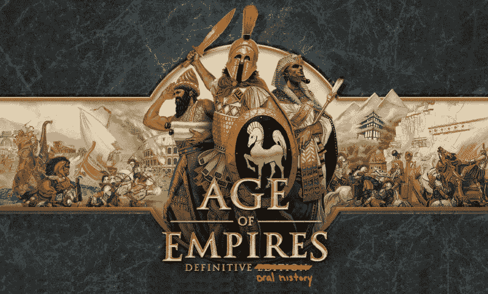

# “我们最不糟糕的想法”——帝国时代的创造

> 原文：<https://arstechnica.com/gaming/2018/01/the-age-of-age-of-empires-as-told-by-the-devs-who-built-it/?utm_source=wanqu.co&utm_campaign=Wanqu+Daily&utm_medium=website>

[Enlarge](https://cdn.arstechnica.net/wp-content/uploads/2018/01/Age-of-Empires_Oral_History.jpg) /

我们享受了

*Age of Empires*

这么多，我们可能也会玩这个版本。

《帝国时代》不是史诗。

在过去的 20 年里，这些跨越时代的游戏已经在 50 多个历史文明中扮演主角，销量超过了 2000 万台，成千上万的核心粉丝每周都花大量时间玩一个或另一个系列游戏。帝国时代是有史以来最有影响力的策略游戏之一。历史通常会让*帝国*变得默默无闻，但它远没有这样，现在它又回到了(玩游戏的)公众意识中。

随着

[a new *Age* game in development](https://www.polygon.com/2017/8/21/16180714/age-of-empires-4-pc-relic-entertainment-definitive-edition)

和一个“

[definitive edition](https://arstechnica.com/gaming/2017/06/age-of-empires-definitive-edition-4k-screenshots/)

“重新启动原版指日可待——而且鉴于

[our recent foray](https://arstechnica.com/gaming/2017/09/build-gather-brawl-repeat-the-history-of-real-time-strategy-games/)

整个即时战略流派的演变——我们认为挖掘历史会很有趣

*this*

RTS 系列。毕竟，RTS 游戏像

*Age *

向数百万易受影响的年轻人展示了...嗯，历史。

我和 24 个左右为最初的《帝国时代》工作的人中的几个谈过它是如何制作的。我让他们思考这个系列的成功、成功、失败和遗产。这是对他们许多故事的压缩复述，侧重于早期——对*时代*故事和每个*时代*游戏如此重要的基础建设——但跨越了整个系列的生命。

*   

     Look, the original *imperial era* . 

    

*   

     The isometric perspective of this series is inspired by the *simulated city* . 

    

*   

     When the Goodman brothers need help to consolidate a game outline At school, they visited an old friend: Bruce Shelley, who was involved in the production of Sid Meier Civilization and Business Simulation, T2 railroad tycoon and T3\. 

    

*   

     In many ways, The original *era* is the evolution of the big RTS predecessors *Red Alert* and *Warcraft II* . But under all the progress, this game is full of equally familiar resource collection, unit micro-management and RTS cycle of expanding your base. 

    

## 人类的黎明

后来成为帝国时代的想法源于托尼·古德曼，他是一家名为 Ensemble Corporation 的 IT 咨询公司的联合创始人。

古德曼喜欢游戏。他和他的哥哥里克从小就热衷于桌游。1994 年的一天，托尼想到微软发布的 WinG(DirectX 的前身)带来了一个巨大的新机遇，于是他萌生了做一个游戏作为副业的想法。他还不知道会是什么——只知道做点什么，看看会不会有什么发展，会很有趣。

“据我回忆，他有一天突然就来了，”里克·古德曼告诉 Ars。托尼对工程团队说:“嘿，你们中有谁愿意编程游戏而不是数据库？”

“我认为房间里有一种奇怪的反应，因为人们不知道如何看待这一点，”里克继续说。“但事实证明他是认真的。”

然后，托尼开始在公司组织一个小型的游戏团队。阴谋集团开始试验建造一个引擎，它的等距视角受到了模拟城市的启发。托尼和程序员安吉洛·劳登用一辆坦克做了一个简单的技术演示。你可以开着它到处跑，拍棕榈树——仅此而已。尽管如此，这个演示还是坚定了他们可以做一个游戏的想法。

现在，团队只需要一个好主意。

为了帮助提出一个可靠的概念，托尼请来了里克和他们的朋友布鲁斯·谢利，他们住在芝加哥，但会定期去达拉斯短暂停留。谢莉是热门游戏《席德·梅尔文明》和商业模拟游戏《T2 铁路大亨》的联合创作者。托尼和他的同伴们是在一个桌游俱乐部认识雪莱的，当时他们还是青少年，还在上学，而雪莱已经上大学了。

接下来的几个月，他们讨论了无数的想法。托尼建议拍摄一部以荒岛为背景的电影，类似于电视剧《迷失 T1》。但是真正让他们思考的想法是另一个程序员 Tim Deen 的建议，改编暴雪的即时战略游戏*魔兽*。

他们看着*魔兽*和西林的*指挥&征服*。当里克建议他们借用这些游戏时，谢莉提出了他过去玩游戏的经验，并建议他们做一种关于*文明的实时游戏。*

"他们点点头，一致认为也许在所有坏主意中，这是我们想到的最不糟糕的主意，"瑞克回忆道。

“我有一个想法，游戏将从几乎被冰覆盖的地图开始，就像一个冰河时代，你有一些定居者，”谢莉说。“随着冰的消退，资源被发掘出来，你可以开始建设，然后从那里开始建设地球上的第一个文明。”

在企业家们完成第一个游戏原型之前，又过了九个月。他们给它起了一个工作名称:人类的黎明。这个游戏有一棵树，一些草，和一个由 2D 等轴网格上的帐篷小屋组成的城镇中心。一个孤独的动画穴居人会砍柴并把它运到镇中心，增加一个资源计数器。也可能有一些鹿跑来跑去，你可以猎取食物。

“对于这么小的原型来说，这似乎是一个令人难以置信的漫长时间，”瑞克说。“但是我们从零开始，我们没有任何真正知道如何制作游戏的人。所以我想从这个意义上来说，我们是在按计划进行。”

一旦这个基本的概念证明被整理出来，注意力就转向了游戏的设计。里克·古德曼在谢莉和他们另一个名叫布赖恩·沙利文的童年好友的帮助下，在这里起了带头作用。