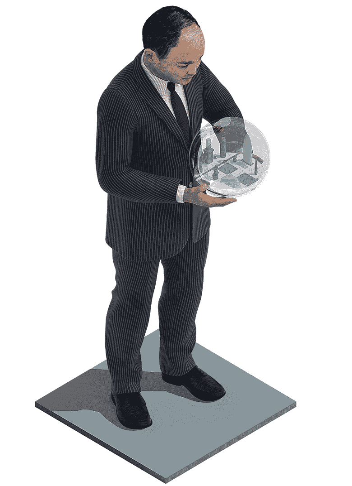

# 1000 亿美元风险资本炸弹|机构投资者

> 原文：<https://www.institutionalinvestor.com/article/b15ywfxthq1f16/the-$100-billion-venture-capital-bomb?utm_source=wanqu.co&utm_campaign=Wanqu+Daily&utm_medium=website>

2016 年 7 月 11 日，伊恩·桑顿(Ian Thornton)在一个月的休假后拿起电话，他认为这是一次例行的叙旧。他在英国度过了艰难的几周，包括该国在 6 月 23 日的公投中令人震惊地决定离开欧盟，导致英镑兑美元汇率跌至 30 年来的低点，投资者难以理解这一结果。时任电脑处理器设计公司 Arm Holdings 首席财务官的克里斯·肯尼迪，即将宣布一个更不可能的消息。Arm 出价收购。

“谁会想买我们？桑顿说:“鉴于我们在行业中的地位，我们认为任何人都很难收购 Arm。Arm 通过授权处理器设计赚钱，处理器是计算机芯片的“大脑”，包括运行世界上 95%智能手机的处理器。Arm 被称为“你从未听说过的最成功的英国科技公司”它发展迅速，并获得了大约 40%的利润。

竞标来自软银集团，这是一家日本电信公司，因在 2014 年公司上市时将 2000 万美元的阿里巴巴股份转化为 600 亿美元而闻名。

软银的创始人孙正义在桑顿的致命电话前一周飞往土耳其海滨度假胜地马尔马里斯，并会见了 Arm 董事长斯图尔特·钱伯斯。Son 主动提出以 243 亿英镑(324 亿美元)现金收购该公司，相当于 Arm 2015 年净利润的 70 倍。他全力以赴促成了软银迄今为止最大的一笔收购——出售大量阿里巴巴和其他有价值的资产，以积累 200 亿美元的现金。那些了解军火交易的人仍然对其速度感到震惊。

“整个过程非常快，”桑顿说。“马萨希望交易尽快完成——我想他是担心有人在他眼皮底下把我们抢走。他说他多年来一直想拥有自己的手臂，现在机会来了。

孙正义——认识他的人都这么称呼他——以几十年而不是几年来思考而闻名。19 岁时，他坐下来写下了自己的人生规划，其中规定，到 60 岁，也就是他现在的年龄，他将开始寻找接班人。(他现在说他还没准备好退居二线。)软银在一份概述未来 30 年的幻灯片中称，他对软银的愿景是未来 300 年，远远超出孙正义的正常生活。

软银和 Arm 否认英国退出欧盟影响了这笔交易。如果这是真的，还有别的原因迫使儿子快速出击。

孙正义有一个愿景，在无数次采访中被勾勒出来:奇点，一个智商超过 1 万的机器人数量将超过人类的时刻。他预测，这将在未来 30 年内发生。他正在集合多个 1000 亿美元的投资工具，通过对处于他愿景前沿的公司进行大规模技术投资来利用这一时刻。在软银收购 Arm 一个月后，孙正义推出了第一只基金——愿景基金。

目前的愿景基金有 970 亿美元，是历史上最大的企业风险投资基金。

软银自己出资 250 亿美元。它不是该基金的最大投资者，但儿子的公司是最大的所有者。沙特阿拉伯 450 亿美元的股份中包括 170 亿美元的股权，并借了 280 亿美元。债务以优先股的形式存在，在该基金的 12 年周期内，其年息为 7%，其他投资回报仅按股权分摊。这笔钱来自沙特阿拉伯公共投资基金，该基金有自己的 2030 年“愿景实现计划”，目标回报率在 4%至 5%之间。

其他支持者包括苹果、高通和夏普，他们被孙正义作为坚决交易者的声誉和软银的回报所折服。在未来五年里，Son 必须每年拿出 200 亿美元(相当于该基金的五分之一)来满足投资者的条件和期望，因为许多人已经认为这个市场被高估了。愿景基金的早期投资——向一系列看似随机的公司注入了超过 1 亿美元的现金，从合作兼房地产公司 WeWork 到互联网卫星公司 OneWEB 再到体育零售商 Fanatics——让一些人怀疑这是不是傻钱。孙正义已经被贴上了“单人泡沫制造者”的标签。

但是，愿景基金的十亿美元造雨有一个方法。它始于 Arm。

* * *

据报道，在 2012 年收购移动运营商 Sprint 之前，孙正义就觊觎这家英国处理器公司。Arm 并没有寻找买家。桑顿说:“但如果有一个对股东和客户都有利的提议，我们必须考虑。”Arm 在监管允许的情况下尽快召开了一次强制性年度股东大会，并向股东提出了软银对 Arm 每股 1700 便士的出价，较 1189 便士的收盘价溢价 43%。与此同时，孙正义呼吁英国政府让交易顺利通过，承诺在五年内将 Arm 的 4000 人全国员工人数增加一倍，并保留现有的管理和商业模式。

他还打电话给出生于奥地利的企业家赫尔曼·豪泽，后者于 1990 年在英国剑桥的 Acorn Technologies 公司创立了 Arm 公司。豪泽曾公开表示，英国最成功的公司之一将在外资收购中失去独立性，这是一种耻辱。“儿子让我放心，他会照顾我最大的孩子，就像他说的那样，”豪泽说。“他还告诉了我他对公司的愿景。”

孙正义向豪泽解释说，一场新的计算浪潮即将到来——豪泽估计，这是继大型机、小型机、工作站、个人电脑和移动设备之后的第六次浪潮。下一波浪潮将使工业制造和消费设备的流程自动化。Son 表示，作为物联网背后的领先处理器制造商，Arm 可以独一无二地利用这一新订单。

“这就是公司，”孙正义在一次电视采访中说。“没有芯片，没有人能在地球上生存——它存在于汽车、冰箱，无处不在。因此，如果芯片是每个人都需要的东西，而一家公司拥有 99%的市场份额，那么肯定存在障碍。他们赚钱不够好。但如果我拥有它，我们可以更好地赚钱。我认为这家公司将会比谷歌更有价值。”

到 9 月 5 日，在法律规定的最短收购时间内，Arm 控股属于软银和孙正义。

* * *

**作为软银的一部分，Arm 重新命名了其商业计划**,以帮助愿景基金实现儿子的梦想。“这在很大程度上是为了推动未来，”桑顿面无表情地告诉我这句话。我们在剑桥 Arm 校园一栋建筑的明亮的美食广场。建筑车辆堵塞了校园周围的道路，努力建造巨大的新办公室，因为软银兑现了将员工人数增加一倍的承诺。

“马萨和他的团队的时间跨度远远超过了我以前的股东。以前是一到两年；他们可以把它记在脑子里。也许有时候我们会想五年后会发生什么。马萨对这种短期主义不感兴趣。十年是他能思考的最短时间单位。它是几十年的垫脚石。”

Arm 已经开始花钱建造一栋多层校园建筑，获得另一栋建筑的许可，并招募下一批 4000 名工程师。“我们需要让我们的技术进入地球上的每一个芯片，”桑顿说。除了占据智能手机 95%的市场份额外，Arm 还占据了全球处理器市场 34%的份额。目前全球有 1100 亿个 Arm 处理器。该公司预测到 2035 年总数将达到 1 万亿。随着应用变得越来越先进，无论是汽车、洗衣机还是无人机，它们都需要更智能的处理器，而内部生产更昂贵。“我们把我们的费用定为自己开发费用的十分之一，”桑顿指出。“因此，当你盯着 100 万美元和 10 年时间来开发自己的处理器时，我们可以说它将从我们这里花费 1000 万美元，你可以立即拥有它。这就是我们在过去 20 年中扩张如此迅速的原因。一个接一个，一个接一个的设计团队，我们将成为这些市场的首选处理器。”

这让 Arm 陷入了一场猫捉老鼠的追逐，在应用程序使用它之前开发下一代处理器。

* * *

沃伦·巴菲特利用铁路数据预测基础设施的结构变化。同样，软银利用 Arm 来投资互联网公司。花旗集团驻东京的信贷分析师 Mitsunobu Tsuruo 说:“Arm 控股公司对未来有着深刻的见解。“当 Arm 与一家新的商业风险企业签订合同，为汽车或农业提供物联网时，Arm 将知道两年后物联网的发展趋势。”反过来，软银在为尚不存在的市场融资方面领先一步。

围绕 Arm 的愿景基金正在形成。2016 年 12 月，当选总统唐纳德·特朗普和孙正义一起出现在特朗普大厦的大厅。“他是工业界的伟人之一，”特朗普告诉聚集在一起的记者。"他刚刚同意在美国投资 500 亿美元，创造 5 万个就业岗位。"一个微笑的儿子举着一张打印纸，上面有两家公司的名字，富士康和软银，举到镜头前。据 Tsuruo 和花旗集团(Citigroup)称，台湾电子公司富士康(Foxconn)计划在北美再投资 70 亿美元，并在软银之外创造 5 万个就业岗位，其中一些在液晶面板和电视组装厂。

分析师表示，软银正在进行垂直整合:富士康制造设备，Arm 提供芯片，软银旗下的 Sprint 和互联网卫星公司 OneWeb 运营设备运行的网络。软银拒绝就本文置评。愿景基金投资组合公司将从这些合作关系中获益。软银坐在中间，将基金中的高增长前景介绍给彼此，以及他们成功所依赖的基础设施。

软银组建了一支优秀的银行家团队来管理该基金的投资部分。自该基金成立以来，招聘的细节就以零敲碎打的方式出现，官员们证实了这一消息。报告显示，大约有 20 名工作人员在伦敦梅菲尔的愿景基金总部工作。愿景基金团队由印度出生的投资银行家拉吉夫·米斯拉(Rajeev Misra)领导。米斯拉最出名的是在金融危机前招募了格雷格·李普曼(Greg Lippmann)等渴求风险的交易员加入德意志银行的衍生品业务。(李普曼后来在《大短剧》中由瑞恩·高斯林扮演。)他让前德意志员工坐满了愿景基金的桌子，包括前自营交易员阿克谢·纳赫塔；前董事总经理 Saleh Romeih 投资银行部前联席主管科林范(Colin Fan)因一段被泄露的内部视频而成名，视频中他告诉年轻员工不要自吹自擂。

然而，该基金投资组合中的公司可能看起来是随机的。Fanatics 是一家运动服装供应商，因其为哈维飓风救灾工作快速周转品牌装备而闻名，它与室内农业初创企业 Plenty 有什么共同点？一件事:数据。

“我们对拼车公司的投资，从优步到 Grab，实际上不是为了把人们从一个地方转移到另一个地方，”愿景基金董事总经理杰弗里·豪森博尔德在 11 月的跨境风险峰会上说。“关键是从中获得的数据，以及如果你拥有这些数据，你可以从事哪些下游业务。”没有数据，计算机无法学习。与人类不同，它们需要数字来进行推断和预测。一旦他们有了它，他们的分析能力将远远超过我们。孙正义曾经告诉一位采访者，“谁统治了芯片，谁就统治了整个世界。谁统治了数据，谁就统治了整个世界。未来的人会这么说。”

但是斯蒂芬·霍金说奇点可能是“我们文明史上最糟糕的事件”埃隆·马斯克警告说，计算机将引发第三次世界大战，人类将不得不与机器融合以保持相关性。

愿景基金模型预测仁慈的数字独裁者。孙正义曾说过，我们的智慧上级不会允许战争。“如果你看看历史上的人类，人们每天都在互相残杀。但是现在我们在日常生活中没有这些。因此，如果机器人比人类更聪明，它会看到战斗不是一种有效的生活方式。和谐更有效率，”孙正义解释道。这是他用自己的智慧得出的深刻的人类结论。但是谁能说得准呢？或许愿景基金正在资助富士康内部的一个左洛复配药调解机器人。

* * *

“物联网”这个术语激怒了伊恩 **桑顿**。“我不喜欢‘事物’这个词，”他说。“如果你用‘东西’来形容任何东西，这告诉我你可能不了解你正在看的市场。”

预示奇点的线索开始出现在愿景基金内部。以人工智能为中心的市场正在医疗保健和自动驾驶汽车领域具体化。今年 5 月，该基金在癌症检测初创公司 Guardant Health 领投了 3.6 亿美元，随后在 8 月份向实验药物许可公司 Roivant Sciences 注入了 11 亿美元。它也在进军智能汽车市场。今年 7 月，软银为开发深度学习算法的汽车科技公司 Nauto 领投了 1.59 亿美元的 B 轮融资。还有一个出价 10 亿美元收购优步股份的方案正在讨论中，软银也表示了对 Lyft 的兴趣。

这 1000 亿美元的浪潮一点也不微妙。Slack 在最近一次由愿景基金(Vision Fund)牵头的融资中获得了 2.5 亿美元，使其工作场所聊天项目的估值达到 51 亿美元，使其成为硅谷市值最高的私营公司之一。NEPC 咨询公司的私人市场研究分析师布拉德利·罗博瑟姆将愿景基金描述为一块丢进水中的巨石。"涟漪仍在所有较小的风险投资池中流动."

罗博瑟姆说，规模较小的基金面临被淘汰出局或不得不支付更多费用才能继续参与的风险。相反，愿景基金可以通过提供流动性来缓解市场压力。软银倾向于投资市场占有率高、估值高的晚期私人公司。一些公司可能已经推迟了首次公开募股，担心像 Snap 和 Blue 围裙那样的估值崩溃。例如，2015 年，私人市场投资者对这家餐包公司的估值为 20 亿美元。在以 APRN 为代码进行了六个月的交易后，这家前独角兽在 2017 年 11 月底的市值为 5.8 亿美元。除了 2016 年的一个季度，蓝色围裙一直是赔钱的业务。与硅谷相比，股票市场对过度发展的初创企业的前景缺乏耐心或乐观。罗博瑟姆的同事蒂姆·麦库斯克将愿景基金视为价值被高估公司现有股东的 1，000 亿美元生命线。“随着许多独角兽延长上市时间，软银的收购可能是一个很好的退出方式。”

NEPC 合伙人麦库斯克并不认为软银正在独自制造泡沫。但是，这种大规模支出行为——结合市场上其他地方的不加选择的定价和兴奋等信号——可能预示着这种行为的开始。“过去两年是对 IPO 枯竭的一次真正重要的现实检验，”他补充道。"这不是一次修正，而是对任何走向泡沫的举措的重置."

软银也发现了这一点。投资一个月后，Roivant 得到了一个毁灭性的消息，它大肆宣传的阿尔茨海默氏症药物 interpirdine 不起作用。消息传出后，股票暴跌了 75%。优步的交易陷入了股价复杂的困境，并受到此前未披露的巨大数据泄露以及随后的掩盖行为的影响。该基金的规模及其投资放大了这些压力。“如果他们没有犯愚蠢的错误，我会非常惊讶，”Arm 的创始人豪泽说。“唯一的区别是，如果他们成功了，那将会大得多。”

豪泽的风险投资公司 Amadeus Capital 已经感受到了愿景基金的影响。它是一家名为 Improbable 的虚拟现实初创公司的早期投资者，该公司在 5 月份通过愿景基金从软银获得了 5.02 亿美元——这是英国公司有史以来最大的一轮融资。“这是一个非常令人兴奋的发展。它给了不可能的机会，”豪泽说。“这是高科技公司拥有的一个新选择，而不是上市。从这个意义上说，这是对金融界的一个可喜贡献。”

由于软银，Arm 不必担心其 40%的利润率预计将在 2017 年减半，2018 年再减半，然后在几年内保持个位数。在快速扩张之后，Arm 将需要两到三年的时间来开发下一波处理器，客户还需要两到三年的时间来围绕 Arm 的设计开发计算机芯片。桑顿说，利润率有可能在未来八年内不会再次增长。“作为一家上市公司，我们不可能做到这一点，”他表示。“想象一下，你对股东说，我们要收购一家盈利的公司，然后把它变成一家完全不赚钱的公司。这是带来未来的部分。现在我们不用那么担心当下了。”

然而，已经有迹象表明，孙正义最终会再次将 Arm 上市，他的目标是获得 2014 年阿里巴巴 IPO 后 600 亿美元的回报。在与彭博的电视采访中，孙正义解释了他如何在 45 分钟内通过承诺巨额回报说服现在的沙特王储向愿景基金投资 450 亿美元。他告诉王储穆罕默德·本·萨勒曼说:“我可以给你一份 1 万亿美元的礼物。”。“你向我的基金投资 1000 亿美元，我给你 1 万亿美元。”

这些回报将取决于愿景基金加速奇点的能力，而许多高管表示，奇点的到来比预期的要慢。到目前为止，在 Arm 和经济学人智库的调查中，不到十分之一的公司表示他们已经以有意义的方式实施了物联网。

“我没有理由相信他们比我们其他人更傻，”豪泽说。“但科技领域真正伟大的成功故事需要很长时间才能成熟。这一行有句俗话:柠檬熟得早。”