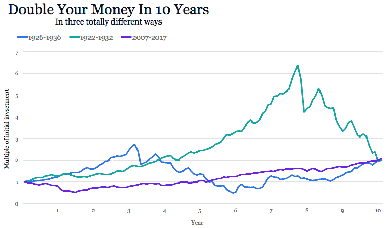
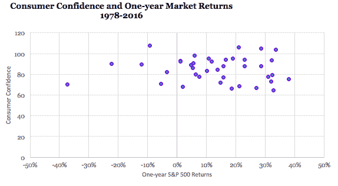
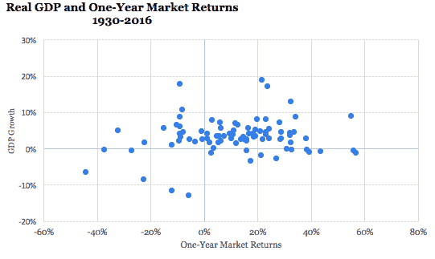
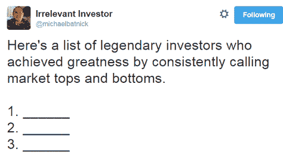

# 不确定性的刺激 Collab 基金

> 原文：<http://www.collaborativefund.com/blog/the-thrill-of-uncertainty/?utm_source=wanqu.co&utm_campaign=Wanqu+Daily&utm_medium=website>

在研究结束时，鸽子每秒钟啄食食物杆多达五次，“长达十五个小时，在整个期间没有超过十五或二十秒的停顿。”

B.F .斯金纳让一只鸽子失去了理智。

哈佛大学心理学家斯金纳研究了激励科学。他通过给成千上万的动物不同的食物奖励来做到这一点。有时，这只动物只需敲击杠杆，每次都会弹出一个食物颗粒。有时它必须学习一种模式——两次杠杆敲击，或一次长敲击，或一次敲击和一次延迟和另一次敲击。鸽子和老鼠非常擅长解决这个问题。

斯金纳研究的一部分是确定什么样的刺激如此强大以至于不能被忽视，导致动物变得痴迷于食物颗粒以外的东西。什么样的激励让一只鸽子失去理智？

他基本上发现了三种类型的激励:

**固定。**轻轻一拍，一粒食物。每次都是一样的结果。动物很快就明白了这一点，但并不为此兴奋。“我就是这样得到食物的。好的。继续前进。”

**变化多端。**如今，你只需轻轻一点就能获得食物。明天要敲两下。第二天，一个敲击的图案。这让动物很兴奋。这是一个刺激的谜题。“哦！我们今天想想怎么弄吃的吧！”

**可变区间。点击控制杆，你将平均每小时获得食物，但这可能意味着下一个小时有五粒食物，然后接下来的五个小时什么也没有。动物在一天中会得到同样数量的食物，但时间是随机的，不可预测的。**这让他们变成了瘾君子。他们失去了理智。**“我知道食物会来的，所以我要继续敲，但是啊，伙计，它什么时候来啊，悬念让我受不了，继续敲该死的杠杆吧。”**

这背后的科学是不同的奖励会产生多少多巴胺。

固定奖励太容易让人兴奋。不断变化的奖励提供了足够的嗡嗡声，让你想出明天的难题。可变间隔奖励使你的大脑充满多巴胺，因为这种高多巴胺是在狩猎和饥荒的地狱般的世界中生存下来的进化所必需的。你知道最终会得到一些重要的东西，但不知道什么时候会得到，这种多巴胺的冲动让你不断追求更多。在斯金纳的研究中，鸽子从可变间隔喂食中获得如此多的嗡嗡声，以至于它们变得强迫性的，完全失去控制。

“你可以从鸽子身上转移到人类身上，”斯金纳曾经说过。“[可变区间]是所有赌博工具的核心。有异曲同工之妙。一只鸽子可以像人一样变成病态赌徒。”

可变间隔奖励是我们强制检查电子邮件的原因。有些消息真的很重要，但是你不知道重要的消息什么时候会到，所以你不停的检查检查。

检查推特和脸书也是一样。

或者看有线新闻。

或者等着无聊的会议结束。

找到吸引人们注意力的东西，把他们变成疯狂的动物，你可能会发现一个可变的间隔奖励。

现在我们来谈谈投资。

*****

过去一个世纪，美国股市的年回报率为 7.5%。这意味着平均每十年你的钱翻了一番。

但是平均很少发生。

在上个世纪，股市在十年内几乎翻倍的情况只出现过三次。这三个时期的回报率几乎相同，一直到基点。但是让你到达那里的道路和情感却有着天壤之别:

继续假设市场平均每十年翻一番。但有时 20 年都没有结果。有时候十年涨了六倍。市场很少每十年翻一番，当它翻一番时，它的轨迹是不均衡和不可预测的混乱。

所以，我们很清楚股票会随着时间的推移而回报我们。但是我们不知道什么时候，或者如何，或者它会让我们忍受什么。

**是可变区间奖励**。这是一种很厉害的药物。

斯金纳研究中的一个常用词是“寻求”。可变中奖的冲动如此强烈，以至于寻找下一个奖励变成了一种足以压倒合理判断的刺激。就像一只鸽子每秒钟啄杠杆五次，持续十五个小时，不知道重要奖励何时到来的自然反应不是耐心。它痴迷地寻找。

这是我们在投资中经常看到的。

股票市场有 24-7 的新闻报道，但咖啡烘焙、足疗和美丽的鲜花却没有，这是有原因的；一个有可变的奖励，其他的有固定的奖励。同样的原因，iPhone 预装了一个股市应用程序，但没有一个预订按摩应用程序。

看看投资者多久检查一次他们的投资组合。

或者他们多久交易一次。

或[预测的恒定需求](https://www.fool.com/investing/general/2015/02/25/the-blind-forecaster.aspx)。

或者崇拜古鲁。

投资的期待来自于知道企业创造价值，但拥有足够有效的市场不会轻易提供回报。市场向你收取回报，他们给你开出困惑和噪音的账单，让你觉得最终的回报是惊人的。

以消费者信心和一年市场回报率之间的相关性为例。不要斜视；它不存在。这让人们疯狂:

或者市场回报和 GDP 增长。同样一片混乱:

知道回报会来是我们有市场大师的原因。但是不知道他们什么时候会来，这就是为什么我们有这个:

你可以在各种形式的投资中看到这种东西。高度的不确定性和不可预测性是市场的入场价格，也是让我们上瘾的药物。

*****

这里有两件事很突出。

你可能对投资的狩猎过程比你需要的更感兴趣。这因你的投资方式而异，但在所有层面都是如此。有太多的证据表明，在各种类型的投资中，总的来说，我们投入了[比必要的更多的努力和智慧。当你理解斯金纳对可变区间奖励的研究时，我们为什么这样做就有意义了。这个游戏的刺激足够强烈，让我们不停地寻找下一个奖励，通常是强迫性的，有时对我们自己有害。这些实验中的一些老鼠沉迷于耗尽体力，疯狂地连续几天不停地等待食物颗粒。他们想要食物来维持生命，但是他们为了得到食物几乎要了自己的命。每个人都认识这样的投资者。让时间发挥作用，谦逊地对待你能控制和不能控制的程度，这两者的结合在几乎所有的投资风格中都至关重要。](/blog/making-history-by-doing-nothing/)

**这不是 Excel 和图表。是多巴胺和皮质醇。**投资很大程度上不是你知道什么，而是你的行为。行为很难教，很难控制，甚至很难接受。这里有一个令人不安的事实:我的最佳猜测是，10%的人天生是投资者，而 10%的人无论受教育程度如何，都无法被教会如何成功投资。另外 80%的人可以通过花更多的精力在如何应对风险和回报上，而不是积极地寻找来提高。巴里·里兹曾经被[问到](http://ritholtz.com/2009/03/monkey-theory-of-investing/)他所学过的最伟大的金融课。“你是一只猴子。一切都归结于此。你是一个稍微聪明，穿裤子的灵长类动物。”

斯金纳的研究引起了轰动，特别是当他将鸽子的行为与人类的倾向相比较时。但是“科学是一种接受事实的意愿，即使事实与愿望相反”他写道。我们对奖励的反应可能比我们任何人想承认的都更尴尬，但承认这一点是我们变得更好的方法。

