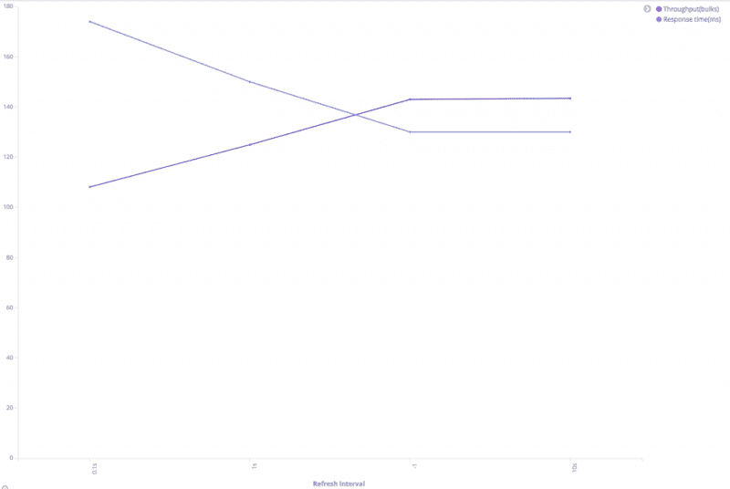
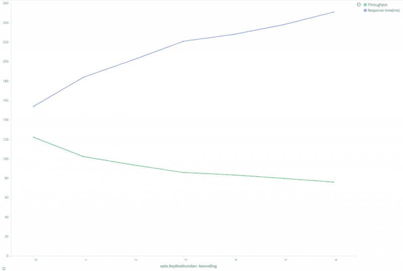
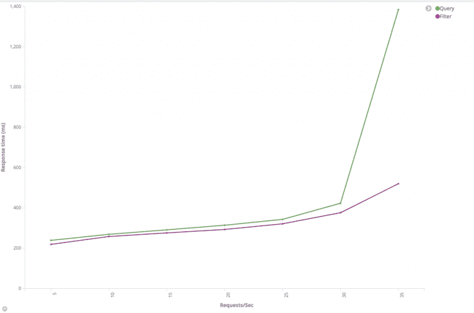
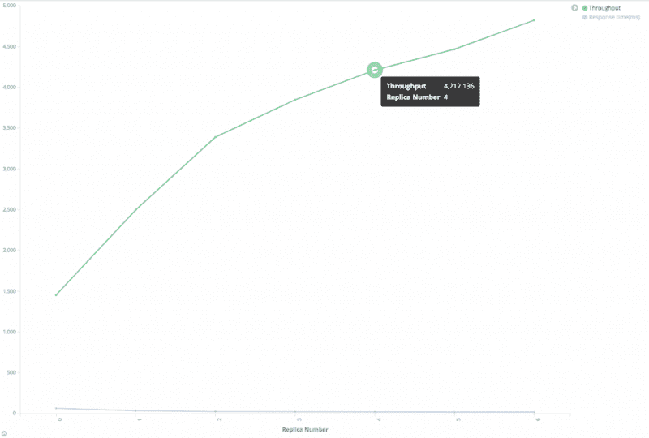
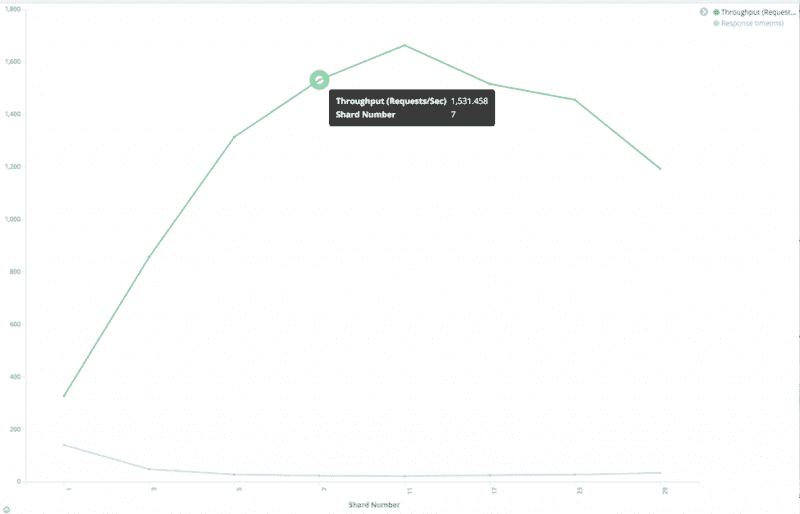
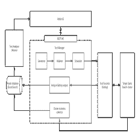
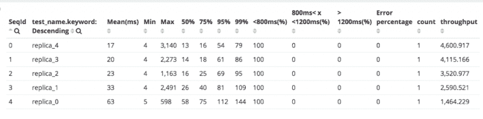

# 易贝大学的弹性研究性能调整实践

> 原文：<https://www.ebayinc.com/stories/blogs/tech/elasticsearch-performance-tuning-practice-at-ebay/?utm_source=wanqu.co&utm_campaign=Wanqu+Daily&utm_medium=website>

Elasticsearch 是一个基于 Apache Lucene 的开源搜索和分析引擎，允许用户近乎实时地存储、搜索和分析数据。Pronto 是一个在易贝托管 Elasticsearch 集群的平台，让易贝的内部客户可以轻松部署、操作和扩展 Elasticsearch，以实现全文搜索、实时分析和日志/事件监控。如今，Pronto 管理着 60 多个 Elasticsearch 集群和 2000 多个节点。每天的摄取量达到 180 亿个文档，每天的搜索请求达到 35 亿个。该平台提供了从资源调配、补救和安全到监控、警报和诊断的全方位价值。

虽然 Elasticsearch 是为快速查询而设计的，但其性能在很大程度上取决于应用程序的场景、索引的数据量以及应用程序和用户查询数据的速度。本文档总结了 Pronto 团队面临的挑战以及为战略性地应对这些挑战而构建的流程和工具。为了便于说明，它还显示了对各种配置进行基准测试的某些结果。

### 挑战

到目前为止，Pronto/Elasticsearch 用例面临的挑战包括:

1.  高吞吐量:有些集群每天接收高达 5TB 的数据，有些集群每天接收超过 4 亿个搜索请求。如果 Elasticsearch 不能及时处理，请求会在上游累积。
2.  低搜索延迟:对于性能关键的集群，尤其是面向站点的系统，低搜索延迟是强制性的，否则用户体验会受到影响。
3.  因为数据或查询是可变的，所以最佳设置总是变化的。没有适用于所有情况的最佳设置。例如，将一个索引分割成更多的片段对于耗时的查询来说是有好处的，但是它可能会损害其他查询的性能。

### 解决方法

为了帮助我们的客户应对这些挑战，Pronto 团队构建了性能测试、调优和监控的战略方法，从用户案例开始，一直延续到整个集群生命周期。

1.  **确定规模**:在新用例上线之前，收集客户提供的信息，如吞吐量、文档大小、文档数量和搜索类型，以估计弹性搜索集群的初始规模。
2.  **优化索引设计**:与客户一起审核索引设计。
3.  **调优索引性能:**根据用户场景调优索引性能和搜索性能。
4.  **调整搜索性能**:使用用户真实数据/查询运行性能测试，使用 Elasticsearch 配置参数的组合比较和分析测试结果。
5.  **运行性能测试**:案例装载后，集群被监控，无论何时数据改变、查询改变或流量增加，用户都可以自由地重新运行性能测试。

#### 胶料

Pronto 团队针对每种类型的机器和每个受支持的 Elasticsearch 版本运行基准测试，以收集性能数据，然后使用这些数据和客户提供的信息来估计集群的初始大小，包括:

*   索引吞吐量
*   文档大小
*   搜索吞吐量
*   查询类型
*   热门索引文档计数
*   自留责任保险
*   响应时间要求
*   SLA 级别

#### 优化索引设计

让我们在开始接收数据和运行查询之前三思。指数代表什么？灵活的官方答案是“具有某种相似特征的文档集合。”所以，下一个问题是“我应该使用哪些特征来对我的数据进行分组？我应该将所有文档放入一个索引还是多个索引？”答案是，这取决于您使用的查询。下面是一些关于如何根据最常用的查询来组织索引的建议。

*   如果您的查询有一个过滤字段并且其值是可枚举的，则将您的数据分割成多个索引。例如，您有大量的全球产品信息被摄取到 Elasticsearch，您的大多数查询都有一个过滤子句“region”，很少有机会运行跨区域查询。可以优化查询体:

```
{
    "query": {
        "bool": {
            "must": {
                "match": {
                    "title": "${title}"
                }
            },
            "filter": {
                "term": {
                    "region": "US"
                }
            }
        }
    }
}

```

在这种情况下，我们可以获得更好的表现，如果指数分为几个较小的指数，如美国，欧洲和其他地区。那么可以从查询中删除筛选子句。如果我们需要运行跨区域查询，我们只需将多个索引或通配符传递给 Elasticsearch。

*   **如果您的查询有一个过滤字段并且其值不可枚举，请使用路由。**我们可以通过使用过滤器字段值作为路由关键字并移除过滤器来将索引分割成多个碎片。

比如 Elasticsearch 摄入的订单有几百万个，大部分查询都需要按买家 ID 查询订单。不可能为每个买家创建一个指数，所以我们不能按买家 ID 将数据分成多个指数。一个合适的解决方案是使用路由将具有相同买家 ID 的所有订单放入同一个碎片中。那么几乎所有的查询都可以在匹配路由键的分片中完成。

*   如果您的查询有日期范围过滤器，请按日期组织数据。这适用于大多数日志记录或监控场景。我们可以按每天、每周或每月组织索引，然后我们可以按指定的日期范围获得索引列表。Elasticsearch 只需要查询更小的数据集，而不是整个数据集。此外，当数据过期时，收缩/删除旧索引会很容易。

*   **显式设置映射。** Elasticsearch 可以动态创建映射，但它可能不适合所有场景。例如，Elasticsearch 5.x 中的默认字符串字段映射是“关键字”和“文本”两种类型。很多场景下都没必要。

*   **如果使用用户定义的 id 或路由对文档进行索引，请避免不平衡的分片。** Elasticsearch 使用随机 ID 生成器和哈希算法来确保文档被均匀地分配到碎片中。当您使用用户定义的 ID 或路由时，ID 或路由关键字可能不够随机，一些碎片可能明显比其他碎片大。在这种情况下，这个碎片上的读/写操作会比其他碎片慢得多。我们可以优化 ID/路由键或者使用[index . routing _ partition _ size](https://www.elastic.co/guide/en/elasticsearch/reference/current/mapping-routing-field.html#routing-index-partition)(在 5.3 和更高版本中可用)。

*   **使碎片均匀分布在节点上。**如果一个节点比其他节点有更多的碎片，它将比其他节点承担更多的负载，并可能成为整个系统的瓶颈。

#### 调整步进性能

对于日志和监控等索引繁重的场景，索引性能是关键指标。这里有一些建议。

*   **使用批量请求**。
*   使用多线程/作品来发送请求。
*   **增加刷新间隔。**每次刷新事件发生时，Elasticsearch 都会创建一个新的 Lucene 段，并在稍后合并它们。增加刷新间隔将降低创建/合并的成本。请注意，在刷新后，文档仅可用于搜索。

[](https://tech.ebayinc.com/assets/Uploads/Picture23.png)

性能和刷新间隔之间的关系

从上图中，我们可以看到，随着刷新间隔的增加，吞吐量增加，响应时间减少。我们可以使用下面的请求来检查我们有多少段，以及在刷新和合并上花费了多少时间。

```
Index/_stats?filter_path= indices.**.refresh,indices.**.segments,indices.**.merges

```

*   **减少复制品数量。** Elasticsearch 需要为每个索引请求将文档写入主碎片和所有副本碎片。显然，大的副本数量会降低索引速度，但另一方面，它会提高搜索性能。我们将在本文的后面讨论它。

[](https://tech.ebayinc.com/assets/Uploads/Picture22.png)

性能和副本数量之间的关系

从上图中，我们可以看到，随着副本数量的增加，吞吐量下降，响应时间增加。

*   如果可能，使用自动生成的 id。elastic search 自动生成的 ID 保证是唯一的，以避免版本查找。如果客户真的需要使用自定义 ID，我们的建议是选择一个对 Lucene 友好的 ID，比如零填充顺序 ID、UUID-1 或纳米时间。这些 id 具有一致的、顺序的模式，可以很好地压缩。相比之下，像 UUID-4 这样的 ID 基本上是随机的，压缩效果很差，降低了 Lucene 的速度。

#### 调整搜索性能

使用 Elasticsearch 的主要原因是支持数据搜索。用户应该能够快速定位他们正在寻找的信息。搜索性能取决于很多因素。

*   如果可能，使用过滤上下文而不是查询上下文。查询子句用于回答“该文档与该子句的匹配程度如何？”过滤子句用于回答“该文档与该子句匹配吗？”Elasticsearch 只需要回答“是”或“否”，它不需要计算过滤子句的相关性得分，过滤结果可以缓存。详见[查询过滤上下文](https://www.elastic.co/guide/en/elasticsearch/reference/current/query-filter-context.html)。

[](https://tech.ebayinc.com/assets/Uploads/Picture24.png)

比较查询和过滤器

*   **增加刷新间隔。**正如我们在[调优索引性能](https://tech.ebayinc.com/engineering/elasticsearch-performance-tuning-practice-at-ebay/?utm_source=wanqu.co&utm_campaign=Wanqu+Daily&utm_medium=website#tune_indexing_performance)一节中提到的，每次刷新时，Elasticsearch 都会创建新的段。增加刷新间隔将有助于减少段数，并降低搜索的 IO 成本。而且，一旦发生刷新和数据更改，缓存将无效。增加刷新间隔可以使 Elasticsearch 更有效地利用缓存。

*   **增加副本数量。** Elasticsearch 可以在主碎片或副本碎片上执行搜索。副本越多，搜索中涉及的节点就越多。

[](https://tech.ebayinc.com/assets/Uploads/Picture25.png)

性能和副本数量之间的关系

从上图可以看出，搜索吞吐量几乎与副本数量成线性关系。注意在这个测试中，测试集群有足够的数据节点来确保每个分片都有一个独占的节点。如果不能满足这个条件，搜索吞吐量就不会那么好。

*   尝试不同的碎片号。“我应该为我的索引设置多少个碎片？”这可能是我们见过的最常见的问题。不幸的是，没有适用于所有场景的正确数字。这完全取决于你的情况。

碎片号太小会使搜索无法扩展。例如，如果碎片号设置为 1，那么索引中的所有文档都将存储在一个碎片中。对于每个搜索，只能涉及一个节点。如果你有许多文件，这是很费时间的。从另一个侧面来说，创建一个包含太多碎片的索引对性能也是有害的，因为 Elasticsearch 需要在所有碎片上运行查询，除非在请求中指定了路由关键字，然后将所有返回的结果提取并合并在一起。

根据我们的经验，如果索引小于 1G，那么将碎片号设置为 1 就可以了。对于大多数场景，我们可以将碎片号保留为默认值 5，但是如果碎片大小超过 30GB，我们应该增加碎片号以将索引分成更多的碎片。一旦创建了索引，就不能更改碎片号，但是我们可以创建一个新的索引，并使用 reindex API 来移动数据。

我们测试了一个包含 1 亿个文档的索引，大小约为 150GB。我们使用了 100 个线程来发送搜索请求。

[](https://tech.ebayinc.com/assets/Uploads/Picture26.png)

性能与碎片数的关系

从上图中，我们可以看到优化的分片数是 11。搜索吞吐量在开始时增加(响应时间减少)，但随着碎片数量的增加而减少(响应时间增加)。

注意，在这个测试中，就像在副本数量测试中一样，每个碎片都有一个独占节点。如果不能满足这个条件，搜索吞吐量就不会像这个图一样好。

在这种情况下，我们建议您尝试小于优化值的分片数，因为如果您使用大的分片数，将需要很多节点，并使每个分片都有一个唯一的数据节点。

*   **节点查询缓存。** [节点查询缓存](https://www.elastic.co/guide/en/elasticsearch/reference/current/query-cache.html)仅缓存过滤器上下文中使用的查询。与查询子句不同，筛选子句是一个“是”或“否”的问题。Elasticsearch 使用了一种位集机制来缓存过滤器结果，这样以后使用相同过滤器的查询将被加速。请注意，只有包含超过 10，000 个文档(或总文档的 3%，以较大者为准)的段才会启用查询缓存。更多详情，请参见[关于缓存的一切](https://www.elastic.co/guide/en/elasticsearch/guide/current/filter-caching.html#_independent_query_caching)。

我们可以使用下面的请求来检查节点查询缓存是否有影响。

```
GET index_name/_stats?filter_path=indices.**.query_cache
{
  "indices": {
    "index_name": {
      "primaries": {
        "query_cache": {
          "memory_size_in_bytes": 46004616,
          "total_count": 1588886,
          "hit_count": 515001,
          "miss_count": 1073885,
          "cache_size": 630,
          "cache_count": 630,
          "evictions": 0
        }
      },
      "total": {
        "query_cache": {
          "memory_size_in_bytes": 46004616,
          "total_count": 1588886,
          "hit_count": 515001,
          "miss_count": 1073885,
          "cache_size": 630,
          "cache_count": 630,
          "evictions": 0
        }
      }
    }
  }
}

```

*   **分片查询缓存。**如果大部分查询是聚合查询，我们应该看看[碎片查询缓存](https://www.elastic.co/guide/en/elasticsearch/reference/current/shard-request-cache.html#_cache_invalidation)，它可以缓存聚合结果，这样 Elasticsearch 就会以很小的代价直接服务于请求。有几件事需要注意:
    *   设置“大小”:0。分片查询缓存只缓存聚集结果和建议。它不缓存命中，所以如果你设置大小为非零，你不能受益于缓存。
    *   有效负载 JSON 必须相同。shard 查询缓存使用 JSON 主体作为缓存键，因此您需要确保 JSON 主体不会改变，并确保 JSON 主体中的键顺序相同。
    *   约好你的约会时间。不要在查询中直接使用 Date.now 这样的变量。绕过去。否则，每个请求都会有不同的有效负载体，这使得缓存总是无效的。我们建议您将约会时间四舍五入为小时或天，以便更有效地利用缓存。

我们可以使用下面的请求来检查 shard 查询缓存是否有效果。

```
GET index_name/_stats?filter_path=indices.**.request_cache
{
  "indices": {
    "index_name": {
      "primaries": {
        "request_cache": {
          "memory_size_in_bytes": 0,
          "evictions": 0,
          "hit_count": 541,
          "miss_count": 514098
        }
      },
      "total": {
        "request_cache": {
          "memory_size_in_bytes": 0,
          "evictions": 0,
          "hit_count": 982,
          "miss_count": 947321
        }
      }
    }
  }
}
```

*   仅检索必要的字段。如果您的文档很大，并且您只需要几个字段，使用 [stored_fields](https://www.elastic.co/guide/en/elasticsearch/reference/current/search-request-stored-fields.html) 来检索您需要的字段，而不是所有字段。

*   避免搜索停用词。像“a”和“the”这样的停用词可能会导致查询命中结果数激增。想象一下，你有一百万个文档。搜索“fox”可能会返回几十个结果，但是搜索“the fox”可能会返回索引中的所有文档，因为“the”几乎出现在所有文档中。Elasticsearch 需要对所有命中结果进行评分和排序，因此像“狐狸”这样的查询会降低整个系统的速度。您可以使用停止标记过滤器来删除停止词，或者使用“and”运算符将查询从“the fox”更改为“the AND fox ”,以获得更精确的命中结果。

如果有些词在索引中经常使用，但不在默认的停用词列表中，您可以使用[截止频率](https://www.elastic.co/guide/en/elasticsearch/reference/current/query-dsl-match-query.html#query-dsl-match-query-cutoff)来动态处理它们。

*   **如果不在乎文档返回的顺序，就按 _doc 排序。** Elasticsearch 默认使用“_score”字段按分数排序。如果不在乎顺序，可以用“sort”:“_ doc”让 Elasticsearch 按索引顺序返回命中结果。

*   **避免使用脚本查询来计算运行中的命中。索引时存储计算字段。**例如，我们有一个包含大量用户信息的索引，我们需要查询编号以“1234”开头的所有用户您可能希望运行类似“source”的脚本查询:“doc[' num ']. value . starts with(' 1234 ')。”这个查询非常消耗资源，会降低整个系统的速度。考虑在索引时添加一个名为“num_prefix”的字段。那么我们只需查询“姓名前缀”:“1234。”

### 运行性能测试

对于每一个变更，都有必要运行性能测试来验证变更是否适用。因为 Elasticsearch 是一个 restful 服务，所以您可以使用像 Rally、Apache Jmeter 和 Gatling 这样的工具来运行性能测试。因为 Pronto 团队需要在每种类型的机器和 Elasticsearch 版本上运行大量的基准测试，并且我们需要在许多 Elasticsearch 集群上运行 Elasticsearch 配置参数组合的性能测试，所以这些工具不能满足我们的要求。

Pronto 团队基于 [Gatling](https://gatling.io "gatling.io") 构建了一个在线性能分析服务，帮助客户和我们进行性能测试和回归。该服务提供的功能使我们能够:

1.  轻松添加/编辑测试。用户可以根据用户输入的查询或文档结构生成测试，无需 Gatling 或 Scala 知识。
2.  在没有人工参与的情况下，按顺序运行多个测试。它可以在每次测试之前/之后检查状态并更改 Elasticsearch 设置。
3.  帮助用户比较和分析测试结果分析。测试期间的测试结果和集群统计数据是持久的，可以通过预定义的 Kibana 可视化进行分析。
4.  从命令行或 web 用户界面运行测试。Rest API 也被提供用于与其他系统的集成。

这是建筑。

[](https://tech.ebayinc.com/assets/Uploads/Picture27.png)

性能测试服务架构(单击放大图表)

用户可以查看每次测试的 Gatling 报告，并查看 Kibana 预定义的可视化，以进行进一步的分析和比较，如下所示。

[](https://tech.ebayinc.com/assets/Uploads/Picture28.png)

加特林报告

加特林报告

[](https://tech.ebayinc.com/assets/Uploads/Picture29.png)

加特林报告

### 摘要

本文总结了索引/碎片/副本设计，以及在设计 Elasticsearch 集群时应该考虑的一些其他配置，以满足对接收和搜索性能的高期望。它还说明了 Pronto 如何战略性地帮助客户进行初始规模调整、索引设计和调优以及性能测试。截至今天，Pronto 团队已经帮助许多客户，包括订单管理系统(OMS)和搜索引擎优化(SEO)，实现了他们苛刻的性能目标，从而为易贝的关键业务做出了贡献。

Elasticsearch 的性能取决于很多因素，包括文档结构、文档大小、索引设置/映射、请求率、数据集大小、查询命中数等等。一个场景的建议不一定适用于另一个场景。彻底测试性能、收集遥测数据、根据您的工作负载调整配置以及优化集群以满足您的性能要求非常重要。

编者按:本文的[中文版](http://www.infoq.com/cn/articles/elasticsearch-performance-tuning-practice-at-ebay "Chinese version of this article")发布在 InfoQ 上。