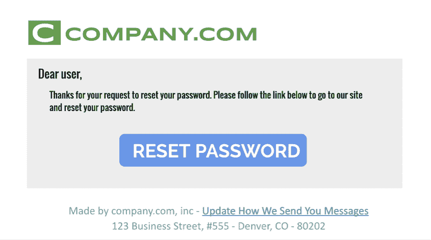

# 您是否应该在您的交易电子邮件中包含退订链接？-发送网格

> 原文：<https://sendgrid.com/blog/should-you-include-an-unsubscribe-link-in-transactional-email-messages/?utm_source=wanqu.co&utm_campaign=Wanqu+Daily&utm_medium=website>

正如我们在上一篇文章中看到的， *[是什么让一封电子邮件具有交易性或促销性？](https://sendgrid.com/blog/what-makes-an-email-message-transactional-or-promotional/)，*邮箱提供商(如 Gmail 和雅虎)可能会以完全不同的方式查看和发送这两种类型的邮件。

发送者必须诚实地说明他们的内容将被归入哪种类型的消息，这种诚实反映的一部分还与发送者是否包括取消订阅链接有关。在这篇文章中，我将分享如何在你的邮件中加入退订链接的建议。

## 分解取消订阅链接的目的

首先，我们来看看退订功能的功能和用途。不管一些营销人员怎么想，取消订阅链接并不意味着惩罚发送者，也不应该被视为与收件人将邮件标记为“垃圾邮件”相同*这是一个旨在充当接收者和发送者之间的通信的功能*。它只是说，“我以前对你的品牌感兴趣，但不再希望收到信息。”那么什么样的消息应该包含这个选项呢？

我相信一条真正的交易信息不应该有和一条真正的促销信息完全一样的退订链接。这是因为用户正在寻找与真正的事务性消息不同的通信类型。例如，密码重置消息有一个取消订阅选项看起来很奇怪，因为用户不希望“永远不再收到密码重置消息”(这实际上就是点击那个链接会说的话。)如果用户无法登录，他们希望将来能够解决这个问题，对吗？

我理解营销人员想要通融并在他们发送的每条信息中给出这种选择的愿望。然而，我建议在交易信息中包含一个[电子邮件偏好](https://sendgrid.com/blog/need-email-preference-center/)链接:

<noscript>T3】</noscript>

并为促销信息留下“退订”链接。

<noscript>T3】</noscript>

通过这种方式，你仍然允许用户反馈他们想从发件人那里得到什么信息，但只是以一种更有针对性的方式。

## 将你的交易声誉和促销声誉分开

发件人还需要检查他们的促销和交易消息，以查看这些消息的任何内容如何相互反映。重要的是要记住，邮箱提供商总是希望保护他们的收件箱用户，并会寻找指示符来告诉他们在哪里放置邮件(垃圾邮件或收件箱)。

因此，在这两种类型的消息中使用标准的退订链接(甚至是你的脸书/Twitter 页面图标后面的链接)可能会使其中一个的声誉影响到另一个。这不仅仅是因为将用户推向你的社交媒体看起来像是“促销”你的“company.com/twitter”位置也有可能被指纹识别为“促销”此外，您不希望留下指纹的声誉影响您的事务性消息传递。有像 [SendGrid 的 link branding](https://sendgrid.com/docs/ui/account-and-settings/how-to-set-up-link-branding/) 这样的工具可以让你定义哪些消息包含哪些链接。这允许发送者定义在他们发送的每条消息中将出现(并因此被判断)的确切链接。

当考虑在每种类型的信息中包含什么内容时，记住要诚实和有目的。诚实地说明邮箱提供商将如何看待您的邮件。此外，请确保始终注意包含哪些元素，以及这些元素如何影响用户体验、声誉和每条内容的交付。

*如果你对更多的邮件送达技巧和诀窍感兴趣，请查看我们的 [2019 年邮件送达指南](https://sendgrid.com/marketing/guide-2019-deliverability-guide/?mc=Blog&mcd=InLine)。*