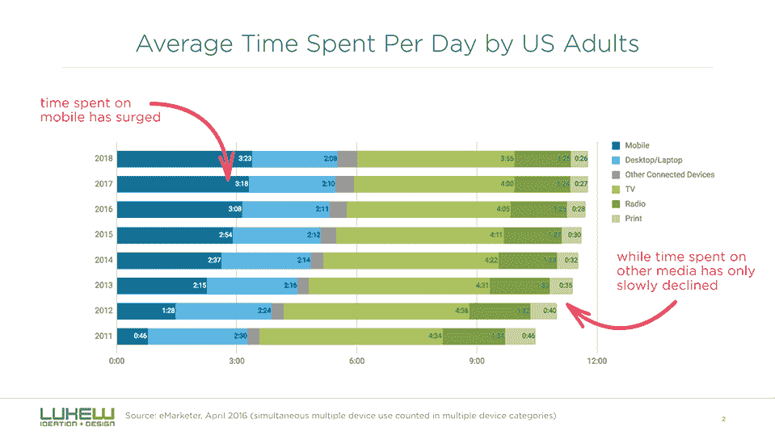
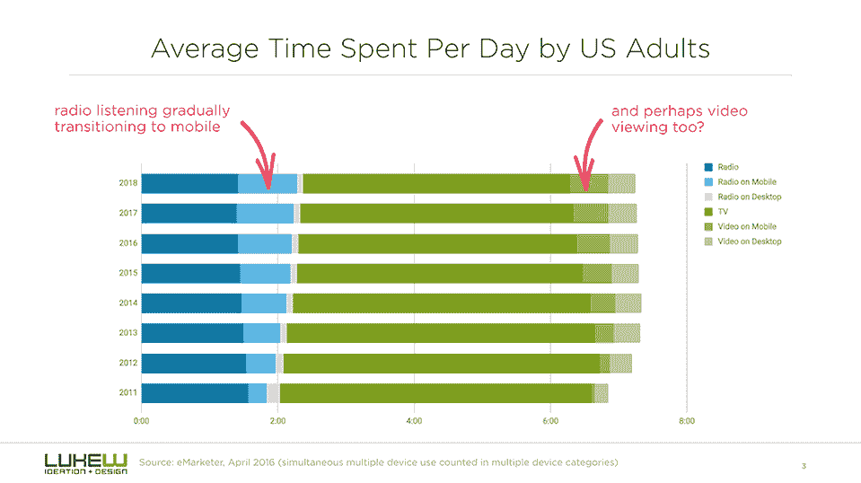
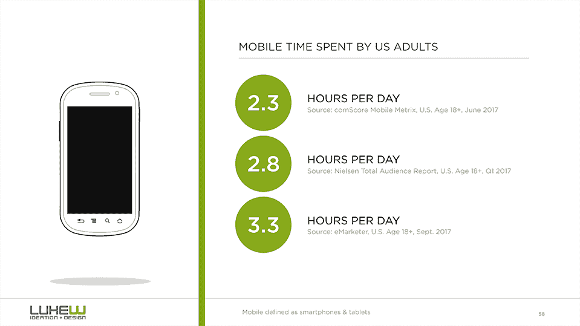

# 改变花费的时间

> 原文：<https://www.lukew.com/ff/entry.asp?1987>

在就电视和台式机/笔记本电脑的未来进行了几次对话后，我决定研究一下人们的屏幕时间是如何变化的。为此，我收集了几年前美国成年人(18 岁以上)不同来源的数据。

T3】

虽然花在手机上的时间大幅增加，但这种影响主要是累加的。也就是说，它在美国创造了比电视和广播等其他媒体更多的屏幕时间。

T3】

看看另一个数据来源，在这种情况下，尼尔森过去四年的观众总数报告，似乎讲述了同样的故事。

T3】

也就是说，随着时间的推移，听广播和看视频等活动似乎正在逐渐转移到移动设备上(绝大多数是在智能手机上)。

T3】

当你考虑到美国成年人每天花大约 3 个小时在他们的移动设备上时，这是有道理的。

