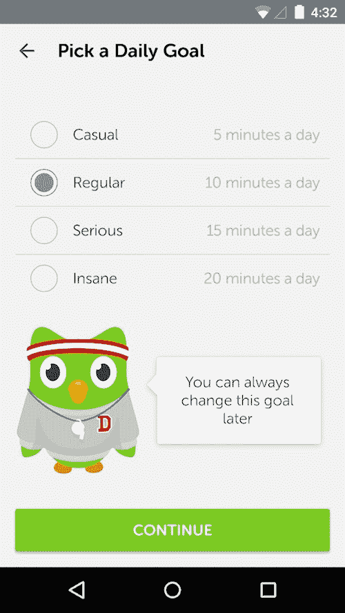
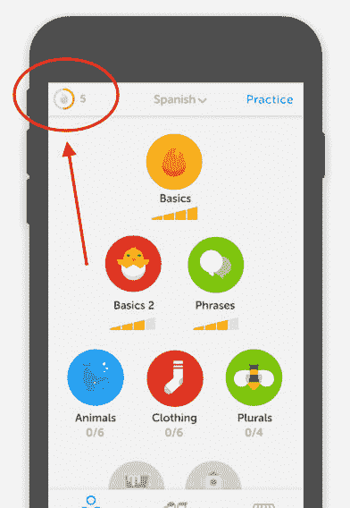
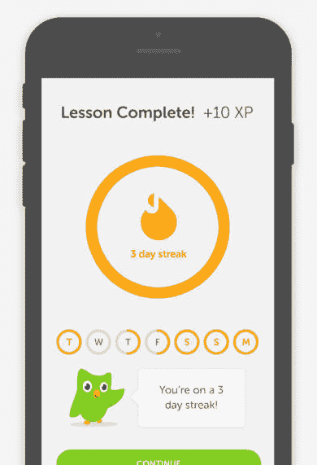
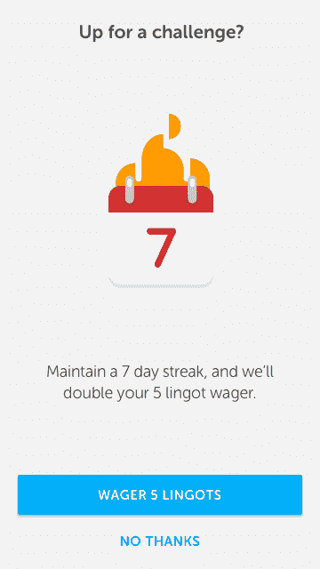
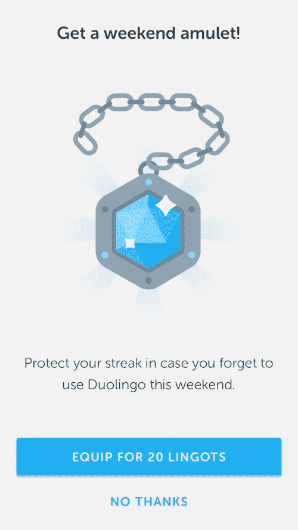

# Duolingo 使用六种 A/B 测试来探究习惯形成行为

> 原文：<https://www.econsultancy.com/blog/69549-six-a-b-tests-used-by-duolingo-to-tap-into-habit-forming-behaviour?utm_source=wanqu.co&utm_campaign=Wanqu+Daily&utm_medium=website>

一点点背景知识(然后我们会在文章后面谈到 A/B 测试):

*   Duolingo 有 25 种语言可供选择，不久将增加普通话。
*   它拥有超过 2 亿用户，可以说是下载量最大的教育应用。
*   Duolingo 的使命是在全球范围内提供免费的语言教育(该应用程序对所有人都是免费的)。
*   该公司现在拥有数十亿个数据点(每月完成 60 亿堂课)，并且在不断迭代。

### 激励学习者的四种方法

Duolingo 面临的最大挑战是保持用户的积极性。不仅自学很难，而且网上学习会带来额外的分心。吉拉尼说，MOOCs(大规模开放在线课程)的完成率非常低，大约只有 1%或 2%。

为了克服这一挑战，Duolingo 正在向游戏世界学习，吉拉尼提到了四种设计日常习惯的方法:

*   小而具体的目标
*   明显的进步
*   外部触发因素(让他们回来)
*   用户投资

熟悉 Duolingo 的人会知道，该应用程序内置了一些具体的小目标，用户必须完成一个单元才能解锁下一个单元。Zilani 将健身比作——提高你的健康水平是“一个模糊不清的目标，但是每天跑一英里非常简单。”

### 条纹符合所有四个标准

Zilani 和 Duolingo 想要专注于 streak 的力量，这是一个强大的游戏机制，满足所有四个习惯形成标准。人们可以看到 Snapchat、脸书和 Headspace 等应用程序提醒用户，并奖励他们连续几天的活动。

因此，在 Duolingo 上，用户被鼓励设定一个每日目标，保证每天使用该应用程序，随着你连续完成每一天，你将延续你的连胜纪录。

用户对继续他们的连胜非常有意识，以至于吉拉尼甚至展示了一封用户发给 Duolingo 总部的电子邮件，解释他们如何在飓风 Irma 期间失去互联网连接(以及他们的连胜)，并询问他们是否可以恢复他们的连胜。

### A/B 测试# 1–可见的进步

用户需要看到他们的进度，而条纹在 Duolingo 应用中并不总是那么明显。因此，该团队做了一个测试，在应用程序的顶部一直显示连续天数，以便在任何给定的日期，人们都知道连续天数是多少。

结果令人印象深刻。日活跃用户增加 3%(DAU)，14 天留存率增加 1%(D14，14 天后仍在使用该应用的用户)。从长远来看，这种增长会产生很大的影响。

### 测试 2–强调条纹

接下来，强调每节课后的连胜。用户开始看到下图所示的火环。

**结果:**DAU 增长 1%，D14 增长 3%。

### 测试# 3–外部触发器

Zilani 说，电子邮件和应用程序通知等外部触发因素会让人感觉像垃圾邮件，但条纹会让它们看起来不那么垃圾。连续事件为外部触发提供了一个有效的理由，因此 Duolingo 可以说“记住你正在连续 24 天”，而不是简单地说“来使用我们的应用程序”。

在这项测试中，该团队通过在用户在应用程序中上完最后一课后的不同时间点发送这些外部触发器来进行实验。

结果显示，在最后一节课后 23.5 小时发送的电子邮件在鼓励再次参与方面效果最好。这并不奇怪，正如 Zilani 指出的那样，每天在同一时间做某事最有可能形成习惯。

Duolingo 的外部触发器的一个有趣的部分是它在五天不活动后使用“被动-主动通知”。这种语气非常符合品牌的娱乐性质，信息开头是:“这些提醒似乎不起作用……”

### 测试# 4–用户投资

Duolingo 有一种虚拟货币 lingot，用户可以用它购买 streak freeze(允许不活动而不破坏 streak)等商品。

该团队测试的事情之一是连胜打赌，用户打赌他们将达到特定长度的连胜。以前嵌套在应用程序中，这个功能出现了(特别是每周显示一次的七天赌注)。

**结果:**D14 增长 5%，IAP(应用内购买收入)增长 600%。

应该指出的是，Duolingo 一直是免费使用的，但用户现在可以在应用内付费订阅，允许离线使用(这可能对保持连胜至关重要)，并从界面上删除广告。

吉拉尼提到，这一测试也尝试了两天的连续下注，但 D14 和 DAU 的涨幅太小，所以被放弃了。

### 测试 5——为脆弱时刻设计

根据吉拉尼的说法，Duolingo 的用户在周末减少了 9%。通常，这是许多用户失去好运的时候。连败会让人非常沮丧。

那么，如果用户可以跳过一天，保持他们的连胜纪录呢？这就是周末护身符允许你做的事情，它可以装备 20 个 lingots，Duolingo 的虚拟货币。

让用户说“你不必在周末玩”再次对应用程序的使用产生了很大的影响。

**结果:**D14 增长了 4%，用户失去连胜的可能性降低了 5%。

### 测试# 6–创造多种获胜方式

不仅仅是条纹让用户保持参与。Duolingo 还加入了成就徽章。正如吉拉尼所言，这些很难做对，“通常这些实施得很差——在糟糕的游戏化叙事中，成就是坏人，但如果做对了，它们会产生积极的影响。”

Duolingo 徽章是永久性的(不同于条纹),并且是多种多样的，可用于多种用途，例如邀请朋友、在早上 8 点前登录等。徽章也是可以完成的，不像条纹——吉拉尼甚至用了一句话“要把它们都抓起来”。

对成就的第一个测试是祝贺加入 Duolingo 的用户。结果令人失望——0%的 DAU 人，0%的 D14 人，0%的其他人。

吉拉尼说，他们忘记了测试必须是可行的。报名还不足以成为一项成就。吉拉尼补充说:“用户必须看到他们已经取得的成就，当他们开始取得成就时，欲望就会产生。”

测试更多不同的徽章成就确实产生了影响。他们发现 DAU 增长了 2%，D14 增长了 2%，应用内购买增长了 5%。

这一成功是通过向徽章添加层级而实现的。例如，用户可以因为一次完美的测试获得一个徽章，但是五次完美的测试，10 次，等等。分层徽章进一步改善了结果——DAU 和 D14 分别增长了 1%和 1%。

### 一个自我感觉良好的结尾

吉拉尼最后对代表们发表讲话，告诉他们产品设计师能够让更多的人走得更远，了解更多。艾迪尔森是 Duolingo 的成功故事之一，他是一名哥伦比亚保安，通过 Duolingo 自学了多种语言，最近在一所保安学院找到了一份教英语的新工作。

那么，你能在你的应用和服务中进行什么样的 A/B 测试来留住顾客呢？

***更多关于游戏化:***