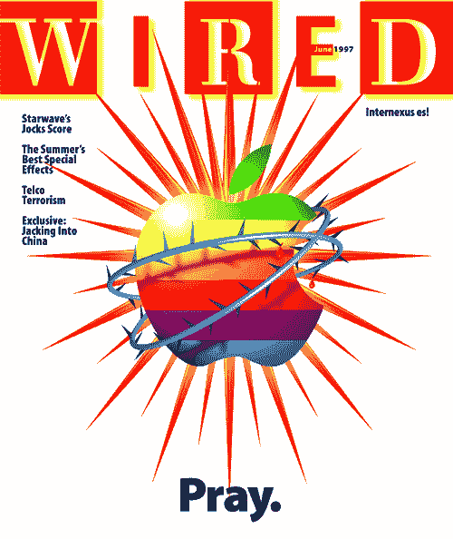
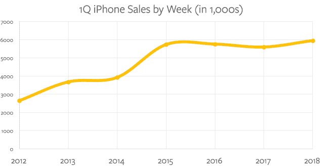

# 苹果的中年——本·汤普森的战略

> 原文：<https://stratechery.com/2018/apples-middle-age/?utm_source=wanqu.co&utm_campaign=Wanqu+Daily&utm_medium=website>

恕我直言，我们家昨天买了一些家具，还不错。我们要搬家了，我希望这是我们最后一次搬家了。鉴于我的个人经历，这说明了一些问题。

根据我的计算，这将是我大学毕业后的第 12 套公寓，投资宜家以外的任何东西都没有多大意义。当然，这个数字有点极端，但从我的角度来看，愿意四处迁移带来的可选性是值得打包的；现在，我的孩子在上学，我的职业生涯也完蛋了——至少目前是这样——能在一两年多的时间里呆在原地是一种解脱。

换句话说，我正步入中年，随之而来的是环境和优先事项的变化。

#### Windows 上的 iPod

苹果公司，至少从人的角度来看，已经正式开始走下坡路了:该公司的 40 岁生日是在去年 4 月。然而，事实上，第一代苹果在 1997 年随着史蒂夫·乔布斯的回归而死亡并重生，当时该公司距离破产只有几周时间。

The cover of the June, 1997 edition of Wired

接下来发生的事情对阅读本文的每个人来说肯定都很熟悉:在削减产品并将公司重新聚焦于大幅简化的产品线后，乔布斯领导了 iMac 的推出，并在三年后推出了 iPod。然而，也许没有什么决定比发布 iTunes 更重要了，iTunes 是 iPod 硬件之阳，软件之阴。前苹果分析师吉恩·蒙斯特告诉《旧金山纪事报》:

> 美国 Piper Jaffray 银行高级研究分析师吉恩·蒙斯特说，对苹果来说，Windows 版 iTunes 是战略“非常缓慢但真实的转变”的一部分。“他们尝试了各种方法来扩大客户群，但就是不扩大。未来几年，你将会看到一个不同的苹果。”具有讽刺意味的是，明斯特说，iTunes for Windows 最终可能会帮助销售更多的 iPods，但较少的 Macintoshes，因为它在 PC 上运行得足够好。

事实上，恰恰相反——至少从长期来看是这样。iPod 像火箭一样起飞，统治着便携式音乐行业，直到被智能手机，特别是 iPhone 杀死。随着时间的推移，越来越多满意的 iPod 和 iPhone 用户开始考虑 MAC 电脑；多年来，几乎每个季度 macOS 设备的增长都超过了整体市场(正在萎缩)。

不过，这是一个次要的故事:虽然 iPod 和最初几版 iPhone 需要一台 PC，但后者最终独立了，成为一台完全独立的电脑。事实上，大多数消费电子设备现在都假设客户有一部智能手机，这是有道理的:几乎每个拥有 PC 的人都有一部智能手机，但大约有 10 亿人的口袋里只有这部手机。

而且，到了周五，至少会有一款突出的设备出售，它不仅需要智能手机，还特别需要 iOS 设备:HomePod。

#### HomePod 战略

围绕 HomePod 的策略，至少在我看来，远比设备本身更吸引人；虽然它听起来确实很棒(至少在我听到它的[受控新闻发布会](https://stratechery.com/2017/apples-strengths-and-weaknesses/)上)，但我有一个 Echo Dot(就此而言，还有一个谷歌家用控制的 Chromecast)连接到我的客厅立体声音响，听起来更好。

然而，要获得完整的音乐库，需要单独的音乐订阅——就我而言就是 Spotify。虽然我是那种(为音乐行业)赚钱的傻瓜，会为同样的服务付费两次，但大多数人只订阅一种音乐服务。对于 iPhone 用户来说，这可能是哪种服务？不出所料，鉴于苹果音乐在设备上的突出地位以及苹果客户的忠诚度，答案是，至少在美国，越来越多的苹果音乐。来自[华尔街日报](https://www.wsj.com/articles/apple-music-on-track-to-overtake-spotify-in-u-s-subscribers-1517745720):

> 据熟悉苹果公司(Apple Inc .)和瑞典乐公司(Swedish)报告的数据的唱片行业人士称，苹果公司(apple Inc .)于 2015 年 6 月推出的流媒体音乐服务在美国的用户增长速度快于其老牌竞争对手——月增长率分别为 5%和 2%。假设这个片段继续下去，苹果将在今年夏天超过 Spotify 成为世界上最大的音乐市场。苹果的音乐流媒体服务一直在悄悄地取得进展，部分原因是该公司设备的受欢迎程度:苹果音乐预装在该公司销售的所有 iPhones、苹果手表和其他硬件上。

最后一句解释了为什么这并不令人惊讶；当苹果音乐推出时，我对它的批评不是关于这项服务是否会成功，而是它是否值得麻烦，特别是在关注方面。那年晚些时候，我在[每日更新](https://stratechery.com/2015/craig-federighi-on-swift/)中写道:

> [泰勒·斯威夫特独家新闻]的一个有趣的角度是，苹果音乐为安卓系统而存在的事实可能会使它比苹果特有的服务更容易被斯威夫特接受。但是，这就引出了一个自然的问题:无论苹果向 Swift 支付了多少钱，或者从整个 Apple Music 中获得了什么样的最终利益？我知道你们中的许多人都厌倦了我问这个问题，事实上，我自己也是苹果音乐的订户:我发现当我的车后座上坐着两个热爱音乐的孩子开车时，与苹果手表的集成特别有用。相反，我的问题是关于机会成本:为什么苹果不能设计他们的平台，以便其他服务可以履行这个低利润的中间人角色，释放资源专注于只有苹果可以做的事情？

HomePod 是迄今为止最好的答案，我不得不承认，我对苹果的远见卓识印象深刻。

#### 苹果音乐桥

还有一个更重要的背景:从 2016 年 1 月的 [1Q 2016 年收益电话会议](http://seekingalpha.com/article/3836826-apples-aapl-ceo-tim-cook-q1-2016-results-earnings-call-transcript?part=single)开始，首席执行官蒂姆·库克和首席财务官卢卡·马埃斯特里两年来一直在推动苹果是一家服务公司的说法。那时，iPhone 的年增长率几乎没有变化(接下来的三个季度会下降)，这有点像是一种转移；毕竟，该公司并没有改变其商业模式。我当时写的是:

> 正如我无数次写的那样，服务(横向)和硬件(纵向)公司有非常不同的战略重点:前者应该最大化他们的目标市场(比如，通过制造更便宜的 iPhone)，而后者应该最大化他们的差异化。而且，库克的回答清楚地表明了苹果的重点仍然是什么:
> 
> > 我们的战略始终是制造最好的产品……我们产品线的高端产品是 6s 和 6s Plus。我们还有一个中价位，有 iPhone 6 和 iPhone 6 Plus。我们继续在市场上提供 iPhone 5s，它继续做得很好。因此，我们提供所有这些，我不认为我们会偏离这一方针。
> 
> 明确地说，我认为这对苹果来说是完全正确的做法……但让我们诚实地说:这意味着苹果不是一家服务公司；他们有一个不错的服务收入流，但现在和可预见的未来，该公司的判断是正确的，基于其硬件的性能。

我仍然认为这是正确的战略分析——苹果的服务区分了它的硬件，而不是它现有的推动苹果服务的硬件——但这是错误的财务分析:苹果的服务可能是苹果设备独有的， [2](#fn2-3033 "Except for Apple Music on Android") 但苹果的安装基数如此之大——根据[周四在 1Q 举行的 2018 年收益电话会议](https://seekingalpha.com/article/4142447-apples-aapl-ceo-tim-cook-q1-2018-results-earnings-call-transcript?part=single)，13 亿台设备——服务收入将不可避免地随着用户基数在数量和使用方面的增长而增长，这确实很有意义(850 万美元)

然而，无论苹果音乐的增长速度有多快，它在财务上的意义都没有那么大:每月 10 美元的 3600 万部音乐，一个季度的收入刚刚超过 10 亿美元(可能会更少，因为用户数量包括了有家庭计划的人)；更重要的是，实际利润很可能是负的，因为绝大部分收入都流向了唱片公司和出版商(相比之下，Spotify 据报道是亏损的)。这根本不是服务金融故事的一部分(首先是应用商店，其次是[谷歌搜索支付](https://stratechery.com/2017/apples-earnings-forecasting-the-iphone-x-rising-asp-and-services/))。

然而，HomePod 展示的是，苹果音乐是战略故事的一部分。请记住，从战略上讲，服务的目的是让硬件与众不同。为此，HomePod 并不是苹果设备的专属，来支撑苹果音乐；确切地说，Apple Music 是 HomePod 独家销售的扬声器。 [3](#fn3-3033 "Sonos does not count! You can’t use voice. In usage it is no different than using another smart speaker via Bluetooth") 大多数评论都假定:

1.  客户想要 HomePod
2.  因此，客户订阅苹果音乐
3.  苹果利润

再说一次，这没有意义，因为苹果音乐不盈利！

相反，我认为顺序是这样的:

1.  客户拥有一部 iPhone
2.  客户订阅 Apple Music，因为它默认安装在他们的 iPhone 上
3.  作为 Apple Music 的订户，客户在智能音箱上只有一个选择:HomePod(为了让花更多钱的决定变得合意，苹果力推音质)， [4](#fn4-3033 "You can play other streaming service on HomePod, but only via the increasingly archaic AirPlay protocol; similarly, you can play Apple Music on an Echo or Google Home, but only via the similarly limited Bluetooth protocol") 苹果从中获利

在这种观点下，Apple Music 充当了将 iPhone 市场份额转化为智能音箱份额的“桥梁”；服务是一种手段，而不是目的，这正是我们应该对苹果这种垂直商业模式的公司有所期待的。

*[ **更新:**虽然我相信这个分析在当时是正确的，但苹果已经走上了另一个方向，在 Alexa 上添加了 Apple Music。每日更新见[。]](https://stratechery.com/2018/apple-music-on-amazon-echo-the-implications-apple-amazon-quid-pro-quos/)*

#### 苹果榨汁

这一事实——苹果是一家通过销售硬件盈利的垂直公司——解释了库克在上周财报电话会议上的两个突出评论。

首先，分析师坚持根据每周销售的 iPhones 而不是每季度销售的 iPhones 来评估苹果，原因是 1Q 2018 年有 13 周，而 1Q 2017 年有 14 周。就目前情况来看，这没什么:苹果上个季度销售的 iPhones 比去年同期少，但每周销售的 iPhones 比去年同期多。[然而，一年前](https://seekingalpha.com/article/4041266-apple-aapl-q1-2017-results-earnings-call-transcript?part=single)，苹果还在吹嘘“iPhone 的空前单位和收入记录”，而事实上每周的数字低于 1Q 2016。

[T2】](https://i0.wp.com/stratechery.com/wp-content/uploads/2018/02/Screen-Shot-2018-02-05-at-8.28.05-PM.png?ssl=1)

苹果突然坚持每周数字，就像一家公司抱怨汇率:当然，这很重要，但高管们只有在试图转移注意力时才会小题大做——在这种情况下，就是 iPhone 销量增长停滞。

那么，为什么苹果的 iPhone 收入增长了呢？嗯，当你[提高价格，而你的一部分客户群只购买最好的](https://stratechery.com/2017/the-lessons-and-questions-of-the-iphone-x-and-the-iphone-8/)时，你可以实现更高的平均售价——比*每年高 100 美元*(796 美元对 694 美元)——这意味着更高的收入。

然而，向最好的顾客收取更多的 iPhones 费用并不是苹果收入增加的唯一原因:记住，随着时间的推移，苹果通过服务从每个顾客身上获得了更多。还有一点:苹果正在向其最佳客户销售越来越多的设备。

#### 设备>用户

这是库克在回答关于苹果有多少用户(重点是我的)的问题时的第二条引人注目的评论:

> 我们不会公布用户数量，因为我们认为正确的方法是查看活动设备。也是我们衡量最准确的一个。这就是我们背后的想法。

库克后来在电话中重复了这一观点，他举了一个最尖锐的例子，说明如何根据商业模式的要求来看待每一家公司。如果公司是他们所衡量的，那么对苹果来说，重要的是售出的设备数量，而不是用户数量。事实上，用户是达到销售设备目的的一种手段——而且最好是一次不止一个！

想想过去十年苹果几乎所有的主要产品发布:

*   iPad: 虽然独立，但由于苹果对统一应用的推动，如果顾客已经拥有一部 iPhone 并购买了多个应用，iPad 会立即变得更有价值
*   苹果电视:独立，但由于苹果公司推动统一应用程序和 AirPlay 协议，如果顾客已经拥有一部 iPhone，它会立即变得更有价值
*   Apple Watch: 只能与 iPhone 配合使用，这意味着根据定义，它只能出售给现有的苹果客户
*   AirPods: 适用于所有手机，但在 iPhone 上效果更好，iPhone 在[发布 AirPods 的同时去掉了耳机插孔](https://stratechery.com/2016/beyond-the-iphone/)
*   **HomePod:** 只能在 iOS 设备上使用，这意味着根据定义，它只能出售给现有的苹果客户(推送苹果音乐)

就用户群而言，苹果的增长几乎完全是向内聚焦的:更高的价格、更多的服务和更多的设备。

#### 苹果的中年

这绝不是对苹果的谴责。我上面描述的每一步都是由两种特殊情况决定的。

首先，作为一般规则，挑战者追求互操作性，而在位者努力争取不兼容。这就是策略 101:在你拥有最大优势的地方寻求战斗。苹果在做 iPod 的时候，它的优势是设备优越；让这种设备与 Windows 互操作，让苹果能够按照自己的方式打便携式音乐播放器之战。然而今天，苹果已经占据了主导市场份额:更好的做法是让它的设备专属于它的生态系统，防止竞争对手发挥自己的优势(比如 Alexa 和谷歌助手的卓越语音助手)。

其次，高端智能手机市场——也就是 iPhone 市场——已经饱和。苹果在忠诚度方面仍有优势，这意味着转换者总的来说会从 Android 转向 iPhone，但这一优势被明显延长的升级周期抵消了。为此，如果苹果想要增长，它现有的客户群是最明显的选择。

简而言之，像一个没有什么可失去的年轻人那样行事是没有多大意义的:一个人变老了，一个人的环境和优先事项改变了，一个人安定下来了。这是不可避免的。

请记住，虚张声势的苹果——由史蒂夫·乔布斯而不是蒂姆·库克领导的苹果——在每个人的想象中都显得如此重要，不可能有更多不同的情况了。乔布斯是一个产品和执行天才，但事实上我们不知道他会如何处理库克面临的战略问题。为 Windows 开发 iTunes 在战略上是正确的，就像让 HomePod 成为 iOS 设备的专属一样；前者符合一个人对公司“应该”如何运营的思维模式，这是一个环境问题，而不是原则问题。

乔布斯的每一个决定都是如此:用 Mini 扩大 iPod 市场并没有破坏它本身，而是一种赚更多钱的手段。一个更明显的例子是 iPhone:当同类产品有更高的 ASP *和更高的利润时，同类产品就不那么令人印象深刻了。这并没有从任何一个决定中带走什么，只是简单地指出，当整个市场在增长时，做出每个人都喜欢的决定要容易得多。*

事实是，库克领导下的苹果是一家战略上非常稳健的公司；定居下来是有意义的。这对长期意味着什么——稳定驱动的增长，还是停滞——还有待观察。

*我在[每日更新](https://stratechery.com/2018/apple-follow-up-apple-earnings-sony-ceo-kazuo-hirai-steps-down/)中写了这篇文章的后续。*

### *相关*