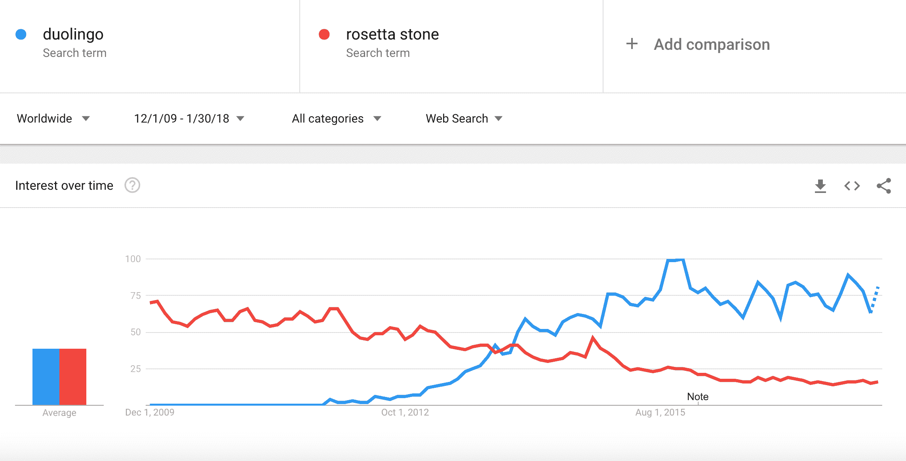
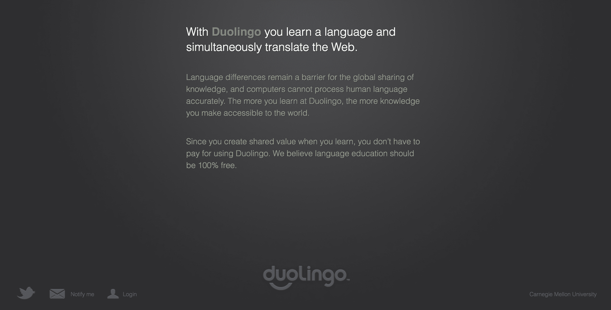
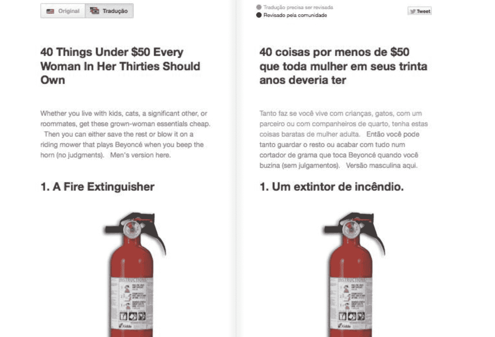
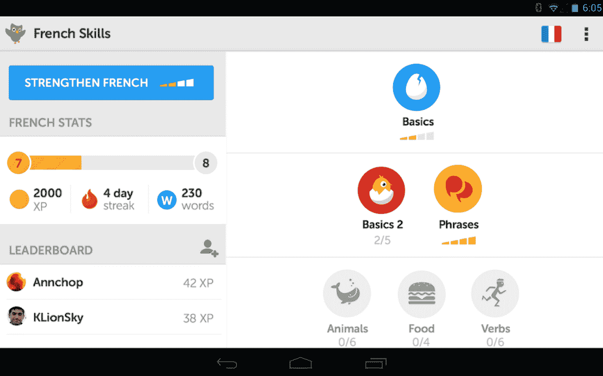

# Duolingo 如何在不向用户收费的情况下建立一家 7 亿美元的公司|产品习惯

> 原文：<https://producthabits.com/duolingo-built-700-million-company-without-charging-users/?utm_source=wanqu.co&utm_campaign=Wanqu+Daily&utm_medium=website>

# Duolingo 如何在不向用户收费的情况下建立一家 7 亿美元的公司

> “我们相信，真正的平等是当更多的支出不能买到更好的教育时。”–[duo lingo 创始人](https://www.duolingo.com/info)

当语言学习软件公司 Rosetta Stone 在 2009 年上市时，他们在交易的第一天就筹集了 1.125 亿美元。他们通过追求一个巨大但分散的市场——全球语言学习者——建立了一个成功的上市公司，并记录了超过 2.09 亿美元的年收入。

但语言学习应用 Duolingo 的创始人认为，罗塞塔石碑占据的市场太小，并且是基于糟糕的商业模式增长的。罗塞塔·斯通只瞄准了语言学习市场的一小部分——并向他们收取高额费用。Duolingo 的创始人认为他们有更好的主意。根据谷歌的趋势，似乎现在世界上很多人都同意他们的观点。

Duolingo 的创始人找到了一条追求比罗塞塔石碑更大市场的道路。他们想利用数以亿计的想学习一门新语言但又无力支付昂贵软件费用的人。

因此，Duolingo 创建了一个免费的应用程序来帮助世界各地的人们学习不同的语言。目前，他们每月有超过 2500 万活跃用户通过网络浏览器或智能手机学习语言，每个人都有自己的学习进度。一路走来，Duolingo 已经建立了一家价值 7 亿美元的公司，而且不向用户收取一分钱。

有两个主要因素帮助 Duolingo 成长为一家巨大、成功的公司，同时坚持他们最初的愿景:他们追求一个大市场，他们一丝不苟地进行实验，并使用他们的数据为他们的所有决策提供信息。

**让我们仔细看看促成 Duolingo 发展的因素:**

*   Duolingo 早期围绕测试和众包的商业模式帮助他们构建了一个可以免费提供的有用应用。
*   赚钱的需要促使 Duolingo 加倍投入他们的商业翻译服务，并进一步吸引用户生成这些翻译。
*   Duolingo 重新关注他们的消费者用例，并围绕教育扩展他们的服务，这使他们采取了新的盈利战略。

Duolingo 一直在尝试货币化，有时他们甚至为此挣扎。即使是现在，他们也没有明确的前进道路。但是 Duolingo 的成长是为实验建立正确条件的一个教训。他们建立了测试所需的流程和受众，并了解什么最有效。一路上，他们对自己的业务和市场了如指掌，最重要的是，他们为自己的未来创造了许多业务拓展选择。

让我们深入了解他们到底做了什么，以及任何公司如何应用同样的想法。

## **2009 年至 2012 年:测试和众包塑造了早期的商业模式**

正当 Rosetta Stone 被认为是一家成功的上市公司时，Duolingo 的创始人开始研究一种更好的世界学习语言的方法。语言学习并不是一个新的或革命性的想法，但 Duolingo 想要进入市场的方式是前所未有的。

在 Duolingo 之前，学习一门新语言存在巨大的成本障碍。像 Rosetta Stone 和 Open English 这样的软件允许世界各地的用户在家学习 30 多种语言。问题是，即使是最基础的课程，他们也要支付几百美元。

2009 年罗塞塔石碑定价页面[ [来源](https://web.archive.org/web/20090830013820/http://www.rosettastone.com:80/learn-english)

以数百或数千美元的价格通过 CD 或订阅销售昂贵的个人软件被认为是消费软件的标准。但是 Duolingo 的创始人 Luis von Ahn 和 Severin Hacker 看到了它的局限性。他们都出生在美国境外

[knew there was a huge pool of people around the world](https://www.huffingtonpost.com/quora/the-history-of-duolingo_b_8971104.html)

他们非常想学英语，但是负担不起现有的课程。

*“这些人(想学习另一种语言)中的大多数，像其中的 8 亿人一样，正在学习英语，并且没有太多的钱……大多数人不学习法语，因为他们想为夏天去巴黎旅行做准备。他们正在学习一门语言，以便在呼叫中心找到一份工作。”**——路易斯·冯·安**T3】*

这一估计有 8 亿人的观众没有一种简单的学习语言的方法。通过为一直被业内忽视的受众群体建立基础，Duolingo 吸引了一个巨大而活跃的市场。

市场规模是为 Duolingo 的成功奠定基础的关键。Duolingo 能够利用其目标市场的规模来测试他们的想法，并尽早发现用户的共鸣。

但是他们不仅仅是众包反馈。这个计划最终是为另一个崇高的目标众包免费劳动力:翻译网络。冯·安意识到翻译后的网络内容的潜在市场，当他看到他的家人和朋友不能阅读英语[时，他们不能像说英语的人一样访问相同的互联网内容](https://bits.blogs.nytimes.com/2012/06/19/a-computer-scientist-banks-on-human-superiority-over-machines/?mtrref=undefined)。Duolingo 早期的盈利计划是向企业收取用户翻译内容的费用，这些内容是学习语言的副产品。在最初几年，Duolingo 实际上并没有与公司合作建立这种 B2B 服务，但他们设计早期应用的目标是最终销售众包翻译。

这就是该公司早期的前提——“在翻译网络的同时学习一门新语言”——是如何诞生的。

让我们仔细看看 Duolingo 如何在早期吸引了一个巨大的市场，然后利用他们的市场规模为他们的业务奠定基础。

Duolingo 最初是由卡内基梅隆大学计算机科学教授 Luis von Ahn 和他的一名博士生 Severin Hacker 领导的一个项目。冯安在将他之前的公司 reCAPTCHA 出售给谷歌后，正在寻找一个新的项目。这家之前的公司为众包劳动力交换不同类型的价值奠定了早期基础。reCAPTCHA 要求用户识别字母和数字，以验证用户是人类，同时使用免费劳动力验证扫描仪无法识别的单词。von Ahn 后来用同样的想法利用众包劳动力建立了 Duolingo。

冯安希望在一个新的更大的空间里展示他从这种商业模式中学到的东西。同时，他开始和他的博士生 Hacker 讨论一个教育工具的想法。他们都亲眼目睹了良好语言教育的重要性。冯安在危地马拉长大，在那里学习英语非常昂贵。与此同时，哈克在瑞士长大——一个有四种民族语言的国家。这种对语言教育的共同欣赏，以及未开发的市场潜力，促使他们开始致力于一种无障碍的语言学习替代方案。

2011 年: Hacker 和 von Ahn 两年来一直致力于他们的想法，但没有公开宣布。但在幕后，他们已经让投资者参与进来。在他们推出测试版之前，Duolingo 已经筹集了 330 万美元的首轮融资，由联合广场风险投资公司(Union Square Ventures)和由名人转型为科技投资人的阿什顿·库彻牵头。根据 [USV 的投资公告](https://www.usv.com/blog/duolingo)，Duolingo 对投资者的宣传与其说是创造一个免费的教育工具，不如说是建立一种可持续的方式来大规模生成网络人工翻译。

“对路易斯来说，机器翻译还不够好。谷歌翻译会让你对页面上的内容有所了解，但人类仍然可以做得更好。如果你想阅读一篇很长的博客文章或一篇来自国外媒体网站的文章，这种差异是非常明显的。Luis、Severin Hacker 和 Duolingo 团队的其他成员为自己设定的挑战是如何让人类翻译网络。他们的解决方案是让翻译成为全球许多人已经在做的事情的副产品:学习一门新语言。”**–布拉德·伯恩汉姆，USV** 事务所合伙人

对投资者来说，Duolingo 不仅提供了一个社交机会，还提供了加强和拓宽在线内容网络的能力。作为一个非常重要的副产品，需要翻译网络内容的公司有可能在价值 3 亿美元的翻译市场赚很多钱。

同年，von Ahn 在一次关于众包的 TED 演讲中首次向公众介绍了 Duolingo 的想法，他称之为大规模在线合作。他介绍了利用在线社区进行免费语言教育的潜力。这种最早的推广形式至关重要 TED 演讲让 von Ahn 能够向大量早期观众传达相关的、而不是公开的销售理念，让他们喜欢上 Duolingo 的产品。超过 100 万人观看了这次演讲，[冯·安认为](https://www.quora.com/What-was-Duolingos-initial-marketing-strategy)在那年晚些时候，由于他的 TED 演讲，超过 30 万用户注册了 Duolingo 的私人测试版。这是多林哥参与的少数几种早期营销形式之一。

Duolingo 登录页面，2011 年 7 月[ [来源](https://web.archive.org/web/20110713204826/http://duolingo.com/)

在测试期间，超过 100，000 人使用了 Duolingo，超过 500，000 人在等待试用——这说明了该公司瞄准的巨大市场。在使用 Duolingo 的 10 万人中，约有 3 万人成为了定期用户，他们每周至少会访问该网站 30 分钟，因为它以其他产品从未有过的方式解决了他们的一个痛点。

2012 年:2012 年 6 月，Duolingo 结束了他们的测试版，向所有人开放了他们的服务。目前，该产品提供四种语言的课程:英语、西班牙语、法语和德语。产品包括学习新词汇的课程和练习语法和句法的翻译练习。根据 Ahn 的说法，早期用户使用该应用程序并通过翻译学习的动机是因为该产品强化了其自身的重要性。“当你在做真实世界的事情时，比如阅读德语或法语的新闻报道，你真的会觉得你在完成一些事情，”T2·冯·安说。"它强调了你为什么要努力理解这门新语言."

Duolingo 的好处果然兑现了承诺——2012 年发布的一项独立研究发现，平均而言，花在 Duolingo 上的 34 个小时相当于在大学学习一门语言的一个学期。

通过翻译学习引起了最终用户的共鸣。他们已经产生了可靠的在线文本翻译，尽管 Duolingo 还没有开始向公司出售这些翻译。Duolingo 的软件旨在提供高质量的翻译,因为它会比较多个学生的翻译结果，以确定最终的“正确”翻译。根据冯安的说法，结果比自动翻译好，只是缺乏专业质量。这使得他们成为最好的和最实惠的内容翻译。

同年 9 月，Duolingo 宣布了他们 1500 万美元的 B 轮融资。这是产品开发的一个重要里程碑——该公司表示，他们计划使用这笔资金来添加更多语言并开发一个移动应用程序。该产品已经在改进和发展——应用程序在用户翻译时不断了解他们的能力，并只向他们展示适合他们技能水平的练习。该公司已经建立了系统来跟踪用户来自哪里，他们在应用上花了多少时间，以及他们为什么想学习一种语言。

此时，Duolingo 作为一项免费服务发展迅速，每周约有 25 万活跃用户学习语言。他们还没有盈利，但已经制定了更多的计划，通过向上传内容并希望其他用户翻译的用户收费来创收。

2012 年 11 月，Duolingo [推出了他们的 iPhone 应用](https://www.americanexpress.com/us/small-business/openforum/articles/captcha-internet-translation/)。这使得用户在移动中更容易获得课程，并给了 Duolingo 更多选择来[游戏化用户体验](https://www.usatoday.com/story/tech/columnist/talkingtech/2013/12/17/duolingo-apples-iphone-app-of-the-year/4042469/)——它使用图片、视频剪辑和手机的麦克风来帮助用户学习单词、写作和说话。

发布一款手机应用程序，可以通过推送通知等手机特有的功能增加用户参与度。诸如此类的功能让这款应用更容易让人上瘾。

这些在扩大用户基础和发布网络和移动应用方面的早期成功给了 Duolingo 一个强劲的开端。他们围绕一个创造性的商业模式开发了他们的产品，并联合了两个密切相关的高需求服务——负担得起的语言教育和网络内容翻译。该公司已经建立了一个坚实的基础，对未来有着强烈的愿景，但他们仍然没有产生收入。消费者应用是他们的重点，他们还没有开始建立 B2B 服务或与公司合作销售翻译。

但 Duolingo 要满足投资者的期望。他们还必须建造一台能够适应未来增长的机器。现在他们不得不将注意力转移到货币化上。向用户收费不是一个选项:保持产品的免费和可访问性是 Duolingo 使命的核心宗旨。相反，他们的下一步是加倍他们已经与早期用户测试的翻译服务，并了解 B2B 市场。

## **2013–2014:新的 B2B 和 UGC 资源有助于商业盈利**

Duolingo 证明了他们有一个好主意。背后有超过 1800 万美元的资金支持，每天有成千上万的新用户注册，他们可以有把握地说他们有一个巨大的潜在市场，用户和投资者都对他们独特的语言学习方式感兴趣。

但是仅仅有一个好的想法是不够的。你必须赚钱。他们必须找到一种创造性的、可持续的创收方式，这样才能在一开始设定的参数范围内保持业务增长。他们已经建立了一个广受欢迎的免费产品，开始向用户收费可能会损害他们的用户增长。另一方面，冯安不喜欢卖广告的想法。Duolingo 必须专注于让用户留在应用中，广告肯定会降低用户体验。

Duolingo 没有用这些更传统的方式赚钱，而是回到了他们公司的基本原则。该公司承诺，用户将“在翻译网络的同时学习一门新语言”，学生在课堂上产生的副产品翻译实际上对发布原创内容的公司非常有价值。正如 Duolingo 的投资者所知，这是一个巨大的潜在收入来源。

所以 Duolingo 开始实验。在接下来的几年里，他们开始与其他公司合作，向他们出售用户生成的翻译内容。这补贴了用户的学习成本，并帮助 Duolingo 继续免费提供应用程序。

与此同时，Duolingo 将 UX 的实验放在了首位。现在钱成了赌注——duo lingo 必须让用户参与到免费应用中来，以继续产生这些创收的翻译。为了尽可能地为用户优化他们的应用程序，他们一丝不苟地测试了 UX 的每个方面，将产品游戏化，并利用他们的发现做出数据驱动的决策。

下面让我们仔细看看 Duolingo 是如何建立 B2B 盈利模式的，以及如何加倍进行 UX 测试，以确保用户生成的翻译能够带来稳定的收入流。

2013 年:duo lingo 首次宣布与 BuzzFeed 和 CNN 合作。这对 Duolingo 很重要，因为它标志着一种新的 B2B 盈利模式的开始——BuzzFeed 和 CNN 为用户的翻译内容向 Duolingo 付费。起初，唯一提供的 B2B 翻译服务是为学习英语的人将英语文章翻译成他们自己的语言。

Duolingo 用户可能翻译的在线内容类型示例。[ [来源](https://www.pcmag.com/article2/0,2817,2425382,00.asp)

对于 BuzzFeed 和 CNN 这样的公司来说，从 Duolingo 获得这些翻译有着明显的价值——每字大约 4 美分，这是翻译行业的平均价格

[around 6 to 10 cents per word](http://www.foxbusiness.com/features/2014/02/27/duolingo-gets-users-to-translate-buzzfeed-articles.html)

。用户生成的翻译也可以捕捉到 BuzzFeed 和 CNN 等公司关心的细微差别。

[VP of International at BuzzFeed](http://www.foxbusiness.com/features/2014/02/27/duolingo-gets-users-to-translate-buzzfeed-articles.html)

斯科特·兰姆说:“我们需要一个能够适应和处理文化参考和习惯用法的翻译服务。”有了 Duolingo，他的团队就不必从头开始构建翻译服务。

在 Duolingo 开始销售翻译的时候，用户每天翻译大约 600 篇文章。但是只有 10%的翻译文章为 Duolingo 带来了收入。收入增长仍有很大空间。

2013 年，Duolingo 被苹果评为年度[应用，这进一步证明了它在用户中的受欢迎程度和实用性。此时，他们提供了六种语言，还加入了意大利语和葡萄牙语。](https://www.duolingo.com/comment/1286647/Congratulations-Duolingo-wins-Apple-s-iPhone-App-of-the-Year-2013)

该团队致力于不断将应用程序的用户体验游戏化，这对于让人们习惯性地使用 Duolingo 非常重要。Duolingo 的增长副总裁 Gina Gotthilf 说，持续的使用是用户获得产品全部价值的关键:“一个人不可能只在周六或周日学习语言。我们需要让人们每天或每隔一天都这样做，这样语言才能坚持下去。”留住人才对于建立强大且不断增长的用户群也至关重要。

他们最重要的游戏化功能之一是增加了条纹，可以跟踪用户在应用程序中记录课程的天数。成长团队 A/B 测试了从设定连胜目标、保持连胜的推送通知时机，以及提醒的文案等一切。他们发现，条纹确实让用户兴奋并产生了共鸣，这些微小的优化中的每一个都将 DAU 提高了整整一个百分点。

同年，Duolingo 采取了另一项措施，通过创建 Duolingo 孵化器来提高社区参与度并为其产品创造更多价值。这是一个允许贡献者自愿创建 Duolingo 上尚未提供的语言课程的计划，或者在某些情况下，任何传统的语言学习服务。

通过 Duolingo Incubator，该公司以另一种方式使用其众包模式，增加对该公司尚未添加的语言感兴趣的人的使用量。有趣的是，这些额外的课程是由完全没有报酬的志愿者创建的: [von Ahn 说](https://www.cnn.com/2013/10/15/tech/mobile/duolingo-incubator-language-teaching/index.html)“我们的目标是免费教授世界语言，所以我们也希望其他人免费合作。”这对人们来说是足够的激励——von Ahn 收到了来自愿意合作的人们的数千封电子邮件，并且在启动该计划后不久，超过 [20，000 人申请开设课程](https://www.duolingo.com/comment/1441819/Statistics-on-all-incubator-languages)。

**2014:**2 月，Duolingo 宣布了他们的[、2000 万美元的 C 轮](https://techcrunch.com/2014/02/18/duolingo-raises-20m-series-c-round-led-by-kleiner-perkins-wants-to-dominate-online-language-learning/)。此时，Duolingo 拥有[2500 万注册用户](https://techcrunch.com/2014/02/18/duolingo-raises-20m-series-c-round-led-by-kleiner-perkins-wants-to-dominate-online-language-learning/)和大约 1250 万活跃用户。据报道，该公司决定筹集资金，因为他们收到了投资者的投资兴趣，特别是领投这轮融资的凯鹏华盈(Kleiner Perkins)。

Duolingo 宣布，他们计划利用这笔资金聘请更多人才，增加新的语言，特别是增加一个“小组”功能，使课堂教师和大公司更容易使用 Duolingo。虽然他们的 B2B 服务正在进行中，他们计划开设一个自助翻译门户网站来增加收入，冯安说收入仍然不是他的优先事项。"我们前进的主要目标是成为事实上学习语言的方式."他的想法是，扩大用户群将间接加强翻译业务——赚钱的一面。

此时，增加产品使用量以加强 Duolingo 的翻译服务对该公司至关重要。这是他们的盈利模式的支柱，它推动了他们谨慎而系统的产品优化。

他们的 A/B 测试过程创造了一个良性循环。团队越是通过优化产品来提高使用率，他们就越能以更大的样本量进行测试和测量。Duolingo 成功地将他们的产品游戏化并使其上瘾的关键策略就是进行大量的测试。通过使用数据来准确了解用户的反应，他们能够利用用户心理，并制定正确的奖励和激励措施。

这些[改进是渐进式的](http://firstround.com/review/the-tenets-of-a-b-testing-from-duolingos-master-growth-hacker/)，比如在他们的应用程序图标上添加一个红色通知点(在 DAU 增加了 1.6%)，将注册屏幕向后移动几步(dau 增加了 20%)，以及更改他们的 streak 通知副本(dau 增加了 5%)。但是这些变化是持续不断的，它们累积起来。

2014 年的 UX 多林戈，带有游戏化仪表盘。[ [来源](https://techcrunch.com/2014/02/18/duolingo-raises-20m-series-c-round-led-by-kleiner-perkins-wants-to-dominate-online-language-learning/)

留住人才的努力得到了回报。

[As of 2013, over 100,000 users](https://www.cnn.com/2013/10/15/tech/mobile/duolingo-incubator-language-teaching/index.html)

我从 Duolingo 的一门语言课程中毕业，一路走到了最后。

对日益增长的使用的关注反映了 Duolingo 的普遍态度，即最终用户是他们的主要优先事项。即使他们试图通过发展 B2B 服务来赚钱，该公司的重点仍然是消费者。很快，该公司意识到，扩展他们的 B2B 服务将需要一个更加企业销售驱动的模式，这意味着对产品和用户的关注可能会减少。

为了避免这种情况，Duolingo 没有加倍努力进行 B2B，而是开始寻找另一个可持续的赚钱机会。

## **2014 年至今:新的使命——以及与之相匹配的新商业模式**

Duolingo 已经开始为 B2B 翻译服务提供真正有利可图的商业模式——他们可以支付低于行业平均水平的费用，他们可以提供细致入微的人工翻译，他们可以为他们的免费教育应用程序提供资金。

B2B 服务是一项实验，而且是一项成功的实验——但 Duolingo 意识到，它不会帮助他们建立他们想要的公司类型。专注于 B2B 服务会转移公司内部的注意力，损害已经非常成功的消费产品。他们最新、最令人兴奋的想法——比如他们的 Duolingo 孵化器和深入语言教育的潜力——都是围绕他们的消费者用例，而不是他们的商业服务。

因此，Duolingo 没有试图在消费者和企业、教育和翻译服务之间分割他们的重点，而是专注于消费者。没有 B2B 服务，他们不得不寻找新的盈利方式。这最终导致他们选择提供广告和创建一个可选的付费计划。尽管他们之前说他们不想这么做，但现在看起来两害相权取其轻，因为这仍然让他们把注意力集中在消费者方面。

所有变化的共同点是:他们总是能够为用户保持一个免费的服务选项。

让我们仔细看看在过去的几年里，Duolingo 的使命、用例以及盈利策略是如何变化的。

2014 年，Duolingo [正式“推出”他们的商务翻译服务](https://techcrunch.com/2015/06/10/duolingo-raises-45-million-series-d-round-led-by-google-ventures-now-valued-at-470m/)。他们继续与 CNN 合作，但不再接受任何与希望购买翻译的企业建立新的合作关系。尽管这是一个成功的收入流，但它不再符合该公司围绕扩大消费者使用案例的新目标。继续发展翻译服务将需要建立一个销售团队，并在内部转移到一个更加企业化、B2B 风格的公司，这将分散团队的努力和注意力。

终止业务翻译服务有助于发布新的消费者服务。

同年，Duolingo [发布了测试中心](https://www.duolingo.com/comment/2984868/Duolingo-Test-Center-Affordable-and-convenient-language-certification)，这是一项测试服务，允许用户在家里自己的设备上进行测试，并获得英语语言认证。

一项独立研究发现分数与托福网考直接相关，托福网考是一种标准化的英语考试。这对于 von Ahn 在设计 Duolingo 时最初想到的巨大市场尤为重要——8 亿人希望学习英语以获得更好的工作。对于他们来说，英语语言认证考试是一个障碍，因为它们非常昂贵，并且需要前往考试中心。Duolingo 的测试价格为 20 美元，更实惠，但仍然给了 Duolingo 一种新的用户群盈利方式。

建立一个与行业标准一样被视为合法的新认证无疑是一个挑战。然而，许多雇主(如优步)、大学(如哈佛扩展学校)和机构(如哥伦比亚政府)几乎立刻就开始承认这项考试是合法的。Duolingo 通过强调对其有效性的研究和[直接与学校和机构合作](https://www.quora.com/To-what-extent-is-Duolingo-English-language-certification-credible-and-recognized-by-a-worldwide-range-of-employers)使其得到认可来帮助这一进程。这使得它成为使用 Duolingo 推进其职业发展和机会的市场的一个很好的选择。

2015 年:当 Duolingo 在 2014 年筹集 C 轮资金时，他们的目标之一是建立一个可以帮助教师跟踪学生进度的功能。他们筹集的资金为他们提供了时间、资本和将团队[从 34 人扩大到大约 50 人](https://techcrunch.com/2015/06/10/duolingo-raises-45-million-series-d-round-led-by-google-ventures-now-valued-at-470m/)的能力——他们能够将这些新资源投入到这个目标中。因此在 2015 年，为了响应来自世界各地[教师和教育部门](https://www.duolingo.com/comment/6318291/Announcing-Duolingo-for-Schools)的数千个请求，该团队为学校推出了[duo lingo](https://schools.duolingo.com/)。这是一个教师可以在课堂上向学生教授语言的程序。

该计划为教师提供了一个仪表板，以统一的方式跟踪学生在 Duolingo 中的进步。该公司[计划继续开发功能](https://ru.duolingo.com/comment/6318291/Announcing-Duolingo-for-Schools),帮助教师发现错误答案的模式，找出理解上的差距，并为学生创造量身定制的学习体验。

Duolingo for Schools 对学生和教师完全免费——这不是该公司的收入来源，但它对于增加使用量和使他们的程序以消费者需要的方式变得更容易获得和更有价值是必不可少的。它发展得特别快，因为管理人员对它已经有了巨大的需求，而且它在学生中已经非常受欢迎。该项目在选择有限的学区免费开放，也很有帮助。短短几个月，[已经有 10 万老师报名](https://techcrunch.com/2015/06/10/duolingo-raises-45-million-series-d-round-led-by-google-ventures-now-valued-at-470m/)。

凭借超过 1 亿的全球用户，Duolingo 筹集了 4500 万美元的 d 轮融资。谷歌资本领导了这一轮融资，并表示他们“被 Duolingo 的增长和参与数字震惊了”，并提到了他们在“教育的未来”中的潜力。该公司计划利用这笔资金使他们的教育项目更加令人兴奋和适应，并进一步扩展到全球的学校系统。

**2016:** 多亏了新的资金，Duolingo 总共筹集了 8330 万美元，得以开始为教育技术领域更广泛的机会开发解决方案。Duolingo 进行了下一个[的逻辑发展，以进一步扩大他们的市场](https://www.forbes.com/sites/parulguliani/2016/07/22/duolingo-looks-to-dominate-the-mobile-education-market-with-new-flashcard-app/#4d61e3611c1d)，并创建了他们自己的抽认卡应用程序 TinyCards。这有助于他们在语言之外的其他垂直教育领域获得用户。TinyCards 在不增加大量营销努力的情况下取得了成功，因为离线抽认卡已经有了一个巨大的成熟市场，并且它受益于 [Duolingo 的语言应用程序分发渠道](https://www.forbes.com/sites/parulguliani/2016/07/22/duolingo-looks-to-dominate-the-mobile-education-market-with-new-flashcard-app/#2dd21c3b1c1d)。

TinyCards 从一开始就有巨大的发行推动，因为它与 Duolingo 绑定——它在 Duolingo 的所有网站上推广，用户可以用他们的 Duolingo 帐户登录。它是免费的，就像 Duolingo 一样，并且有许多相同的游戏化学习原则，这些原则使 Duolingo 如此令人上瘾。一年之内，Duolingo 报告说用户已经在 TinyCards 中创建了超过 200，000 副抽认卡。

**2017:** 自从他们停止发展商业翻译服务以来，Duolingo 的主要收入来源是考试中心的考试费用。尽管他们有充足的资金，但他们需要继续建立可持续的盈利方式。这就是 Duolingo 最终决定开始向用户提供广告的原因。

尽管他们之前表示不想提供广告，但该公司认为这是两害相权取其轻——提供广告意味着他们可以在不建立企业销售团队的情况下赚钱。保持良好的用户体验仍然是 Duolingo 的首要任务，因此他们确保广告不引人注目。它们只在课程结束时出现，并没有偏离用户的主要目标:语言学习。

Duolingo 还在 2017 年晚些时候发布了针对 Android、Web 和 iPhone 的[订阅 Plus 计划](https://www.duolingo.com/comment/22202238/Introducing-Duolingo-Plus)。付费计划去掉了广告，让用户下载课程供离线使用。目的是继续让 Duolingo 自我维持，同时允许所有用户选择继续免费服务。

Duolingo 最近的一轮融资是 7 月份的 2500 万美元的 E 轮融资，估值为 7 亿美元。这一最新估值比他们在 d 轮融资期间的 4.7 亿美元估值高出近 50%，该公司没有公布他们的收入数字，但 von Ahn 表示，不断增长的估值反映了收入的增加。Duolingo 最近报告了超过 2 亿用户，其中 2500 万每月活跃。该公司表示，他们的下一个优先事项是[将公司从 80 人发展到 150 人，](https://techcrunch.com/2017/07/25/duolingo-raises-25m-at-a-700m-valuation/)并专门雇佣更多的工程师和设计师。

Duolingo 一直在增强投资者的信心，并有可能增加收入。很难说他们赚了多少钱，看起来他们仍然在想办法通过货币化获得成功。但是，他们比以往任何时候都有更多的货币化计划。对他们来说，盈利是一项挑战，因为他们仍在努力赚钱，同时坚持自己的核心价值:为全球用户免费提供高质量的语言教育。

但展望未来，Duolingo 有很多选择。他们已经走到了这一步，而且很可能会继续增长，因为他们致力于测试不同的商业模式，并适应最适合他们巨大市场的模式。

## 【Duolingo 何去何从

Duolingo 在敲定赚钱计划时有很多潜在的途径。以下是他们扩展服务、提高使用率和增加额外收入来源的一些方法:

**分成面向消费者的应用和 B2B 翻译服务:**尽管 Duolingo 最初不想这么做，但通过同时针对消费者和企业提供多种产品来实现业务增长是很常见的。只要 Duolingo 继续向消费者分配资源，这一策略可能会非常成功。有了 Duolingo 最近一轮的资金和他们大幅增长公司的计划，他们有空间在不占用资源、时间或人员的情况下建立他们的 B2B 端，而不用离开他们的关键消费者用例。

**继续向教育领域扩张:** TinyCards 是向更广阔的教育领域迈出的良好的第一步，但具有类似盈利模式的其他教育工具(如广告和可选的付费计划)还有很多机会。TinyCards 允许用户围绕从解剖学到地理学到《权力的游戏》角色等非常广泛的主题研究用户生成的内容。如果 Duolingo 深入其中一些垂直领域，他们可以以类似的游戏化方式围绕其中一些主题构建全新的教育应用。现在一些最好的老师推荐的教育应用程序(根据 [TED 博客](http://blog.ed.ted.com/2015/09/19/25-awesome-apps-for-teachers-recommended-by-teachers/))围绕着诗歌、科学和 3D 建模——所有这些都是 Duolingo 发展的潜在空间。这将有助于他们不仅扩展到世界各地的语言教室，而且扩展到许多不同学科的教室。

**扩展到其他业务领域:**除了翻译，还有其他自然相邻的 B2B 合作伙伴关系对 Duolingo 有意义。例如，在国际旅行等领域存在潜在的合作伙伴关系，Duolingo 可以与旅行社或酒店合作，为国际旅行者提供为期两周的“速成”课程。作为免费服务的补充，这些“速成课程”可以追加销售，并打入付费消费者群体。或者，Duolingo 可以为在应用程序中学习特定语言的用户建议涉及其付费合作伙伴的旅行选项。Duolingo 必须确保将他们提供的任何无关紧要的业务服务与他们的主要消费者用例紧密联系起来。

由于 Duolingo 是一家私营公司，很难确切地说出他们的财务状况如何——但从他们不断增长的使用量和不断增长的投资者估值来看，他们似乎正在扩张并继续取得成功。

## 从 Duolingo 中学到的 3 个关键经验

Duolingo 做了一件在翻译和语言教育领域没有人会想到的事情。他们开发了一个免费的语言学习应用程序，在世界各地吸引了数千万用户，并在此过程中发展了一项成功的业务。

无论你身处哪个领域，Duolingo 对其愿景的承诺以及他们改变行业的方式都可以作为灵感。这是 Duolingo 之旅的三个主要收获，可以帮助任何企业保持适应性，并为长期成功做好准备。

### 1.追求一个大市场——甚至比你竞争对手的市场还要大。

多林戈可以简单地建造一个游戏化的罗塞塔石碑竞争者。这会很有趣，很吸引人，而且他们可以以数百美元的价格出售最终产品。毕竟，Rosetta Stone 是一家成功的公司，他们在一个相当大的市场上做得很好。

但是，Duolingo 超越了其他人已经在做的事情。他们考虑了语言教育中的实际问题，以及谁会受到这些问题的最大影响。这让他们找到了一群没有得到现有选项服务的人，并把他们带到了一个比竞争对手更大的市场。

很容易看到你的产品或你的竞争对手的产品的当前市场规模，并认为这是一个既定的事实。但是如果你能看得更远，你就能发现你的竞争对手完全没有意识到的未开发的潜力。

因此，不要去想你的公司和你的市场现在在哪里，而是倒着去做。为你希望你的公司在 5 年、10 年甚至 20 年内做些什么设定一个目标，然后思考这对你必须追求的市场和你必须建立的公司类型意味着什么。

例如，如果你正在努力成为 CRMs 的行业权威，你可能希望最终你的博客每年有 1500 万的访问量。为了实现这一目标，你必须首先[弄清楚如何将你的博客](https://hitenism.com/set-company-marketing-success-working-backwards-15-million-blog-visits/)从每年不到 15 万的访问量增长到 1500 万，以及在这个过程中的每个阶段你必须做些什么(比如建立一个初始博客，找到产品与市场的契合度，以及开发一个高效的内容管道)。

如果你像 Duolingo 一样，追求大量的观众可能意味着你必须免费提供一些东西。但 Duolingo 也证明了总有创造性的方法来赚钱，如果你把注意力放在最终用户身上，你就可以让它发挥作用。

### 2.A/B 测试一切，并根据你的结果一丝不苟地跟踪和调整。

Duolingo 的制胜策略之一是了解数据。通过微小的改变，他们能够一点一点地提高使用率和参与度。这些递增的改进在当时看起来并不多——这里增加 1%，那里增加 3%——但随着时间的推移，它会增加。由于他们不断的微小优化，Duolingo 在 7 年内从 10 万用户攀升至 2 亿用户(增长了 2000 倍)。

例如，Duolingo 最重要的优化之一是微妙的，甚至有点违反直觉。他们注意到很多用户在下载甚至打开应用程序，但没有注册。为了鼓励注册，他们尝试将注册页面向后移几个屏幕。他们不知道这是否可行，但他们假设，通过让用户在要求注册之前体验一下 Duolingo，他们不会在这里看到这么多的掉线。

他们是对的。但如果他们没有 A/B 测试注册屏幕的位置，他们永远不会知道这一点。仅通过这一小小的调整，他们就能够[将 dau 增加 20%](http://firstround.com/review/the-tenets-of-a-b-testing-from-duolingos-master-growth-hacker/) 。

我对进行实验和做出数据驱动的决策的最佳建议部分来自于我自己的经验，部分来自于 T2 在 Duolingo 的 Gina Gotthilf:

*   不断为测试集思广益。在进入后期实施阶段之前，不要抛出任何想法。然后，您应该根据它将影响多少用户进行评估，并根据您的样本大小优先获得具有统计意义的结果。
*   使用分析工具，将数据和行动与特定用户联系起来。如果你不能用自己的工具解析你的数据，投资一个能给你高质量用户分析的工具是值得的，比如[振幅](https://amplitude.com/)。
*   不要以为数据只是定量的。定性数据可以是非常有用的市场研究，它可以帮助你从用户的角度对什么是有效的，什么是无效的有不同的理解。

要建立一个成功的测试和实验系统，你不能在头脑中设定一个端点。你必须接受一个测试会导致另一个测试的想法。

### 3.不要害怕发展你的商业模式。

如果 Duolingo 坚持他们最初的基于 B2B 服务赚钱的计划，他们可能不会开发出所有有趣的、真正有用的消费者用例。灵活和尝试他们的商业模式使他们能够做出重要的改变，推动公司前进，同时保持他们最初的使命。

Duolingo 可以自由地改变他们的商业模式，因为他们处于一个非常大的市场，他们有大量的使用数据可以支持他们的假设。他们处于进化的理想状态。

但是除了 Duolingo，随着时间的推移，SaaS 还有许多家喻户晓的公司改变了他们的商业模式，比如 Dropbox、HubSpot 和 New Relic。事实上，对于许多公司来说，发展你的商业模式可以成为增长的催化剂，因为它打开了新的市场和机会。

对于那些试图找到适合自己公司的商业模式的创始人，我的建议是考虑以下几点:

*   你的产品的价值主张是什么，它的价值实现时间是什么？
*   该领域的竞争情况如何？
*   每个目标客户的价值是多少？潜在的市场价值是什么？
*   你能帮助你的客户取得成功的最快方法是什么？

我敢肯定，在 Duolingo 的案例中，离开他们的 B2B 翻译服务是非常可怕的，尤其是考虑到他们对投资者的承诺。对于很多公司来说，进行大的商业模式变革真的很可怕。但是，如果你对你的产品有一个很强的愿景，对你的市场有一个要完成的使命，有时商业模式的改变是你需要创新的。

## 我们可以期待 Duolingo 带来更多惊喜

在过去的九年里，Duolingo 发展得如此之快。他们已经证明了他们对世界各地数以亿计的人是多么有用，同时发展他们的公司，并找出如何建立一个成功的企业，因为他们一直专注于最初的目标:帮助用户学习一门新语言。

我希望我们能从 Duolingo 看到更多的惊喜，因为他们会继续尝试，并了解什么对他们和他们的用户最有效。

他们有如此大的潜力——我很想知道接下来会发生什么。