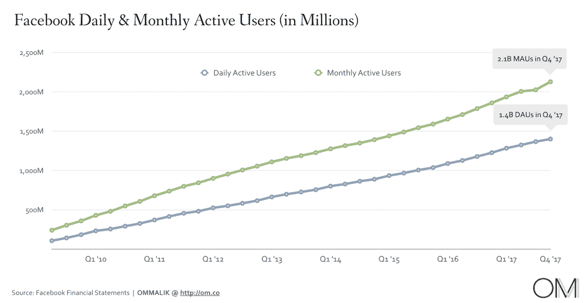
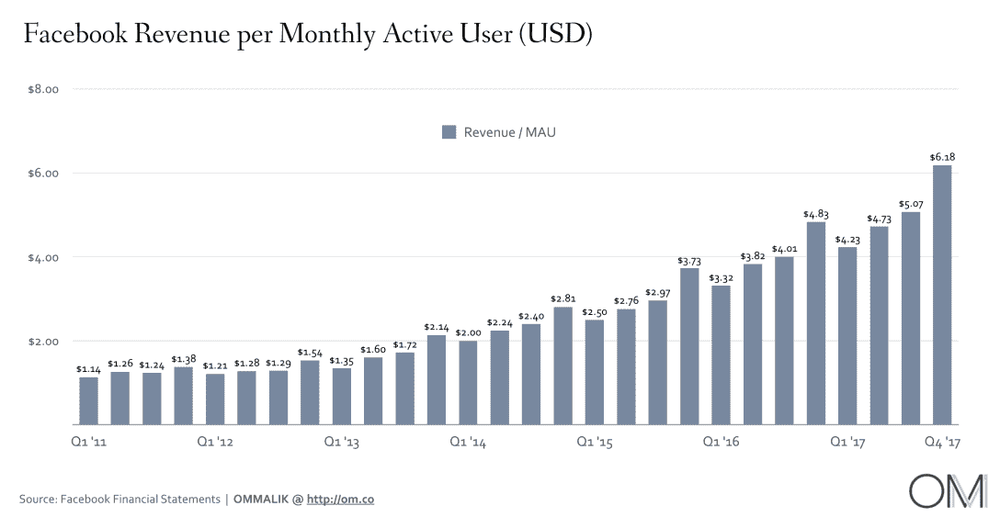
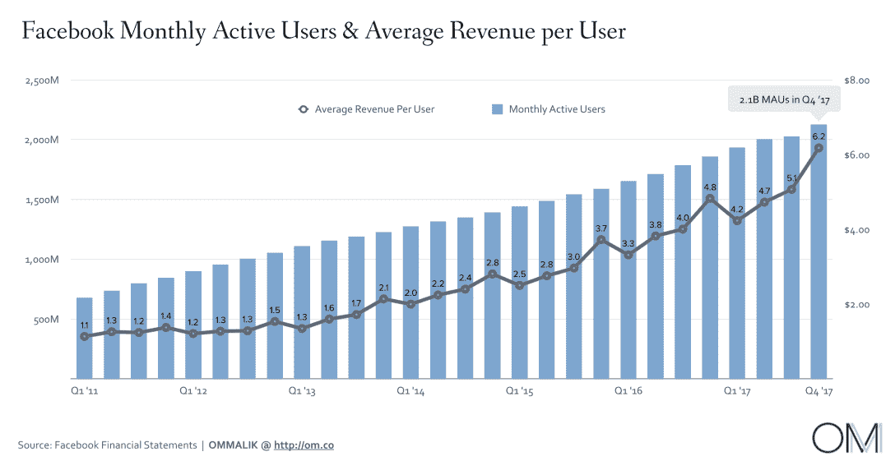

# 脸书永远不会改变的首要原因——在我看来

> 原文：<https://om.co/2018/02/20/the-1-reason-facebook-wont-ever-change/?utm_source=wanqu.co&utm_campaign=Wanqu+Daily&utm_medium=website>

当脸书因向注册双因素认证的会员发送垃圾邮件而受到批评时，它(理应)的媒体噩梦本周仍在继续。随后有人指控其 Protect VPN 软件(基于 Onava CDN)本质上是企业间谍软件。对脸书及其行为的集体愤怒可能会导致很多谈论，但它不会真正改变脸书，它的民族精神和道德规范。让我解释一下！

**

几年前，我写道[公司有一个核心基因档案](https://om.co/2011/02/11/change-is-good-but-its-also-really-hard/)，他们很难偏离它。这种 DNA 定义了一家公司的每一个行动、反应和战略举措。DNA 代表了一家公司的精神气质，在很大程度上，也代表了它的道德规范。微软过去是，将来也永远是一家桌面软件公司，尽管它正在尽最大努力适应以云和数据为中心的世界。它已经将其桌面产品转化为智能云收入流。

谷歌的核心 DNA 是搜索和工程，尽管有些人会说工程是由搜索经济学驱动的，这使得该公司很难通过任何其他视角来看待世界。苹果的镜头是产品、设计和体验的镜头。这使得它能制造出优秀的手机，并强调隐私，但却使他们很难建立基于数据的服务。

脸书的 DNA 是一个沉迷于增长和参与的社交平台。从本质上讲，每项政策、每项决策、每项战略都是基于增长(不惜任何代价)和参与(不惜任何代价)。更多的增长和更多的参与意味着更多的数据——这意味着该公司可以赚更多的广告费用，这使它在股票市场上的估值高得惊人，这反过来又使它保持竞争力，领先于竞争对手。

<noscript>T3】</noscript>

只要看看这些图表，你就会开始明白为什么脸书沉迷于增长和参与。参与获得关注，关注是零和游戏。花在脸书(或 Messenger、Instagram 或 WhatsApp)上的时间意味着注意力*而不是*花在 Twitter、Snapchat 或任何敢于与之竞争的人身上。

<noscript>T3】</noscript>

脸书面临的挑战是，他们最有利可图的市场——美加——已经饱和。为了继续在这些市场赚钱——2017 年最后三个月，ARPU 股市已经达到荒谬的 27 美元——他们需要我们给予他们更多的时间和关注。

> 与 2016 年相比，2017 年每条广告的平均价格增加了 29%，而 2016 年约为 5%，广告投放数量增加了 15%，而 2016 年约为 50%。*(摘自脸书 2017 年 10k 填报)*

这对脸书来说是一个危机，因为它从美加以外的市场赚不到那么多钱。在同样的三个月里，它在亚太地区的 ARPU 赚了 2.54 美元，在世界其他地区赚了 1.86 美元，在欧洲赚了 8.86 美元。

<noscript>T3】</noscript>

ARPU 的数字，尤其是在美国和加拿大，解释了为什么该公司公开谈论假新闻的挑战，以及它如何试图从用户的订阅源中删除此类新闻——而是重新关注朋友和他们的东西。它必须在假新闻(又名垃圾邮件)周围制造礼貌的噪音，以便让人们重新加入进来，并在网站上停留更长时间。

我不认为脸书和马克·扎克伯格改变主意是无私的。然而，很明显，他们正努力让我们重返脸书，而且越来越频繁。与此同时，该公司正在开展一场运动来提升其形象，并给人一种公司受到围攻的印象，正如[最近的《连线》封面故事](https://www.wired.com/story/inside-facebook-mark-zuckerberg-2-years-of-hell/)所概述的那样。但是脸书不是受害者——它从来不是，也永远不会是！

**

所以现在你知道为什么脸书要做它最近一直在做的事情了——不断地发送各种信息让你回到服务中来。我有亲身经历。我于 2017 年 9 月 23 日离开脸书，没有一天我没有收到至少几封电子邮件或一些短信，试图给我回复朋友最近发布的消息，或者生日或其他里程碑。我不断退订，他们仍然源源不断。现在我建立了一个垃圾邮件规则:所有来自 Facebook.com 的邮件都会直接进入垃圾邮件文件夹。

脸书的 DNA 也解释了它为什么推动保护(VPN)以及它带来了什么。首先，它让该公司能够跟踪世界各地的人们在使用什么应用程序，这反过来又让它在复制或潜在收购谁或什么上占了优势。

VPN 数据也让脸书能够更好地定位广告——就像谷歌邮件和谷歌浏览器让谷歌更好地定位你看到的广告一样。顺便说一下，脸书并不是唯一一个从 VPN 移动数据流中获取数据的人。其他数据经纪人从其他 VPN 应用购买数据。需要明确的是，仅仅因为其他人在做，并不意味着脸书也跟着做。我很乐意看到美国版的《GDPR》——公民数据权利宣言——被摆上桌面。

保护如何帮助脸书？

Protect 可以告诉你浏览了 H&M 的北美网站，访问了 NYTimes.com，并在 Farmstead 上购买了食品杂货。它可以计算出你在各种网站和服务上花了多少时间，并开始建立一个更好的在线使用档案，以实现更智能的广告定位，并将你放在越来越多的桶中。

换句话说，Protect 为脸书的系统带来了更精细的数据，这反过来使脸书能够改进其算法，提高广告定位的效率。这在亚太地区和其他新兴市场尤其有用，在这些地区，创建存储桶和超级目标非常棘手。脸书的海外用户正在使用手机上的社交平台，这些手机通常是预付费手机，没有太多来自第三方来源的个性化信息来创建个人资料。脸书需要在亚洲、非洲和拉丁美洲的用户群中找到更多高价值的客户。

> 2017 年，全球 ARPU 为 20.21 美元，比 2016 年增长 26%。在此期间，ARPU 在欧洲增长了 41%，在美国和加拿大增长了 36%，在世界其他地区增长了 33%，在亚太地区增长了 22%。*(摘自脸书 2017 年 10k 填报)*

**

脸书的最终目标是让购买超个性化广告变得昂贵——这是广告界的奥林匹斯山——脸书正考虑发布触摸屏智能扬声器，对此我并不感到惊讶。这将是一个很好的窥探方式——对不起，我的意思是*获取*更多关于你的连续数据，并进一步为未来的广告定位挖掘你。

这有助于保持 ARPU 的增长，这反过来意味着脸书将继续赚更多的钱。更多的钱，反过来，允许它让华尔街高兴，粉碎竞争对手，并吸收市场上的所有人才。是的，它也将接受虚假账户和垃圾邮件，即使它损害了选举，只要它能赚钱。

这可能是一系列事件的一个非常简化的版本，但事实是，金钱以及对增长和参与的痴迷是让脸书四处走动的原因。这是它的灵魂，它的 DNA，它永远不会改变。

脸书宣称的使命是连接世界。他们已经在美国这样做了，但他们随后的行动表明，他们的真正目的是提取用户数据，而不是加强联系。只要读一读他们的 10k 文件，你就会明白这是白纸黑字。

> 广告投放的增长是由用户及其参与度的增加以及新闻源上显示的广告数量和频率的增加所推动的，这一增长被用户参与视频内容和其他产品变化的增加所部分抵消。

脸书是通过让我们沉迷于脸书来赚钱的。它一直都是——这就是为什么我们所有的焦虑和头条新闻都不会改变任何事情。