# 2022 年完整的 SEO 清单

> 原文：<https://backlinko.com/seo-checklist?utm_source=wanqu.co&utm_campaign=Wanqu+Daily&utm_medium=website>

这是互联网上最完整的 SEO 清单。

**最精彩的部分？**

清单上的一切现在都很好。

因此，如果你想在 2022 年获得更高的谷歌排名，你会喜欢今天的清单。

让我们开始吧…

## **如何使用这份 SEO 清单**

嘿，我是布莱恩·迪恩。

我用这个清单在 30 天内让我的有机流量增长了 161.96%:

<picture><source type="image/webp" srcset="https://api.backlinko.com/app/uploads/2020/12/organic-traffic-increase.webp 2500w, https://api.backlinko.com/app/uploads/2020/12/organic-traffic-increase-300x138.webp 300w, https://api.backlinko.com/app/uploads/2020/12/organic-traffic-increase-1280x589.webp 1280w, https://api.backlinko.com/app/uploads/2020/12/organic-traffic-increase-768x353.webp 768w, https://api.backlinko.com/app/uploads/2020/12/organic-traffic-increase-1536x707.webp 1536w, https://api.backlinko.com/app/uploads/2020/12/organic-traffic-increase-2048x942.webp 2048w, https://api.backlinko.com/app/uploads/2020/12/organic-traffic-increase-480x221.webp 480w, https://api.backlinko.com/app/uploads/2020/12/organic-traffic-increase-640x294.webp 640w, https://api.backlinko.com/app/uploads/2020/12/organic-traffic-increase-960x442.webp 960w, https://api.backlinko.com/app/uploads/2020/12/organic-traffic-increase-1440x662.webp 1440w, https://api.backlinko.com/app/uploads/2020/12/organic-traffic-increase-1600x736.webp 1600w, https://api.backlinko.com/app/uploads/2020/12/organic-traffic-increase-1920x883.webp 1920w" sizes="(max-width: 600px) 100vw, 600px">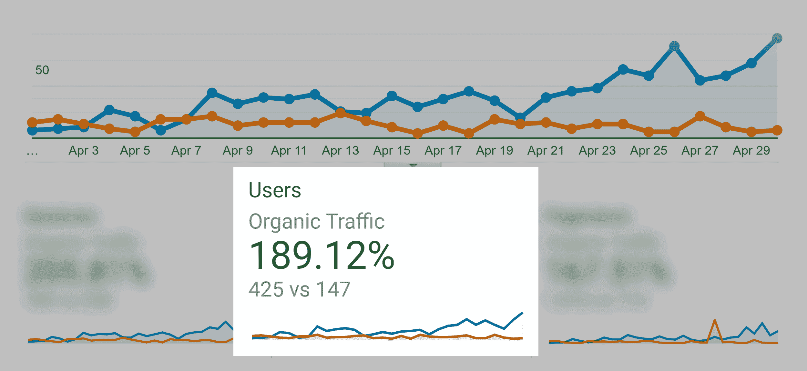</picture>

它还帮助我对超级有竞争力的关键词进行排名，比如“网页搜索引擎优化”。

<picture><source type="image/webp" srcset="https://api.backlinko.com/app/uploads/2021/10/google-serp-on-page-seo.webp 2500w, https://api.backlinko.com/app/uploads/2021/10/google-serp-on-page-seo-300x275.webp 300w, https://api.backlinko.com/app/uploads/2021/10/google-serp-on-page-seo-1280x1175.webp 1280w, https://api.backlinko.com/app/uploads/2021/10/google-serp-on-page-seo-768x705.webp 768w, https://api.backlinko.com/app/uploads/2021/10/google-serp-on-page-seo-1536x1410.webp 1536w, https://api.backlinko.com/app/uploads/2021/10/google-serp-on-page-seo-2048x1880.webp 2048w, https://api.backlinko.com/app/uploads/2021/10/google-serp-on-page-seo-480x441.webp 480w, https://api.backlinko.com/app/uploads/2021/10/google-serp-on-page-seo-640x588.webp 640w, https://api.backlinko.com/app/uploads/2021/10/google-serp-on-page-seo-960x881.webp 960w, https://api.backlinko.com/app/uploads/2021/10/google-serp-on-page-seo-1440x1322.webp 1440w, https://api.backlinko.com/app/uploads/2021/10/google-serp-on-page-seo-1600x1469.webp 1600w, https://api.backlinko.com/app/uploads/2021/10/google-serp-on-page-seo-1920x1763.webp 1920w" sizes="(max-width: 600px) 100vw, 600px">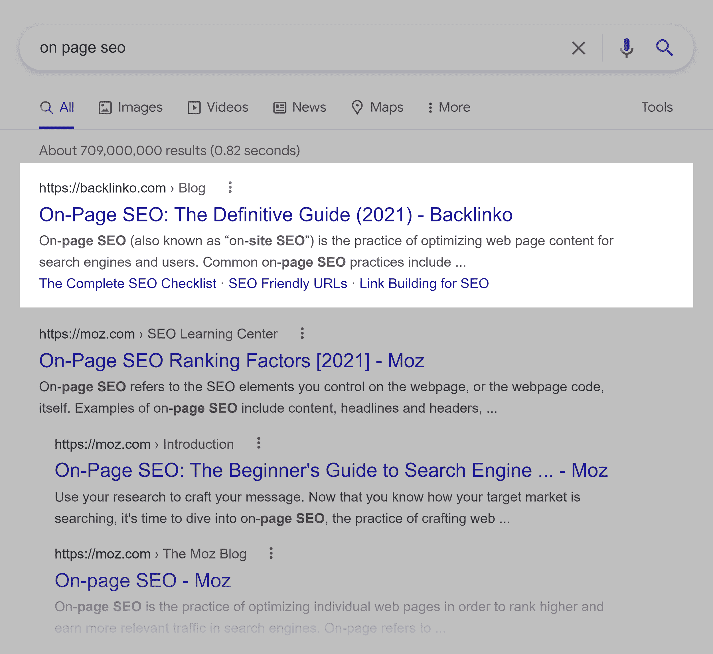</picture>

和“关键词研究”:

<picture><source type="image/webp" srcset="https://api.backlinko.com/app/uploads/2021/10/google-serp-keyword-research.webp 2500w, https://api.backlinko.com/app/uploads/2021/10/google-serp-keyword-research-300x290.webp 300w, https://api.backlinko.com/app/uploads/2021/10/google-serp-keyword-research-1280x1237.webp 1280w, https://api.backlinko.com/app/uploads/2021/10/google-serp-keyword-research-768x742.webp 768w, https://api.backlinko.com/app/uploads/2021/10/google-serp-keyword-research-1536x1484.webp 1536w, https://api.backlinko.com/app/uploads/2021/10/google-serp-keyword-research-2048x1979.webp 2048w, https://api.backlinko.com/app/uploads/2021/10/google-serp-keyword-research-480x464.webp 480w, https://api.backlinko.com/app/uploads/2021/10/google-serp-keyword-research-640x618.webp 640w, https://api.backlinko.com/app/uploads/2021/10/google-serp-keyword-research-960x928.webp 960w, https://api.backlinko.com/app/uploads/2021/10/google-serp-keyword-research-1440x1392.webp 1440w, https://api.backlinko.com/app/uploads/2021/10/google-serp-keyword-research-1600x1546.webp 1600w, https://api.backlinko.com/app/uploads/2021/10/google-serp-keyword-research-1920x1855.webp 1920w" sizes="(max-width: 600px) 100vw, 600px">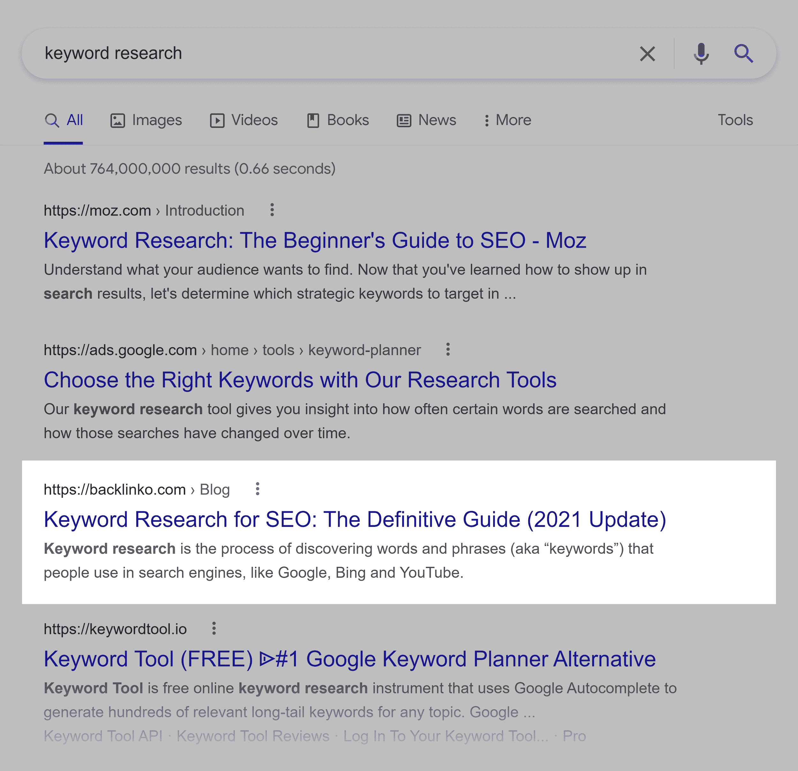</picture>

也就是说…

你不需要实现这个清单上的所有东西。

尽你所能。

你实践的技巧越多，你得到的流量就越多。

## **SEO 基础清单**

首先，让我们解决 SEO 的基本问题。在这里你可以了解到在搜索引擎中排名所需的工具和插件。

**1。设置谷歌搜索控制台**

谷歌搜索控制台是一个非常强大的[免费搜索引擎优化工具](https://backlinko.com/best-free-seo-tools "Best Free SEO Tools")。

<picture><source type="image/webp" srcset="https://api.backlinko.com/app/uploads/2021/10/google-search-console-search-performance-report.webp 2310w, https://api.backlinko.com/app/uploads/2021/10/google-search-console-search-performance-report-300x325.webp 300w, https://api.backlinko.com/app/uploads/2021/10/google-search-console-search-performance-report-1280x1388.webp 1280w, https://api.backlinko.com/app/uploads/2021/10/google-search-console-search-performance-report-768x833.webp 768w, https://api.backlinko.com/app/uploads/2021/10/google-search-console-search-performance-report-1416x1536.webp 1416w, https://api.backlinko.com/app/uploads/2021/10/google-search-console-search-performance-report-1889x2048.webp 1889w, https://api.backlinko.com/app/uploads/2021/10/google-search-console-search-performance-report-480x521.webp 480w, https://api.backlinko.com/app/uploads/2021/10/google-search-console-search-performance-report-640x694.webp 640w, https://api.backlinko.com/app/uploads/2021/10/google-search-console-search-performance-report-960x1041.webp 960w, https://api.backlinko.com/app/uploads/2021/10/google-search-console-search-performance-report-1440x1562.webp 1440w, https://api.backlinko.com/app/uploads/2021/10/google-search-console-search-performance-report-1600x1735.webp 1600w, https://api.backlinko.com/app/uploads/2021/10/google-search-console-search-performance-report-1920x2082.webp 1920w" sizes="(max-width: 600px) 100vw, 600px">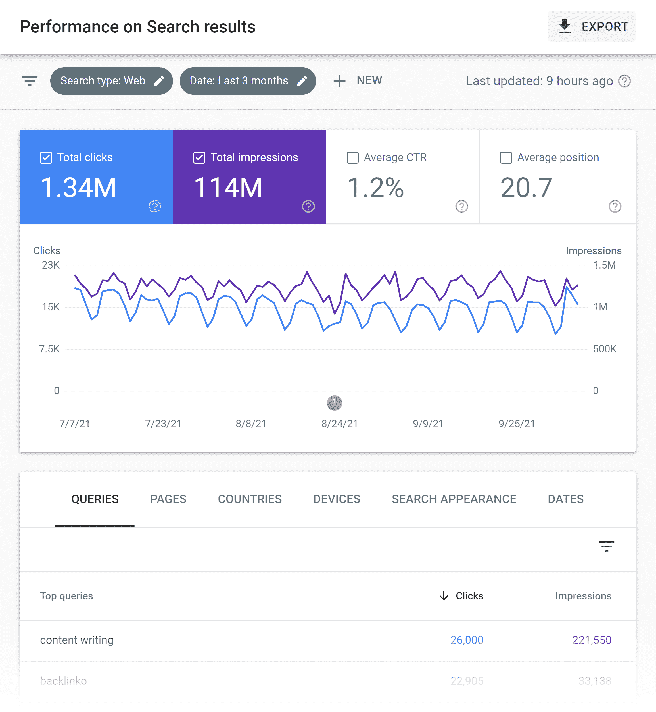</picture>

搜索控制台旨在帮助您跟踪您的网站在谷歌搜索中的表现。

这就是为什么它包含许多有用的功能，例如:

*   看看哪些关键词给你带来的流量最多
*   提交您的[网站地图](https://backlinko.com/hub/seo/sitemaps "Sitemaps")
*   修复网站错误
*   查看您的[页面体验](https://developers.google.com/search/docs/advanced/experience/page-experience)分数
*   更多

简而言之:如果你对 SEO 很认真，设置谷歌搜索控制台是关键的第一步。

**2。安装必应站长工具**

接下来，设置[必应站长工具](https://www.bing.com/toolbox/webmaster)。

<picture><source type="image/webp" srcset="https://api.backlinko.com/app/uploads/2021/10/bing-webmaster-tools.webp 1800w, https://api.backlinko.com/app/uploads/2021/10/bing-webmaster-tools-300x231.webp 300w, https://api.backlinko.com/app/uploads/2021/10/bing-webmaster-tools-1280x984.webp 1280w, https://api.backlinko.com/app/uploads/2021/10/bing-webmaster-tools-768x591.webp 768w, https://api.backlinko.com/app/uploads/2021/10/bing-webmaster-tools-1536x1181.webp 1536w, https://api.backlinko.com/app/uploads/2021/10/bing-webmaster-tools-480x369.webp 480w, https://api.backlinko.com/app/uploads/2021/10/bing-webmaster-tools-640x492.webp 640w, https://api.backlinko.com/app/uploads/2021/10/bing-webmaster-tools-960x738.webp 960w, https://api.backlinko.com/app/uploads/2021/10/bing-webmaster-tools-1440x1107.webp 1440w, https://api.backlinko.com/app/uploads/2021/10/bing-webmaster-tools-1600x1230.webp 1600w" sizes="(max-width: 600px) 100vw, 600px">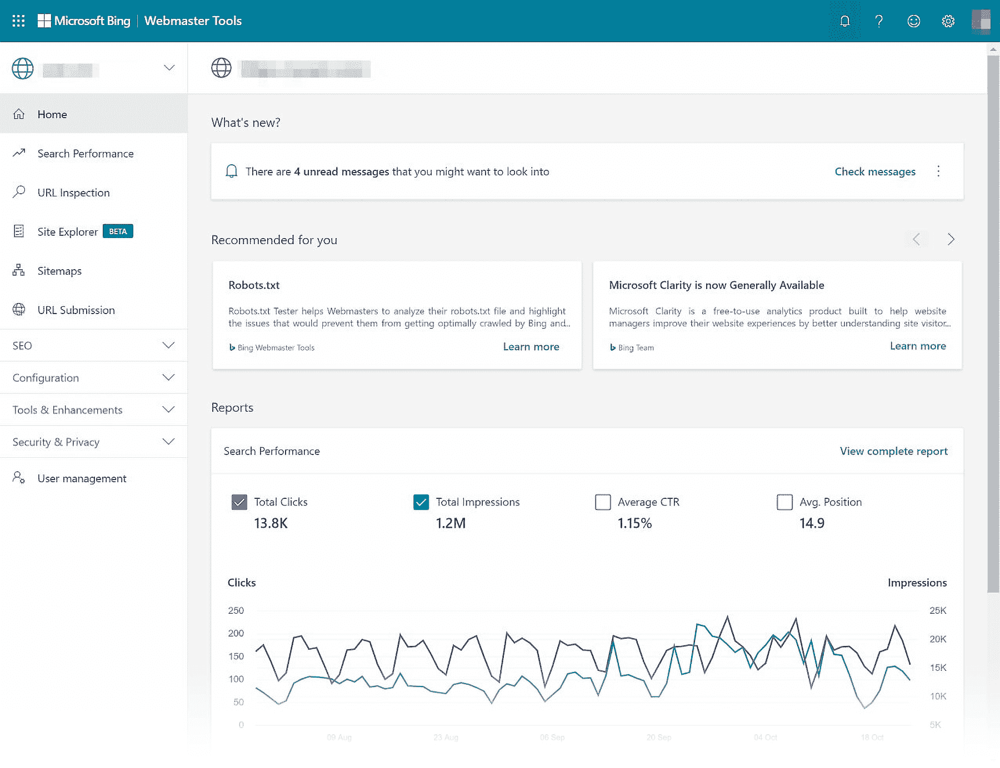</picture>

必应和谷歌一样受欢迎吗？没有，但是必应每月大约有 10 亿访客。所以值得优化。

另外，必应网站管理员工具有一些很棒的功能，比如内置的关键词搜索工具。

**3。设置谷歌分析**

谷歌分析是了解人们如何找到(和使用)你的网站的最好方式。

<picture><source type="image/webp" srcset="https://api.backlinko.com/app/uploads/2021/10/google-analytics.webp 2043w, https://api.backlinko.com/app/uploads/2021/10/google-analytics-300x160.webp 300w, https://api.backlinko.com/app/uploads/2021/10/google-analytics-1280x684.webp 1280w, https://api.backlinko.com/app/uploads/2021/10/google-analytics-768x411.webp 768w, https://api.backlinko.com/app/uploads/2021/10/google-analytics-1536x821.webp 1536w, https://api.backlinko.com/app/uploads/2021/10/google-analytics-480x257.webp 480w, https://api.backlinko.com/app/uploads/2021/10/google-analytics-640x342.webp 640w, https://api.backlinko.com/app/uploads/2021/10/google-analytics-960x513.webp 960w, https://api.backlinko.com/app/uploads/2021/10/google-analytics-1440x770.webp 1440w, https://api.backlinko.com/app/uploads/2021/10/google-analytics-1600x855.webp 1600w, https://api.backlinko.com/app/uploads/2021/10/google-analytics-1920x1026.webp 1920w" sizes="(max-width: 600px) 100vw, 600px">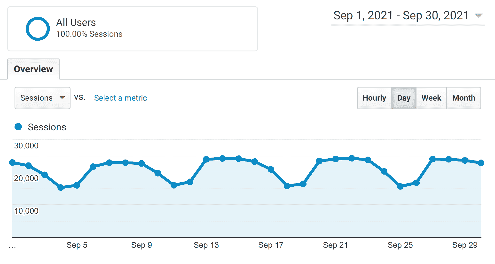</picture>

它的许多有用功能包括:

*   看看你从谷歌获得了多少流量
*   在你的网站上找到给你带来最大流量的网页
*   看看你的流量是否在增加(增加了多少)
*   找出其他给你带来流量的网站和搜索引擎
*   你的平均跳出率、页面浏览量和停留时间

**专业提示:**将谷歌分析与谷歌搜索控制台连接。当你这样做的时候，你将会从你的谷歌分析账户中看到有用的搜索引擎优化信息。

<picture><source type="image/webp" srcset="https://api.backlinko.com/app/uploads/2021/10/google-analytics-landing-pages.webp 2487w, https://api.backlinko.com/app/uploads/2021/10/google-analytics-landing-pages-300x284.webp 300w, https://api.backlinko.com/app/uploads/2021/10/google-analytics-landing-pages-1280x1212.webp 1280w, https://api.backlinko.com/app/uploads/2021/10/google-analytics-landing-pages-768x727.webp 768w, https://api.backlinko.com/app/uploads/2021/10/google-analytics-landing-pages-1536x1454.webp 1536w, https://api.backlinko.com/app/uploads/2021/10/google-analytics-landing-pages-2048x1939.webp 2048w, https://api.backlinko.com/app/uploads/2021/10/google-analytics-landing-pages-480x455.webp 480w, https://api.backlinko.com/app/uploads/2021/10/google-analytics-landing-pages-640x606.webp 640w, https://api.backlinko.com/app/uploads/2021/10/google-analytics-landing-pages-960x909.webp 960w, https://api.backlinko.com/app/uploads/2021/10/google-analytics-landing-pages-1440x1364.webp 1440w, https://api.backlinko.com/app/uploads/2021/10/google-analytics-landing-pages-1600x1515.webp 1600w, https://api.backlinko.com/app/uploads/2021/10/google-analytics-landing-pages-1920x1818.webp 1920w" sizes="(max-width: 600px) 100vw, 600px">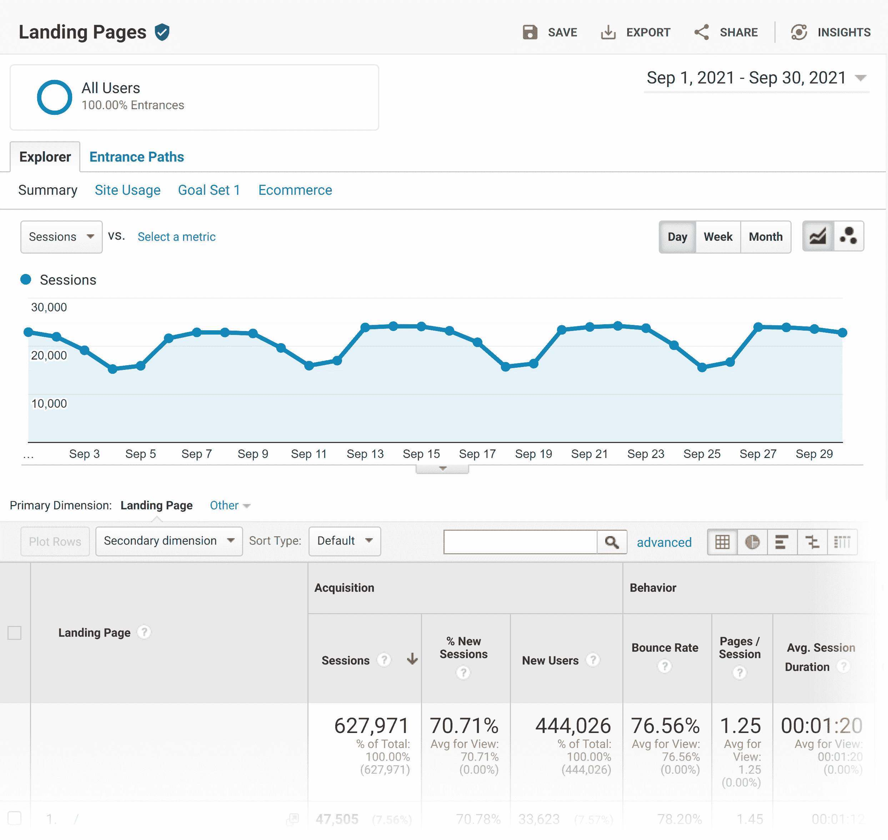</picture>

这里有一个资源可以带你完成设置的步骤。

**4。安装 Yoast SEO(仅限 WordPress 用户)**

Yoast 是这个星球上最流行的搜索引擎优化插件。

而且理由很充分。

Yoast 使得为搜索引擎优化你的 WordPress 站点变得非常容易。

<picture><source type="image/webp" srcset="https://api.backlinko.com/app/uploads/2021/10/yoast-seo-wordpress-plugin.webp 2484w, https://api.backlinko.com/app/uploads/2021/10/yoast-seo-wordpress-plugin-300x228.webp 300w, https://api.backlinko.com/app/uploads/2021/10/yoast-seo-wordpress-plugin-1280x974.webp 1280w, https://api.backlinko.com/app/uploads/2021/10/yoast-seo-wordpress-plugin-768x584.webp 768w, https://api.backlinko.com/app/uploads/2021/10/yoast-seo-wordpress-plugin-1536x1169.webp 1536w, https://api.backlinko.com/app/uploads/2021/10/yoast-seo-wordpress-plugin-2048x1558.webp 2048w, https://api.backlinko.com/app/uploads/2021/10/yoast-seo-wordpress-plugin-480x365.webp 480w, https://api.backlinko.com/app/uploads/2021/10/yoast-seo-wordpress-plugin-640x487.webp 640w, https://api.backlinko.com/app/uploads/2021/10/yoast-seo-wordpress-plugin-960x730.webp 960w, https://api.backlinko.com/app/uploads/2021/10/yoast-seo-wordpress-plugin-1440x1096.webp 1440w, https://api.backlinko.com/app/uploads/2021/10/yoast-seo-wordpress-plugin-1600x1217.webp 1600w, https://api.backlinko.com/app/uploads/2021/10/yoast-seo-wordpress-plugin-1920x1461.webp 1920w" sizes="(max-width: 550px) 100vw, 550px">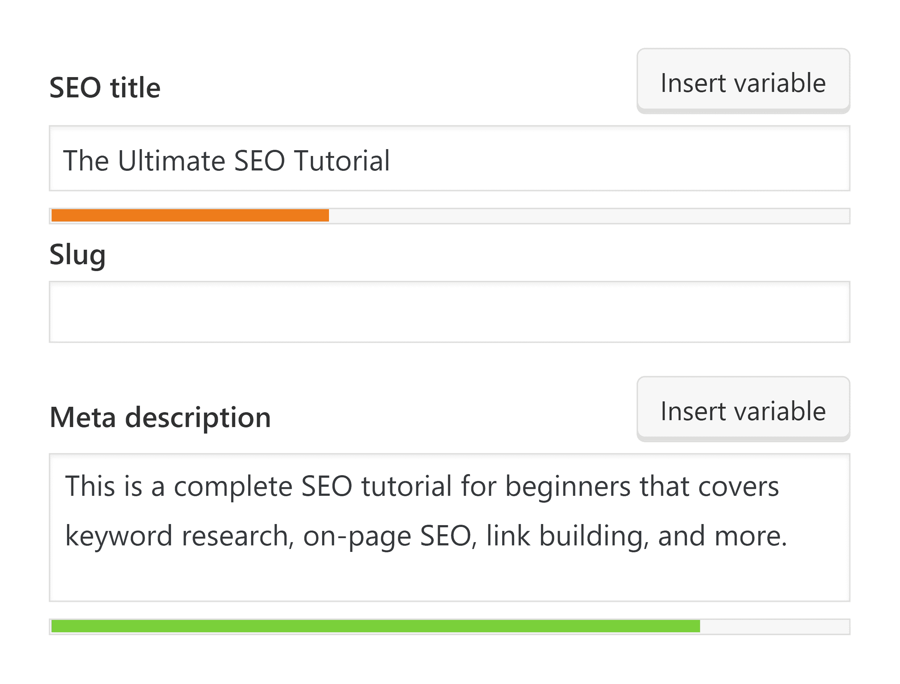</picture>

它还可以帮助你做技术搜索引擎优化，比如 T2 机器人和网站地图。推荐。

## **关键词研究清单** 

[关键词研究](https://backlinko.com/keyword-research)是 SEO 的基础。在这份清单中，我将向您展示如何快速找到您的客户搜索的关键词。

**1。用“谷歌建议”发现长尾关键词**

这是揭开[长尾关键词](https://backlinko.com/long-tail-keywords)的最好方法之一。

它是这样工作的:

首先，在谷歌里输入一个关键词。

<picture><source type="image/webp" srcset="https://api.backlinko.com/app/uploads/2020/12/google-search-link-building.webp 2560w, https://api.backlinko.com/app/uploads/2020/12/google-search-link-building-300x140.webp 300w, https://api.backlinko.com/app/uploads/2020/12/google-search-link-building-1280x597.webp 1280w, https://api.backlinko.com/app/uploads/2020/12/google-search-link-building-768x358.webp 768w, https://api.backlinko.com/app/uploads/2020/12/google-search-link-building-1536x716.webp 1536w, https://api.backlinko.com/app/uploads/2020/12/google-search-link-building-2048x955.webp 2048w, https://api.backlinko.com/app/uploads/2020/12/google-search-link-building-480x224.webp 480w, https://api.backlinko.com/app/uploads/2020/12/google-search-link-building-640x299.webp 640w, https://api.backlinko.com/app/uploads/2020/12/google-search-link-building-960x448.webp 960w, https://api.backlinko.com/app/uploads/2020/12/google-search-link-building-1440x672.webp 1440w, https://api.backlinko.com/app/uploads/2020/12/google-search-link-building-1600x746.webp 1600w, https://api.backlinko.com/app/uploads/2020/12/google-search-link-building-1920x896.webp 1920w" sizes="(max-width: 600px) 100vw, 600px">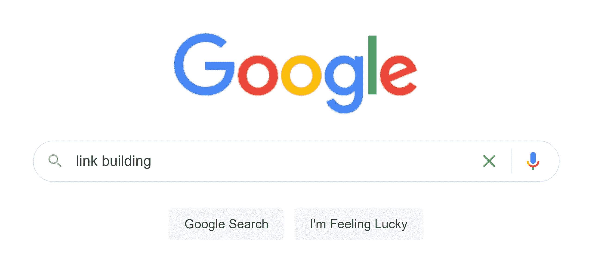</picture>

但是不要按回车…或者“谷歌搜索”按钮。相反，请查看谷歌向您展示的关键词:

<picture><source type="image/webp" srcset="https://api.backlinko.com/app/uploads/2021/05/google-search-link-building-suggestions.webp 2560w, https://api.backlinko.com/app/uploads/2021/05/google-search-link-building-suggestions-300x293.webp 300w, https://api.backlinko.com/app/uploads/2021/05/google-search-link-building-suggestions-1280x1252.webp 1280w, https://api.backlinko.com/app/uploads/2021/05/google-search-link-building-suggestions-768x751.webp 768w, https://api.backlinko.com/app/uploads/2021/05/google-search-link-building-suggestions-1536x1502.webp 1536w, https://api.backlinko.com/app/uploads/2021/05/google-search-link-building-suggestions-2048x2002.webp 2048w, https://api.backlinko.com/app/uploads/2021/05/google-search-link-building-suggestions-480x469.webp 480w, https://api.backlinko.com/app/uploads/2021/05/google-search-link-building-suggestions-640x626.webp 640w, https://api.backlinko.com/app/uploads/2021/05/google-search-link-building-suggestions-960x939.webp 960w, https://api.backlinko.com/app/uploads/2021/05/google-search-link-building-suggestions-1440x1408.webp 1440w, https://api.backlinko.com/app/uploads/2021/05/google-search-link-building-suggestions-1600x1564.webp 1600w, https://api.backlinko.com/app/uploads/2021/05/google-search-link-building-suggestions-1920x1877.webp 1920w" sizes="(max-width: 600px) 100vw, 600px">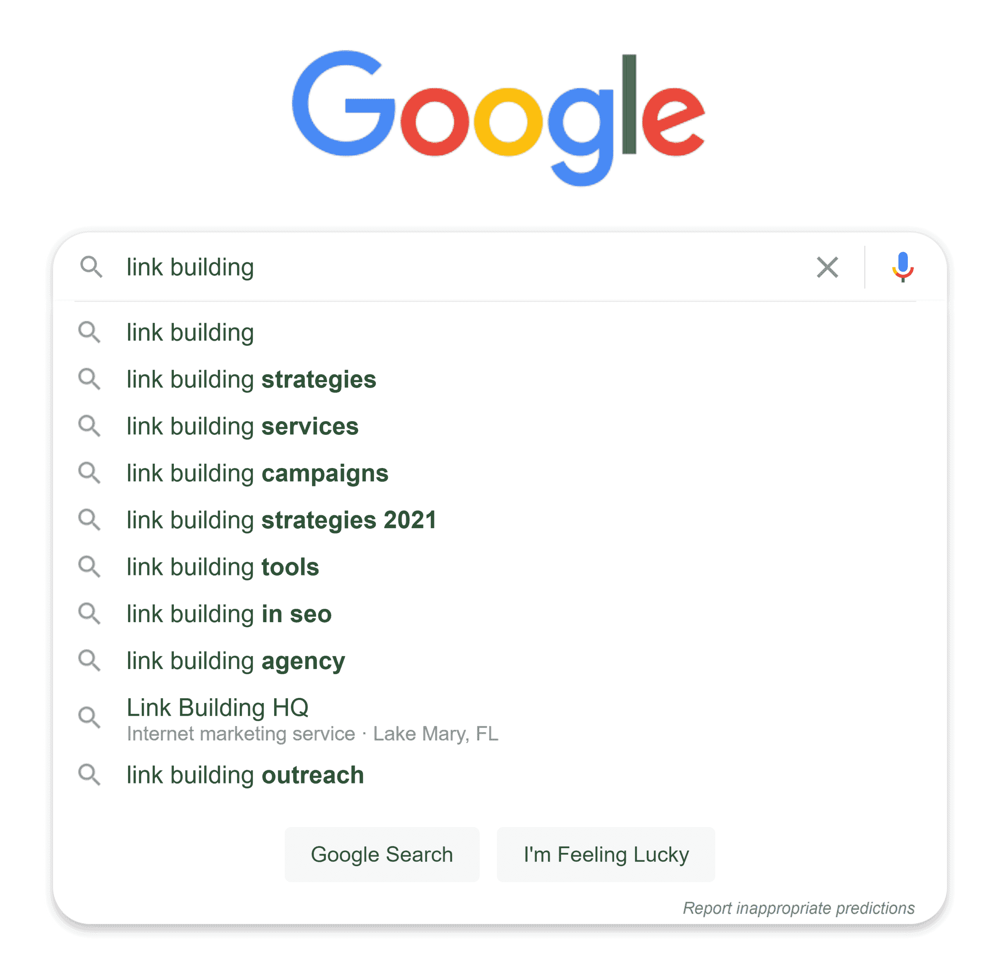</picture>

(这些被称为“谷歌建议”关键词。)

因为这些关键词直接来自谷歌，你知道人们正在搜索它们。

这意味着，他们使伟大的关键字来优化您的网站。

**亲提示:**退房[关键字 tool.io](https://keywordtool.io/) 。这个工具抓取 Google Suggest 关键字，这使得这个过程更容易扩展。

<picture><source type="image/webp" srcset="https://api.backlinko.com/app/uploads/2021/05/keywordtool-io.webp 2000w, https://api.backlinko.com/app/uploads/2021/05/keywordtool-io-300x195.webp 300w, https://api.backlinko.com/app/uploads/2021/05/keywordtool-io-1280x834.webp 1280w, https://api.backlinko.com/app/uploads/2021/05/keywordtool-io-768x500.webp 768w, https://api.backlinko.com/app/uploads/2021/05/keywordtool-io-1536x1001.webp 1536w, https://api.backlinko.com/app/uploads/2021/05/keywordtool-io-480x313.webp 480w, https://api.backlinko.com/app/uploads/2021/05/keywordtool-io-640x417.webp 640w, https://api.backlinko.com/app/uploads/2021/05/keywordtool-io-960x625.webp 960w, https://api.backlinko.com/app/uploads/2021/05/keywordtool-io-1440x938.webp 1440w, https://api.backlinko.com/app/uploads/2021/05/keywordtool-io-1600x1042.webp 1600w, https://api.backlinko.com/app/uploads/2021/05/keywordtool-io-1920x1251.webp 1920w" sizes="(max-width: 600px) 100vw, 600px">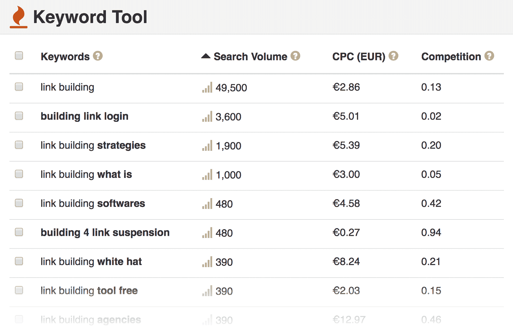</picture>

**2。在谷歌关键词规划器中找到可靠的关键词**

[谷歌关键词规划器](https://adwords.google.com/home/tools/keyword-planner/)是谷歌官方的关键词研究工具。

<picture><source type="image/webp" srcset="https://api.backlinko.com/app/uploads/2021/08/google-keyword-planner-results.webp 2412w, https://api.backlinko.com/app/uploads/2021/08/google-keyword-planner-results-300x391.webp 300w, https://api.backlinko.com/app/uploads/2021/08/google-keyword-planner-results-1280x1670.webp 1280w, https://api.backlinko.com/app/uploads/2021/08/google-keyword-planner-results-768x1002.webp 768w, https://api.backlinko.com/app/uploads/2021/08/google-keyword-planner-results-1177x1536.webp 1177w, https://api.backlinko.com/app/uploads/2021/08/google-keyword-planner-results-1570x2048.webp 1570w, https://api.backlinko.com/app/uploads/2021/08/google-keyword-planner-results-480x626.webp 480w, https://api.backlinko.com/app/uploads/2021/08/google-keyword-planner-results-640x835.webp 640w, https://api.backlinko.com/app/uploads/2021/08/google-keyword-planner-results-960x1253.webp 960w, https://api.backlinko.com/app/uploads/2021/08/google-keyword-planner-results-1440x1879.webp 1440w, https://api.backlinko.com/app/uploads/2021/08/google-keyword-planner-results-1600x2088.webp 1600w, https://api.backlinko.com/app/uploads/2021/08/google-keyword-planner-results-1920x2505.webp 1920w" sizes="(max-width: 600px) 100vw, 600px">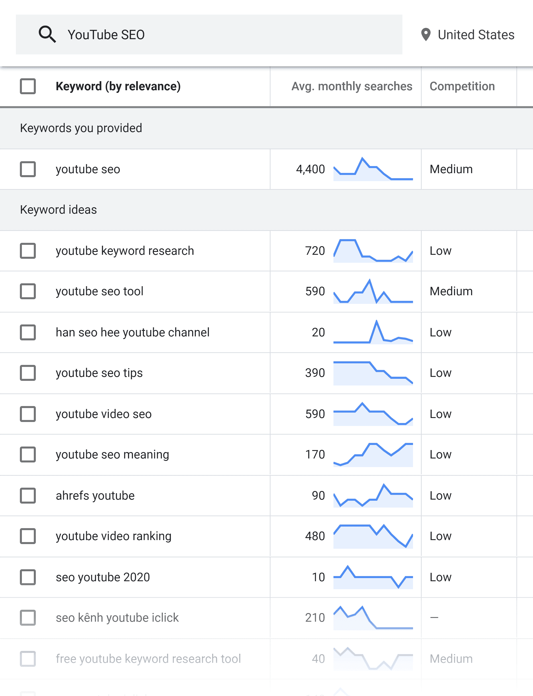</picture>

这是专门为谷歌广告设计的。也就是说，对于 SEO 关键词研究还是很有用的。

毕竟，数据直接来自谷歌。所以你知道它超级准确。

这里有一个使用谷歌关键词规划器进行搜索引擎优化的指南。

**3。进入网上社区** 

Reddit、Quora、论坛和其他在线社区是寻找关键词的绝佳场所。

我制作了一个视频，向你展示如何在这些社区中找到未开发的关键词(一步一步)。

给你:

**4。使用 KWFinder** 识别低竞争关键词

[KWFinder](https://app.kwfinder.com) 是一款免费的关键词研究工具。

KWFinder 的独特之处在于，它为您提供了关于每个关键字的大量数据。

<picture><source type="image/webp" srcset="https://api.backlinko.com/app/uploads/2018/04/kwfinder-1.webp 1436w, https://api.backlinko.com/app/uploads/2018/04/kwfinder-1-300x287.webp 300w, https://api.backlinko.com/app/uploads/2018/04/kwfinder-1-1280x1225.webp 1280w, https://api.backlinko.com/app/uploads/2018/04/kwfinder-1-768x735.webp 768w, https://api.backlinko.com/app/uploads/2018/04/kwfinder-1-480x459.webp 480w, https://api.backlinko.com/app/uploads/2018/04/kwfinder-1-640x612.webp 640w, https://api.backlinko.com/app/uploads/2018/04/kwfinder-1-960x919.webp 960w" sizes="(max-width: 600px) 100vw, 600px">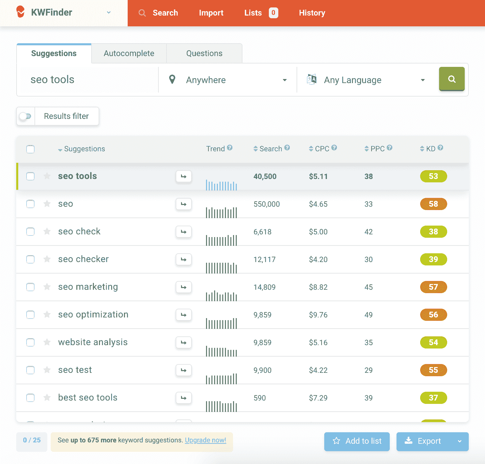</picture>

正如您所看到的，当您在 KWFinder 中键入一个关键字时，您会得到以下信息:

*   搜索量
*   关键词难度
*   中国共产党（the Communist Party of China）
*   趋势
*   估计访问量

这样，你可以选择低竞争的关键字，很容易排名。

**5。用** 找到【问题关键词】回答公众

问题关键词非常适合博客帖子和文章。

(比如:“你是怎么做冷冲咖啡的？”)

而且你用[答公](https://answerthepublic.com/)就能轻松找到他们。

这个免费工具向你展示人们在网上搜索的问题。

<picture><source type="image/webp" srcset="https://api.backlinko.com/app/uploads/2019/12/answerthepublic-paleo-questions.webp 1200w, https://api.backlinko.com/app/uploads/2019/12/answerthepublic-paleo-questions-300x279.webp 300w, https://api.backlinko.com/app/uploads/2019/12/answerthepublic-paleo-questions-768x714.webp 768w, https://api.backlinko.com/app/uploads/2019/12/answerthepublic-paleo-questions-480x446.webp 480w, https://api.backlinko.com/app/uploads/2019/12/answerthepublic-paleo-questions-640x595.webp 640w, https://api.backlinko.com/app/uploads/2019/12/answerthepublic-paleo-questions-960x893.webp 960w" sizes="(max-width: 600px) 100vw, 600px">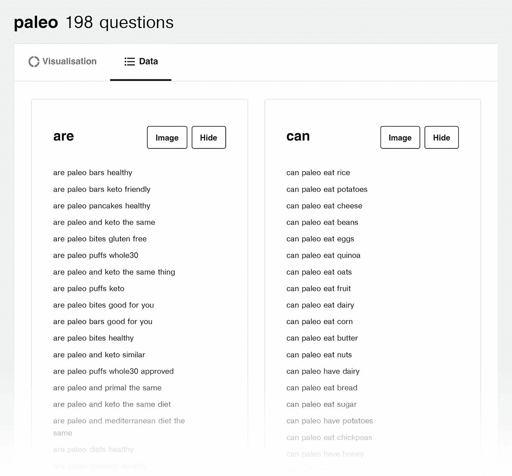</picture>

这样，你就可以用你的内容来回答这些问题。

## **页面搜索引擎优化清单**

现在是时候使用一些经过测试的页面搜索引擎优化技术来优化你的内容了。

**1。在你的网址中加入你的关键词** 

你的网址有助于谷歌理解你的网页是怎么回事。另外，一个关键词丰富的网址可以提高你的有机点击率。

<picture><source type="image/webp" srcset="https://api.backlinko.com/app/uploads/2019/12/keyword-rich-urls-correlate-with-a-higher-organic-ctr.webp 1400w, https://api.backlinko.com/app/uploads/2019/12/keyword-rich-urls-correlate-with-a-higher-organic-ctr-300x226.webp 300w, https://api.backlinko.com/app/uploads/2019/12/keyword-rich-urls-correlate-with-a-higher-organic-ctr-1280x965.webp 1280w, https://api.backlinko.com/app/uploads/2019/12/keyword-rich-urls-correlate-with-a-higher-organic-ctr-768x579.webp 768w, https://api.backlinko.com/app/uploads/2019/12/keyword-rich-urls-correlate-with-a-higher-organic-ctr-480x362.webp 480w, https://api.backlinko.com/app/uploads/2019/12/keyword-rich-urls-correlate-with-a-higher-organic-ctr-640x483.webp 640w, https://api.backlinko.com/app/uploads/2019/12/keyword-rich-urls-correlate-with-a-higher-organic-ctr-960x724.webp 960w" sizes="(max-width: 700px) 100vw, 700px">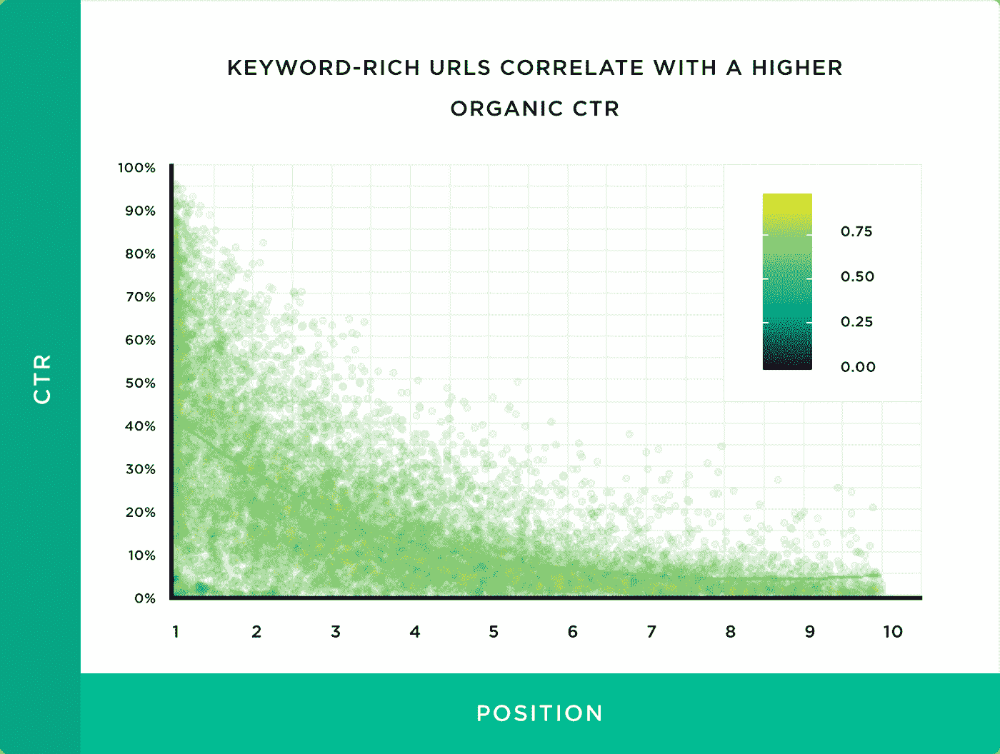</picture>

这就是为什么你想包括你的关键字在你的网址。

比如我对[这个页面](https://backlinko.com/seo-checklist "The Complete SEO Checklist")的目标关键词是“SEO 清单”。

所以我做了网址:backlinko.com/seo-checklist.

简单。

**2。使用短网址**

尽可能保持你的网址简短。

为什么？

最近对 1180 万个谷歌搜索结果的分析发现，[短网址在谷歌](https://backlinko.com/search-engine-ranking)中排名最好。

<picture><source type="image/webp" srcset="https://api.backlinko.com/app/uploads/2020/03/short-urls-tend-to-outrank-long-urls.webp 2200w, https://api.backlinko.com/app/uploads/2020/03/short-urls-tend-to-outrank-long-urls-300x213.webp 300w, https://api.backlinko.com/app/uploads/2020/03/short-urls-tend-to-outrank-long-urls-1280x909.webp 1280w, https://api.backlinko.com/app/uploads/2020/03/short-urls-tend-to-outrank-long-urls-768x545.webp 768w, https://api.backlinko.com/app/uploads/2020/03/short-urls-tend-to-outrank-long-urls-1536x1091.webp 1536w, https://api.backlinko.com/app/uploads/2020/03/short-urls-tend-to-outrank-long-urls-2048x1454.webp 2048w, https://api.backlinko.com/app/uploads/2020/03/short-urls-tend-to-outrank-long-urls-480x341.webp 480w, https://api.backlinko.com/app/uploads/2020/03/short-urls-tend-to-outrank-long-urls-640x454.webp 640w, https://api.backlinko.com/app/uploads/2020/03/short-urls-tend-to-outrank-long-urls-960x682.webp 960w, https://api.backlinko.com/app/uploads/2020/03/short-urls-tend-to-outrank-long-urls-1440x1022.webp 1440w, https://api.backlinko.com/app/uploads/2020/03/short-urls-tend-to-outrank-long-urls-1600x1136.webp 1600w, https://api.backlinko.com/app/uploads/2020/03/short-urls-tend-to-outrank-long-urls-1920x1363.webp 1920w" sizes="(max-width: 700px) 100vw, 700px">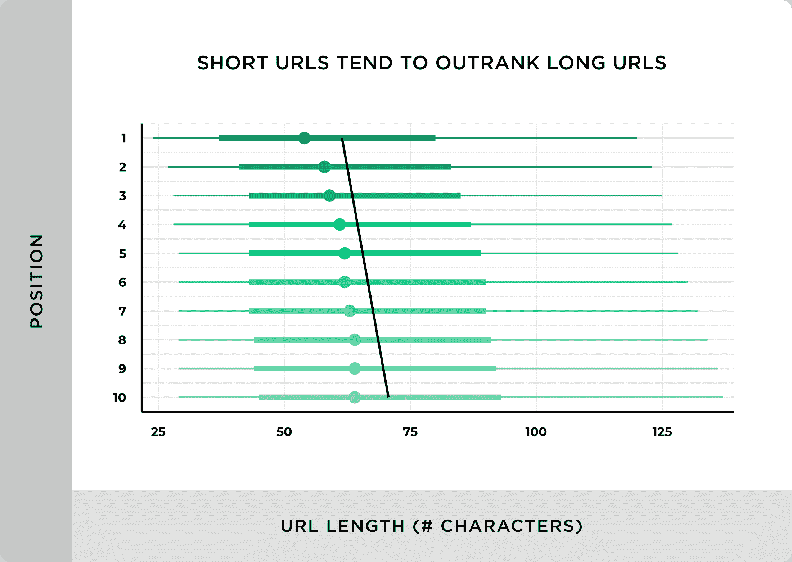</picture>

**3。在标题标签中前置你的关键词**

众所周知，你应该在你的标题标签中使用关键字。

但是没有多少人知道你把关键词放在哪里很重要。

具体来说，你应该尽可能将关键词放在标题标签的前面。

比如我对[这篇帖子](https://backlinko.com/copywriting-guide "Copywriting: The Definitive Guide")的主要关键词是“文案”:

<picture><source type="image/webp" srcset="https://api.backlinko.com/app/uploads/2020/12/backlinko-copywriting-guide-2021.webp 2560w, https://api.backlinko.com/app/uploads/2020/12/backlinko-copywriting-guide-2021-300x218.webp 300w, https://api.backlinko.com/app/uploads/2020/12/backlinko-copywriting-guide-2021-1280x931.webp 1280w, https://api.backlinko.com/app/uploads/2020/12/backlinko-copywriting-guide-2021-768x558.webp 768w, https://api.backlinko.com/app/uploads/2020/12/backlinko-copywriting-guide-2021-1536x1117.webp 1536w, https://api.backlinko.com/app/uploads/2020/12/backlinko-copywriting-guide-2021-2048x1489.webp 2048w, https://api.backlinko.com/app/uploads/2020/12/backlinko-copywriting-guide-2021-480x349.webp 480w, https://api.backlinko.com/app/uploads/2020/12/backlinko-copywriting-guide-2021-640x465.webp 640w, https://api.backlinko.com/app/uploads/2020/12/backlinko-copywriting-guide-2021-960x698.webp 960w, https://api.backlinko.com/app/uploads/2020/12/backlinko-copywriting-guide-2021-1440x1047.webp 1440w, https://api.backlinko.com/app/uploads/2020/12/backlinko-copywriting-guide-2021-1600x1163.webp 1600w, https://api.backlinko.com/app/uploads/2020/12/backlinko-copywriting-guide-2021-1920x1396.webp 1920w" sizes="(max-width: 600px) 100vw, 600px">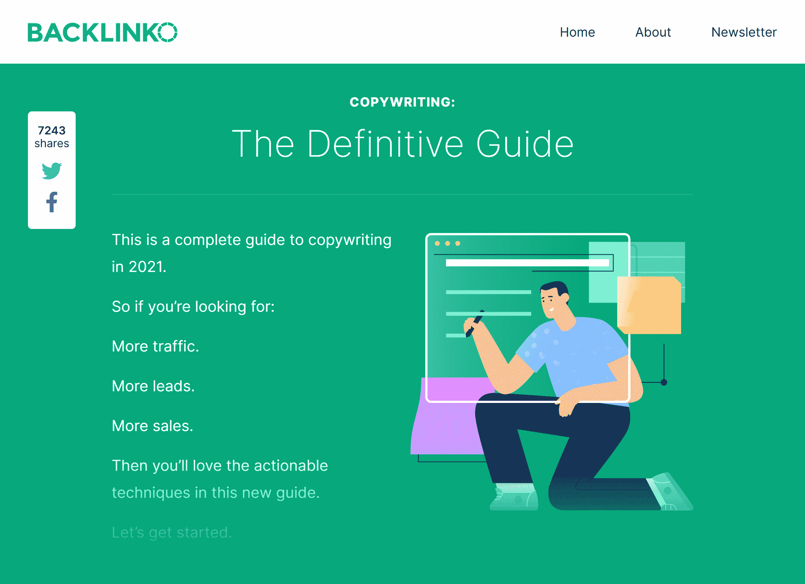</picture>

如您所见，我的标题标签以关键字开始:

<picture><source type="image/webp" srcset="https://api.backlinko.com/app/uploads/2021/10/copywriting-guide-keyword-in-title.webp 2394w, https://api.backlinko.com/app/uploads/2021/10/copywriting-guide-keyword-in-title-300x76.webp 300w, https://api.backlinko.com/app/uploads/2021/10/copywriting-guide-keyword-in-title-1280x322.webp 1280w, https://api.backlinko.com/app/uploads/2021/10/copywriting-guide-keyword-in-title-768x193.webp 768w, https://api.backlinko.com/app/uploads/2021/10/copywriting-guide-keyword-in-title-1536x387.webp 1536w, https://api.backlinko.com/app/uploads/2021/10/copywriting-guide-keyword-in-title-2048x516.webp 2048w, https://api.backlinko.com/app/uploads/2021/10/copywriting-guide-keyword-in-title-480x121.webp 480w, https://api.backlinko.com/app/uploads/2021/10/copywriting-guide-keyword-in-title-640x161.webp 640w, https://api.backlinko.com/app/uploads/2021/10/copywriting-guide-keyword-in-title-960x242.webp 960w, https://api.backlinko.com/app/uploads/2021/10/copywriting-guide-keyword-in-title-1440x363.webp 1440w, https://api.backlinko.com/app/uploads/2021/10/copywriting-guide-keyword-in-title-1600x403.webp 1600w, https://api.backlinko.com/app/uploads/2021/10/copywriting-guide-keyword-in-title-1920x484.webp 1920w" sizes="(max-width: 600px) 100vw, 600px">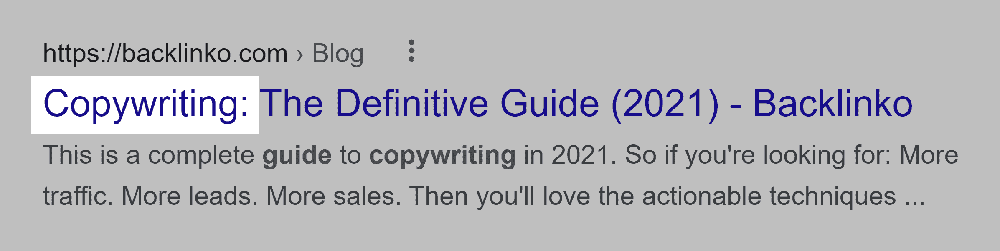</picture>

**4。嵌入标题标签修饰符** 

标题标签修饰语是添加到标题标签的单词和短语。

当你这样做的时候，你的页面可以为很多不同的长尾关键词排名。

下面的视频将带您了解这一过程:

**5。在前 150 个单词中使用一次关键字**

谷歌更看重你页面的前 100-150 个单词。

因此，请确保在这里使用一次您的关键字。

例如，对于[我的 SEO 工具帖子](https://backlinko.com/seo-tools "SEO Tools")，你可以看到我马上使用了术语“SEO 工具”:

<picture><source type="image/webp" srcset="https://api.backlinko.com/app/uploads/2021/10/seo-tools-keyword-at-start.webp 2500w, https://api.backlinko.com/app/uploads/2021/10/seo-tools-keyword-at-start-300x150.webp 300w, https://api.backlinko.com/app/uploads/2021/10/seo-tools-keyword-at-start-1280x638.webp 1280w, https://api.backlinko.com/app/uploads/2021/10/seo-tools-keyword-at-start-768x383.webp 768w, https://api.backlinko.com/app/uploads/2021/10/seo-tools-keyword-at-start-1536x766.webp 1536w, https://api.backlinko.com/app/uploads/2021/10/seo-tools-keyword-at-start-2048x1022.webp 2048w, https://api.backlinko.com/app/uploads/2021/10/seo-tools-keyword-at-start-480x239.webp 480w, https://api.backlinko.com/app/uploads/2021/10/seo-tools-keyword-at-start-640x319.webp 640w, https://api.backlinko.com/app/uploads/2021/10/seo-tools-keyword-at-start-960x479.webp 960w, https://api.backlinko.com/app/uploads/2021/10/seo-tools-keyword-at-start-1440x718.webp 1440w, https://api.backlinko.com/app/uploads/2021/10/seo-tools-keyword-at-start-1600x798.webp 1600w, https://api.backlinko.com/app/uploads/2021/10/seo-tools-keyword-at-start-1920x958.webp 1920w" sizes="(max-width: 600px) 100vw, 600px">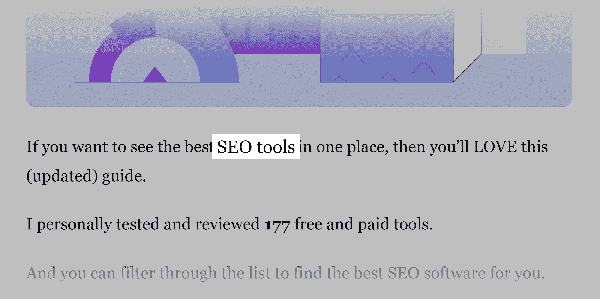</picture>

**6。在 H1、H2 或 H3 标签中使用您的关键词**

确保在 H1、H2 或 H3 标签中包含您的关键词。

例如:

您可能已经注意到，我在本页的第一个副标题中包含了术语“ [SEO 清单](https://www.semrush.com/blog/seo-checklist/ "The Ultimate SEO Checklist")”:

<picture><source type="image/webp" srcset="https://api.backlinko.com/app/uploads/2020/12/seo-checklist-keyword-in-h2-tag.webp 2560w, https://api.backlinko.com/app/uploads/2020/12/seo-checklist-keyword-in-h2-tag-300x161.webp 300w, https://api.backlinko.com/app/uploads/2020/12/seo-checklist-keyword-in-h2-tag-1280x686.webp 1280w, https://api.backlinko.com/app/uploads/2020/12/seo-checklist-keyword-in-h2-tag-768x412.webp 768w, https://api.backlinko.com/app/uploads/2020/12/seo-checklist-keyword-in-h2-tag-1536x823.webp 1536w, https://api.backlinko.com/app/uploads/2020/12/seo-checklist-keyword-in-h2-tag-2048x1098.webp 2048w, https://api.backlinko.com/app/uploads/2020/12/seo-checklist-keyword-in-h2-tag-480x257.webp 480w, https://api.backlinko.com/app/uploads/2020/12/seo-checklist-keyword-in-h2-tag-640x343.webp 640w, https://api.backlinko.com/app/uploads/2020/12/seo-checklist-keyword-in-h2-tag-960x515.webp 960w, https://api.backlinko.com/app/uploads/2020/12/seo-checklist-keyword-in-h2-tag-1440x772.webp 1440w, https://api.backlinko.com/app/uploads/2020/12/seo-checklist-keyword-in-h2-tag-1600x858.webp 1600w, https://api.backlinko.com/app/uploads/2020/12/seo-checklist-keyword-in-h2-tag-1920x1029.webp 1920w" sizes="(max-width: 550px) 100vw, 550px">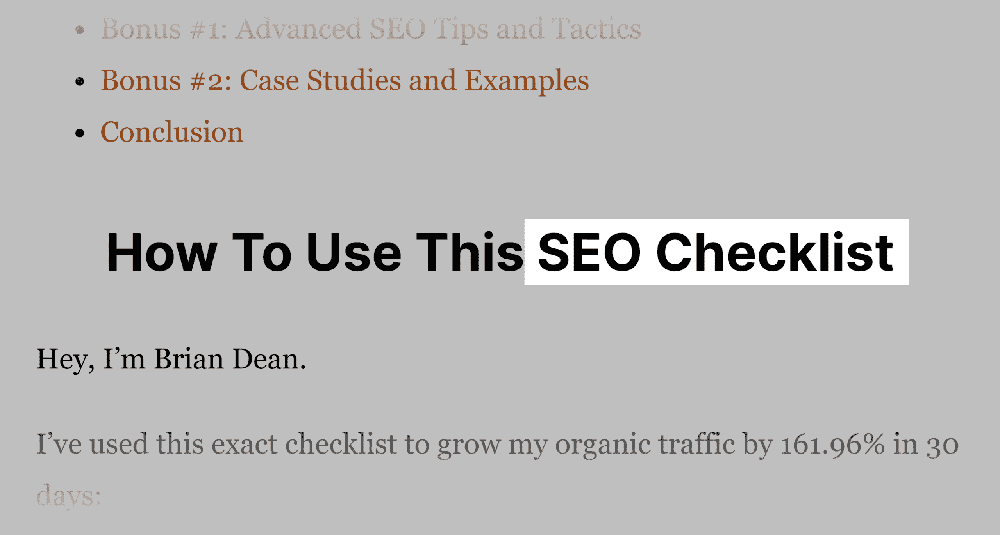</picture>

这个副标题被 H2 标签包了起来。在 H2 中包含“SEO 清单”可以帮助我提高这个关键词的排名。

也就是说:

这条建议不会对你的谷歌排名产生很大影响。

但是说到[搜索引擎优化](https://backlinko.com/hub/seo/what-is-seo "What is SEO? Search Engine Optimization In Plain English")，一点一滴都有帮助。

**7。优化图像**

你使用的图片说明了你的内容。

不幸的是，谷歌仍然不能像人类一样“看到”图像。

所以为了帮助他们理解你的图片，你需要优化你的图片标签和文件名。

(作为奖励:优化的图片也有助于你在图片搜索中排名。)

方法如下:

首先，当您保存图像时，使用一个简要描述该图像的文件名。

举个例子，假设你刚刚用 iPhone 拍了一张菠菜煎蛋的照片。

嗯，你可能想给这张图片起个名字，比如:

**菠菜 _ 煎蛋卷. png**

然后，当您将图像添加到页面时，为其指定一个描述性的 alt 标记:

<picture><source type="image/webp" srcset="https://api.backlinko.com/app/uploads/2020/12/descriptive-alt-tag-on-image.webp 2500w, https://api.backlinko.com/app/uploads/2020/12/descriptive-alt-tag-on-image-300x181.webp 300w, https://api.backlinko.com/app/uploads/2020/12/descriptive-alt-tag-on-image-1280x772.webp 1280w, https://api.backlinko.com/app/uploads/2020/12/descriptive-alt-tag-on-image-768x463.webp 768w, https://api.backlinko.com/app/uploads/2020/12/descriptive-alt-tag-on-image-1536x926.webp 1536w, https://api.backlinko.com/app/uploads/2020/12/descriptive-alt-tag-on-image-2048x1235.webp 2048w, https://api.backlinko.com/app/uploads/2020/12/descriptive-alt-tag-on-image-480x289.webp 480w, https://api.backlinko.com/app/uploads/2020/12/descriptive-alt-tag-on-image-640x386.webp 640w, https://api.backlinko.com/app/uploads/2020/12/descriptive-alt-tag-on-image-960x579.webp 960w, https://api.backlinko.com/app/uploads/2020/12/descriptive-alt-tag-on-image-1440x868.webp 1440w, https://api.backlinko.com/app/uploads/2020/12/descriptive-alt-tag-on-image-1600x964.webp 1600w, https://api.backlinko.com/app/uploads/2020/12/descriptive-alt-tag-on-image-1920x1157.webp 1920w" sizes="(max-width: 550px) 100vw, 550px">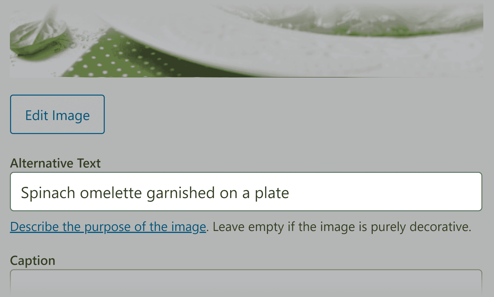</picture>

这就是全部了。

**8。使用同义词和 LSI 关键字**

过去，在你的页面中添加关键词是有意义的。

不再

今天，谷歌很聪明。

因此，与其使用同一个关键字 1000 次，不如使用同义词和 [LSI 关键字](https://backlinko.com/hub/seo/lsi)。

举个例子，假设你想对“如何开博客”进行排名。

好吧，你会想在你的页面上几次提到那个确切的关键词…还有同义词，比如:

*   如何创建博客
*   开始写博客
*   如何创建博客
*   如何在 WordPress 上创建博客

你明白了吗🙂

接下来，添加一些 LSI 关键字。

LSI 关键字是与您的主要关键字一起出现的术语。

你可以使用[LSIGraph.com](https://lsigraph.com/)找到一堆这样的东西。

<picture><source type="image/webp" srcset="https://api.backlinko.com/app/uploads/2018/04/lsi-graph.webp 1440w, https://api.backlinko.com/app/uploads/2018/04/lsi-graph-300x238.webp 300w, https://api.backlinko.com/app/uploads/2018/04/lsi-graph-1280x1017.webp 1280w, https://api.backlinko.com/app/uploads/2018/04/lsi-graph-768x610.webp 768w, https://api.backlinko.com/app/uploads/2018/04/lsi-graph-480x381.webp 480w, https://api.backlinko.com/app/uploads/2018/04/lsi-graph-640x508.webp 640w, https://api.backlinko.com/app/uploads/2018/04/lsi-graph-960x763.webp 960w" sizes="(max-width: 600px) 100vw, 600px">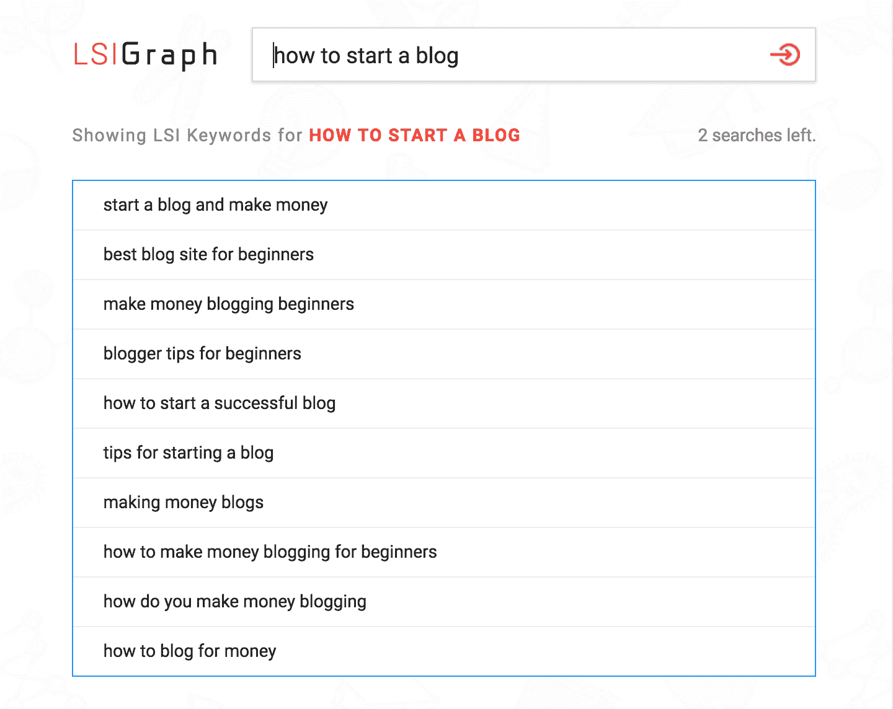</picture>

然后，只需在你的页面中添加一些 LSI 关键字。你已经准备好了。

**9。使用外部链接**

确保在你的文章中链接到 5-8 个权威网站。

例如，在[这个 SEO 技术列表](https://backlinko.com/seo-techniques)中，我链接到了可信的网站，比如维基百科和 Google.com。

<picture><source type="image/webp" srcset="https://api.backlinko.com/app/uploads/2021/10/seo-techniques-post-external-links.webp 2481w, https://api.backlinko.com/app/uploads/2021/10/seo-techniques-post-external-links-300x220.webp 300w, https://api.backlinko.com/app/uploads/2021/10/seo-techniques-post-external-links-1280x940.webp 1280w, https://api.backlinko.com/app/uploads/2021/10/seo-techniques-post-external-links-768x564.webp 768w, https://api.backlinko.com/app/uploads/2021/10/seo-techniques-post-external-links-1536x1128.webp 1536w, https://api.backlinko.com/app/uploads/2021/10/seo-techniques-post-external-links-2048x1504.webp 2048w, https://api.backlinko.com/app/uploads/2021/10/seo-techniques-post-external-links-480x353.webp 480w, https://api.backlinko.com/app/uploads/2021/10/seo-techniques-post-external-links-640x470.webp 640w, https://api.backlinko.com/app/uploads/2021/10/seo-techniques-post-external-links-960x705.webp 960w, https://api.backlinko.com/app/uploads/2021/10/seo-techniques-post-external-links-1440x1058.webp 1440w, https://api.backlinko.com/app/uploads/2021/10/seo-techniques-post-external-links-1600x1175.webp 1600w, https://api.backlinko.com/app/uploads/2021/10/seo-techniques-post-external-links-1920x1410.webp 1920w" sizes="(max-width: 600px) 100vw, 600px">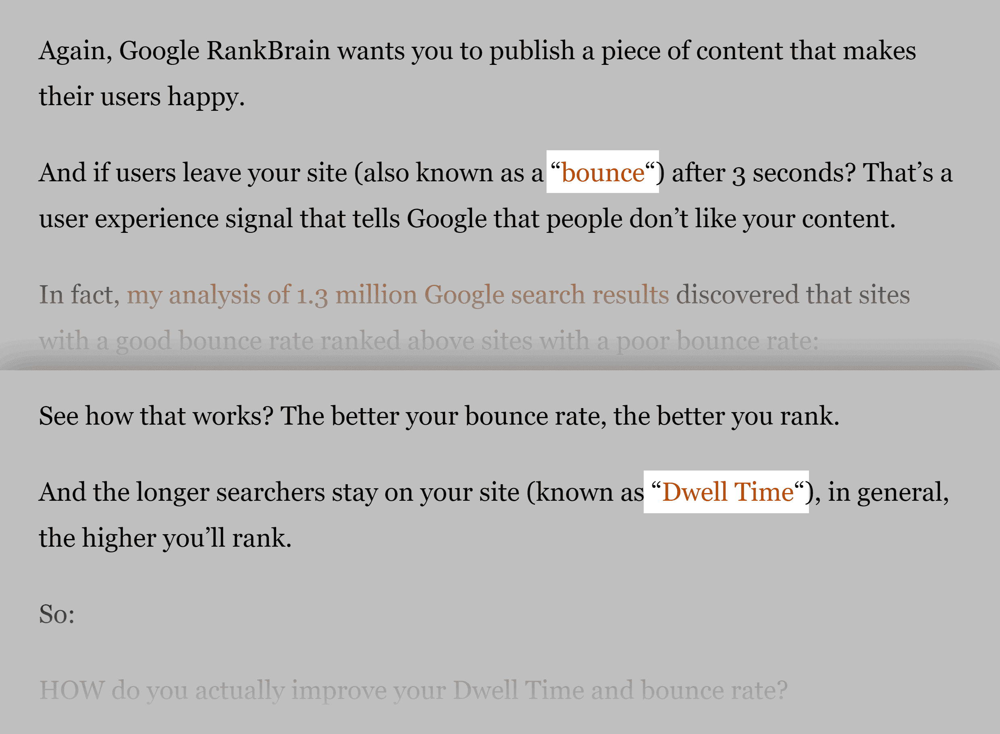</picture>

这些链接向谷歌表明，我的内容被很好地引用，值得信赖。

10。使用内部链接

这非常简单:

每当你发布一个新的内容，链接到你网站上的 2-5 个其他页面。

专业提示:在内部链接中使用关键词丰富的锚文本。

例如，请注意我是如何在这个内部链接中使用锚文本“页面搜索引擎优化”的:

<picture><source type="image/webp" srcset="https://api.backlinko.com/app/uploads/2021/10/seo-techniques-post-internal-link.webp 2350w, https://api.backlinko.com/app/uploads/2021/10/seo-techniques-post-internal-link-300x139.webp 300w, https://api.backlinko.com/app/uploads/2021/10/seo-techniques-post-internal-link-1280x594.webp 1280w, https://api.backlinko.com/app/uploads/2021/10/seo-techniques-post-internal-link-768x357.webp 768w, https://api.backlinko.com/app/uploads/2021/10/seo-techniques-post-internal-link-1536x713.webp 1536w, https://api.backlinko.com/app/uploads/2021/10/seo-techniques-post-internal-link-2048x951.webp 2048w, https://api.backlinko.com/app/uploads/2021/10/seo-techniques-post-internal-link-480x223.webp 480w, https://api.backlinko.com/app/uploads/2021/10/seo-techniques-post-internal-link-640x297.webp 640w, https://api.backlinko.com/app/uploads/2021/10/seo-techniques-post-internal-link-960x446.webp 960w, https://api.backlinko.com/app/uploads/2021/10/seo-techniques-post-internal-link-1440x669.webp 1440w, https://api.backlinko.com/app/uploads/2021/10/seo-techniques-post-internal-link-1600x743.webp 1600w, https://api.backlinko.com/app/uploads/2021/10/seo-techniques-post-internal-link-1920x891.webp 1920w" sizes="(max-width: 600px) 100vw, 600px">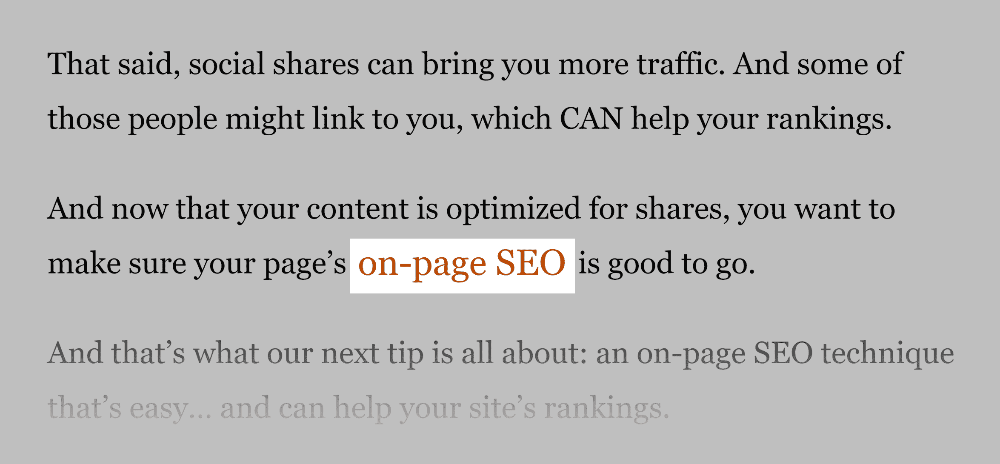</picture>

这告诉搜索引擎我链接的页面是关于“页面搜索引擎优化”的。

## **技术 SEO 清单** 

技术搜索引擎优化可以提高或降低你的排名。幸运的是，解决技术上的 SEO 问题并不困难…尤其是如果你按照这个清单上的项目去做的话。

**1。识别抓取错误** 

一个“[抓取错误](https://support.google.com/webmasters/answer/35120?hl=en)”意味着谷歌在你的网站上查看一个页面有问题。

如果他们看不到你的页面，它不会有任何排名。

你可以很容易地在谷歌搜索控制台的“覆盖率”报告中找到抓取错误:

<picture><source type="image/webp" srcset="https://api.backlinko.com/app/uploads/2021/01/google-seach-console-index-coverage.webp 2500w, https://api.backlinko.com/app/uploads/2021/01/google-seach-console-index-coverage-300x213.webp 300w, https://api.backlinko.com/app/uploads/2021/01/google-seach-console-index-coverage-1280x907.webp 1280w, https://api.backlinko.com/app/uploads/2021/01/google-seach-console-index-coverage-768x544.webp 768w, https://api.backlinko.com/app/uploads/2021/01/google-seach-console-index-coverage-1536x1089.webp 1536w, https://api.backlinko.com/app/uploads/2021/01/google-seach-console-index-coverage-2048x1452.webp 2048w, https://api.backlinko.com/app/uploads/2021/01/google-seach-console-index-coverage-480x340.webp 480w, https://api.backlinko.com/app/uploads/2021/01/google-seach-console-index-coverage-640x454.webp 640w, https://api.backlinko.com/app/uploads/2021/01/google-seach-console-index-coverage-960x680.webp 960w, https://api.backlinko.com/app/uploads/2021/01/google-seach-console-index-coverage-1440x1021.webp 1440w, https://api.backlinko.com/app/uploads/2021/01/google-seach-console-index-coverage-1600x1134.webp 1600w, https://api.backlinko.com/app/uploads/2021/01/google-seach-console-index-coverage-1920x1361.webp 1920w" sizes="(max-width: 600px) 100vw, 600px">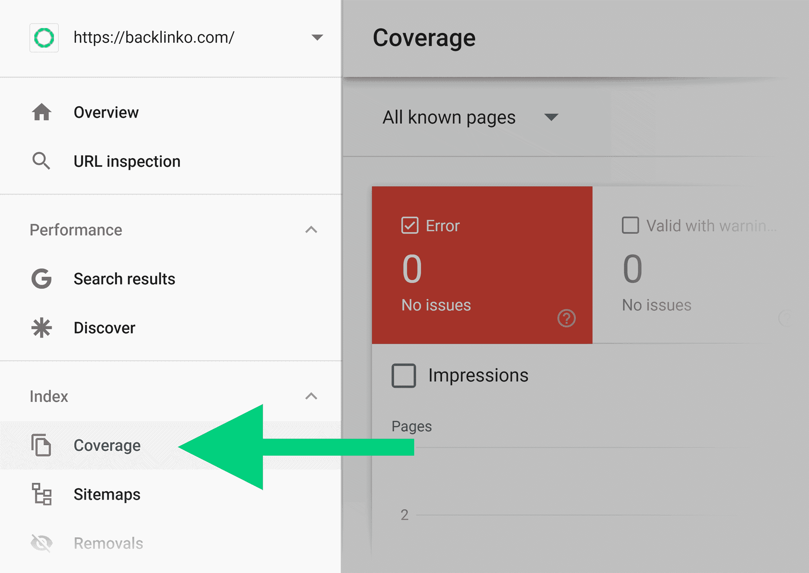</picture>

如果你注意到谷歌在访问你的一个重要网页时遇到了麻烦(例如，robots.txt 屏蔽了搜索引擎蜘蛛)，你会希望尽快解决这个问题。

**2。了解谷歌如何查看您的页面**

有时用户可以看到你页面上的所有内容…

…但谷歌不能。

再次重申:

如果谷歌不能完全访问你的页面，它就不会排名。

这就是为什么我推荐使用谷歌搜索控制台的“检查网址”功能。

只需在 GSC 顶部输入您网站的页面。

<picture><source type="image/webp" srcset="https://api.backlinko.com/app/uploads/2019/12/gsc-enter-url.webp 1200w, https://api.backlinko.com/app/uploads/2019/12/gsc-enter-url-300x80.webp 300w, https://api.backlinko.com/app/uploads/2019/12/gsc-enter-url-768x205.webp 768w, https://api.backlinko.com/app/uploads/2019/12/gsc-enter-url-480x128.webp 480w, https://api.backlinko.com/app/uploads/2019/12/gsc-enter-url-640x171.webp 640w, https://api.backlinko.com/app/uploads/2019/12/gsc-enter-url-960x257.webp 960w" sizes="(max-width: 600px) 100vw, 600px">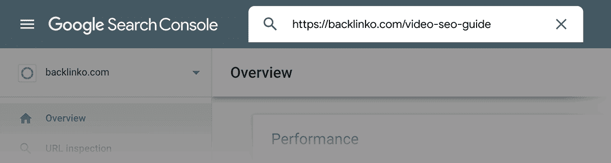</picture>

当你这样做的时候，你会从谷歌的角度看到你的页面:

<picture><source type="image/webp" srcset="https://api.backlinko.com/app/uploads/2019/12/gsc-url-inspection-report.webp 1200w, https://api.backlinko.com/app/uploads/2019/12/gsc-url-inspection-report-300x253.webp 300w, https://api.backlinko.com/app/uploads/2019/12/gsc-url-inspection-report-768x648.webp 768w, https://api.backlinko.com/app/uploads/2019/12/gsc-url-inspection-report-480x405.webp 480w, https://api.backlinko.com/app/uploads/2019/12/gsc-url-inspection-report-640x540.webp 640w, https://api.backlinko.com/app/uploads/2019/12/gsc-url-inspection-report-960x810.webp 960w" sizes="(max-width: 600px) 100vw, 600px">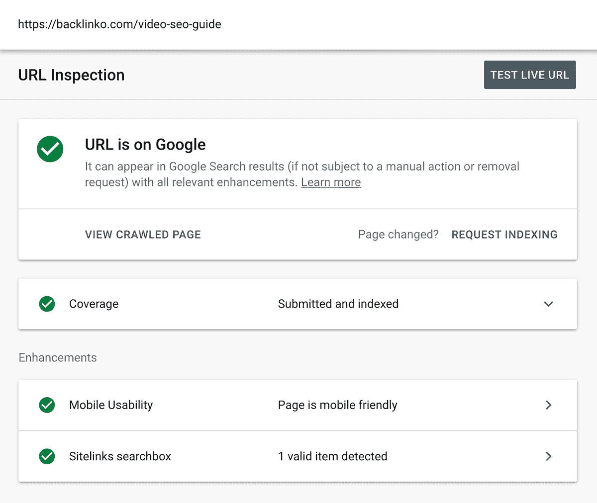</picture>

很有帮助。

**3。确保你的网站是手机友好的**

谷歌最近推出了一个新的“[移动优先指数](https://developers.google.com/search/mobile-sites/mobile-first-indexing)”。

这意味着:

如果你的网站没有[移动优化](https://backlinko.com/mobile-seo-guide)，它的排名不会很好。

幸运的是，通过谷歌的移动友好测试，你可以很容易地看到你的网站的移动友好性。

只要从你的网站弹出一个页面…然后得到一个明确的“是或不是”的答案。

<picture><source type="image/webp" srcset="https://api.backlinko.com/app/uploads/2020/07/google-mobile-friendly-test.webp 1960w, https://api.backlinko.com/app/uploads/2020/07/google-mobile-friendly-test-300x313.webp 300w, https://api.backlinko.com/app/uploads/2020/07/google-mobile-friendly-test-1280x1337.webp 1280w, https://api.backlinko.com/app/uploads/2020/07/google-mobile-friendly-test-768x802.webp 768w, https://api.backlinko.com/app/uploads/2020/07/google-mobile-friendly-test-1471x1536.webp 1471w, https://api.backlinko.com/app/uploads/2020/07/google-mobile-friendly-test-480x501.webp 480w, https://api.backlinko.com/app/uploads/2020/07/google-mobile-friendly-test-640x668.webp 640w, https://api.backlinko.com/app/uploads/2020/07/google-mobile-friendly-test-960x1003.webp 960w, https://api.backlinko.com/app/uploads/2020/07/google-mobile-friendly-test-1440x1504.webp 1440w, https://api.backlinko.com/app/uploads/2020/07/google-mobile-friendly-test-1600x1671.webp 1600w, https://api.backlinko.com/app/uploads/2020/07/google-mobile-friendly-test-1920x2005.webp 1920w" sizes="(max-width: 450px) 100vw, 450px">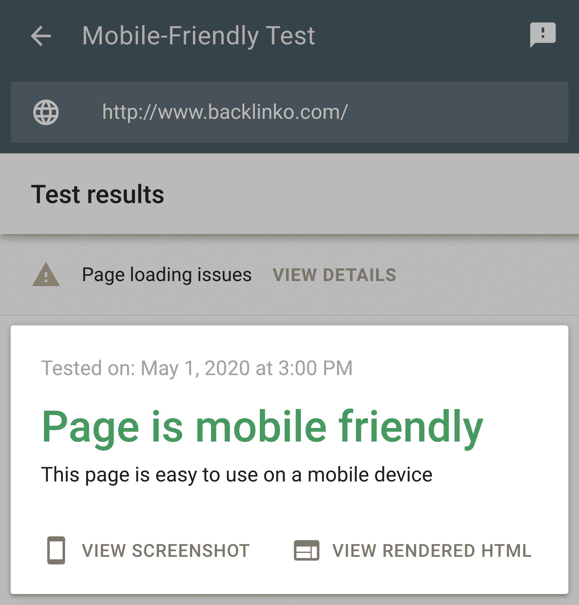</picture>

相当酷。

**4。修复断开的链接**

坏链接真的会伤害你的搜索引擎优化。

所以你肯定想找到断开的链接…并修复它们。

最简单的方法是什么？[DrLinkCheck.com](https://www.drlinkcheck.com/)。

这是一个免费的工具，它可以扫描你的站点，查找断开的链接:

<picture><source type="image/webp" srcset="https://api.backlinko.com/app/uploads/2021/10/drlinkcheck-backlinko.webp 2355w, https://api.backlinko.com/app/uploads/2021/10/drlinkcheck-backlinko-300x220.webp 300w, https://api.backlinko.com/app/uploads/2021/10/drlinkcheck-backlinko-1280x939.webp 1280w, https://api.backlinko.com/app/uploads/2021/10/drlinkcheck-backlinko-768x564.webp 768w, https://api.backlinko.com/app/uploads/2021/10/drlinkcheck-backlinko-1536x1127.webp 1536w, https://api.backlinko.com/app/uploads/2021/10/drlinkcheck-backlinko-2048x1503.webp 2048w, https://api.backlinko.com/app/uploads/2021/10/drlinkcheck-backlinko-480x352.webp 480w, https://api.backlinko.com/app/uploads/2021/10/drlinkcheck-backlinko-640x470.webp 640w, https://api.backlinko.com/app/uploads/2021/10/drlinkcheck-backlinko-960x704.webp 960w, https://api.backlinko.com/app/uploads/2021/10/drlinkcheck-backlinko-1440x1057.webp 1440w, https://api.backlinko.com/app/uploads/2021/10/drlinkcheck-backlinko-1600x1174.webp 1600w, https://api.backlinko.com/app/uploads/2021/10/drlinkcheck-backlinko-1920x1409.webp 1920w" sizes="(max-width: 600px) 100vw, 600px">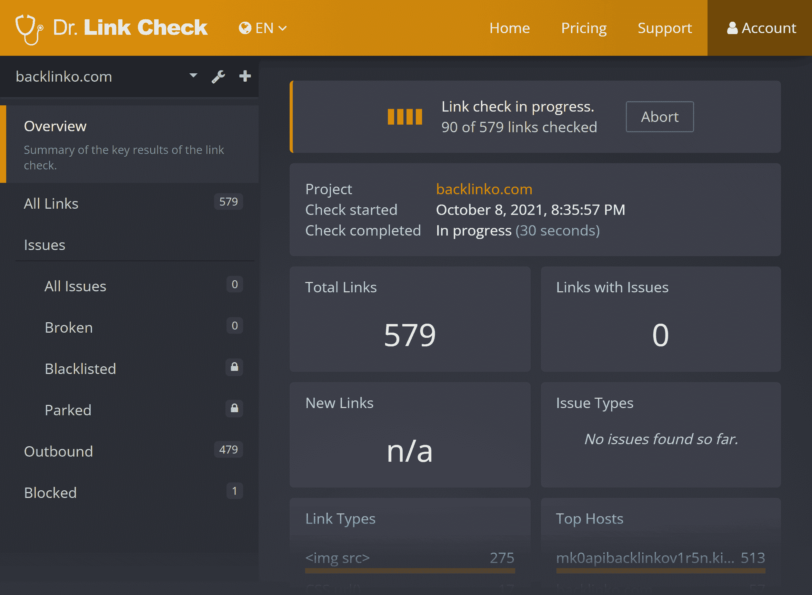</picture>

**5。使用 HTTPS 保护您的网站**

HTTPS [是一个确定的谷歌排名信号](https://webmasters.googleblog.com/2014/08/https-as-ranking-signal.html)。

<picture><source type="image/webp" srcset="https://api.backlinko.com/app/uploads/2021/10/google-blog-https-as-ranking-signal.webp 2355w, https://api.backlinko.com/app/uploads/2021/10/google-blog-https-as-ranking-signal-300x204.webp 300w, https://api.backlinko.com/app/uploads/2021/10/google-blog-https-as-ranking-signal-1280x871.webp 1280w, https://api.backlinko.com/app/uploads/2021/10/google-blog-https-as-ranking-signal-768x522.webp 768w, https://api.backlinko.com/app/uploads/2021/10/google-blog-https-as-ranking-signal-1536x1045.webp 1536w, https://api.backlinko.com/app/uploads/2021/10/google-blog-https-as-ranking-signal-2048x1393.webp 2048w, https://api.backlinko.com/app/uploads/2021/10/google-blog-https-as-ranking-signal-480x327.webp 480w, https://api.backlinko.com/app/uploads/2021/10/google-blog-https-as-ranking-signal-640x435.webp 640w, https://api.backlinko.com/app/uploads/2021/10/google-blog-https-as-ranking-signal-960x653.webp 960w, https://api.backlinko.com/app/uploads/2021/10/google-blog-https-as-ranking-signal-1440x980.webp 1440w, https://api.backlinko.com/app/uploads/2021/10/google-blog-https-as-ranking-signal-1600x1088.webp 1600w, https://api.backlinko.com/app/uploads/2021/10/google-blog-https-as-ranking-signal-1920x1306.webp 1920w" sizes="(max-width: 600px) 100vw, 600px">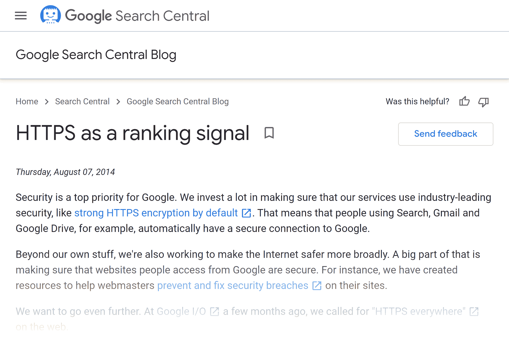</picture>

所以如果你还没有，是时候把你的网站搬到 HTTPS 了。

(或者，如果你刚刚启动了一个新网站，在第一天就和 HTTPS 一起建立它。)

这里有一个指南可以帮助你将网站迁移到 HTTPS……而不影响你的搜索引擎优化。

**6。检查你网站的加载速度**

你的网站加载速度惊人吗？

如果不是这样，你的网站[的排名就不会和](https://webmasters.googleblog.com/2018/01/using-page-speed-in-mobile-search.html)一样好。

这就是为什么你想要前往 [PageSpeed Insights](https://developers.google.com/speed/pagespeed/insights/) 的原因。

这个免费工具可以让你知道桌面和移动用户的站点加载速度:

<picture><source type="image/webp" srcset="https://api.backlinko.com/app/uploads/2021/08/google-pagespeed-insights-backlinko-results.webp 2688w, https://api.backlinko.com/app/uploads/2021/08/google-pagespeed-insights-backlinko-results-300x368.webp 300w, https://api.backlinko.com/app/uploads/2021/08/google-pagespeed-insights-backlinko-results-1280x1569.webp 1280w, https://api.backlinko.com/app/uploads/2021/08/google-pagespeed-insights-backlinko-results-768x941.webp 768w, https://api.backlinko.com/app/uploads/2021/08/google-pagespeed-insights-backlinko-results-1253x1536.webp 1253w, https://api.backlinko.com/app/uploads/2021/08/google-pagespeed-insights-backlinko-results-1671x2048.webp 1671w, https://api.backlinko.com/app/uploads/2021/08/google-pagespeed-insights-backlinko-results-480x588.webp 480w, https://api.backlinko.com/app/uploads/2021/08/google-pagespeed-insights-backlinko-results-640x784.webp 640w, https://api.backlinko.com/app/uploads/2021/08/google-pagespeed-insights-backlinko-results-960x1176.webp 960w, https://api.backlinko.com/app/uploads/2021/08/google-pagespeed-insights-backlinko-results-1440x1765.webp 1440w, https://api.backlinko.com/app/uploads/2021/08/google-pagespeed-insights-backlinko-results-1600x1961.webp 1600w, https://api.backlinko.com/app/uploads/2021/08/google-pagespeed-insights-backlinko-results-1920x2353.webp 1920w, https://api.backlinko.com/app/uploads/2021/08/google-pagespeed-insights-backlinko-results-2560x3137.webp 2560w" sizes="(max-width: 600px) 100vw, 600px">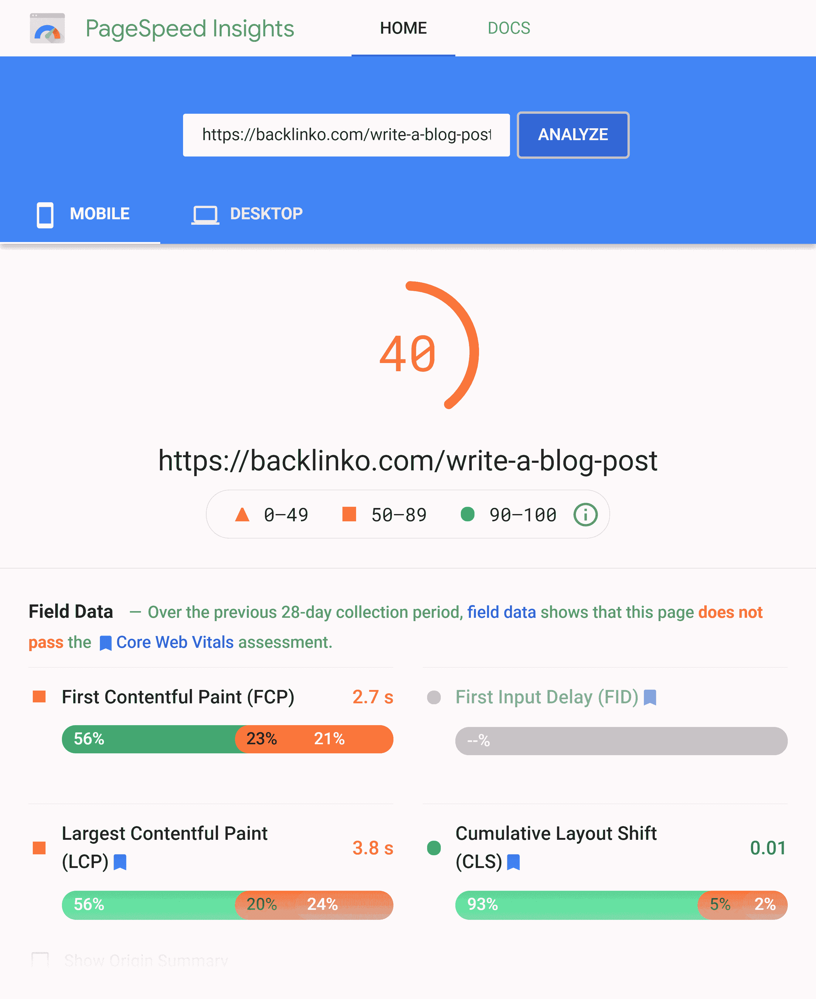</picture>

它甚至让你知道你可以做些什么来加快速度。

<picture><source type="image/webp" srcset="https://api.backlinko.com/app/uploads/2021/08/google-pagespeed-insights-backlinko-suggestions.webp 2500w, https://api.backlinko.com/app/uploads/2021/08/google-pagespeed-insights-backlinko-suggestions-300x268.webp 300w, https://api.backlinko.com/app/uploads/2021/08/google-pagespeed-insights-backlinko-suggestions-1280x1144.webp 1280w, https://api.backlinko.com/app/uploads/2021/08/google-pagespeed-insights-backlinko-suggestions-768x687.webp 768w, https://api.backlinko.com/app/uploads/2021/08/google-pagespeed-insights-backlinko-suggestions-1536x1373.webp 1536w, https://api.backlinko.com/app/uploads/2021/08/google-pagespeed-insights-backlinko-suggestions-2048x1831.webp 2048w, https://api.backlinko.com/app/uploads/2021/08/google-pagespeed-insights-backlinko-suggestions-480x429.webp 480w, https://api.backlinko.com/app/uploads/2021/08/google-pagespeed-insights-backlinko-suggestions-640x572.webp 640w, https://api.backlinko.com/app/uploads/2021/08/google-pagespeed-insights-backlinko-suggestions-960x858.webp 960w, https://api.backlinko.com/app/uploads/2021/08/google-pagespeed-insights-backlinko-suggestions-1440x1287.webp 1440w, https://api.backlinko.com/app/uploads/2021/08/google-pagespeed-insights-backlinko-suggestions-1600x1430.webp 1600w, https://api.backlinko.com/app/uploads/2021/08/google-pagespeed-insights-backlinko-suggestions-1920x1716.webp 1920w" sizes="(max-width: 600px) 100vw, 600px">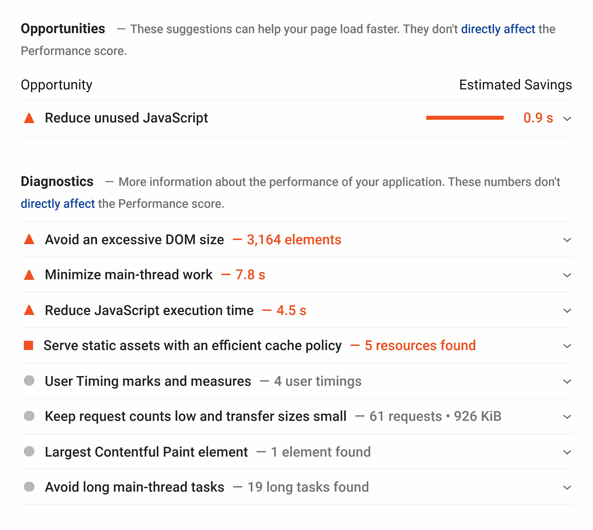</picture>

## **内容清单**

不可否认:如果你想在谷歌排名，你需要发布伟大的内容。这就是为什么内容现在是任何现代 SEO 策略的重要组成部分。在这一部分，我将向您展示创建 2022 年(及以后)内容类型的具体步骤。

**1。使用“摩天大楼技术”** 创造惊人的内容

摩天大楼技术是发布惊人内容的强大公式。

事实上，我用这种方法让我的搜索引擎流量翻倍:

<picture><source type="image/webp" srcset="https://api.backlinko.com/app/uploads/2021/10/backlinko-early-traffic-increase.webp 2400w, https://api.backlinko.com/app/uploads/2021/10/backlinko-early-traffic-increase-300x155.webp 300w, https://api.backlinko.com/app/uploads/2021/10/backlinko-early-traffic-increase-1280x659.webp 1280w, https://api.backlinko.com/app/uploads/2021/10/backlinko-early-traffic-increase-768x396.webp 768w, https://api.backlinko.com/app/uploads/2021/10/backlinko-early-traffic-increase-1536x791.webp 1536w, https://api.backlinko.com/app/uploads/2021/10/backlinko-early-traffic-increase-2048x1055.webp 2048w, https://api.backlinko.com/app/uploads/2021/10/backlinko-early-traffic-increase-480x247.webp 480w, https://api.backlinko.com/app/uploads/2021/10/backlinko-early-traffic-increase-640x330.webp 640w, https://api.backlinko.com/app/uploads/2021/10/backlinko-early-traffic-increase-960x494.webp 960w, https://api.backlinko.com/app/uploads/2021/10/backlinko-early-traffic-increase-1440x742.webp 1440w, https://api.backlinko.com/app/uploads/2021/10/backlinko-early-traffic-increase-1600x824.webp 1600w, https://api.backlinko.com/app/uploads/2021/10/backlinko-early-traffic-increase-1920x989.webp 1920w" sizes="(max-width: 600px) 100vw, 600px">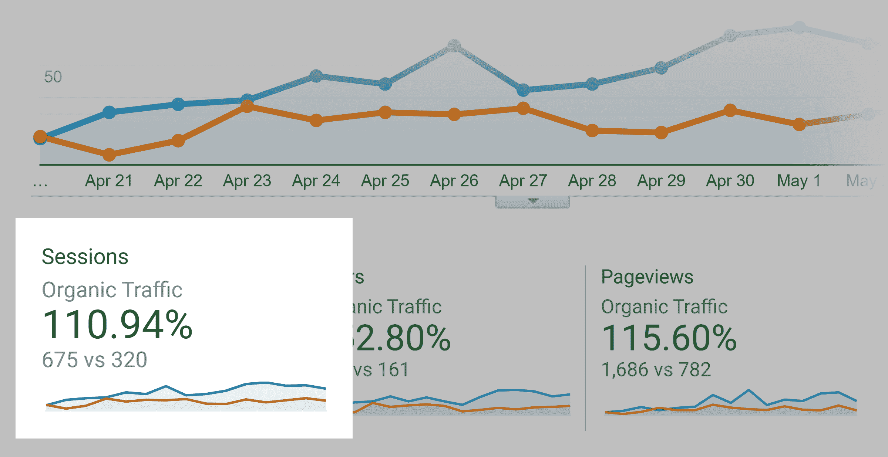</picture>

以下是 3 步流程:

1.  首先，确定一个你所在行业的热门内容
2.  接下来，创造更好的东西
3.  最后，推广内容

显然，我没有足够的空间来详细介绍这些步骤。

因此，如果你想了解更多关于摩天大楼的技术，这里有两个有用的资源:

[我一直最喜欢的白帽 SEO 技术(有机流量增加 59)](https://www.youtube.com/watch?v=263xIymvLl4)

[我是如何在 14 天内将搜索流量提高 110%的](https://backlinko.com/skyscraper-technique)

**2。将您的内容分块以最大化可读性**

没有人喜欢阅读巨大的文本墙:

<picture><source type="image/webp" srcset="https://api.backlinko.com/app/uploads/2020/09/wall-of-text.webp 1200w, https://api.backlinko.com/app/uploads/2020/09/wall-of-text-300x278.webp 300w, https://api.backlinko.com/app/uploads/2020/09/wall-of-text-768x712.webp 768w, https://api.backlinko.com/app/uploads/2020/09/wall-of-text-480x445.webp 480w, https://api.backlinko.com/app/uploads/2020/09/wall-of-text-640x593.webp 640w, https://api.backlinko.com/app/uploads/2020/09/wall-of-text-960x890.webp 960w" sizes="(max-width: 600px) 100vw, 600px"></picture>

这就是为什么我总是把我的内容分成易于阅读的块，就像这样:

<picture><source type="image/webp" srcset="https://api.backlinko.com/app/uploads/2021/10/chunks-of-text-in-post.webp 2715w, https://api.backlinko.com/app/uploads/2021/10/chunks-of-text-in-post-300x258.webp 300w, https://api.backlinko.com/app/uploads/2021/10/chunks-of-text-in-post-1280x1100.webp 1280w, https://api.backlinko.com/app/uploads/2021/10/chunks-of-text-in-post-768x660.webp 768w, https://api.backlinko.com/app/uploads/2021/10/chunks-of-text-in-post-1536x1320.webp 1536w, https://api.backlinko.com/app/uploads/2021/10/chunks-of-text-in-post-2048x1761.webp 2048w, https://api.backlinko.com/app/uploads/2021/10/chunks-of-text-in-post-480x413.webp 480w, https://api.backlinko.com/app/uploads/2021/10/chunks-of-text-in-post-640x550.webp 640w, https://api.backlinko.com/app/uploads/2021/10/chunks-of-text-in-post-960x825.webp 960w, https://api.backlinko.com/app/uploads/2021/10/chunks-of-text-in-post-1440x1238.webp 1440w, https://api.backlinko.com/app/uploads/2021/10/chunks-of-text-in-post-1600x1375.webp 1600w, https://api.backlinko.com/app/uploads/2021/10/chunks-of-text-in-post-1920x1651.webp 1920w, https://api.backlinko.com/app/uploads/2021/10/chunks-of-text-in-post-2560x2201.webp 2560w" sizes="(max-width: 600px) 100vw, 600px">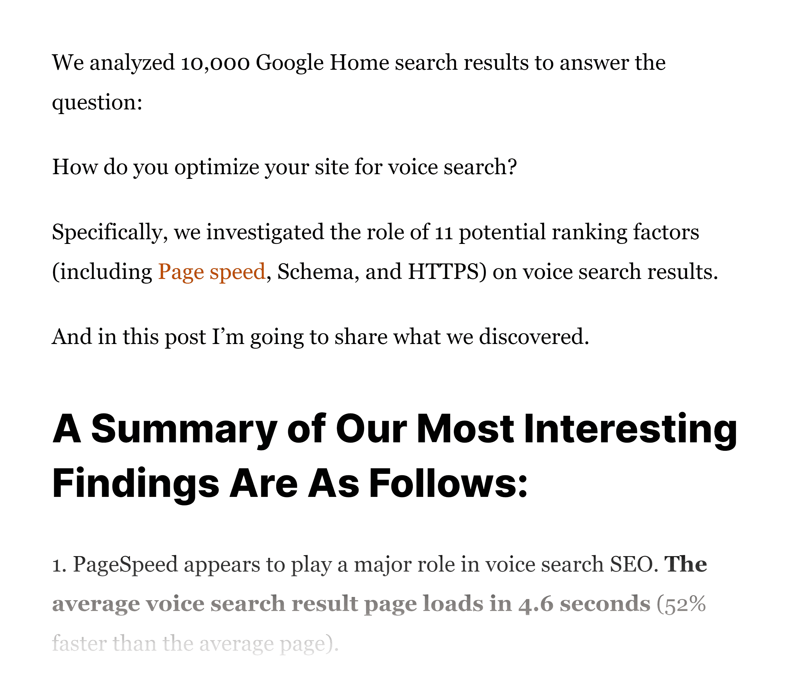</picture>

这些块保持我的跳出率低，这是一个关键的谷歌排名因素。

(稍后将详细介绍。)

**3。深入报道你页面的主题**

当我们分析了超过 1100 万条谷歌搜索结果时，有一点非常突出:

在谷歌排名最好的内容倾向于深度覆盖整个主题。

<picture><source type="image/webp" srcset="https://api.backlinko.com/app/uploads/2020/03/higher-clearscope-content-grades-correlate-with-higher-google-rankings.webp 2200w, https://api.backlinko.com/app/uploads/2020/03/higher-clearscope-content-grades-correlate-with-higher-google-rankings-300x345.webp 300w, https://api.backlinko.com/app/uploads/2020/03/higher-clearscope-content-grades-correlate-with-higher-google-rankings-1280x1473.webp 1280w, https://api.backlinko.com/app/uploads/2020/03/higher-clearscope-content-grades-correlate-with-higher-google-rankings-768x884.webp 768w, https://api.backlinko.com/app/uploads/2020/03/higher-clearscope-content-grades-correlate-with-higher-google-rankings-1335x1536.webp 1335w, https://api.backlinko.com/app/uploads/2020/03/higher-clearscope-content-grades-correlate-with-higher-google-rankings-1779x2048.webp 1779w, https://api.backlinko.com/app/uploads/2020/03/higher-clearscope-content-grades-correlate-with-higher-google-rankings-480x552.webp 480w, https://api.backlinko.com/app/uploads/2020/03/higher-clearscope-content-grades-correlate-with-higher-google-rankings-640x737.webp 640w, https://api.backlinko.com/app/uploads/2020/03/higher-clearscope-content-grades-correlate-with-higher-google-rankings-960x1105.webp 960w, https://api.backlinko.com/app/uploads/2020/03/higher-clearscope-content-grades-correlate-with-higher-google-rankings-1440x1657.webp 1440w, https://api.backlinko.com/app/uploads/2020/03/higher-clearscope-content-grades-correlate-with-higher-google-rankings-1600x1841.webp 1600w, https://api.backlinko.com/app/uploads/2020/03/higher-clearscope-content-grades-correlate-with-higher-google-rankings-1920x2210.webp 1920w" sizes="(max-width: 700px) 100vw, 700px">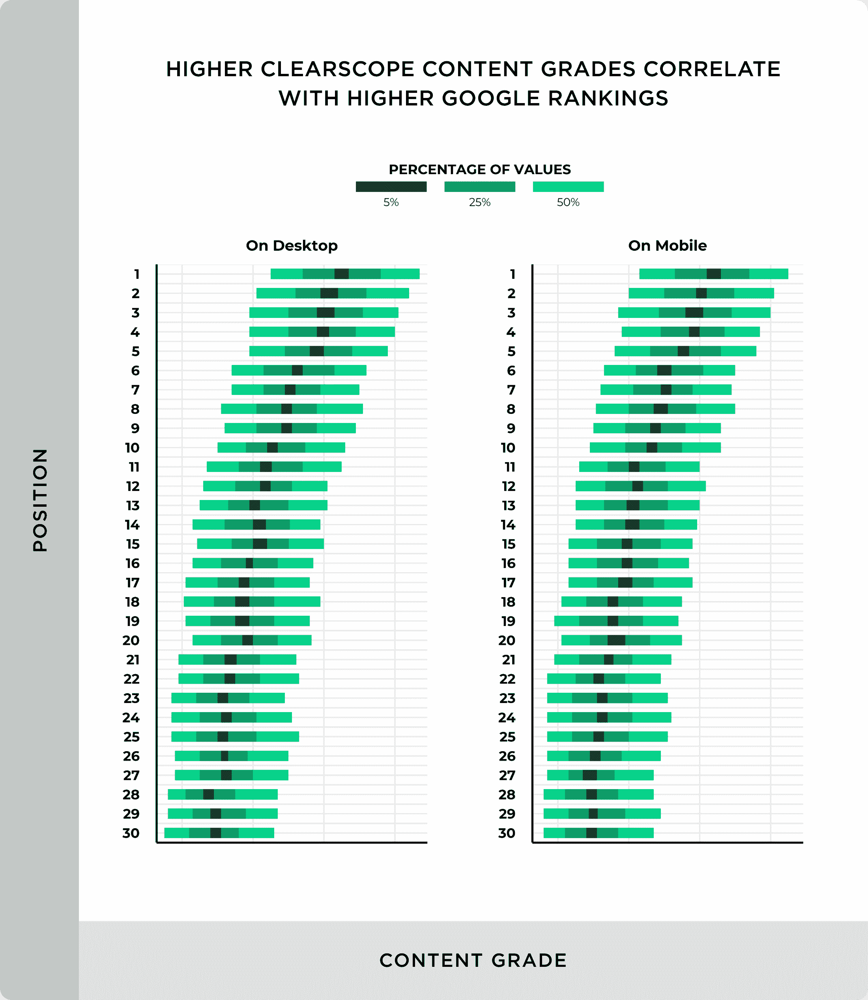</picture>

例如，不久前我在我的网站上发布了这个指南。

<picture><source type="image/webp" srcset="https://api.backlinko.com/app/uploads/2021/10/backlinko-video-seo-guide-2021.webp 2500w, https://api.backlinko.com/app/uploads/2021/10/backlinko-video-seo-guide-2021-300x251.webp 300w, https://api.backlinko.com/app/uploads/2021/10/backlinko-video-seo-guide-2021-1280x1071.webp 1280w, https://api.backlinko.com/app/uploads/2021/10/backlinko-video-seo-guide-2021-768x643.webp 768w, https://api.backlinko.com/app/uploads/2021/10/backlinko-video-seo-guide-2021-1536x1285.webp 1536w, https://api.backlinko.com/app/uploads/2021/10/backlinko-video-seo-guide-2021-2048x1714.webp 2048w, https://api.backlinko.com/app/uploads/2021/10/backlinko-video-seo-guide-2021-480x402.webp 480w, https://api.backlinko.com/app/uploads/2021/10/backlinko-video-seo-guide-2021-640x536.webp 640w, https://api.backlinko.com/app/uploads/2021/10/backlinko-video-seo-guide-2021-960x803.webp 960w, https://api.backlinko.com/app/uploads/2021/10/backlinko-video-seo-guide-2021-1440x1205.webp 1440w, https://api.backlinko.com/app/uploads/2021/10/backlinko-video-seo-guide-2021-1600x1339.webp 1600w, https://api.backlinko.com/app/uploads/2021/10/backlinko-video-seo-guide-2021-1920x1607.webp 1920w" sizes="(max-width: 600px) 100vw, 600px">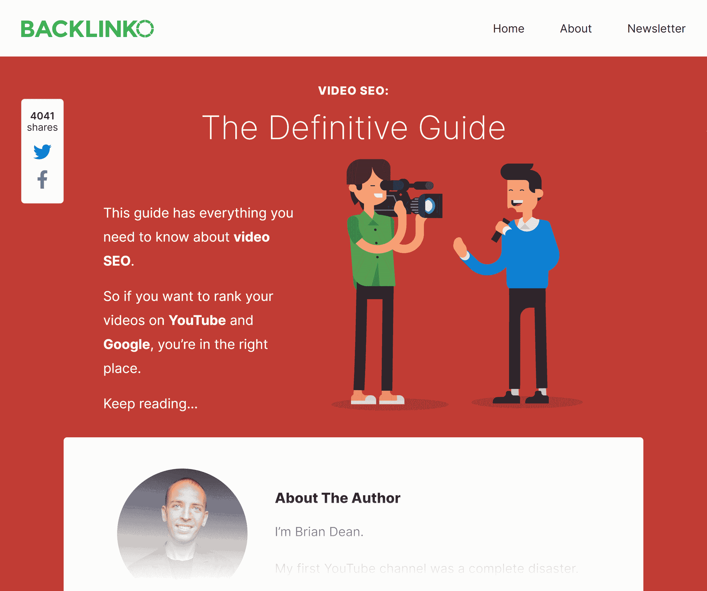</picture>

我可以发表一篇普通的内容，比如“视频搜索引擎优化的 5 个技巧”。

相反，我创建了一个涵盖该主题所有内容的指南。

这也是我的主要关键词在谷歌排名前三的主要原因:

<picture><source type="image/webp" srcset="https://api.backlinko.com/app/uploads/2021/10/google-serp-video-seo-2021.webp 2500w, https://api.backlinko.com/app/uploads/2021/10/google-serp-video-seo-2021-300x231.webp 300w, https://api.backlinko.com/app/uploads/2021/10/google-serp-video-seo-2021-1280x988.webp 1280w, https://api.backlinko.com/app/uploads/2021/10/google-serp-video-seo-2021-768x593.webp 768w, https://api.backlinko.com/app/uploads/2021/10/google-serp-video-seo-2021-1536x1185.webp 1536w, https://api.backlinko.com/app/uploads/2021/10/google-serp-video-seo-2021-2048x1580.webp 2048w, https://api.backlinko.com/app/uploads/2021/10/google-serp-video-seo-2021-480x370.webp 480w, https://api.backlinko.com/app/uploads/2021/10/google-serp-video-seo-2021-640x494.webp 640w, https://api.backlinko.com/app/uploads/2021/10/google-serp-video-seo-2021-960x741.webp 960w, https://api.backlinko.com/app/uploads/2021/10/google-serp-video-seo-2021-1440x1111.webp 1440w, https://api.backlinko.com/app/uploads/2021/10/google-serp-video-seo-2021-1600x1235.webp 1600w, https://api.backlinko.com/app/uploads/2021/10/google-serp-video-seo-2021-1920x1481.webp 1920w" sizes="(max-width: 600px) 100vw, 600px">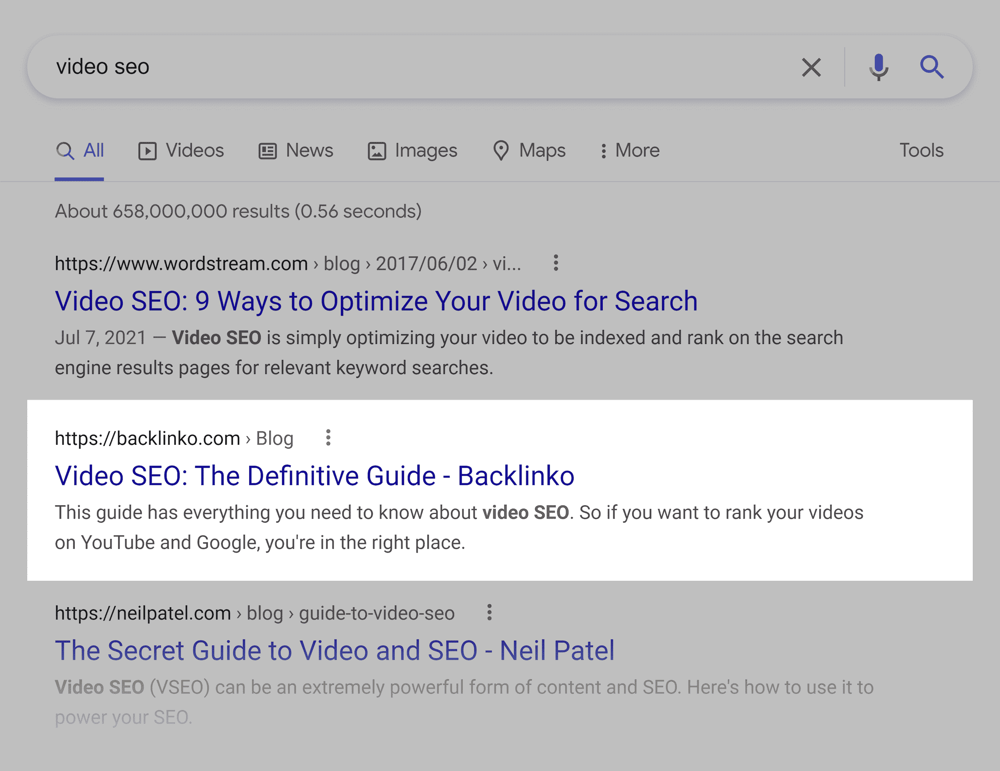</picture>

**4。使用模式标记** 

模式标记帮助搜索引擎更好地理解你的内容。

也就是说，实现模式可能很棘手。

这就是为什么我推荐 [Google 的结构化数据测试工具](https://search.google.com/structured-data/testing-tool)。

<picture><source type="image/webp" srcset="https://api.backlinko.com/app/uploads/2021/10/google-structured-data.webp 2469w, https://api.backlinko.com/app/uploads/2021/10/google-structured-data-300x266.webp 300w, https://api.backlinko.com/app/uploads/2021/10/google-structured-data-1280x1135.webp 1280w, https://api.backlinko.com/app/uploads/2021/10/google-structured-data-768x681.webp 768w, https://api.backlinko.com/app/uploads/2021/10/google-structured-data-1536x1362.webp 1536w, https://api.backlinko.com/app/uploads/2021/10/google-structured-data-2048x1817.webp 2048w, https://api.backlinko.com/app/uploads/2021/10/google-structured-data-480x426.webp 480w, https://api.backlinko.com/app/uploads/2021/10/google-structured-data-640x568.webp 640w, https://api.backlinko.com/app/uploads/2021/10/google-structured-data-960x852.webp 960w, https://api.backlinko.com/app/uploads/2021/10/google-structured-data-1440x1277.webp 1440w, https://api.backlinko.com/app/uploads/2021/10/google-structured-data-1600x1419.webp 1600w, https://api.backlinko.com/app/uploads/2021/10/google-structured-data-1920x1703.webp 1920w" sizes="(max-width: 600px) 100vw, 600px">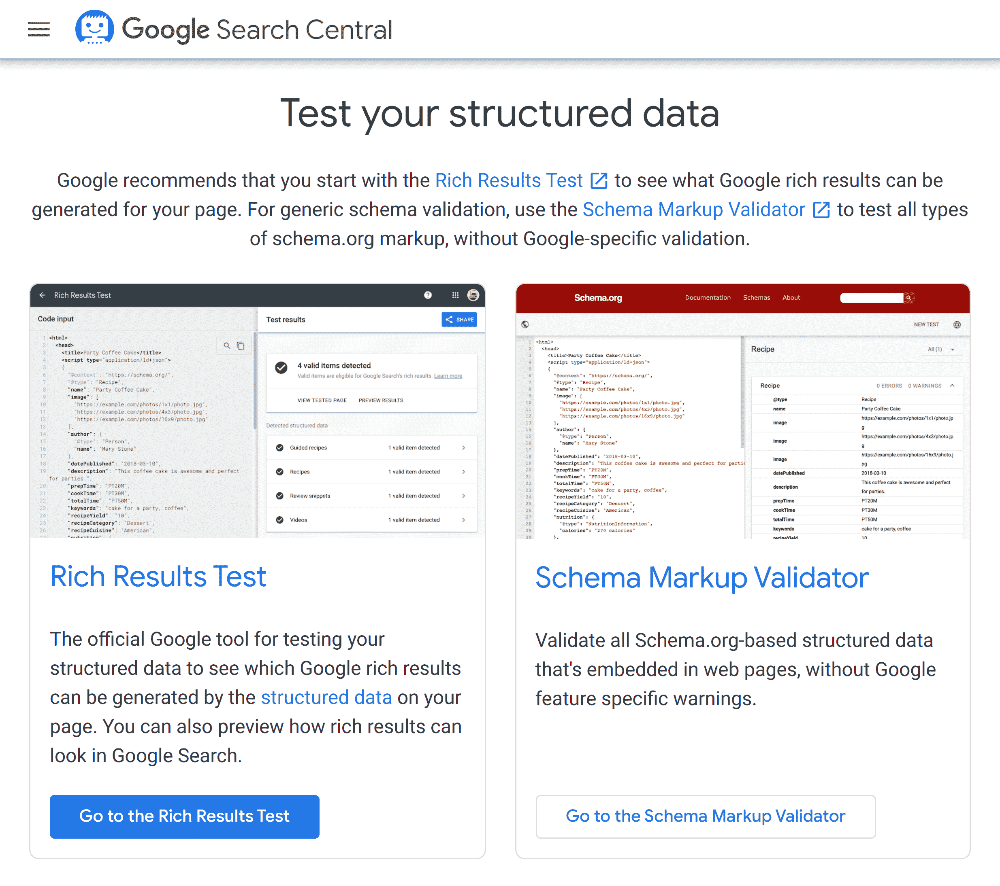</picture>

这使得使用模式比手动操作要容易得多。

**5。关注目前有效的内容格式**

BuzzSumo 的团队最近审查了 1 亿篇文章。

那么，他们发现了什么？

**首先，坏消息:**

“大多数内容的反向链接为零”。

哎哟。

**现在，有些好消息:**

他们发现某些内容格式比其他格式表现得更好。

具体来说，“大赢家是那些因原创、权威内容而建立了良好声誉的网站。”

他们所说的“原创、权威”内容是什么意思？

*   专家撰写的内容
*   原创研究(如调查和行业研究)
*   不仅仅是重复信息的内容
*   案例研究和现实生活中的例子
*   [常青的内容](https://backlinko.com/hub/seo/evergreen "Evergreen Content")为岁月提供价值

例如，前一段时间我整理了这个 SEO 工具的巨大列表:

<picture><source type="image/webp" srcset="https://api.backlinko.com/app/uploads/2020/12/backlinko-seo-tools-2021.webp 2560w, https://api.backlinko.com/app/uploads/2020/12/backlinko-seo-tools-2021-300x254.webp 300w, https://api.backlinko.com/app/uploads/2020/12/backlinko-seo-tools-2021-1280x1082.webp 1280w, https://api.backlinko.com/app/uploads/2020/12/backlinko-seo-tools-2021-768x649.webp 768w, https://api.backlinko.com/app/uploads/2020/12/backlinko-seo-tools-2021-1536x1298.webp 1536w, https://api.backlinko.com/app/uploads/2020/12/backlinko-seo-tools-2021-2048x1731.webp 2048w, https://api.backlinko.com/app/uploads/2020/12/backlinko-seo-tools-2021-480x406.webp 480w, https://api.backlinko.com/app/uploads/2020/12/backlinko-seo-tools-2021-640x541.webp 640w, https://api.backlinko.com/app/uploads/2020/12/backlinko-seo-tools-2021-960x812.webp 960w, https://api.backlinko.com/app/uploads/2020/12/backlinko-seo-tools-2021-1440x1217.webp 1440w, https://api.backlinko.com/app/uploads/2020/12/backlinko-seo-tools-2021-1600x1353.webp 1600w, https://api.backlinko.com/app/uploads/2020/12/backlinko-seo-tools-2021-1920x1623.webp 1920w" sizes="(max-width: 600px) 100vw, 600px">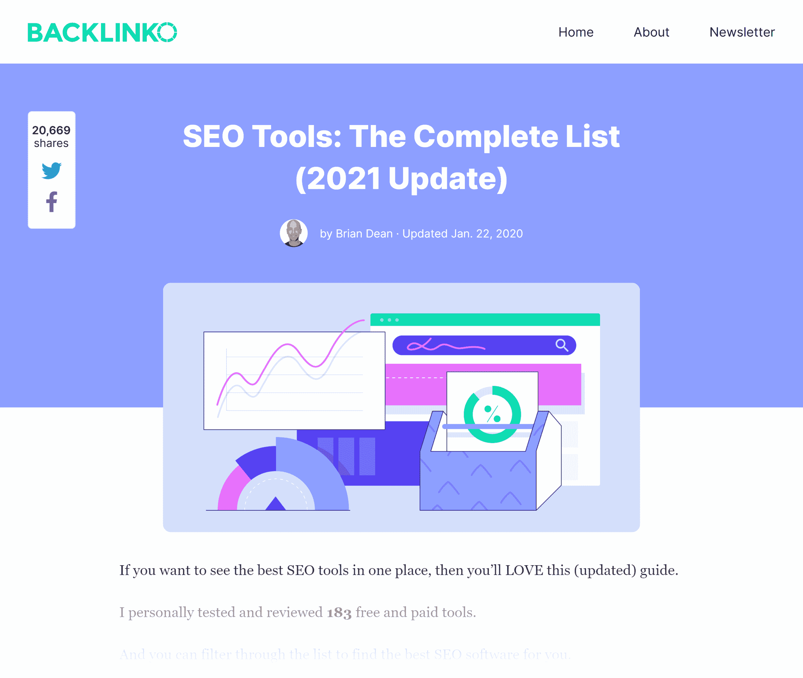</picture>

我亲自测试和审查了 170 多个工具。工作量大得惊人。

但这完全值得。

为什么？

迄今为止，这个帖子已经产生了超过 1 万个反向链接。

<picture><source type="image/webp" srcset="https://api.backlinko.com/app/uploads/2021/02/ahrefs-seo-tools-backlinks.webp 2500w, https://api.backlinko.com/app/uploads/2021/02/ahrefs-seo-tools-backlinks-300x93.webp 300w, https://api.backlinko.com/app/uploads/2021/02/ahrefs-seo-tools-backlinks-1280x398.webp 1280w, https://api.backlinko.com/app/uploads/2021/02/ahrefs-seo-tools-backlinks-768x239.webp 768w, https://api.backlinko.com/app/uploads/2021/02/ahrefs-seo-tools-backlinks-1536x478.webp 1536w, https://api.backlinko.com/app/uploads/2021/02/ahrefs-seo-tools-backlinks-2048x637.webp 2048w, https://api.backlinko.com/app/uploads/2021/02/ahrefs-seo-tools-backlinks-480x149.webp 480w, https://api.backlinko.com/app/uploads/2021/02/ahrefs-seo-tools-backlinks-640x199.webp 640w, https://api.backlinko.com/app/uploads/2021/02/ahrefs-seo-tools-backlinks-960x299.webp 960w, https://api.backlinko.com/app/uploads/2021/02/ahrefs-seo-tools-backlinks-1440x448.webp 1440w, https://api.backlinko.com/app/uploads/2021/02/ahrefs-seo-tools-backlinks-1600x498.webp 1600w, https://api.backlinko.com/app/uploads/2021/02/ahrefs-seo-tools-backlinks-1920x598.webp 1920w" sizes="(max-width: 600px) 100vw, 600px">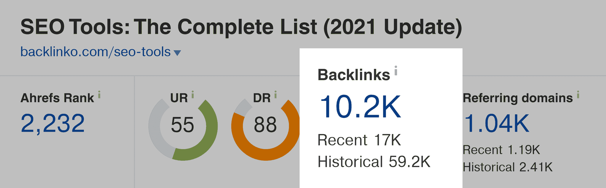</picture>

**6。使用多媒体**

你可能会注意到这篇文章包含了大量的图片。

我这样做有两个主要原因:

**首先**，这只是为了更好的内容。

**第二**，图片和其他形式的多媒体帮助内容排名更好。

所以我建议在你的内容中使用这些形式的多媒体:

*   形象
*   图表
*   信息图表
*   [视觉内容](https://backlinko.com/visualizations "Visualizations")
*   录像
*   互动投票和测验

说到这里，是时候介绍 SEO 的一个超级重要的部分了:[链接构建](https://backlinko.com/link-building)。

## **链接建筑清单** 

说到 SEO，链接建设是关键。事实上，谷歌已经确认反向链接[是他们的“前三名”排名信号](https://searchengineland.com/now-know-googles-top-three-search-ranking-factors-245882)之一。不幸的是，建立链接并不容易(这就是为什么大多数其他 SEO 清单跳过这一步)。但是如果你想在谷歌排名，链接是必须的。在这一部分，我将向您展示如何做到这一点。

**1。通过客座博文建立强大的反向链接**

[客座博文](https://backlinko.com/the-definitive-guide-to-guest-blogging)可能是一个超级有效的链接建设策略。

也就是说:

客帖有对错之分。

**正确的方法:**在你所在行业受尊敬的网站上发布你的客座博文。

**错误方式:**在任何有“为我们写作”页面的网站上发布客座博文。

事实上，我只在能给我带来定向流量的网站上发表客座博文。

例如，我在 Buffer 博客上发表了这篇客座博文:

<picture><source type="image/webp" srcset="https://api.backlinko.com/app/uploads/2021/10/brian-guestpost-on-buffer.webp 2376w, https://api.backlinko.com/app/uploads/2021/10/brian-guestpost-on-buffer-300x335.webp 300w, https://api.backlinko.com/app/uploads/2021/10/brian-guestpost-on-buffer-1280x1429.webp 1280w, https://api.backlinko.com/app/uploads/2021/10/brian-guestpost-on-buffer-768x857.webp 768w, https://api.backlinko.com/app/uploads/2021/10/brian-guestpost-on-buffer-1376x1536.webp 1376w, https://api.backlinko.com/app/uploads/2021/10/brian-guestpost-on-buffer-1835x2048.webp 1835w, https://api.backlinko.com/app/uploads/2021/10/brian-guestpost-on-buffer-480x536.webp 480w, https://api.backlinko.com/app/uploads/2021/10/brian-guestpost-on-buffer-640x714.webp 640w, https://api.backlinko.com/app/uploads/2021/10/brian-guestpost-on-buffer-960x1072.webp 960w, https://api.backlinko.com/app/uploads/2021/10/brian-guestpost-on-buffer-1440x1607.webp 1440w, https://api.backlinko.com/app/uploads/2021/10/brian-guestpost-on-buffer-1600x1786.webp 1600w, https://api.backlinko.com/app/uploads/2021/10/brian-guestpost-on-buffer-1920x2143.webp 1920w" sizes="(max-width: 600px) 100vw, 600px">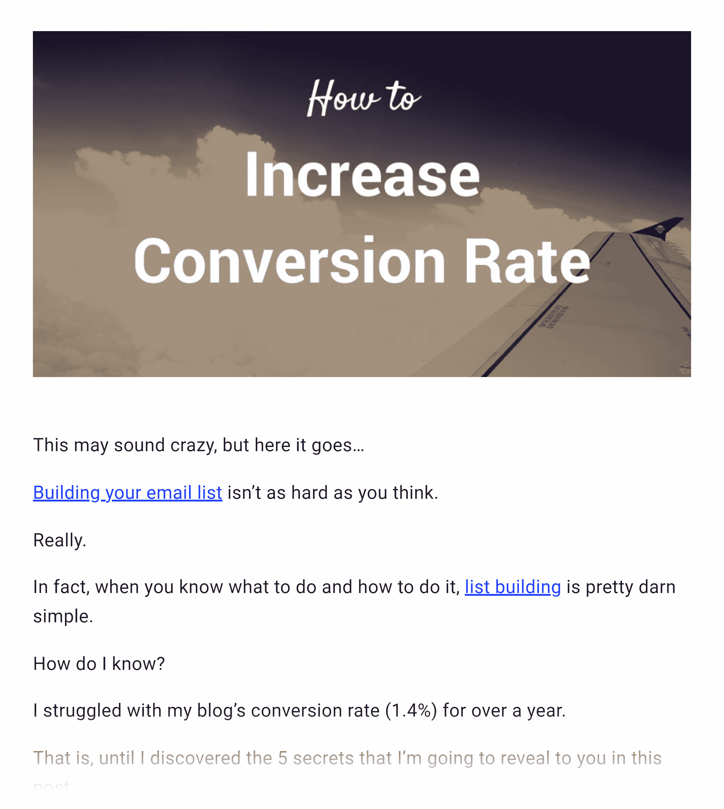</picture>

我不仅从我的客座博文中获得了大量的反向链接，还获得了可观的流量:

<picture><source type="image/webp" srcset="https://api.backlinko.com/app/uploads/2018/04/guest-post-traffic.webp 1643w, https://api.backlinko.com/app/uploads/2018/04/guest-post-traffic-300x194.webp 300w, https://api.backlinko.com/app/uploads/2018/04/guest-post-traffic-1280x830.webp 1280w, https://api.backlinko.com/app/uploads/2018/04/guest-post-traffic-768x498.webp 768w, https://api.backlinko.com/app/uploads/2018/04/guest-post-traffic-1536x996.webp 1536w, https://api.backlinko.com/app/uploads/2018/04/guest-post-traffic-480x311.webp 480w, https://api.backlinko.com/app/uploads/2018/04/guest-post-traffic-640x415.webp 640w, https://api.backlinko.com/app/uploads/2018/04/guest-post-traffic-960x622.webp 960w, https://api.backlinko.com/app/uploads/2018/04/guest-post-traffic-1440x933.webp 1440w, https://api.backlinko.com/app/uploads/2018/04/guest-post-traffic-1600x1037.webp 1600w" sizes="(max-width: 600px) 100vw, 600px">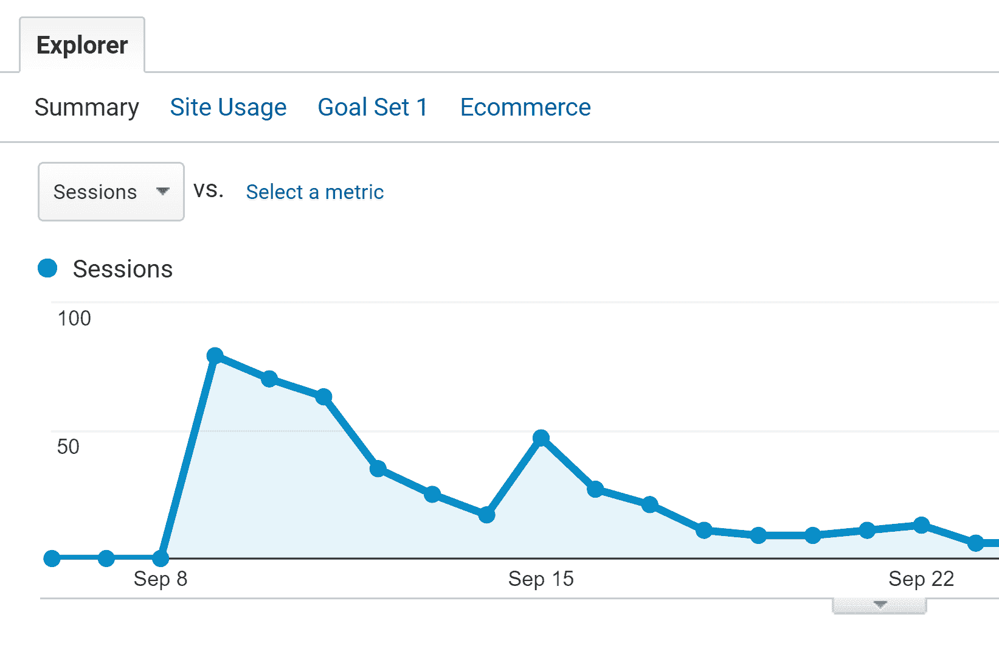</picture>

**2。逆转竞争对手的反向链接**

当你可以复制竞争对手的链接源时，为什么要重新发明轮子呢？

为此，您需要一个链接分析工具。

我个人用的是 [Semrush](https://backlinko.com/hub/seo/semrush) 。

但是如果你预算有限，你可以使用免费增值工具，比如 [Link Explorer](https://moz.com/link-explorer "Moz Link Explorer") (来自 Moz)。

无论您选择什么工具，过程都是完全一样的:

1.  抓住你的竞争对手的网址。
2.  将它放入工具中
3.  最后，尽可能多地获取他们的链接

例如，这里有一个来自我的网站 Semrush 的链接报告:

<picture><source type="image/webp" srcset="https://api.backlinko.com/app/uploads/2022/02/semrush-backlinko-backlinks.webp 1840w, https://api.backlinko.com/app/uploads/2022/02/semrush-backlinko-backlinks-300x434.webp 300w, https://api.backlinko.com/app/uploads/2022/02/semrush-backlinko-backlinks-1280x1852.webp 1280w, https://api.backlinko.com/app/uploads/2022/02/semrush-backlinko-backlinks-768x1111.webp 768w, https://api.backlinko.com/app/uploads/2022/02/semrush-backlinko-backlinks-1062x1536.webp 1062w, https://api.backlinko.com/app/uploads/2022/02/semrush-backlinko-backlinks-1416x2048.webp 1416w, https://api.backlinko.com/app/uploads/2022/02/semrush-backlinko-backlinks-480x694.webp 480w, https://api.backlinko.com/app/uploads/2022/02/semrush-backlinko-backlinks-640x926.webp 640w, https://api.backlinko.com/app/uploads/2022/02/semrush-backlinko-backlinks-960x1389.webp 960w, https://api.backlinko.com/app/uploads/2022/02/semrush-backlinko-backlinks-1440x2083.webp 1440w, https://api.backlinko.com/app/uploads/2022/02/semrush-backlinko-backlinks-1600x2315.webp 1600w" sizes="(max-width: 600px) 100vw, 600px">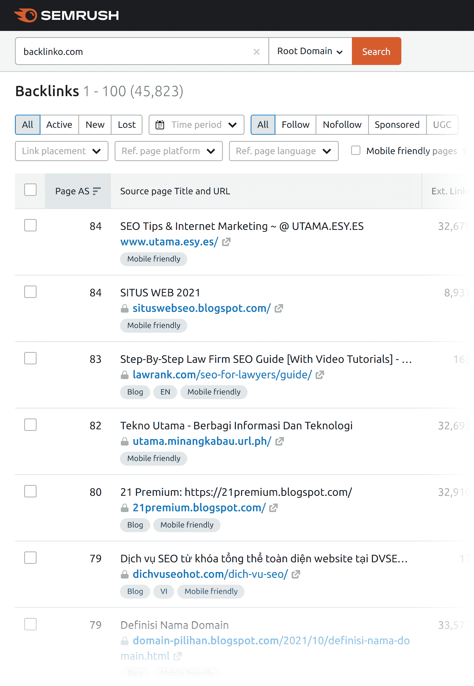</picture>

现在:

其中一些链接几乎不可能被复制。

(例如，来自与我有关系的网站的链接。)

但是很多都很容易复制。

(喜欢来自嘉宾帖子和采访的链接。)

**3。用链接摘要建立上下文反向链接**

这个策略非常有效。

也就是说，这是有条件的。

我在这里揭示了这个问题(以及这项技术是如何工作的):

**4。成为播客嘉宾**

这类似于客座博文。

但是你不是写文章，而是作为嘉宾上播客。

例如，几年前我上了这个播客:

<picture><source type="image/webp" srcset="https://api.backlinko.com/app/uploads/2021/10/theagentsofchange-youtube-seo-brian-dean.webp 2713w, https://api.backlinko.com/app/uploads/2021/10/theagentsofchange-youtube-seo-brian-dean-300x314.webp 300w, https://api.backlinko.com/app/uploads/2021/10/theagentsofchange-youtube-seo-brian-dean-1280x1339.webp 1280w, https://api.backlinko.com/app/uploads/2021/10/theagentsofchange-youtube-seo-brian-dean-768x804.webp 768w, https://api.backlinko.com/app/uploads/2021/10/theagentsofchange-youtube-seo-brian-dean-1468x1536.webp 1468w, https://api.backlinko.com/app/uploads/2021/10/theagentsofchange-youtube-seo-brian-dean-1957x2048.webp 1957w, https://api.backlinko.com/app/uploads/2021/10/theagentsofchange-youtube-seo-brian-dean-480x502.webp 480w, https://api.backlinko.com/app/uploads/2021/10/theagentsofchange-youtube-seo-brian-dean-640x670.webp 640w, https://api.backlinko.com/app/uploads/2021/10/theagentsofchange-youtube-seo-brian-dean-960x1005.webp 960w, https://api.backlinko.com/app/uploads/2021/10/theagentsofchange-youtube-seo-brian-dean-1440x1507.webp 1440w, https://api.backlinko.com/app/uploads/2021/10/theagentsofchange-youtube-seo-brian-dean-1600x1674.webp 1600w, https://api.backlinko.com/app/uploads/2021/10/theagentsofchange-youtube-seo-brian-dean-1920x2009.webp 1920w, https://api.backlinko.com/app/uploads/2021/10/theagentsofchange-youtube-seo-brian-dean-2560x2679.webp 2560w" sizes="(max-width: 600px) 100vw, 600px">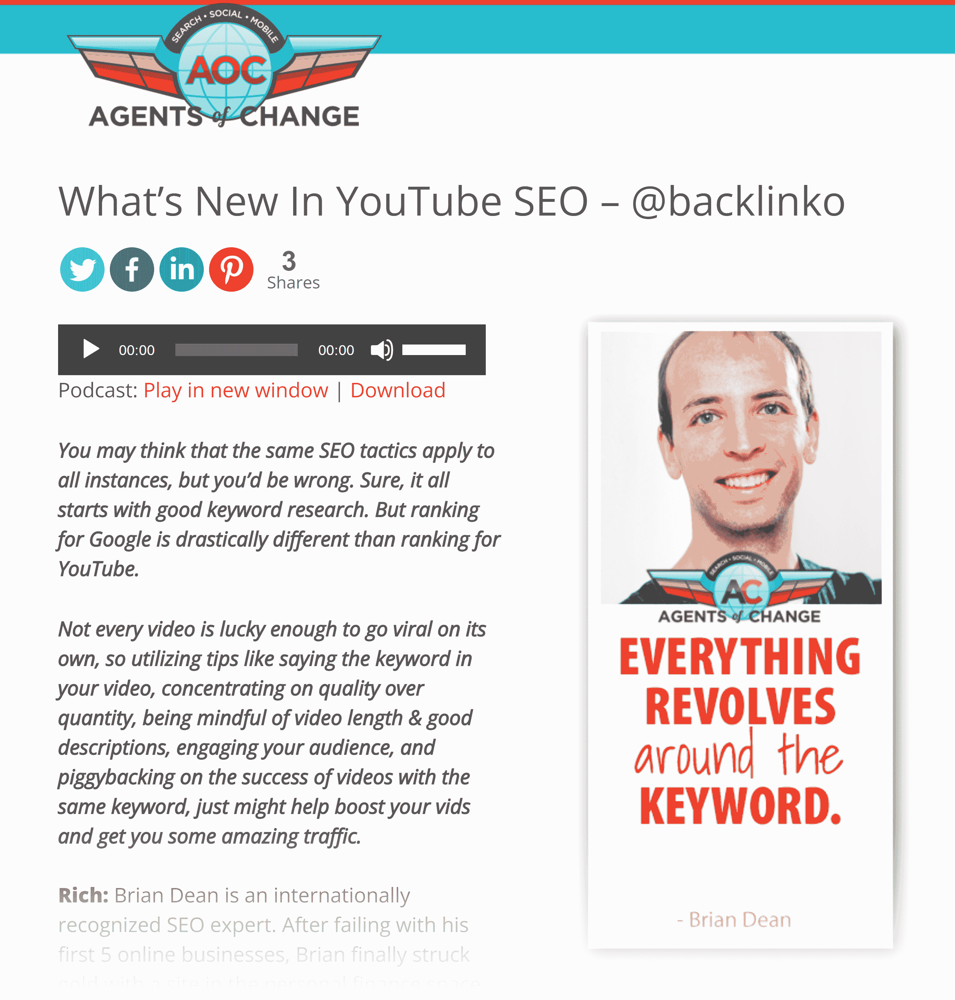</picture>

正如你所看到的，我得到了一个甜蜜的反向链接(和少数目标访问者)。

<picture><source type="image/webp" srcset="https://api.backlinko.com/app/uploads/2021/10/theagentsofchange-podcast-backlink.webp 2670w, https://api.backlinko.com/app/uploads/2021/10/theagentsofchange-podcast-backlink-300x71.webp 300w, https://api.backlinko.com/app/uploads/2021/10/theagentsofchange-podcast-backlink-1280x303.webp 1280w, https://api.backlinko.com/app/uploads/2021/10/theagentsofchange-podcast-backlink-768x182.webp 768w, https://api.backlinko.com/app/uploads/2021/10/theagentsofchange-podcast-backlink-1536x364.webp 1536w, https://api.backlinko.com/app/uploads/2021/10/theagentsofchange-podcast-backlink-2048x485.webp 2048w, https://api.backlinko.com/app/uploads/2021/10/theagentsofchange-podcast-backlink-480x114.webp 480w, https://api.backlinko.com/app/uploads/2021/10/theagentsofchange-podcast-backlink-640x151.webp 640w, https://api.backlinko.com/app/uploads/2021/10/theagentsofchange-podcast-backlink-960x227.webp 960w, https://api.backlinko.com/app/uploads/2021/10/theagentsofchange-podcast-backlink-1440x341.webp 1440w, https://api.backlinko.com/app/uploads/2021/10/theagentsofchange-podcast-backlink-1600x379.webp 1600w, https://api.backlinko.com/app/uploads/2021/10/theagentsofchange-podcast-backlink-1920x454.webp 1920w, https://api.backlinko.com/app/uploads/2021/10/theagentsofchange-podcast-backlink-2560x606.webp 2560w" sizes="(max-width: 600px) 100vw, 600px">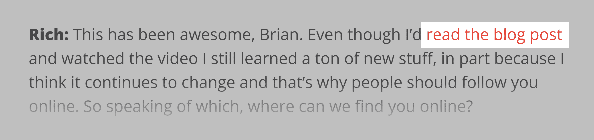</picture>

**5。在你的博客文章中提及影响者**

这个过程再简单不过了:

首先，在你的内容中提到有影响力的博主。

然后，让他们知道你提到了他们。

(说真的，就是这样。)

例如，当我发布我的 SEO 工具列表时，我让每个工具的创始人知道我展示了它们:

<picture><source type="image/webp" srcset="https://api.backlinko.com/app/uploads/2021/10/brian-seo-tolls-post-email-outreach.webp 2500w, https://api.backlinko.com/app/uploads/2021/10/brian-seo-tolls-post-email-outreach-300x403.webp 300w, https://api.backlinko.com/app/uploads/2021/10/brian-seo-tolls-post-email-outreach-1280x1719.webp 1280w, https://api.backlinko.com/app/uploads/2021/10/brian-seo-tolls-post-email-outreach-768x1032.webp 768w, https://api.backlinko.com/app/uploads/2021/10/brian-seo-tolls-post-email-outreach-1144x1536.webp 1144w, https://api.backlinko.com/app/uploads/2021/10/brian-seo-tolls-post-email-outreach-1525x2048.webp 1525w, https://api.backlinko.com/app/uploads/2021/10/brian-seo-tolls-post-email-outreach-480x645.webp 480w, https://api.backlinko.com/app/uploads/2021/10/brian-seo-tolls-post-email-outreach-640x860.webp 640w, https://api.backlinko.com/app/uploads/2021/10/brian-seo-tolls-post-email-outreach-960x1289.webp 960w, https://api.backlinko.com/app/uploads/2021/10/brian-seo-tolls-post-email-outreach-1440x1934.webp 1440w, https://api.backlinko.com/app/uploads/2021/10/brian-seo-tolls-post-email-outreach-1600x2149.webp 1600w, https://api.backlinko.com/app/uploads/2021/10/brian-seo-tolls-post-email-outreach-1920x2579.webp 1920w" sizes="(max-width: 600px) 100vw, 600px">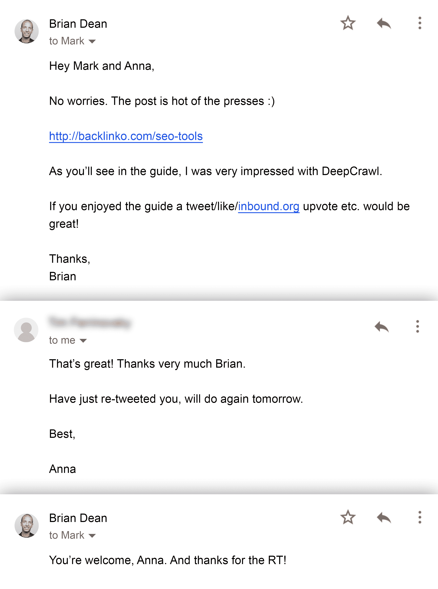</picture>

如你所见，他们很高兴地在社交媒体上分享了我的内容。

## **奖励#1:高级 SEO 技巧和策略**

现在你已经有了基本的东西，让我带你浏览一些高级的 SEO 技巧和技术。

**1。优化你的网站点击率**

毫无疑问:

点击你的结果的人越多，[你的排名就越高](https://moz.com/blog/does-organic-ctr-impact-seo-rankings-new-data)。

<picture><source type="image/webp" srcset="https://api.backlinko.com/app/uploads/2021/10/more-clicks-boosts-ranking.webp 2500w, https://api.backlinko.com/app/uploads/2021/10/more-clicks-boosts-ranking-300x306.webp 300w, https://api.backlinko.com/app/uploads/2021/10/more-clicks-boosts-ranking-1280x1306.webp 1280w, https://api.backlinko.com/app/uploads/2021/10/more-clicks-boosts-ranking-768x783.webp 768w, https://api.backlinko.com/app/uploads/2021/10/more-clicks-boosts-ranking-1506x1536.webp 1506w, https://api.backlinko.com/app/uploads/2021/10/more-clicks-boosts-ranking-2008x2048.webp 2008w, https://api.backlinko.com/app/uploads/2021/10/more-clicks-boosts-ranking-480x490.webp 480w, https://api.backlinko.com/app/uploads/2021/10/more-clicks-boosts-ranking-640x653.webp 640w, https://api.backlinko.com/app/uploads/2021/10/more-clicks-boosts-ranking-960x979.webp 960w, https://api.backlinko.com/app/uploads/2021/10/more-clicks-boosts-ranking-1440x1469.webp 1440w, https://api.backlinko.com/app/uploads/2021/10/more-clicks-boosts-ranking-1600x1632.webp 1600w, https://api.backlinko.com/app/uploads/2021/10/more-clicks-boosts-ranking-1920x1958.webp 1920w" sizes="(max-width: 700px) 100vw, 700px">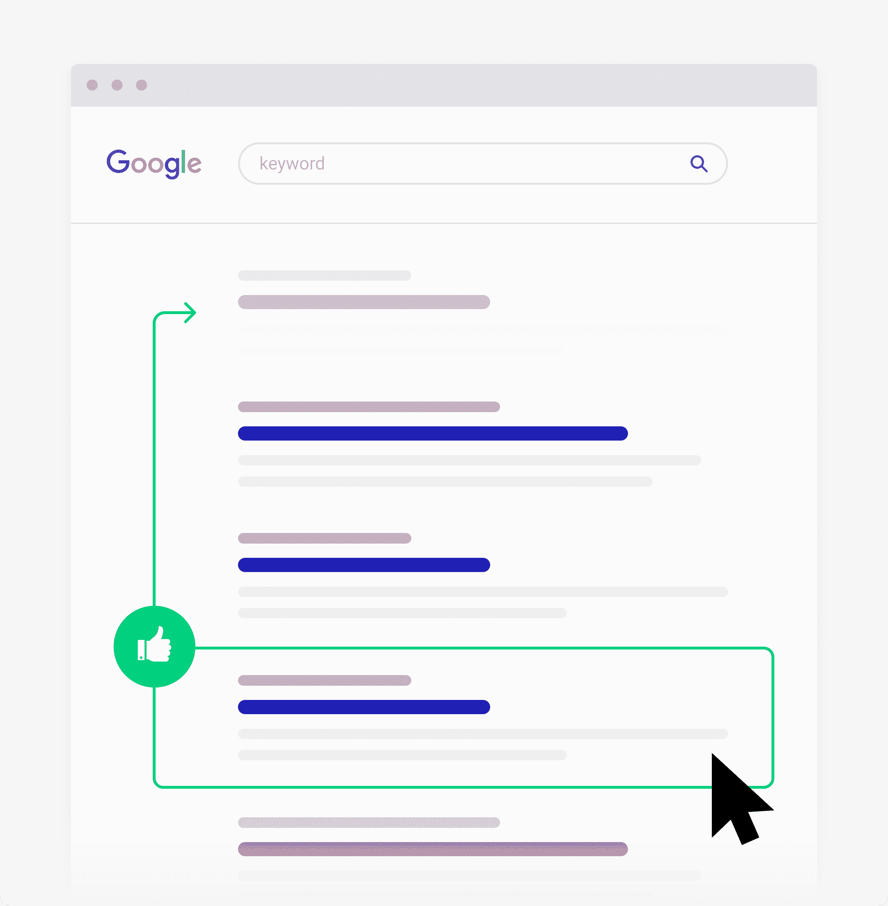</picture>

CTR 是谷歌越来越重视的用户体验信号。

我在这段视频中揭示了如何提高点击率:

**2。限制网站停机时间**

如果你的网站瘫痪了，用户会很生气。

事实证明，谷歌也很生气。

事实上，他们指出计划外的站点中断"[会对站点的声誉产生负面影响](https://webmasters.googleblog.com/2011/01/how-to-deal-with-planned-site-downtime.html)。

幸运的是，您可以使用类似于 [Pingdom](https://www.pingdom.com/) 的工具轻松跟踪站点停机时间。

Pingdom 每天 pings 你的站点数百次。

如果它关闭了，您会收到通知，这样您就可以尽快修复问题。

<picture><source type="image/webp" srcset="https://api.backlinko.com/app/uploads/2018/04/pingdom-alert.webp 1366w, https://api.backlinko.com/app/uploads/2018/04/pingdom-alert-300x103.webp 300w, https://api.backlinko.com/app/uploads/2018/04/pingdom-alert-1280x439.webp 1280w, https://api.backlinko.com/app/uploads/2018/04/pingdom-alert-768x263.webp 768w, https://api.backlinko.com/app/uploads/2018/04/pingdom-alert-480x164.webp 480w, https://api.backlinko.com/app/uploads/2018/04/pingdom-alert-640x219.webp 640w, https://api.backlinko.com/app/uploads/2018/04/pingdom-alert-960x329.webp 960w" sizes="(max-width: 550px) 100vw, 550px">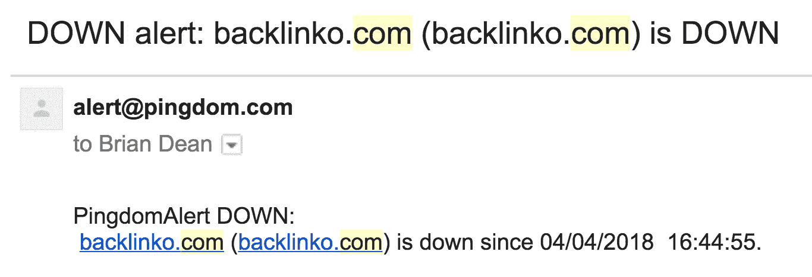</picture>

**3。删除“静重”页面**

谷歌最近表示，一个拥有大量页面的巨大网站可能对 SEO 不利。

引用谷歌代表(Gary Illyes)的话:

这就是为什么我要确保我网站上的每一页都很棒。

事实上，Backlinko 每月产生超过 50 万的独立访问者…

…尽管只有 196 个职位:

<picture><source type="image/webp" srcset="https://api.backlinko.com/app/uploads/2021/10/backlinko-published-posts-2021.webp 1528w, https://api.backlinko.com/app/uploads/2021/10/backlinko-published-posts-2021-300x113.webp 300w, https://api.backlinko.com/app/uploads/2021/10/backlinko-published-posts-2021-1280x484.webp 1280w, https://api.backlinko.com/app/uploads/2021/10/backlinko-published-posts-2021-768x291.webp 768w, https://api.backlinko.com/app/uploads/2021/10/backlinko-published-posts-2021-480x182.webp 480w, https://api.backlinko.com/app/uploads/2021/10/backlinko-published-posts-2021-640x242.webp 640w, https://api.backlinko.com/app/uploads/2021/10/backlinko-published-posts-2021-960x363.webp 960w, https://api.backlinko.com/app/uploads/2021/10/backlinko-published-posts-2021-1440x545.webp 1440w" sizes="(max-width: 300px) 100vw, 300px">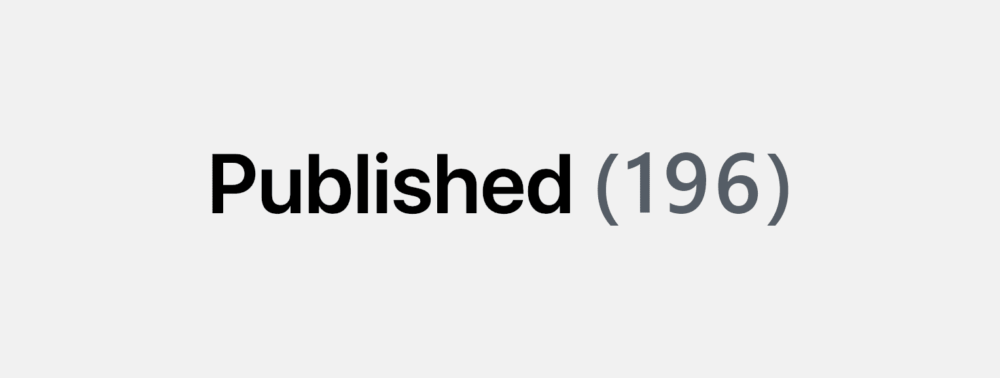</picture>

这怎么可能？

这是因为我专注于 100%的质量。

尽管这种重质量轻数量的方法很有效，但我看到很多网站都在为“死重量”页面而挣扎。

静重页面，如:

*   WordPress 类别和标签页面
*   过时的博客帖子
*   [重复内容](https://backlinko.com/hub/seo/duplicate-content "Duplicate Content")
*   低质量的博客文章
*   零销售额的电子商务产品页面
*   存档页面
*   精简内容/样板内容
*   旧服务页面

正如你刚才看到的，谷歌说这些自重页面会伤害你的搜索引擎优化的努力。所以我建议删除它们。

**4。提高你网站的停留时间** 

[停留时间](https://backlinko.com/hub/seo/dwell-time "Dwell Time")是另一个关键[谷歌排名因素](https://backlinko.com/google-ranking-factors)。

谷歌希望看到人们留在你的网站上。

如果人们很快从你的页面返回并访问另一个搜索结果，它会告诉谷歌:

“人们讨厌这个页面！”。

<picture><source type="image/webp" srcset="https://api.backlinko.com/app/uploads/2018/04/bounce-from-search-result-2.webp 1839w, https://api.backlinko.com/app/uploads/2018/04/bounce-from-search-result-2-300x178.webp 300w, https://api.backlinko.com/app/uploads/2018/04/bounce-from-search-result-2-1280x758.webp 1280w, https://api.backlinko.com/app/uploads/2018/04/bounce-from-search-result-2-768x455.webp 768w, https://api.backlinko.com/app/uploads/2018/04/bounce-from-search-result-2-1536x910.webp 1536w, https://api.backlinko.com/app/uploads/2018/04/bounce-from-search-result-2-480x284.webp 480w, https://api.backlinko.com/app/uploads/2018/04/bounce-from-search-result-2-640x379.webp 640w, https://api.backlinko.com/app/uploads/2018/04/bounce-from-search-result-2-960x568.webp 960w, https://api.backlinko.com/app/uploads/2018/04/bounce-from-search-result-2-1440x853.webp 1440w, https://api.backlinko.com/app/uploads/2018/04/bounce-from-search-result-2-1600x947.webp 1600w" sizes="(max-width: 600px) 100vw, 600px"></picture>

但是当人们从你的页面上得到他们想要的东西时，他们会留下来。谷歌会注意到:

<picture><source type="image/webp" srcset="https://api.backlinko.com/app/uploads/2018/04/result-with-low-bounce-rate-2.webp 1880w, https://api.backlinko.com/app/uploads/2018/04/result-with-low-bounce-rate-2-300x174.webp 300w, https://api.backlinko.com/app/uploads/2018/04/result-with-low-bounce-rate-2-1280x743.webp 1280w, https://api.backlinko.com/app/uploads/2018/04/result-with-low-bounce-rate-2-768x446.webp 768w, https://api.backlinko.com/app/uploads/2018/04/result-with-low-bounce-rate-2-1536x892.webp 1536w, https://api.backlinko.com/app/uploads/2018/04/result-with-low-bounce-rate-2-480x279.webp 480w, https://api.backlinko.com/app/uploads/2018/04/result-with-low-bounce-rate-2-640x372.webp 640w, https://api.backlinko.com/app/uploads/2018/04/result-with-low-bounce-rate-2-960x558.webp 960w, https://api.backlinko.com/app/uploads/2018/04/result-with-low-bounce-rate-2-1440x836.webp 1440w, https://api.backlinko.com/app/uploads/2018/04/result-with-low-bounce-rate-2-1600x929.webp 1600w" sizes="(max-width: 600px) 100vw, 600px">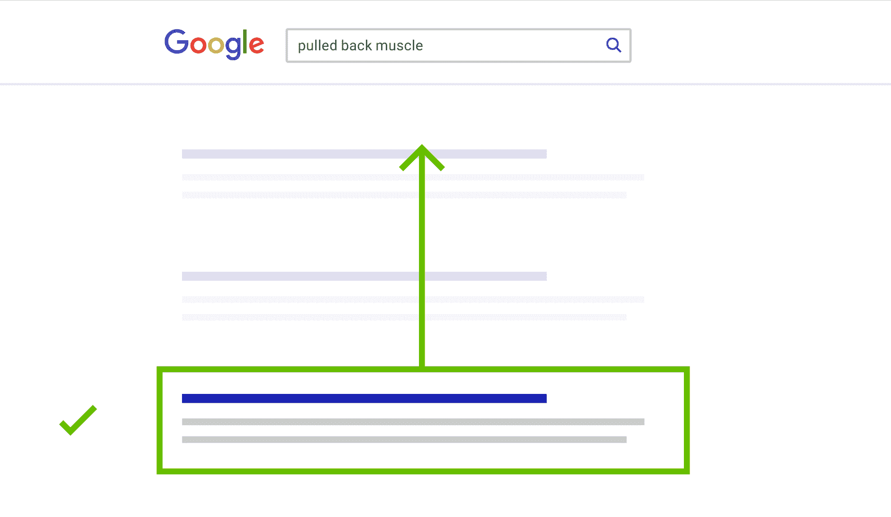</picture>

所以:

如何让人们在你的网站上停留更长时间？

这里有一些非常有效的简单提示:

**5。更新并重新发布过时内容**

你的博客上有积灰的旧文章吗？

如果是这样，请查看以下内容:

我最近更新并重新发布了我博客上的这篇文章:

<picture><source type="image/webp" srcset="https://api.backlinko.com/app/uploads/2020/12/backlinko-seo-copywriting-guide.webp 2560w, https://api.backlinko.com/app/uploads/2020/12/backlinko-seo-copywriting-guide-300x196.webp 300w, https://api.backlinko.com/app/uploads/2020/12/backlinko-seo-copywriting-guide-1280x836.webp 1280w, https://api.backlinko.com/app/uploads/2020/12/backlinko-seo-copywriting-guide-768x502.webp 768w, https://api.backlinko.com/app/uploads/2020/12/backlinko-seo-copywriting-guide-1536x1003.webp 1536w, https://api.backlinko.com/app/uploads/2020/12/backlinko-seo-copywriting-guide-2048x1338.webp 2048w, https://api.backlinko.com/app/uploads/2020/12/backlinko-seo-copywriting-guide-480x314.webp 480w, https://api.backlinko.com/app/uploads/2020/12/backlinko-seo-copywriting-guide-640x418.webp 640w, https://api.backlinko.com/app/uploads/2020/12/backlinko-seo-copywriting-guide-960x627.webp 960w, https://api.backlinko.com/app/uploads/2020/12/backlinko-seo-copywriting-guide-1440x941.webp 1440w, https://api.backlinko.com/app/uploads/2020/12/backlinko-seo-copywriting-guide-1600x1045.webp 1600w, https://api.backlinko.com/app/uploads/2020/12/backlinko-seo-copywriting-guide-1920x1254.webp 1920w" sizes="(max-width: 600px) 100vw, 600px">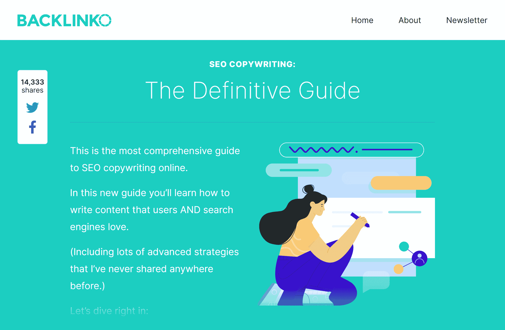</picture>

我改进了格式，增加了更多的内容，包括新的截图等等。

<picture><source type="image/webp" srcset="https://api.backlinko.com/app/uploads/2020/12/seo-copywriting-images-and-visuals.webp 2560w, https://api.backlinko.com/app/uploads/2020/12/seo-copywriting-images-and-visuals-300x557.webp 300w, https://api.backlinko.com/app/uploads/2020/12/seo-copywriting-images-and-visuals-1280x2376.webp 1280w, https://api.backlinko.com/app/uploads/2020/12/seo-copywriting-images-and-visuals-768x1426.webp 768w, https://api.backlinko.com/app/uploads/2020/12/seo-copywriting-images-and-visuals-827x1536.webp 827w, https://api.backlinko.com/app/uploads/2020/12/seo-copywriting-images-and-visuals-1103x2048.webp 1103w, https://api.backlinko.com/app/uploads/2020/12/seo-copywriting-images-and-visuals-480x891.webp 480w, https://api.backlinko.com/app/uploads/2020/12/seo-copywriting-images-and-visuals-640x1188.webp 640w, https://api.backlinko.com/app/uploads/2020/12/seo-copywriting-images-and-visuals-960x1782.webp 960w, https://api.backlinko.com/app/uploads/2020/12/seo-copywriting-images-and-visuals-1440x2673.webp 1440w, https://api.backlinko.com/app/uploads/2020/12/seo-copywriting-images-and-visuals-1600x2970.webp 1600w, https://api.backlinko.com/app/uploads/2020/12/seo-copywriting-images-and-visuals-1920x3564.webp 1920w" sizes="(max-width: 600px) 100vw, 600px"></picture>

(基本上是我把页面做的更好了。)

然后，我重新发布了它，就像它是一个新帖子一样。

这简单的 1-2 次点击使该页面的搜索引擎流量增加了 1，102.43%:

<picture><source type="image/webp" srcset="https://api.backlinko.com/app/uploads/2020/12/seo-copywriting-traffic-increase.webp 2500w, https://api.backlinko.com/app/uploads/2020/12/seo-copywriting-traffic-increase-300x230.webp 300w, https://api.backlinko.com/app/uploads/2020/12/seo-copywriting-traffic-increase-1280x982.webp 1280w, https://api.backlinko.com/app/uploads/2020/12/seo-copywriting-traffic-increase-768x589.webp 768w, https://api.backlinko.com/app/uploads/2020/12/seo-copywriting-traffic-increase-1536x1178.webp 1536w, https://api.backlinko.com/app/uploads/2020/12/seo-copywriting-traffic-increase-2048x1570.webp 2048w, https://api.backlinko.com/app/uploads/2020/12/seo-copywriting-traffic-increase-480x368.webp 480w, https://api.backlinko.com/app/uploads/2020/12/seo-copywriting-traffic-increase-640x491.webp 640w, https://api.backlinko.com/app/uploads/2020/12/seo-copywriting-traffic-increase-960x736.webp 960w, https://api.backlinko.com/app/uploads/2020/12/seo-copywriting-traffic-increase-1440x1104.webp 1440w, https://api.backlinko.com/app/uploads/2020/12/seo-copywriting-traffic-increase-1600x1227.webp 1600w, https://api.backlinko.com/app/uploads/2020/12/seo-copywriting-traffic-increase-1920x1472.webp 1920w" sizes="(max-width: 450px) 100vw, 450px">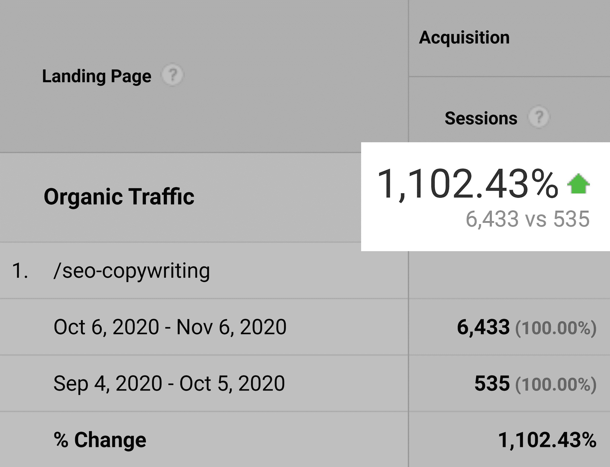</picture>

不错！

## **奖金#2:案例研究和例子**

现在是时候向你展示清单中的策略了。

具体来说，我将向你展示 Proven.com 公司的肖恩是如何利用清单上的几个项目将他的有机流量提高了 88%。

**1。Sean 如何改进他的页面优化**

肖恩的网站有很多页面。

所以在每一个上花费几个小时是没有意义的。

这就是为什么 Sean **专注于优化他的 10 个最重要的页面。**

Sean 的一些最重要的页面是博客帖子，如下所示:

<picture><source type="image/webp" srcset="https://api.backlinko.com/app/uploads/2016/06/a-blog-post-from-the-proven-blog-1.webp 1399w, https://api.backlinko.com/app/uploads/2016/06/a-blog-post-from-the-proven-blog-1-300x211.webp 300w, https://api.backlinko.com/app/uploads/2016/06/a-blog-post-from-the-proven-blog-1-1280x901.webp 1280w, https://api.backlinko.com/app/uploads/2016/06/a-blog-post-from-the-proven-blog-1-768x541.webp 768w, https://api.backlinko.com/app/uploads/2016/06/a-blog-post-from-the-proven-blog-1-480x338.webp 480w, https://api.backlinko.com/app/uploads/2016/06/a-blog-post-from-the-proven-blog-1-640x451.webp 640w, https://api.backlinko.com/app/uploads/2016/06/a-blog-post-from-the-proven-blog-1-960x676.webp 960w" sizes="(max-width: 600px) 100vw, 600px">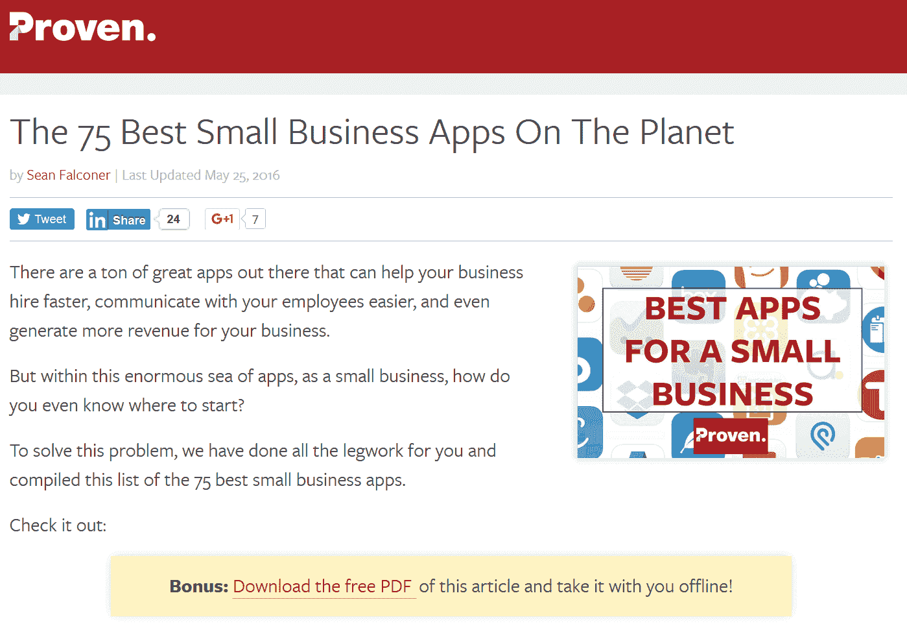</picture>

其他的是服务页面，比如他的主页:

<picture><source type="image/webp" srcset="https://api.backlinko.com/app/uploads/2016/06/proven-homepage-1.webp 1963w, https://api.backlinko.com/app/uploads/2016/06/proven-homepage-1-300x217.webp 300w, https://api.backlinko.com/app/uploads/2016/06/proven-homepage-1-1280x925.webp 1280w, https://api.backlinko.com/app/uploads/2016/06/proven-homepage-1-768x555.webp 768w, https://api.backlinko.com/app/uploads/2016/06/proven-homepage-1-1536x1110.webp 1536w, https://api.backlinko.com/app/uploads/2016/06/proven-homepage-1-480x347.webp 480w, https://api.backlinko.com/app/uploads/2016/06/proven-homepage-1-640x463.webp 640w, https://api.backlinko.com/app/uploads/2016/06/proven-homepage-1-960x694.webp 960w, https://api.backlinko.com/app/uploads/2016/06/proven-homepage-1-1440x1041.webp 1440w, https://api.backlinko.com/app/uploads/2016/06/proven-homepage-1-1600x1157.webp 1600w, https://api.backlinko.com/app/uploads/2016/06/proven-homepage-1-1920x1388.webp 1920w" sizes="(max-width: 600px) 100vw, 600px"></picture>

但总的来说，Sean 在所有 10 页上都使用了这份清单中的页面搜索引擎优化技巧。

Sean 的内容已经得到了很好的优化。所以它只需要做一些调整。

例如，让我们来看看 Sean 是如何改进他的关于向推荐人提问的帖子的。

<picture><source type="image/webp" srcset="https://api.backlinko.com/app/uploads/2016/06/a-piece-of-content.webp 1414w, https://api.backlinko.com/app/uploads/2016/06/a-piece-of-content-300x236.webp 300w, https://api.backlinko.com/app/uploads/2016/06/a-piece-of-content-1280x1006.webp 1280w, https://api.backlinko.com/app/uploads/2016/06/a-piece-of-content-768x603.webp 768w, https://api.backlinko.com/app/uploads/2016/06/a-piece-of-content-480x377.webp 480w, https://api.backlinko.com/app/uploads/2016/06/a-piece-of-content-640x503.webp 640w, https://api.backlinko.com/app/uploads/2016/06/a-piece-of-content-960x754.webp 960w" sizes="(max-width: 600px) 100vw, 600px">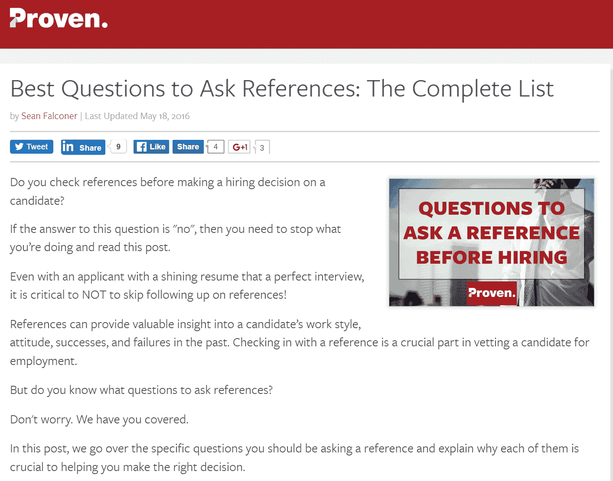</picture>

首先，Sean 在文章的前 100 个单词中添加他的目标关键字(“要询问的参考问题”):

<picture><source type="image/webp" srcset="https://api.backlinko.com/app/uploads/2018/04/using-target-keyword-in-content-1.webp 1516w, https://api.backlinko.com/app/uploads/2018/04/using-target-keyword-in-content-1-300x38.webp 300w, https://api.backlinko.com/app/uploads/2018/04/using-target-keyword-in-content-1-1280x160.webp 1280w, https://api.backlinko.com/app/uploads/2018/04/using-target-keyword-in-content-1-768x96.webp 768w, https://api.backlinko.com/app/uploads/2018/04/using-target-keyword-in-content-1-480x60.webp 480w, https://api.backlinko.com/app/uploads/2018/04/using-target-keyword-in-content-1-640x80.webp 640w, https://api.backlinko.com/app/uploads/2018/04/using-target-keyword-in-content-1-960x120.webp 960w, https://api.backlinko.com/app/uploads/2018/04/using-target-keyword-in-content-1-1440x180.webp 1440w" sizes="(max-width: 500px) 100vw, 500px">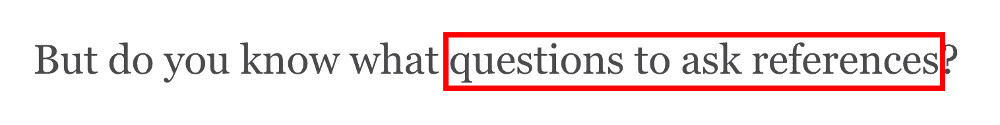</picture>

他还在自己的内容中加入了 LSI 关键词(比如“商业参考”):

<picture><source type="image/webp" srcset="https://api.backlinko.com/app/uploads/2018/04/lsi-keyword-usage.webp 1822w, https://api.backlinko.com/app/uploads/2018/04/lsi-keyword-usage-300x87.webp 300w, https://api.backlinko.com/app/uploads/2018/04/lsi-keyword-usage-1280x371.webp 1280w, https://api.backlinko.com/app/uploads/2018/04/lsi-keyword-usage-768x223.webp 768w, https://api.backlinko.com/app/uploads/2018/04/lsi-keyword-usage-1536x445.webp 1536w, https://api.backlinko.com/app/uploads/2018/04/lsi-keyword-usage-480x139.webp 480w, https://api.backlinko.com/app/uploads/2018/04/lsi-keyword-usage-640x185.webp 640w, https://api.backlinko.com/app/uploads/2018/04/lsi-keyword-usage-960x278.webp 960w, https://api.backlinko.com/app/uploads/2018/04/lsi-keyword-usage-1440x417.webp 1440w, https://api.backlinko.com/app/uploads/2018/04/lsi-keyword-usage-1600x464.webp 1600w" sizes="(max-width: 550px) 100vw, 550px">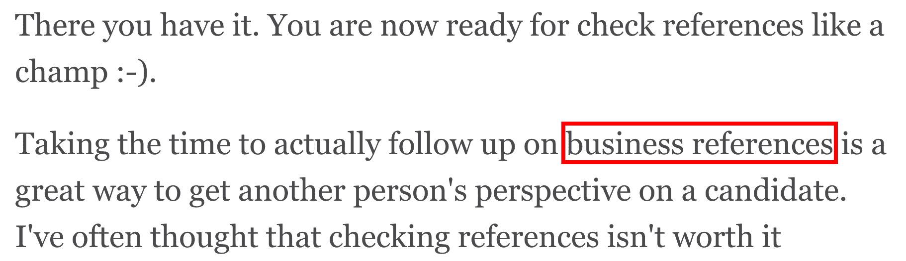</picture>

现在 Sean 的内容已经进行了关键词优化，是时候提高他的点击率了。

**2。肖恩如何(迅速)将点击率提高 64.1%** 

Sean 在他的博客上发布了一个帖子，名为:100+寻找利基人才的最佳工作板块。

<picture><source type="image/webp" srcset="https://api.backlinko.com/app/uploads/2016/06/proven-blog-post.webp 1327w, https://api.backlinko.com/app/uploads/2016/06/proven-blog-post-300x283.webp 300w, https://api.backlinko.com/app/uploads/2016/06/proven-blog-post-1280x1209.webp 1280w, https://api.backlinko.com/app/uploads/2016/06/proven-blog-post-768x725.webp 768w, https://api.backlinko.com/app/uploads/2016/06/proven-blog-post-480x453.webp 480w, https://api.backlinko.com/app/uploads/2016/06/proven-blog-post-640x604.webp 640w, https://api.backlinko.com/app/uploads/2016/06/proven-blog-post-960x906.webp 960w" sizes="(max-width: 600px) 100vw, 600px">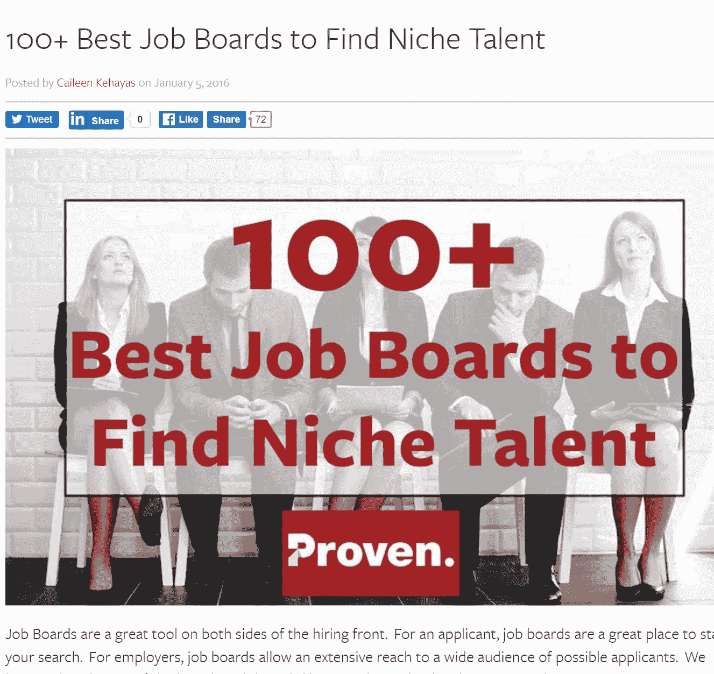</picture>

以下是该页面的有机结果:

<picture><source type="image/webp" srcset="https://api.backlinko.com/app/uploads/2016/06/google-listing.webp 1657w, https://api.backlinko.com/app/uploads/2016/06/google-listing-300x60.webp 300w, https://api.backlinko.com/app/uploads/2016/06/google-listing-1280x256.webp 1280w, https://api.backlinko.com/app/uploads/2016/06/google-listing-768x154.webp 768w, https://api.backlinko.com/app/uploads/2016/06/google-listing-1536x308.webp 1536w, https://api.backlinko.com/app/uploads/2016/06/google-listing-480x96.webp 480w, https://api.backlinko.com/app/uploads/2016/06/google-listing-640x128.webp 640w, https://api.backlinko.com/app/uploads/2016/06/google-listing-960x192.webp 960w, https://api.backlinko.com/app/uploads/2016/06/google-listing-1440x289.webp 1440w, https://api.backlinko.com/app/uploads/2016/06/google-listing-1600x321.webp 1600w" sizes="(max-width: 600px) 100vw, 600px">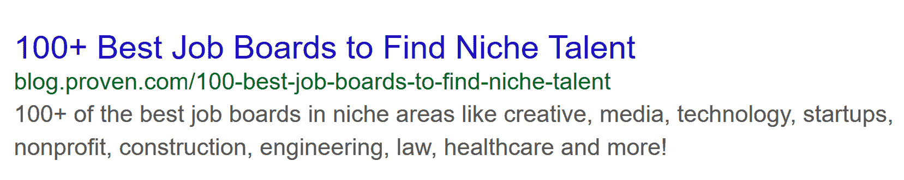</picture>

不错…但还可以更好。

以下是 Sean 为提高此列表的点击率所做的工作:

首先，他查看 Adwords 广告中的关键词，比如“求职公告板”:

他注意到大多数**在他们的广告中列出了具体数量的求职板**:

<picture><source type="image/webp" srcset="https://api.backlinko.com/app/uploads/2016/06/adwords-with-a-number.webp 1304w, https://api.backlinko.com/app/uploads/2016/06/adwords-with-a-number-300x119.webp 300w, https://api.backlinko.com/app/uploads/2016/06/adwords-with-a-number-1280x509.webp 1280w, https://api.backlinko.com/app/uploads/2016/06/adwords-with-a-number-768x306.webp 768w, https://api.backlinko.com/app/uploads/2016/06/adwords-with-a-number-480x191.webp 480w, https://api.backlinko.com/app/uploads/2016/06/adwords-with-a-number-640x255.webp 640w, https://api.backlinko.com/app/uploads/2016/06/adwords-with-a-number-960x382.webp 960w" sizes="(max-width: 600px) 100vw, 600px">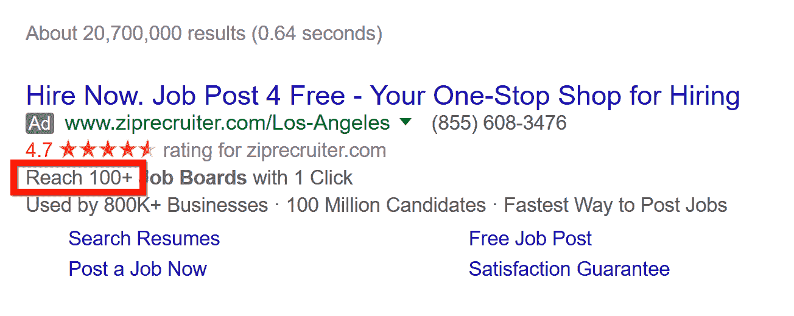</picture>

(肖恩还注意到，他们都没有使用“小众人才”这个术语。)

所以肖恩把他的标题标签改成了:

**“100 多个求职者和招聘者的工作板”**

和他的元描述标签:

“在一个地方找到网上最好的招聘信息。请点击此处查看我们的 100+主板列表。”

这是他的谷歌搜索结果在改变后的样子:

<picture><source type="image/webp" srcset="https://api.backlinko.com/app/uploads/2016/06/new-google-result.webp 1795w, https://api.backlinko.com/app/uploads/2016/06/new-google-result-300x51.webp 300w, https://api.backlinko.com/app/uploads/2016/06/new-google-result-1280x218.webp 1280w, https://api.backlinko.com/app/uploads/2016/06/new-google-result-768x131.webp 768w, https://api.backlinko.com/app/uploads/2016/06/new-google-result-1536x262.webp 1536w, https://api.backlinko.com/app/uploads/2016/06/new-google-result-480x82.webp 480w, https://api.backlinko.com/app/uploads/2016/06/new-google-result-640x109.webp 640w, https://api.backlinko.com/app/uploads/2016/06/new-google-result-960x164.webp 960w, https://api.backlinko.com/app/uploads/2016/06/new-google-result-1440x245.webp 1440w, https://api.backlinko.com/app/uploads/2016/06/new-google-result-1600x273.webp 1600w" sizes="(max-width: 600px) 100vw, 600px">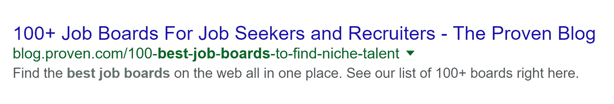</picture>

而那个页面的点击率是 4.88%…

… **比以前提高了 64.1%。**

<picture><source type="image/webp" srcset="https://api.backlinko.com/app/uploads/2016/06/average-ctr.webp 1140w, https://api.backlinko.com/app/uploads/2016/06/average-ctr-300x252.webp 300w, https://api.backlinko.com/app/uploads/2016/06/average-ctr-768x644.webp 768w, https://api.backlinko.com/app/uploads/2016/06/average-ctr-480x403.webp 480w, https://api.backlinko.com/app/uploads/2016/06/average-ctr-640x537.webp 640w, https://api.backlinko.com/app/uploads/2016/06/average-ctr-960x805.webp 960w" sizes="(max-width: 500px) 100vw, 500px">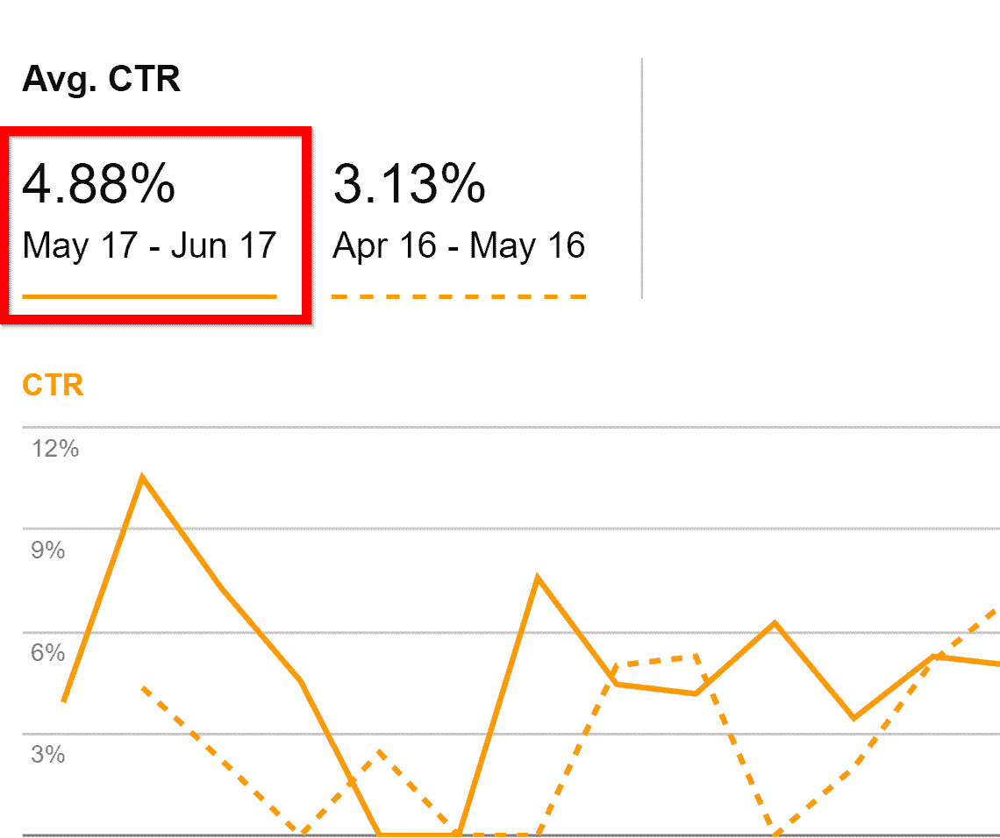</picture>

很酷吧。

**3。肖恩如何让用户在他的网站** 上花更多时间

如果人们像强力胶一样粘着你的网站，谷歌会提升你的排名。

肖恩是如何让人们在他的网站上花更多时间的:

首先，Sean 将他的内容放在了折叠上方。

怎么会？

Proven 的博客文章过去在网站导航和文章标题之间有很大的差距:

<picture><source type="image/webp" srcset="https://api.backlinko.com/app/uploads/2018/04/space-above-a-blog-post.webp 1522w, https://api.backlinko.com/app/uploads/2018/04/space-above-a-blog-post-300x166.webp 300w, https://api.backlinko.com/app/uploads/2018/04/space-above-a-blog-post-1280x706.webp 1280w, https://api.backlinko.com/app/uploads/2018/04/space-above-a-blog-post-768x424.webp 768w, https://api.backlinko.com/app/uploads/2018/04/space-above-a-blog-post-480x265.webp 480w, https://api.backlinko.com/app/uploads/2018/04/space-above-a-blog-post-640x353.webp 640w, https://api.backlinko.com/app/uploads/2018/04/space-above-a-blog-post-960x530.webp 960w, https://api.backlinko.com/app/uploads/2018/04/space-above-a-blog-post-1440x795.webp 1440w" sizes="(max-width: 600px) 100vw, 600px">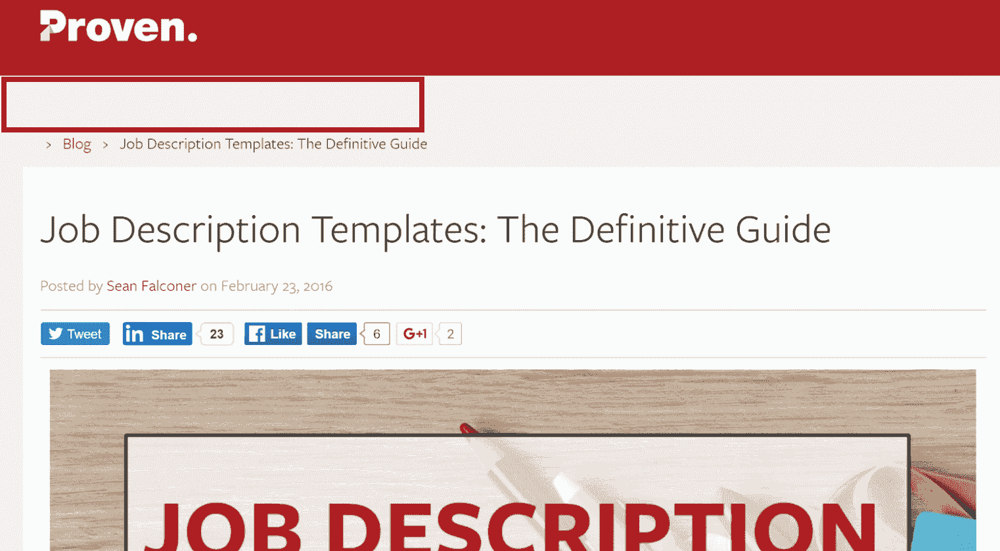</picture>

你页面的顶端是百万美元的房地产。

这就是为什么你要避免不必要的空间，把你的内容推到文件夹下面。

所以他减少了 50%的空间。

Proven 的博客也有[面包屑导航](https://www.w3schools.com/howto/howto_css_breadcrumbs.asp)。

<picture><source type="image/webp" srcset="https://api.backlinko.com/app/uploads/2018/04/breadcrumbs-navigation.webp 1556w, https://api.backlinko.com/app/uploads/2018/04/breadcrumbs-navigation-300x138.webp 300w, https://api.backlinko.com/app/uploads/2018/04/breadcrumbs-navigation-1280x587.webp 1280w, https://api.backlinko.com/app/uploads/2018/04/breadcrumbs-navigation-768x352.webp 768w, https://api.backlinko.com/app/uploads/2018/04/breadcrumbs-navigation-1536x705.webp 1536w, https://api.backlinko.com/app/uploads/2018/04/breadcrumbs-navigation-480x220.webp 480w, https://api.backlinko.com/app/uploads/2018/04/breadcrumbs-navigation-640x294.webp 640w, https://api.backlinko.com/app/uploads/2018/04/breadcrumbs-navigation-960x441.webp 960w, https://api.backlinko.com/app/uploads/2018/04/breadcrumbs-navigation-1440x661.webp 1440w" sizes="(max-width: 600px) 100vw, 600px">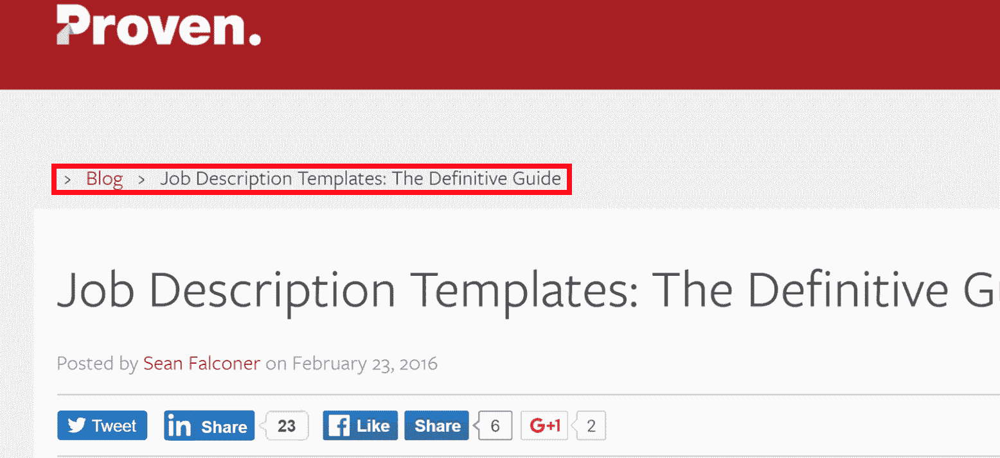</picture>

面包屑导航对一个电子商务网站来说是可以的。但是对于博客来说不是必须的。

所以肖恩处理掉了。

Proven 的博客帖子在每个帖子的顶部都有大量的图片。

<picture><source type="image/webp" srcset="https://api.backlinko.com/app/uploads/2016/06/image-usage-in-a-blog-post.webp 1403w, https://api.backlinko.com/app/uploads/2016/06/image-usage-in-a-blog-post-300x261.webp 300w, https://api.backlinko.com/app/uploads/2016/06/image-usage-in-a-blog-post-1280x1113.webp 1280w, https://api.backlinko.com/app/uploads/2016/06/image-usage-in-a-blog-post-768x668.webp 768w, https://api.backlinko.com/app/uploads/2016/06/image-usage-in-a-blog-post-480x417.webp 480w, https://api.backlinko.com/app/uploads/2016/06/image-usage-in-a-blog-post-640x557.webp 640w, https://api.backlinko.com/app/uploads/2016/06/image-usage-in-a-blog-post-960x835.webp 960w" sizes="(max-width: 600px) 100vw, 600px">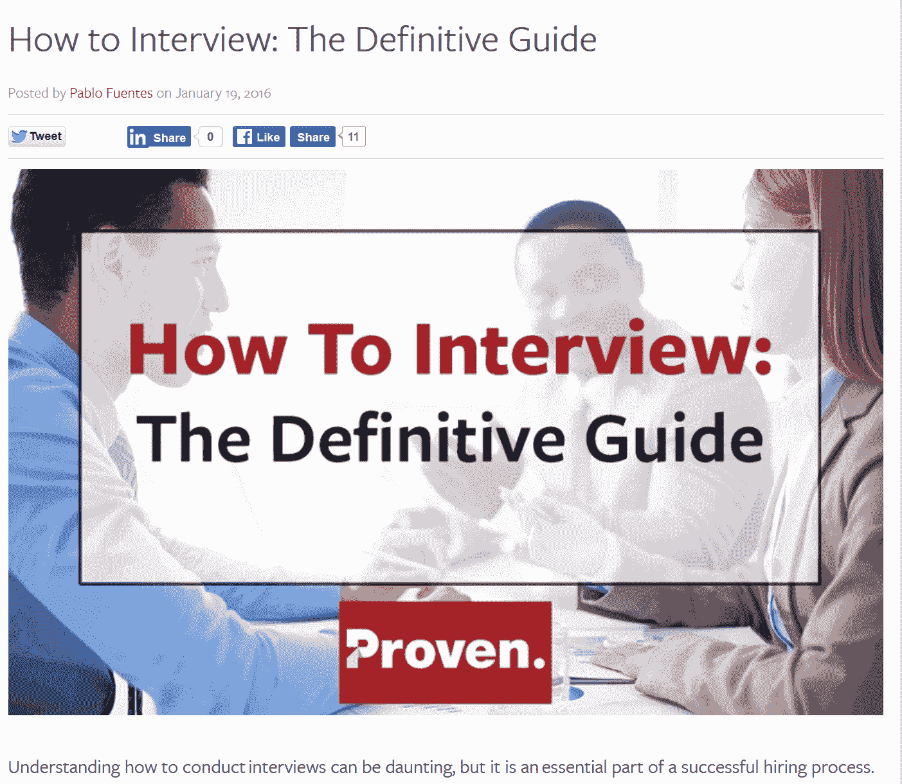</picture>

这些看起来绝对很酷…

…但他们把肖恩的优秀内容推到了折叠线以下。

所以肖恩把他的帖子图片缩小了很多:

<picture><source type="image/webp" srcset="https://api.backlinko.com/app/uploads/2018/04/example-of-image-in-content.webp 1046w, https://api.backlinko.com/app/uploads/2018/04/example-of-image-in-content-300x168.webp 300w, https://api.backlinko.com/app/uploads/2018/04/example-of-image-in-content-768x430.webp 768w, https://api.backlinko.com/app/uploads/2018/04/example-of-image-in-content-480x269.webp 480w, https://api.backlinko.com/app/uploads/2018/04/example-of-image-in-content-640x359.webp 640w, https://api.backlinko.com/app/uploads/2018/04/example-of-image-in-content-960x538.webp 960w" sizes="(max-width: 523px) 100vw, 523px">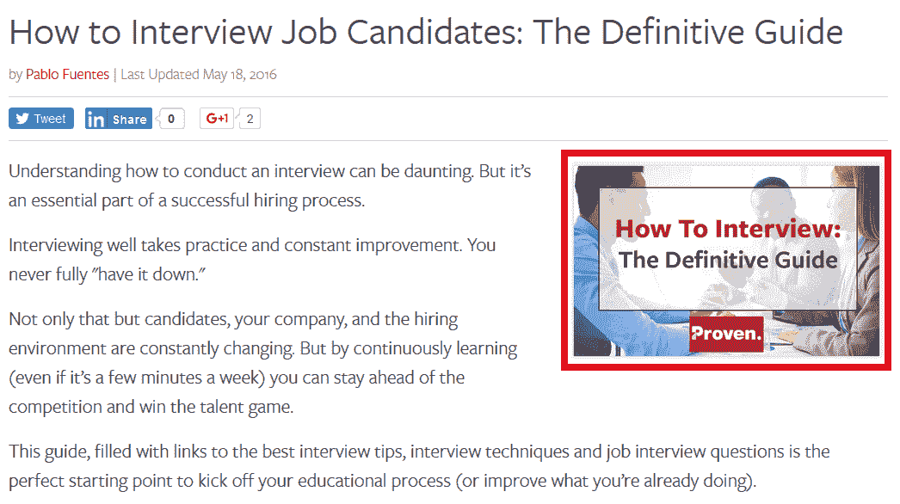</picture>

接下来，肖恩让他的博文介绍变得“有粘性”。

你的博客文章介绍是巨大的。

因为事实是这样的:

如果你在介绍中失去了某人，你就永远失去了他们。

但是如果你用引人注目的介绍吸引某人…

…他们更有可能留下来。

例如，肖恩修改了他的介绍:

<picture><source type="image/webp" srcset="https://api.backlinko.com/app/uploads/2016/06/blog-post-introduction.webp 1691w, https://api.backlinko.com/app/uploads/2016/06/blog-post-introduction-300x115.webp 300w, https://api.backlinko.com/app/uploads/2016/06/blog-post-introduction-1280x489.webp 1280w, https://api.backlinko.com/app/uploads/2016/06/blog-post-introduction-768x293.webp 768w, https://api.backlinko.com/app/uploads/2016/06/blog-post-introduction-1536x587.webp 1536w, https://api.backlinko.com/app/uploads/2016/06/blog-post-introduction-480x183.webp 480w, https://api.backlinko.com/app/uploads/2016/06/blog-post-introduction-640x244.webp 640w, https://api.backlinko.com/app/uploads/2016/06/blog-post-introduction-960x367.webp 960w, https://api.backlinko.com/app/uploads/2016/06/blog-post-introduction-1440x550.webp 1440w, https://api.backlinko.com/app/uploads/2016/06/blog-post-introduction-1600x611.webp 1600w" sizes="(max-width: 600px) 100vw, 600px">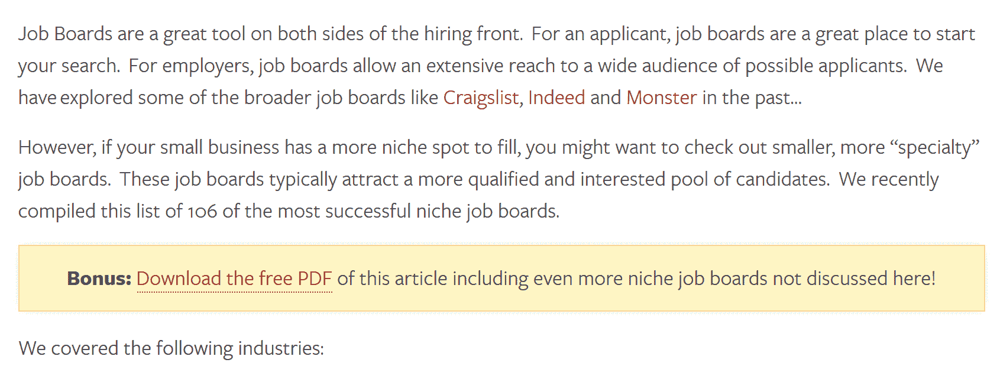</picture>

对此:

<picture><source type="image/webp" srcset="https://api.backlinko.com/app/uploads/2016/06/new-blog-post-introduction.webp 1667w, https://api.backlinko.com/app/uploads/2016/06/new-blog-post-introduction-300x177.webp 300w, https://api.backlinko.com/app/uploads/2016/06/new-blog-post-introduction-1280x756.webp 1280w, https://api.backlinko.com/app/uploads/2016/06/new-blog-post-introduction-768x453.webp 768w, https://api.backlinko.com/app/uploads/2016/06/new-blog-post-introduction-1536x907.webp 1536w, https://api.backlinko.com/app/uploads/2016/06/new-blog-post-introduction-480x283.webp 480w, https://api.backlinko.com/app/uploads/2016/06/new-blog-post-introduction-640x378.webp 640w, https://api.backlinko.com/app/uploads/2016/06/new-blog-post-introduction-960x567.webp 960w, https://api.backlinko.com/app/uploads/2016/06/new-blog-post-introduction-1440x850.webp 1440w, https://api.backlinko.com/app/uploads/2016/06/new-blog-post-introduction-1600x944.webp 1600w" sizes="(max-width: 600px) 100vw, 600px">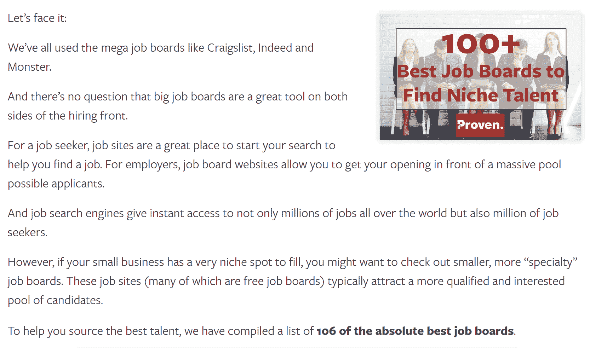</picture>

他到底改变了什么？

首先，肖恩删掉了那些显而易见的句子。

<picture><source type="image/webp" srcset="https://api.backlinko.com/app/uploads/2018/04/first-sentence-of-content.webp 1433w, https://api.backlinko.com/app/uploads/2018/04/first-sentence-of-content-300x118.webp 300w, https://api.backlinko.com/app/uploads/2018/04/first-sentence-of-content-1280x503.webp 1280w, https://api.backlinko.com/app/uploads/2018/04/first-sentence-of-content-768x302.webp 768w, https://api.backlinko.com/app/uploads/2018/04/first-sentence-of-content-480x189.webp 480w, https://api.backlinko.com/app/uploads/2018/04/first-sentence-of-content-640x251.webp 640w, https://api.backlinko.com/app/uploads/2018/04/first-sentence-of-content-960x377.webp 960w" sizes="(max-width: 550px) 100vw, 550px">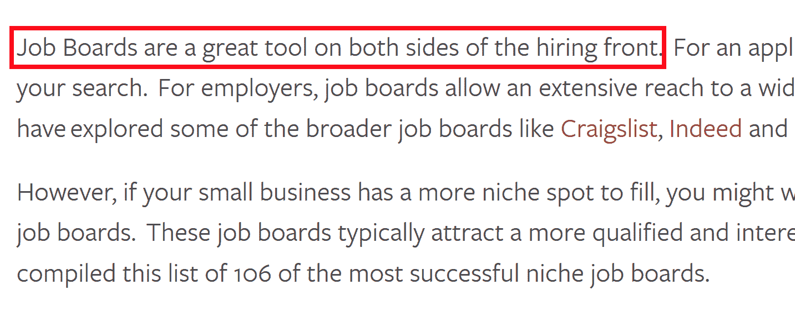</picture>

他还对内容进行了格式化，使得每段只有 1-2 个句子([这提高了你的内容的可读性](https://www.nngroup.com/articles/how-users-read-on-the-web/))。

<picture><source type="image/webp" srcset="https://api.backlinko.com/app/uploads/2018/04/short-paragraphs.webp 1528w, https://api.backlinko.com/app/uploads/2018/04/short-paragraphs-300x159.webp 300w, https://api.backlinko.com/app/uploads/2018/04/short-paragraphs-1280x677.webp 1280w, https://api.backlinko.com/app/uploads/2018/04/short-paragraphs-768x406.webp 768w, https://api.backlinko.com/app/uploads/2018/04/short-paragraphs-480x254.webp 480w, https://api.backlinko.com/app/uploads/2018/04/short-paragraphs-640x338.webp 640w, https://api.backlinko.com/app/uploads/2018/04/short-paragraphs-960x508.webp 960w, https://api.backlinko.com/app/uploads/2018/04/short-paragraphs-1440x761.webp 1440w" sizes="(max-width: 600px) 100vw, 600px">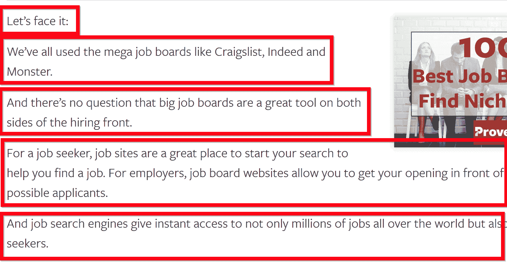</picture>

这些设计和推出的改进提高了 Proven 的“平均”。页面上的时间减少了 12.2%:

<picture><source type="image/webp" srcset="https://api.backlinko.com/app/uploads/2016/06/google-analytics-avg-time-on-page.webp 1838w, https://api.backlinko.com/app/uploads/2016/06/google-analytics-avg-time-on-page-300x170.webp 300w, https://api.backlinko.com/app/uploads/2016/06/google-analytics-avg-time-on-page-1280x725.webp 1280w, https://api.backlinko.com/app/uploads/2016/06/google-analytics-avg-time-on-page-768x435.webp 768w, https://api.backlinko.com/app/uploads/2016/06/google-analytics-avg-time-on-page-1536x870.webp 1536w, https://api.backlinko.com/app/uploads/2016/06/google-analytics-avg-time-on-page-480x272.webp 480w, https://api.backlinko.com/app/uploads/2016/06/google-analytics-avg-time-on-page-640x362.webp 640w, https://api.backlinko.com/app/uploads/2016/06/google-analytics-avg-time-on-page-960x544.webp 960w, https://api.backlinko.com/app/uploads/2016/06/google-analytics-avg-time-on-page-1440x816.webp 1440w, https://api.backlinko.com/app/uploads/2016/06/google-analytics-avg-time-on-page-1600x906.webp 1600w" sizes="(max-width: 600px) 100vw, 600px">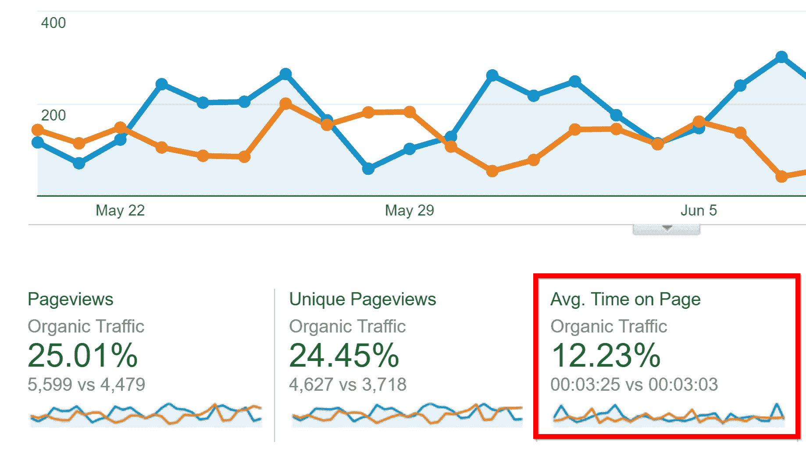</picture>

**4。Proven 删除 10k 死重页面时发生了什么**

Proven 的网站上有很多无用的页面。

事实上，他们有 48，300 页在谷歌上被编入索引:

<picture><source type="image/webp" srcset="https://api.backlinko.com/app/uploads/2016/06/results.webp 1932w, https://api.backlinko.com/app/uploads/2016/06/results-300x167.webp 300w, https://api.backlinko.com/app/uploads/2016/06/results-1280x714.webp 1280w, https://api.backlinko.com/app/uploads/2016/06/results-768x429.webp 768w, https://api.backlinko.com/app/uploads/2016/06/results-1536x857.webp 1536w, https://api.backlinko.com/app/uploads/2016/06/results-480x268.webp 480w, https://api.backlinko.com/app/uploads/2016/06/results-640x357.webp 640w, https://api.backlinko.com/app/uploads/2016/06/results-960x536.webp 960w, https://api.backlinko.com/app/uploads/2016/06/results-1440x803.webp 1440w, https://api.backlinko.com/app/uploads/2016/06/results-1600x893.webp 1600w, https://api.backlinko.com/app/uploads/2016/06/results-1920x1071.webp 1920w" sizes="(max-width: 600px) 100vw, 600px">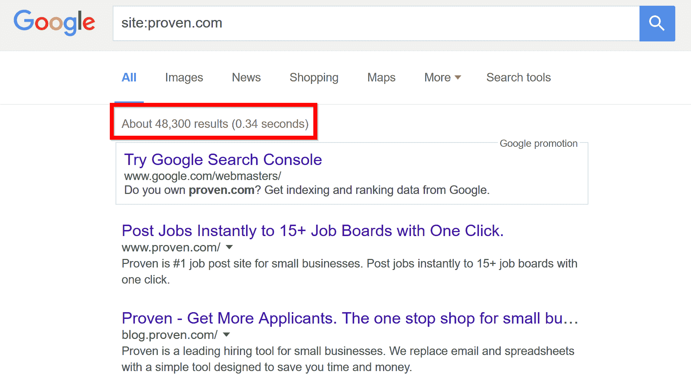</picture>

因为 Proven.com 是一个在线工作平台，他们有很多旧的工作列表:

<picture><source type="image/webp" srcset="https://api.backlinko.com/app/uploads/2016/06/old-job-posting.webp 1724w, https://api.backlinko.com/app/uploads/2016/06/old-job-posting-300x278.webp 300w, https://api.backlinko.com/app/uploads/2016/06/old-job-posting-1280x1187.webp 1280w, https://api.backlinko.com/app/uploads/2016/06/old-job-posting-768x712.webp 768w, https://api.backlinko.com/app/uploads/2016/06/old-job-posting-1536x1425.webp 1536w, https://api.backlinko.com/app/uploads/2016/06/old-job-posting-480x445.webp 480w, https://api.backlinko.com/app/uploads/2016/06/old-job-posting-640x594.webp 640w, https://api.backlinko.com/app/uploads/2016/06/old-job-posting-960x890.webp 960w, https://api.backlinko.com/app/uploads/2016/06/old-job-posting-1440x1336.webp 1440w, https://api.backlinko.com/app/uploads/2016/06/old-job-posting-1600x1484.webp 1600w" sizes="(max-width: 600px) 100vw, 600px">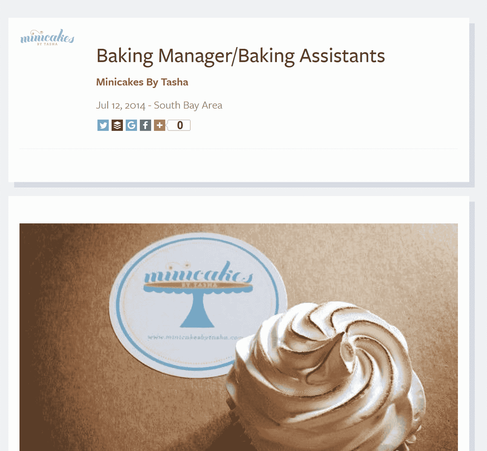</picture>

更不用说那些几个月都没有发布招聘信息的公司的简介页面了:

<picture><source type="image/webp" srcset="https://api.backlinko.com/app/uploads/2016/06/company-profile-page.webp 1451w, https://api.backlinko.com/app/uploads/2016/06/company-profile-page-300x221.webp 300w, https://api.backlinko.com/app/uploads/2016/06/company-profile-page-1280x945.webp 1280w, https://api.backlinko.com/app/uploads/2016/06/company-profile-page-768x567.webp 768w, https://api.backlinko.com/app/uploads/2016/06/company-profile-page-480x354.webp 480w, https://api.backlinko.com/app/uploads/2016/06/company-profile-page-640x472.webp 640w, https://api.backlinko.com/app/uploads/2016/06/company-profile-page-960x709.webp 960w, https://api.backlinko.com/app/uploads/2016/06/company-profile-page-1440x1063.webp 1440w" sizes="(max-width: 600px) 100vw, 600px">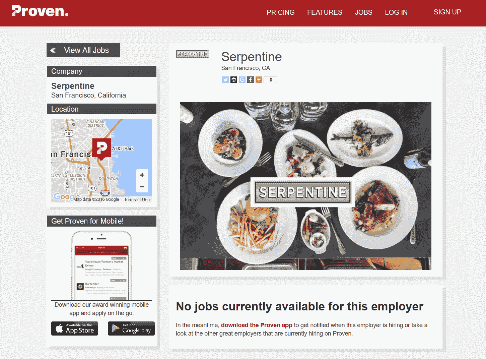</picture>

此外，Proven 的搜索结果页面正在被索引…

<picture><source type="image/webp" srcset="https://api.backlinko.com/app/uploads/2016/06/indexed-search-result-page.webp 1339w, https://api.backlinko.com/app/uploads/2016/06/indexed-search-result-page-300x165.webp 300w, https://api.backlinko.com/app/uploads/2016/06/indexed-search-result-page-1280x704.webp 1280w, https://api.backlinko.com/app/uploads/2016/06/indexed-search-result-page-768x422.webp 768w, https://api.backlinko.com/app/uploads/2016/06/indexed-search-result-page-480x264.webp 480w, https://api.backlinko.com/app/uploads/2016/06/indexed-search-result-page-640x352.webp 640w, https://api.backlinko.com/app/uploads/2016/06/indexed-search-result-page-960x528.webp 960w" sizes="(max-width: 600px) 100vw, 600px">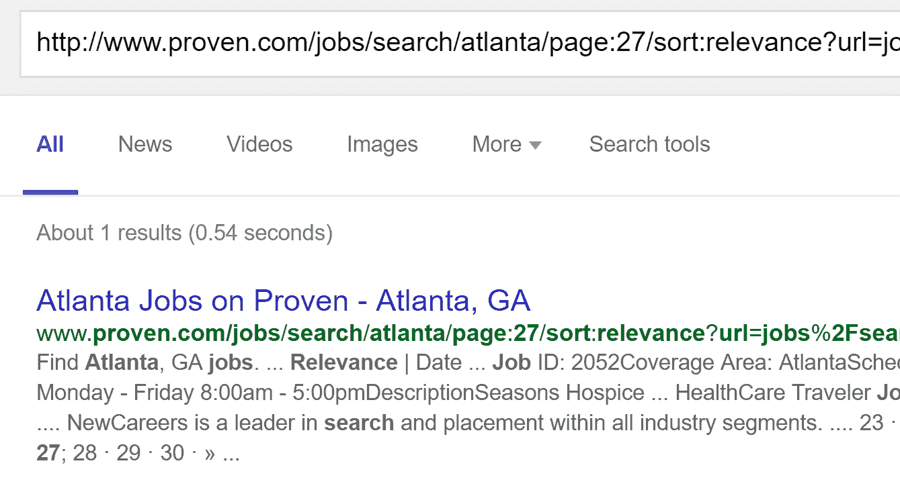</picture>

…这产生了大量重复的内容。

因此，肖恩迅速删除或重定向 Proven.com 的自重网页。

肖恩总共删除或重定向了超过 10，000 页。

这也是他们的搜索流量提升如此之快的主要原因之一。

<picture><source type="image/webp" srcset="https://api.backlinko.com/app/uploads/2016/06/organic-traffic-increase-in-google-analytics-part-2.webp 1603w, https://api.backlinko.com/app/uploads/2016/06/organic-traffic-increase-in-google-analytics-part-2-300x192.webp 300w, https://api.backlinko.com/app/uploads/2016/06/organic-traffic-increase-in-google-analytics-part-2-1280x820.webp 1280w, https://api.backlinko.com/app/uploads/2016/06/organic-traffic-increase-in-google-analytics-part-2-768x492.webp 768w, https://api.backlinko.com/app/uploads/2016/06/organic-traffic-increase-in-google-analytics-part-2-1536x984.webp 1536w, https://api.backlinko.com/app/uploads/2016/06/organic-traffic-increase-in-google-analytics-part-2-480x308.webp 480w, https://api.backlinko.com/app/uploads/2016/06/organic-traffic-increase-in-google-analytics-part-2-640x410.webp 640w, https://api.backlinko.com/app/uploads/2016/06/organic-traffic-increase-in-google-analytics-part-2-960x615.webp 960w, https://api.backlinko.com/app/uploads/2016/06/organic-traffic-increase-in-google-analytics-part-2-1440x923.webp 1440w, https://api.backlinko.com/app/uploads/2016/06/organic-traffic-increase-in-google-analytics-part-2-1600x1025.webp 1600w" sizes="(max-width: 600px) 100vw, 600px">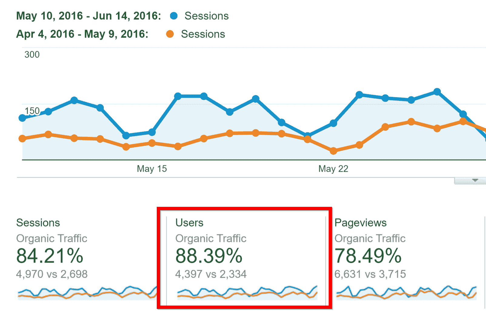</picture>

## **结论**

正如你所看到的，这个 SEO 清单真的有用。

但是在你开始做清单之前，我想听听你的意见。

你觉得今天的帖子怎么样？

或者你对你读到的东西有疑问。

请在下面留言告诉我。