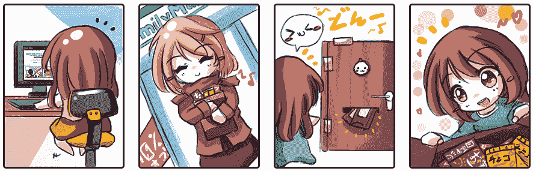
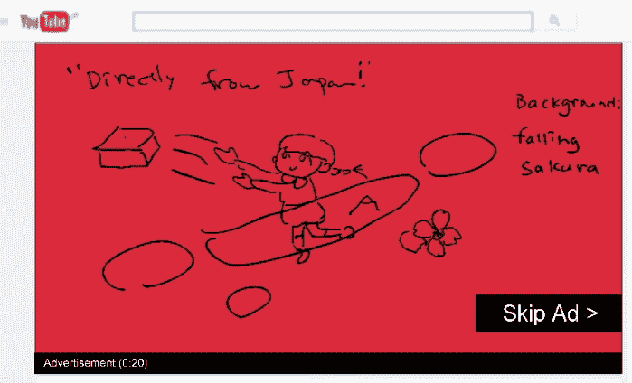
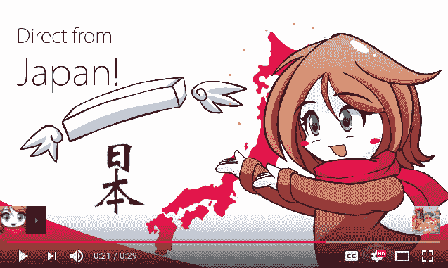
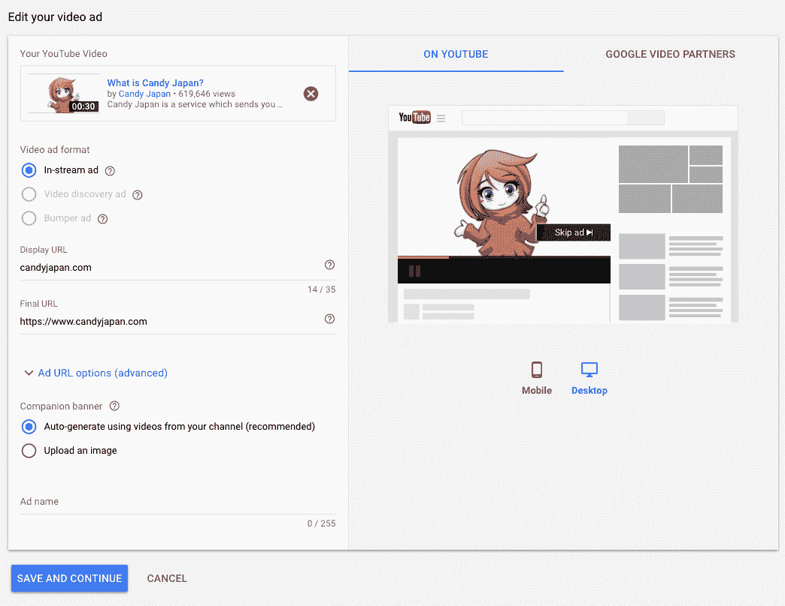
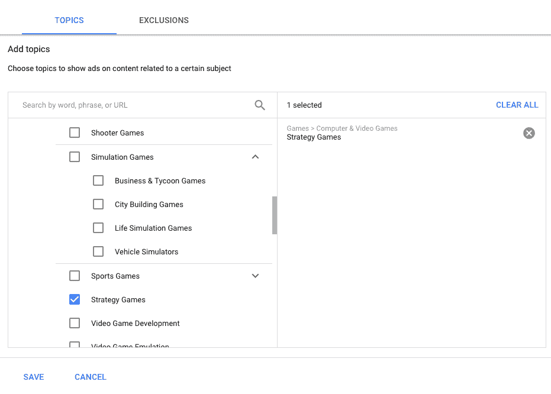
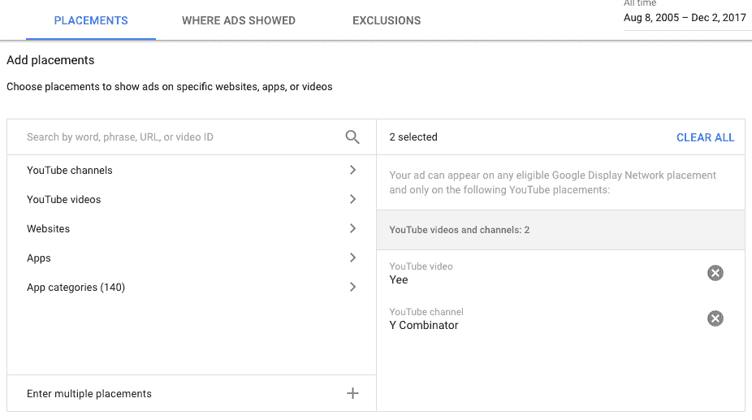
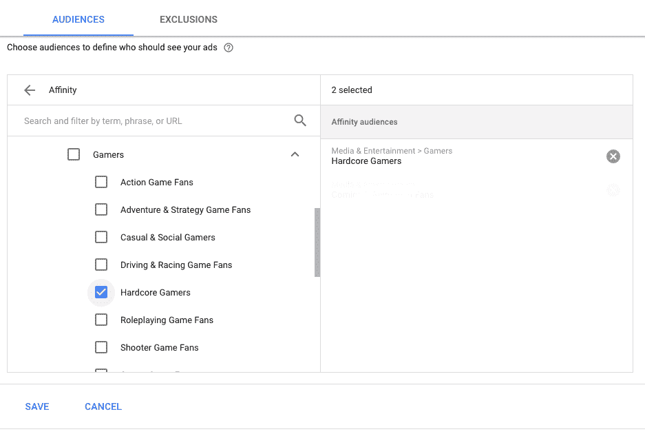
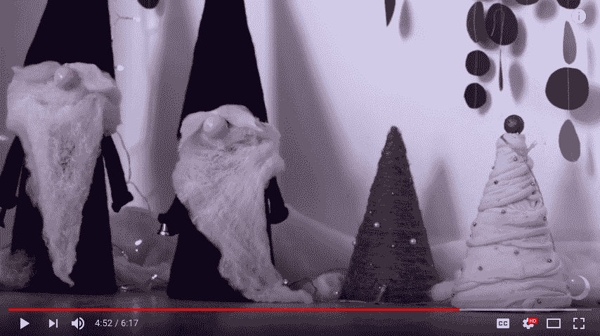

# 我在 YouTube 上为 Candy Japan 烧了 13，867 美元的广告

> 原文：<https://www.candyjapan.com/behind-the-scenes/what-i-learned-advertising-on-youtube?utm_source=wanqu.co&utm_campaign=Wanqu+Daily&utm_medium=website>

YouTube 允许你在视频播放前付费播放广告。

[Candy Japan](/) 是一项针对对日本有些兴趣的人的服务，针对同样的观众有源源不断的视频。虽然成功的机会似乎很低，因为那里的广告成本很高，但触及主要新客户来源的承诺值得一试。

以下是我从制作视频到调整广告活动以及最终查看结果的过程中学到的东西。

## 为 YouTube 制作广告

有了 AdWords，你只需要三行文字，但要在 YouTube 上做广告，你需要一段视频来展示。

视频的主要类型是截屏、真人表演或动画。如果你试图销售一个应用程序或游戏，截屏可能会很好，但对我的糖果订阅服务并不适用。

我考虑过一个展示糖果盒被递送的现场视频，或者一个动画解说视频。因为看我广告的人很有可能也喜欢动漫，所以我想类似风格的广告可能是一个很好的匹配。

### 制作动画广告的流程和成本

我发现一些例子表明制作一部动画的成本大约是每秒 100-150 美元。鉴于一个典型的 YouTube 广告是 30 秒，你可以看到这很快变得昂贵。

我发现了两个选择:要么雇佣一个动画工作室，要么和一个自由职业者合作。因为我已经和一位艺术家一起为这个网站创作了漫画插图，所以我问他是否也能创作一部动画。

我和我妻子用简笔画出了一个快速的故事板。我把它们编辑成一个幻灯片，写下了画外音对话，并在翻转幻灯片创建计时时咕哝了出来。

基于我们的简笔画幻灯片，艺术家绘制了关键帧。这推动了事情的发展，因为我们现在可以讨论我们想要的特定变化。

根据我的喃喃自语，我订购了一个画外音，由一名专业女演员正确地朗读台词。画外音的成本大约是 100 美元，现在看来相对便宜，因为我已经为这部动画支付了大约 3000 美元。

有了粗略的草图和同步的声音轨道，就可以开始将它们转化为最终的动画资产了。

[T2】](https://www.youtube.com/watch?v=-0aY1GxvRMk)

从找到能够做到这一点的人到真正拥有一个可上传的视频，整个过程花了 4 个月。我想去工作室可能是一个更好的选择，因为成本差不多，但周转时间可能会快得多。

这里是[最终结果](https://www.youtube.com/watch?v=-0aY1GxvRMk)。

## 你必须花钱才能花钱

现在，在花了很多钱制作广告之后，你终于可以开始花更多的钱向人们展示广告了。

YouTube 本身用于上传视频。如果你想的话，你可以让它不上市。然后，为了让广告出现在视频之前(*“流内广告”*)，你使用 AdWords 创建一个活动。YouTube 视频 ID 用于将 AdWords 广告与视频链接起来。

### YouTube 广告如何定价

就像 AdWords 一样，广告浏览量的成本是基于广告商之间的拍卖。然而，拍卖不是基于点击量，而是基于浏览量。参加这次拍卖的最低出价是每次观看 0.01 美元，这听起来可能很低，但不是真的。

互联网广告通常以 1000 次浏览为单位定价，称为 CPM 率。低端起价远低于 1 美元，例如在 Explain XKCD 上做广告每 1000 次点击大约花费 0.2 美元。中档是个位数，比如说[，在 Mac Cult](https://www.buysellads.com/buy/detail/19392)上显示一个广告要 3 美元。上限是低两位数，例如 bitcoin.com 的横幅广告每 1000 次点击要花费 30 美元[。](https://www.buysellads.com/buy/detail/282603)

将 YouTube 广告的“每次观看”思维转化为 CPM:每次观看 0.01 美元将会产生 10 美元的 CPM。而这仅仅是有可能支付的**最低出价**。出价这么低可能不会给你带来很多浏览量，我发现自己出价高得多(相当于[实际电视广告价格](https://fitsmallbusiness.com/tv-advertising/))才能获得足够的浏览量来判断我的活动是否有效。

好消息是:如果有人快速跳过你的视频，你不用付钱！因此，如果你想出了一个对你的目标受众之外的人完全不感兴趣的广告，以至于他们立即跳过它，你不必为这些观点付费。

我发现 30%的人会真的看我们的广告(70%跳过)。当你考虑到只有 30%的人会观看广告时，与横幅广告更准确的比较是最低每分钟 3 美元的插播广告(1000 次展示* 30%观看广告* $0.01)。

现在你可能明白为什么我想让不在我的目标受众中的人跳过了——这样更便宜，因为当人们跳过你的广告时，你不用付钱！

## 目标选项

与电视广告相比，YouTube 确实在向你想要的观众展示广告的所有选项上大放异彩。主要的目标选项是主题、位置和受众。主题和位置控制您的广告针对哪些视频显示，而受众允许您根据谁在观看广告来显示广告。

### 主题

不得不单独选择数以千计的视频来展示你的广告，这将是一个巨大的痛苦。这就是主题的由来，因为它们是与某个主题相关的预制视频组。

例如，如果你试图推销一个策略游戏，你很幸运，因为有一个专门的主题。

### 安置

有了广告位，你可以在某个视频之前，或者在你选择的 YouTube 频道的所有视频之前显示你的广告。

例如，如果你正在销售一款制作宾果卡的应用程序，你可以找到所有“如何制作宾果卡”类型的视频，并在这些视频之前展示你的广告。

遗憾的是，在实践中，我发现很难通过这种方式获得视图，至少对于我愿意测试的任何价格来说是如此。即使列出了数千个视频，我也无法为我的广告获得任何有意义的浏览量。这可能是因为我尝试的很多视频要么不受欢迎，要么无法货币化，要么我的出价太低。

### 观众

与观众匹配谷歌试图找出什么类型的人正在观看视频，如果这符合你的选择，那么你的广告可以显示。

这里有很多选择。你可以针对投资者，烹饪爱好者，DIY 爱好者，宠物爱好者，游戏玩家等等。

观众匹配最终给了我足够的点击量来发现是否有人曾经通过 YouTube 广告购买任何东西。

### 关键词

一开始我说有主题、位置和受众，但实际上还有另一种定位方法。我仍然不知道它应该如何工作:关键字。

我假设触发关键字匹配，视频标题或描述将不得不匹配它。事实证明情况并非如此。

例如，当我尝试关键词“动画”时，我的广告出现在这些视频之前:[一些立陶宛歌曲](https://www.youtube.com/watch?v=3jf66b9VQ8c)、[一个如何制作侏儒的教程](https://www.youtube.com/watch?v=qBqEFwhdoo8)和[一些德国说唱视频](https://www.youtube.com/watch?v=86f3332Kp2w)。不完全是动漫。

*“当人们在 YouTube、网站或应用上查看相关内容时，关键词可以触发您的广告显示”。*

显然，这个“相关内容”的定义比我想象的要宽泛。

## 我知道你去年夏天看了什么视频

哦，对了，我想提一下 YouTube 提供的一个很酷的追踪工具。正如你可能会想到的，你可以很容易地跟踪广告点击导致销售的时间。但最酷的是，你还可以跟踪别人何时查看你的广告，然后稍后输入你的网址，无需点击链接就可以购买。

换句话说，你可以跟踪那些直接点击广告的人，或者那些看到你的广告然后稍后访问你的网站的人(这被称为“*浏览转换*”)。这是魔法。神奇的是，你不得不相信谷歌的话，这些客户确实看过广告，因为你自己无法察觉。

除了完全相信给我的报告之外，我还在我的订单中添加了一个字段，在那里我问人们“你是从哪里听说 Candy Japan 的？”。这证实了 YouTube 确实在吸引这些新客户。

## 调整活动:排除！

AdWords 为你提供了许多有趣的数据，告诉你哪些目标选项转换了，哪些没有转换。仔细查看 AdWords 给我的数据，我确实找到了一些降低销售成本的简单方法。

这里的关键意识是，广告是向人们展示你的广告，也是不向那些不太可能购买的人展示。一个简单的开始是停止所有似乎不起作用的话题或听众。

如果这仍然不能让你的活动盈利，你可以根据年龄、性别、设备、位置、父母身份和家庭收入，进行更广泛的排除和出价调整。例如，你可能会发现某些地区或年龄段的人比其他人更不容易购买。

通过这些调整，我能够显著降低营销活动的每次转化成本。

## 总之，你达到收支平衡了吗？

没有。我丢了钱。

许多观众确实在看到广告后下了订单，但不足以证明继续开展活动的合理性。即使考虑到客户的终身价值，也是如此。虽然我无法让竞选收支平衡，但通过调整目标选项，我已经非常接近了。

现在，我已经停止了这项活动，在可能再次尝试之前，我会反思一下到底是哪里出了问题。

作为对其他想尝试在 YouTube 上做广告的人的建议，我会说你的产品或服务应该至少有几十美元的利润，才有机会让这些数字发挥作用。为一个只有几美元固定成本的应用做广告，即使在最低的出价水平下也不太可能奏效。

如果你确实有一个合适的产品，准备好花上几千美元，同时调整你的活动走向盈利。

感谢阅读。如果你想自己尝试一些糖果，你可以在这里注册。