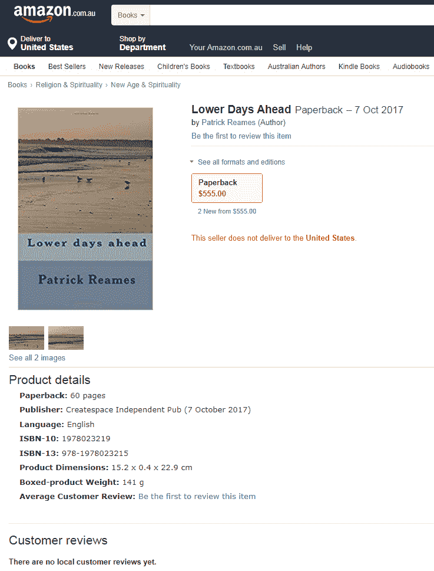
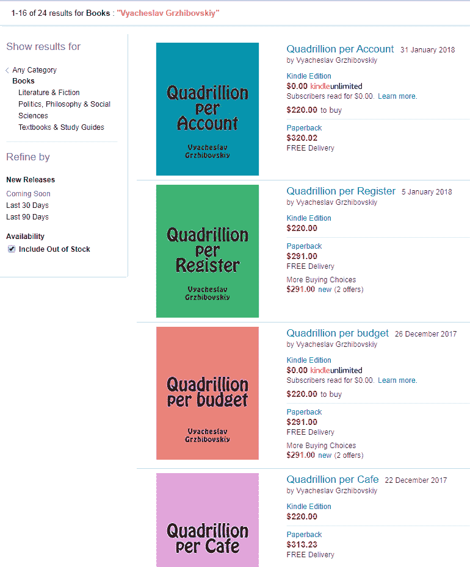
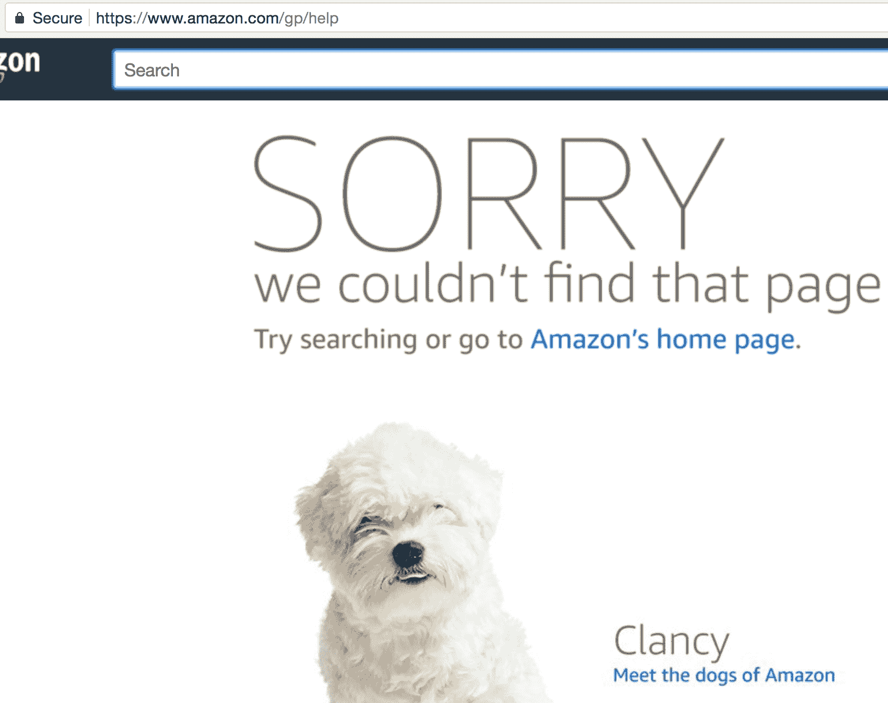

# 在亚马逊上通过假冒作者洗钱？-安全上的克雷布斯

> 原文：<https://krebsonsecurity.com/2018/02/money-laundering-via-author-impersonation-on-amazon/?utm_source=wanqu.co&utm_campaign=Wanqu+Daily&utm_medium=website>

Patrick Reames 不知道为什么 Amazon.com 的**给他发了一份 [1099 表格](https://en.wikipedia.org/wiki/Form_1099)说他通过公司的按需出版部门 **Createspace** 卖书赚了将近 24000 美元。直到他在网站上搜索自己的名字，发现有人一直在用它兜售一本 555 美元的书，里面全是胡言乱语。**

这本假冒的 555 美元的书在亚马逊上用 Patrick Reames 的名字和社会保险号卖了 60 多次。

里姆斯是亚马逊上几本商品行业书籍的知名作者，尽管它们的收入都远不及亚马逊向美国国税局报告的数额。他也没有 Createspace 的个人账户。

但这并没有阻止有人用他的名字出版“小说”。这个词被引用是因为该出版物看起来只不过是计算机生成的文本，就像垃圾邮件中的胡言乱语一样。

“根据我从‘潜行峰值’功能中看到的，这本书只不过是一个计算机生成的‘故事’，没有结构，没有章节或段落——只有在每句话后有回车的文本行，”Reames 在接受 KrebsOnSecurity 采访时说。

模仿者将这本书定价为 555 美元，并发布到不同国家的多个亚马逊网站上。这本书-几天前已经从大多数亚马逊国家页面上删除-名为“未来更低的日子”，于 2017 年 10 月 7 日出版。

里姆斯说，他怀疑有人使用偷来的信用卡和/或借记卡购买这本书，并将亚马逊给作者的 60%收入囊中。以每瓶 555 美元的价格，只需要三个月内卖出大约 70 件商品，就能获得亚马逊所说的收入。

“这本书本身不太可能卖出去，更不用说在 12 周内卖出足够多的书来获得那样的收入，”里姆斯说。“因此，我认为它被用于洗钱，以及通过使用我的社会安全号码进行税务欺诈/逃税。亚马逊拒绝发布更正后的 1099，也拒绝向我提供任何我可以用来确定他们在哪里或如何汇出版税的信息。”

里姆斯说，他以自己的名义在亚马逊上出售的书籍是通过他的出版商完成的，而不是直接通过个人账户(这些书籍的版税归他的前雇主所有)，所以他从未向亚马逊提供过他的社会安全号码。但骗子显然做到了，这显然足以让亚马逊相信冒名顶替者就是他。

里姆斯说，在得知这一模仿行为后，他变得足够好奇，开始在亚马逊的 Createspace 平台上寻找其他作者古怪行为的例子。

“我已经查看了许多 Createspace 的书籍，我很清楚，在他们的网站上可能有数百甚至数千本类似的欺诈书籍，”里姆斯说。"这些书没有真正的内容，只有几十页胡言乱语或计算机生成的文本。"

例如，在亚马逊搜索名字 **Vyacheslav Grzhibovskiy** 会出现几十本 Kindle“书”,这些书看起来都是类似的胡言乱语——其中大多数的书名中都有“quadrillion”、“万亿”或类似的词。有些零售价仅为一两美元，而另一些价格莫名其妙地在 220 美元至 320 美元之间。

亚马逊上出售的一些“书”被认为是 Vyacheslav Grzhibovskiy 的作品。

“不难想象这些书如何被用来洗钱，使用偷来的信用卡，或促进非法材料的交易或资助非法活动，”里姆斯说。“我不相信亚马逊不知道这一点，也不愿意出面阻止。我还认为，他们没有正确审查新账户，以限制通过窃取身份进行的税务欺诈。”

里姆斯说，亚马逊拒绝向他发送更正后的 1099，或讨论任何关于身份窃贼的事情。

“他们说，目前他们所能做的就是给我发一封信，承认我没有收到资金，因为他们说他们无法证明我没有收到资金。所以我告诉他们，'如果你说你不能说我是否收到了资金，告诉我他们去了哪里？'他们说，“哦，不，我们不能这么做。”所以我不能证明自己清白，他们也不会证明我清白。"

亚马逊在一份声明中表示，客户账户的安全是其最高优先事项之一。

“我们有适当的政策和安全措施来帮助保护他们。每当我们意识到你所描述的行为，我们就会采取措施去阻止它们。如果您担心您的帐户，请立即使用我们网站上的帮助部分联系亚马逊客户服务。”

但是，如果你打算通过电话联系亚马逊客户支持，请注意。对亚马逊客户支持电话号码进行简单的在线搜索，可能会出现一些可疑和明显的欺诈性结果。

本月早些时候，KrebsOnSecurity 从一家中型银行的欺诈调查员那里听说，最近有几个客户在搜索亚马逊的客户支持热线后被骗了。她说，在试用期结束后，这些客户中的大多数都试图取消亚马逊 Prime 会员资格，并向他们收取 99 美元的费用。

欺诈调查员表示，她的客户最终拨打了虚假的亚马逊支持号码，接听电话的人带有外国口音，并要求提供各种个人数据，包括银行账户和信用卡信息。很快，这些客户的账户被用来建立新的亚马逊账户以及 Coinbase.com 的账户，这是一种帮助购买比特币等虚拟货币的服务。

这个网站很好地记录了几十个虚假的亚马逊客户支持号码，这些号码欺骗了不知情的顾客。令人惊讶的是，除了像 Facebook.com 这样的第三方网站，这些数字中的许多似乎都在亚马逊自己的在线客户支持论坛上得到大力推广。

有趣的是，点击[亚马逊支持选项和联系我们页面](https://www.amazon.com/gp/help/customer/display.html/?nodeId=201331410&sr=1-1&ref=sxts_snpl_6_6_3256888202&qid=1519126304&pf_rd_m=ATVPDKIKX0DER&pf_rd_p=3256888202&pf_rd_r=KET8NPQ15GC9SQDMY6A7&pd_rd_wg=QSQSu&pf_rd_s=desktop-signpost&pf_rd_t=301&pd_rd_w=ITxid&pf_rd_i=help&pd_rd_r=4c16d88e-f1d0-4c7d-8daf-e8a2a68c6fbb)的[客户帮助论坛链接](https://www.amazon.com/gp/help)链接，当前会将访问者带到下图的页面，显示“对不起，我们找不到该页面”的错误。或许该公司只是在上周收到 KrebsOnSecurity 关于论坛上推广虚假电话号码的通知后进行清理。

无论如何，这些虚假的亚马逊支持号码似乎是由亚马逊上出售的一些看起来可疑的电子书兜售的，这些电子书都是关于——你猜对了——如何联系亚马逊客户支持。

如果您希望通过电话联系亚马逊，您只能使用以下号码:

美加:[1-866-216-1072](tel:(866)%20216-1072)

 <u><u>国际: [1-206-266-2992](tel:(206)%20266-2992)

亚马逊的主要客户帮助页面是[这里是](https://www.amazon.com/gp/help/customer/display.html/ref=footer_gw_m_b_he?ie=UTF8&nodeId=508510)。

**更新，美国东部时间上午 11:44:**不确定事情发生的确切时间，但是[这个通知](https://www.amazon.com/gp/help/customer/display.html?nodeId=14279661)说亚马逊已经关闭了它的讨论板。

**更新，美国东部时间下午 4:02:**亚马逊刚刚分享了以下声明，以及他们早些时候发布的敦促人们访问不存在的帮助页面的声明(见上文):

“任何认为他们收到了不正确的 1099 表格或错误的 1099 表格的人可以联系我们[1099@amazon.com](mailto:1099@amazon.com)，我们将进行调查。”

"这是通用亚马逊帮助页面:"

[https://www.amazon.com/gp/help/customer/display.html?ie=UTF8 & nodeId=508510](https://www.amazon.com/gp/help/customer/display.html?ie=UTF8&nodeId=508510)

**美国东部时间下午 4:01 更新:**读者 zboot 有一些[的好东西](https://krebsonsecurity.com/2018/02/money-laundering-via-author-impersonation-on-amazon/#comment-462109)。与比特币套现相比，亚马逊是网络赌场的绝佳套现方式，因为资金可以直接存入银行账户。他写道:

“并不是暗网太慢，而是你最终还是需要套现。亚马逊让你把偷来的资金直接转到银行账户。如果你是用偷来的凭证设置的，这个过程可能会比从比特币交易所取钱更快，比特币交易所往往会将菲亚特提款限制在用他们设法窃取的信息量创建的账户上。”</u></u>