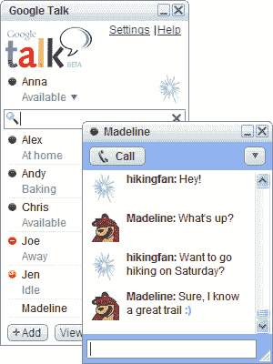

# Google Talk 是如何从梦想变成噩梦的？-张桓的冥想盆

> 原文：<https://www.tnhh.net/posts/google-talk.html?utm_source=wanqu.co&utm_campaign=Wanqu+Daily&utm_medium=website>

几年前，我几乎和所有交谈过的人都使用 Google Talk。如今，我几乎不在常去的地方和任何人交谈。Google Talk 已经从“好到我可以推荐给所有人”变成了一个叫做 Hangouts 的噩梦。那么我们是如何走到这一步的呢？

继 Gmail 之后，谷歌推出了 Google Talk，这是一款基于流行的免费邮件服务的黑客软件。要与某人“交谈”,您已经有了他们的 Gmail(或 jabber)地址，因此您认为您可以向该地址发送好友请求，认为他们可能正好使用 Google Talk。事实上，他们会批准你的请求:他们会出现在你的好友列表中。现在你肯定知道他们何时“在线”(2000 年代的词汇，我知道)，并且你知道当你给他们发送消息时，他们会看到你的消息。如果他们离线，它会在他们在线时发送消息。他们可以随时告诉你他们很忙，所以客户会如实告诉你，并鼓励你不要打扰。他们有一个网页版或者轻量级的 Windows 客户端，这可能是有史以来最干净的 Windows 聊天客户端。如果你用 Linux/Mac，好吧，就用 GAIM/紫色/iChat/随便什么。如果你使用 Android，你有 Google Talk，它也是一个很好的、轻量级的、无干扰的客户端。如果您希望在任何其他平台上使用任何其他客户端，它仍然可以工作。不管你使用什么样的客户端，都是一样的。无论您使用什么客户端或登录了多少台电脑，您都会收到这些消息。您确切地知道谁在您的好友列表中，谁将看到您的消息，谁将能够给您发送消息。如果某人有昵称，而你不喜欢，你可以给这个人重新命名，这样你就能认出他们。或者，如果对方用的是真名，而你只知道他们的昵称，你也可以给他们重新命名。如果有人烦你，你可以撤销授权，他们就不会再烦你了。如果你们都使用谷歌的客户端，你们可以发送/接收文件，进行语音和视频聊天，这很好。但是对于一般的消息传递，Google Talk 几乎可以处理任何事情。如果客户端不支持增强功能，语音/视频通话按钮将不会亮起。但是当它工作的时候，我已经在一个不稳定的连接上讲了 5 个小时了。它几乎不消耗任何带宽。生活很美好。你什么都没做。

一个无聊的应用程序的例子，一个无聊的人的生活(你？).

然后，谷歌决定他们需要将谷歌聊天更名为 Hangouts。然后他们告诉你，你需要一个 Google+账户，他们会轻推并诱骗你创建一个。一年后，你终于迷上了 Google+迷因，并暗暗希望你的朋友也是如此。所以你必须在浏览器的一个单独的标签上使用 Google Hangouts，否则它会和你的 Gmail 并列在一起。无论哪种方式，它都会降低您最新的英特尔 i5 笔记本电脑的速度，并让您的风扇疯狂旋转，只为进行一次对话。它不提供原生桌面应用，桌面版不再工作，手机版像狗屎一样工作。你不能使用 Jabber 客户端，或者你可以，但是没有官方文档。至少他们不希望你再用任何客户了。

无论如何，聚会最大的特点就是和你以前没说过话的人开始对话。有时搜索他们的电子邮件地址会有用，但一般来说，你必须已经和他们通过电话或 Skype 或其他方式交谈过了。然后你点击 Hangouts 窗口上的“新对话”,然后他们会告诉你如何“搜索”他们的名字。其中 50 个名字可能会出现在搜索结果中，然后他们必须通过电话向你描述他们的个人资料照片，以便你选择正确的照片。如果他们有一个带有奇怪字符的外国名字，那你就完了，因为你不知道怎么打。如果他们有一个共同的名字，你就完了，因为你会有 5000 个名字出现。或者出于某种原因，他们的名字没有出现在搜索结果中，你也完蛋了。如果这些情况发生了，你就求助于让他们主动和你对话。无论如何，假设你已经设法克服了这一点，现在有了一个与他们的信息窗口，你必须输入类似“嗨”的东西你希望他们会看到，并问他们是否看到了。如果他们没有看到，那么你说这狗屎没有工作，你们两个认为这是一个黑暗的，悲伤的事件在你们的关系。

如果你幸运的话，所有这些都有效，他们将不得不点击“接受”,现在你们可以互相发送短信了(万岁！).有了 Hangouts，默认情况下你不能离开记录，没有不记录你的消息的选项(除非你使用 Gsuite 并且你像我一样是管理员)。如果你离开了记录，它会告诉你，它可能不会传递你的离线信息——不要相信 Hangouts 能正确传递信息。如果你想通话，在网络上没有按钮只进行语音通话，但在手机版本上有一个按钮。打电话时，你不知道那个按钮会打给他们的电话还是会打给他们的 Hangouts 客户，所以你不敢轻点它。无论如何，你放弃了只进行语音通话的想法，决定只进行视频通话。其中 50%的尝试会失败，50%会成功。不管它在你的电脑上工作的可能性有多大，它在另一边工作的可能性有 50%。如果你用火狐，有 100%的可能是不行的。幸运的是，如果你和你的朋友在 10 分钟后安装了所有正确的软件，当你打电话时，还有 50%的机会它会真正通知你的朋友。或者它可能出于某种原因决定不打扰他们，然后你必须打电话给他们，让他们知道你在打电话给他们。

在新的常去的地方，你也不能告诉别人你现在不想被打扰。不再有在线/离线/忙碌的状态，假设每个人都一直在线，每个人都一直空闲。你在下午 1 点收到信息，有时在凌晨 4 点。你从来没有回复足够多的信息，所以你只是厌倦了这些信息，然后忘记了它们，尽管有时候你真的很忙，忘记回复那些重要的信息。

*Pic:完全讨人喜欢的人的生活。他们是 10 个不同团体的成员。丰富多彩的移动狗屎，小发明，图片，表情符号，jiffs，在全屏窗口打字指标(你？).*

你不再有好友列表，取而代之的是某种列表——一些你不懂的狗屎。你不能控制在上面显示什么。如果任何人惹恼了你，你不能删除或取消他们与你联系的权限(尽管你可以永远阻止他们)。有时候一个人在你的列表里出现两次:有时候是因为他们实际上有两个不同的邮箱地址(其中一个他们已经不用了，但是你分不清哪个是不活跃的，反正你也不能删除)，有时候是因为他们有 Google+，有时候你他妈的根本不知道为什么。好吧，可能好友列表太硬，你放弃了，你点开最近的对话列表，里面混着语音通话和消息。但是你最近的谈话不在那里，因为你没有记录。你不知道如何和某人进行可靠的对话。在新的社交网站上，你真的不知道它会在何时、何地、向谁传递你的信息。如果是的话，你不知道是怎么回事。

最近，你遇到了几个迷失的 Linux 伙伴，他们向你抱怨你没有回复他们的信息。你说你从来没有收到消息，耸耸肩。你永远不知道为什么一条消息没有通过，也许是因为他们使用了不被官方支持的客户端？但是你的伙伴们默默地认为你是个撒谎的混蛋。他们不知道的是，你只是想成为一个谷歌粉丝。

* * *

* * *