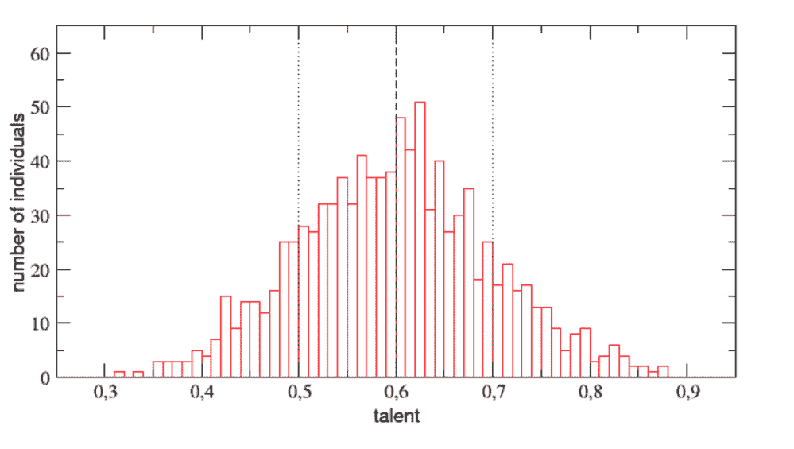
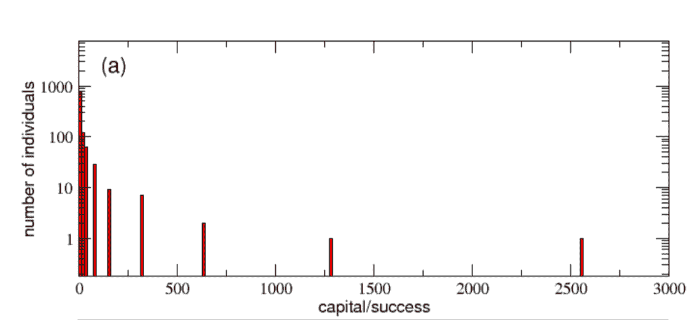
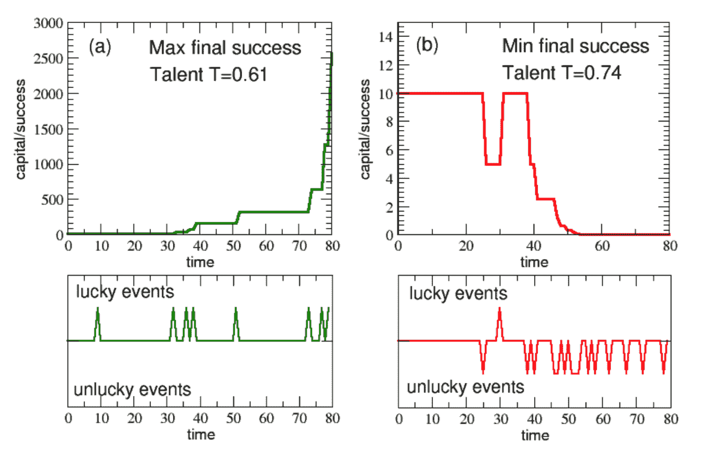
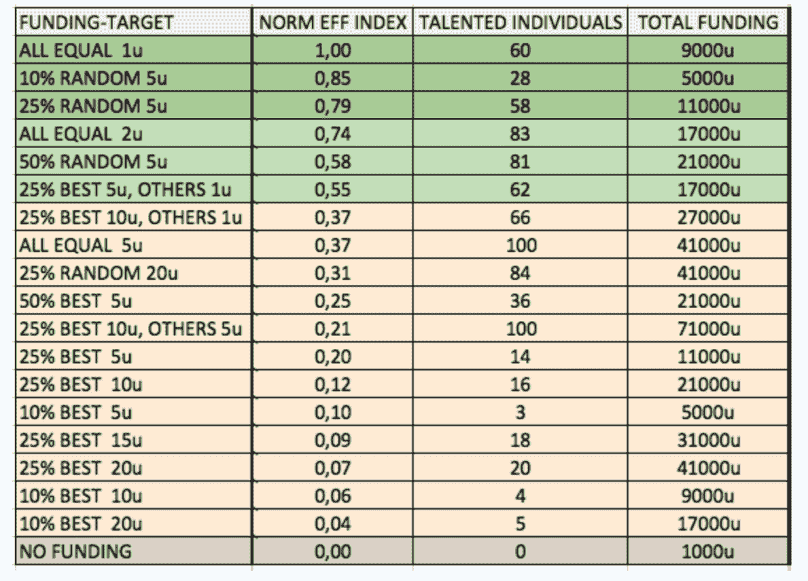
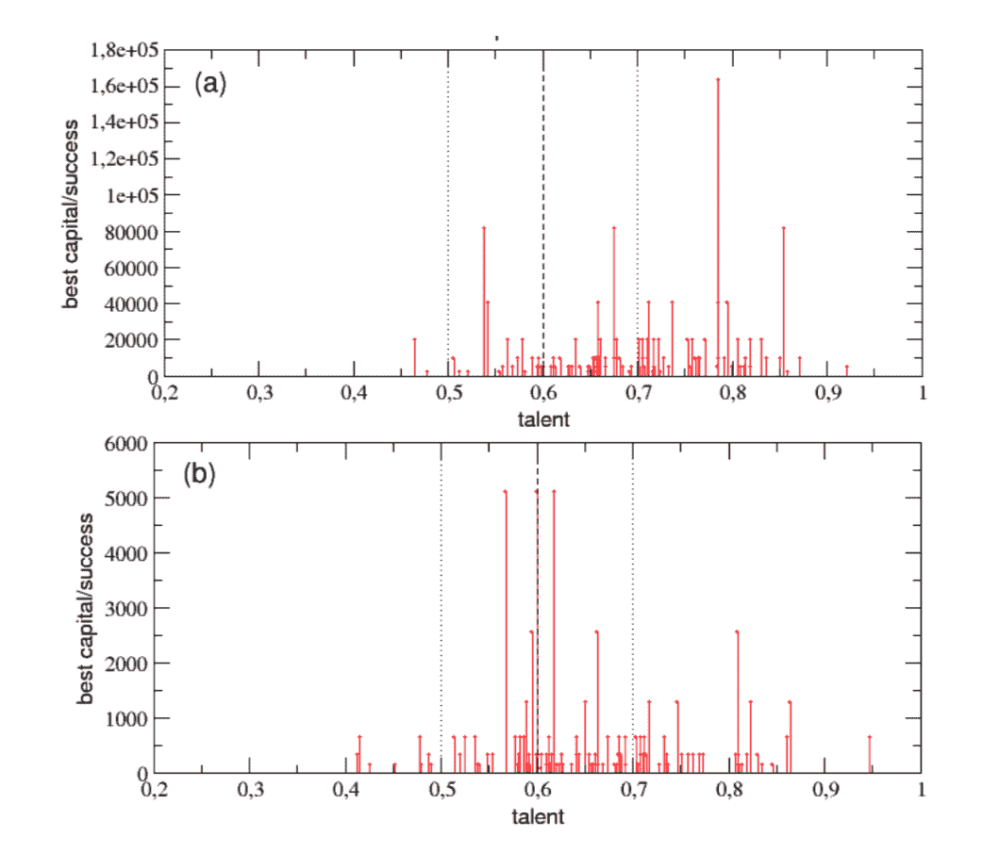

# 运气在人生成功中的作用比我们意识到的要大得多-科学美国人博客网

> 原文：<https://blogs.scientificamerican.com/beautiful-minds/the-role-of-luck-in-life-success-is-far-greater-than-we-realized/?utm_source=wanqu.co&utm_campaign=Wanqu+Daily&utm_medium=website>

成功需要什么？最成功的人有什么秘诀？从*成功*、*福布斯*、*公司*、*企业家*等杂志的受欢迎程度来看，人们对这些问题并不缺乏兴趣。然而，有一个深层的潜在假设，即我们可以向他们学习，因为是他们的个人特征——如天赋、技能、心理韧性、勤奋、坚韧、乐观、成长心态和情商——让他们取得了今天的成就。这种假设不仅是成功杂志的基础，也是我们如何在社会中分配资源的基础，从工作机会到名声到政府拨款再到公共政策决策。我们倾向于把资源给那些有成功历史的人，而忽视那些不成功的人，认为最成功的人也是最有能力的人。

但是这个假设正确吗？我整个职业生涯都在研究预测成就和创造力的心理特征。虽然我发现[一定数量的特质](https://www.amazon.com/Wired-Create-Unraveling-Mysteries-Creative/dp/0399175660)——包括激情、毅力、想象力、求知欲和对经验的开放性——确实能显著解释成功的差异，但我经常好奇到底有多少差异是*无法解释的*。

近年来，许多研究和书籍——包括风险分析师纳西姆·塔勒布、投资策略师 T2、经济学家 T4·罗伯特·弗兰克和 T5 的研究和书籍——都表明，运气和机遇在许多领域，包括金融交易、商业、体育、艺术、音乐、文学和科学，可能发挥着远比我们意识到的更大的作用。他们的论点不是运气就是一切。天赋当然很重要。相反，数据表明，如果我们在试图理解成功的决定因素时只关注个人特征，我们就会错过成功图景中真正重要的一块。

想想最近的一些发现:

运气隐藏层面的重要性提出了一个有趣的问题:在我们的社会中，最成功的人是否大多只是最幸运的人？如果这是真的，那么这将对我们如何分配有限的资源，以及富人和成功人士真正造福社会的潜力(相对于通过变得更加富有和成功来造福自己)产生重大影响。

为了阐明这个沉重的问题，意大利物理学家[亚历山德罗](http://www2.dfa.unict.it/home/pluchino/) [普鲁奇诺](http://www2.dfa.unict.it/home/pluchino/)和[安德里亚·拉斯皮萨达](http://www2.dfa.unict.it/home/rapisarda/)与意大利经济学家[阿莱西奥](https://www.researchgate.net/profile/Alessio_Emanuele_Biondo) [比昂多](https://www.researchgate.net/profile/Alessio_Emanuele_Biondo)合作，首次尝试[量化运气和天赋在成功职业生涯中的作用](http://arxiv.org/abs/1802.07068)。在他们之前的工作中，他们对“幼稚的精英管理”提出了警告，在这种管理中，人们实际上没有给予最有能力的人荣誉和奖励，因为他们低估了随机性在成功决定因素中的作用。为了正式捕捉这一现象，他们提出了一个“[玩具数学模型](https://en.wikipedia.org/wiki/Toy_model)”，模拟了一个集体群体在 40 年的工作生涯中(从 20 岁到 60 岁)的职业发展。

意大利研究人员将大量具有不同程度“天赋”的假设个体(“代理人”)放入一个方形世界，让他们的生活在其整个职业生涯中展开。他们将天赋定义为允许一个人利用幸运机会的任何一组个人特征(我已经在其他地方论证过这是对天赋的合理定义)。天赋可以包括智力、技能、动机、决心、创造性思维、情商等特征。关键是更有才华的人更有可能从给定的机会中获得最大的“回报”(见[这里](http://journals.sagepub.com/doi/abs/10.1111/1467-8721.00110)支持这一假设)。

所有代理都以相同的成功水平(10 个“单元”)开始模拟。每 6 个月，个体会接触到一定数量的幸运事件(绿色)和一定数量的不幸事件(红色)。每当一个人遇到不幸的事件，他们的成功就会减少一半，每当一个人遇到幸运的事件，他们的成功就会与他们的天赋成比例地增加一倍(以反映天赋和机会之间的现实世界互动)。

他们发现了什么？首先，他们复制了著名的“[帕累托原则](https://en.wikipedia.org/wiki/Pareto_principle)”，该原则预测，少数人最终将获得大多数人的成功(理查德·科赫称之为“ [80/20 原则](https://www.amazon.com/80-20-Principle-Secret-Achieving/dp/0385491743)”)。在 40 年模拟的最终结果中，虽然人才是正常分布的，但成功却不是*。*20 个最成功的人拥有 44%的成功总量，而*几乎一半的人保持在 10 个成功单位以下*(这是最初的开始条件)。这与现实世界的数据一致，尽管有一些迹象表明，在现实世界中，财富的分配甚至更加不均衡，只有八个人拥有与世界上最贫穷的一半人相同的财富。

*Normal Distribution of Talent. Credit: [Pluchino, Biondo, & Rapisarda 2018](https://arxiv.org/abs/1802.07068)*

*Highly Skewed Distribution of Success**. Credit: [Pluchino, Biondo, & Rapisarda 2018](https://arxiv.org/abs/1802.07068)*

尽管这种不平等的分配可能看起来不公平，但如果事实证明最成功的人确实是最有才华/能力的人，这可能是合理的。那么模拟发现了什么？一方面，天赋并非与成功无关。一般来说，那些更有天赋的人更有可能通过利用运气提供的可能性来增加他们的成功。此外，最成功的代理商大多至少在人才平均水平。所以天赋很重要。

然而，天赋肯定是不够的，因为最有天赋的人很少是最成功的。一般来说，平庸但幸运的人比更有才华但不幸的人更成功。最成功的经纪人往往是那些天赋略高于平均水平，但生活中运气很好的人。

在一次模拟中，考虑最成功的人和最不成功的人的成功演变:

*Evolution **of Success for the Most Successful and Least Successful Individuals**. Credit: [Pluchino, Biondo, & Rapisarda 2018](https://arxiv.org/abs/1802.07068)*

正如你所看到的，穿绿色衣服的非常成功的人在他们的生活中有一系列非常幸运的事件，而穿红色衣服的最不成功的人(他们甚至比其他人更有才华)在他们的生活中有难以忍受的不幸事件。正如作者指出的，“即使是伟大的天才在面对不幸的愤怒时也会变得毫无用处。”

人才流失显然是不幸的，对个人和社会都是如此。那么，如何才能让那些最有能力抓住机遇的人获得他们最需要的发展机会呢？让我们转向下一个。

**刺激的意外收获**

许多用于分配荣誉、资金或奖励的精英策略通常基于个人过去的成功。以这种方式选择个人造成了一种富人越来越富，穷人越来越穷的事态(通常被称为“[马太效应](https://www.psychologytoday.com/blog/beautiful-minds/200807/the-nature-genius-iii-the-rich-get-richer-and-the-poor-get-poorer)”)。但这是最大化潜能的最有效策略吗？哪种资助策略更有效，能最大化对世界的影响:给少数以前成功的申请人大量资助，还是给许多普通成功的人少量资助？这是一个关于资源分配的基本问题，需要通过实际数据来了解。

让-米歇尔·福廷和大卫·柯里进行了一项研究，他们观察了更大的资助是否会带来更大的发现。他们发现，资助和影响之间存在积极但非常小的关系(通过与科学出版物相关的四个指数来衡量)。此外，获得第二笔赠款的人并不比只获得第一笔赠款的人更有成效，而且影响通常是资金的减速函数。

作者认为，更注重多样性而非“卓越”的资助策略可能对社会更有成效。在最近的一项研究中，研究人员查看了 15 年间提供给魁北克 12720 名研究人员的资金。他们的结论是，“无论是从论文数量还是从科学影响来看，研究资金集中在所谓的‘精英’研究人员手中通常会产生边际收益递减。”

欧洲研究委员会认真对待这些发现，最近给生物化学家 Ohid Yaqub[170 万美元](https://www.nature.com/articles/d41586-018-01405-7)以正确确定科学中的意外收获程度。雅库布提出了意外收获的多维定义，确定了科学中意外收获发生的一些机制，包括敏锐的观察，“受控的草率”(允许意外事件发生，同时追踪其来源)，以及科学家网络的合作行动。这与迪安·西蒙顿关于[在创造性的和有影响力的科学发现的进化中偶然发现和机会的角色](https://www.amazon.com/Creativity-Science-Chance-Genius-Zeitgeist/dp/052154369X)的大量工作是一致的。

在这项工作的基础上，模拟运气在成功中的作用的意大利团队在他们的模拟中更进了一步。扮演上帝的角色(可以这么说)，他们探索了许多不同的融资策略的有效性。在模拟的 40 年工作生涯中，他们每五年应用不同的策略。在没有任何资金支持的情况下，我们已经看到，最成功的代理人都是非常幸运的人，他们的天赋水平一般。一旦他们在模拟中引入各种融资机会，会发生什么？

*Efficiency of Different Funding Strategies**. Credit: [Pluchino, Biondo, & Rapisarda 2018](https://arxiv.org/abs/1802.07068)*

此表按效率降序列出了 40 年来最有效的融资策略(即，需要最少的资金获得最大的投资回报)。从列表的底部开始，你可以看到最无效的资助策略是那些只给已经最成功的个人一定比例的资助的策略。将给予最成功的人一定比例和平均分配其余部分结合起来的“混合”策略更有效一些，随机分配资金甚至更有效率。这最后一个发现很有趣，因为它与其他研究相一致，其他研究表明，在复杂的社会和经济环境中，机会可能会发挥作用，包含随机性的策略比基于“天真的精英”方法的策略表现得更好。

也就是说，在所有的融资策略中，最好的融资策略是将同等数量的资金分配给每个人。以每五年 1 个单位的比率分配资金会使 60%最有才华的人获得高于平均水平的成功，以每五年 5 个单位的比率分配资金会使 100%最有才华的人产生影响！这表明，如果一个资助机构或政府有更多的钱可供分配，他们会明智地将这些额外的钱分配给每个人，而不是只分配给少数人。正如研究人员得出的结论，

> “如果目标是奖励最有才华的人(从而提高他们最终的成功水平)，那么定期向所有个人分配等量的资本(即使是少量的)要比只向一小部分人分配更多的资本方便得多，这些人是通过他们在分配时已经达到的成功水平来选择的。”

**刺激环境**

这支不可思议的意大利队甚至没有就此止步！嘿，如果你在扮演上帝，为什么不一路走下去。:)他们还进行了模拟实验，在这些实验中，他们改变了代理人的环境。使用这个框架，他们模拟了一个非常刺激的环境，每个人都有很多机会(像美国这样的富裕工业化国家)，也模拟了一个不太刺激的环境，机会很少(像第三世界国家)。以下是他们的发现:

*Success of the Most Successful Individuals Living in an Environment with Rich Opportunities (top) or an Environment with Poor Opportunities (bottom)**. Credit: [Pluchino, Biondo, & Rapisarda 2018](https://arxiv.org/abs/1802.07068)*

看看每个人都有丰富机会的环境的结果分布(上)和每个人都有机会的环境的结果分布(下)之间的差异。在顶部模拟的宇宙中，许多中等到高天赋的个体能够达到非常高的成功水平，并且达到至少高于平均成功水平的中等到高天赋的个体的平均数量相当高。相比之下，在图底部模拟的宇宙中，社会的整体成功水平较低，平均只有 18 个人能够提高他们最初的成功水平。

**结论**

这一阐释性模拟的结果与越来越多基于现实世界数据的研究相吻合，强烈表明运气和机会在决定个人最终成功水平方面发挥着未被充分认识的作用。正如研究人员指出的那样，由于奖励和资源通常都给了那些已经获得高回报的人，这往往导致那些最有才华的人(即最有可能从资源中实际受益的人)缺乏机会，而且它没有考虑到运气的重要作用，运气可以在整个创作过程中自发出现。研究人员认为，以下因素在给予人们更多成功机会方面都很重要:充满机会的激励环境、良好的教育、强化培训以及资金和资源分配的有效策略。他们认为，在宏观层面的分析中，任何能够影响这些因素的政策都会带来更大的集体进步和社会创新(更不用说任何特定个人的巨大自我实现)。

2018 [斯科特·巴里·考夫曼](http://www.scottbarrykaufman.com/ "Scott Barry Kaufman")，版权所有

*注意:我给意大利团队的一个建议是，他们未来的模拟要考虑到现实世界的发现，即* [的天赋是随着时间](https://www.amazon.com/Ungifted-Intelligence-Scott-Barry-Kaufman/dp/0465025544) *发展的，而不是个人的固定数量。他们亲切地说这是一个有效的观点，并肯定会在他们未来的工作中考虑到这一点。*