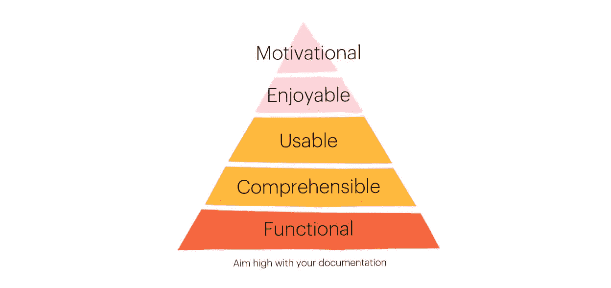

# 当你获得了一个客户，营销就不会停止

> 原文：<https://blog.intercom.com/marketing-doesnt-stop-when-youve-acquired-a-customer/?utm_source=wanqu.co&utm_campaign=Wanqu+Daily&utm_medium=website>

在任何 SaaS 企业的早期，你都会采用许多营销策略来获得你的第一批客户:博客帖子、付费广告、登陆页面、英雄视频、网络研讨会，除了厨房水槽之外的一切。如果你幸运的话，注册会开始涌入。是时候收起你的脚，等待金钱滚滚而来了，对吗？

没那么快。大多数新注册用户会看你的产品一次，出于多种原因，他们再也不会回来了。你刚刚开展了一场大规模的营销活动，花了那么多时间和金钱让他们进门，结果他们发现你的产品毫无价值，然后又离开了。

如果你没有向你的新注册者展示如何成功，当他们离开时不要惊讶。

对于那些决定多呆一会儿的人呢？你和这些人也是借来的时间。就像古老的格言“如果你建立了它，他们会来”对大多数创业公司来说是不正确的(剧透:他们不会)，也不是“如果他们签约，他们会使用它”。你的许多新签约只是在试探，如果你不告诉他们如何成功，当他们简单地走开时，不要感到惊讶。

## 引导“产品教育”

当我第一次加入 Intercom 时，我的角色并没有真正的名字。我戴了许多帽子。我撰写了我们的[文档](https://docs.intercom.com/)，主持了我们的[网络研讨会](https://www.intercom.com/webinars)，制作了我们的[帮助视频](https://demos.intercom.com/)，管理了我们的[向客户发送的信息](https://www.intercom.com/blog/before-you-send-your-first-message/)。目标很简单:为我们的新客户创建和分发内容，帮助他们充分利用我们的产品。随着功能的增长，我雇佣了一个产品团队。他们是作家、视频编辑和教育工作者。我们称之为团队产品教育。简而言之，我们向现有客户推销我们的产品。我们通过产品行为的变化来衡量我们的影响。我们是否*激活了*新注册，*扩展了*它们的用途，*保留了*它们？

你可能不认为这是一个传统的营销活动，但忽视它是危险的。为你的酒店大堂投资一个闪亮的大理石地板是没有意义的，只是让客人发现一个坏了的电梯，没有楼梯去他们的房间。

我想分享一下我在 Intercom 早期使用的一些策略，那时候产品教育“团队”只有我一个人，那时候我们努力争取每一个新的注册，以变得积极和忠诚于我们的产品(注意:那里什么都没有改变，我们仍然每天都在努力)。这些策略都不需要庞大的团队或庞大的预算。他们只需要真诚地对待现有客户，就像你对待潜在客户一样。

## 最低可行文件

在你把核心概念写下来之前，不要制作精美的产品视频。

无论你要把什么产品推向市场，你都可能需要一些文档来支持它。也就是说，你需要一份书面描述，说明你的产品是什么，它是如何工作的，如何从中获得最大收益，以及当出现问题时如何获得帮助。

在你做其他事情之前，把这个写下来。在你写下核心概念之前，不要制作精美的产品视频或邀请数百人参加网上研讨会。写作、重写和提炼这些将会使你的想法、语气、信念和建议变得清晰和集中。当我们创建其他材料，如网络研讨会和帮助视频时，我们会一次又一次地查阅我们的文档，以检查我们最初是如何定义事物的。它确实是我们的“[知识库](https://www.intercom.com/customer-support-software/knowledge-base)”。

### 超越常见问题

当你在一个有几十个竞争重点的早期创业公司工作时，有一种发布最快、最简单类型的文档(通常是一系列匆忙拼凑的常见问题)的诱惑，只是为了让你的头露出水面。只有 FAQ 的问题是，当你的产品出现问题时，你正在进行优化。

当然，你应该回答一些常见的问题，诚实坦率地说出你产品的缺点。但是仅仅是 FAQ 并不能激发你的产品的任何新用途。你最有效的内容，即[将试用客户转变为付费客户](https://www.intercom.com/starter-kits/nurture)，并将付费客户转变为长期忠诚客户的内容，不仅应该有用、易懂，还应该令人愉快、有激励作用。

## 通过现场演示给予客户白手套般的待遇

> “演示可以让客户看到并感受到，如果他们购买，事情会变得更好(如果他们不购买，事情会变得更糟)。”–[杰弗里·詹姆斯](https://www.inc.com/geoffrey-james/give-a-great-product-demo-5-rules.html)

当我开始在 Intercom 工作时，我们特意邀请每一个给了我们电子邮件地址的人参加每周一次的现场产品演示(通常会有 1 到 50 名潜在的新客户参加)。即使这意味着在都柏林早上 6 点起床向南半球的 3 个人演示，我们也从未错过周三的演示。好处是显而易见的——**[参加的顾客不太可能在以后](https://www.intercom.com/blog/how-to-reduce-customer-churn-with-webinars/)** 流失。

在早期，当你的注册用户只有几百或几千时，用一个现场演示向每一个新客户展示你的产品如何改善他们的生活是值得的。与其他媒体不同，现场演示非常个性化，让潜在客户与产品背后的人实时交谈，并了解他们为什么应该留下来。

这看起来像是一个高度不可扩展的活动，但是你可以自动完成很多。只需给你所有的新注册用户设置一个循环的自动消息(自然是使用像对讲机这样的工具)？)以及您注册页面的链接。确保在任何给定的时间使用 GoToWebinar、Zoom 或 On24 等工具安排两到三次会议。这些工具是专为举办定期网络研讨会而设计的。

现在，您所要做的就是编写一个脚本，展示您的产品带来的价值，而不仅仅是特性和功能。你能做的最糟糕的事情就是列出一个又一个的功能，让你的客户坐在那里看一长串他们不关心的东西。

在早期，向每一个新客户展示你的产品如何改善他们的生活是值得的。

## 入职截屏

令人沮丧的是，许多早期公司根本没有在营销材料中向潜在客户或新客户展示他们的产品。也许他们觉得自己还没有太多东西可以展示。或者，他们可能认为两分钟的动画片会更好地告诉游客他们实际上在买什么。不管怎样，如果你没有为你的客户设定正确的期望，关于你提供什么，以及如何开始，他们很可能会对你做的事情感到困惑。

入职截屏是展示您的产品的最佳方式，并帮助您的新用户走向成功。从一开始，好处就显而易见了——你会发现客户咨询减少了，新客户会更好地理解你的产品，你的产品发布会更有冲击力。

创建截屏(伴随旁白的屏幕上动作的视频记录)通常被认为太难或太耗时。不是的。这是你能做的事。不要害怕“视频”。相信我，如果你在一家初创公司工作，投屏将不会是你要做的最复杂或最耗时的事情！立即开始使用 Screenflow 或 Camtasia 等工具。你做得越多，就会越快，下一次总会比上一次更好。你会惊讶于自己这么快就能取得成果。

## 激活网络研讨会

一些客户会注册并逗留一段时间，但很少或没有采取行动。这些人需要额外的鼓励才能站起来工作。为了让你的产品生存下去，你需要 *[激活](https://www.intercom.com/webinars/automating-customer-engagement)* 他们，让他们采取最有可能帮助他们看到他们所购买的东西的价值的行动。

例如，对于约会应用程序，激活步骤可能是:

1.  回答所有个人资料问题。
2.  上传他们的照片。

对于项目管理应用程序，它可能是:

1.  创建一个项目。
2.  与他们的团队分享。

记住，你的新注册比任何潜在客户都重要。

一旦你确信你知道人们需要采取什么行动来从你的产品中获得价值，邀请那些还没有采取这些步骤的客户参加网上研讨会。你的目标是向他们展示*为什么*要这么做，然后*如何*去做。就像现场演示邀请一样，您可以通过组合几个工具来自动化许多过程。你需要做的只是每周出现，花一个小时激活你的不活跃客户。

## 售后你性感吗？

记住，你的新注册比任何潜在客户都重要。他们相信你的承诺，在你的产品上冒险，并把他们的钱给你。现在不是给他们半生不熟的学习材料的时候，比如制作拙劣的文档，或者更糟糕的是，什么都没有。你的所有内容都是营销——包括销售前和销售后——你创造的一切都应该以销售、教育、帮助和保留为目的。正如 Kathy Sierra 所说，问问你自己:“你在销售后性感吗？”