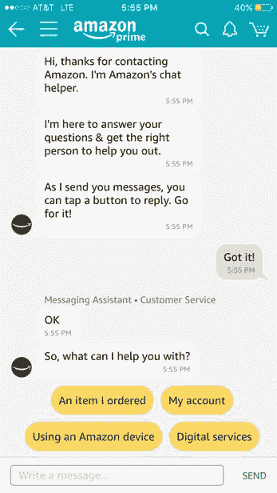

# 聊天机器人没有让我们失望，我们对它们的期望是| VentureBeat

> 原文：<https://venturebeat.com/2018/03/08/chatbots-arent-failing-us-our-expectations-for-them-are/?utm_source=wanqu.co&utm_campaign=Wanqu+Daily&utm_medium=website>

*查看来自低代码/无代码峰会的点播会议，了解如何通过提升和扩展公民开发者的技能来成功创新和实现效率。* [*现在看*](https://attendees.bizzabo.com/427958/agenda?date=1667952000000) *。*

* * *

在计算机出现之前，所有的机器都是作为人体的延伸而设计的。想想像起重机、自行车和黄油搅拌器这样的东西。计算机是第一台用来扩展人类思维的机器。这些年来，界面发生了变化，但目标一直未变:开发一种能够比人更好地执行智力任务的机器，就像叉车比人类的手臂更好地举起物体一样。

迄今为止，我们还没有造出一台能同时执行身体每一项功能的机器，我们也还没有开发出一种能有效地做人脑所能做的一切的人工智能。然而，围绕聊天机器人的许多言论都是铁板一块，认为它们毫无用处，除非它们能像人类一样说话和思考。[这是个错误](https://venturebeat.com/2017/10/11/a-sober-view-of-ai-will-lead-to-more-effective-innovation/)。

没有一个聊天机器人能够完成我们想要的每一项精神功能。尽管有人尝试过——想想 Alexa 和谷歌助手——但都没有成功。这不足为奇；毕竟，我们还没有造出一台既能挖洞又能打鸡蛋的机器。相反，我们选择了一个机器大军，每个机器都有一个狭隘的目的，那就是它的表现远远好于它的人类对手。

聊天机器人市场已经开始分裂和缩小。例如，微信提供了两个机器人:订阅账户机器人和服务账户机器人。第一个机器人的目的是发现。它使用自然语言处理(NLP)理解大量词汇，并帮助用户搜索和发现内容，就像谷歌一样。第二个机器人，我们称之为服务机器人，自 20 世纪 60 年代以来就存在了，它被设计成遵循一个简单的决策树结构。这个聊天机器人今天功能非常强大，在许多领域都有用途，包括机票预订、机场餐厅点餐、客户服务和在医生办公室登记等等。

这两种类型的机器人功能都很强大；当我们期望一方做另一方的工作时，问题就出现了。事实上，微信是在[基于用户不满回滚这些机器人的更智能版本](https://chatbotsmagazine.com/china-wechat-and-the-origins-of-chatbots-89c481f15a44)后发展出这种市场分割的。现实是，用户不想要人工智能驱动的、健谈的、通过图灵测试的机器人。他们希望机器人能够有效地促进目标的完成。

## 探索机器人

探索机器人试图基于自然语言处理梳理出意图，这与谷歌算法识别搜索者目标的方式非常相似。然而，与传统的搜索栏不同，发现机器人提供了一种手机友好的方式来设置搜索参数。

例如，如果你转向你的个人购物机器人，说你想要一双冬靴，机器人会通过设置你想要的参数来提取意图。它可以问:“你是在找短靴还是过膝靴？”或者“你更喜欢皮靴还是人造材料？”我们目前设置这些限制的方式是高度手动的:我们从下拉菜单中选择或者在搜索栏中键入参数。相反，发现机器人根据一系列问题和答案来限制它显示的选项。

这个机器人最具革命性的方面是它会随着时间的推移学习你的口味。结果表明，你最终会变得非常适合自己的喜好。例如，这与 Amazon.com 使用的搜索方法相反，它在第一页显示最高评级或最受欢迎的商品，但包括其销售的所有 4.8 亿件商品。然后，用户必须通过下拉菜单缩小显示项目的范围。聊天机器人将我们从这种众包搜索模式转移到个性化模式。

中国电子商务巨头阿里巴巴(Alibaba)部署了一款名为 AliMe 的聊天机器人，它可以识别意图，根据知识图谱将查询与答案进行匹配，然后提供个性化的购物帮助。也就是说，机器人的自然语言处理并不完美，部分原因是用户自己可能无法准确表达语义意图。此外，用户[经常在购物过程中修改](https://medium.com/mlreview/behind-the-chat-how-e-commerce-bot-alime-works-1b352391172a)或完全改变意图，这可能会让喜欢逻辑的机器人脱轨。

发现机器人的另一个潜在问题是，当聊天机器人在没有任何直接人类控制的情况下通过机器学习进行学习时，它们可能会学习到错误的行为，这也是我们尚未看到它们在个别品牌之外广泛部署的原因。这就是发生在 [BabyQ](http://www.bbc.com/news/world-asia-china-40815024) 身上的事情。虽然机器学习为机器人提供了最佳的学习框架，但它也从开发人员的角度分离了机器人的内部逻辑，使其更难控制。

正因为如此，如今最有效的发现机器人都与品牌相关联，并遵循决策树结构。如果机器人的对话能力受到控制和限制，那么它肯定不会变成一个爱骂人的种族主义者。不利的一面是，这样的机器人读起来不像人类，也不像对话。

## 服务机器人

服务机器人的目的是完成简单的任务，收集反馈，并提供客户服务。这个机器人比发现机器人更容易构建，因为其用户的意图不是开放式的。因为它不需要处理语言和解析用户的目标，它可以引导用户通过预定的决策树路径。

<noscript>T3】</noscript>

服务机器人更容易部署，也更加用户友好。正如上面的截图所示(取自亚马逊 Prime 客户服务聊天选项)，聊天机器人本质上只是提供菜单选项，引导用户进入不同的支持路径。这减少了聊天机器人误解其对话者的机会，并消除了机器识别意图的需要——用户自己识别意图。

公司已经在各种领域部署了这些机器人。从达美乐的脸书机器人，到万豪的 Slackbot，再到亚马逊的客户服务机器人，许多企业都在使用聊天机器人技术来简化运营。通过引导客户进行一系列移动友好的选择，聊天机器人能够快速满足客户的需求，无论是对支持 Alexa 的设备进行故障诊断还是订购披萨。这些机器人中的大多数也有最低水平的自然语言处理。例如，如果你询问当天的交易，多米诺机器人可以理解，即使这些不包括在它的菜单选项中。但是这些机器人并没有被设计成偏离它们有限的初始产品太远。

这些机器人是用户可以选择的有限路径的交互的理想选择。注意，Amazon bot 只有四条初始路径。通过预先声明他们能做什么，机器人也建立了对他们能力的期望。亚马逊聊天机器人不会帮你挑选伴娘礼服，你也不会指望它会帮你挑选。

## 这是关于界面，而不是智能

发现机器人和事务机器人都因其各自的接口而对用户有用。虽然它们都有人工智能的元素，但它们的目的不是通过图灵测试，而是让在线交互在移动屏幕上变得更容易和更个性化。当企业利用这一优势时，他们会看到将聊天机器人引入他们的在线流程可以极大地改善用户体验。

到目前为止，聊天机器人的缺陷仅仅是我们期望一个机器人执行许多人的行为。我们按照自己的形象制作了聊天机器人。但是聊天机器人仍然是一个比我们更简单的物种，目前，它通过狭窄、流线型的设置提供了最大的用途。

事实上，这反映了进化发展。复杂的神经系统需要几千年的时间来发展，而身体的简单部分，如肾脏，早在更高的意识出现之前就存在于动物体内了。但是把婴儿和洗澡水一起倒掉将是一个错误。相反，我们需要使用聊天机器人目前拥有的更简单的器官，并给它时间和训练来开发复杂的系统，如准确识别开放式意图和学习模仿人类语言。像电影中的对话界面，比如《她的 T1 》,是一个很好的例子，表面上是从简单版本进化而来的。

对我们来说幸运的是，人类开发者的行动比自然母亲快得多。今年，公司可能会在各种零售环境中开发发现机器人(包括 H&M 和丝芙兰在内的先驱已经推出了它的版本)，在未来 10 年，我们甚至可能会看到这些不同的品种演变成一个高度智能的聊天机器人，实际上可以进行人类对话。

Abinash Tripathy 是客户支持平台 [Helpshift](http://secure-web.cisco.com/1SmZMJhmaAeOijAWpbmRlFrFSkwCBzpl-rvNfWlZKhzDWn9pj06xDre2WhWJCKm0gbpFaI4QjXd5_96KQATz0XjI-LIj0B_x3n2yU4ulxiIsYL0hsBObUy0RJAcNtKAmvijnPVE2m6GVdZpABCY3Zl9dRKG1HFuxI1YHWYcHUTM5uezR5bWs4hdm0QyBwvWgvOzZ9PKETR-8nYi7VnOmXpWAv0kJMtel_D8abwceO5exrmWQXxop-0P7w11jBP2sgfnD9HLJ3ueGTLXo-BRpg4hT7AxzPRJpc1q3_ZQ7WTzLWPkLmxHIBK7zEM2c69oGE7UZqb1icPNaoZpW0j-dkn04qw91tuWB1LZPWbQ6jo5Q/http%3A%2F%2Fwww.helpshift.com%2F) 的首席执行官和联合创始人。

**VentureBeat 的使命**是成为技术决策者获取变革性企业技术知识和进行交易的数字城市广场。[发现我们的简报。](https://info.venturebeat.com/website-preference-center.html)