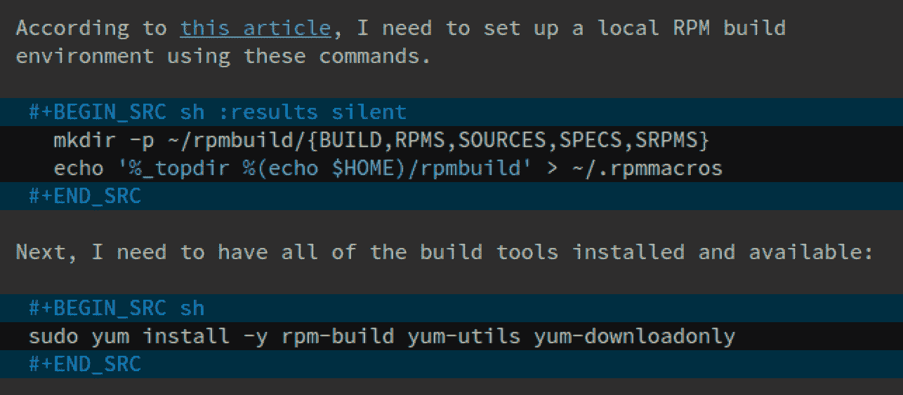
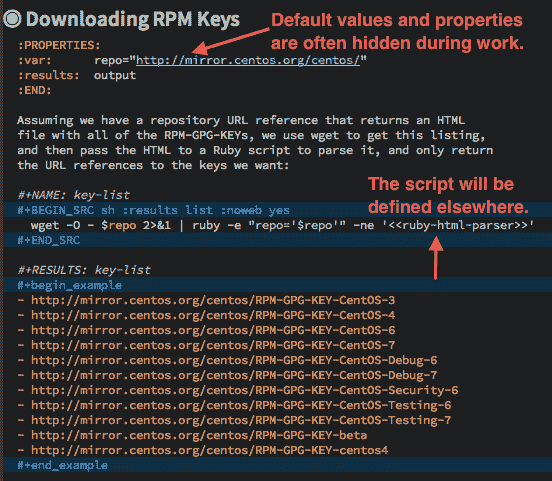
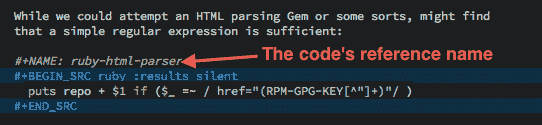
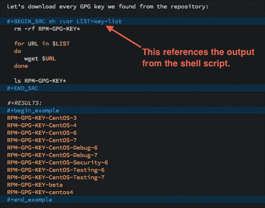

# 识字的 DevOps

> 原文：<http://howardism.org/Technical/Emacs/literate-devops.html?utm_source=wanqu.co&utm_campaign=Wanqu+Daily&utm_medium=website>

我没有打开虚拟机的终端，而是进入 Emacs，加载这个 sprint 的*笔记文件* ，创建一个新的头，并在这个文本文件中输入 shell 和 ruby 命令。

这有什么好处？不像传统的终端，这允许我*记录*、*记录*和*执行*每个命令。

例如，下面是我的 Emacs 缓冲区的一部分的屏幕截图:

作为一个脑子很少的老熊，我的散文可以解释每个命令的背景和目的。点击超链接刷新了我对以前发现的记忆。一个键盘符*执行*代码块…

是的。我从 Emacs 内部执行命令。

点击`C-c C-c`(两次 Control-C)运行代码(基于语言)。这个例子在 shell 中运行。结果被放回文件中，可以被其他代码块使用(以及[许多其他选项](http://orgmode.org/manual/results.html#results))。

例如，下面是从存储库中下载 GPG 密钥的部分的前半部分(URL 放在一个由该部分的所有代码块共享的*属性*中):

Shell 脚本块(在屏幕截图的中间)使用`wget`来下载 HTML 索引文件，并解析和提取关键文件的 URL。我们将使用一个 Ruby 脚本进行解析，由于这个脚本可能有点复杂，我们将在另一个代码块中定义它。

来自[文化编程](../LP/introduction.html)的一项技术是一个代码块可以插入到另一个代码块中的想法(引用是双尖括号内的名称，`<<...>>`)。Donald Knuth 称这种特性为 WEB。由于它可能会与某些语言(比如 Ruby)发生冲突，所以我默认关闭了它，但是用`noweb`参数为这个块打开它。

下面是 Ruby 脚本。将它放在一个单独的 Ruby 专用代码块中，允许我打开 Emacs 所能聚集的所有 Ruby 魔力。

最后一步是获取第一个脚本生成的 URL，并将它们提供给另一个 Shell 脚本，后者将调用`wget`来下载每个 URL:

`key-list`是我们原始代码块的名称，也是其结果的名称。我们将结果列表分配给一个变量，`LIST`，shell 脚本将以`$LIST`的身份访问这个变量。

这个例子展示了文化编程如何通过不同的语言编织代码和数据。