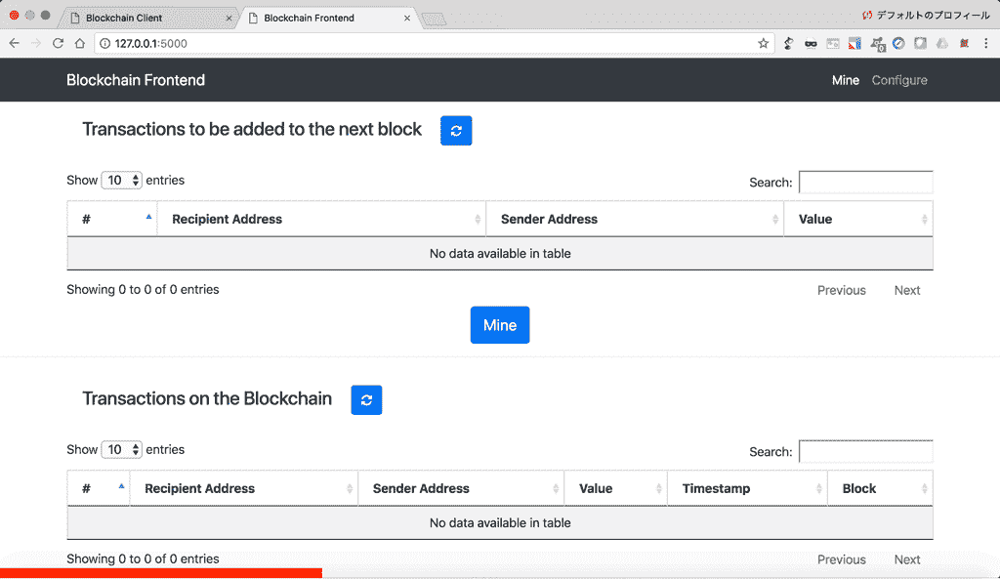

# Python // Adil Moujahid //数据分析等区块链实用介绍

> 原文：<http://adilmoujahid.com/posts/2018/03/intro-blockchain-bitcoin-python/?utm_source=wanqu.co&utm_campaign=Wanqu+Daily&utm_medium=website>

区块链可以说是自互联网诞生以来最重要和最具颠覆性的技术之一。在过去几年里，比特币和其他加密货币背后的核心技术吸引了很多关注。

作为其核心，区块链是一个分布式数据库，允许双方之间直接交易，而不需要中央机构。这一简单而强大的概念对银行、政府和市场等各种机构都有很大的影响。任何依赖集中式数据库作为核心竞争优势的企业或组织都有可能被区块链技术颠覆。

抛开所有围绕比特币和其他加密货币价格的炒作不谈，这篇博文的目标是给你一个关于区块链技术的实用介绍。第 1 节和第 2 节涵盖了区块链背后的一些核心概念，而第 3 节展示了如何使用 Python 实现区块链。我们还将实现 2 个 web 应用程序，以方便最终用户与我们的区块链进行交互。

请注意，我在这里使用比特币作为解释更一般的“区块链”技术的媒介，这篇文章中描述的大多数概念都适用于其他区块链用例和加密货币。

下面是我们将在第 3 部分构建的两个 web 应用程序的动画 gif。

# 1.区块链速成班

这一切都始于 2008 年由一个不知名的人或实体以中本聪的名义发布的白皮书。白皮书的标题是[“比特币:点对点电子现金系统”](https://bitcoin.org/bitcoin.pdf)，它奠定了后来被称为区块链的基础。在最初的比特币白皮书中，Satoshi 描述了如何建立一个点对点的电子现金系统，该系统允许在线支付直接从一方发送到另一方，而不经过中央机构。这个系统解决了数字货币中一个叫做重复消费的重要问题。

## 1.1.什么是双重消费？

假设爱丽丝想付给鲍勃 1 美元。如果 Alice 和 Bob 使用实物现金，那么 Alice 在交易执行后将不再拥有这 1 美元。如果爱丽丝和鲍勃使用数字货币，那么问题就变得更复杂了。数字货币是数字形式的，很容易复制。例如，如果 Alice 通过电子邮件向 Bob 发送价值 1 美元的数字文件，Bob 不能确定 Alice 是否已经删除了该文件的副本。如果 Alice 仍然有 1$数字文件，那么她可以选择将相同的文件发送给 Carol。这个问题被称为重复支出。

解决重复消费问题的一种方法是在 Alice、Bob 和网络中的所有其他参与者之间建立一个可信任的第三方(例如银行)。该第三方负责管理集中式分类帐，该分类帐跟踪并验证网络中的所有交易。这种解决方案的缺点是，为了使系统运行，它需要信任集中的第三方。

## 1.2.比特币:双重消费问题的分散解决方案

为了解决重复支出的问题，Satoshi 提出了一个公共账本，即比特币的区块链，来跟踪网络中的所有交易。比特币的区块链有以下特点:

*   分布式:分类账在多台计算机上复制，而不是存储在中央服务器上。任何能上网的电脑都可以下载完整版的《区块链》。
*   加密:加密用于确保发送者拥有她试图发送的比特币，并决定如何将交易添加到区块链中。
*   不可变的:区块链只能以附加的方式改变。换句话说，交易只能添加到区块链，不能删除或修改。
*   使用工作证明(PoW):网络中一种特殊类型的参与者称为矿工，他们竞争寻找加密难题的解决方案，这将允许他们向比特币的区块链添加一批交易。这个过程被称为工作证明，它允许系统是安全的(稍后将详细介绍)。

发送比特币的流程如下:

*   第一步(一次性努力):创建一个比特币钱包。一个人要发送或接收比特币，她需要创建一个比特币钱包。一个比特币钱包存储 2 条信息:一个私钥和一个公钥。私钥是一个秘密数字，允许所有者将比特币发送给另一个用户，或在接受比特币作为支付方式的服务上花费比特币。公钥是接收比特币所需的数字。公钥也被称为比特币地址(不完全正确，但为了简单起见，我们将假设公钥和比特币地址是相同的)。请注意，钱包本身并不存储比特币。关于比特币余额的信息存储在比特币的区块链上。
*   第二步:创建一个比特币交易。如果爱丽丝想向鲍勃发送 1 BTC，爱丽丝需要使用她的私钥连接到她的比特币钱包，并创建一个包含她想发送的比特币数量和她想发送它们的地址(在本例中为鲍勃的公共地址)的交易。
*   第三步:向比特币的网络广播交易。一旦 Alice 创建了比特币交易，她需要向整个比特币网络广播该交易。
*   第四步:确认交易。一名矿工监听比特币的网络，使用爱丽丝的公钥对交易进行认证，确认爱丽丝的钱包中有足够的比特币(在这种情况下至少有 1 BTC)，并向比特币的区块链添加包含交易细节的新记录。
*   第五步:向所有矿工广播区块链的变化。一旦交易被确认，矿工应该向所有矿工广播区块链改变，以确保他们的区块链副本都是同步的。

# 2.区块链的技术深度探讨

本节的目标是深入探讨为区块链提供动力的技术构件。我们将讨论公钥加密、散列函数、挖掘和区块链的安全性。

## 2.1.公钥加密

公钥密码学，或称非对称密码学，是使用成对密钥的任何密码系统:公钥可能被广泛传播，而私钥只有所有者知道。这实现了两个功能:身份验证，其中公钥验证发送消息的配对私钥的持有者；以及加密，其中只有配对私钥的持有者才能解密用公钥加密的消息。[1]

[RSA](https://en.wikipedia.org/wiki/RSA_(cryptosystem)) 和[椭圆曲线数字签名(ECDSA)](https://en.wikipedia.org/wiki/Elliptic_Curve_Digital_Signature_Algorithm) 是最流行的公钥密码算法。

以比特币为例，使用 ECDSA 算法生成比特币钱包。比特币使用各种密钥和地址，但为了简单起见，我们在这篇博客中假设每个比特币钱包都有一对私钥/公钥，比特币地址是钱包的公钥。如果你对比特币钱包的完整技术细节感兴趣，我推荐这篇文章。

为了发送或接收 BTC，用户首先生成一个包含一对私钥和公钥的钱包。如果 Alice 想给 Bob 发送一些 BTC，她创建了一个事务，在该事务中，她输入了自己和 Bob 的公钥，以及她想发送的 BTC 的数量。然后，她使用自己的私钥签署交易。区块链上的计算机使用 Alice 的公钥来验证交易是真实的，并将交易添加到稍后将被添加到区块链的块中。

## 2.2.哈希函数和挖掘

所有的比特币交易都被分组在称为块的文件中。比特币每 10 分钟增加一个新的交易区块。一旦新块被添加到区块链，它就变成不可变的，不能被删除或修改。网络中一个特殊的参与者群体叫做矿工(连接到区块链的计算机)，他们负责创建新的交易块。矿工必须使用发送者的公钥对每笔交易进行认证，确认发送者有足够的余额用于所请求的交易，并将交易添加到块中。采矿者完全可以自由选择在区块中包含哪些交易，因此发送者需要包含交易费，以激励采矿者将其交易添加到区块中。

一个区块要被区块链接受，它需要被“开采”。要开采一个区块，矿工们需要找到一个极其罕见的密码难题的解决方案。如果开采的区块被区块链接受，矿工将获得比特币奖励，这是对交易费的额外激励。挖掘过程也被称为工作证明(PoW)，它是使区块链变得可信和安全的主要机制(稍后将详细介绍区块链安全性)。

### 哈希和区块链的密码难题

为了理解区块链密码难题，我们需要从散列函数开始。散列函数是可用于将任意大小的数据映射到固定大小的数据的任何函数。哈希函数返回的值称为哈希。哈希函数通常用于通过检测重复记录来加速数据库查找，它们也广泛用于密码学。加密散列函数允许容易地验证一些输入数据映射到给定的散列值，但是如果输入数据是未知的，则通过知道存储的散列值来重构它是故意困难的。[2]

比特币使用一种叫做 SHA-256 的加密哈希函数。SHA-256 应用于区块数据(比特币交易)和一个名为 nonce 的数字的组合。通过更改块数据或 nonce，我们可以获得完全不同的哈希。对于被视为有效或“挖掘”的块，块的哈希值和随机数需要满足特定条件。例如，哈希的四个前导数字需要等于“0000”。我们可以通过使条件更复杂来增加挖掘的复杂性，例如，我们可以增加哈希值需要以 0 开始的数量。

挖掘者需要解决的密码难题是找到一个使哈希值满足挖掘条件的 nonce 值。您可以使用下面的应用程序来模拟区块开采。当您在“数据”文本框中键入或更改 nonce 值时，您会注意到哈希值的变化。当你点击“我的”按钮时，该应用程序以一个等于零的 nonce 开始，计算哈希值，并检查哈希值的前四位数字是否等于“0000”。如果前四位数不等于“0000”，它将 nonce 加 1，并重复整个过程，直到找到满足条件的 nonce 值。如果该区块被视为已开采，背景颜色变为绿色。

## 2.3.从区块到区块链

如前一节所述，事务被分组到块中，并且块被附加到区块链。为了创建块链，每个新块都使用前一个块的散列作为其数据的一部分。为了创建新的块，挖掘器选择一组事务，添加前一个块的散列，并以与上述类似的方式挖掘该块。

对任何数据块中数据的任何更改都会影响随后数据块的所有哈希值，这些哈希值将变得无效。这赋予了区块链永恒的特性。

你可以用下面的应用程序模拟一个有 3 个积木的区块链。当您在“数据”文本框中键入或更改 nonce 值时，您会注意到下一个块的哈希值和“上一个”值(以前的哈希值)的变化。您可以通过点击每个区块的“采矿”按钮来模拟采矿过程。挖掘完 3 个块后，尝试更改块 1 或块 2 中的数据，您会注意到后面的所有块都变得无效。

上面两个采矿模拟器都改编自 Anders Brownworth 的优秀[区块链演示](https://anders.com/blockchain/blockchain.html)。

## 2.4.向区块链添加区块

比特币网络中的所有矿工相互竞争，寻找将被添加到区块链中的有效区块，并从网络中获得奖励。找到验证块的随机数是罕见的，但是由于矿工的数量，网络中的矿工验证块的概率非常高。第一个提交有效区块的矿工将他的区块添加到区块链，并获得比特币奖励。但是如果两个或更多的矿工同时提交他们的区块会发生什么？

### 解决冲突

如果两个矿工几乎同时解决一个区块，那么我们将在网络中有两个不同的区块链，我们需要等待下一个区块来解决冲突。一些矿工将决定在区块链 1 号顶部采矿，其他人将在区块链 2 号顶部采矿。第一个发现新块的矿工解决了冲突。如果新区块是在区块链 1 之上开采的，则区块链 2 无效，前一个区块的奖励归区块链 1 的矿工所有，而属于区块链 2 但未添加到区块链的交易返回到交易池并被添加到下一个区块。简而言之，如果区块链上发生冲突，那么最长的链条会获胜。

## 2.5.区块链和重复消费

在这一节中，我们将介绍对区块链进行双重花费攻击的最常见方式，以及用户应该采取的防止这些攻击造成损害的措施。

### 种族攻击

攻击者快速连续地向两个不同的地址发送相同的硬币。为了防止这种攻击，建议在接受付款之前至少等待一次块确认。[3]

### 芬尼攻击

攻击者通过交易预先挖掘区块，并在释放区块之前在第二次交易中花费相同的硬币。在这种情况下，第二个事务将不会被验证。为了防止这种攻击，建议在接受付款之前等待至少 6 次批量确认。[3]

### 多数攻击(也称为 51%攻击)

在这次攻击中，攻击者拥有网络 51%的计算能力。攻击者首先进行一次交易，该交易被广播到整个网络，然后挖掘一个私人区块链，在那里他双倍花费前一次交易的硬币。由于攻击者拥有大部分的计算能力，他肯定会在某个时候拥有比“诚实的”网络更长的链。然后，他可以释放他的更长的区块链，取代“诚实”的区块链，并取消原来的交易。这种攻击是极不可能的，因为它在像比特币这样的区块链网络中非常昂贵。[4]

# 3.Python 中的区块链实现

在本节中，我们将使用 Python 实现一个基本的区块链和一个区块链客户端。我们的区块链将具有以下特点:

*   向区块链添加多个节点的可能性
*   工作证明
*   节点间简单的冲突解决方案
*   使用 RSA 加密的交易

我们的区块链客户将具有以下特点:

*   使用公钥/私钥加密的钱包生成(基于 RSA 算法)
*   使用 RSA 加密生成交易

我们还将实施 2 个控制面板:

*   矿工的“区块链前端”
*   供用户生成钱包和发送硬币的“区块链客户端”

区块链的实现主要基于这个 [github 项目](https://github.com/dvf/blockchain)。为了给事务添加 RSA 加密，我对原始代码做了一些修改。钱包生成和交易加密就是基于这个 [Jupyter 笔记本](https://github.com/julienr/ipynb_playground/blob/master/bitcoin/dumbcoin/dumbcoin.ipynb)。这两个仪表板是使用 HTML/CSS/JS 从头开始实现的。

你可以从 https://github.com/adilmoujahid/blockchain-python-tutorial 下载完整的源代码。

请注意，这种实现仅用于教育目的，不应该用于生产，因为它没有很好的安全性，没有很好的伸缩性，且缺少许多重要的功能。

## 3.1.区块链客户端实现

你可以从终端打开`blockchain_client`文件夹，输入`python blockchain_client.py`来启动区块链客户端。在你的浏览器中，进入`http://localhost:8080`，你会看到下面的仪表盘。

仪表板的导航栏中有 3 个选项卡:

*   钱包生成器:使用 RSA 加密算法生成钱包(公钥/私钥对)
*   生成事务:生成事务并将它们发送到区块链节点
*   查看事务:查看区块链上的事务

为了进行或查看事务，您需要至少运行一个区块链节点(将在下一节中介绍)。

下面是对`blockchain_client.py`代码中最重要部分的一些解释。

我们定义了一个名为`Transaction`的 python 类，它有 4 个属性`sender_address`、`sender_private_key`、`recipient_address`、`value`。这是汇款人创建交易所需的 4 条信息。

`to_dict()`方法以 Python 字典格式返回交易信息(没有发送者的私钥)。`sign_transaction()`方法获取交易信息(没有发送者的私钥),并使用发送者的私钥对其进行签名。

```
class Transaction:

    def __init__(self, sender_address, sender_private_key, recipient_address, value):
        self.sender_address = sender_address
        self.sender_private_key = sender_private_key
        self.recipient_address = recipient_address
        self.value = value

    def __getattr__(self, attr):
        return self.data[attr]

    def to_dict(self):
        return OrderedDict({'sender_address': self.sender_address,
                            'recipient_address': self.recipient_address,
                            'value': self.value})

    def sign_transaction(self):
        """
 Sign transaction with private key
 """
        private_key = RSA.importKey(binascii.unhexlify(self.sender_private_key))
        signer = PKCS1_v1_5.new(private_key)
        h = SHA.new(str(self.to_dict()).encode('utf8'))
        return binascii.hexlify(signer.sign(h)).decode('ascii') 
```

下面一行初始化了一个`Python Flask`应用程序，我们将使用它来创建不同的 API 来与区块链及其客户端进行交互。

下面我们定义返回 html 页面的 3 个`Flask`路径。每个选项卡一个 html 页面。

```
@app.route('/')
def index():
  return render_template('./index.html')

@app.route('/make/transaction')
def make_transaction():
    return render_template('./make_transaction.html')

@app.route('/view/transactions')
def view_transaction():
    return render_template('./view_transactions.html') 
```

下面我们定义一个生成钱包(私钥/公钥对)的 API。

```
@app.route('/wallet/new', methods=['GET'])
def new_wallet():
  random_gen = Crypto.Random.new().read
  private_key = RSA.generate(1024, random_gen)
  public_key = private_key.publickey()
  response = {
    'private_key': binascii.hexlify(private_key.exportKey(format='DER')).decode('ascii'),
    'public_key': binascii.hexlify(public_key.exportKey(format='DER')).decode('ascii')
  }

  return jsonify(response), 200 
```

下面我们定义一个 API，它将`sender_address`、`sender_private_key`、`recipient_address`、`value`作为输入，并返回交易(没有私钥)和签名。

```
@app.route('/generate/transaction', methods=['POST'])
def generate_transaction():

  sender_address = request.form['sender_address']
  sender_private_key = request.form['sender_private_key']
  recipient_address = request.form['recipient_address']
  value = request.form['amount']

  transaction = Transaction(sender_address, sender_private_key, recipient_address, value)

  response = {'transaction': transaction.to_dict(), 'signature': transaction.sign_transaction()}

  return jsonify(response), 200 
```

## 3.2.区块链实施

您可以从终端启动一个区块链节点，方法是转到`blockchain`文件夹，并键入`python blockchain_client.py`或`python blockchain_client.py -p <PORT NUMBER>`。如果您不指定端口号，它将默认为端口 5000。在您的浏览器中，转到`http://localhost:<PORT NUMBER>`查看区块链前端仪表板。

仪表板的导航栏中有两个选项卡:

*   Mine:用于查看事务和区块链数据，以及挖掘新的事务块。
*   配置:用于配置不同区块链节点之间的连接。

下面是对`blockchain.py`代码中最重要部分的一些解释。

我们首先定义一个具有以下属性的`Blockchain`类:

*   `transactions`:将被添加到下一个块的交易列表。
*   `chain`:实际的区块链，是一个块的数组。
*   `nodes`:包含节点 URL 的集合。区块链使用这些节点从其他节点检索区块链数据，并在它们不同步时更新其区块链。
*   `node_id`:标识区块链节点的随机字符串。

`Blockchain`类还实现了以下方法:

*   `register_node(node_url)`:在节点列表中添加一个新的区块链节点。
*   `verify_transaction_signature(sender_address, signature, transaction)`:检查所提供的签名是否对应于由公钥(sender_address)签名的交易。
*   `submit_transaction(sender_address, recipient_address, value, signature)`:如果签名通过验证，则将交易添加到交易列表中。
*   `create_block(nonce, previous_hash)`:向区块链添加一组交易。
*   `hash(block)`:创建块的阿沙-256 哈希。
*   `proof_of_work()`:工作算法证明。查找满足挖掘条件的 nonce。
*   `valid_proof(transactions, last_hash, nonce, difficulty=MINING_DIFFICULTY)`:检查哈希值是否满足挖掘条件。该函数在 proof_of_work 函数中使用。
*   `valid_chain(chain)`:检查 bockchain 是否有效。
*   `resolve_conflicts()`:通过用网络中最长的一条链替换一条链来解决区块链节点之间的冲突。

```
class Blockchain:

    def __init__(self):

        self.transactions = []
        self.chain = []
        self.nodes = set()
        #Generate random number to be used as node_id
        self.node_id = str(uuid4()).replace('-', '')
        #Create genesis block
        self.create_block(0, '00')

    def register_node(self, node_url):
        """
 Add a new node to the list of nodes
 """
        ...

    def verify_transaction_signature(self, sender_address, signature, transaction):
        """
 Check that the provided signature corresponds to transaction
 signed by the public key (sender_address)
 """
        ...

    def submit_transaction(self, sender_address, recipient_address, value, signature):
        """
 Add a transaction to transactions array if the signature verified
 """
        ...

    def create_block(self, nonce, previous_hash):
        """
 Add a block of transactions to the blockchain
 """
        ...

    def hash(self, block):
        """
 Create a SHA-256 hash of a block
 """
        ...

    def proof_of_work(self):
        """
 Proof of work algorithm
 """
        ...

    def valid_proof(self, transactions, last_hash, nonce, difficulty=MINING_DIFFICULTY):
        """
 Check if a hash value satisfies the mining conditions. This function is used within the proof_of_work function.
 """
        ...

    def valid_chain(self, chain):
        """
 check if a bockchain is valid
 """
        ...

    def resolve_conflicts(self):
        """
 Resolve conflicts between blockchain's nodes
 by replacing our chain with the longest one in the network.
 """
        ... 
```

下面一行初始化了一个`Python Flask`应用程序，我们将使用它来创建不同的 API 来与区块链交互。

```
app = Flask(__name__)
CORS(app) 
```

接下来，我们启动一个区块链实例。

```
blockchain = Blockchain() 
```

下面我们定义 2 个`Flask`路径，返回我们的区块链前端仪表板的 html 页面。

```
@app.route('/')
def index():
    return render_template('./index.html')

@app.route('/configure')
def configure():
    return render_template('./configure.html') 
```

下面我们定义`Flask`API 来管理事务和挖掘区块链。

*   `'/transactions/new'`:该 API 将`'sender_address'`、`'recipient_address'`、`'amount'`和`'signature'`作为输入，如果签名有效，则将该事务添加到将被添加到下一个块的事务列表中。
*   `'/transactions/get'`:这个 API 返回所有将要添加到下一个块的事务。
*   这个 API 返回所有的区块链数据。
*   `'/mine'`:该 API 运行工作证明算法，并向区块链添加新的事务块。

```
@app.route('/transactions/new', methods=['POST'])
def new_transaction():
    values = request.form

    # Check that the required fields are in the POST'ed data
    required = ['sender_address', 'recipient_address', 'amount', 'signature']
    if not all(k in values for k in required):
        return 'Missing values', 400
    # Create a new Transaction
    transaction_result = blockchain.submit_transaction(values['sender_address'], values['recipient_address'], values['amount'], values['signature'])

    if transaction_result == False:
        response = {'message': 'Invalid Transaction!'}
        return jsonify(response), 406
    else:
        response = {'message': 'Transaction will be added to Block '+ str(transaction_result)}
        return jsonify(response), 201

@app.route('/transactions/get', methods=['GET'])
def get_transactions():
    #Get transactions from transactions pool
    transactions = blockchain.transactions

    response = {'transactions': transactions}
    return jsonify(response), 200

@app.route('/chain', methods=['GET'])
def full_chain():
    response = {
        'chain': blockchain.chain,
        'length': len(blockchain.chain),
    }
    return jsonify(response), 200

@app.route('/mine', methods=['GET'])
def mine():
    # We run the proof of work algorithm to get the next proof...
    last_block = blockchain.chain[-1]
    nonce = blockchain.proof_of_work()

    # We must receive a reward for finding the proof.
    blockchain.submit_transaction(sender_address=MINING_SENDER, recipient_address=blockchain.node_id, value=MINING_REWARD, signature="")

    # Forge the new Block by adding it to the chain
    previous_hash = blockchain.hash(last_block)
    block = blockchain.create_block(nonce, previous_hash)

    response = {
        'message': "New Block Forged",
        'block_number': block['block_number'],
        'transactions': block['transactions'],
        'nonce': block['nonce'],
        'previous_hash': block['previous_hash'],
    }
    return jsonify(response), 200 
```



下面我们定义 Flask APIs 来管理区块链节点。

*   `'/nodes/register'`:这个 API 将节点 URL 列表作为输入，并将它们添加到节点列表中。
*   这个 API 通过用网络中最长的可用链替换本地链来解决区块链节点之间的冲突。
*   `'/nodes/get'`:这个 API 返回节点列表。

```
@app.route('/nodes/register', methods=['POST'])
def register_nodes():
    values = request.form
    nodes = values.get('nodes').replace(" ", "").split(',')

    if nodes is None:
        return "Error: Please supply a valid list of nodes", 400

    for node in nodes:
        blockchain.register_node(node)

    response = {
        'message': 'New nodes have been added',
        'total_nodes': [node for node in blockchain.nodes],
    }
    return jsonify(response), 201

@app.route('/nodes/resolve', methods=['GET'])
def consensus():
    replaced = blockchain.resolve_conflicts()

    if replaced:
        response = {
            'message': 'Our chain was replaced',
            'new_chain': blockchain.chain
        }
    else:
        response = {
            'message': 'Our chain is authoritative',
            'chain': blockchain.chain
        }
    return jsonify(response), 200

@app.route('/nodes/get', methods=['GET'])
def get_nodes():
    nodes = list(blockchain.nodes)
    response = {'nodes': nodes}
    return jsonify(response), 200 
```

# 结论

在这篇博文中，我们介绍了区块链背后的一些核心概念，并学习了如何使用 Python 实现一个核心概念。为了简单起见，我没有涉及一些技术细节，例如:钱包地址和默克尔树。如果你想了解该主题的更多信息，我建议阅读比特币白皮书原文，并跟进[比特币维基](https://en.bitcoin.it/wiki/Main_Page)和 Andreas Antonopoulos 的优秀著作:[掌握比特币:编程开放区块链](https://www.amazon.com/gp/product/1491954388/ref=as_li_tl?ie=UTF8&camp=1789&creative=9325&creativeASIN=1491954388&linkCode=as2&tag=adilmoujahid-20&linkId=bd776f9224715e8a022d4984909d6a69)。

# 参考

[Go Top](#)