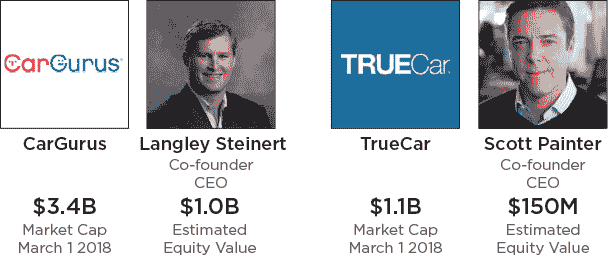

# 当风险投资成为虚荣资本 TechCrunch

> 原文：<https://techcrunch.com/2018/03/05/when-venture-capital-becomes-vanity-capital/?utm_source=wanqu.co&utm_campaign=Wanqu+Daily&utm_medium=website>

More posts by this contributor

我已经写了很多关于高效创业的好处。我已经从概念上解释了我的观点，试图说明 T2 过剩的资本如何扼杀有前途的公司，并分享了来自 71 家首次公开募股的数据，这些数据表明 T4 即使成功了，筹集更多的资本也不会带来更好的结果。以防所有这些都过于概念化，这篇博文旨在迎合另一种情感——贪婪。

融资少或融资晚不仅会带来更好的公司，还会带来更富有的创始人。

你更愿意成为 Zappos 或 Wayfair 的创始人？

我经常以举手方式问哈佛商学院(Harvard Business School)的 MBA 学生，他们会选择创建 Zappos 还是 Wayfair？所有的学生都知道 Zappos 是一个成功的故事。许多人甚至没有听说过 Wayfair。这些精明的学生中有十分之九会选择 Zappos。

Zappos 是一个教科书式的成功故事。他们从硅谷最好的风投那里筹集了分期的、明智的资金。创始人谢家华的非正统领导方式为他赢得了杂志封面和一本书的交易。当这家公司被亚马逊以 8 . 5 亿美元(T1)到 12 亿美元(T3)的价格收购时，谢霆锋以 2 . 14 亿到 3 . 67 亿美元(T5)的价格离开了 T4。这是一笔非同寻常的金额——巨大的成功让 Zappos 成为创始人应该学习的榜样。

但还有更好的电子商务创业故事，很少有创始人知道去研究。

对比一下 Zappos 和 Wayfair，一家直接运输家具的电子商务公司。创始人 Niraj Shah 和 Steve Conine 通过优化谷歌的算法，购买了数百个搜索引擎优化友好的网址，如“[www.racksandstands.com](http://www.racksandstands.com/)”并聚集流量，从而启动了业务并迅速增长。该公司从第一个月开始盈利，尽管有许多风险投资，但他们在没有外部资本的情况下发展业务，直到销售额超过 5 亿美元。有些人可能会认为这家公司稳固、稳定，还有点乏味，但 2014 年在纽约证券交易所上市时，创始人一路欢笑。公司的众多显著特征之一是创始人的财务成功。

IPO 时，每位创始人都拥有公司 29%的股份。尽管从那以后他们定期出售股票，但根据公司目前[69 亿美元的市值](https://www.google.com/search?q=NYSE:W&tbm=fin#scso=uid_pmtOWpKWHYqF_Qa7yaj4DQ_5:0)，Wayfair 的两位联合创始人每人赚的钱相当于 Zappos 所有股东的总和。换句话说，通过建立一个资本效率极高的企业，并且只在公司已经非常有价值的时候融资，Wayfair 联合创始人的收入是谢长廷的近 10 倍。我宁愿做沙阿和康宁。

**尽早最小化资本**

你可能会说，这种差异与家具和鞋类市场的相对规模有关。公平地说，[家具业务](http://www.statista.com/topics/1136/us-furniture-retail/)大约是[鞋类市场](http://www.statisticbrain.com/footwear-industry-statistics/)的两倍，尽管考虑到顾客的回头客性质、更低的运输成本以及更少的试销和退货摩擦，鞋类行业可能更适合电子商务。

虽然行业动态可能发挥了作用，但我认为是公司的资本战略造成了这种差异。Wayfair 没有筹集资金来启动公司或加速早期增长，尽管在此过程中很容易获得资金；他们只在需要大幅扩张业务并投资于一家已经庞大而健康的公司时才筹集资金。他们并不羞于获得大量资本:Wayfair 筹集的资本是 Zappos 的三倍，但只是在该公司的主导地位确立后稀释程度最低，并且可以提供大量规模杠杆的情况下。

**这不全是关于本杰明的**

过早获得资本，并且过度稀释，会产生超出最终收益的连锁反应。在出售给亚马逊后，谢国忠表示，由于股东的压力，他被迫出售公司。参与其中的每个人都赚了一大笔钱，但基于五年前做出的融资决定而将自己的偏好置于次要地位令人沮丧。如果继续控制捷步达康，谢长廷可能会继续发展他的公司，甚至可能与 Wayfair 的成功相媲美。Wayfair 的创始人甚至在首次公开募股时就拥有超过一半的公司股份，并在有限稀释的情况下按照他们的条款筹集资金，他们能够在更大程度上控制自己的命运，今天仍然经营着一家非凡的企业。

**TrueCar vs .袋鼠〔t1〕**

让我们重新开始:举手表决，你更愿意成为哪家上市汽车电子商务公司 TrueCar 和 CarGurus 的创始人？请在查看下表之前做出决定:

没错，CarGurus 筹集的资金要少得多，但同样盈利，而且增长速度比 TrueCar 快得多，因此价值是 true car 的三倍多。

由于 CarGurus 的资本规模较小，Langley Steinart 在该公司首次公开募股时拥有其 29%的股份，这一股份价值接近 TrueCar 的全部价值。在首次公开募股时，TrueCar 创始人斯科特·佩因特拥有[公司](https://www.sec.gov/Archives/edgar/data/1327318/000104746914004566/a2219764zs-1a.htm)14%的股份，这确实是一个惊人的数字，但这只代表了斯坦纳特在 CarGurus 总价值的十分之一。

即使成功了，更多的资本并不意味着更好的企业，筹集更少的资金可以获得个人财富和控制权的数倍回报。

**这些是伟大的成果**

在这两个例子中，两家公司都获得了成功，创始人也获得了巨大的财务成功。当我向企业家提出这些思想实验时，他们经常反驳说，他们愿意为了建立一个知名品牌的机会而减少个人财务收益。他们愿意放弃十亿美元的银行账户，只为了区区一亿美元的发薪日和名声。现实是，这很少是提供给创始人的权衡。

更常见的退出机会不是数十亿美元的 IPO，而是 5000 万至 1 亿美元的收购。如果你筹到了一笔不多的钱，这可能会是一个变革性的结果。如果你已经筹集了数千万美元(有时是数百美元)，那么很多(如果不是全部的话)退出机会都会被关闭。资本过剩的公司面临的高概率选择是，决定接受 5000 万美元，但未能清理你的风险投资者偏好堆栈，或者面临破产，并解雇你的整个团队。无论是哪种情况，创始人都很有可能看不到回报。

成立 10 年后，Wayfair 和 CarGurus 已经成为比同行更有价值的企业，创始人从他们的精益融资战略中受益匪浅，但他们一直拥有更有价值的东西——期权。

因为他们从不受制于风险资本家或过高的估值，他们可以灵活地以 5000 万美元或 5 亿美元的价格出售。这些创始人可以决定出售或不出售，这取决于他们的业务表现和风险偏好，而不是他们的资本结构。一个 1 亿美元的初创公司并不可耻，创始人不应该这么快就放弃这个选择。

即使成功了，太多的资本也有很高的成本，不应该被低估。同样，高效的企业家精神有许多不可低估的好处。问问 Niraj Shah，Steve Conine 和 Langley Steinert 就知道了。