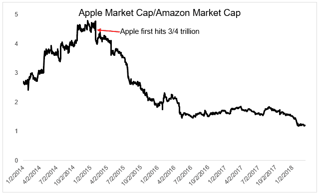
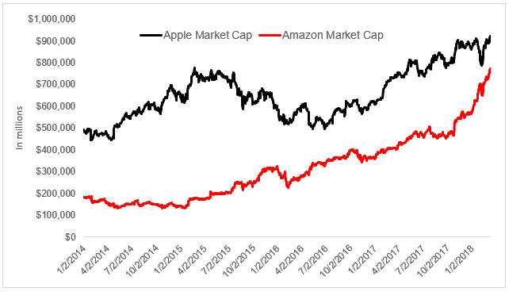
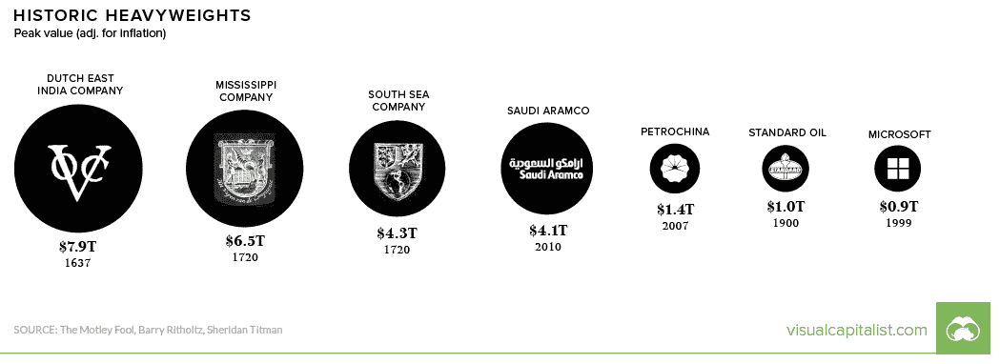

# 一万亿的竞赛——无关的投资者

> 原文：<http://theirrelevantinvestor.com/2018/03/12/the-race-to-a-trillion/?utm_source=wanqu.co&utm_campaign=Wanqu+Daily&utm_medium=website>

# 迈向一万亿的竞赛

发布于<time class="updated" datetime="2018-03-12" pubdate="">2018 年 3 月 12 日</time>由发布[迈克尔·巴特尼克](https://theirrelevantinvestor.com/author/theirrelevantinvestor/ "Posts by Michael Batnick")发布

在过去的 92 个交易日中，亚马逊的市值增加了 304，512，850，704 美元。

并不是说 92 天内 3000 亿美元需要上下文，但无论如何这里有一些:这比亚马逊在 2016 年 4 月的价值还高，甚至比两年前还高。这比标准普尔 500 除苹果、谷歌、微软、脸书、伯克希尔哈撒韦、摩根大通、强生、美国银行和埃克森美孚以外的所有公司都大。亚马逊在 92 天内增加的市值超过了它上市后第一个 5147 天的市值。

在思考第一个万亿美元公司的竞赛时，我只是假设它会是苹果，其他任何东西都不在我的考虑范围内。苹果第一次达到 3/4 万亿大关时，它是任何一家美国公司的两倍。它们是谷歌的两倍，是亚马逊的 4.4 倍。

在亚马逊第三季度业绩发布前，苹果的市值为 8，370 亿美元，而亚马逊的市值为 4，680 亿美元。如今，苹果的市值为 9230 亿美元，而亚马逊为 7730 亿美元。差距缩小的速度之快令人难以置信。

为了达到 1 万亿美元大关，亚马逊需要增长 29%(在过去 92 个交易日中增长了 64.4%)。苹果只需增加 8%就能进入 cuatro commas 俱乐部(可能会多一点，因为它的股票回购计划。亚马逊自 2012 年以来就没有回购过股票)。

根据视觉资本家的说法，以前没有一家美国公司达到 1 万亿美元，但有几家公司，经通货膨胀调整后，达到了这一水平。

我仍然认为苹果会在亚马逊之前到达那里，但无论如何，我们可能再也不会看到像亚马逊在过去 92 天里那样的巨大股票波动。虽然从传统标准来看，亚马逊从来都不便宜，但与荷兰东印度公司相比，亚马逊看起来很便宜。

