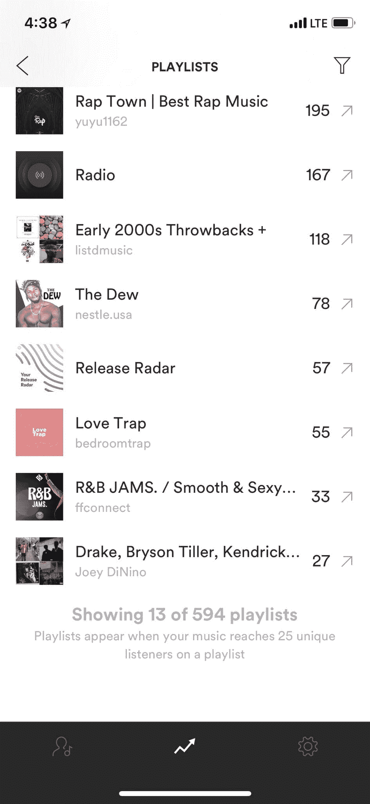
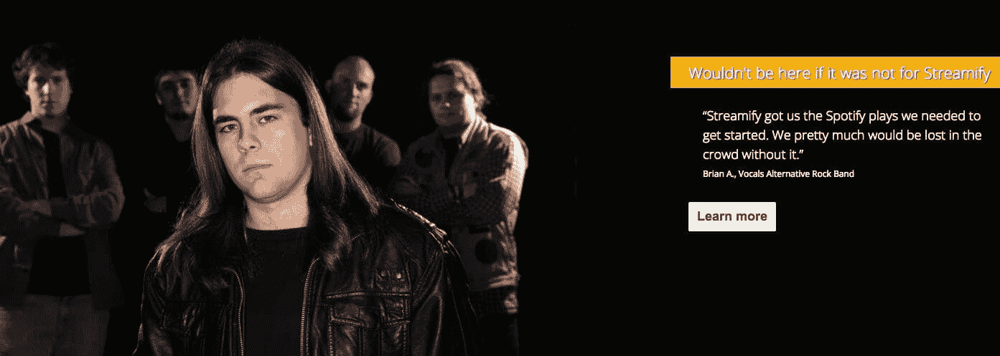
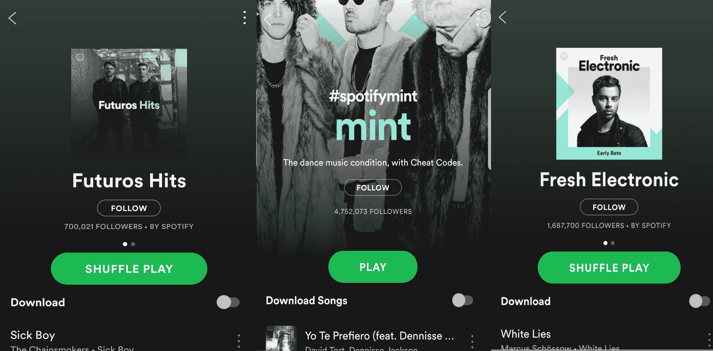

# 顶级 Spotify 播放列表的黑市内幕

> 原文：<https://www.dailydot.com/upstream/spotify-playlist-black-market/?utm_source=wanqu.co&utm_campaign=Wanqu+Daily&utm_medium=website>

汤米·金可能是下一个从亚特兰大逃出来的说唱歌手。他人脉广泛，有着明显的霸气，他一直在悄悄地在[【Spotify】](https://www.dailydot.com/tags/spotify/)上成功收集单曲。他的最新作品，《东区 [(壮举。Cyhi the Prynce)](https://open.spotify.com/track/5kEiZcQVCkNPuRXY34yrSU?si=rpz04fWqS_qAr9lvaQIPBg) ”已经记录了超过 110，000 个流，主要是由于它在 14 个独立播放列表中的位置。

在停车场忙忙碌碌，在你的汽车后备箱里卖混音带的日子已经一去不复返了。在现代音乐经济中，流媒体服务占 [录制音乐产生的总收入](http://www.riaa.com/wp-content/uploads/2017/09/RIAA-Mid-Year-2017-News-and-Notes2.pdf) 的近三分之二。通过[大数据](https://kernelmag.dailydot.com/issue-sections/headline-story/12188/big-data-music-next-big-sound/)越来越多的艺术家被追踪。Spotify 流、YouTube 视图、Twitter 互动，甚至维基百科搜索都被用来发现众所周知的下一件大事。这就是为什么金的经纪人努力让他的音乐登上迄今为止惊人的 594 个 Spotify 播放列表。

“老实说，如果没有 Spotify 播放列表，我不会觉得我们取得了多大成就，”当我拨通金在他的脸书页面上公开列出的电话号码联系到他时，他告诉我。“现在，信息流是真正接触到你无法与之联系的人的唯一方式。它让你有能力在世界范围内玩，我们在这方面做得很好。

“这就是现在的一切。”

只有一个条件:金实际上是付费加入 Spotify 播放列表的。他是无数付钱让策展人检查他的作品的艺术家之一。对于他同时代的一些人来说， O r 被添加到特定的播放列表中。这是为了获得有价值的流量和关注。

Spotify 播放列表的黑市正在蓬勃发展。入侵系统比你想象的要便宜，而且如果做得好的话，它不仅仅是为自己买单。

## **Spotify 播放列表的兴起**

Spotify 播放列表的价值怎么强调都不为过。该公司主导着流媒体音乐市场，拥有 1.59 亿活跃用户和 7100 万付费用户。那是将近两倍的 Apple Music 的订阅基数，根据最近一份 [的报告](https://www.wsj.com/articles/apple-music-on-track-to-overtake-spotify-in-u-s-subscribers-1517745720) 中的 *【华尔街日报】* 。

更重要的是，Spotify 已将播放列表作为其标志性功能。首席执行官丹尼尔·埃克 [在 2016 年 2 月说](https://www.quora.com/Where-is-Spotify-headed-next-What-new-experiences-do-you-see-Spotify-getting-into-What-new-experiences-do-you-see-Spotify-getting-into) 他想“为你生命中的每一刻配乐”，他说到做到。该公司为每一个可以想象的场合创建了一个官方播放列表。ome 是由 150 名编辑人员和其他根据特定类型和情绪通过算法生成的人策划的。现在，正如 Spotify [在本月早些时候提交给美国证券交易委员会的文件中指出的那样，该公司的估值为 230 亿美元，这些官方播放列表占该平台所有收听量的近三分之一，高于 2016 年的不到 20%。](https://pitchfork.com/news/spotify-goes-public-7-revelations-from-the-sec-filing/?mbid=homepage-more-latest-and-video)

这些播放列表中最大的一个基本上可以制造热门歌曲。Spotify 有影响力的[【rap caviar】](https://open.spotify.com/playlist/37i9dQZF1DX0XUsuxWHRQd?si=0y__1eJ4RwCiOfI26Av2-Q)【号称拥有超过800 万粉丝，一次添加就能产生数十万个流，这取决于它被放在哪里以及在那里停留多长时间。RapCaviar 已经被 [记入](https://www.digitaltrends.com/music/playlists-curators-spotify-apple-music-rapcaviar/) 了，例如，用制作 Smokepurpp 的 [奥迪的](https://open.spotify.com/track/2INqEk4ko5AsGVLBsiKiQe?si=QcQarkT9RTK_DZYRB-wm6g) “走金，用 6800 万流而不断。

A screenshot of Tommie King’s Spotify dashboard [Cody Patrick/Organic Music Marketing](https://www.organicmusicmarketing.com/)

这只是一个内部播放列表。Spotify 拥有 2500 个这样的网站，它们已经成为业内最有价值的房地产之一。唱片公司和公关代表现在在流媒体服务上与潮流引领者合作，就像他们几十年来与广播电台和媒体合作一样。

独立唱片公司 [【死海】](https://deadoceans.com/)[Secretly Group](http://secretlygroup.com/)的全球营销负责人菲尔·沃尔多夫(Phil Waldorf)表示:“我们有这么多收入直接来自流媒体服务，这自然是一个巨大的焦点。”“(添加播放列表的)附加值是多方面的。基本上，额外演出产生的收入是一笔意外之财。但是，希望这首歌表现良好，然后被添加到其他播放列表中。一个强大播放列表添加器是获得更多编辑支持的基础。我们希望在这个过程中能有所发现。”

Spotify 播放列表价值的上升催生了一种新的贿赂形式。这是他几十年来为电台播放歌曲付费的非法行为。当然，巨额资金在幕后易手。2015 年 8 月[exposéby*Billboard*](https://www.billboard.com/articles/business/6670475/playola-promotion-streaming-services)引用了一位未透露姓名的主要唱片公司高管的话，他声称 playlist adds 的售价为“拥有数万粉丝的播放列表的售价为 2000 美元，而更受欢迎的播放列表的售价为 1 万美元。”

Spotify 的回应是更新其 [服务条款](https://www.spotify.com/us/legal/end-user-agreement/) 明确禁止“出售用户账户或播放列表，或以其他方式接受任何补偿，财务或其他方式，以影响账户或播放列表的名称或账户或播放列表中的内容。”

但是支付安置费的做法，就像之前的其他形式的贿赂一样，并没有消失。它刚刚被重新混合。

## **新的贿赂**

在几分钟内，你只需支付 2 美元，就可以让 1500 名在[spot lister](https://www.spotlister.com/)工作的策展人之一考虑你的歌曲，这是向知名 Spotify 用户出售访问权的几项新服务之一。

这个网站是由两个 21 岁的大学生创建的——丹尼·加西亚，纽约大学的吉他手，和一个因为无关的隐私问题而要求匿名的密友。他们在 2016 年创办了一家“私人雇佣”公关公司，提供“推销服务”，在 SoundCloud 和后来的 Spotify 上制造轰动。这两个人每个月会接待 15 到 20 个客户。每个都要支付 1000-5000 美元，以确保在播放列表中占据显著位置。

加西亚回忆道:“我们开始支付 5 美元(用于添加播放列表),这在一开始是可行的。“当更多的人开始进入这个游戏时，你会看到价格开始上涨，然后玩家开始看到他们是相关的，价值更高。有些播放列表有 9 万名粉丝，每次添加收费 100-200 美元，而有 50 万名粉丝的播放列表，每次添加收费 2000 美元。”

Spotify 在给 the Daily Dot 的一份声明中说，“不存在‘付费播放列表’或以任何方式销售我们的播放列表。对艺人不好，对粉丝也不好。我们坚持严格的政策，并对不遵守这些准则的各方采取适当的行动。”

然而，付费播放计划绝对发生在 Spotify 上。“有些人要价 25 到 100 美元不等，”科迪·帕特里克确认道，他是有机音乐营销公司的老板，在亚特兰大地区管理着汤米·金和其他嘻哈艺术家。他在当地已经根深蒂固。他的制作公司[Resolve Media Group](https://www.facebook.com/resolvemediagroup/)负责最近在亚特兰大拍摄的几乎所有著名说唱视频，包括 D.R.A.M .的《花椰菜》和 Migos 的《Bad and Boujee》。帕特里克在 Spotify 上看到了这一切。

他说:“有些管理多个播放列表的策展人每月向我提供一笔费用，让我在他们的播放列表中呆一段时间。”。“我见过有人开出等级:前 10 名付这么多，中间的付这么多，流通的付这么多，就是这样。”

然而，个人拓展非常耗时，而且往往成本高昂。你不仅要确定目标播放列表，还要追踪联系信息并进行介绍。即便如此，也没有简单的方法来判断一个播放列表是否对商业开放。[Ignatious Pop](https://open.spotify.com/user/g0u1d1e1?si=GZDpJSj9Q0Cc4h19zf0cmA)，一位 Spotify 用户，他为热门节目 *大谎言* 和 *缺乏安全感* 制作的长篇配乐吸引了超过100 万名粉丝，他告诉我“有人为我的播放列表、个人资料或只是为播放列表添加曲目提供了大量现金，但我拒绝了

SpotLister 旨在简化整个过程，利用其联合创始人在过去两年中建立的人脉网络。当你上传一首歌曲到服务中时，它会被它所谓的播放列表索引算法分析。它利用 Spotify 的 API 和 [Echo Nest](http://static.echonest.com/enspex/) 刮出歌曲的特点。然后，它使用该元数据来识别最适合提交的播放列表。这样，独立摇滚乐队就不会浪费时间去筛选 EDM 播放列表(反之亦然)。

一个播放列表的关注者越多，被考虑的成本就越高。加西亚说，拥有 10 万名粉丝的播放列表需要 9 个信用点，或 18 美元，而只有 500 名粉丝的播放列表 SpotLister 上的最低粉丝数——只需要 1 个信用点，或 2 美元。每次提交后，playlisters 有 72 个小时的时间来审查一首歌曲，这不仅包括听它，还包括提供一定程度的反馈，反过来，这些反馈又提供给艺术家，以获得补偿。播放列表者从每一个被审查的提交中获得 1 美元中的 0.24 美元，不管他们是否决定将该曲目添加到他们的播放列表中。

仅仅过了五个月，SpotLister 声称已经可以访问 13000 个播放列表，累计拥有 1170 万粉丝。

加西亚澄清道:“我们不能保证歌曲一定会出现在播放列表中。"我们付钱给播放列表来评论音轨，而不是实际添加它."

## **利用系统**

SpotLister 的模型有一个根本问题，乍一看可能并不明显。这也与 Spotify 的服务条款无关。播放列表的重要之处不在于它有多少追随者，而在于它的听众有多可靠和投入。

那是因为在 Spotify 上夸大数字非常容易。

[Streamify](https://www.streamify.me/) ，几个提供虚假流媒体的服务之一，允许你一次获得多达两百万次播放。事实上，它会给你 1000 个免费的视频流，只要你注册一下，它就能工作。去年年底，两名 *副* 记者在丹麦 [创建了一个](https://www.vice.com/en_uk/article/j5dqdx/streamify-spotify-buying-streams-cl1ckba1t-digital-music) 的假乐队，名为 Cl1ckba1t。他们制作了一首 [无法收听的歌曲](https://open.spotify.com/album/3oDjZvKb06keEDPY7dbYIm) 并支付了 40 美元的服务费来产生 10000 个流。他们的订单在 10 天内完成了。

A generic “alternative rock band” promoting Streamify [Streamify](https://www.streamify.me/)

同样，玩家们经常通过所谓的追随门来扩大他们的追随者数量。这是，一种在社交媒体中成熟的技术，要求用户关注一个账户(或提交一个电子邮件地址)以换取类似免费下载的东西。因此，你可能会花更多的钱来提交一个看起来有很多追随者，但实际上只是一个空城的播放列表。

帕特里克说:“我不得不硬着头皮去弄清楚它们到底是如何运作的。”他已经使用了不下九种不同的 Spotify 服务来吸引客户的注意力。"为一个播放列表购买假的追随者并不难."

[SubmitHub](https://www.submithub.com/) 正在试图解决那个问题。总部位于南非开普敦的前谷歌团队成员杰森·格里什科夫(Jason Grishkoff)最初在 2015 年底创建了这项服务，作为艺术家将歌曲发送到他的博客[Indie Shuffle](https://www.indieshuffle.com/)的一种方式。现在，任何与大量观众分享音乐的人——博客、播放列表、SoundCloud 频道、YouTubers 都可以使用这项服务来征求意见。

与 SpotLister 不同，用户可以在 SubmitHub 上免费提交歌曲——Grishkoff 声称该网站每天可以提交 10，000 首歌曲——但可以购买额外的积分以确保反馈，并确保有影响力的人听到每首歌曲至少 20 秒。

“我们很快意识到许多(Spotify)关注者的账户是不合法的，”Grishkoff 说。“事情变得棘手了。有些人有 10 万名粉丝，其中 2 万名是他们不久前获得的真实粉丝，但为了保持形象，他们一直在购买粉丝。”

格里什科夫发明了一种巧妙的变通方法。他要求使用 Spotify 的 SubmitHub 艺术家从他们的仪表板上传数据——显示一首歌曲被添加到的所有播放列表以及该播放列表为其生成的多少个流——并将其拼凑在一起。结果数据库估计特定播放列表可能产生多少播放。这些信息包括给定玩家回复率的详细分类，以及他们提供的关于他们感兴趣的任何信息。

[

Grishkoff 显然为 SubmitHub 提供的服务感到自豪。他声称，有影响力的人平均听两分钟的歌曲，总体拒绝率超过 90%。他确信该网站的影响者不仅仅是为了钱。

“我想如果你问这些人，‘如果我给你一美元，你会把我放在你的播放列表里吗？’他们会告诉你，‘老兄，滚开。’"

Grishkoff 还认为，像 SubmitHub 这样的服务能够促进反馈的内在价值，即使它是粗糙的或被抛弃的。

他说:“如果你是一名早期艺术家，还不想花钱请公关，这是一个尝试一下，看看你是否有机会的好方法。”。“这有助于接触到观众，也有助于对现实进行一点检验。你可能不会像你认为的那样注定成功。”

## **涟漪效应**

这些 Spotify 服务的真正魅力在于，当系统运行时，你可以实实在在地赚回你的钱——甚至更多。

格里什科夫说:“你现在可以假设做那种简单的数学运算。“有了[SubmitHub]，你可以说，‘好吧，把这首歌发送给播放列表需要 1 美元。他们有 15%的支持率，但如果我是这 15%中的一员，看起来他们平均得到 4000 次播放，所以我可能会赚回 15 美元。"

换句话说，Spotify 无意中付钱给艺术家来欺骗它自己的系统。

当然，SpotLister 和 SubmitHub 的创始人并不这么认为。他们认为，他们的服务正在为 Spotify 创造公平的竞争环境，有助于对抗主要唱片公司的主导地位。UMG、华纳音乐集团和索尼音乐娱乐公司都持有这项服务的股份。或许巧合的是，Spotify 最有影响力的播放列表中，他们的艺人占据了大部分。例如，平均而言，上述 RapCaviar 网站上四分之三的艺术家属于大型唱片公司。更重要的是，这些品牌的播放列表让大多数其他非官方的选择相形见绌，尤其是索尼的各种 Filtr 播放列表。

SpotLister 的另一位联合创始人说:“我们认为自己是这个问题的解决方案。“现在，主要的唱片公司对这些主要的播放列表有如此大的影响。我们只是想让崭露头角的艺术家也有这样的机会。”

然而，不要搞错:使用 SpotLister 等服务的最终目标，在某种程度上是最终出现在 Spotify 的官方播放列表上。

“我用 Spotify 作为一种算法，”金强调道。“对我来说，playlist adds 的重要性在于引起 Spotify 官方编辑的注意。一旦你有了一定数量的播放列表，你就开始被添加到 Release Radar 和 Discover Weekly(每周为订户创建两个通过算法生成的播放列表)，你可以从那里建立有机的流。”

这是业内的普遍看法，Dead Oceans 的 Waldorf 也持有这种看法，他没有为他的艺术家使用 SpotLister 或其他类似的服务。“如果一首歌或一位艺术家被反复保存或收听，”他说，“它更有可能在算法播放列表中获得牵引力，这对发现有着积极的影响。”

“这对 Spotify 来说是一个非常强烈的信号，”Grishkoff 补充道，Spotify 嘻哈节目全球负责人马图·巴萨也证实了这一点。今年早些时候，巴萨告诉【数字趋势】“我们可以在我们的分析中看出一些东西是否真实”。“这就是我们技术的魅力所在。就在那里。所有事实。没有猜测。”

马瓦伊亲身经历了 Spotify 的连锁反应。电子二人组——布莱恩·韦和马苏德·富拉迪，他们在网上合作，但从未见过面——已经“使用了我们在网上找到的几乎所有平台，”马瓦伊通过电子邮件说。这包括 SpotLister 和 SubmitHub。前者在几天内将他们的曲目“”添加到 19 个播放列表中，在此过程中产生了 80 万次播放。这种势头引起了 Spotify 的注意，这首单曲随后被添加到 Spotify 最大的三个电子音乐播放列表中:[mint](https://open.spotify.com/playlist/37i9dQZF1DX4dyzvuaRJ0n?si=SSz4-zxyS7OCtEMS3PpPBQ)，[Fresh Electronic](https://open.spotify.com/playlist/37i9dQZF1DX8tZsk68tuDw?si=f9YJeBkzQTOkGhWwYWHSgQ)，以及  Furutos Hits  。《错了》现在发布时已经快接近 100 万流了。

“这个过程的速度和可靠性是惊人的，”马瓦伊写道。他们指出，他们加入的一些较大的播放列表似乎受到了虚假粉丝的支持，但他们仍然对结果感到满意。"我们喜欢让所有这些播放列表管理者听到我们的音乐是多么容易."

如果有什么不同的话，那就是太简单了。这些第三方服务已经找到了进入 Spotify 播放列表这个有价值的世界的后门，任何有一些预算的人都有可能被授予访问权限。这有可能极大地改变独立音乐在网上推广的方式，并使 Spotify 处于弱势地位。毕竟，没有简单的方法来确定哪些曲目受益于付费播放计划，哪些是策展人真正喜欢的。

亚特兰大说唱歌手汤米·金说:“当你开始看到失去真正赋予文化重量的东西的可能性时，这是很危险的。“现在，如果你有足够的钱，你就可以这样做。”

这并不意味着他后悔使用这项服务。

“这其实不是什么大秘密，”金说。“一切都要花钱。

“这只是游戏的一部分。”

**更新** **美国东部时间 3 月 17 日上午 8:52:**spot lister[周五关闭](https://www.dailydot.com/upstream/spotify-playlist-scandal/)。为了与 Spotify 划清界限，该公司更名为 JamLister，在其网站上发布了以下声明:

“Spotify 认为我们的平台不符合 Spotify 的使用条款，尽管我们努力重塑品牌并遵守他们的要求，但我们的 API 密钥已被停用，因此我们将无法再在我们的平台上运营。因此，我们将开始为每个人的 SpotLister 余额提供退款，这些退款将根据已经审核并完成的提交的考虑因素进行计算。”

*编者按:这篇文章已经更新，以澄清 SpotLister 的收入模式。*

