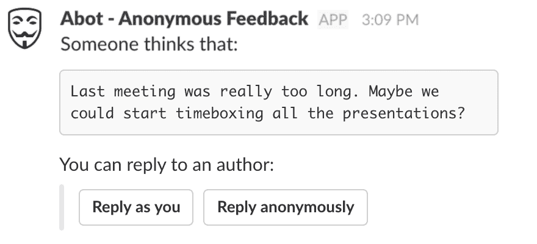
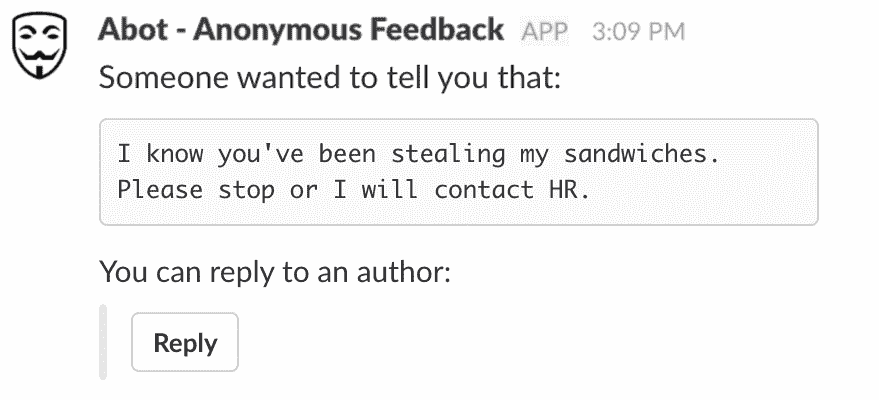
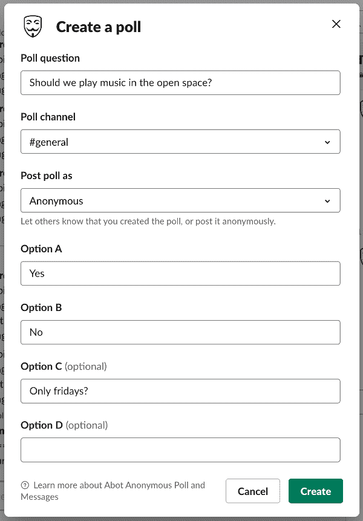
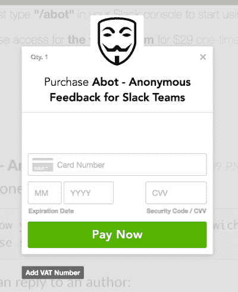
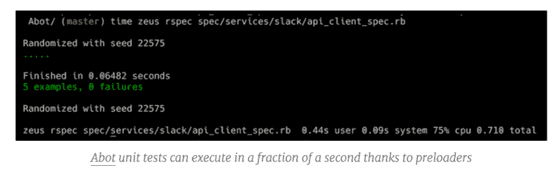
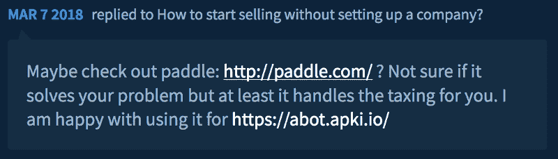
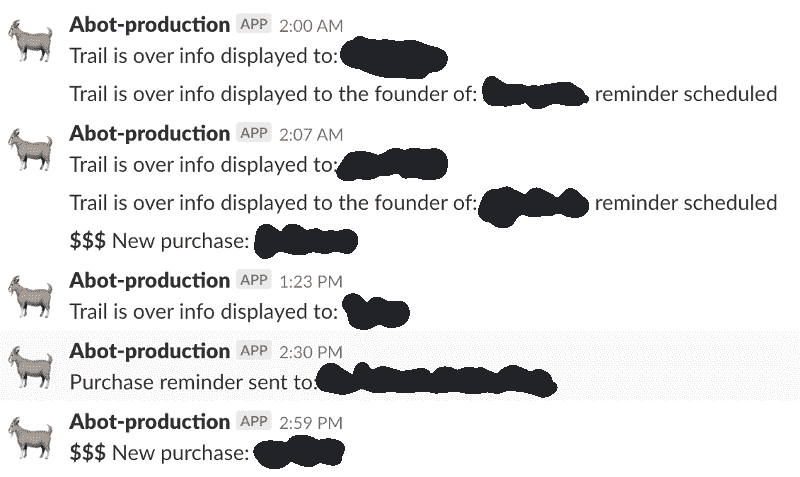
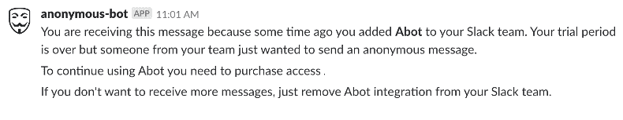

# 我如何在 Rails 中构建了一个盈利的 Slack 应用程序

> 原文：<https://pawelurbanek.com/profitable-slack-bot-rails?utm_source=wanqu.co&utm_campaign=Wanqu+Daily&utm_medium=website>

我已经用 Ruby on Rails 构建了一个松散的匿名消息传递机器人，它是有利可图的。在这篇博文中，我将描述我在创建、推广和货币化一个简单的 SAAS 产品时所做的工作和使用的工具。

作为一名专业的 web 开发人员，您通常会处理包含大量业务逻辑的大型项目。如果不完全独立，你几乎不可能在业余时间创作出类似的复杂作品。

我想做一些简单但仍能为用户提供真正价值的东西。

关于的[的故事来了。](https://abot.app)

## 目的和起源

Abot 允许你向渠道和你的 Slack 团队的其他成员发送匿名反馈信息。无论谁收到消息，都可以在不知道作者是谁的情况下回复作者。它基本上可以让你和你的队友交谈，而不知道你在和谁交谈。

在不得不参加又一场没完没了的公司会议后，我想到了一个主意。我有一种感觉，每个人都知道这是在浪费我们的时间，但没有人想第一个说出来。

行动中的 Abot

此外，您可以使用 Abot 创建投票，并在您的团队中匿名讨论。

## 运行成本

### 服务器基础设施

到目前为止，已经有超过 400 个 Slack 团队注册，用户总数超过 5 万。即使是最活跃的团队每天也最多发送几十条消息，所以服务器负载是最小的。我设法在每月 20 美元的数字海洋 VPS 上运行 web 服务器和后台工作进程。

### 支付提供商

我使用 [Paddle](https://paddle.com/) 作为我的支付提供商。我从[布伦特里支付](https://www.braintreepayments.com/)开始，但由于一些税法，我遇到了法律问题。

Paddle 从每笔销售中抽取 5% + 0.50 美元的提成，但也要处理税收，所以对我来说，这是非常值得的。有了布伦特里，我不得不自己处理发票和税务。

它还提供了一个完美的结帐过程，并且非常容易编程实现。只有几行 JavaScript 和一个 HTTP webhook 处理程序。

Paddle 检验流程

### 领域

Abot 位于 [abot.apki.io](https://abot.app) 上。它与我的一些其他应用程序共享一个根域:

[selfcontrol.apki.io](https://selfcontrol.apki.io)

[wishlist.apki .我](https://wishlist.apki.io)

*【更新:项目已移至[abot . app](https://abot.app)*

其中一些也是有利可图的，所以根域名的年度更新费用是分摊的。

### Abot 依赖的其他付费服务

Abot logo 只是 [Icons8](https://icons8.com/) 中的一个图标。我必须每月支付 19.90 美元的许可费，但我也为我的其他商业应用程序使用更多的图标。

语法上同。我用它来修改我的博客帖子和所有应用程序。声明:我正在参加 Grammarly 联盟计划，但我还是会推荐它。

投入几十个小时的工作来创建一个项目，最后在登录页面上出现一堆语法错误和打字错误，这是应该避免的。

很长一段时间，注册的唯一来源是一个官方的 Slack 应用程序目录。

直到最近，我才开始寻找新的用户来源。我不得不承认我没有正确地跟踪访问者和注册来源，所以我只能假设我提到的技术有最好的效果。

### 谷歌有机流量

我已经针对几个关键词优化了 Abot 登陆页面 SEO，但是目前，只有很少的访问者来自有机搜索结果。

我的博客每天都有几百名访客。我已经决定利用它来促销。我写的大多是技术文章，所以这是一个很好的机会来提一下:

[Abot](https://abot.app)

技术博客帖子中的参考

没有`nofollow`属性的反向链接也是提高目标网站 SEO 的一种行之有效的方法，但我不确定来自同一个域的多个链接是否有增加的效果。

对于在我的博客上放太多广告，我有一种复杂的感觉，但我想一个小链接不会伤害任何人。我可以保证永远不会有全屏订阅弹出窗口。

### “垃圾”讨论

这也是我最近才开始做的事情。每当我遇到需要提交 Abot 登录页面链接的讨论时，我都会这样做。这可能是 Reddit 的一个帖子，或者是独立黑客的一个讨论。

显然，我尽量不发垃圾邮件，只是让人们知道当讨论上下文相关时，项目是存在的。

独立黑客讨论中提到的一个例子

与我自己的反向链接相反，评论中的链接总是有一个`nofollow`属性，所以它们不会直接提高 SEO 评分。

## 动机

我知道一些初创公司在办公室里有精美的屏幕，显示当前产品使用情况的实时统计数据。我有我的时差通知:

每日一剂的激励

我开始用它们来调试预定的任务，确保事情正常运行。我通常会在一段时间后禁用其中的大部分。

无论何时有人购买或有十个新注册，立即知道总是好的。这是一个让我在下班后继续开发项目的好方法，即使是在工作了一整天之后。

### 购买提醒

上图中的购买提醒是一个能够很好地转化为销售额的功能。每当有人在试用期后试图使用 Abot，他和设置集成的用户都会收到一条友好的 Slack 消息，要求他们进行购买。两天后，创始人又收到一条提醒 Abot 的消息。

团队可以在任何时候通过移除集成来禁用它。

购买提醒在起作用

## 经常收入

我不会透露确切的数字。我只会说上个月有几百美元。目前，新注册和付费团队的数量正在稳步增长。

加上最低的基础设施成本，我提到它每月带来可观的被动收入，几乎不需要维护。

相反，我之前的 Slack bot [Tracky(不再维护)](https://tracky.apki.io)在他 3 年的生命中总共赚了 324 美元。它的运营成本超过 20 美元/月，所以对我来说是净亏损。

Tracky 并不是我做过的最赚钱的应用。

## 未来计划

### 隐私和条款

自从我开始从事这个项目以来，用户隐私和数据一直是我的头等大事。随着新的 GDPR 法律即将生效，我将不得不调整隐私条款以及如何处理数据以适应新的规定。

### 新功能

我知道对于一些团队来说，让每个人都能发送不可追踪的匿名消息的工具可能太锋利了。我刚刚完成了一个新功能，这是 Slack 团队管理员可以选择限制 Abot 使用方式的一种方式。

这将是一个设置面板，管理员可以将 Abot 使用的频道列入白名单，或者选择性地禁用直接匿名消息。

**【更新】** *这些设置已经添加到 Abot 中。*

这个想法来自一个 Abot 客户:

> 我们使用 Abot 和一个单独的 Slack 频道来匿名羞辱员工，以保持他们工作区域的清洁。那些害羞的人需要带甜甜圈来！既然甜甜圈上线了，就鼓励大家参与进来。猜猜谁羞辱了谁，这很有趣。

## 摘要

不得不承认，我有点沉迷于创作副业。在过去的几年里，我一直避免全职工作，以便有更多的时间陪伴他们，而不至于完全失去生活。

能够将一个兼职项目货币化，并从快乐的用户那里获得积极的反馈，这是一种很棒的感觉。我花了 3 年多的时间，在业余时间有规律地做自己的工作，达到了从中获得一些实际利润的阶段。

我希望在接下来的几个月里扩大用户群。可能会有更多的团队需要一些匿名的诚实。

*【更新】*项目还在生龙活虎。查看这些帖子，了解它达到了 [1 万美元](/side-project-profit)和 [5 万美元](/anonymous-slack-bot-income)总利润的里程碑。

