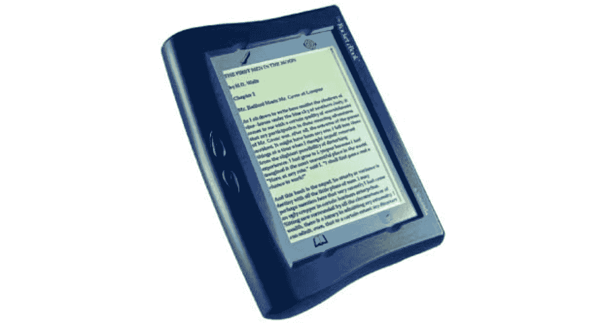
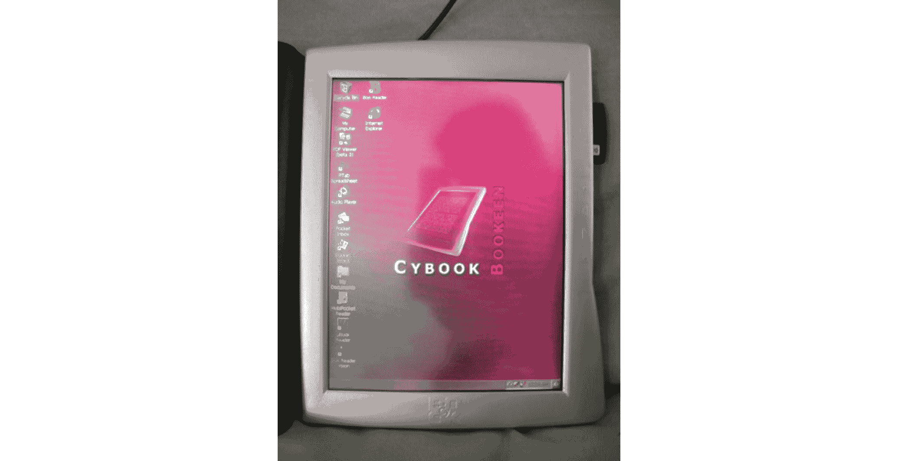
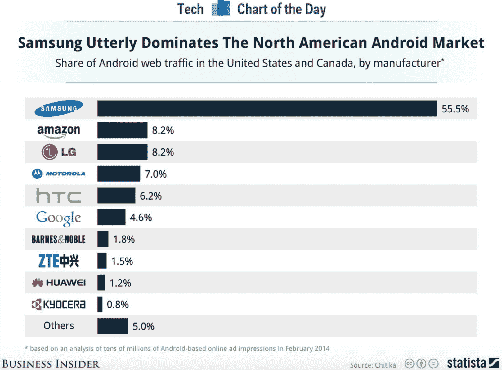
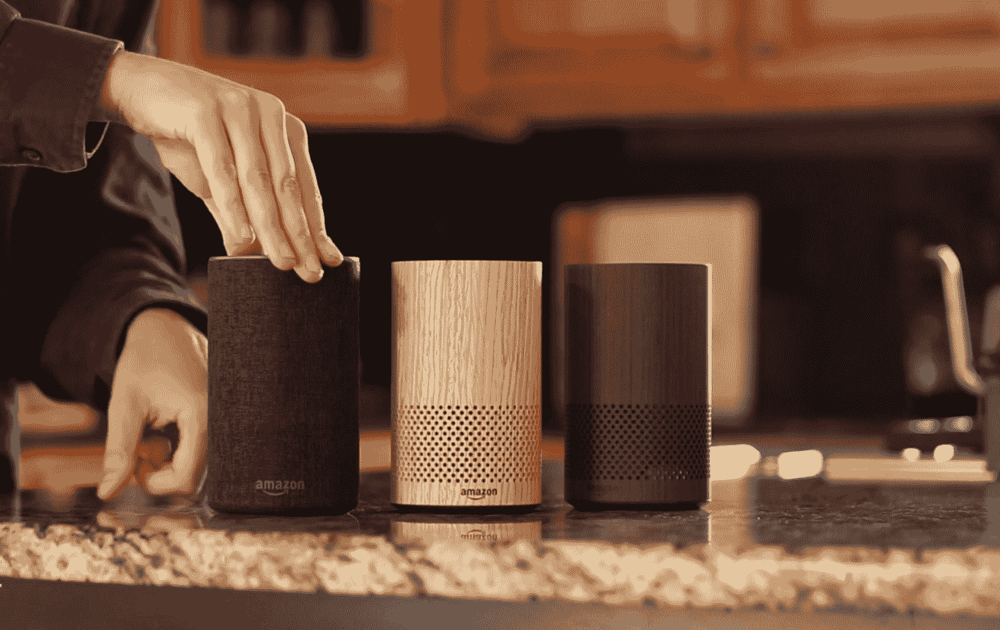

# 亚马逊下一步会建什么？产品习惯

> 原文：<https://producthabits.com/what-will-amazon-build-next/?utm_source=wanqu.co&utm_campaign=Wanqu+Daily&utm_medium=website>

# 亚马逊下一步会建什么？

只有一家公司足够疯狂，能够接受一个受到全球所有年龄和背景的人喜爱的百年产品:亚马逊。

也只有一家公司能够真正做到这一点:亚马逊。

这家亚马逊公司不断推出超越市场的畅销产品，即使形势对他们不利。例如，多年来，索尼(Sony)和 SoftBook 等消费设备公司一直在努力争取藏书家加入电子阅读器的行列。然后亚马逊步入市场，成功销售了一款 399 美元的数字阅读设备。

然后，在矩形触摸屏占主导地位的世界里，亚马逊推出了一款圆柱形的声控智能设备，但没有明确的使用案例。现在 Alexa 是一个家喻户晓的名字，受到全世界人民的喜爱。

亚马逊的项目总是处于当前消费技术领域的前沿。他们突破界限，市场通常会大范围地跟随。该公司报告 2017 年净收入为 1778.7 亿美元。虽然他们的大部分收入仍然来自在线零售产品销售，但 Kindle 和 Echo 等产品已经将亚马逊变成了一个科技超级大国，并为亚马逊塑造消费者科技互动的未来铺平了道路。

他们打造大满贯产品的部分能力是他们著名的以客户为中心的思维模式。但不仅仅如此。亚马逊成功的关键在于他们能够提供介于顾客所说的他们想要的和他们还不知道要的之间的产品。

找到这个最佳点意味着大量的研究、迭代和偶尔的彻底失败。但只要亚马逊在尝试和测试想法，他们就能更多地了解用户想要什么，以及如何预测接下来会发生什么。这是至关重要的信息。

关于亚马逊如何成为电子商务巨头*和*技术领导者，有太多的话要说。但是，亚马逊用来制造和营销消费科技产品的流程对其他创业公司来说更重要。凭借 Kindle 和 Echo——两者都是非常不同的产品——亚马逊能够接管全新的产品类别并赢得市场的心。为了更深入地了解他们是如何做到这一点的，我们来分析一下:

*   亚马逊如何如此成功地将“模拟的最后堡垒”数字化，以至于 Kindle 变得比他们想象的更受欢迎
*   近年来，亚马逊如何将重点转移到另一个巨大的前沿领域:利用 Echo 和 Alexa 技术将家庭数字化

让我们深入了解亚马逊背后的炒作，了解他们如何推出一个又一个产品，早期的批评者有时会讨厌这些产品，但数千万用户最终会喜欢。

## 2004-2014:亚马逊将“模拟的最后堡垒”——书——数字化

“这本书被证明是一个不可思议的装置。”**——杰夫·贝索斯**T3】

这本书从来不需要更新。亚马逊不需要开发电子阅读器就能成为一家成功的公司。但 Kindle 是该公司过去十年增长的关键之一，因为它证明了亚马逊可以制造出伟大的消费产品。

销售书籍是亚马逊开始电子商务的一个很好的方式。1994 年，贝佐斯创建了亚马逊，因为他相信互联网是卖书的好地方。他看到了一个巨大的、可行的市场:书籍在世界各地都是标准化的，在你购买之前没有必要亲自去看一本书。亚马逊在互联网上提出了自己的主张，他们很快成为领先的在线图书零售商。

然后在 1998 年，亚马逊做出了一个举动，永远改变了电子商务的进程:[他们购买了一个名为 Junglee Corporation 的在线购物服务](http://www.nytimes.com/1998/08/05/business/amazoncom-is-expanding-beyond-books.html)，帮助人们在线购买衣服、家居用品、电子产品和各种产品。亚马逊开始销售的不仅仅是书籍，他们开始销售一切。

到 2004 年，这家在线图书供应商已经成为一个巨大的电子商务平台，年收入接近 70 亿美元。亚马逊也正在成为互联网的支柱:[2006 年，他们发布了 AWS](https://hitenism.com/amazon-working-backwards/) ，让开发者更容易、更快、更便宜地建立网站。该公司发展迅速:2007 年，他们在三年内将 ARR 翻了一番，超过 140 亿美元。

当亚马逊在 2004-2007 年间开始开发电子书时，他们并没有试图找到自己的定位。该公司已经成立 10 年了，从许多不同的标准来看都是成功的。但此时此刻，这家领先的电子商务平台和重要开发工具提供商决定他们的下一个大动作是创建一个电子阅读器。

在外人看来，这似乎是一家电子商务公司的奇怪举动——更奇怪的决定，因为电子阅读器市场并不看好。模拟书已经做到了读者想要的一切，科技史上也不乏试图改变他们想法的失败案例。

NuvoMedia 的火箭电子书。[ [来源](https://wordservewatercooler.com/2012/07/13/a-brief-history-of-e-publishing-the-rise-and-fall-of-the-rocket-ebook/)

Cytale 和后来的 Bookeen 的 Cybook。[ [来源](https://en.wikipedia.org/wiki/E-book#/media/File:Cybook_gen1.jpeg)

这些早期的电子阅读器都有明显的问题——它们很重，屏幕看起来像电脑而不是页面，而且它们没有太多的电子书可供读者选择。这些只是首批上市的电子阅读器如 Rocket eBook 和 Reader by SoftBook 没有成功的几个原因。尽管如此，贝佐斯知道，人们想要电子阅读器只是时间问题，因为到 2000 年代中期，许多其他形式的内容已经成功数字化。

*“音乐和视频早就数字化了，简写阅读也数字化了，从早期的 Web 开始。但长篇阅读真的没有。”**–****杰夫·贝索斯，2007 年***

亚马逊已经锁定了在线图书市场——电子图书是一种自然的扩张。如果做得好，亚马逊有潜力赢得一个未被征服的市场。

到 2006 年，其他公司也接近了。索尼在那一年推出了他们的电子阅读器，这是对以前的数字阅读设备的巨大改进，因为它更薄，更轻，并且有一种新的“数字墨水”，阅读起来更像纸而不是电脑屏幕。人们实际上很喜欢它。

索尼电子阅读器的主要问题是它仍然没有太多的电子书选择。索尼无法让出版商同意提供他们书籍的电子版。

这是亚马逊可以介入并取得进展的地方。亚马逊已经与大型出版商建立了牢固的关系。他们深刻理解出版商想要什么。从这里，亚马逊能够重新配置电子书的分销和利润，将它们变成对出版商有吸引力的选择。

“如果你要做这样的事情，你必须在很多方面和书一样好。但我们也要寻找普通书做不到的东西。”**——杰夫·贝索斯**T3】

在出版商的合作下，亚马逊可以在一台设备上向读者提供比以往任何时候都多的电子书。这就是亚马逊如何能够确保 Kindle 确实是图书的更新。该产品让读者几乎可以将整个图书馆掌握在手中。

一旦他们有了概念，他们就不断地在设备上迭代，以提供一个能引起市场共鸣的产品。这个过程是这样的:

2004 年:杰夫·贝索斯和全球数字媒体高级副总裁史蒂文·凯塞尔开始讨论制作一款电子阅读器。杰夫·贝索斯个人对这个想法很感兴趣，这似乎是亚马逊现有图书电子商务业务的自然延伸。他们聘请了一位名叫 Jateen Parekh 的系统工程师和 Palm Computing 的前硬件工程副总裁 Gregg Zehr。Parekh 和 Zehr [创办了 Lab126](https://www.forbes.com/sites/stevedenning/2011/09/30/how-amazon-created-the-kindle-fire-part-11/#7ea4f5df1ad8) ，这是亚马逊旗下的一个研究实验室，将孵化几个新项目。随着他们开始做研究，该团队意识到电子阅读器市场没有明确的赢家，并看到了一个机会。他们开始基于贝佐斯的愿景开发 Kindle 的早期版本。[除了许多产品愿景和功能需求，他的第一要求](https://www.forbes.com/sites/stevedenning/2011/09/30/how-amazon-created-the-kindle-fire-part-11/#7ea4f5df1ad8)是，“让它非常简单易用。”

**2007:** 开发用了三年，过程中出了很多问题。原有的技术很复杂，而且获取某些部件还存在法律问题。最大的挑战是:使设备能够在任何地方连接互联网，而不需要 WiFi。经过漫长的开发过程，亚马逊终于在秋季发布了 Kindle。

Kindle 的第一个版本重 10.3 盎司，与平装本的形状和大小差不多。在设备需要充电之前，用户可以阅读 30 小时。Kindle 还可以容纳几个图书馆的书籍，允许读者改变字体大小，并有在书中查找单词和短语的搜索选项。一项名为 Whispernet 的无线服务让用户可以在没有 WiFi 或不付费的情况下下载书籍。这是一个永远在线的设备，就像一本真正的书。

Kindle 售价 399 美元——与其他电子阅读器相比很高——几个小时内就销售一空。这立即在市场上引起了巨大的轰动。它解决了该团队所知的所有关于电子阅读器的痛点。它还为读者提供了他们甚至不知道他们可以要求的东西，比如一台设备上的整个图书馆。

2009 年:在 Kindle 上持续销售一年半之后，亚马逊在 2009 年 2 月发布了第二版。他们已经获得了用户对他们可以做出的改进的反馈，Kindle 2 是那些[小调整](https://techcrunch.com/2009/02/09/whats-new-with-the-kindle-2/)的组合。它的设计更好，更对称，翻页速度更快，存储空间更大，还可以用新的语音功能为你朗读。售价 359 美元，比原版略便宜。

与第一版相比，这并不是一个巨大的升级，但 Kindle 2 获得了很好的评论，卖得很好。人们评论说，他们开始看到 Kindles”

[in the wild](http://www.businessinsider.com/10-things-we-love-and-hate-about-amazons-kindle-2-2009-3)

“随着它们变得越来越主流。

同年 6 月，亚马逊发布了另一个版本的 Kindle:Kindle DX。这个版本更大，为 9.7 英寸。除了改进的技术规格、内存和存储，Kindle DX 还向前迈进了一步，因为它支持带有原生 PDF 阅读器的 PDF 文件。这一点，加上更大的屏幕，对于贝佐斯的愿景非常重要，即 Kindle 有一天将用于烹饪书、杂志和报纸等出版物，而不仅仅是长篇书籍。

**2010:**

亚马逊发布了他们的 Kindle 3。最大的变化是这个版本是用 graphite 发布的。这是为了改善用户的阅读体验。Lab126 的设计副总裁克里斯·格林(Chris Green)说，更暗的设备创造了更好的对比度，因为电子墨水屏幕本身是灰色的，而不是白色的。深灰色的正文使得黑色的文本更加突出页面的其余部分。

关于 Kindle 3 的新闻

[leaked to the press early](http://firstround.com/review/my-launch-lessons-from-37-minutes-in-an-amazon-war-room/)

，但亚马逊决定在他们完全准备好推出之前运行它，以便利用炒作。然而，在做出这个决定之前，亚马逊团队一丝不苟地计划了他们预期推出的每一个细节。这只是一个例子，说明该公司如何密切关注他们的买家，并因此形成了一个成功的产品和营销战略。

当年晚些时候，亚马逊推出了网络版 Kindle。现在，人们可以在没有 Kindle 设备或亚马逊账户的情况下，在浏览器中阅读免费的书籍样本。这对寻找书籍的网上购物者真的很有帮助，因为他们可以免费试用前几页。它改善了亚马逊的在线购书体验，并将 Kindle 用户的体验与在线购物者的体验更直接地联系在一起。

**2011:**

亚马逊今年发布了一系列新产品。在今年的第一个版本 Kindle 4 中，亚马逊对他们的电子阅读器做了一些重要的设计和营销上的改变。他们移除了键盘，并在屏幕上添加了四个物理按钮和一个光标垫以及一个键盘。他们还取消了一些功能，如音频插孔，这帮助他们将价格降到了迄今为止的最低点——广告支持版本为 79 美元，普通型号为 109 美元。

今年，亚马逊也开始非常关注市场对竞争的反应。例如，前一年苹果发布了他们的 iPad，条款规定第三方应用程序无法从应用程序链接到他们自己的商店。作为回应，亚马逊发布了 Kindle 云阅读器，这是一款基于网络的电子阅读器，允许用户从云中下载书籍，在任何地方阅读——甚至在 iPad 上。

对 iPad 和市场对触摸屏日益增长的兴趣的另一个竞争回应是 Kindle Touch。2011 年 9 月发布的新版 Kindle 没有任何物理按键，而是全触屏，起价 99 美元。

仅仅两个月后的 11 月，亚马逊对苹果发起了又一轮竞争，发布了 Kindle Fire。这是一个主要的产品支点。Fire 不仅仅是一款电子阅读器，它还是一款成熟的平板电脑，拥有音乐、视频、应用、网页浏览和电子邮件等功能。Kindle Fire 没有以前型号的灰度显示屏，而是全彩色液晶显示屏。

用户非常喜欢这种类似平板电脑的功能，以至于在几年内，亚马逊就成为了安卓网络流量份额最高的智能手机制造商之一，尽管他们还没有制造出智能手机。

得益于 Kindle Fire 平板电脑系列，亚马逊的安卓网络流量仅次于三星。[ [来源](http://www.businessinsider.com/amazon-kindle-web-traffic-2014-3)

**2012-2013:**

2012 年，亚马逊推出了 Kindle 的下一个版本:Kindle Paperwhite。价格

[started at $119](https://www.theverge.com/2012/9/30/3433110/amazon-kindle-paperwhite-review)

只有 WiFi 的型号，配备 3G 的型号价格从 179 美元不等。与之前的 Kindle 机型相比，最大的升级是一个可调节的内置灯，允许读者在黑暗中使用设备，而无需额外的灯。尽管电子墨水屏幕在室外阅读时不会产生眩光是有用的，但缺点是读者需要额外的光线才能在黑暗中阅读(就像实体书一样)。通过这种方式，Paperwhite 作为一种设备对这本书做了另一个微妙但重要的改进。

Paperwhite 的设计与 Kindle Fire 非常相似，尽管 Paperwhite 的分辨率比任何其他 Kindle 型号都更高、更清晰，使文字和图像更加清晰。总的来说，亚马逊优先考虑读者的舒适度和易用性，这一点得到了回报。

[One reviewer said](https://www.theverge.com/2012/9/30/3433110/amazon-kindle-paperwhite-review)

“[paper white]可能是我用过的最舒适的电子阅读器。”

2013 年，亚马逊改进了这款设备，发布了 Paperwhite 2，它“[更好更快](https://www.cnet.com/products/amazon-kindle-paperwhite-2013/review/)”，改进之处包括更灵敏的触摸屏、更快的处理器、更白更亮的灯。

2014 年:亚马逊 Kindle 的价格开始非常高，随着不同型号的产品，价格逐渐下降。2014 年 10 月，亚马逊发布了迄今为止价格最低、最精简的型号——第七代 Kindle。这款机型的基本版售价为 79 美元，其中包括广告。用户抱怨说，这款设备的设计比以前的型号更笨重，拿起来也不舒服。但第七代确实成功地以低得多的价格抓住了一个全新的电子阅读器用户市场。它使得在设备上阅读比以往任何时候都更容易。

同月，亚马逊也反其道而行之，占领了一个完全不同的市场。他们发布了一款名为 Kindle Voyage 的新版 Kindle。这是迄今为止该设备的最佳版本，具有更清晰的显示屏(300PPI 的分辨率，远高于任何其他 Kindle)，齐平的设计使清洁和运输变得非常容易，以及根据环境照明自动调整的环境背光传感器。用户毫不怀疑这是一款令人惊叹的电子阅读器，创造了美好的阅读体验，但高昂的价格(在美国发布时为 219 美元)让许多客户望而却步。

尽管如此，Kindle Voyage 证明了亚马逊已经实现了他们的目标，将图书作为一种设备进行改进。他们达到了设计的顶峰。一位评论家评论说，通过 Voyage，“亚马逊创造了一种电子阅读器，感觉比你扔进包里的东西更有设计感，希望不会坏掉。”

意识到设计和用户体验的重要性是亚马逊产品开发过程的关键。这是亚马逊成功的一个重要因素，让他们从其他电子阅读器公司中脱颖而出。最重要的是，他们把书当作一种工具来尊重。Lab126 的设计副总裁克里斯·格林(Chris Green)说，该团队知道“我们永远不可能比纸张更好，但我们可以同样引人注目。”这种心态有助于团队优先考虑 UX 和用户需求，创造美好的阅读体验，并在一个没有人成功做到这一点的市场中将读者转化为用户。

一路上的重要基准证实了他们的成功。例如，2011 年，电子书在亚马逊上的销量超过了纸质书。就连杰夫·贝索斯也对他们的电子书如此成功——如此迅速——感到惊讶。

我们对这一天的到来抱有很高的期望，但我们从未想到它会来得这么快。我们卖纸质书已经 15 年了，卖 Kindle 书还不到 4 年。”**——杰夫·贝索斯**T3】

更多的数字证实了这一成功。根据福布斯的数据，亚马逊在 2013 年售出了大约 2000 万台 Kindle 设备，带来了大约 39 亿美元的收入。

但是 Kindle 的成功不仅仅在于设计和技术规格。亚马逊在幕后做了很多改变，为 Kindle 的成功搭建了脚手架。例如，他们必须改变与图书出版商的互动方式，以便首先让电子书成为一个有吸引力的想法。亚马逊[让 Kindle 变得封闭和专有](https://www.fastcodesign.com/1669160/how-the-kindle-stomped-sony-or-why-good-solutions-beat-great-products)并禁止共享选项，这让发行权回到了出版商手中，而不是用户手中。为了刺激销售，他们还承诺短期牺牲电子书利润的一部分，把它们踢回给出版商。

出版商并不是整个生态系统中最有利可图的环节，但亚马逊认识到了他们决定电子书崛起与否的力量。这对贝佐斯至关重要:做出牺牲短期利润的决策，以优先考虑长期可持续性。贝佐斯对电子书亏损没什么意见。他说，“我们在低利润和高销量销售方面有很多经验——你只需要确保(打折商品和高价商品之间的)组合行得通。”

正确的意识形态(优先考虑客户，并承受短期损失以迎合出版商)和执行(不断迭代)之间的甜蜜点帮助 Kindle 比亚马逊想象的更受欢迎。但下一个挑战是看看他们是否会重现这一成功，并制造出另一种消费产品。

## 2014 年至今:亚马逊将重心转移到数字化的下一个前沿领域——家

“我们想成为一家大公司，同时也是一台发明机器。”**——杰夫·贝索斯，致投资者的信**T3】

在亚马逊的 Lab126 中，Kindle 被称为另一个名字:Project A。亚马逊的下一个大热门是 Project D。

Kindle 是亚马逊首次涉足产品开发。它的成功证明，即使亚马逊是一家电子商务公司，他们也可以制造人们喜爱的消费设备。他们对 Kindle 赞不绝口，并开始着手其他几个项目。他们最近的工作完全改变了人们今天使用技术的方式，并为消费者创造了一个全新的计算平台。

不幸的是，他们必须先三振几次。贝佐斯在给投资者的信中写道，“失败和创新是不可分割的双胞胎。”亚马逊在 2014 年试图发布 Project B(Fire Phone)时就吸取了这个惨痛的教训。

电话一片混乱。它没有比 iPhone 更好的设计，但 199 美元的售价使其成为直接竞争对手。它有很多有趣的功能，但没有什么能吸引用户从他们原有的手机上切换过来。

[One reviewer said](https://www.wired.com/2015/01/amazon-fire-phone-always-going-fail/)

，“真正需要亚马逊手机的，只有亚马逊。”

这款手机明显背离了亚马逊的第一要务:把顾客放在第一位。相反，贝佐斯试图与苹果和谷歌竞争，做出一些“酷”的东西，但彻底失败了。亚马逊在电话上损失了 1 . 7 亿美元，在 Lab126 上受到了更大的打击。

幸运的是，在实验室里，独立的团队从事不同的项目。当一个团队在构建 Fire Phone 时，另一个团队正在进行项目 c。这个项目更加神秘，因为它从未进入市场。关于他们在做什么的唯一线索来自于 2010-2011 年与 Lab126 员工相关的一些增强现实专利。人们猜测亚马逊试图用 AR 打造一款家用设备。这个项目可能太昂贵，或者太困难，或者太疯狂——但是它被放弃了，也没有关于它的新闻发布。

相反，实验室 126 开始了项目 D 作为一个分支。由于项目 B 在到达时就夭折了，项目 C 甚至从未上市，亚马逊对项目 D 的开发有更严格的参数。它将专注于智能家居技术的一个方面——语音识别——并且将被设计成一种更简单、更便宜的消费设备。他们最初设想以 50 美元出售，以 17 美元制造。

为了帮助开发，亚马逊雇佣了语音识别公司 Nuance 的员工，并收购了语音识别初创公司 Yap 和 Evi。在开发设备的过程中，他们遇到了处理能力和响应延迟等技术问题，这使得产品的开发比他们预期的更加困难和昂贵。即使在开发中，[团队也不确定](https://www.bloomberg.com/features/2016-amazon-echo/)这款设备除了“智能音乐扬声器”之外还有什么用途相反，他们被贝佐斯的确定性所驱使。

“人们对这款设备的功能有着近乎不合理的期待。杰夫的愿景是完全融入购物体验的每一部分。**–lab 126 工程师**T3】

随着设备变得越来越复杂，发布不得不推迟。三年来，他们期望在六个月内发货。

该团队急于发布这个设备，他们称之为 Echo，由唤醒词“Alexa”激活。早在亚马逊之前，苹果和谷歌就已经在研究语音识别技术，而且显然更胜一筹。但主要的区别是，虽然苹果和谷歌主要使用语音识别来帮助智能手机的使用，但亚马逊没有这种选择，因为他们的手机从未起飞。相反，他们不得不用他们的语音识别技术做一些完全不同的事情。这是一个巨大的风险，但也是创造一个新类别并赢得市场的巨大机会，就像他们对 Kindle 所做的那样。

让我们仔细看看亚马逊如何发布 Echo，并在过去几年中对其进行迭代和扩展，以及他们如何改变人们未来与家庭设备交互的方式。

2014 年:11 月，亚马逊终于发布了他们的设备 Echo，以及语音识别技术 Alexa。它只对一小部分人发行。

回声是一个圆柱形的黑色装置，大约 9 英寸高，直径 3.25 英寸。与 Fire 手机不同，这不是一款山寨产品。尽管人们将 Alexa 比作 Siri，但通过 Echo 连接，Alexa 并没有被束缚在手机上。相反，它被设计成一种永远在线的技术，无论您在房间的哪个位置，它都可以听到您的声音并做出响应，因此听和说的体验将尽可能无缝。有可能

[filter out background noise](https://techcrunch.com/2014/11/06/amazon-echo/)

，包括音乐，来听到命令，随着时间的推移，它在识别命令方面变得更好。扬声器设备本身是一个高质量的 360 度声音投影，带有七个麦克风。用户可以收听广播电台、音乐、NPR、ESPN，当然还有对 Alexa 提问的回答。

**2015:** 亚马逊向公众发布了 Echo 和 Alexa。自去年以来，用户就一直在等待名单上，亚马逊通过使其如此独特而大肆宣传该设备。最后，在 6 月份，任何想要的人都可以花 179 美元买一台。早期用户对 Echo 及其在市场上的独特地位感到兴奋，因为没有其他设备与它完全一样。除了回答问题，它还可以很容易地与亚马逊的音乐和购物等其他服务结合起来。自 2014 年向仅限受邀群体发布以来，亚马逊也为该设备添加了更新。最大的新发展之一是 Alexa 将成为智能家居的枢纽。这个智能家居连接的想法直到 2014 年末才出现，但是[正如一位 Lab126 工程师所说的](https://www.bloomberg.com/features/2016-amazon-echo/)，这个想法是“一些(贝佐斯)开始积极地接受。”

当年晚些时候，亚马逊[发布了 Alexa Skills Kit (ASK)](https://developer.amazon.com/blogs/post/TxC2VHKFEIZ9SG/First-Alexa-Third-Party-Skills-Now-Available-for-Amazon-Echo) ，这是一套工具和自助式 API，允许第三方开发者为使用语音识别技术的 Alexa(或“技能”)构建应用程序。很快，开发者开始围绕从算命之类的游戏到数学智力题之类的教育应用开发自己的创意应用。

这帮助亚马逊开始围绕 Echo 建立一个生态系统，并使 Alexa 技术对客户越来越有用。

**2016:**10 月，亚马逊发布了 Echo dot，这实际上是 Echo 开发中的一个早期想法，被搁置以支持更大的 2014 版本。这个点是一个较小的，1.3 英寸高的冰球形状的设备，可以放在房子的周围，以接收其他房间的语音命令。

这个点比原来的回声更小更便宜。对于那些不想购买更昂贵设备的人来说，Dot 让客户更容易将 Alexa 的技术带入家中。对于已经拥有 Echo 的人来说，这是一个提升智能家居体验的简单交叉销售。客户喜欢 50 美元的价格点，也喜欢 Alexa 技术与更大版本的技术一样强大和实用。

同年，他们还发布了亚马逊 Tap，这是另一款支持 Alexa 的设备，旨在成为一款扬声器。它拥有比 Echo 更好的扬声器系统，音质更高。

在这一点上，Alexa 通过第三方应用程序拥有 500 项“技能”，可以作为 Nest、飞利浦、IFTTT 和 SmartThings 等品牌的智能家居设备的枢纽。虽然谷歌对 Alexa 的挑战者谷歌家庭设备几乎在同一时间发布，但亚马逊是第一个进入市场的，并支持更多的制造商和开发商。用户证明了他们有多喜欢它——亚马逊报告说他们已经卖出了

[over 3 million devices](https://www.bloomberg.com/features/2016-amazon-echo/)

，和回声

[sales doubled from 2015 to 2016](http://www.businessinsider.com/amazon-echo-sales-figures-stats-chart-2016-12)

。亚马逊在物联网领域已经远远领先于谷歌。

**2017:**

2017 年，亚马逊发布了第二代原版 Echo。这款设备比原来的更短，并且配有可互换的外壳，这样用户就可以改变外观。这是一个有趣的美学添加。它表明亚马逊承认 Echo 设备将成为用户家庭的一部分，既是技术也是装饰。

第二代 Echo 还具有改进的收听功能和一个 aux 插孔，允许用户将系统连接到外部扬声器。但对用户来说，最令人兴奋的变化是这款设备现在只有 99 美元。

Dot 继续大受顾客欢迎——尤其是打折的时候。在 2017 年的黑色星期五，它是亚马逊整体销售的前两个产品之一。

受 Dot 成功的鼓舞，亚马逊继续发布一系列支持 Alexa 的设备。今年 5 月，他们发布了 Echo Show，这是一款配有 7 英寸触摸屏的智能扬声器。人们喜欢它，并赞赏显示器只是为了补充 Alexa 的技术，而不是作为一个全功能的平板电脑。

他们还宣布了 Echo Look，这是一款适用于卧室或浴室的相机和免提造型助手。它可以对你的服装进行 360 度拍照，一个名为“风格检查”的功能可以告诉你这是不是一套“好”的服装。虽然这是一项有趣的技术，但一些用户和批评者评论说，这显然是亚马逊收集更多用户视觉数据的一种方式。

而且还不止于此。今年晚些时候，在一次惊喜活动中，亚马逊发布了 130 美元的 Echo Spot(一款支持视频通话的智能闹钟)、149 美元的 Echo Plus(官方称为智能家庭中枢)和 20 美元的 Echo Buttons(用于与其他 Alexa 设备一起玩游戏)。

通过这些设备，亚马逊继续让人们更容易将 Alexa 技术传播到家中的每个房间。尽管亚马逊最近得到了很多关于

[potential downsides](https://www.nytimes.com/2018/02/21/technology/amazon-alexa-world.html?mtrref=www.google.com)

为了传播他们的智能家居技术，支持 Alexa 的设备仍然非常受欢迎。亚马逊从不透露太多的销售数字，但他们评论说，去年假期顾客购买了“

[tens of millions](https://techcrunch.com/2017/11/28/amazon-sold-millions-of-alexa-devices-over-the-holiday-shopping-weekend/)

“Alexa 设备。

在某些方面，Alexa 的成功已经超过了 Kindle。通过 Alexa，亚马逊正在创建一个全新的技术平台，以及人们与技术互动的新方式。今年早些时候，[《纽约时报》写道](https://www.nytimes.com/2018/02/21/technology/amazon-alexa-world.html?mtrref=www.google.com)“Alexa 最有可能成为本十年第三大消费者计算平台——仅次于 iOS 和 Android，这是一种无处不在的计算服务，它为科技领域的其他事情奠定了基础。”事实上，它甚至为新的标准和期望铺平了道路。

*“五年后，我的回声会说，‘嘿，该去机场了。“要不要我给你弄辆车，”我就答应了。"**–弗雷斯特研究公司**分析师朱莉·阿斯克*

但在其他方面，Alexa 的发展反映了 Kindle 的发展。他们在不断迭代这两款产品——近年来，亚马逊继续发布新版 Kindle，如 Paperwhite 3 (2015)、高端 Kindle Oasis (2016)和 Kindle Oasis 2 (2017)。随着每个新版本的推出，技术越来越先进，用户体验越来越好，电子阅读器的标准也越来越高。

Kindle 和 Alexa 的成功也在很大程度上依赖于对客户的痴迷和对市场需求的了解。对于 Alexa，这是以小的方式发生的——例如，团队最初无法决定他们是否应该包括一个带有原始回声的遥控器。他们决定发布带有设备的遥控器，观察人们是否真的使用它。当他们发现它不受欢迎时，他们悄悄地把它从传出的回声中删除了。

但它也以巨大的方式发生。例如，亚马逊保留了一份客户对 Alexa 新技能建议的内部列表。他们根据受欢迎程度对它们进行排名，并使用列表来确定下一步应该发布什么功能。这是一种构建产品和发展功能的激进方式，并不适用于每家公司。

亚马逊的 Alexa 最有趣的一点是，它每周都在改进。客户已经开始期待持续的改进，而亚马逊做到了。他们在自己的品牌和市场之间建立了一定程度的信任，这让他们能够承担疯狂的风险，这让他们(有时)能够创造出将塑造未来科技的东西。

## 亚马逊的下一步是什么？

亚马逊的野心是无限的，这使得他们的轨迹完全不可预测。

亚马逊没有像许多 SaaS 初创公司那样的产品开发和扩张的线性进展。他们是一家在线图书销售商，后来成为电子商务平台，成为消费技术产品的领先创新者之一。还不完全清楚他们下一步要做什么。

但毫无疑问，亚马逊将继续试验和迭代，努力让伟大的想法变成现实。就像项目 B 和项目 C 一样，亚马逊可能会制造一些失败，甚至会想出一些疯狂的项目，以至于它们永远不会上市。我期待看到更多的试验和失败，这很令人兴奋，因为这意味着他们有一个我们作为消费者还看不到的愿景。

亚马逊接下来的大动作是完全分散的，在某些方面甚至看起来毫无关联。这正好说明了他们的势力范围有多广。以下是我认为亚马逊未来发展壮大的三种方式。

**1。智能送餐:** 2017 年对亚马逊来说是重要的一年，不仅仅是产品开发。今年 8 月，他们以 137 亿美元收购了全食超市。这是一个巨大的进步，给了他们创造最快、最便宜、最方便的食品配送服务的所有工具。亚马逊正在使用全食超市来拉近与消费者的距离——他们不再用 Prime 从仓库发货，而是让从两条街外的商店发货成为可能。这意味着顾客可以得到他们想要的东西——他们喜欢的食物，快速运送，而不必离开他们的家。

今年 2 月，他们朝着实现这一目标又迈进了一步，在美国四个城市为 Prime 会员推出了两小时免费送餐服务。随着他们使送货更快更方便，他们会给其他杂货店和食品公司施加压力，让他们也这样做。在未来，他们甚至可以将用户的送货偏好与智能家居设备同步，以创建一个自动下单和自动补货的冰箱。

**2。免费智能手机:**亚马逊从他们失败的手机中吸取了很多教训。他们试图在设计和价格上与 iPhone 竞争，但他们已经是智能手机市场的后来者。如果没有其他真正强大的价值主张，他们就没有机会。不过，亚马逊还有另一种竞争方式:非常低的价格。例如，他们的 Fire 平板电脑可以访问亚马逊的服务，但价格比 iPad 低得多。他们可以以相对较低的价格提供他们的手机——或者甚至作为免费福利提供，或者与另一种产品捆绑升级。

贝佐斯本人坚信效率优先于利润。如果亚马逊将他们的手机重新设想为一种低利润的方式，为用户带来一款袖珍亚马逊设备，他们将拥有更大的分销渠道，并实际上在智能手机市场上拥有一席之地。

**3。增强现实:【2017 年末，亚马逊在其 iOS 应用上宣布了一项新功能，让用户在家中或办公室中以三维方式可视化产品。这让他们在订购之前更好地了解一件物品在其环境中的实际样子。这项新功能是 AR 在购物体验中最引人注目的用例之一，看起来它真的可能[推动更多的购物收入](https://www.recode.net/2017/11/1/16592238/amazon-app-augmented-reality-ar-view-3d)。这是一个小的开始，但它可能会有很大的波澜。知道亚马逊在开发他们神秘的项目 C 期间有过 AR 计划，我们很可能会看到他们更多的 AR 创新，因为他们继续将它集成到购物和智能家居体验中。**

2015 年，一位《回声报》的评论员说:“对我来说，回声报把钢铁侠托尼·斯塔克的技术带到了你自己的房子里。”现在创新只是在加速。亚马逊很可能会成为让我们的科幻小说成真的公司。即使他们不这样做，建立未来新技术平台的公司也可能会在 AWS 上这样做。所以真的，亚马逊赢了。

## **向亚马逊学习的 3 条重要经验**

不是每个公司都会成为亚马逊。但这不是学习他们如何制造伟大产品的重点。

支撑亚马逊工作的许多原则都非常基本。贝佐斯在采访和给股东的信中公开谈论这些问题。它们不是像资本或媒体关注那样的东西——尽管它们有所帮助。比如保持第一天的心态，或者把每一天都当作公司旅程的开始。并非所有适用于亚马逊的原则都会适用于其他公司。但是如果创业公司能够识别翻译得最好的，他们就可以为产品开发建立同样强大的基础。

以下是初创公司可以从亚马逊产品开发原则中学到的三个关键经验:

### 1.向后工作

亚马逊总是试图更多地了解他们的客户。他们在这方面付出了如此大的努力，以至于他们的最新产品，如 Echo、Spot 和 Look，都因监视顾客而受到批评。

从消费者的角度来看，这可能令人不安，但从产品开发的角度来看，这是天才之举。用户研究不只是帮助他们个性化你的购物体验或记住你的音乐偏好。这也有助于他们了解你的使用模式，你的习惯，你喜欢什么样的设备，以及最终你下一步想买什么样的产品。

对任何公司来说，拥有一个基于客户研究的强大产品愿景都是非常重要的。在使用分析工具和与客户交谈时，保持客户总是不满意的心态。不断探索问题，看看哪里有缺点，想象他们下一步想要什么。

这就是你如何获得那个臭名昭著的算命技巧的方法:[在顾客想要什么之前知道他们想要什么](https://www.amazon.com/p/feature/z6o9g6sysxur57t)。

### 2.专注于你知道你能赢的地方

无论你是亚马逊还是单人创业，你都要知道自己是谁，明确自己的优势。当你不明白哪里可以赢的时候，那就是你会搞砸的时候。

亚马逊搞砸了他们的 Fire Phone，因为这显然不是一个他们能赢的市场，但他们还是试图去那里。这最终是一个非常昂贵的决定。

另一方面，他们知道他们可以在电子阅读器市场上获胜，因为还没有人征服它。同样，由于他们无法将语音识别技术用于虚拟智能手机助手，他们转向了还没有人去的地方:家。

如果你是一家成长中的公司，你需要定义你能和你的团队以及你的客户一起成功的地方。在内部，它创造了一个更集中的愿景和更强的士气。但同样重要的是，要确保你对外部世界的信息和营销与你的内部愿景保持一致。与你的客户保持经常性的沟通，诚实地告诉他们你的产品意图。通过建立一致的信息和沟通渠道，当你搞砸了，他们更有可能原谅你。

### 3.如果他们赢了，接受损失也没关系

亚马逊的核心商业原则之一是效率高于利润。比起在特定产品上赚钱，他们更感兴趣的是与客户建立长期直接的关系。更一般地说，这意味着长期思考，这对任何规模的公司都很重要。

亚马逊在各个层面都将此作为优先事项。他们在做出制造特定产品的决策时会这样做。例如，当团队第一次想象 Echo 时，他们相信他们会以 50 美元的价格获得 33 美元的利润。到产品上市时，团队认为它需要的一切都很棒，亚马逊在 150 美元的价位上亏损了。但他们相信，Echo 将帮助他们赢得一个新的市场，并为一个新的智能家居生态系统创造立足点。这是值得的。

他们也在更大的范围内这样做。贝佐斯承认 Fire Phone 整体上的失败是其他伟大产品成功开发的必要条件。

回过头来看，我做了一些短期决定(比如取消疯狂鸡蛋的免费计划)，这些决定在当时帮助提高了收入，但可能阻碍了公司的发展。财务状况对一家早期公司很重要，但同时你不能为了短期收入而牺牲长期增长。当你做出重大的产品开发或定价决策时，考虑 1 年、2 年和 5 年的影响。缩小范围有助于你优先考虑那些让你的企业长期发展的事情。

## 我们会很快生活在亚马逊的世界里吗？

科技行业内外的人都喜欢猜测亚马逊的影响力会增长到什么程度。答案并不完全清楚。但事实上，他们甚至要求证明了该公司已经走了多远。

就在 10 多年前，亚马逊还是一个电商平台。现在，他们被认为是苹果和谷歌中正在塑造消费者与技术互动方式的科技巨头之一。光是这条轨迹就显示了他们产品开发过程的力量。凭借两款互不相关的消费者产品 Kindle 和 Echo，亚马逊成为了消费者世界的一个有形部分，并继续将产品塑造成人们真正想要的样子。我很期待他们接下来会做什么。