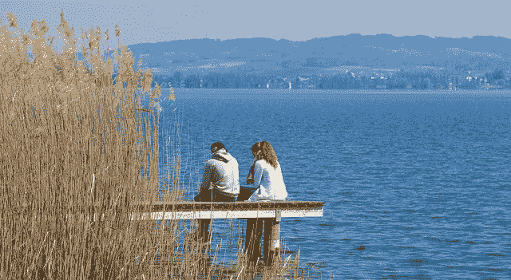

# 模拟社交媒体——研究黑客——Cal Newport

> 原文：<http://calnewport.com/blog/2018/03/28/on-analog-social-media/?utm_source=wanqu.co&utm_campaign=Wanqu+Daily&utm_medium=website>

# 在模拟社交媒体上

<small>March 28th, 2018 · [73 comments](https://www.calnewport.com/blog/2018/03/28/on-analog-social-media/#comments)</small>

**分离器实验**

2017 年末，作为我正在写的一本关于[数字极简主义](https://calnewport.com/blog/2016/12/18/on-digital-minimalism/)的书的研究的一部分，我邀请我的邮件列表订户参加一项我称为*数字整理器*的实验。

这个想法很简单。在 2018 年 1 月期间，参与者将暂停他们生活中的“可选技术”，特别是社交媒体。在 31 天的期限结束时，参与者将从一张白纸开始重建他们的数字生活——只允许回到他们能够提供令人信服的动机的技术。

我预计大约有 40-50 人会同意参加这个公认的破坏性练习。

我的猜测是错误的。

1600 多人报名。当《纽约时报》和《T2》写了一篇关于这个实验的好文章时，我们甚至受到了全国的关注。

自一月份以来，我一直在阅读数百份参与者发给我的关于他们使用数字清理器的体验的报告。我从这些案例研究中学到了很多东西，但我想在这里特别关注一个引起我注意的观察结果:当从标准的数字干扰中解脱出来时，参与者通常以非常积极的方式彻底改变他们的空闲时间。

***下面是我的数字清理器实验中的一些真实例子……***

–>一位名叫詹姆斯的工程师意识到，他过去每天通过社交媒体获取的信息有多少是“不重要或无用的”随着这种对他注意力的消耗从日常事务中移除，他回到了下棋的老爱好，并成为了建筑乐高套件(“一个美妙的出口”)的爱好者。

–>希瑟是一名作家，也是三个在家上学的孩子的母亲，她完成了一本书的草稿，同时也阅读了其他人写的“许多书”。“我正在重拾我的创造精神，”她告诉我。

–>一位名叫 Andy 的 IT 专业人士指出，他通常每年阅读 3 到 5 本书。摆脱了社交媒体的时间沉淀，他有望在 2018 年完成 *50 本书*。

–> Angie 是一名瑜伽教练，但她也有 BFA，曾经是一名职业艺术家。“没有花时间在社交媒体上让我思考，”她告诉我，“我想擅长什么？在社交媒体上发帖，还是回归绘画？”她选择绘画。在她清理期间，她预订了三个新的艺术展，她的作品在一个评审会上被接受。“对我来说，这只是重新集中我的时间和对自己的承诺，在我喜欢的事情上做得更好，”她说。

–>一位名叫鲍勃的退休股票经纪人开始花更多时间陪妻子，去散步，并“认真倾听”他将这种尝试“多听少说”的习惯扩展到了他的朋友和家人身上。

–>一位名为 Alma 的博士生将远离令人分心的技术的体验描述为“解放”她的大脑开始“一直工作”，但对她来说是重要的事情，而不仅仅是关于“名人及其饮食和锻炼”的新闻。除此之外，她告诉我:“我更多地是在我的女儿们身边，”我可以专注于“维持我的婚姻”，晚上“我会阅读研究论文(在我过去花在滚动提要上的时间)。”

–>另一位名叫杰斯的博士候选人在辩论中抓住了安娜·卡列尼娜和 T2 的无限玩笑。“现在我觉得我在积极地选择我在空闲时间做什么，我发现像阅读这样的(艰难的)活动更令人愉快。”

–>一位名叫阿里的政府工作人员用每日订阅《华尔街日报》 印刷版取代了他的网上新闻习惯。“我仍然觉得自己非常了解最新的新闻，不会被网上新闻中常见的分分钟点击标题和哗众取宠所困扰，”他告诉我。

–>当一位名叫 Leonie 的出版高管放弃脸书时，她顿悟了:“我确实想社交，”她告诉我，“但为了一个更大的目的，和一群特定的人，分享有价值的信息。”因此，她就一个她认为重要的话题开设了自己的博客。“现在还为时过早，但我很享受这种将我的时间和创造力重新定位到制作独特的东西上的过程，而不是陷入社交媒体的‘竞争和比较’文化中。”

–> David 是一名前教授，在搬到另一个州后正在找新工作。无视社交媒体是找工作的关键这一传统建议([我也推荐](https://www.nytimes.com/2016/11/20/jobs/quit-social-media-your-career-may-depend-on-it.html?mtrref=www.google.com&gwh=D48B398E6794C295CB2F83550BE6018F&gwt=pay))，他删除了自己的账户，把新获得的空闲时间投入到更传统的求职中。“我开始得到越来越多的工作面试机会，”他告诉我，将他的成功归因于能够深入研究空缺职位。这种努力在最后一周达到高潮:“我在五天内参加了五次面试，收到了两份工作邀请。”他还参加了他正在写的一部年轻成人小说的完全重写比赛。“所以我要说这个实验是一个巨大的成功，”他总结道。

**模拟社交媒体**

我对上述故事的最初解释是，像社交媒体这样的工具耗费大量时间。因此，当你把他们在你生活中的角色最小化时，你就为其他更有价值的追求腾出了时间。

然而，经过仔细观察，我提炼了这一观点。许多给我发清理故事的人不仅仅是用不相关的活动代替社交媒体的使用。在许多情况下，他们转而寻找*改善的*利益来源，这些利益来源首先将他们吸引到社交媒体上。

比如说…

*   人们使用社交媒体的一个原因是浏览他们的账户可以提供快速的娱乐。然而，正如我的“整理者”中的许多参与者发现的那样，老式的模拟活动可以提供丰富得多的娱乐。问问安吉她对绘画的重新发现，或者问问詹姆斯他对象棋的爱好的回归。
*   人们使用社交媒体的另一个原因是与家人和朋友联系。但我的许多参与者发现，现实世界中保持联系的努力比点击“赞”或滚动时间线更有回报。我们看到这一点，例如，阿尔玛花更多的时间和她的女儿在一起，或者鲍勃投入精力认真倾听他的家人。
*   人们也使用社交媒体来保持消息灵通和学习新思想。但是，整理者故事中一个一致的主题是试图跟上在线突发新闻的总体负面影响。Ari 的经历是，他发现阅读纸质报纸既能让他获得信息，又不那么焦虑，许多探索“慢”方式来了解新闻的参与者都有同感。当谈到学习新思想时，也许“整理者”参与者最常见的观察是，他们最终读了*很多*更多的书。杰西和安迪重新发现阅读乐趣的经历只是我收到的许多类似故事中的两个案例。

在某种意义上，我的数字清理器实验的参与者开发了社交媒体的模拟替代品，其中他们使用更有意识的真实世界活动来重现这些数字工具所承诺的许多好处。

由此产生的*模拟社交媒体*往往比[算法注意力经济](https://calnewport.com/blog/2018/03/20/on-social-media-and-its-discontents/)通过屏幕提供的上瘾体验更令人满意和有回报。它还有一个好处，就是让参与者不再觉得自己的人格不断被分割、切块、打包成数字包，卖给出价最高的人。

**超越损失厌恶**

近几十年来，当涉及到数字消费产品时，我们的文化产生了一种奇怪的厌恶损失的情绪。

即使是受够了算法注意力经济的剥夺的人，也往往不愿意放弃社交媒体等服务，因为这样做可能会导致他们失去一些好处。厌恶损失教会他们不惜一切代价避免这种损失。

然而，上述模拟社交媒体中的实验强调了这种对厌恶损失的痴迷的替代方案。不要平等对待所有的利益，你可以问什么活动提供了最好的利益。

例如，脸书可能会对你的社交生活有所帮助。但是，将脸书用户平均每天使用这些服务的 50 分钟用于电话交谈和真实世界的郊游，可能会对你的社交生活有更大的好处。

关注后者并不意味着*错过了*脸书的好处。取而代之的是用一项号称投资回报更高的活动来取代脸书。

更抽象地说:

> 专注于最有益的活动，排除不太有益的选择，比试图让你的生活充满可能提供一些价值的东西更能让你过得更好。

这个想法并不新鲜。这是所有极简主义哲学的基础，包括我自己的数字极简主义概念。但我想强调它在我们当前时刻的重要性，因为我认为它应该是最近围绕社交媒体的充满活力的文化对话的一部分。

谈到像脸书、推特或 Instagram 这样的工具:不要让错过的恐惧支配你的生活。我所知道的最有效率和满足感的人通常是通过加倍从事那些能给他们带来巨大收益的活动，同时愉快地忽略其他一切事情而达到他们现在的位置。

