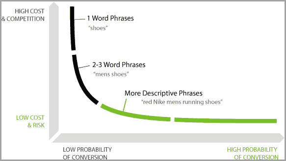

# 语音搜索对搜索引擎优化未来的不可否认的影响

> 原文：<http://www.jeffbullas.com/impact-of-voice-search/?utm_source=wanqu.co&utm_campaign=Wanqu+Daily&utm_medium=website>

作为消费者，我们正在转向一个免提的数字世界。大多数现在推向市场的移动设备都配备了[最新的人工智能(AI)技术](https://www.jeffbullas.com/artificial-intelligence/)，允许我们用语音进行搜索，而不是打字。

但是，语音搜索与基于文本的搜索方式不同。当发出语音命令时，我们不使用特定的关键字，而是使用自然语言，就像我们对朋友或家人说话一样。正因为如此，[我们所知道的 SEO 正在改变](https://www.jeffbullas.com/seo-basics/)。

本文将讨论语音搜索的当前应用和潜在增长，以及它将如何影响 SEO，它带来的问题和机遇，当然，还有一些让你的业务适应语音搜索的技巧。

## 免费下载

### 小型企业有机交通的终极指南

## 语音搜索目前的采用和增长

在接受调查的 2000 人中，近 27%的人每周至少使用一次语音搜索，其中约 22%的人每天都使用语音搜索——随着人工智能的不断改进和每年新设备的上市，这一数字预计将会增长。

*谷歌趋势——语音搜索兴趣随时间的变化*

语音搜索是一种更简单、更快捷的搜索方式，无论是在家、在旅途中、在烹饪时，还是在从一个地方到另一个地方的通勤途中。因此，难怪人们越来越多地采用这种形式的搜索。最重要的是，语音搜索不再局限于智能手机。

现在，有扬声器甚至电脑可以接受并完全理解语音命令，并提供简洁准确的答案。这样，基于文本的命令可能会变得越来越少，而语音搜索将取而代之。

但是，这对 SEO 意味着什么呢？

## 语音搜索如何影响搜索引擎优化

虽然语音搜索的增长并不意味着基于文本的命令将完全消失，但它确实意味着数字营销需要适应这种新的消费趋势。众所周知，搜索引擎优化将会改变，具体方法如下:

**查询长度**

口头查询的长度与基于文本的查询完全不同。基于文本的搜索通常大约 2 到 3 个单词长，而语音激活的搜索有时会超过 10 个单词。考虑到这一点，自然语言关键词可能是下一件大事。

**基于问题的搜索**

除了更长之外，语音搜索查询通常以问题的形式出现。通常输入的搜索应该是这样的:*“语音搜索和 SEO”*。另一方面，语音激活的可能听起来更像这样:*“语音搜索将如何影响 SEO？”*。因此，将问题形式的关键词作为内容策略的一部分是很重要的。

**意图明确的查询**

由于语音搜索通常以问题的形式出现，它们揭示了用户的意图水平。作为营销人员，识别这些高价值的问题并相应地优化内容非常重要。在这种情况下，使用自然语言比以往任何时候都更重要，因为你的关键词与消费者搜索匹配得越多，你的排名就越高。

## 语音搜索带来的问题和机遇

正如任何进入营销世界的颠覆者一样，它也有自己独特的机遇和问题。

让我们从问题开始:

**您可能遇到的问题**

因为语音搜索查询通常是问题，所以您的内容准确回答这些问题非常重要。也就是说，你必须找出哪些更具体、更复杂的问题，而不是简单地需要一个*【是】*或*【否】*的答案。

通过以问题的形式使用关键字，只需要一个词的答案，你会失去你的网站的流量，因为机器重定向消费者会简单地回答问题本身。简单来说，机器无法自己生成的问题，你需要给出答案。

**利用机会**

随着谷歌变得越来越智能，它现在能够解释大量不同的语音搜索，这意味着你需要覆盖所有的基础。语音搜索现在能够接受拼写指示，因此你必须三次检查你的所有内容，更具体地说是关键词和品牌，拼写正确。

除此之外，语音搜索现在可以根据上下文解释查询，因此在创建内容时描绘一个更大的画面比以往任何时候都更重要。确保将自然语言和问题关键词与稍微宽泛的上下文相关的关键词结合起来，这些关键词也可以在搜索引擎上排名。

最后，位置是语音搜索引擎优化的前沿。随着语音搜索现在能够提供基于地理位置的搜索结果，你的在线企业名录需要是最新的并且完全匹配。每个列表之间最微小的差异都会导致搜索引擎排名下降。

## 与语音搜索相关的 SEO 的未来

语音搜索会一直存在。事实上，它很可能不仅会增长，而且会改善。机器学习和人工智能技术正以指数速度发展，这意味着我们需要优化语音搜索的 SEO 策略。真正的问题是*“如何？”*

*谷歌趋势——随着时间的推移对机器学习的兴趣*

内容从未如此重要。虽然你可能在想*“我已经创造了很棒的内容”*，但现在需要用更对话的语气来写，以便回答特定的客户问题。除此之外，在搜索引擎中输入查询的人和执行语音激活命令的人经常在寻找不同的东西。

使用基于文本的命令，用户很可能乐于对他或她的查询进行进一步的研究。通过语音搜索，用户可以快速找到答案。你的内容需要继续吸引这两类搜索者。

## 让企业适应语音搜索的技巧

因此，我们探讨了语音搜索的普及可能带来的一些机遇和问题。我们也瞥见了 SEO 的未来。现在，让我们看看如何让您的企业适应这一增长趋势:

**1。更关注长尾关键词**

尽管各种公司都在用长尾关键词优化他们的内容，但现在这样做比以往任何时候都更重要。当你做关键词研究的时候，你需要把更多的注意力放在对话式问题和疑问形式的长尾关键词上。

*尼尔·帕特尔——长尾关键词的转化率*

你需要找出你的读者在你所在地区寻找像你这样的公司时使用的具体措辞。您还需要关注解决客户可能面临的特定问题的查询。你必须能够回答机器不能回答的复杂问题。

**2。利用模式标记**

了解[模式标记](https://www.jeffbullas.com/schema-org-markup-and-structured-data/)将有助于您为现有内容提供上下文。搜索引擎将能够更好地了解你的网站是关于什么的，从而给你一个比你所在行业的其他公司更高的排名。今天只有 [0.3%的网站使用模式标记](https://www.searchmetrics.com/news-and-events/schema-org-in-google-search-results/)，你将利用 SEO 的巨大资源。

**3。发布匹配的公司数据**

你的商店或办公室的方向，营业时间，公司名称，以及你的业务的每一个小细节都必须是最新的，并且与你所列的每一个平台相匹配。这是移动和语音搜索用户经常寻找的信息类型，如果它是错误的，谷歌可能会降低你的排名。

**4。移动友好型**

最后但并非最不重要的一点是，移动友好。如果你的网站运行缓慢，无法加载，或者[没有针对移动用户](https://www.soapmedia.co.uk/8-reasons-why-2017-will-be-the-year-for-mobile/)进行优化，那么登陆你网站的消费者很可能会马上离开。您必须针对 Mac、Windows 和 Android 以及智能手机、平板电脑和电脑优化您的在线平台。

## 像您的客户一样使用语音搜索

语音搜索正在兴起，这是毫无疑问的。作为营销人员，如果我们对此视而不见，那将是愚蠢的。为了最好地理解语音搜索的发展方向，你必须自己开始使用它。

设身处地为观众着想，相应地优化你的内容。SEO 的未来是自然语言处理，所以参与到对话中来，保持领先于你的竞争对手。

***嘉宾作者:**马克勒·戴维斯是[肥皂媒体的营销总监。](https://www.soapmedia.co.uk/)自 2005 年以来一直是谷歌的主要合作伙伴。作为一名拥有超过 12 年数字企业家经验的曼彻斯特人，他热衷于通过 UX、数字营销、*和*自动化的创新方法帮助企业创造更多在线收入。在 Twitter 上阅读更多来自 [@soapmedia](https://twitter.com/soapmedia?lang=en) 的内容。*