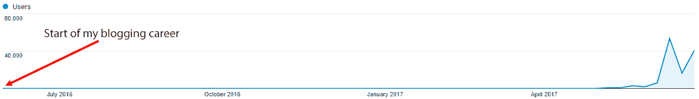
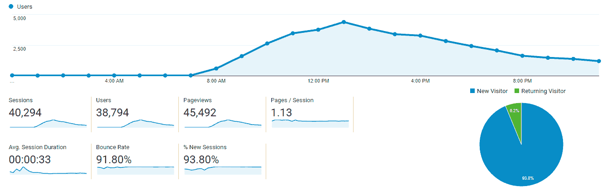
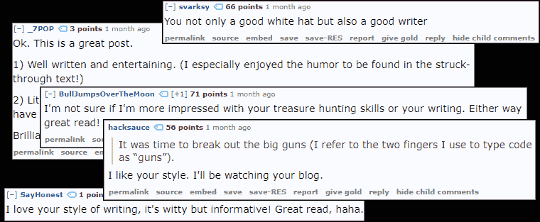

# 我是如何为我的博客 mtlynch.io 聘请自由编辑的

> 原文：<https://mtlynch.io/editor/?utm_source=wanqu.co&utm_campaign=Wanqu+Daily&utm_medium=website>

## 写博客一年[🔗︎](https://mtlynch.io/editor/#a-year-in-blogging)

我在去年五月开始写这个博客。我不想吹牛，但是到去年四月，在我写博客不到一年的时候，我每天吸引了超过 20 个访问者，其中几个不是垃圾邮件机器人。当我发布一个新帖子，并通过我掌握的所有社交媒体渠道寻求读者的时候，这个数字达到了 50 个访客**。**

**我的受众规模在 2017 年 5 月发生了一点变化。眼尖的读者可能会发现我的流量图表中的微妙变化:**

**

每周访问 [mtlynch.io](https://mtlynch.io/) 的独立读者数量

** 

**正如你从上面的图表中注意到的，我的数字从博客存在的第一年的大部分时间里“微不足道，不能出现在图表中”到去年五月开始每周超过 9000 名读者。从那时起，当我发表一篇新文章时，这个博客每周有多达 40，000 的访问者。**

**如果按月比较，博客每月增长超过 20 倍，两个月内增长超过 450 倍:**

| 月 | 独特的访问者 | 成长(一个月) | 成长(两个月) |
| --- | --- | --- | --- |
| 2017 年 4 月 | Two hundred and fifty-one | — | — |
| 2017 年 5 月 | Five thousand five hundred and seventy-two | 2，119%/22 倍 | — |
| 2017 年 6 月 | One hundred and thirteen thousand one hundred and twenty-one | 1，930%/20 倍 | **44968%/450 倍** |

## **什么变了？[🔗︎](https://mtlynch.io/editor/#what-changed)**

**就在 2017 年 5 月 13 日睡觉之前，我在 Upwork 上发布了一份博客编辑的工作，这是一个我经常用来招聘自由职业者的网站。不是一个永久的职位，只是一个一次性的工作，通读我已经发布的文章，找出我写作中的薄弱模式，并提出改进建议。**

**当我第二天早上醒来的时候，我已经收到了 10 个不同的自由职业者的申请。几场比赛似乎很激烈。申请者包括博士、记者和写作老师。**

**有些比赛不太激烈。出价最低的人，每小时 8 美元，告诉我她“完全具备教授写作的知识。”另一名自由职业者在求职信中提到，“编辑和写作是她的强项。”**

**最强的申请人是一位名叫萨曼莎·梅森的编辑。每小时 55 美元，几乎是第二高出价者的两倍。但是她的回答是唯一一个表明她确实读过我的任何作品的回答。在她的求职信中，她指出我有用助动词淡化句子的习惯。“正如你**可以看到下图中的**，”而不是简单地说，“正如你**可以看到下图中的**。”**

**萨曼莎也很适合，因为她有工程背景。她告诉我，她也是一名程序员，所以我想这将为我更多的软件文章提供额外的背景。**

**那天早上我给了萨曼莎这份工作。上午 10 点，她接受了。从写招聘启事到完成招聘的整个过程花了不到 12 个小时。**

**注意:因为整篇文章都是关于编辑和萨曼莎的工作，所以她觉得编辑这篇文章~~是合适的，所以如果我对她的所有负面评论都被删除了，这就是为什么~~。**

## **为什么要雇编辑？[🔗︎](https://mtlynch.io/editor/#why-hire-an-editor)**

**当我发表一篇博客文章却失败了，我没有得到太多关于*为什么*失败的反馈。迄今为止，我的读者中没有一个人写信说，“嘿，你在那篇文章中有很好的想法，但我从未读过它们，因为你重复的句子结构分散了我的注意力，我关闭了标签。”一个编辑实际上*能*给我那种反馈。**

**我觉得我的写作相当不错，但肯定还有改进的空间。改变我的风格可能会有实际的好处，比如更多的观众和读者会更好地理解内容。**

**除了我的博客，投资我的写作会在我生活的许多方面带来回报。写作是一种高度可转移的技能，就像公共演讲、时间管理或变戏法一样。我学到的改进博客写作的技巧可能会应用到我在工作中写的设计文档中，甚至是我发给朋友的电子邮件中。**

**

“你说你的*编辑*”

** 

**我雇佣编辑的另一个原因是最重要的:让我的朋友、家人和同事对我的博客有一种误导性的浮夸感。之前，当我告诉别人我写了一篇关于使用 Selenium 测试 Ansible 角色的博文时，他们礼貌地点了点头，然后转移了话题。但是当我开始说“我正在重写我的新帖子，因为我的编辑认为导言太弱了”这样的话时，人们开始感兴趣了。“你的*编辑*？”**

## **从错误中学习[🔗︎](https://mtlynch.io/editor/#learning-from-my-mistakes)**

**在我雇用她几天后，萨曼莎给我发了两篇博文的详细反馈。我一读她的笔记，就知道雇个编辑是个好决定。她指出了几个我不知道自己正在犯的错误。它始于一些小事，比如不正确地使用逗号或过度使用插入语(我过去习惯于将它们插入句子中，以填充不值得一提的信息)。**

**一个令人惊讶的发现是我经常假设我的读者分享我的参考框架。萨曼莎指出，在一篇帖子中，我提到了[无缝](https://www.seamless.com)，但没有解释它是什么。无缝是一种食品配送服务:在曼哈顿非常受欢迎，但在萨曼莎居住的威斯康星州就不那么受欢迎了。当我在帖子里提到它的时候，我从来没有想到有人可能不知道这家公司。萨曼莎的笔记让我意识到我是多么频繁地疏远我的观众，而我可以通过意识到潜在的不熟悉的引用来轻松避免这一点。**

## **你想通过这个故事达到什么目的？[🔗︎](https://mtlynch.io/editor/#what-are-you-trying-to-accomplish-with-this-story)**

**萨曼莎给我的最有价值的建议是在回复一篇帖子时，我描述了[使用零工服务雇佣私人厨师](https://mtlynch.io/taskrabbit-cooking/):**

> **你想通过这个故事达到什么目的？如果只是事实，你已经做到了，但我认为你可以做得更多。这是创造性的写作。好好享受吧。让读者发笑。让读者想继续读下去。**

**我的第一个想法是，“什么*故事*？这只是我所做的一个解释。”我写这篇文章是因为我告诉了几个朋友我是如何雇佣我的厨师的。人们似乎被这个过程逗乐了，他们对其中的逻辑很感兴趣:“花了多少钱？你是怎么挑选厨师的？”对我来说，一篇博客文章简单地回答这些问题似乎很自然。**

**让这个建议在我脑子里转了几天后，我想:“为什么*不能是一个故事呢？人们喜欢故事。”我对文章主题有很多想法，所以我想是否可以用故事的形式来写它们。***

## **像讲故事一样讲述🔗︎**

**几周后，我在浏览 reddit 时，看到一个用户发布了一个损坏的密码。这个密码是为了保护他们以加密货币形式持有的一大笔钱，所以他们沮丧地发布了这个密码，因为一个损坏的密码实际上意味着他们失去了他们的钱。我想出了一个聪明的方法来重建正确的密码，并用它来偷他们的钱。不用担心；我还回去了。**

**我使用的技术是不寻常的，所以在接下来的一周里，我考虑如何在博客上写出来。我突然想到:这可能是萨曼莎告诉我的那些“故事”中的一个。**

**我在一个周四晚上不间断地写了四个小时的文章。写博客从来没有这么开心过。它愚蠢而谦逊，还半开玩笑地提到了流行文化——这些都是我以前的博客所缺乏的品质。我知道以故事的形式呈现可能会使它更引人入胜，但我没有预料到这会使文章写起来容易得多。**

**第二天早上，我发表了文章[“我如何偷了你的硬币”](https://mtlynch.io/stole-siacoins/)，并发布了链接到 [reddit](https://reddit.com) 和[黑客新闻](https://news.ycombinator.com/)这两个流行的链接分享网站。当天结束时，这是 reddit 的两个子论坛上有史以来投票率最高的故事， [/r/siacoin](https://www.reddit.com/r/Siacoin/top/) 和 [/r/cryptocurrency](https://www.reddit.com/r/CryptoCurrency/top/) (尽管几天后，我被[一张符号的图片](https://www.reddit.com/r/CryptoCurrency/comments/6i5ibl/its_happening/)可耻地从/r/cryptocurrency 的第一名位置上挤了下来)。它还在黑客新闻上获得了足够的关注，登上了头版，这对科技博客来说是一个令人羡慕的成就。**

**

[“我如何偷了你的硬币”](https://mtlynch.io/stole-siacoins/)发表当天的博客访客统计。

** 

**我还注意到文章的评论有些有趣。他们中的许多人特别称赞了我写作的风格:**

**

积极评价《我是如何偷了你的硬币》的写作风格。创作这幅拼贴画并不算自恋，因为我是为了一篇博文而创作的。

** 

**我经常浏览 reddit，我不记得看到过很多用户称赞他们提交的文章——尽管应该指出的是，除非是针对我的，否则我不会认可称赞。这些反馈似乎如此明确地证实了我雇佣一名编辑的决定，以至于我几乎不得不怀疑萨曼莎是否在偷偷摸摸地张贴这些评论。*【**编者按**:没有证据支持这一指控。]***

## **前后[🔗︎](https://mtlynch.io/editor/#before-and-after)**

**你可能在想，“那只是一篇文章。他可能很幸运。”或者至少在这篇文章获得了比我预想的多得多的关注后，我是这么想的。但我发表的下一篇文章得到了类似的积极回应。我当然不认为我写的每一篇文章都会成功，但对我来说很明显，收到专家的反馈使这种受欢迎成为可能，而以前却不是这样。**

**如果你将我在与萨曼莎合作之前发表的三篇文章的访客统计数据与我之后发表的三篇文章进行比较，差异是显而易见的:**

### **与编辑合作前[🔗︎](https://mtlynch.io/editor/#before-working-with-an-editor)**

### **与编辑合作后[🔗︎](https://mtlynch.io/editor/#after-working-with-an-editor)**

## **成本[🔗︎](https://mtlynch.io/editor/#cost)**

**正如我前面提到的，我并没有打算雇人持续编辑我的文章。每篇文章约 110 美元，要对我写的每篇新博文进行专业编辑，成本太高了。相反，我想对我的写作进行一次性的回顾，这样我就可以自己运用这些技巧了。**

**我觉得这个计划奏效了。在我开始与萨曼莎合作后写的三篇文章中，她只编辑了 GreenPiThumb 邮报。其他的，我根据我从她以前的反馈中学到的东西编辑了我自己。**

**征得 Samantha 的同意，我在下面列出了她为我所做工作的确切成本以及她为每篇文章提供的注释:**

**关键是萨曼莎骗了我。我没有预料到她的反馈会有多有效，所以现在我想和她一起工作。我不能为每篇文章都雇佣她，但是我确实计划定期和她联系。我的策略保持不变。我不想把编辑工作交给萨曼莎，而是从她对每篇文章的反馈中学习，这样我就可以专注于不同的领域进行改进。**

## **与编辑合作的建议[🔗︎](https://mtlynch.io/editor/#suggestions-for-working-with-editors)**

**如果你是一名博客写手，并且正在考虑聘请一名编辑，根据我的经验，这里有一些建议:**

### **为质量付费[🔗︎](https://mtlynch.io/editor/#pay-for-quality)**

**如果你在像 Upwork 这样的自由职业网站上发帖，你总是会收到愿意接受任何工作的人的廉价邀请，不管他们有没有能力提供结果。不要为了省钱而雇佣一个低薪编辑。**

**如果你想请人来评论你的作品，请一位能给你出色指导的专家。如果你需要手术，你会雇佣最便宜的人拿着手术刀接近你吗？对你的写作进行专家反馈的投资将会在很长一段时间内获得回报，所以要好好投资。**

### **仔细筛选[🔗︎](https://mtlynch.io/editor/#screen-carefully)**

**自由职业者网站向你展示潜在自由职业者从他们过去的客户那里得到的评价和评论。通读这些评论，看看编辑是否具备对你来说重要的品质。优先考虑已经完成至少 10 个工作的申请人，成功率为 90%或更高。例如，萨曼莎的成功率为 99%，完成了 39 项工作，这些都是她素质的优秀指标。编者按:这是一个敏锐的观察。]**

**要求申请人提交一份求职信，并仔细审查。对于编辑来说，这基本上是他们工作的样本。他们有没有给你发一封格式信发给每个人？还是他们定制了它来解决您需要帮助的地方？他们求职信中的语法应该无懈可击，措辞应该清晰易懂。**

### **寻找主题熟悉度[🔗︎](https://mtlynch.io/editor/#look-for-subject-matter-familiarity)**

**找一个能理解和欣赏你写作的编辑。他们不需要和你有同样水平的专业知识，但是他们应该和你的潜在读者一样熟悉这个主题——即使你不付钱给他们，他们也会阅读你的博客。**

**如果你有一个关于流行音乐的博客，你不需要聘请专业的音乐评论家，但你应该找一个对音乐有足够欣赏力的人来理解你的术语和参考文献。同样，如果你写一个妈咪博客，不要要求潜在的编辑持有儿童发展的研究生学位，但他们至少应该熟悉儿童的概念。**

### **自己抓住容易的东西[🔗︎](https://mtlynch.io/editor/#catch-the-easy-stuff-yourself)**

**你为专家的时间支付了额外的费用，所以没有必要把时间浪费在你能识别的简单错误上。在将你的文章发送给编辑之前，用类似于 [Grammarly](https://grammarly.com) 或微软 Word 的工具来检查拼写和语法错误。**

**你校对过程的一部分也应该是大声朗读你的文章。我的编辑鼓励我这样做，我惊讶于它捕捉粗心错误和不自然措辞的效率。**

### **别往心里去[🔗︎](https://mtlynch.io/editor/#dont-take-it-personally)**

**你的编辑在评论你的作品，而不是你。如果你的文章非常个人化，这两者会有相同的感觉，但如果你能把自己从文章中分离出来，不带防御或自负地接近他们的反馈，你会从编辑的笔记中得到最大的收获。**

### **你不必接受每一个音符[🔗︎](https://mtlynch.io/editor/#you-dont-have-to-accept-every-note)**

**尽管有前面的建议，记住这最终是你的写作，你必须决定接受和拒绝什么样的反馈。**

***【**编者按**:不理会这个建议。]***

**有几次，我的编辑提出了一个我认为更清晰或更有说服力的修改，但听起来不像我的声音。在这种情况下，我试着重写这篇文章，以更接近这个建议。但偶尔，我会和纸条较劲，得出结论，我写的就是我想要的。**

### **制作检查表[🔗︎](https://mtlynch.io/editor/#make-a-checklist)**

**每次我完成一篇新博文的初稿，我都会查看我的编辑对她评论的最后一篇文章的笔记。对于我发现自己不断重复的错误，我会保留一份单独的清单，在写作过程结束时浏览一遍。我的清单上有类似“确保你没有过度使用‘真的’这个词”的提醒，但是你会发现一些模式可以添加到你自己的清单上。真的。**

* * *

***特别感谢我的编辑[萨曼莎·梅森](https://www.samanthamasonfreelancer.com)，她自愿抽出时间来编辑这篇文章。***

****注意**:萨曼莎目前没有新的编辑客户。**