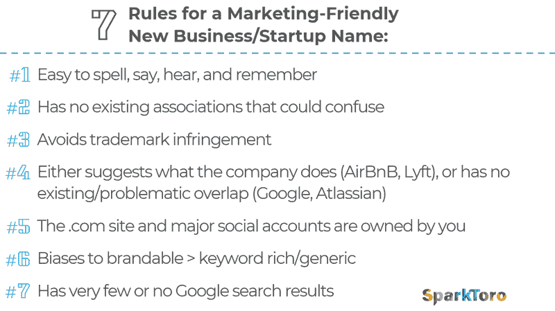
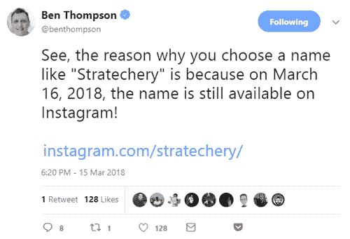

# 如何选择一个减少营销摩擦的创业公司名字——spark toro

> 原文：<https://sparktoro.com/blog/how-to-choose-a-startup-name-that-reduces-marketing-friction/?utm_source=wanqu.co&utm_campaign=Wanqu+Daily&utm_medium=website>

几个月前，我为我的新公司选定了一个名字。自从两周前发布以来，我就收到了这样的问题，“为什么是 SparkToro？”几十次。与我之前的创业不同(在那次创业中，我从非常笨拙的 SEOmoz.org 开始，后来更名为 Moz.com)，这一次我要深思熟虑和有意识得多。由于我的一大使命是帮助人们做更好的营销，我想不出更好的时间来解决这个棘手的问题。

为你的新业务或项目选择名字时，优先顺序是什么？你个人喜欢的东西？让你的所作所为显而易见的名字？名字真的那么重要吗？

### 名字很重要吗？

让我们先处理这个话题。如果你的目标是最大化你的短期和长期生存和成功的机会，你选择的名字应该对你公司的一个领域有最大的影响:营销。

你想要一个名字:

*   一旦听到，就会被记住
*   不要和不是它的人或事混淆
*   具有较高的[处理流畅性](https://www.uxmatters.com/mt/archives/2011/07/how-cognitive-fluency-affects-decision-making.php)(意味着人们在认知上容易思考和谈论)
*   不会对潜在接触或使用产生负面影响

反向投资者可以合理地争辩说，许多在这些方面做得很糟糕的名字已经变成了成功的企业。亚马逊(在公司推出之前很长一段时间显然是一条河)。Xero(实际上我还是不清楚怎么发音)。处女(意思是…别的)。奶品皇后(看起来一定和汉堡王有关系吧？).阿歇特(不太容易发音)。每一个单独的律师事务所合伙关系(某物，某人，和其他人…我想其中一个是以“S”开头的)。

当我们谈论优化以减少营销摩擦时，问“这些名称中有什么东西使它们工作得更好吗？”可能是有价值的但是陷入生存偏见是没有意义的。一家公司的生存能力和成功取决于成百上千的因素。名字只有一个。但这也完全在你的掌控之中。那么，为什么不给你的新企业起一个符合一些营销友好标准的名字呢？

有一些有趣的研究支持品牌名称的重要性，包括名称更容易发音的公司的股价表现更好(T1)(不要让任何人告诉你“市场没有人的偏见”)，词汇建立起可能偏见感知的隐含关联(T3)(和行为)，以及(可能对初创公司最突出的)[在早期公司中，更简单的名称与更高的生存几率相关(T5)，即使在控制许多其他变量的情况下。](http://www.adweek.com/digital/when-it-comes-naming-your-startup-simple-better-163993/)

### **你需要喜欢你公司的名字吗？**

这是个不错的主意。你肯定会(希望)很长一段时间带着它生活，并且需要说很多次。选择一个符合营销便利标准的名字，让你每次需要输入或分享时都后悔不已，这绝对不是一个好主意。但是我不建议你瞄准你绝对热爱的东西。

为什么不呢？因为它通常会让你偏向于选择个人享受的东西，而不是会给实体增加价值的东西。我的建议是首先列出符合标准的名字，然后选择你最喜欢的。这样，你就减少了爱上一个与你个人有共鸣，但在下面重要测试中表现不佳的名字的风险。

### **营销友好型创业公司名称的 7 条规则**

我的个人清单(包含了许多其他新公司命名建议)有以下几点:

1.  容易拼写、说出、听到和记住
    听起来像真实单词或者是现有单词的不寻常组合的单词是很好的目标，只要它们不难拼写或发音。试着让 10 个随机的人在给他们看了写下的版本后说出这个单词，然后让另外 10 个人在听到你说出这个单词后拼写出来。如果 90%以上搞定了，你就可以走了。
2.  **没有会引起混淆的现有联想**
    这个名字不应该引发任何其他预先存在的心理联系，或让人想起你不想要的品牌、公司、产品或想法，例如，如果你想把你的公司与食物联系起来，把它命名为“past over”是好的，但如果你不想，那就糟糕了。
3.  **避免商标侵权**
    这很容易。美国专利局维护着一个可在线搜索名称的数据库。在你开始之前使用它(除非你正在购买一个现有的域名，并且网站所有者也愿意卖给你 TM)
4.  **暗示公司做什么，或者没有现存的/有问题的重叠**
    如果你公司的名字让人想起你帮助解决的问题或者你提供的产品，太好了(AirBnB，Lyft，Mythbusters)。如果它完全没有让你想起什么(谷歌、Atlassian、SparkToro)，那也很好。但如果这个名字让人们想起公司不打算或不想与之有关联的东西，那就不好了。
5.  **The。我无法告诉你我所认识的有多少企业家在他们公司的早期花了数周的时间担心并努力获得。com 域名、Twitter 账户、脸书页面、Instagram 账户等。对于一些新企业来说，社交账户名称没那么重要，但对于几乎所有企业(至少是那些总部位于美国、目标客户是说英语的人)来说，社交账户名称是最重要的。com 域名仍然是许多许多客户，访问者和潜在的放大器将使用的假设。如果一个域名持有者选择竞争，不守信用，或者只是比你更擅长 SEO，这个问题可能会特别严重。**
6.  **对品牌化的偏见>关键词丰富且通用** 过于字面化是网络上许多域名面临的问题，而且因为在过去的 20 年里，消费者已经开始将这些关键词驱动的名称与粗略的、垃圾的运营商联系起来(通常是由于 SEO 实践的第一个十年)，行为偏见对他们不利。他们也真的，真的很难建立共鸣的线下品牌。只需将 Wirecutter 或 C|Net 与 ElectronicsReviews 或 LCD-TV 进行比较。在这种情况下，这个名字就是一个字面上的品牌杀手。也许有几十个这些关键词丰富的通用名称已经获得了品牌地位(CheapFlights 和 Pets.com 是我想到的仅有的两个)。
7.  很少或没有谷歌搜索结果
    这个试金石是金子。它不仅防止了许多其他问题(通常，至少避免了商标侵权，增加了社会帐户和。这也使得在网上追踪你的新公司的品牌提及变得非常容易。设置一个[谷歌提醒](https://www.google.com/alerts)、[新鲜网络提醒](https://moz.com/help/guides/research-tools/fresh-web-explorer)或[提及提醒](https://mention.com/en/enterprise/advanced-alerts/)并高度准确地观察谁在谈论你，这是一个提高你的外联和营销分析的欺骗代码。只要确保用引号搜索，例如，当我为这个网站搜索时，我检查了[“spark toro”](https://www.google.com/search?q=%22sparktoro%22)而不仅仅是 [SparkToro](https://www.google.com/search?q=sparktoro) 。

想把它作为一个可视的清单，放在幻灯片中或复制/粘贴到推文中吗？(我知道我总是喜欢这些——你猜对了，它们减少了营销摩擦！)给你:

还有一个更大的版本[可以在这里](https://images.sparktoro.com/blog/wp-content/uploads/2018/03/7-rules-naming.gif)下载。

### 如果我的名字不符合一些标准怎么办？

当然，你也不一定要把每个方面都钉牢。许多名字都有优点和缺点。对我来说，SparkToro 比一个完美的名字多了一个音节，多了 2-3 个字符。但我愿意牺牲这些来换取一个谷歌搜索结果为零的名字(在 2018 年 2 月 28 日之前被引用查询)和我想要的其他所有方面(加上我真的很喜欢卡通《龙猫》和用肥金枪鱼肚子制作的寿司 otoro)。

许多成功的公司都用平庸的名字混了过去，许多公司利用自己在某些领域的优势来克服其他领域的弱点(例如，风险投资公司的 A16Z 将其难以拼写的姓氏组合变成了一个聪明、简短、易于记忆的首字母缩写)。甚至有轶事数据表明起更长或更复杂的名字可能对处理流畅性有积极的影响。

本·汤普森(Ben Thompson)在 Twitter 上提到了他的品牌难以发音和拼写的名字的优势(独特性):

如果你对新公司有额外的命名标准，我很乐意在评论中听到🙂