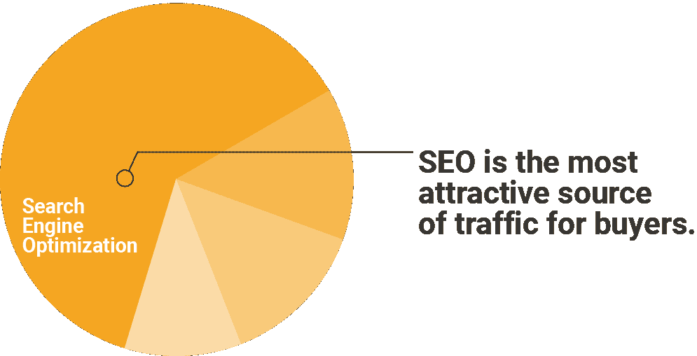
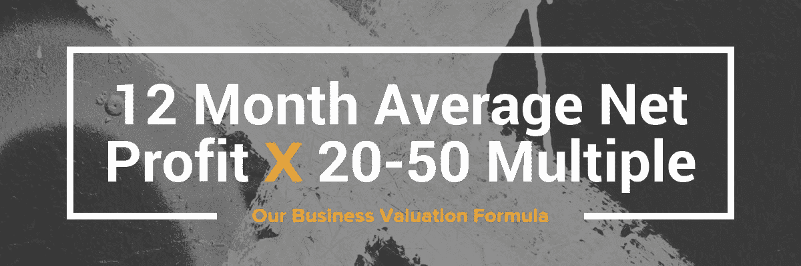

# 你的网站到底值多少钱？【估值简易指南】——Moz

> 原文：<https://moz.com/blog/guide-to-website-valuation?utm_source=wanqu.co&utm_campaign=Wanqu+Daily&utm_medium=website>

我们都努力建立自己的企业。

我们投入了汗水和随之而来的泪水来创造真正伟大的东西。在办公室忙碌了一天或在键盘上疯狂打字后，你可能会想…这里的最终目的是什么？

你真正想要的是什么？有没有一个发光的写着“出口”的霓虹灯标志着通往你最终目标的道路？

对于大多数企业来说，最终目标是最终将企业出售给另一位企业家，而这位企业家想要掌控企业，并享受出售带来的利润。唉，我们中的大多数人甚至不知道我们的企业值多少钱，更不知道如何去卖掉它——甚至不知道它是否可以卖。

这就是帝国脚蹼的用武之地。我们多年来一直在网上商业领域从事交易经纪业务，服务于一群安静但渴望收购数字资产的投资者。对有利可图的数字资产的需求一直在增长，以至于我们的经纪公司能够连续两年登上 Inc. 5000 榜单，两次都低于 500 大关。

我们可以很有信心地说，是的，你的企业确实有一个出口。

在这篇文章结束时，你将会更多地了解如何评估在线业务，买家在寻找什么，以及如何为你的内容网站、软件即服务(SaaS)或电子商务商店获得绝对的最高收入。

(你可能已经注意到，我在最后一段没有提到“代理”这个词。数字代理难以置信地难以销售；要做到这一点，你需要尽可能地简化你的流程。尽管拥有客户很好，但出售其他数字资产要容易得多。)

如果你已经建立了一项数字资产，并打算退出，你可能会问的第一个问题是，“这听起来很棒，但我该如何给我所创造的东西贴上真正的价格标签？”

我们将在下面深入探讨这些答案，但首先让我们谈谈为什么你仅仅是 Moz 博客的读者就已经处于一个很好的位置。

## 为什么搜索引擎优化是数字资产中最有价值的流量？

搜索引擎优化是迄今为止最有吸引力的交通来源，人们期待购买在线业务。

SEO 的美妙之处在于，一旦你投入了工作来获得排名，他们可以维持并带来几个月的流量，而不需要大量的维护。这与点击付费(PPC)广告形成鲜明对比，如脸书广告，需要每天监控，以确保你的转换没有发生任何奇怪的事情，或者你没有超支。

对于一个没有流量生成经验，但想购买一个有利可图的在线业务的人来说，一个 SEO 驱动的网站是有意义的。他们可以边学边赚。当他们购买资产时(通常是一个针对刚起步的人的内容网站)，他们可以添加新的高质量的内容，并学习更复杂的 SEO 技术。

甚至有人是付费流量高手也爱 SEO。他们可能会购买一家电子商务商店，该商店有一些真正的脸书广告潜力，目前通过 SEO 驱动其大部分流量，并将 SEO 视为他们计划向该电子商务商店驱动的付费流量之外的额外收入。

无论买家是新手还是老手，SEO 作为一种流量方式，拥有任何其他流量策略最广泛的吸引力之一。虽然在大多数情况下，SEO 本身不会增加商业价值，但它确实比其他形式的流量吸引了更多的买家。

现在，让我们认真考虑一下你的生意值多少钱。

## 在线业务实际上是如何估值的？

如何对企业进行估值是我们在经纪公司遇到的一个常见问题，因此我们开发了一个[自动估值工具，为您的企业价值提供免费估算](https://empireflippers.com/valuation-tool),我们的受众在他们所有不同的项目中都会用到这个工具。

任何估值的核心都是一个相当基本的公式:

你看看你的连续 12 个月净利润平均值，然后乘以一个倍数。通常，对于健康、盈利的在线业务，市盈率将在 12 个月平均净利润的 20 至 50 倍之间。当你接近 50 倍时，你必须能够证明你的业务逐月大幅增长，并且你的业务是真正可防御的(这一点我们将在本文后面讨论)。

你可能会看到一些经纪人使用 2 倍或 3 倍的 EBITDA，代表利息、税、折旧和摊销前的收益。

当你看到这个公式时，他们用的是年倍数，而在帝国鳍状肢公司，我们用的是月倍数。这两个公式没有太大的区别。这主要取决于你的偏好，但如果你是买卖网上业务的新手，那么了解不同的经纪人如何给业务定价会很有帮助。

我们更喜欢月度倍数，因为它显示了业务及其趋势的更精细的画面。

就像你可以用 SEO 知识影响 Google SERPs 一样，只要你知道你在看什么，你就可以操纵这个公式给你一个更好的估值。

## 如何移动多针对你有利

你可以做很多事情来获得更高的倍数。很多都可以归结为常识，真正把自己放在买家的位置上。

一个有用的问题是:“我会买下我的公司吗？为什么？为什么不呢？”

这种练习可以让你的生意变得更好。

对倍数影响最大的两个方面归结为你的实际平均净利润和这项业务赚钱的时间。

### 平均净利润

你的平均净利润越高，你的市盈率就越高，因为这是一项更大的现金流资产。这是有意义的，然后看看各种方法，你可以增加净利润，减少你的总支出。

每项数字资产的支出来源都略有不同。对于内容网站来说，内容创建成本通常是支出的大头。当你接近销售时间时，你可能想要缩减你的内容。在其他情况下，您可能希望转向一种代理解决方案，在这种方案中，您可以随意调整或最小化您的内容费用，而不是雇佣内部作家。

还有一些费用你可能会用到业务中，但在业务运营中并不真正“需要”，这就是所谓的追加费用。

#### 附加件

加回是指将某些费用加回净利润中。这些项目你可能已经记在了公司账上，但实际上与经营业务无关。

这些可能是由公司支付的饮料、餐饮或假期，有时甚至是商务会议。例如，参加关于电子邮件营销的会议可能不会被视为运营健康内容网站的“必需”费用，而参加广交会这样的采购会议对于运营电子商务商店来说就更难证明是合理的了。

其他的东西，比如你每月使用的 SEO 工具，可能会被添加到业务中。大多数人不需要他们不断地运行和发展他们的业务。他们可能会订阅一个月，获得一段时间所需的所有关键词数据，然后取消订阅，当他们准备好做更多的关键词研究时再回来。

你的大部分开支不会是追加的，但记住这些是有好处的，因为它们肯定会提高你的企业的最终销售价格。

#### 何时不削减开支

虽然通常你可以从你的生意中减掉很多脂肪，但你需要对此保持理性。削减一些东西可能会提高你的整体净利润，但会大大降低你的业务的吸引力。

我们在电子商务领域看到的一个常见现象是，个体创业者开始将所有商品打包并运送给他们的客户。这种想法是，他们通过自己动手来省钱。虽然这可能是真的，但对潜在买家来说，这不是一个有吸引力的解决方案。

花钱购买第三方解决方案更有吸引力，因为它可以在订单到来时为您存储和运送产品。毕竟，许多买家在网上做生意的同时，还忙着周游世界。迫使他们定居下来，只是为了运输产品，而不是在冬天在巴厘岛的海滩上闲逛几个月，这是一个艰巨的任务。

当出售一家企业时，你不仅要担心费用，还要考虑为买家接入并开始运营该企业有多容易。

即使你为此创建的系统增加了额外的费用，比如使用第三方来处理履行事宜，它们通常也更值得保留，因为它们让企业看起来对买家更有吸引力。

### 历史长度

你展示的历史越多，你的企业就越有吸引力，只要它保持稳定的利润水平或呈现上升趋势。

你的业务越是呈上升趋势，你得到的倍数就越高。

虽然你在延长企业历史方面无能为力，但你可以通过在企业早期投资所需的项目，为最终的出售做好准备。例如，如果你知道你的网站需要一个大的改造，并且你已经有 24 个月没有销售了，那么最好现在就做这个大的网站重新设计，而不是在 12 个月内对你的业务进行平均定价。

显示年同比增长也有利于获得更高的市盈率，因为这表明你的企业能够经受住成长的阵痛。这种抵御商业挑战的能力在一个主要流量来自谷歌的企业中尤其如此。这表明，该网站在几年的时间里经历了几次大的更新，做了高质量的 SEO。

另一方面，趋势性下行业务的市盈率将会更低，可能在 12-18 倍之间。然而，一个衰落的企业仍然可以出售。有一些特定的买家只想要不良资产，因为他们可以以很低的折扣获得这些资产，而且通常拥有修复网站所需的技能。

由于价格下跌，你只需愿意接受较低的销售价格，而且由于不良资产的买家群体较小，在找到愿意收购该资产的人之前，你可能需要较长的销售周期。

### 导致更高倍数的其他因素

虽然利润和历史长度是两个主要因素，但还有一堆较小的因素，它们加起来可以显著提高你的市盈率和最终估值。

你将对这些东西有相当大的控制权，所以在 12-24 个月的时间里，在你准备出售你的在线业务的这段时间里，它们值得尽可能地最大化。

#### 1.最大限度地减少故障临界点

失败的关键点是你的业务中任何有能力成为交易破坏者的东西。出售一家有一两个临界点的企业并不罕见，但即便如此，你也要尽可能地减少这种情况。

一个失败临界点的例子可能是你网站的所有流量都是纯谷歌有机的。如果网站被谷歌算法更新惩罚，它可能会在一夜之间扼杀你所有的流量和收入。

同样，如果你是亚马逊的会员，而亚马逊突然改变了他们的服务条款，你可能会因为你不理解甚至没有时间做出反应的原因而被封禁，最终导致一个流量很大的网站零利润。

在电子商务领域，我们看到企业家只有一个供应商可以生产他们的产品。如果供应商想抬高价格或突然完全倒闭，会发生什么？

让你的流量来源多样化，为一个内容网站制定多种盈利策略，或者为你的电子商务产品寻找后备甚至竞争供应商，这些都是值得的。

每个企业都有某种弱点；你的工作是尽可能减少这些弱点，从潜在买家那里获得最大的商业价值。

#### 2.高流量

更高的流量往往与更高的收入相关，这最终会增加你的净利润。这是不言而喻的；然而，高流量除了有助于创造稳定的净利润外，还可以为你的倍数带来额外的好处。

许多买家在营销漏斗的每一点寻找他们可以优化到极致的业务。当你有大量的流量时，你给他们很大的空间来发挥不同的转化率优化因素，如增加电子邮件选项，创建或制作一个更好的废弃购物车序列，并改变网站上的各种行动呼吁。

虽然许多卖家可能在推动流量方面非常出色，但他们可能并不完全是文案或 CRO 方面的专家；这是一个巨大的机会，对于合适的买家来说，他们可能能够通过自己的文案或 CRO 技巧来增加转化率。

#### 3.电子邮件订户

在互联网营销领域，说“钱在清单里”几乎是老生常谈。电子邮件通常是公司收入的最大驱动力之一，但在出售数百家在线企业后，我们发现了一个奇怪的范式。

告诉某人他们应该使用电子邮件列表就像告诉某人去健身房一样:他们同意这很有用，他们应该这样做，但他们通常对此什么也不做。还有一些人确实建立了一个电子邮件列表，因为他们了解它的力量，但却从来没有用它做过任何有用的事情。

这导致电子邮件列表对你的企业的最终估值是否有任何实际价值的判断是漫无目的的。

如果你能证明电子邮件列表为你的企业增加了价值，那么你的电子邮件列表可以提高你的整体倍数。如果你使用良好的电子邮件自动化序列来提升你的流量，并定期向列表发送新的优惠和高质量的内容，那么你的电子邮件列表就具有真正的价值，这将反映在你的最终估值上。

#### 4.社交媒体关注

随着时间的推移，社交媒体变得越来越重要，但它也可能是一只难以置信的善变野兽。

最好把你的社交媒体关注者想象成一个“软”邮件列表。与你的电子邮件列表相比，你的社交媒体关注范围往往会更低，尤其是在像脸书这样的大型社交平台上，社交有机覆盖范围不断下降。此外，你并不拥有 following 赖以建立的平台，这意味着它可能会因为你无法控制的原因而随时被夺走。

另外，太容易伪造关注者和喜欢。

然而，如果你能涉水通过所有这一切，并证明你的社会追随和社会媒体推广是真正的交通和销售驱动你的业务，这肯定会有助于增加你的倍数。

#### 5.你有多少产品

从单一产品中赚取所有的东西有点冒险。

如果那个产品过时了会怎么样？或者停产？

无论你是在经营一个电子商务商店还是一个通过联盟链接赚钱的内容网站，你都希望有几种不同的产品。

当你有几个产品通过你的网站赚了大钱，那么买家会发现这个业务最终更有吸引力，更重视它，因为如果你的“本月风味”之一消失了，你也不会受到很大的伤害。

#### 6.所需小时数

请记住，大多数买家并不打算获得一份工作。他们想要一种杠杆化的现金流投资，能够理想地扩大规模。

虽然每周工作 40-50 多个小时在一个真正特殊的业务上没有什么错，但这会缩小你的总体买家群，降低业务的吸引力。事实是，我们正在创建的大多数数字资产并不真正需要所有者做这么多工作。

我们通常看到的是，销售人员可以利用许多改进的领域来最大限度地减少他们每周分配给企业的时间。我们建议每一个打算出售自己企业的人首先考虑如何将自己的实际参与最小化。

减少你花费时间的三个最有效的方法是:

*   系统化:尽可能让你的业务自动化
*   **发展团队:**我们在这里看到的最大成功往往是在内容创作、客户服务、一般运营以及雇佣营销代理为你完成大部分繁重的工作。虽然这些增加的成本降低了平均净利润，但它们也让你的业务更具吸引力。
*   创建标准操作程序(sop):sop 应该概述企业特定职能的整个流程，并且应该足够好，如果你将它们交给某人，他们可以完成 80%的工作。

你应该总是处在一个你在工作的位置上，而不是在。

#### 7.挖更深的护城河

在 Empire Flippers，我们总是问人们，他们是否在自己的业务周围建立了足够深的护城河。深沟意味着你的生意更难被复制。抄袭者不可能在一个下午就去买域名和一些主机，然后复制你的业务。

一个可以在一天内复制的直运商店远不如一个围绕其品牌建立了真正的追随者和社区的商店有吸引力，即使他们出售相同的产品。

这一事实变得越来越重要，因为你的企业估值进入了多个六位数和七位数的估值范围，因为买家希望在这一点上购买一个真正的品牌，而不仅仅是一个利基网站。

这里有一些你可以采取的行动来加深这个护城河:

*   细分市场，用你的品牌占领市场(例如，一个木工网站可能会特别关注长凳，在那里你雇佣专业工匠来写关于这个主题的内容)。
*   采购你的产品，使它们独一无二，而不是另一个“我也是”的产品。
*   与你的代销商或供应商协商特殊条款。如果你一直在给代销商提供有利可图的流量，通常你只需给代销商经理发邮件，要求加薪，他们会很乐意给你。同样，如果你和一家直运供应商做生意很好，他们可能会和你签订独家协议。不过，要确保所有这些特殊条款都可以转让给买家。

你越难复制你所建立的东西，你得到的倍数就越高。

## 但是，你为什么要卖掉你的在线业务呢？

你现在已经很好地掌握了如何增加企业最终价值的知识，但是你为什么要卖掉它呢？

原因很多，不胜枚举。然而，有一些你可能会产生共鸣的常见原因。

以下是人们出售企业的一些商业原因:

*   开始一项新业务或希望专注于其他当前项目
*   寻求利用资本将自己带入一个更具竞争力(和利润)的空间
*   对经营企业失去了任何兴趣，并希望在收入下降反映出他们缺乏兴趣之前出售资产
*   希望将业务变现，投资于房地产、股票、债券等线下投资。

就像有大量的商业原因要出售一样，人们也有大量的个人原因要出售他们的企业:

*   离婚
*   为他们的家人购买房屋(出售一项数字资产可能是一个家庭的高额首付，甚至覆盖整个家庭)
*   有医疗问题
*   其他原因:我们的市场上有一个卖家，他出售自己公司的原因是为了获得足够的钱收养一个孩子。

当你可以提前获得 20-50 个月的净利润时，你就可以做很多以前没有的事情。

当你拥有六位数甚至七位数的资金时，你通常可以在竞争中胜出，投资于你以前无法投资的基础设施和团队，并且通常可以更快地启动你的下一个项目或商业想法，而不必担心谷歌的更新是否会影响你的收入或其他不可预见的市场变化。

这引出了一个问题...

### 你应该什么时候卖？

说实话，看情况。

这个问题的答案与其说是一门科学，不如说是一门艺术。

作为一个经验法则，你应该问问你自己，你是否对成功出售你的在线业务所获得的金钱感到兴奋。

你可以使用我们的估价工具得到一个大概的估计，或者使用我列出的基本倍数公式，对你可能获得的商业收益做一些粗略的计算。我倾向于保守估计，所以你的餐巾纸数学可能会将你 12 个月的平均净利润乘以 25 倍。

这个数字让你惊讶吗？有意思吗？

如果是的话，那么你可能要开始问自己是否真的准备好放弃你的事业去专注于其他事情。记住，你应该设定一个你愿意放弃的最低销售价格，如果你坚持到底，这个价格仍然会让你开心。

我们大多数互联网营销人员总是同时从事多个项目。可悲的是，有些项目并没有得到他们应该得到的爱，或者说没有得到我们曾经给予的爱。

与其让这些项目在后台消失，不如考虑[把你的在线业务](https://empireflippers.com/sell-your-site)卖给一个开始涌入我们数字领域的饥渴的投资者市场。

出售一项业务，即使是一个你正在收尾的副业，也永远是一个亲密的过程。当你准备好扣动扳机的时候，我们会在那里帮助你的每一步。

你有没有想过卖掉你的网上生意，或者在过去经历过一次出售？[让我们在评论中了解你的建议、问题或趣闻](https://moz.com/blog/guide-to-website-valuation#comments)。