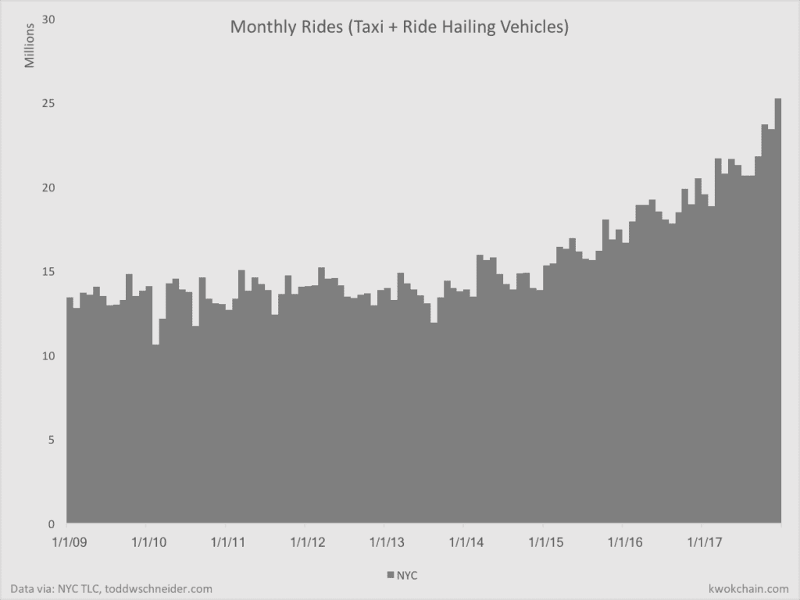
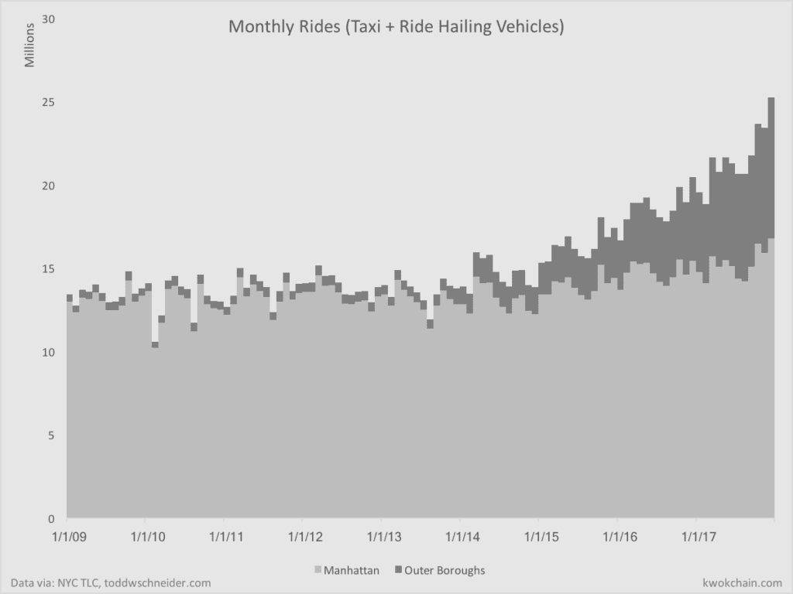
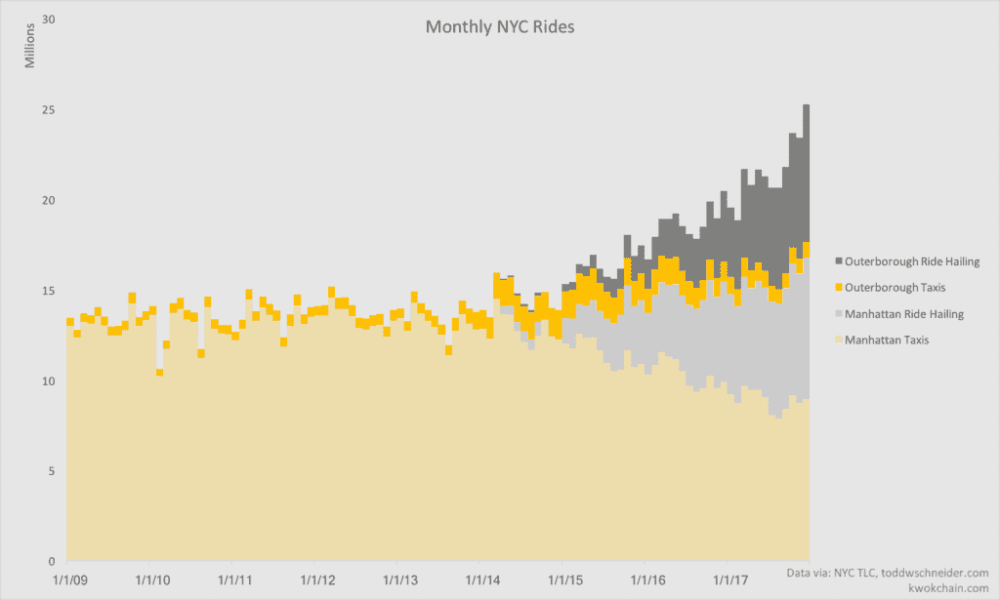
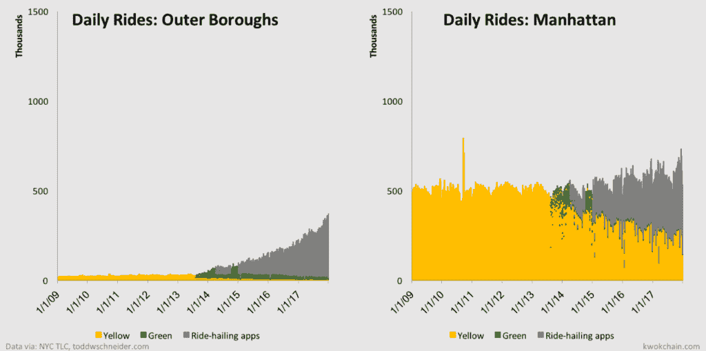
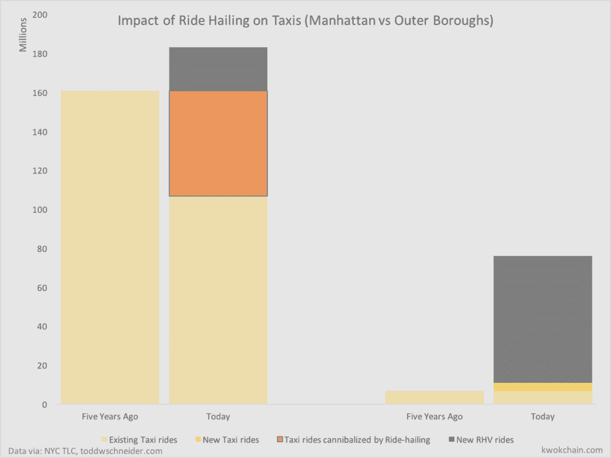
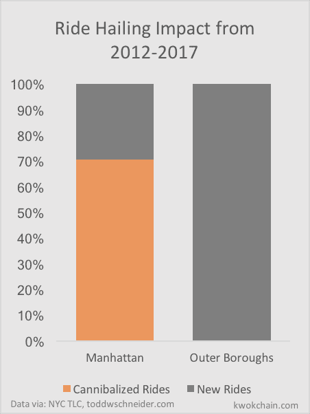

# 了解优步和 Lyft 如何在市场中成长

> 原文：<http://kwokchain.com/2018/04/09/quantifying-tam-expansion-uber-and-lyft-in-nyc/?utm_source=wanqu.co&utm_campaign=Wanqu+Daily&utm_medium=website>

比尔·格利在他 2012 年的博客文章 [《所有的市场并非生来平等:评估数字市场时要考虑的 10 个因素》](http://abovethecrowd.com/2012/11/13/all-markets-are-not-created-equal-10-factors-to-consider-when-evaluating-digital-marketplaces/) 中普及了拓展市场的想法。他列举的第七个观点是，市场实际上可以扩大他们所在行业的可寻址市场总规模(俗称 TAM 扩张)。这个想法是，通过改变价格点，使其更方便，或者改变产品价值主张的其他部分，公司实际上可以发展他们所在的行业。所有市场都渴望 TAM 扩展；很少有人能做到。

Gurley 2014 年的论文 [《如何错过一英里:优步潜在市场规模的另类审视》](http://abovethecrowd.com/2014/07/11/how-to-miss-by-a-mile-an-alternative-look-at-ubers-potential-market-size/) 聚焦 TAM 扩张的理念，作为理解市场潜力的核心部分。Gurley 写了这篇文章来反驳优步的一个批评者，他把重点放在拼车市场的 TAM 上来解释为什么优步的估值过高。格利提出了优步拓展拼车市场的几种方式。

格利对优步的看法正确吗？是否扩大了出租车的市场规模？如果是，如何实现？多年来，关于优步是否真正发展了出租车市场，或者只是扼杀了现有的行业，一直有很多争论。在没有看到关于其影响的实际数据的情况下，很难知道从优步和其他拼车公司那里可以吸取什么教训。

**目录**

1.  [纽约市出租车和乘车数据介绍](#section0)
2.  [优步和 Lyft 拓展出租车市场](#section1)
3.  [外围行政区带动的 TAM 扩张](#section2)
4.  [外围行政区未满足的潜在需求](#section3)
5.  [出租车市场的扩张没有放缓的迹象](#section4)
6.  [优步和 Lyft 都在扩大和蚕食市场](#section5)
7.  [最终想法](#section6)
8.  [后期脚本](#section7)

**纽约市出租车和乘车数据介绍**

我们很少能够定量研究 TAM 扩张的情况，因为这方面的公开数据很少。但多亏了纽约出租车和豪华轿车委员会和 538，我们有数据来分析打车对出租车市场的影响。最重要的是，感谢托德·施耐德，他不仅做了大量清理和组织数据的工作，还慷慨地将所有数据开源。有了这个 [数据](https://github.com/toddwschneider/nyc-taxi-data) ，我们可以查看过去十年所有出租车或拼车的日期和上车地点。

市场扩张是一个鲜为人知的领域。有些人认为它很少是真实的，创业公司大多是蚕食现有市场。而其他人则认为它是公司的短暂财产，要么碰巧罢工，要么不属于少数幸运者。很少有人看到关于市场扩张的硬数据，因此可以理解的是，围绕它几乎没有共同的理解。

查看纽约市关于出租车和拼车市场的数据，我们可以确定出租车市场正在扩张，重要的是郊区拼车贡献了新增长的大部分。这些数据有助于展示市场扩张的具体例子，这不是公司的模糊属性，而是针对特定的客户群，在这些客户群中，服务解决了以前未得到现状服务的客户的需求。尽管市场扩张不属于本文的范围，但它可以被认为是客户细分，包括那些在以前的服务和成本水平下不会成为市场客户的细分市场。

**优步和 Lyft 拓展出租车市场**

看看大多数主要城市的街道上有多少 Ubers 和 Lyfts，许多人会认为它们扩大了出租车市场的规模。他们是对的。

这是纽约每月出租车和打车出行的数据。看看你能不能猜出优步和 Lyft 是什么时候开始起飞的。

<noscript></noscript>

从 2014 年开始，优步和 Lyft 开始真正发挥作用。在此之前，纽约出租车市场相对稳定——在 2014 年之前的五年里，平均每月约有 1400 万次乘坐。自 2014 年以来，乘坐次数开始增加，到 2017 年底达到每月 2500 万次。格利是正确的，像优步这样的公司可以扩大市场，这让没去过纽约或 T2 的人感到惊讶。

为了理解是什么推动了这一市场扩张(至少在纽约)，我们需要更深入地分析数据。

**外围行政区带动的 TAM 扩张**

这些数据中最引人注目的部分是将曼哈顿与外围城区进行比较。《纽约时报》有 [写的是优步在外围地区](https://www.nytimes.com/2017/10/12/nyregion/uber-taxis-new-york-city.html) 的影响。值得称赞的是，538 也发布了多篇文章，分析了优步在曼哈顿和外区的影响。

这些数据显示了打车应用在曼哈顿和外围城区的不同影响。 这是同样的每月乘车次数图表，但是用曼哈顿和外围城区的出行次数来区分。

当我们谈论优步和 Lyft 扩大出租车市场时，这在很大程度上是外围城市的故事。随着优步和 Lyft 在过去 5 年中的发展，外围城区已经成为纽约市增加乘车人数的主要原因。

<noscript></noscript>

**外围行政区未满足的潜在需求**

下一步是通过打车和打车减少相同的数据。下图保持了曼哈顿和外围行政区的分离，但颜色代码出租车为黄色，打车软件为灰色。

这些图表展示了优步和 Lyft 对纽约的影响。仅在曼哈顿，优步和 Lyft 就一直在从出租车领域夺取真正的市场份额。最近，他们可能开始扩大市场。

在外围行政区，情况就不同了。虽然黄色出租车应该服务于外围行政区，但从历史上看，他们一直避免乘坐黄色出租车——选择在人口密度高的曼哈顿，那里更容易找到出租车。绿色出租车更便宜，也更容易获得牌照，但不允许在曼哈顿服务，这是专门为了给外围行政区带来更多出租车供应而推出的。回顾我们的数据，我们可以发现无论是黄色出租车还是绿色出租车都无法满足合乘服务的真正潜在需求。

<noscript></noscript>

**出租车市场的扩张没有放缓的迹象**

将曼哈顿和外围城区并排分成两张图表，可以让我们比较它们的相对比例和构成。我已经在下面的图表中做到了这一点，同时也区分了黄色和绿色的出租车。外围城区的乘车需求强劲，接近曼哈顿的日需求规模。而且没有减速。 几年后，我们可能会清楚地看到，由于人口密度较低，地铁连接较少，远郊区县对乘车服务的需求一直较大，而出租车并没有真正满足这种需求。只有在拼车应用出现后，供应才满足了需求。

<noscript></noscript>

**优步和 Lyft 都在扩大和蚕食市场**

现在的数据让我们评估优步和 Lyft 是在扩大市场还是在取代出租车司机。

我们可以从过去五年打车应用对出租车市场的影响开始。

下面是 2012 年和 2017 年的游乐设施一览(左边是曼哈顿，右边是外围行政区),按游乐设施类型分类。黄色是出租车，灰色是打车，橙色是以前是出租车，现在是打车。

虽然并不完美，但这些数据为该行业提供了一个不错的代表。在过去的五年里，外围行政区明显看到了市场的扩张，而曼哈顿的情况则更为复杂。虽然优步、Lyft 及其竞争对手已经扩大了曼哈顿的市场，但它们也取代了许多原本由出租车提供的服务。

<noscript></noscript>

通过这些图表，我们可以看到优步和 Lyft 的新乘客占总乘客的百分比，而不是以前由出租车处理的乘客。

在曼哈顿，打车平台上大约 70%的乘车服务可能会由出租车提供。而在外区，几乎所有的游乐设施都是纯附加的。

优步和 Lyft 的支持者和反对者都是对的。这些公司既蚕食又扩大市场。但是它们的程度随着地理、密度和其他因素的不同而有很大的差异。应该注意的是，纽约市可能是美国现有出租车市场最活跃的城市。虽然我们没有这些数据，但有理由预计其他城市的数据看起来更像是外围城区，而不是曼哈顿。 总的来说，打车应用很可能已经蚕食了美国几个人口密集城市的市场；在美国绝大多数人口不稠密的地区，他们扩大了市场。

<noscript></noscript>

**最终想法**

在对 Aswath Damodaran 的反驳中，Gurley 认为优步最有潜力的新用例是:

> 1。在城市较少的地区使用。由于神奇的订购系统和有效组织分布式司机的能力，优步可以在出租车供应过于密集的市场中有效运营。如果你住在郊区，走出家门拦出租车的可能性很小。如果你打其中一个电话，这是一个非常不稳定的提议。如今，优步已经在旧金山以外的许多郊区取得了显著的成效，提货时间不到 10 分钟。这创造了新的用例，而不是历史模型。

格利是对的。数据显示，打车应用在提高覆盖率的同时，提高了出租车的及时性、可靠性和服务水平。这使得整体出租车市场在人口密度较低的地区大幅扩张，比如外围城区。这表明，科技公司可以利用技术来寻找新的服务水平，同时连贯地处理流动性的增加，释放客户体验的不连续改善。

优步和 Lyft 意识到了两件重要的事情:

1.  移动技术使所有司机的自动化调度变得比以前更有效率，这导致了调度的集中化。
2.  像谷歌地图和 Waze 这样的地图软件可以将专家的本地知识嵌入手机，让任何人都可以成为司机。

这些发展给了他们定价权、SLA 和丰富的供应，以满足远郊区消费者的需求，而这些消费者以前没有得到很好的服务。

优步和 Lyft 明白细分市场的重要性。他们是第一批明白应该区别对待不同城市的市场——甚至在每个城市配备当地团队，以更好地解决最好在当地解决的问题。拼车业务的许多规模经济和网络效应存在于城市内部，但不存在于城市之间。同样，数据显示，即使在同一城市内，城市核心区和人口密度较低的地区之间也存在重要差异。

公司中有用的细分不仅仅局限于地理位置。例如，Pinterest 的许多指标可以按照 pin 所涉及的不同主题进行划分。选择正确的方式来划分公司的业务，以最好地了解业务以及哪些领域相互关联且相互影响，这是了解公司表现如何以及哪些领域正在复合的关键。

**学分**

我要给托德·施耐德的 [博客](http://toddwschneider.com/posts/analyzing-1-1-billion-nyc-taxi-and-uber-trips-with-a-vengeance/) 一个严重的喊出。我的图表中使用的数据来自他的辛勤工作，不仅是提取、组织和分析数据，还有他亲切的开源。我强烈推荐阅读他的分析和他的博客，他的分析涵盖了广泛的领域。托德很少发帖，他的文章是黄金，他总是提供引人入胜的数据。

也要感谢[迈克尔·邓普西](https://twitter.com/mhdempsey/)、 [萨姆·莫塔梅迪](https://twitter.com/saammotamedi) 、 [阿尔琼·纳拉扬](https://twitter.com/narayanarjun/) 、 [唐宏建](https://twitter.com/tangaciousd) 、 [丹王](https://twitter.com/danwwang)和[尤金·卫](https://twitter.com/eugenewei)对本帖的帮助。

**后期脚本**

[1]更严格地理解和量化不同市场 TAM 扩张的可能性和潜力是一个重要的工作领域。关于这个主题将会有有趣的辩论，也是未来讨论的主题。

[2]敏锐的观察家会指出，TAM(和 TAM 扩张)只存在于与市场细分相关的领域。天下没有免费的午餐。或者说，有免费的午餐——只要是别人的。例如，虽然优步和 Lyft 似乎正在扩大外围城市的出租车市场。如果你看看更广泛的公共交通市场(包括出租车和公共交通)，很有可能优步和 Lyft 的大部分增长已经取代了原本可能在公共汽车或地铁上的乘坐。MTA 的数据表明这是真的。TAM 扩张通常是对替代市场的蚕食。需要做进一步的工作来了解优步的出行有多少来自出租车、公共交通或者是全新的出行方式。

[3] TAM 扩张是市场的关键，不仅仅是意外好运的来源。市场通常会提高市场的效率和流动性。然而，提高市场的效率自然会缩小其规模——因此，在市场没有扩张的情况下，市场通常会缩小原有的市场规模。但是，通过放松对市场的限制，使服务和成本达到新的水平，他们可能会引入以前不可能或不可行的新用例或细分市场，从而扩大市场。

[4]希望这篇文章是一个小小的例子，说明了通过观察一个人的数据的各种变化来理解真正推动总体绩效的独特部分和核心循环的好处。虽然初创公司和一些风险公司的从业者能够查看真实数据，但公众几乎没有真实数据。我希望看到更多的数据被公开分享——当知识被公开传播时，我们对市场和网络效应的理解会得到最大程度的提升。